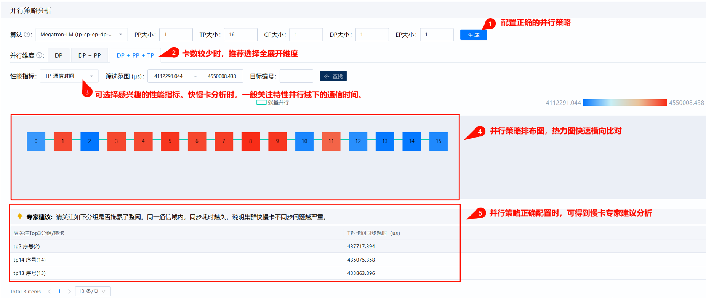
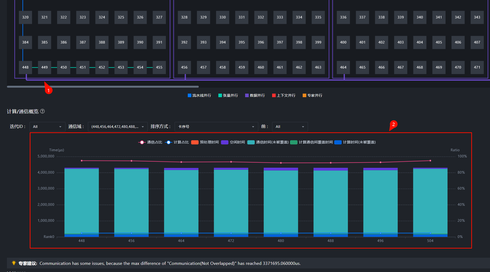
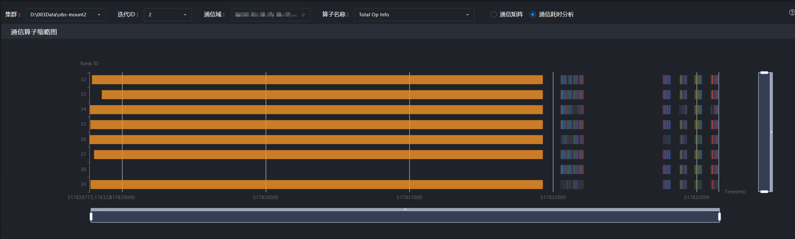
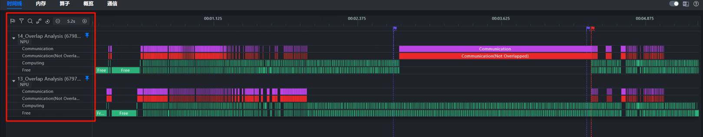

# Locating Cluster Fast/Slow Rank Issues Based on MindStudio Insight

<!-- md-trans-meta sourceCommit=7f4e7fbd5f80d88967d0db5ef23d9552b555926a translatedAt=2026-08-12T02:56:40.671Z pushedAt=2026-08-12T02:57:18.019Z -->

## Background

In distributed training or multi-rank inference scenarios, the overall cluster performance is typically constrained by the slowest rank. When certain ranks lag significantly in computation, communication, or host-side dispatch rates, faster ranks stall at synchronization points. This manifests as increased communication wait time, longer step latency, and reduced cluster throughput.

The root cause of fast/slow rank issues may stem from load imbalance, communication link anomalies, host dispatch bottlenecks, parallel strategy configuration mismatches, or input data distribution differences. Viewing the Timeline of a single rank in isolation often reveals only partial symptoms; it is necessary to narrow down the scope layer by layer using the **Overview**, **Communication**, and **Timeline** views.

This case follows a clear analytical workflow—**Summary** to detect inter-rank performance discrepancies, **Communication** to identify wait/synchronization anomalies, **Timeline** to compare fast and slow ranks, and finally a determination of **high load on the slow rank**. It demonstrates how to use MindStudio Insight to diagnose slow-rank issues in a cluster.

## Analysis Methodology

For cluster slow rank issues, it is recommended to follow the sequence of "first examine the global view, then break down by communication group, and finally pinpoint on the Timeline":

1. **Locate anomalous ranks on the Overview interface**: Use the heatmap, duration proportion, and collapsed view to quickly identify ranks with significantly abnormal computation, communication, scheduling, or idle time.

2. **Confirm synchronization on the Overview and Communication interfaces**: Examine communication duration, wait or synchronization time, and transmission time proportions to determine whether performance degradation is related to a specific communication group or communication operator.

3. **Jump to the Timeline interface to compare slow and fast ranks**: Select the fast and slow ranks within the same step, pin key units to the top, and compare the distribution of computation, communication, and idle gaps.

4. **Perform box selection statistics and issue tracing**: Perform box selection statistics on the anomalous time period, compare the hardware task count, operator duration, and issue link, and determine whether load imbalance or a host bottleneck exists.

5. **Verify the root cause in combination with model logic**: Return to the parallel strategy, data partitioning, operator distribution, and business code to confirm whether the anomalous load is expected and whether it can be avoided.

## Data Preparation

Before analysis, import cluster scenario profile data. If the data directory contains `cluster_analysis_output`, MindStudio Insight reads the cluster analysis results from it; if the directory does not exist, the tool generates the corresponding cluster analysis results during import.

Before performing analysis, it is recommended to confirm the following information:

- The profile data covers the step or time period in which the issue occurred.

- The parallel strategy parameters are consistent with the actual training or inference configuration of the model, such as DP, TP, and PP dimension configurations.

- The mapping between ranks and physical nodes/devices is clear, facilitating subsequent determination of whether slow ranks are concentrated on a specific node or communication group.

- For large-scale cluster data, prioritize using the collapsed view or simplified data for global localization, avoiding direct rank-by-rank inspection across the full dataset.

## Step 1: Identifying Anomalous Ranks on the Summary Interface

After importing cluster data, first go to the **Summary** interface to observe the overall cluster performance. The **Summary** interface is suitable for quickly comparing the computation, communication, and scheduling durations across different ranks horizontally.

**Figure 1**  Summary interface

Focus on the following symptoms:

- The **computing time proportion of certain ranks is significantly higher than that of other ranks**.

- Some ranks have a **high proportion of idle time or scheduling time**, indicating a possible dispatch bottleneck on the host.

- The **average communication time fluctuates significantly** under certain communication groups, indicating possible communication asynchrony.

- In the heatmap, the color of a few ranks deviates noticeably from that of other ranks, indicating outliers regarding that metric.

When communication time fluctuation occurs, it is necessary to distinguish between "slow ranks" and "fast ranks waiting for slow ranks":

- Slow ranks typically exhibit high computing or dispatch latency, and their own communication time proportion is not necessarily the highest.

- A fast rank may complete computing earlier but wait for the slow rank at the collective communication synchronization point, resulting in increased wait or synchronization time.

Therefore, you cannot directly determine that a rank is the root cause rank solely based on the longest total communication operator duration. You need to analyze it together with computation, idle, and wait times.

## Step 2: Confirming the Anomalous Communication Group on the Summary and Communication Interfaces

After entering the **Communication** interface, examine the communication matrix and communication duration analysis around the anomalous step or anomalous rank.

It is recommended to analyze in the following order:

1. View the network-wide link display on the **Summary** page to confirm whether a slow link or slow node exists.

2. Click a communication group flow to observe the proportion of transmission time and wait or synchronization time in the **Computation/Communication Overview**.

3. Right-click a communication group flow to enter the communication duration analysis for a specific communication group.

4. Compare the communication times of different ranks within the same communication group.

**Figure 2** Decomposed Computation/Communication Overview by communication group

**Figure 3** Communication Duration Analysis

If the wait or synchronization time increases for most ranks in a communication group, while the computing or dispatch duration is relatively high for a few ranks, this generally indicates a fast/slow rank issue within that communication group. In this case, you can jump from the **Communication** interface to the **Timeline** interface to locate the specific time range where the anomalous communication operator resides.

## Step 3: Comparing Fast and Slow Ranks on the Timeline Interface

On the Timeline, select a fast rank and a slow rank from the same step for comparison. It is recommended to pin the following units to the top for easier horizontal observation:

- `Overlap Analysis` unit: Observe whether computing and communication tasks are fully overlapped.

- `Communication` unit: Observe communication operators, Notify Wait, and other synchronization wait events.

- `Ascend Hardware`-related units: Observe the number of hardware tasks and their execution duration.

- Host API or dispatch-related units: Observe the operator dispatch rhythm and whether there are obvious idle bubbles.

**Figure 4**  Pinning overlap analysis units of slow rank and fast rank  

Focus on the following during comparison:

- Whether the slow rank has more computing operators or longer computing tasks.

- Whether the fast rank experiences prolonged waiting at communication synchronization points.

- Whether there are noticeable gaps in the host-side dispatch of the slow rank, causing device-side bubbles.

- Whether there is a significant difference in the hardware task count across different ranks within the same time period.

If the slow rank carries more computing operators in the anomalous step, or if certain operators take significantly longer to execute than on other ranks, load imbalance should be suspected first. If the computing load is similar across ranks but some ranks exhibit larger dispatch gaps, prioritize investigating host-bound or scheduling issues.

## Step 4: Using Box Selection Statistics to Identify Load Differences

On the **Timeline**, perform box selection statistics on the anomalous time segment to separately count the hardware task count, operator duration, and communication wait time for the slow rank and the fast rank.

**Figure 5**  Box selection statistics

Typical judgment methods are as follows:

- **Load imbalance**: The slow rank has more operators, or the key computing operators take significantly longer; the fast rank mainly shows synchronization.

- **Host dispatch bottleneck**: Bubbles exist on the device of the slow rank, with noticeable gaps between host APIs or the dispatch links.

- **Communication link anomaly**: The computational loads are similar, but the transmission time for a specific rank or communication group is significantly longer.

- **Parallel strategy mismatch**: The distribution of anomalous ranks correlates with parallel domain partitioning such as DP, TP, and PP, and the anomaly is concentrated within a specific communication group or a particular type of parallel group.

If the tool supports async_npu dispatch connections, you can further trace hardware tasks back to their corresponding Python APIs to identify which section of model code or data processing logic the anomalous task originates from.

## Example Analysis Conclusion

In this case, the **Summary** interface shows that certain ranks have higher computing duration and idle time ratios than other ranks; the **Communication** interface shows high wait or synchronization time in the corresponding communication group; and the **Timeline** comparison reveals that the slow rank carries more computing operators within the anomalous Step, while the fast rank waits at the collective communication synchronization point.

Therefore, this is a typical fast/slow rank issue. The direct cause is inter-rank load imbalance: the slow rank completes computing later than other ranks, causing the overall cluster step time to be prolonged by the slow rank.

## Optimization Suggestions

For fast/slow rank issues caused by load imbalance, optimization can be pursued in the following directions:

- Check the data partitioning logic to prevent certain ranks from consistently processing larger batches, longer sequences, or more complex samples.

- Check the model parallel strategy to confirm that configurations such as DP, TP, and PP are consistent with the actual training or inference task.

- For operators with significantly high load, consult with model developers to determine whether conditional branches, dynamic shapes, redundant computations, or imbalanced expert routing exist.

- If anomalies are concentrated on the host dispatch, continue the analysis of CPU scheduling and operator dispatch links by referring to the host Bound issue locating method.

- If anomalies are concentrated on the communication link, continue analyzing specific communication group, communication operators, and link transmission efficiency in the Communication interface.

After optimization, it is recommended to re-collect profile data from the same scenario, compare the **Summary**, **Communication**, and **Timeline** before and after optimization, and confirm that the slow rank computing duration has decreased, the wait or sync time has shortened, and the step each rank tends to be consistent.

## Reference

- [System Tuning](../user_guide/system_tuning.md)

- [Common Units and Interfaces Introduction](./Timeline_Common_Lanes_and_Interface.md)

- [Fast/Slow Rank Issue Locating Method](https://www.hiascend.com/document/detail/en/mindstudio/830/practicalcases/GeneralPerformanceIssue/toolsample6_019.html?framework=mindspore)

- [Summary: Cluster Performance Analysis](https://www.hiascend.com/document/detail/en/mindstudio/830/practicalcases/GeneralPerformanceIssue/toolsample6_031.html?framework=mindspore)

- [Fast/Slow Rank Locating Timeline Operation Case](https://www.hiascend.com/document/detail/en/mindstudio/830/practicalcases/GeneralPerformanceIssue/toolsample6_034.html?framework=mindspore)
  