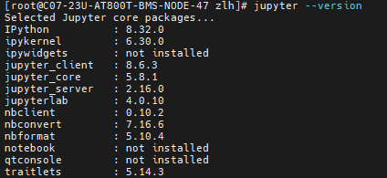
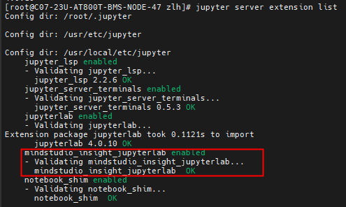
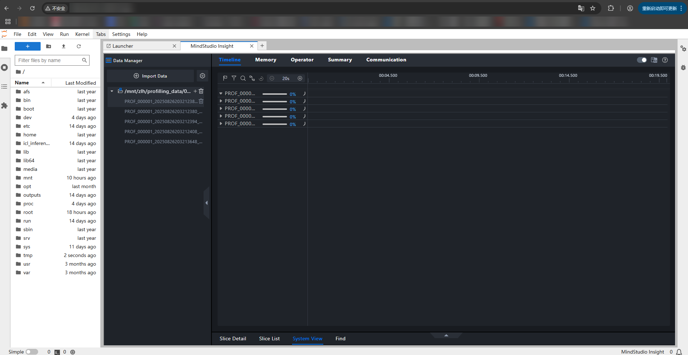
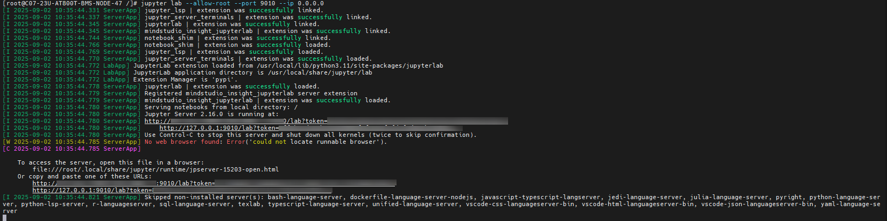

# JupyterLab Installation Guide

<!-- md-trans-meta sourceCommit=49122e1f1d6621e5b8a8bbc1c0fdae9583659f48 translatedAt=2026-08-12T11:36:38.088Z pushedAt=2026-08-12T11:57:31.054Z -->

**Contents:**

1. [Background](#1)

2. [References](#2)

3. [Installation and Usage](#3)

   1. [Environment Preparation](#3.1)

   2. [Package Preparation](#3.2)

   3. [Package Installation and Service Verification](#3.3)

   4. [Starting the Service](#3.4)

      1. [Manually Modify the Code to Specify the IP](#3.4.1)

      2. [Start Jupyter](#3.4.2)

4. [Reference](#reference)

<h2 id="1">1. Background</h2>
For performance testing of large models, the collected profile data is often very large, or there may be scenarios where it cannot be exported from the server. In such cases, using a graphical interface for analysis is difficult.

MindStudio Insight provides a Jupyter-based plugin that allows you to analyze profile data locally through a web interface without downloading it from the server.

<h2 id="2">2. References</h2>
[MindStudio Insight Official Guide](https://www.hiascend.com/forum/thread-0255181207629753032-1-1.html)

<h2 id="3">3. Installation and Usage</h2>
<h3 id="3.1">3.1 Environment Preparation</h3>
```bash
# 1. Use pip to install jupyterlab (for Python 3.8 or later, install jupyterlab without specifying a version; jupyterlab must satisfy the condition jupyterlab>=4,<5)
$ pip install jupyterlab
# 2. Use pip to install a specific version of jupyterlab, such as jupyterlab-4.0.11
$ pip install jupyterlab==4.0.11
```

> After installation, check the jupyterlab version.
>
> ```bash
> $ jupyter lab --version
> ```
>
> 

<h3 id="3.2">3.2 Installation Package Preparation</h3>
Download the .whl package of the specified version of MindStudio Insight Jupyter by referring to the link provided in <a href="#2">Section 2</a>.

<h3 id="3.3">3.3 Package Installation and Service Verification</h3>
```bash
# Install the mindstudio_insight_jupyterlab plugin package
$ pip install mindstudio_insight_jupyterlab-{version}-py3-none-{platform}.whl # version is the version number, and platform is the compatible platform
```

> After installation, check whether the installation is successful.
>
> ```bash
> $ jupyter server extension list
> ```
>
> 
> If the extension is not started after installation, use the following command to start it:
>
> ```bash
> $ jupyter server extension enable mindstudio_insight_jupyterlab --sys-prefix
> ```

<h3 id="3.4">3.4 Service Startup</h3>
<h5 id="3.4.1">3.4.1 Manual IP Modification </h5>

```bash
$ vi /usr/local/lib/python3.11/site-packages/mindstudio_insight_jupyterlab/handlers.py
```

Modify the IP addresses on lines 66 and 89 to `"0.0.0.0"`.


<h5 id="3.4.2">3.4.2 Jupyter Startup</h5>
```bash
$ jupyter lab --allow-root --port 9010 --ip 0.0.0.0
```



Copy the "URL+token" provided in the echo output and access it in your local browser.


Import profile data to start analysis.



<h2 id="reference">Reference</h2>
[1] MindStudio Insight. MindStudio Insight official guide. 2025.04. Wiki. [https://www.hiascend.com/forum/thread-0255181207629753032-1-1.html](https://www.hiascend.com/forum/thread-0255181207629753032-1-1.html)
