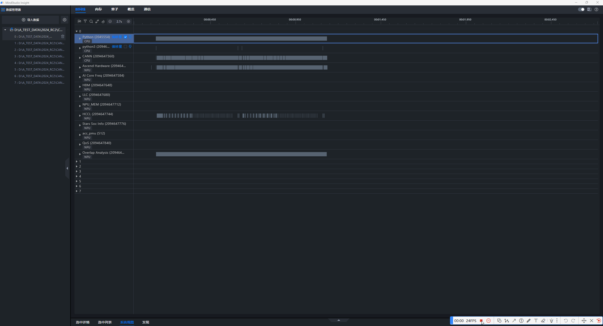
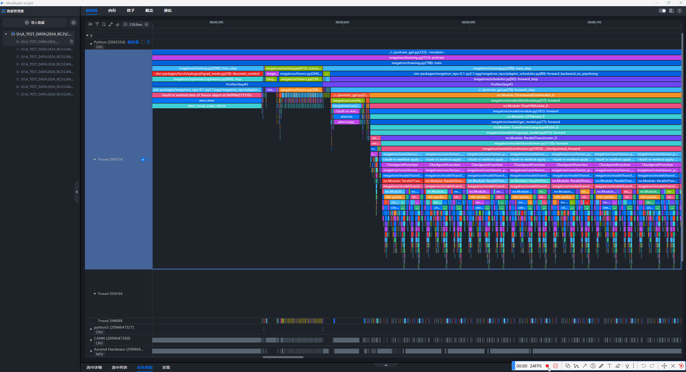
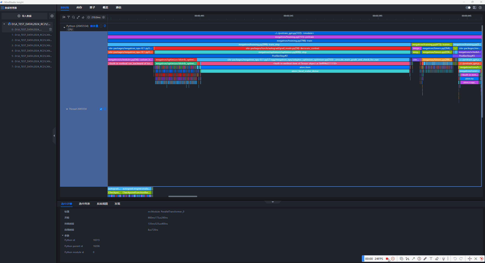
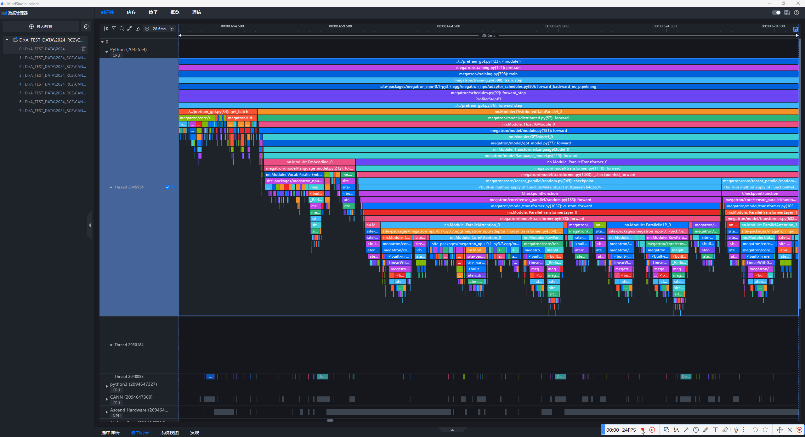
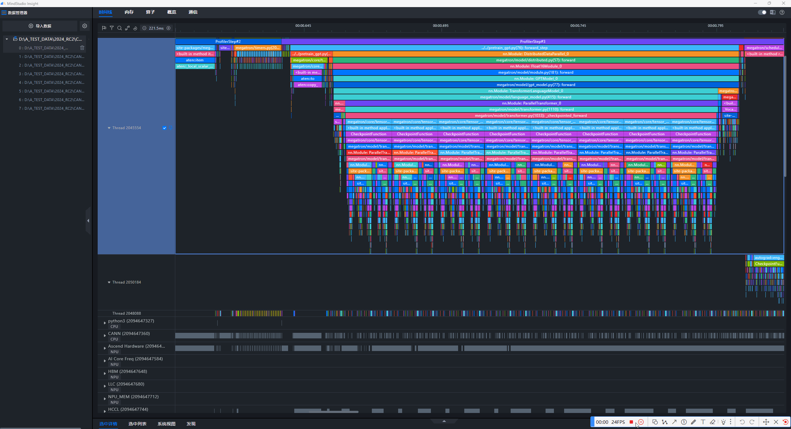
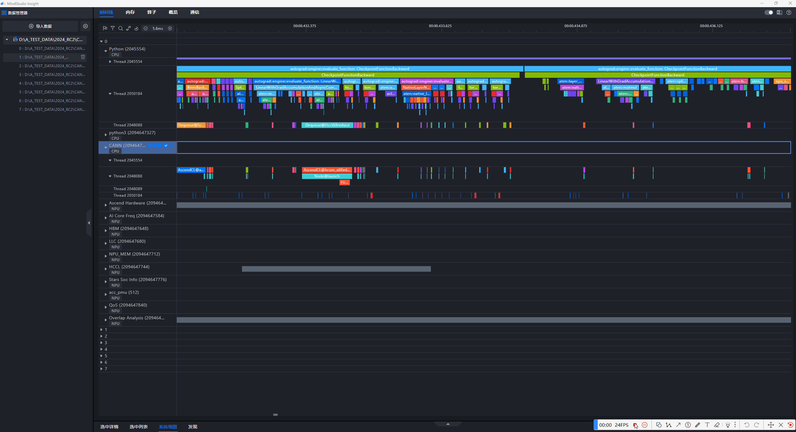

# Keyboard Shortcuts

<!-- md-trans-meta sourceCommit=81c78c7bc5b57be8952a8eb0685833246e436fe7 translatedAt=2026-08-12T11:36:38.186Z pushedAt=2026-08-12T11:57:31.069Z -->

**Software version: 8.0.RC1**

At MindStudio Insight, we are committed to delivering a smoother and more efficient user experience. To help you quickly master the powerful tool, this document introduces a selection of commonly used keyboard shortcuts that will accelerate your workflow and boost overall productivity.

If you want to quickly view or learn about all current keyboard shortcuts, you can click the **help button** in the upper-right corner of the interface and select **"Keyboard Shortcuts"** from the drop-down menu to open the shortcut description pop-up window. This pop-up window displays the corresponding shortcut descriptions by module, making it easy for you to find the desired shortcuts.

The following sections detail some commonly used keyboard shortcuts, including:

**1. Basic Functions**

Zoom in/out on the timeline, move the timeline left/right, scroll the page up/down, undo a zoom or pan, reset the timeline, collapse/expand the bottom panel

**2. Box Selection**

Zoom the box-selected region to fit the screen, box-select a segment and zoom it to fit the screen, set or cancel a box selection region based on the currently selected operator

**3. Alignment**

Align the start time and end time of the selected operator with the baseline operator.

**4. Source Code View - Find in Source Code**

## Timeline Page

Applicable scenarios: system tuning, operator tuning

### **1. Basic Functions**

**Zoom In Timeline**: `W`

* **Description**: Press `W` to zoom in on the Timeline, allowing you to view finer-grained data.

**Zoom Out Timeline**: `S`

* **Description**: Press `S` to zoom out on the Timeline, helping you quickly view a larger time range.

**Screenshot Example:**

**Move Timeline Left**: **`A`** or **`←`** or `<strong>Ctrl</strong>(Windows)<strong>/</strong> <strong>Cmd</strong>(Mac) <strong>+ Drag</strong>

* **Description**: Press **`A`** or **`←`**, or hold `<strong>Ctrl</strong>(Windows)<strong>/</strong> <strong>Cmd</strong>(Mac)` and then **drag** the page to pan left and view the content on the left side.

**Move Timeline Right**: **`D`** or **`→`** or `<strong>Ctrl</strong>(Windows)<strong>/</strong> <strong>Cmd</strong>(Mac)`<strong>+ Drag</strong>

* **Description**: Press **`D`** or **`→`**, or hold `<strong>Ctrl</strong>(Windows)<strong>/</strong> <strong>Cmd</strong>(Mac)` and then **drag** the page to pan right and quickly view the content on the right side.

**Screenshot Example:**

**Scroll Page Up**: `↑`

* **Description**: Press the up arrow `↑` to scroll the page upward, which is useful for viewing content at the top of the page.

**Scroll Page Down**: `↓`

* **Description**: Press the arrow key `↓` to scroll the page downward and quickly view the content at the bottom of the page.

**Screenshot Example:**

**Undo a Zoom or Pan**: `Backspace`

* **Description**: If you want to undo the previous zoom operation, press `Backspace` to restore the previous zoom state.

**Screenshot Example:**

**Reset Timeline**: `<strong>Ctrl</strong>(Windows)<strong>/</strong> <strong>Cmd</strong>(Mac)`​`<strong>+ 0</strong>`

* **Description**: Press `<strong>Ctrl</strong>(Windows)<strong>/</strong> <strong>Cmd</strong>(Mac)`​`<strong>+ 0</strong>` to reset the timeline to its initial state and restore the default view.

**Screenshot Example**:

**Collapse/Expand Bottom Panel**: `Q`

* **Description**: Press `Q` to quickly collapse or expand the bottom panel, saving screen space and improving work efficiency.

**Screenshot Example:**

### 2. Box Selection

Box Selection description: After box-selecting some operators, you can view the corresponding statistics in the "Bottom Panel - Selected List". Click "More" to jump to the specific operator position on the timeline.

<strong>Zoom the Box-selected Region to Fit the Screen</strong>: <code>Shift + Z</code>

* <strong>Description</strong>: After box-selecting a segment, press <code>Shift + Z</code> to zoom that region to full screen, helping you focus on the selected region.

**Screenshot Example:**

**Box Select a Segment and Zoom to Fit Screen**: `<strong>Alt</strong>(Windows)<strong>/</strong> <strong>Option</strong>(Mac)` `<strong>+ Drag</strong>`

* **Description**: Hold down the `<strong>Alt</strong>(Windows)<strong>/</strong> <strong>Option</strong>(Mac)` key and **drag** the mouse to zoom in on the box selection area for greater precision.

**Screenshot Example**:

**Set or Cancel the Box Selection Region Based on the Currently Selected Operator**: `M`

* **Description**: Press `M` to set or cancel the box selection region based on the currently selected operator, allowing you to quickly define the scope of analysis.

**Screenshot Example:**

### 3. Alignment

The collected NPU data may have inter-rank desynchronization caused by clock source errors. You can use MindStudio Insight to align them with one click. During alignment, units with the same deviceID share the offset.

**Align the start time of the selected operator with the start time of the baseline operator**: `L`

* **Description**: Select an operator as the baseline operator, right-click and choose "Set base slice", select the operator to be aligned in a different secondary unit, and press `L`. The start time of the selected operator will be aligned with the start time of the baseline operator.

**Screenshot Example:**

**Align the end time of the selected operator with the end time of the baseline operator**: `R`

* **Description**: Select an operator as the baseline operator, right-click "Set base slice", select the operator to be aligned in a different secondary unit, and press `R`. The end time of the selected operator will be aligned with the end time of the baseline operator.

**Screenshot Example:**

## Source Code Page

Applicable scenario: operator tuning

**Search in Source Code**: `<strong>Ctrl</strong>(Windows)<strong>/</strong> <strong>Cmd</strong>(Mac)`​`<strong>+ F</strong>`

* **Description**: Press `<strong>Ctrl</strong>(Windows)<strong>/</strong> <strong>Cmd</strong>(Mac)`​`<strong>+ F</strong>` to bring up the search box, allowing you to quickly search for specified content in the source code and reduce search time.

**Screenshot Example**

