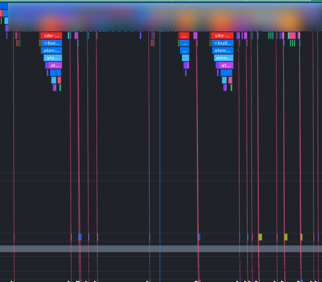
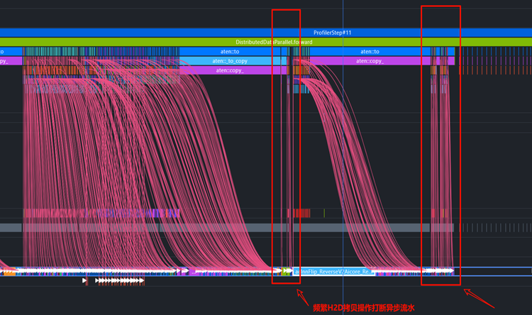
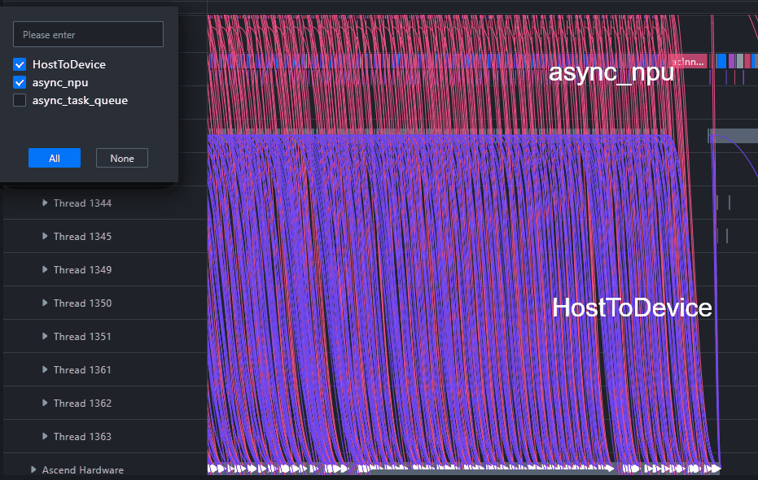
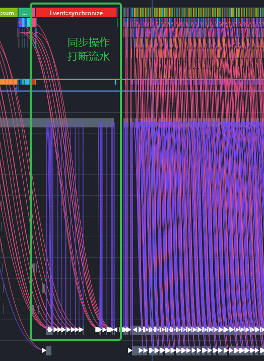

# Single-Rank Top-Down Operator Dispatch Bottleneck Analysis

<!-- md-trans-meta sourceCommit=98733f8b413179602cfeaca938e1855022a2f898 translatedAt=2026-08-12T11:37:49.807Z pushedAt=2026-08-12T11:57:31.067Z -->

## Background

In single-rank training or inference scenarios, the device-side computing performance depends not only on the duration of the operators themselves, but also on whether the host can dispatch tasks continuously and in a timely manner. If the host-side dispatch speed is insufficient, bubbles will appear in the device-side pipeline, preventing the AI Core from continuously executing computing tasks. This ultimately manifests as increased overall Step duration and decreased compute utilization.

For single-rank performance issues, a top-down analysis approach is recommended: first determine whether the issue lies in computation, communication, or idle time based on the overall duration proportion, then drill into the Timeline and system views for specific details. This case uses the dispatch bottleneck as an example to illustrate how to start from the overall proportion in Overlap Analysis and progressively locate the operator dispatch link and possible host-side root causes.

## Analysis Methodology

For single-rank top-down analysis, it is recommended to proceed in the following order:

1. **First, examine the overall proportion**: Observe the proportions of Computing, Communication, and Free Time in Overlap Analysis or the statistics view.

2. **Determine the bottleneck type**: If Computing accounts for a high proportion, prioritize analyzing compute operators; if Communication accounts for a high proportion, prioritize analyzing communication or synchronization; if Free Time accounts for a high proportion, prioritize analyzing dispatch, scheduling, or data transfer.

3. **Expand Timeline details**: In the abnormal time range, examine the gaps between units such as host-side API, NPU Runtime, and Ascend Hardware.

4. **Locate operators using the system view**: Search for abnormal operators in the Stats System View or the detail table, and examine operator duration, start time, and dispatch relationships.

5. **Trace the dispatch link**: Enable the async_npu dispatch connection to correlate NPU-layer tasks with Python APIs, and determine whether there is frequent HostToDevice copy, synchronization, or slow host-side dispatch.

Operator dispatch links can generally be classified into two types: ACLOP and ACLNN. During analysis, you do not need to determine the operator type first. Instead, first confirm whether the device bubble corresponds to the host-side dispatch gap, and then identify the specific dispatch path based on the call chain in the Timeline.

- **ACLOP operator dispatch link**: Python layer (`<built-in ...>`) -> Python layer specific operator (`aten::...`) -> Python layer Enqueue -> Python layer Dequeue -> CANN layer `aclopCompileAndExecute` -> CANN layer launch -> Ascend Hardware layer executes the operator.

- **ACLNN operator dispatch link**: Python layer (`<built-in ...>`) -> Python layer specific operator (`aten::...`) -> Python layer Enqueue -> Python layer Dequeue -> CANN layer operator -> CANN layer `Node@launch` -> Ascend Hardware layer executes the operator. CANN layer operator names in the ACLNN path typically start with `aclnn`.

## Step 1: Determining the Idle Proportion through Overlap Analysis

After importing single-rank profile data, first enter the Timeline and view the Overlap Analysis unit or the bottom statistics view. This view can break down the single-rank execution process into three time categories—computation, communication, and idle—making it suitable as the entry point for top-down analysis.

When the Free Time proportion is significantly higher than that of Computing and Communication, it indicates that a large amount of time on the device is spent without executing computing or communication tasks. Ideally, the Free Time proportion should be kept as low as possible, for example, within approximately 10%. If Free Time dominates for an extended period, it is usually necessary to prioritize investigating host-side dispatch or synchronization issues.

**Figure 1** Typical manifestation of a dispatch bottleneck

**Figure 2** Relatively high proportion of Free Time

Focus on the following when making the judgment:

- Whether Free Time appears continuously in chunks, rather than only briefly at step boundaries.

- Whether Computing is frequently interrupted and unable to form a continuous computing pipeline.

- Whether the Communication proportion is relatively low, ruling out the possibility that communication is the dominant factor.

- Whether idle intervals are adjacent to host-side API calls, data transfer, or synchronization operations.

## Step 2: Expanding the Timeline to Observe Dispatch Intervals

After confirming the Free Time anomaly, zoom in on the abnormal Step or abnormal time range in the Timeline, and expand the relevant units on the host and device. A common manifestation of a dispatch bottleneck is noticeable intervals between hardware tasks on the device, where host-side API or runtime calls fail to promptly connect subsequent hardware tasks.

At this point, focus on the following units:

- Python API or framework layer call units: Observe whether upper-layer interfaces frequently trigger synchronization or data transfer.

- NPU Runtime or acl related units: Observe whether host-side dispatch is continuous.

- Ascend Hardware-related unit: Observe whether there are bubbles between tasks on the device.

- Overlap Analysis unit: Confirm the correspondence between bubbles and Computing and Communication.

**Figure 3** Expanding Timeline to view dispatch details

If the HostToDevice connections in the Timeline are nearly vertical and appear frequently, it indicates that there is intensive data transfer or synchronization between the host and the device, which may interrupt the asynchronous pipeline. In such scenarios, it is necessary to further confirm whether there are unnecessary tensor copies, frequent synchronization, data preprocessing blocking, or dispatch overhead caused by dynamic graph logic. If the intervals between Python API or Runtime calls also become longer before and after the bubbles, you can continue tracing the dispatch link within that time period to determine whether the issue occurs in the upper-layer API, Runtime dispatch, or pre-execution waiting on the device.

## Step 3: Locating Specific Operators Using System View

If idle intervals are concentrated before or after certain types of operators, you can go to the Stats System View or the operator details table in the system view, search for the corresponding operator or API, and check its start time, duration, and upstream/downstream relationships.

During analysis, focus on the following:

- Whether the abnormal operator appears repeatedly across multiple steps.
- Whether there is a long host-side wait or data transfer before the abnormal operator.
- Whether the operator dispatch is broken down too finely by fine-grained API calls, causing frequent scheduling on the host.
- Whether there are a large number of short operators, causing the dispatch overhead to be excessively high relative to the computing time.

Through the System View, the bubbles observed in the Timeline can be further associated with a searchable and sortable operator list, making it easier to locate the operators or APIs most worthy of prioritized optimization.

## Step 4: Tracing Python APIs Using async_npu Dispatch Connections

To determine which Python API triggers a task on the device, you can enable async_npu dispatch connections in the Timeline. These connections help developers correlate NPU-layer hardware tasks with host-side call paths, thereby identifying whether the dispatch bottleneck originates from a specific segment of business code.

**Figure 4**  async_npu dispatch connections

**Figure 5**  Frequent interleaving of HostToDevice

In Figure 5, HostToDevice connections appear frequently between computing tasks, indicating that multiple Host-to-Device data transfers occur within a Step. Such transfers consume dispatch windows and may prevent subsequent computing tasks from being queued in advance.

**Figure 6** Python-side synchronization operation interruption flow

In Figure 6, the Python-side synchronization or blocking operations are adjacent to device-side bubbles, indicating that while the host is waiting for results or executing synchronization logic, subsequent tasks on the device are not dispatched in time. Common trigger points include fetching scalars, printing device tensors, synchronously copying data, or waiting for device results in dynamic graph branches.

When using dispatch connections, focus on the following observations:

- Whether a single Python API triggers a large number of fragmented hardware tasks.

- Whether HostToDevice data transfers are frequently interleaved between computing tasks.

- Whether there are synchronization APIs in the dispatch link that prevent subsequent tasks from being queued asynchronously.

- Whether the abnormal API is related to data conversion, printing, value retrieval, control flow, or dynamic graph branching.

If it is confirmed that a certain Python API causes frequent HostToDevice copies or synchronization, you should return to the model code to check whether data transfer can be reduced, small operators can be merged, unnecessary synchronization can be avoided, or part of the logic can be migrated to the device for execution.

## Example of Analysis Conclusion

In this case, the top-down analysis first identified that the Free Time proportion in Overlap Analysis was significantly higher than that of Computing and Communication, indicating that the bottleneck was neither the computing operators themselves nor communication-dominant, but rather substantial idle time on the device. After further zooming into the Timeline, noticeable dispatch gaps between hardware tasks were observed, along with frequent HostToDevice connections. By tracing back through async_npu dispatch connections, the abnormal tasks were linked to specific Python APIs.

Therefore, this issue is a typical single-rank dispatch bottleneck. The direct cause is that frequent data transfer or synchronization operations on the host interrupt the asynchronous pipeline, preventing the device from continuously executing computing tasks.

## Optimization Suggestions

For operator dispatch bottlenecks, optimization can be pursued in the following directions:

- Reduce HostToDevice data transfer in the training or inference main loop, and avoid frequently creating or copying device tensors within a step.

- Avoid unnecessary synchronization operations, such as frequent scalar retrieval, printing device tensors, blocking data reads, and so on.

- Merge excessively fine-grained small operators or small-scale API calls to reduce host-side scheduling and dispatch overhead.

- Check the data preprocessing and input pipeline to prevent host-side data preparation from blocking device-side computation.

- Review dynamic graph control flows or conditional branches to reduce unstable dispatch paths within each step.

After optimization, it is recommended to re-collect profile data and compare the Overlap Analysis before and after optimization: the Free Time proportion should decrease, the Computing proportion should increase, and the bubbles between hardware tasks in the Timeline should be reduced.

## Reference

- [System Tuning](../user_guide/system_tuning.md)

- [Common Units and Interfaces Introduction](./Timeline_Common_Lanes_and_Interface.md)

- [Observing Dispatch Bottlenecks](https://www.hiascend.com/document/detail/en/mindstudio/830/practicalcases/GeneralPerformanceIssue/toolsample6_022.html?framework=mindspore#ZH-CN_TOPIC_0000002535807019__section1664916388559)

- [Issue #324: Add Case-Specific Documentation](https://gitcode.com/Ascend/msinsight/issues/324)
