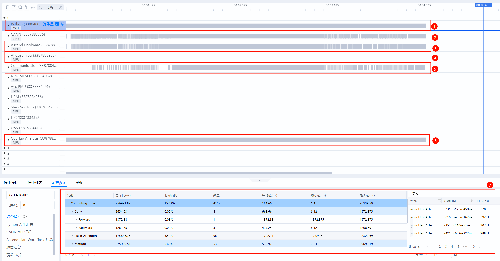
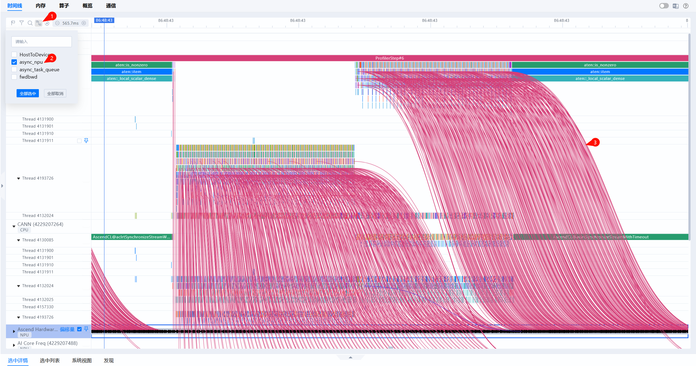
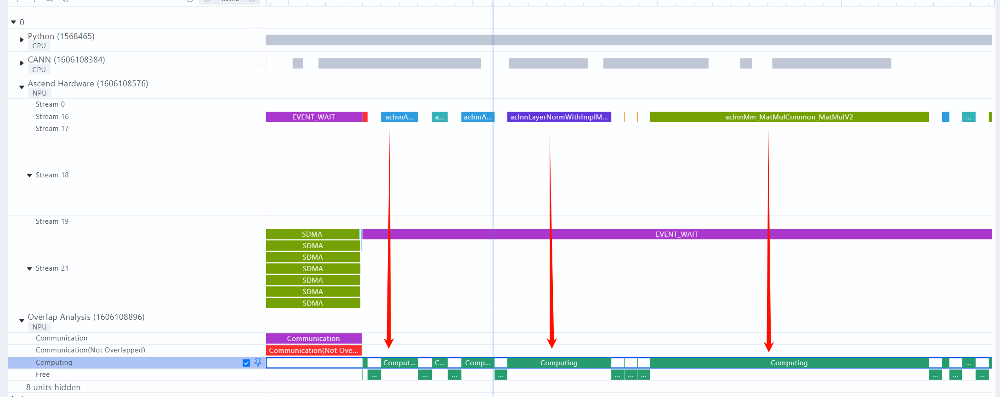
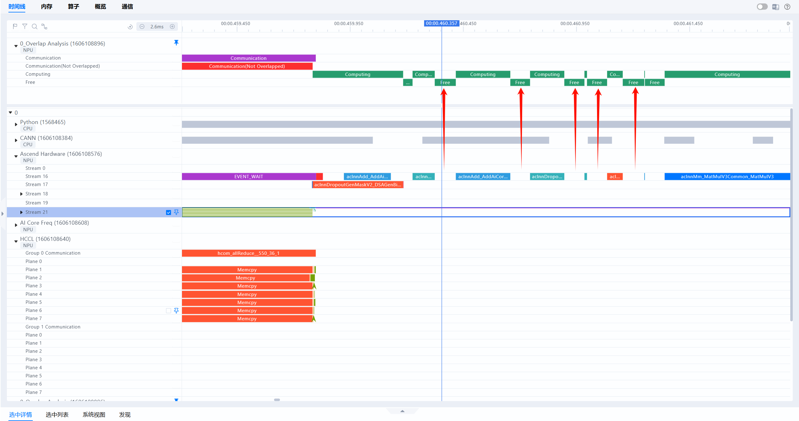
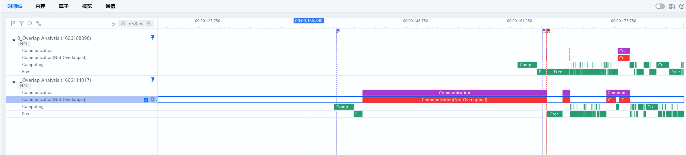

# Timeline Unit Overview

<!-- md-trans-meta sourceCommit=e99edc859b9c75396352963171ba410aa66e4e0d translatedAt=2026-08-12T11:38:01.286Z pushedAt=2026-08-12T11:57:31.077Z -->

This document addresses the following questions in system tuning scenarios:

1. What are the common units and interfaces of Timeline, and how do they relate to each other?

2. What is Overlap Analysis?

3. What issues is Timeline commonly used to observe?

## What Are the Common Units and Interfaces of Timeline?

Timeline lays out the detailed runtime conditions of the host and device during training or inference on a time axis, intuitively presenting the API latency on the host and the task latency on the device. The common units and interfaces are shown in the following figure and table.

| Serial Number | Name                         | Description                                                                                                                                     |
| ---- | ---------------------------- | ---------------------------------------------------------------------------------------------------------------------------------------- |
| 1    | Python Unit (First-Level Pipeline)       | Displays Python-layer code. When the with stack switch is enabled during collection, the code call stack can be viewed.                                                                             |
| 2    | CANN Unit (Second-Level Pipeline)         | Collects data such as ACL API execution, GE fusion, and Runtime. Python-side operators are dispatched from the First-Level Pipeline to this Second-Level Pipeline, and tasks are dispatched to the NPU layer after being dequeued from the Second-Level Pipeline.                      |
| 3    | Ascend Hardware (NPU Layer)     | (Device) Records the execution sequence of tasks such as computing and communication that occur on the NPU.                                                                                |
| 4    | AI Core Freq                 | Indicates the AI Core frequency, which can be used to observe frequency reduction issues.                                                                                                        |
| 5    | Communication                | Formerly known as the HCCL Unit. It records NPU-layer communication events and corresponds one-to-one with the communication sub-units of Ascend Hardware. The data here is reported by components such as HCCL. This unit can be viewed when locating communication details.             |
| 6    | Overlap Analysis (Overlap Analysis) | Vertically projects the computing and communication tasks of Ascend Hardware (NPU Layer) onto this unit, yielding a breakdown of computation, communication, and idle time. It is commonly used for quickly comparing the sources of differences in computation, communication, and idle time across different ranks. |
| 7    | Statistics View                     | Summarizes statistical information at the **single-rank dimension**. Different ranks can be switched via the **rank serial number** drop-down list on the left.                                                                     |

## What Are the Relationships Between Units?

During model execution, operators are dispatched from the Python layer (First-Level Pipeline) to the CANN layer (Second-Level Pipeline). By viewing the async_task_queue connections, the enqueue and dequeue relationships of operator tasks can be observed.

Subsequently, operators are dispatched from the CANN layer (Second-Level Pipeline) to the NPU layer, namely the Ascend Hardware unit. By viewing the HostToDevice connections, the operator dispatch relationships can be observed:

In addition, the Timeline provides the connection relationship `async_npu` from the Python layer to the NPU layer, which facilitates tracing upward to the specific Python-side code location when locating NPU performance bottlenecks.

## What Is Overlap Analysis?

Events at the NPU layer (i.e., the Ascend Hardware layer) can be broadly classified into two types: computing events and communication events. Overlap Analysis refers to the categorized statistics obtained after vertical projection of the NPU layer. Computing represents the vertical projection of computing operators.

Communication represents the vertical projection of communication operators. (Note: For communication operators, it is more intuitive to directly view the Communication unit (formerly known as the HCCL unit), which records NPU-layer communication events and corresponds one-to-one with the communication sub-units of Ascend Hardware. These events are reported by components such as HCCL.):

Communication Not Overlapped refers to the communication time not covered by computation. When such time accounts for an excessively high proportion, consider increasing the degree of computation-communication overlap.

Free represents the time during which the NPU is neither computing nor communicating, i.e., idle time. In an ideal scenario, the pipeline on the NPU side should avoid idle time as much as possible, minimizing scenarios where the NPU waits for the host. If the Free Time proportion is high (for example, exceeding 10%), it indicates a Host dispatch bottleneck, where the NPU is waiting for the host to dispatch tasks. In such cases, optimization should focus on the host, such as pipeline optimization, core binding optimization, and enabling CPU high-performance mode.

## What Issues Are Timeline Commonly Used to Observe?

### Root Cause Identification of Fast/Slow Ranks

The Timeline is commonly used to further identify **the specific sources of differences between fast and slow ranks**. In an ideal scenario, the computing time of each rank is relatively close, and no rank should complete its computing significantly earlier and wait for another rank for an extended period. When certain ranks exhibit communication operators with long durations, and the primary duration of these communication operators originates from waiting (for example, Notify Wait events), the possibility of a fast/slow rank issue should be considered first.

The specific identification process is as follows:

1. In the communication operator thumbnails on the Communication tab, identify the ranks and communication operators with significant time consumption differences, and navigate to the Timeline interface based on the communication operators.

   

2. Pin and compare the Overlap Analysis units of the fast rank and the slow rank respectively to identify the source of the difference at the Ascend Hardware layer (NPU layer).

   

3. In the Timeline interface, select the <code>async_npu</code> dispatch connection line, and trace upward from the NPU layer through the connection relationships to identify the source of the difference at the Python layer.

   For a specific case of using the Timeline to locate fast/slow ranks, refer to: [Timeline Operation Case for Fast/Slow Rank Locating - MindStudio 8.1.RC1 - Ascend Community](https://www.hiascend.com/document/detail/en/mindstudio/81RC1/practicalcases/GeneralPerformanceIssue/toolsample6_034.html)

### Observing Dispatch Bottlenecks

The Timeline is a powerful tool for observing dispatch issues. In an ideal scenario, the compute pipeline on the NPU runs continuously without the NPU waiting for the CPU. Once dispatching slows down, the pipeline cannot operate, and the AI Core compute utilization decreases. The ideal Free Time proportion is approximately within 10%.

The typical manifestations of a dispatch bottleneck on the Timeline are as follows.

1. In the Overlap Analysis, the Free Time proportion far exceeds that of Computing and Communication, as shown in the following figure:

   

   

2. The `async_npu` dispatch connection is nearly vertical, as shown in the following figure:

For dispatch bottlenecks, refer to [Scheduling Optimization](https://www.hiascend.com/document/detail/en/Pytorch/latest/ptmoddevg/trainingmigrguide/FrameworkPTAdapter/26.0.0/en/pytorch_model_migration_fine_tuning/pipeline_opt.md) for general optimization approaches in PyTorch scenarios, and refer to [Dispatch Anomaly Analysis](https://gitcode.com/Ascend/docs/blob/master/MindStudio/26.0.0/cases/general_performance_issue_troubleshooting_guide/solution_to_top3.md#dispatch-anomaly-analysis) for troubleshooting approaches.
