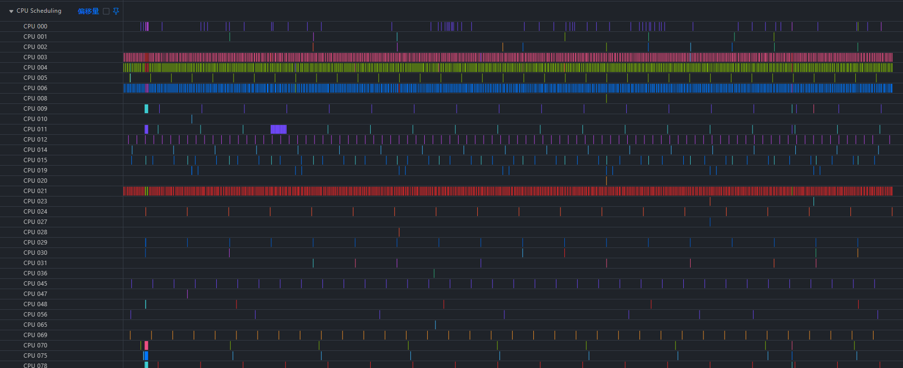
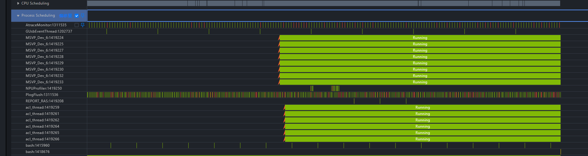
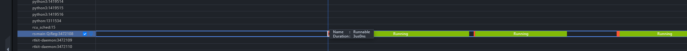
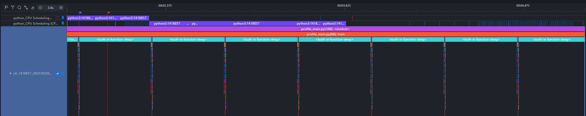

# Host Bound Issue Analysis Based on Linux Kernel Trace

<!-- md-trans-meta sourceCommit=49122e1f1d6621e5b8a8bbc1c0fdae9583659f48 translatedAt=2026-08-12T11:36:40.310Z pushedAt=2026-08-12T11:57:31.065Z -->

## Background

In large models, the CPU is primarily responsible for task dispatch, while the NPU handles task execution. In live network issues, Host Bound is a frequently occurring issue in both inference and training domains. In profiling, a Host Bound model often manifests as prolonged dispatch time, with corresponding large bubbles appearing on both the device and host, as shown in the following figure:

Host Bound issues are typically analyzed by collecting ftrace data to examine CPU scheduling, but there is a lack of tools to integrate ftrace data with profiling information. MindStudio Insight provides tool scripts that enable simultaneous display of both types of data, improving the efficiency of Host Bound issue identification.

## Identification Approach

1. Three common approaches: CPU core binding, pipeline optimization, and memory allocation library replacement.

2. Collect ftrace and profile data simultaneously (in container scenarios, ftrace and profiling must be executed within the same container).

3. Convert ftrace data into a format recognizable by MindStudio Insight.

4. Import both into MindStudio Insight to analyze process scheduling.

## Model Profile Data Collection

References:
[msprof General Collection Commands - CANN Commercial Edition 8.2.RC1 - Ascend Community (hiascend.com)](https://www.hiascend.com/document/detail/en/canncommercial/82RC1/devaids/Profiling/atlasprofiling_16_0010.html#ZH-CN_TOPIC_0000002370195313__section2176155111323)
[PyTorch Training/Online Inference Scenario Performance Analysis - Ascend Community (hiascend.com)](https://www.hiascend.com/document/detail/en/canncommercial/82RC1/devaids/Profiling/atlasprofiling_16_0006.html)

## Linux Kernel ftrace Data Collection

### **1. Introduction**

The Linux kernel has various built-in tracing tools. Among them, ftrace, a tracing framework introduced into the mainstream kernel starting from version 2.6.27, can be used to monitor and debug various events occurring in the kernel, helping developers deeply analyze the internal behavior of the system at runtime. ftrace supports multiple tracers, such as function call tracing, context switch tracing, and interrupt latency analysis, which can effectively assist in locating kernel-mode performance issues and scheduling anomalies. In the following example, we enable only CPU process scheduling-related events (sched) for data collection, and the specific output is as follows:

```bash
# tracer: nop
#
# entries-in-buffer/entries-written: 112246/112246   #P:192
#
#                                _-----=> irqs-off
#                               / _----=> need-resched
#                              | / _---=> hardirq/softirq
#                              || / _--=> preempt-depth
#                              ||| / _-=> migrate-disable
#                              |||| /     delay
#           TASK-PID     CPU#  |||||  TIMESTAMP  FUNCTION
#              | |         |   |||||     |         |
   kworker/145:1-1023940 [145] d.... 1725926.126419: sched_stat_runtime: comm=kworker/145:1 pid=1023940 runtime=23230 [ns] vruntime=3450824076020452 [ns]
   kworker/145:1-1023940 [145] d.... 1725926.126423: sched_switch: prev_comm=kworker/145:1 prev_pid=1023940 prev_prio=120 prev_state=I ==> next_comm=release_thread next_pid=2813514 next_prio=120
  release_thread-2813514 [145] d.... 1725926.126427: sched_stat_runtime: comm=release_thread pid=2813514 runtime=8880 [ns] vruntime=468045121382 [ns]
  release_thread-2813514 [145] d.... 1725926.126429: sched_switch: prev_comm=release_thread prev_pid=2813514 prev_prio=120 prev_state=S ==> next_comm=swapper/145 next_pid=0 next_prio=120
          <idle>-0       [145] d.h.. 1725926.126478: sched_waking: comm=release_thread pid=2813514 prio=120 target_cpu=145
          <idle>-0       [145] dNh.. 1725926.126480: sched_wakeup: comm=release_thread pid=2813514 prio=120 target_cpu=145
          <idle>-0       [145] d.... 1725926.126485: sched_switch: prev_comm=swapper/145 prev_pid=0 prev_prio=120 prev_state=R ==> next_comm=release_thread next_pid=2813514 next_prio=120
```

Different events represent different meanings. The main events are as follows:

* `sched_switch`: Records each process context switch, including the current process being swapped out and the new process being swapped in.

* `sched_wakeup`: An existing process is woken up.

* `sched_wakeup_new`: A newly created process is woken up for the first time.

* `sched_process_fork`/`sched_process_exec`/`sched_process_exit`: Process creation and destruction.

[trace-cmd](https://www.trace-cmd.org/Documentation/trace-cmd/) is a front-end command-line tool for ftrace. It encapsulates the process of directly operating complex files under `/sys/kernel/debug/tracing/`, providing a simpler and easier-to-use command interface.


### **2. Linux Kernel Data Collection**

#### Prerequisites

+ Install the trace-cmd command.

  Ubuntu: `sudo apt-get install trace-cmd`
  CentOS: `sudo yum install trace-cmd`

+ Obtain the collection script `trace_record.py` provided by MindStudio Insight (see the appendixes). It is recommended to collect profile and ftrace data synchronously.

#### Non-intrusive Collection

This approach does not require modifying existing code; the `trace_record.py` script is used as a whole. The advantage is that no code modification is needed, allowing for quick adoption, but flexibility is relatively low.
When used as a whole script, the following parameters are provided:

  ```bash
  usage: trace_record.py [-h] [--cpu CPU] [--output OUTPUT] --record_time RECORD_TIME

  options:
    -h, --help            show this help message and exit
    --cpu CPU
    --output OUTPUT
    --record_time RECORD_TIME
                          record time, if pass <=0 will start long term record that user should attention the disk space
  ```

+ `cpu`: A list of CPU masks, with multiple CPUs separated by commas. For example, to collect CPUs 0, 1, and 4, pass `--cpu=0,1,4`.

+ `output`: The name of the output file.

+ `record_time`: The collection duration in seconds. If a value less than or equal to 0 is passed, collection will continue until the process is terminated with `ctrl-c`.

  Example:

  1. Start the training script <code>python train.py</code> in a terminal.

  2. At the same time, start the collection script in another terminal to collect data for 60 seconds: <code>python trace_record.py --record_time=60</code>

#### Invasive Collection

Use the APIs provided in the `trace_record` script and call them at the corresponding positions in the code. The advantage is high flexibility, allowing collection for specific logic.

**Collection Start API**:

```python
def ftrace_record_start(cpu_list)
```

Function: Turns on the ftrace collection switch.
Parameter description:
`cpu_list`: CPU list for collection, used to specify the CPUs to be collected. The default value is `None`, indicating that data from all CPUs is collected. The format is an array whose elements are CPU numbers. For example, to collect data from CPU1 and CPU4, pass `[1, 4]`.

**Collection Stop and Data Save API**

```python
def ftrace_record_stop(output)
```

Function: Disables the ftrace collection switch and writes data to the specified output file. Note that saving data takes some time and blocks the thread. The two interfaces in the record script can be added at any point in the code or used as a standalone script.

Example: Add collection start/end interface calls at the points where the profiling switch is turned on/off in the code.

```python
import ftrace_record
    ftrace_record_start(cpu=[0, 1, 4])
    profiling_start()
    train()
    profiling_stop()
    ftrace_record_stop(output='/tmp/ftrace.txt')
```

### **3. Post-Processing After Data Collection**

MindStudio Insight provides the `trace_convert.py` script (see the appendixes) for converting ftrace format data into pipeline diagram data. The usage is as follows:

```shell
root@uboot:/home# python trace_convert.py --help
usage: trace_convert.py [-h] [--input INPUT] [--output OUTPUT] [--cpu_list CPU_LIST] [--profiling_data PROFILING_DATA]
options:
  -h, --help            show this help message and exit
  --input INPUT
  --output OUTPUT
  --cpu_list CPU_LIST
  --profiling_data PROFILING_DATA
                        use profile data to adjust start time
```

Parameter description:

`--input`: Path to the input ftrace data file.

`--output`: Path to the output JSON format file.

`--cpu_list`: Filters the specified CPUs. It is recommended to specify `cpu_list` during collection rather than during post-collection conversion.

`--profiling_data`: The profile data collected in the collection step, used for timeline alignment of ftrace data.

Example:
Assume the profile data collected in the first step is in the directory `result_dir/ctl_1418857_20251025030529768_ascend_pt`, and the corresponding ftrace file is saved in `result_dir/ftrace.txt`.
Run the command: `python trace_convert.py --input=result_dir/ftrace.txt --profiling_data=result_dir/ctl_1418857_20251025030529768_ascend_pt`

## Joint Analysis

1. Import the profile data into MindStudio Insight.

2. In project management, add the converted result file to the current project to obtain a pipeline diagram that displays both types of data.

   

3. View the CPU-side scheduling status by checking the CPU Scheduling unit.

   

4. View the scheduling status of a specific process.



Through the pipeline diagram above, you can observe the scheduling behavior of processes. For example, observing the process `python3:1418857` reveals that it underwent an inter-core migration, and soft interrupts occurred during its execution.




Using the unit pinning feature of msInsight, you can more intuitively compare the scheduling status:

