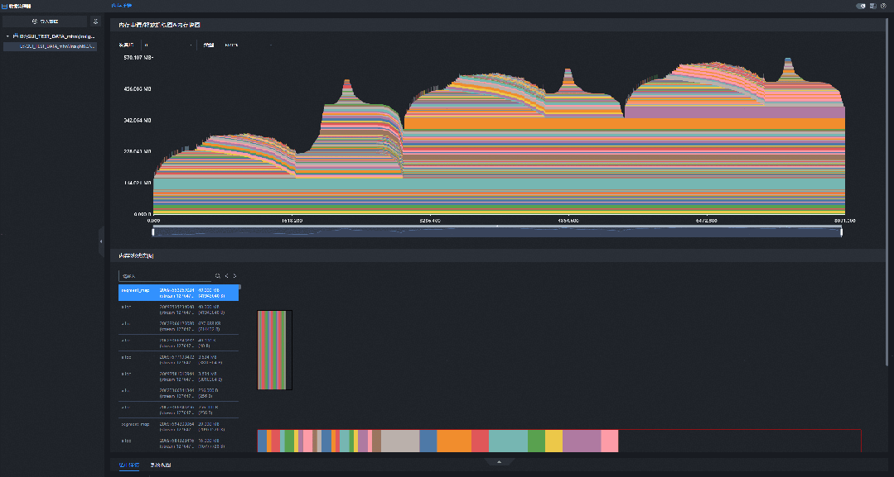
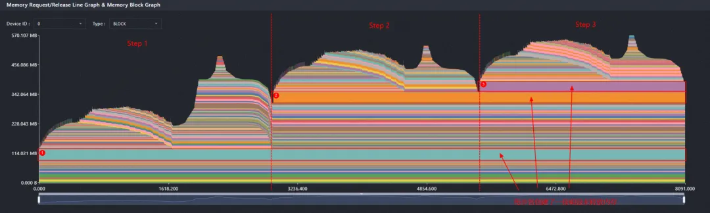
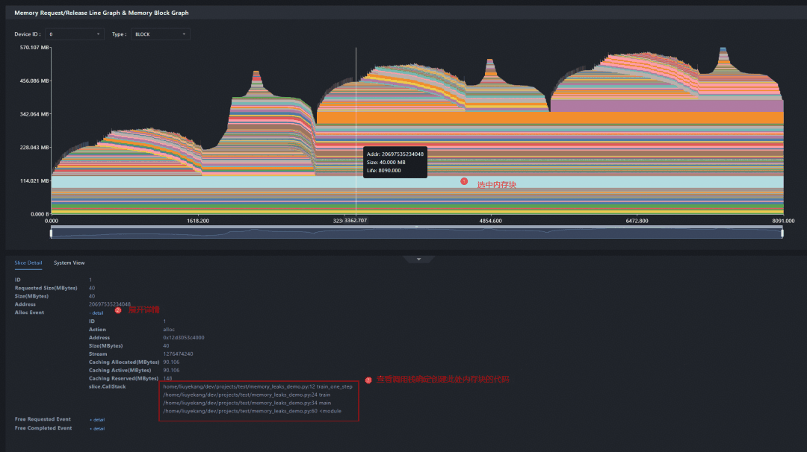
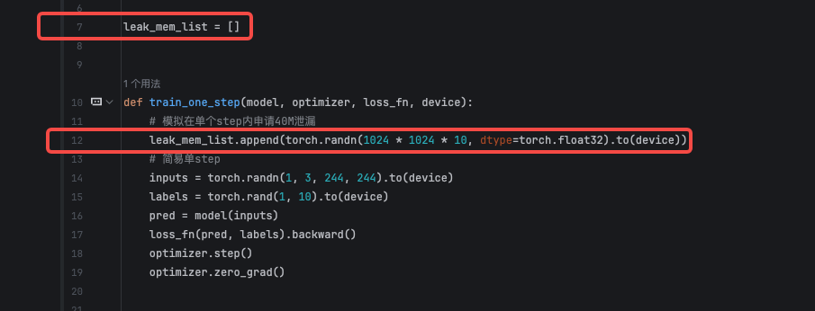
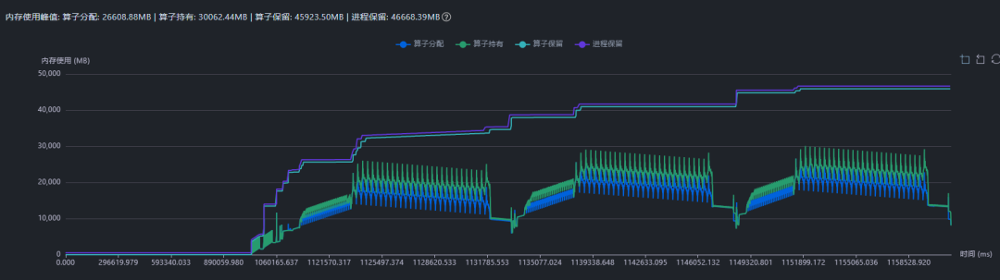
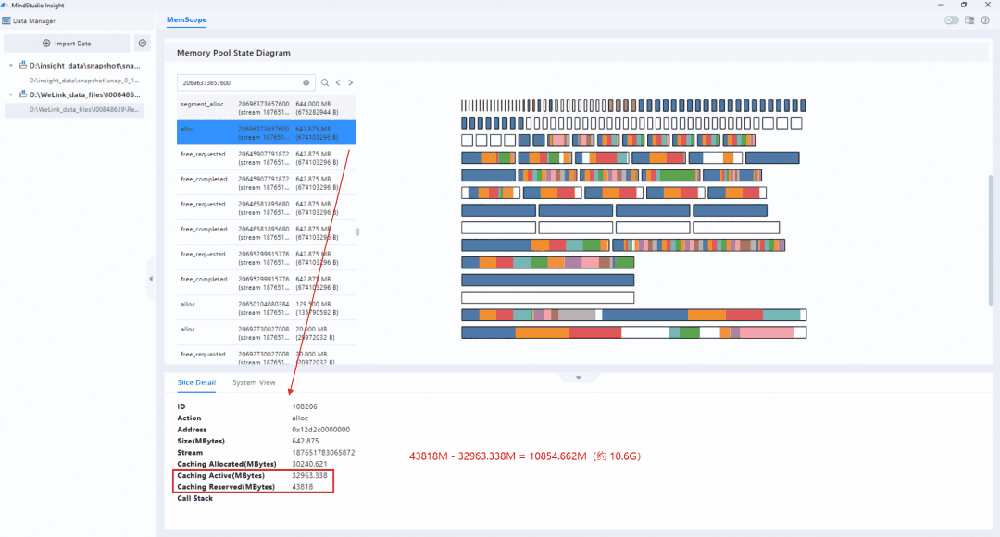

# Analyzing Memory Issues Based on PyTorch Snapshot Data

<!-- md-trans-meta sourceCommit=81c78c7bc5b57be8952a8eb0685833246e436fe7 translatedAt=2026-08-12T11:36:48.715Z pushedAt=2026-08-12T11:57:31.062Z -->

## Case Background

In scenarios such as reinforcement learning and multimodal training, the training process typically involves multiple task phases. Different phases vary significantly in input formats, sequence lengths, and operator combinations, leading to more complex memory changes on the device. When analyzing such issues, observing only the overall memory curve usually reveals continuous memory growth, high peak values, or large retained memory, making it difficult to directly determine whether the problem is a memory leak, a transient peak, or memory fragmentation.

PyTorch Snapshot data records memory allocation and deallocation events, as well as the memory pool status at the time of collection. After importing the Snapshot data into MindStudio Insight, you can use the memory block lifetime graph, memory pool status graph, and call stack information to further analyze the phase in which the memory issue occurs, identify abnormal memory blocks, trace allocation sources, and examine memory pool fragmentation.

**Figure 1**  Linked display of the memory block lifetime graph and memory pool status diagram<a id="linked-display-of-the-memory-block-lifecycle-diagram-and-memory-pool-status-diagram"></a>



## Analysis Methodology

When analyzing memory issues based on Snapshot data, it is recommended to proceed in the order of "first scope, then locate, and finally verify":

1. **First, observe the overall trend**: Examine the memory allocation/release curve to determine whether the issue is continuous growth, a single-point peak, or reserved memory significantly exceeding actual allocated memory over a long period.

2. **Then, narrow down the anomaly interval**: Use the zoom bar on the trend chart to select an abnormal step or time period, and focus on the memory blocks and memory events within that interval.

3. **Locate the anomalous objects**: Examine unreleased memory blocks, large memory blocks, and key events such as `segment_alloc` within the interval to determine whether the anomalous memory persists or triggers memory pool expansion.

4. **Trace back the code path**: Select the abnormal memory block or memory event, view the call stack, and locate the Python code position that triggered the allocation.

5. **Verify the root cause in combination with business logic**: Return to the training logic to examine factors such as tensor lifetime, global container retention, input length fluctuation, and cache release timing, and verify whether the suspected root cause is valid.

The following two common phenomena need to be distinguished during the analysis process:

- **Memory leak**: Memory blocks remain unreleased after multiple steps, and memory usage grows continuously with the training process, which may eventually trigger OOM.

- **Memory fragmentation**: The actual allocation may not grow continuously, but the reserved memory is significantly higher than the actual allocation. The memory pool contains many free areas that cannot be reused, which may lead to frequent subsequent expansion or degraded training efficiency.

## Snapshot Data Collection

Enable memory history recording before executing the code to be analyzed, and export the snapshot file after the problem scenario finishes running. The sample code is as follows:

```python
import torch
import torch_npu

# Enable memory history recording and record the Python call stack for subsequent tracing of memory allocation sources
torch_npu.npu.memory._record_memory_history(stacks="python")

# Execute the training or inference code to be analyzed
train()

# Export the snapshot data
torch_npu.npu.memory._dump_snapshot("memory_snapshot.pickle")
```

After collection, import <code>memory_snapshot.pickle</code> into MindStudio Insight and analyze it on the memory details (PyTorch Snapshot) interface.

## Case 1: Locating Memory Leaks During the Training Process

### Problem Symptom

An OOM occurred after a long training session of a model demo. Based on the symptom alone, the cause could be an excessively high peak in a single step, or it could be the continuous accumulation of unreleased tensors during the training process. Further analysis of the memory block lifetime is required.

### Analysis Process

1. Import the Snapshot data into MindStudio Insight and navigate to the memory details (PyTorch Snapshot) page.

2. View the memory block lifetime graph to observe the changes in memory allocation and deallocation at each step.

3. You can observe that each step allocates a distinct memory block, yet these blocks persist after the step completes and are not released during training.

    **Figure 2**  Obvious unreleased memory blocks during the training process<a id="obvious-unreleased-memory-blocks-during-the-training-process"></a>
    

4. Select the abnormal Step and view the unreleased memory blocks in the interval to confirm that the unreleased memory blocks accumulate as the Step increases.

5. Select an unreleased memory block and view its call stack to locate the code position where the tensor is created.

    **Figure 3** Code call stack corresponding to the unreleased memory block<a id="Code call stack corresponding to the unreleased memory block"></a>
    

6. Return to the code to examine the tensor lifetime, and find that the tensor is persistently held by a global container and still has references after the Step ends, preventing the memory from being released.

    

### Analysis Conclusion

This is a typical memory leak. The root cause is not an excessively high peak in a single training step, but rather that useless tensors are held for an extended period, causing device-side memory to grow continuously with each step and eventually triggering an OOM.

### Optimization Suggestions

- Delete global tensor containers that are no longer in use, or promptly clear tensors from containers after each step.

- For data that needs to be preserved across steps, prioritize saving essential scalars, CPU data, or compressed results, and avoid holding device tensors over the long term.

- After applying the fix, collect a new snapshot to verify that unreleased memory blocks no longer accumulate continuously within the same step interval.

## Case 2: Locating Memory Fragmentation in a Reinforcement Learning Scenario

### Problem Symptom

When training a multimodal model using reinforcement learning, the training efficiency was relatively low. A preliminary review of the profile data revealed no obvious slow-rank phenomenon, nor any anomalies directly related to inter-rank communication.

Further examination of the memory curve showed that the reserved memory during the training process was significantly higher than the actual allocation, and no obvious continuous leak was observed after stabilization. At this point, it was necessary to determine whether substantial memory fragmentation existed, causing free space in the memory pool to be difficult to reuse for subsequent allocation requests.

### Analysis Process

1. First, observe the memory curve based on profile data. If `Reserved` is significantly higher than `Allocated` and `Allocated` does not grow continuously, suspect memory fragmentation in the memory pool first rather than a memory leak.

    

2. Collect snapshot data and import it into MindStudio Insight, then navigate to the memory details (PyTorch Snapshot) page.

3. In the memory block lifetime graph, locate the time point when memory pool expansion is triggered, focusing on `segment_alloc`-related events. Examine the last `segment alloc` event within a step.

4. Click the abnormal event to view the memory block lifetime graph.

5. Observe the free areas within memory segments in the memory block lifetime graph. If there are numerous scattered free blocks, or if large free areas exist yet new `segment_alloc` events are still triggered, it indicates low memory pool reuse efficiency. It is found that at the time of the last `segment alloc` event in a step, a gap of approximately 10.6 GB had already appeared.

    **Figure 4** Unreused free memory in the memory block lifetime graph<a id="unreused-free-memory-in-the-memory-pool-status-diagram"></a>
    

6. Continue the analysis in combination with the training input and business logic, and it is found that there are individual extremely long sequences in the training data. Such inputs raise the peak memory within a single step. Although the actual usage subsequently decreases, the fragmentation left in the memory pool is difficult to reuse in a timely manner.

### Analysis Conclusion

This issue is a decline in training efficiency caused by memory fragmentation. The root cause is not a persistent leak, but rather excessive fluctuation in input sequence length, which causes peak memory to be driven up by extreme samples. In subsequent steps, a large gap persists between reserved memory and actual allocated memory, reducing the reuse efficiency of the memory pool.

### Optimization Suggestions

- Optimize the variable-length sequence processing logic to reduce the impact of extremely long sequences on the peak memory of a single step.

- Adjust the batch organization method to place samples of similar lengths into the same batch, reducing memory fluctuations within the same training phase.

- Review the tail concatenation, padding, and other logic to avoid unnecessary large temporary tensors.

- After optimization, re-collect Profiling and Snapshot data to confirm that the gap between `Reserved` and `Allocated` has narrowed and that fragmentation in the memory block lifetime graph has decreased.

## Summary

Snapshot data is suitable for in-depth analysis after a memory problem has been preliminarily scoped. When locating a memory leak, focus on memory blocks that persist across steps, and trace their allocation sources through the call stack. When locating memory fragmentation, focus on the gap between `Reserved` and `Allocated`, `segment_alloc` events, and the distribution of free blocks in the memory block lifetime graph.

The complete analysis loop is as follows: first determine the problem type through the overall trend, then zoom into anomalous intervals to locate key events, subsequently identify suspicious code paths by combining the call stack and the memory block lifetime graph, and finally return to the business logic for verification and optimization.

## Reference

- [MindStudio Insight Memory Tuning](../user_guide/memory_tuning.md)

- [Issue #324: Add Case-Specific Documentation](https://gitcode.com/Ascend/msinsight/issues/324)
