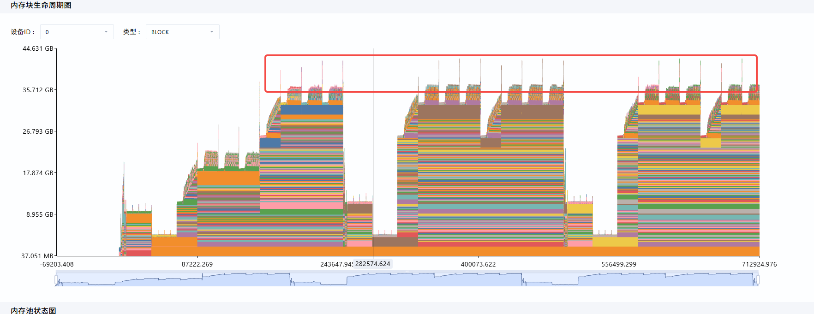
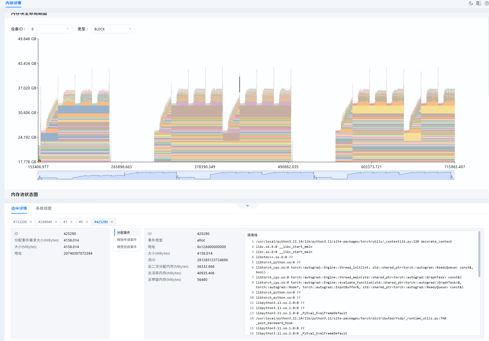
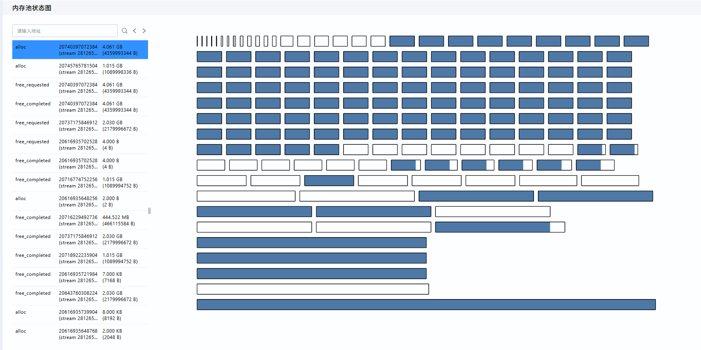
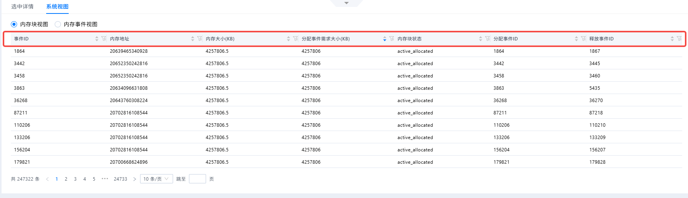
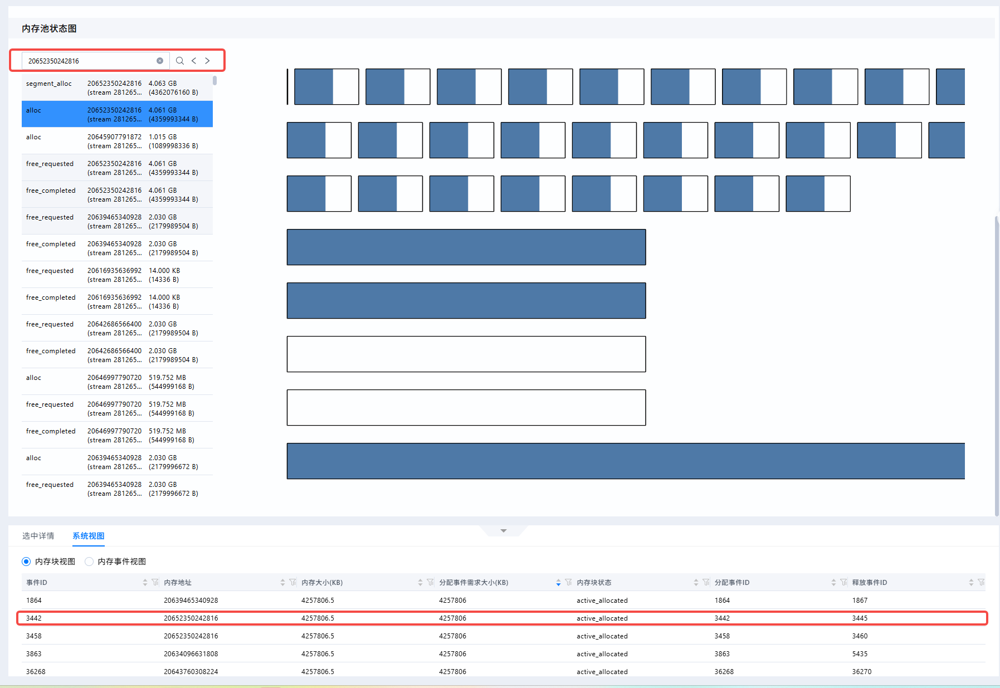
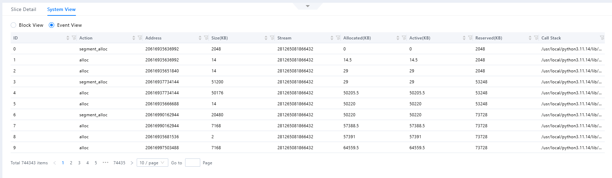

# Snapshot Data Collection and Analysis Case in verl

<!-- md-trans-meta sourceCommit=a024cad74dd87f18eb03b7912eccb97ff269e7c7 translatedAt=2026-08-12T11:38:13.296Z pushedAt=2026-08-12T11:57:31.074Z -->

## Background

In verl training tasks under scenarios such as PPO/RLHF, memory pressure is typically concentrated in stages including rollout generation, actor updates, reference logprob computation, critic updates, reward model inference, and checkpoint saving. To identify the source of peak memory usage, observe whether memory grows continuously across steps, and compare memory allocation differences between different ranks, the built-in `torch_memory` profiler in verl can be used to collect PyTorch memory snapshots.

This document describes the method for collecting snapshot data in verl and provides analysis cases based on MindStudio Insight.

## Identification Approach

1. Prioritize using minimal collection parameters to verify that the snapshot link is functional.

2. In single-rank scenarios, collect data from rank 0 and limit the number of collection steps to reduce runtime overhead.

3. In multi-rank scenarios, prioritize collecting data from representative ranks; enable all-rank collection only when it is necessary to observe differences across all ranks.

4. After collection is complete, check the output directory to confirm that the snapshot file has been generated and is non-empty.

5. Subsequently, use the MindStudio Insight analysis tool to perform issue analysis.

## Snapshot Data Collection

### Collection Parameter Description

The core parameters for enabling memory snapshot collection in verl are as follows:

| Name | Description |
| --- | --- |
| `global_profiler.tool` | Selects the PyTorch memory collection tool for verl. |
| `global_profiler.save_path` | Specifies the output directory for snapshot files. |
| `actor_rollout_ref.actor.profiler.enable` | Enables profiler integration on the actor. |
| `actor_rollout_ref.actor.profiler.ranks` | Specifies an array of ranks for collection, suitable for single-rank or small-scale rank collection. |
| `actor_rollout_ref.actor.profiler.all_ranks` | Collects data from all ranks, which incurs a large file volume and high runtime overhead. |
| `trainer.device` | Specifies the device type used for the training task, such as `CUDA` or `NPU`. |
| `global_profiler.steps` | Controls the step range for collection. After each collection is completed, the existing memory history records are deleted to prevent data from different collection windows from mixing together. |
| `global_profiler.global_tool_config.torch_memory.trace_alloc_max_entries` | Specifies the number of memory allocation records to retain. A larger value yields a more complete snapshot but incurs higher additional overhead. |
| `global_profiler.global_tool_config.torch_memory.stack_depth` | Specifies the depth of the recorded call stack. A larger value facilitates attribution but incurs higher additional overhead. |

### Single-Rank Collection Command

For single-rank tasks, only rank 0 needs to be collected. The following command uses `verl.trainer.main_ppo` as the entry point, where the dataset, model, and training parameters can be replaced with the actual task configuration.

```bash
python3 -m verl.trainer.main_ppo \
    algorithm.adv_estimator=grpo \
    data.train_files=/home/chenyan/verl_data/train.parquet \
    data.val_files=/home/chenyan/verl_data/test.parquet \
    data.train_batch_size=16 \
    data.max_prompt_length=512 \
    data.max_response_length=128 \
    data.filter_overlong_prompts=True \
    data.truncation=error \
    actor_rollout_ref.model.path=/data/models/Qwen/Qwen2.5-7B-Instruct \
    actor_rollout_ref.actor.ppo_mini_batch_size=8 \
    actor_rollout_ref.actor.ppo_micro_batch_size_per_gpu=2 \
    actor_rollout_ref.rollout.log_prob_micro_batch_size_per_gpu=4 \
    actor_rollout_ref.rollout.tensor_model_parallel_size=1 \
    actor_rollout_ref.rollout.name=vllm \
    actor_rollout_ref.rollout.gpu_memory_utilization=0.2 \
    actor_rollout_ref.rollout.n=4 \
    actor_rollout_ref.ref.log_prob_micro_batch_size_per_gpu=4 \
    trainer.n_gpus_per_node=1 \
    trainer.nnodes=1 \
    trainer.total_epochs=1 \
    trainer.default_local_dir=/home/chenyan/verl_outputs \
    trainer.device=npu \
    global_profiler.tool=torch_memory \
    actor_rollout_ref.actor.profiler.ranks='[0]' \
    actor_rollout_ref.actor.profiler.enable=True \
    global_profiler.steps=[1,2,3,4,5,6,7,8,9,10] \
    global_profiler.save_path=/home/chenyan/verl_outputs/mem_snapshots_single \
    global_profiler.global_tool_config.torch_memory.trace_alloc_max_entries=100000 \
    global_profiler.global_tool_config.torch_memory.stack_depth=32
```

### Multi-Rank Specified Rank Collection Command

For multi-rank tasks, it is recommended to first collect data from a small number of representative ranks, such as rank 0 and rank 1, to compare the differences in memory allocation during actor execution. The following command uses a single-server 4-rank setup as an example.

```bash
python3 -m verl.trainer.main_ppo \
    algorithm.adv_estimator=grpo \
    data.train_files=/home/chenyan/verl_data/train.parquet \
    data.val_files=/home/chenyan/verl_data/test.parquet \
    data.train_batch_size=16 \
    data.max_prompt_length=512 \
    data.max_response_length=128 \
    data.filter_overlong_prompts=True \
    data.truncation=error \
    actor_rollout_ref.model.path=/data/models/Qwen/Qwen2.5-7B-Instruct \
    actor_rollout_ref.actor.ppo_mini_batch_size=8 \
    actor_rollout_ref.actor.ppo_micro_batch_size_per_gpu=2 \
    actor_rollout_ref.rollout.log_prob_micro_batch_size_per_gpu=4 \
    actor_rollout_ref.rollout.tensor_model_parallel_size=4 \
    actor_rollout_ref.rollout.name=vllm \
    actor_rollout_ref.rollout.gpu_memory_utilization=0.2 \
    actor_rollout_ref.rollout.n=4 \
    actor_rollout_ref.ref.log_prob_micro_batch_size_per_gpu=4 \
    trainer.n_gpus_per_node=4 \
    trainer.nnodes=1 \
    trainer.total_epochs=1 \
    trainer.default_local_dir=/home/chenyan/verl_outputs \
    trainer.device=npu \
    global_profiler.tool=torch_memory \
    actor_rollout_ref.actor.profiler.ranks='[0,1]' \
    actor_rollout_ref.actor.profiler.enable=True \
    global_profiler.steps=[1,2,3,4,5,6,7,8,9,10] \
    global_profiler.save_path=/home/chenyan/verl_outputs/mem_snapshots_selected_ranks \
    global_profiler.global_tool_config.torch_memory.trace_alloc_max_entries=100000 \
    global_profiler.global_tool_config.torch_memory.stack_depth=32
```

### Multi-Rank Full Collection Command

If it is necessary to compare peak memory usage, allocation stacks, or inter-step growth differences across all ranks, full-rank collection can be enabled. This mode generates more snapshot files and incurs higher runtime overhead, so it is recommended to be used only within a shorter training window.

```bash
python3 -m verl.trainer.main_ppo \
    algorithm.adv_estimator=grpo \
    data.train_files=/home/chenyan/verl_data/train.parquet \
    data.val_files=/home/chenyan/verl_data/test.parquet \
    data.train_batch_size=16 \
    data.max_prompt_length=512 \
    data.max_response_length=128 \
    data.filter_overlong_prompts=True \
    data.truncation=error \
    actor_rollout_ref.model.path=/data/models/Qwen/Qwen2.5-7B-Instruct \
    actor_rollout_ref.actor.ppo_mini_batch_size=8 \
    actor_rollout_ref.actor.ppo_micro_batch_size_per_gpu=2 \
    actor_rollout_ref.rollout.log_prob_micro_batch_size_per_gpu=4 \
    actor_rollout_ref.rollout.tensor_model_parallel_size=4 \
    actor_rollout_ref.rollout.name=vllm \
    actor_rollout_ref.rollout.gpu_memory_utilization=0.2 \
    actor_rollout_ref.rollout.n=4 \
    actor_rollout_ref.ref.log_prob_micro_batch_size_per_gpu=4 \
    trainer.n_gpus_per_node=4 \
    trainer.nnodes=1 \
    trainer.total_epochs=1 \
    trainer.default_local_dir=/home/chenyan/verl_outputs \
    trainer.device=npu \
    global_profiler.tool=torch_memory \
    actor_rollout_ref.actor.profiler.all_ranks=True \
    actor_rollout_ref.actor.profiler.enable=True \
    global_profiler.steps=[1,2,3,4,5,6,7,8,9,10] \
    global_profiler.save_path=/home/chenyan/verl_outputs/mem_snapshots_all_ranks \
    global_profiler.global_tool_config.torch_memory.trace_alloc_max_entries=100000 \
    global_profiler.global_tool_config.torch_memory.stack_depth=32
```

### Organizing Collection Results

After collection is complete, verl creates subdirectories by step under the output directory specified by `global_profiler.save_path`. Within each step directory, the snapshot files collected for all configured ranks at that step are directly saved, with the file name format `torch_memory_rank{card_number}_pid{process_id}.pickle`:

```text
mem_snapshots_selected_ranks/
├── step1/
│   ├── torch_memory_rank0_pid12345.pickle
│   └── torch_memory_rank1_pid12346.pickle
├── step2/
│   ├── torch_memory_rank0_pid12345.pickle
│   └── torch_memory_rank1_pid12346.pickle
└── step3/
    ├── torch_memory_rank0_pid12345.pickle
    └── torch_memory_rank1_pid12346.pickle
```

When comparing different ranks, the data of each rank should be compared within the same step directory. When comparing different experiments, the model path, batch size, prompt/response length, rollout parallelism, FSDP/TP/PP configuration, and collection parameters should be recorded.

## Snapshot Analysis Case

### Software Installation

Download and install the MindStudio Insight tool. For details, see [MindStudio Insight Installation Guide](../install_guide/mindstudio_insight_install_guide.md).

### Importing Data

1. Open MindStudio Insight.

2. Import the snapshot data file.

3. Open the "PyTorch Snapshot Data Memory Details (Memory Snapshot)" page under "Leaks".

### Memory Block Lifetime Graph Analysis

In the "Memory Block Lifetime Graph," prioritize observing the trend of the Operator Allocated curve within the step 3 collection window.

1. If the graph rises continuously without falling back, it indicates that tensors may be persistently retained or not released across stages within the collection window.

2. If the graph exhibits periodic rises and falls, it indicates that memory is being allocated and released normally during phases such as forward, backward, and optimizer step.

3. If the graph shows a significant jump at a certain point in time, click the corresponding memory block or event at that position to further inspect the associated call stack in the "Memory Pool Status Graph" and the "memory details table."



In this sample, the graph exhibits periodic rises and falls, indicating that memory allocation and deallocation are proceeding normally.





However, some brief large memory allocations are present. If memory bottleneck issues exist, you can click to select these blocks and analyze them in detail through the details panel and the Memory Pool Status Graph.

### Memory Pool Status Graph Analysis

In the "Memory Pool Status Graph," after selecting a block in the lifetime graph or an event in the left-side event list, the splitting status of each segment in the memory pool can be viewed. The memory pool state can be observed according to the following approach:

1. Examine the ratio of `active_allocated` to `inactive` blocks in each segment to determine how much of the reserved memory is still occupied by tensors.

2. Check whether large `inactive` blocks have been split into multiple small blocks to determine whether significant fragmentation exists.

3. If an OOM event occurs, locate the memory pool state at the time of the OOM to determine whether the allocation failure was caused by high reserved memory but insufficient available contiguous blocks.

In the current case, memory allocation and deallocation are normal, and no specific analysis is performed.

### Block View Analysis

In the "Block View," joint sorting can be performed via the column headers of the data table, thereby enabling more precise identification of the memory block where an issue occurs.

In the current sample, by sorting by the "Requested Size," large memory block allocation events can be located more quickly.



Furthermore, the memory address of this event can be copied and searched in the event list within the Memory Pool Status Graph, allowing the memory state at the time of this event to be located for analysis.



If further confirmation of the service phase corresponding to a large memory block is required, the corresponding memory block can be located in the "Memory Block Lifetime Graph," and the analysis can be continued in combination with the call stack in the Slice Detail.

### Event View Analysis

In the "Event View," focus on the `Action`, `Size(KBytes)`, `Allocated(KBytes)`, `Active(KBytes)`, `Reserved(KBytes)`, and `Call Stack` fields. Similar to the "Block View," joint filtering of the table can be performed here to improve the efficiency of issue identification.



### Case Conclusion

Based on this snapshot data, the following conclusions can be drawn:

1. No OOM events were recorded in the current snapshot.

2. In the memory lifetime, the graph exhibits periodic rises and falls, indicating that memory allocation and deallocation proceed normally.

3. To further locate the source of peak memory usage, you can click the largest memory block or the peak time point in MindStudio Insight and trace the call stack to identify the phase and cause of its occurrence.
