# Communication Design Document

## Mapping between interfaces and data

### Raw data (file after ATT processing)

#### Text scenario

    

#### Database Scenario

    

### Data in the database after processing

#### Text scenario

    

#### Database Scenario

    

| Page data                                                                                  | URL request                          | db data type                                                                                                                   | text data type                                                                                                                                                                                                                                                                                                                 |
| ------------------------------------------------------------------------------------------ | ------------------------------------ | ------------------------------------------------------------------------------------------------------------------------------ | ------------------------------------------------------------------------------------------------------------------------------------------------------------------------------------------------------------------------------------------------------------------------------------------------------------------------------ |
| 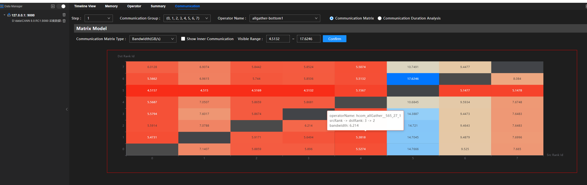                         | communication/matrix/bandwidthInfo   |                                                                  | 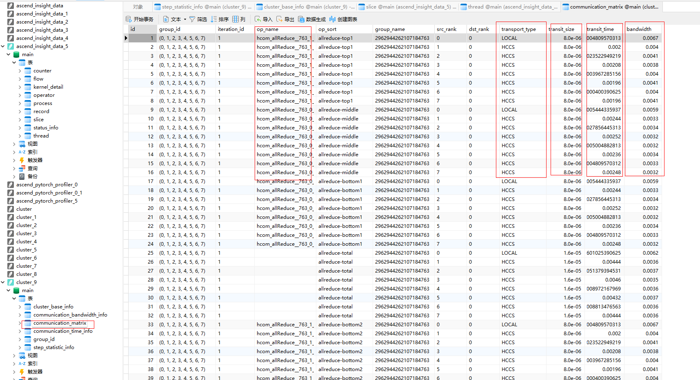                                                                                                                                                                                   |
| 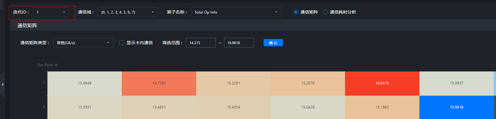     | communication/duration/iterations    | 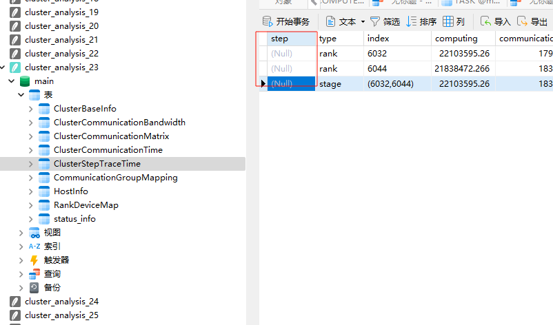                                         | 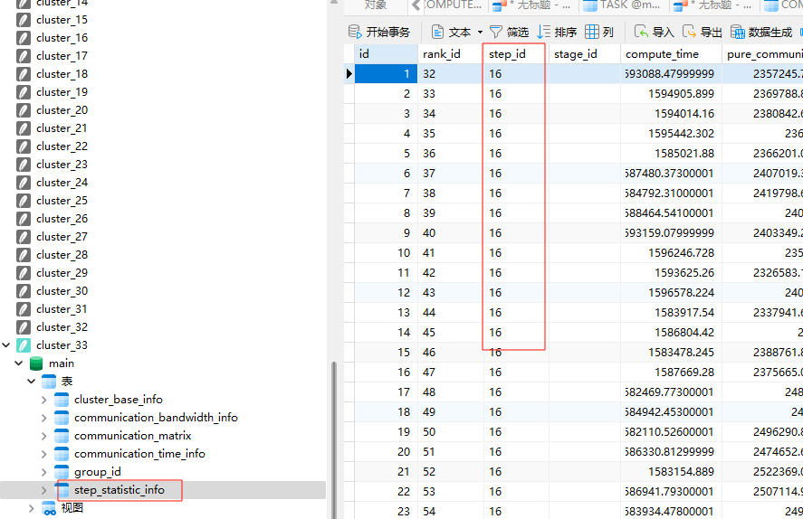                                                                                                                                                                                                                                         |
|                    | communication/matrix/group           | 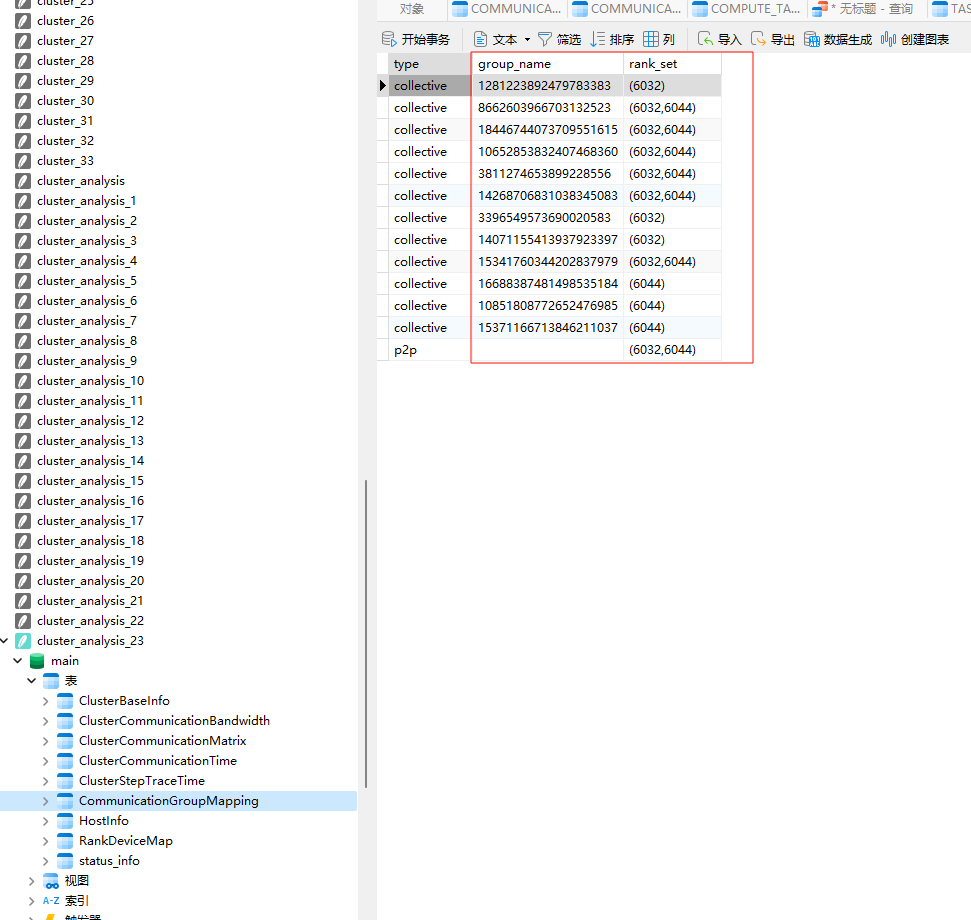                                                       |     Bottom-layer data comes from: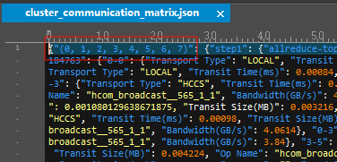                                                                                                                                              |
|                      | communication/matrix/sortOpNames     |                                                                                                                                | 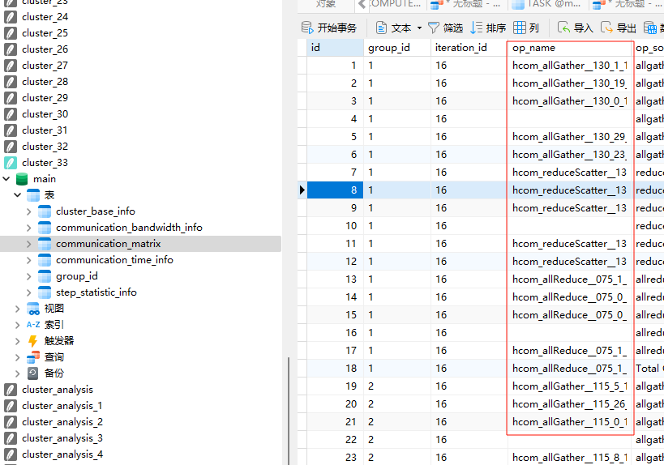    Underlying data:                                                                                                                                                               |
|                  | communication/duration/operatorNames |                                                      |     Data:              |
| 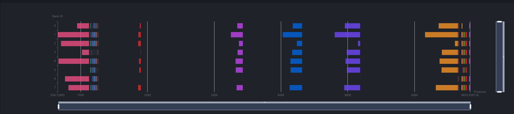                 | communication/operatorLists          | 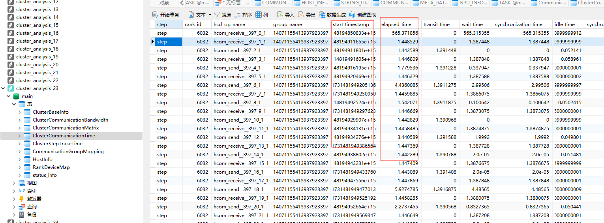                                                     |     Data:                                                                                                                                                                  |
|                  | communication/duration/list          |     Expert advice is calculated from the above data. | 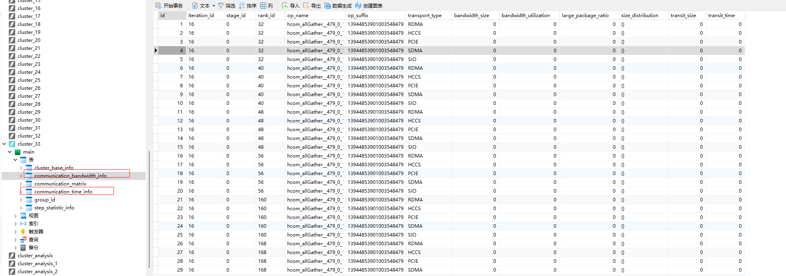                                                                                                                                                                           |
| 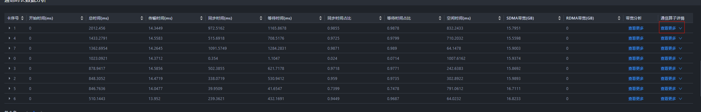             | communication/operatorDetails        |                                                  | 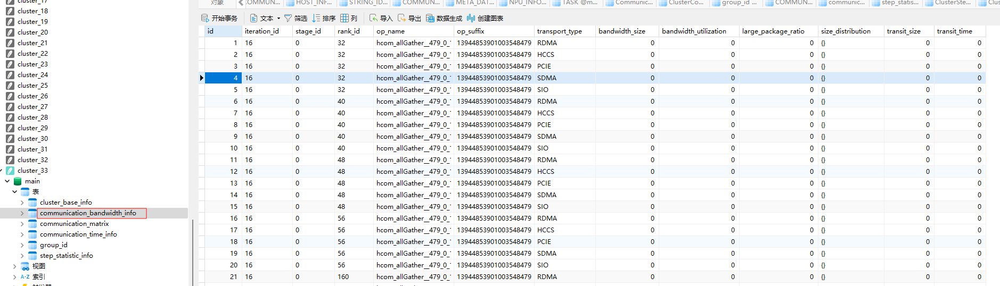                                                                                                                                                                                                                                                 |
| 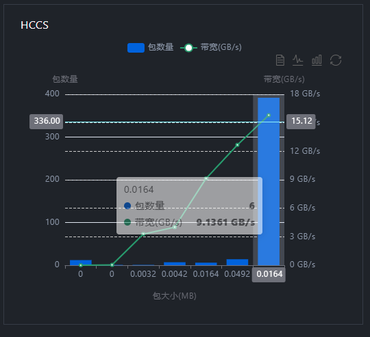                   | communication/distribution           |                                                        |                                                                                                                                                                                                                                                        |
| 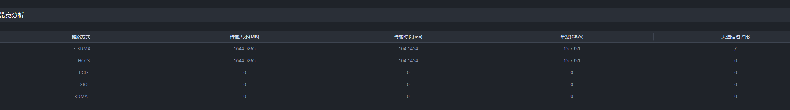                         | communication/bandwidth              | 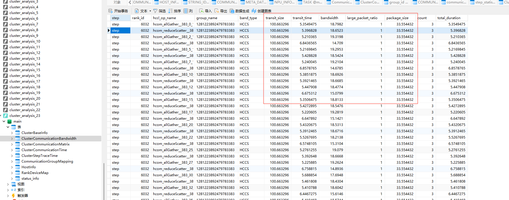                                                             |                                                                                                                                                                                                                                                              |
