# Compute Design Document

## Service process streamlining

### End-to-end process

Performance data collection and visualization.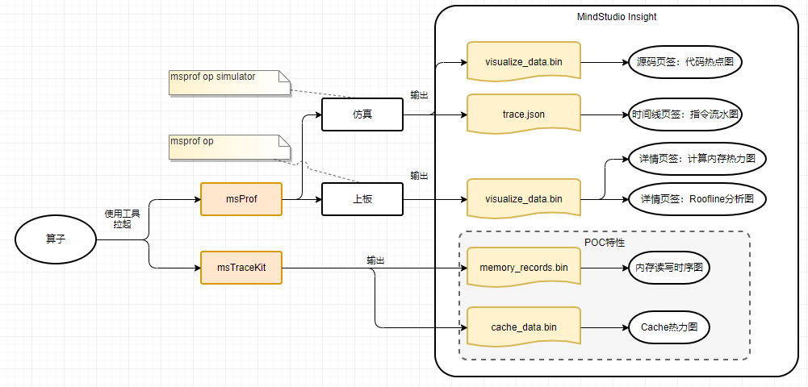    

### Backend service code process

#### File Parsing Process

    

#### Data Request Process

    

#### Code logic sequence diagram

         

## Function Involvement and Implementation

### Data File Format

#### JSON file

File format: \*.jsonDetermining logic: The JSON file contains "profilingType" and "op" before the first array. Content format: traceEvents, equivalent to timeline. Example of the JSON file content:

```json
{
    "displayTimeUnit": "ns",
    "profilingType": "op",
    "schemaVersion": 1,
    "traceEvents": [
        {
            "args": {
                "code": "/home/liuyekang/projects/samples/operator/ascendc/0_introduction/3_add_kernellaunch/AddKernelInvocationNeo/build/auto_gen/ascendc_kernels_sim/auto_gen_add_custom.cpp:22",
                "detail": "XD:X29=0x7fa0,IMM:0x7fa0,",
                "pc_addr": "0x10d0d000"
            },
            "cname": "startup",
            "dur": 0.0010000000474974513,
            "name": "MOV_XD_IMM",
            "ph": "X",
            "pid": "core2.veccore1",
            "tid": "SCALAR",
            "ts": 3.568000078201294
        },
    ]
}
```

#### Bin file

File format: .binDetermining logic: import a single file &&.bin Ending content format: operator bin files are in binary format. The format of each data unit is as follows: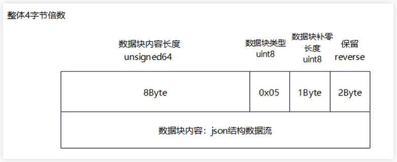    

Principles for allocating data blocks in visualize_data.bin: Allocate 16 data blocks to each component at a time to prevent development conflicts between different components.

| Data block coding | Data Block Content                                              |
| ----------------- | --------------------------------------------------------------- |
| 0x00              | Invalid data block.                                             |
| 0x01              | Code file                                                       |
| 0x02              | Flow diagram tracing.json.                                      |
| 0x03              | Files section of the api.json file for mapping the hotspot map. |
| 0x04              | Instructions part of the api.json file.                         |
| 0x05              | Basic Information                                               |
| 0x06              | Calculate the load diagram.                                     |
| 0x07              | Calculate the load table.                                       |
| 0x08              | Obtains the heatmap.                                            |
| 0x09              | Accesses the table.                                             |
| 0x0A              | Memory read/write timing diagram (TraceKit)                     |
| 0x0B              | L2Cache diagram (TraceKit).                                     |
| 0x0C              | Inter-core load.                                                |
| 0x0D              | Roofline model.                                                 |

JSON data example: 0x01 Code file: function page:    

The code file contains some binary content. The structure is as follows:    

4096-byte additional data block (storage file path information):

```json
/home/matmul_leakyrelu_custom.cpp
```

Data block content (CPP source code content)

```C++
# include "kernel_operator.h"\n# include "lib/matmul_intf.h"\n\nusing namespace ...
```

0x03 Source code line information function page:    

Description of the binary structure:    

Data block content:

```JSON
{
  "Cores": [ //Computing core for executing the operator, for example, core0.cubecore0 or core0.veccore0.
    string
  ],
  "Files Dtype": { //Specify column names and data types
//Key-value pair in the Files Dtype->Lines object, which specifies the key name and value type of the key-value pair in each object in the Files->Lines array.
//skip 0 (indicates that the column does not need to be displayed on the GUI.), int 1, float 2, string 3
//Data fields that are not collected do not need to be specified here.
//Key-value pair that supports dynamic parsing. The value must be a single or one-dimensional array. Two-dimensional arrays such as Address Range do not support dynamic parsing and need to be defined separately.
        "Lines": {
            "Address Range": 0,
            "Cycles": 1,
            "Instructions Executed": 1,
            "Line": 1,
            "L2Cache Hit Rate": 3
    }
  },
  "Files": [ //Code line information in the source code file
    {
      "Lines": [ //Instruction address range associated with the line of code, clock cycles consumed, total number of instructions executed
        {
          "Address Range": [ //Range of instruction address associated with the current line of code
            [
              string
            ]
          ],
          "Cycles": [ //Total number of clock cycles consumed by the current code line on each computing core (corresponding order?)
            int
          ],
          "Instructions Executed": [ //Total number of instructions executed on each computing core in the current code line (corresponding order?)
            int
          ],
          "Line": 100 //Code line number
        }
      ],
      "Source": string //Source Code File Path
    }
  ]
}
```

0x04 Instruction information function page:    

Binary structure:    

Data block content:

```JSON
{
  "Cores": [ //Computing core for executing the operator, for example, core0.cubecore0 or core0.veccore0.
    string
  ],
"Instructions Dtype": { //Specify column names and data types
//Instructions Dtype->Key-value pair in the Instructions object, which specifies the key name and value type of the key-value pair in each object in the Instructions array.
//skip 0 (indicates that the column does not need to be displayed on the GUI.), int 1, float 2, string 3
//Data fields that are not collected do not need to be specified here.
//Key-value pair that supports dynamic parsing. The value must be a single or one-dimensional array. Two-dimensional arrays do not support dynamic parsing and need to be defined separately.
    "Instructions": {
        "Address": 3,
        "AscendC Inner Code": 3,
        "Cycles": 1,
        "Instructions Executed": 1,
        "Pipe": 3,
        "TheoreticalStallCycles": 1,
        "Source": 3,
        "RealStallCycles": 1,
        "L2Cache Hit Rate": 3
     }
},
  "Instructions": [
    {
      "Address": string,    //Indicates the offset address of the instruction, for example, 0x1269f000.
      "AscendC Inner Code": string, //Source code file path and code line number, for example, /home/xxx.cpp:23.
      "Cycles": [      //The number of clock cycles the instruction consumes on each computing core
        int
      ],
      "Instructions Executed": [  //Number of times an instruction is executed on each computing core.
        int
      ],
      "Pipe": string,     //Instruction queue to which an instruction belongs, for example, SCALAR.
      "TheoreticalStallCycles": [                    //Expected Blocking Time
        int
      ],
      "Source": string,     //Instruction content, for example, "MOV_XD_IMM XD:X29,IMM"
      "RealStallCycles": [                    //Actual Blocking Time
        int
      ]
    }
  ]
}
```

0x02 Timeline information function page:    

Binary structure:    

Data block content:

```JSON
{"profilingType": "op",
    "displayTimeUnit": "ns",
    "schemaVersion": 1,
    "traceEvents": [
  {    
   "args": {
                "code": "/home/yanyuwei/workspace/samples-master/operator/AddCustomSample/FrameworkLaunch/AddCustom/build_out/op_kernel/binary/xxxx/kernel_meta_AddCustom_1e04ee05ab491cc5ae9c3d5c9ee8950b/kernel_meta/AddCustom_1e04ee05ab491cc5ae9c3d5c9ee8950b_413903_kernel.cpp:23",
                "detail": "x[1]=0x0,imme16:0x4000",
                "pc_addr": "0x10cfa004"
            },
            "cname": "process_block0",
            "dur": 20,
            "name": "block0",
            "ph": "X",
            "pid": "process_name",
            "tid": "process_block0",
            "ts": 1
        },
        {    
   "args": {
                "code": "/home/yanyuwei/workspace/samples-master/operator/AddCustomSample/FrameworkLaunch/AddCustom/build_out/op_kernel/binary/xxxx/kernel_meta_AddCustom_1e04ee05ab491cc5ae9c3d5c9ee8950b/kernel_meta/AddCustom_1e04ee05ab491cc5ae9c3d5c9ee8950b_413903_kernel.cpp:23",
                "detail": "x[1]=0x0,imme16:0x4000",
                "pc_addr": "0x10cfa004"
            },
            "cname": "prepare",
            "dur": 5,
            "name": "hccl::prepare",
            "ph": "X",
            "pid": "process_name",
            "tid": "process_block0",
            "ts": 2
        },
  {    
   "args": {
                "code": "/home/yanyuwei/workspace/samples-master/operator/AddCustomSample/FrameworkLaunch/AddCustom/build_out/op_kernel/binary/xxxx/kernel_meta_AddCustom_1e04ee05ab491cc5ae9c3d5c9ee8950b/kernel_meta/AddCustom_1e04ee05ab491cc5ae9c3d5c9ee8950b_413903_kernel.cpp:23",
                "detail": "x[1]=0x0,imme16:0x4000",
                "pc_addr": "0x10cfa004"
            },
            "cname": "prepare",
            "dur": 5,
            "name": "hccl::wait",
            "ph": "X",
            "pid": "process_name",
            "tid": "process_block0",
            "ts": 10
        }
    ]
}
```

Note: The data source is tracing.json, which meets the Trace Event Format requirements.

0x05 Operator basic information

Function page:    

Binary structure: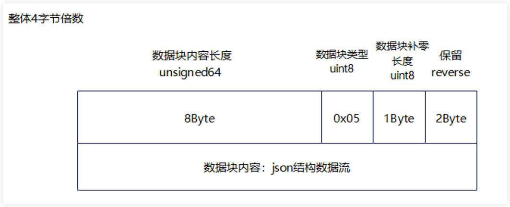    

Data block content:

```JSON
{
    "name": str,            //Operator name
    "soc": str,             //Operator running platform
    "op_type": enum,        //Operator type: aic, aiv, or mix
    "block_dim": uint16,    //Block dim data
    "mix_block_dim": uint16,//Number of slave cores under the mix operator
    "duration": float32,    //Operator Total Duration
    "device_id": uint16,    //Device No.
    "pid": str,                    //Process ID
    "block_detail": [       //Valid when op_type = aic/aiv
        {
            "block_id": uint16,     //Indicates the sub block ID.
            "core_type": enum,      //Indicates the sub block type. The options are as follows: aic and aiv.
            "duration": float32,    //Duration of sub block
        }
    ],
    "mix_block_detail": [ //Valid when op_type == mix
        {
            "block_id": uint16,  //Block ID.                 
            "duration": [float32, float32, float32], //Indicates the duration of the sub block. The values are as follows: aic, aiv0, and aiv1.
        }
    ],
    "advice": [ //Suggestion. Currently, this field is empty and reserved.
        string, string, ...
    ]
}
```

Note that only one of the block_detail and mix_block_detail fields is valid. block_detail and mix_block_detail are lists, including 0 to N dict/map.

0x06: Calculate the load diagram.

Function page: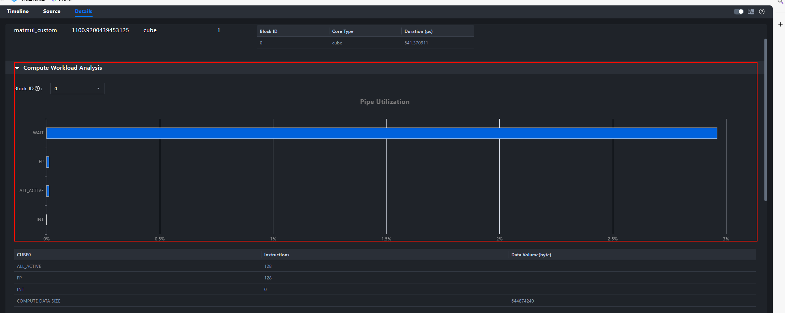    

Binary structure: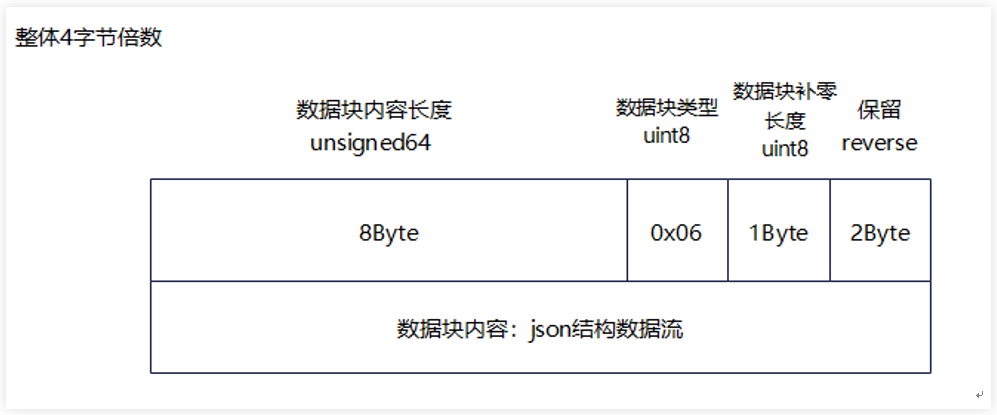    

Data block content:

```JSON
{
    "subblock_detail": [
        {
            "block_id": uint8,      //Block ID, that is, the sequence number of the master core.
            "block_type": enum,     //Indicates the sub block type. The options are as follows: aic, aiv, aiv0, and aiv1.
            "name": string,     //Calculate the load data name.
            "unit": enum,       //Data unit:%
            "value": float32,    //Value
            "origin_value": float32    //Value
        }
    ],
    "advice": [ //Suggestion. Currently, this field is empty and reserved.
        string, string, ...
    ]
}
```

0x07: calculated load table:

Function page:    

Binary structure: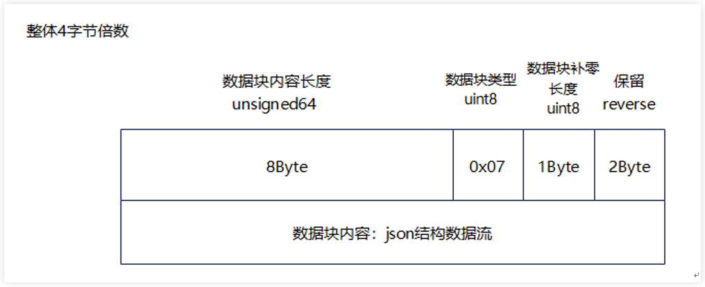    

Data block content:

```JSON
{
    "subblock_detail": [
        {
            "block_id": uint8,      //Block ID, that is, the sequence number of the master core.
            "block_type": enum,     //Sub block type: aic, aiv, aiv0, aiv1
            "name": string,     //Calculate the load data name.
            "unit": enum,       //Data unit: us, instructions, data volume (byte)
            "value": float32,   //Value
            "origin_value": float32   //Value 
        }
    ],
    "advice": [ //Suggestion. Currently, this field is empty and reserved.
        string, string, ...
    ]
}
```

0x08: memory access heatmap

Function page:    

Binary structure: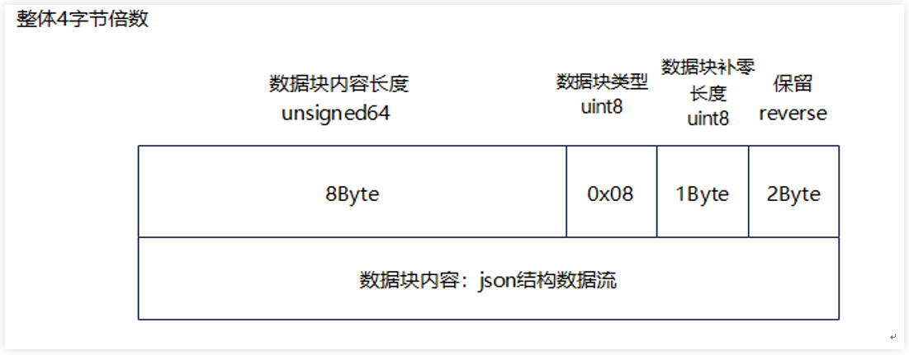    

Data block content:

```JSON
{
    "core_memory_map": [
        {
            "core_no": uint16,      //Block ID.
            "op_type": enum,        //Operator type. The options are cube, vector, and mix.
            "soc": str,             //Operator running platform
            "memory_unit": [        //Path List
                {
                    "memory_path": enum,        //Transfer path name
                    "request": uint64,          //Number of requests
                    "request_per_byte": uint8,  //Amount of data requested each time
                    "bandwidth": float32,       //Bandwidth
                    "peak_ratio": float32,         //Indicates the peak band ratio. The value -1 indicates invalid data.
                    "display": bool,            //Display this channel
                }
            ],
            "L2cache": [
                "hit": uint64,              //Cache Hit Times
                "miss": uint64,             //Number of cache misses
                "total_request": uint64,    //Total number of cache requests.
                "hit_ratio": int8,          //Hit ratio: - 1 indicates invalid data.
            ], 
            "Cube": {
                "ratio": float32,
                "cycle": uint64,
                "total_cycles": uint64,
            },
            "Vector": {
                "ratio": float32,
                "cycle": uint64,
                "total_cycles": uint64,
            },
            "Vector1": {
                "ratio": float32,
                "cycle": uint64,
                "total_cycles": uint64,
            },
            "advice": [ //The suggestion
                string, string, ...
            ]
        }
    ]
}
```

0x09: accesses the storage heat table.

Function page:    

Binary structure: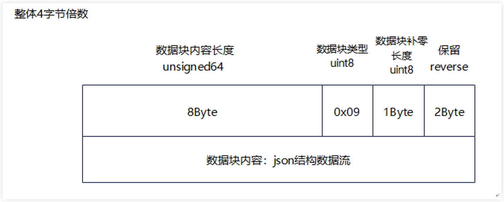    

Data block content:

```JSON
{
    "table_per_block": [
        {
            "block_id": uint,       //block id
            "table_op_type": enum,  //Table data type: aic, aiv, mix
            "table_detail": [
                {
                    "table_name": string,   //Table Name
                    "size": [uint8, uint8], //Table size: [Number of rows, Number of columns]
                    "header_name": [        //Column name (consistent with the number of columns)
                        string, string, ...
                    ],
                    "row": [                //Row data (consistent with the number of rows)
                        "name": string,     //Line Name
                        "value": [          //Row data: length = number of columns - 1
                            float16, float16, ....
                        ]
                    ],
                }
            ],
            "advice": [ //The suggestion
                string, string, ...
             ]
        },
    ],

    "advice": [ //Suggestion. Currently, this field is empty and reserved.
        string, string, ...
    ]
}
```

0x0A Memory Read/Write Timing Diagram (POC)

Function page: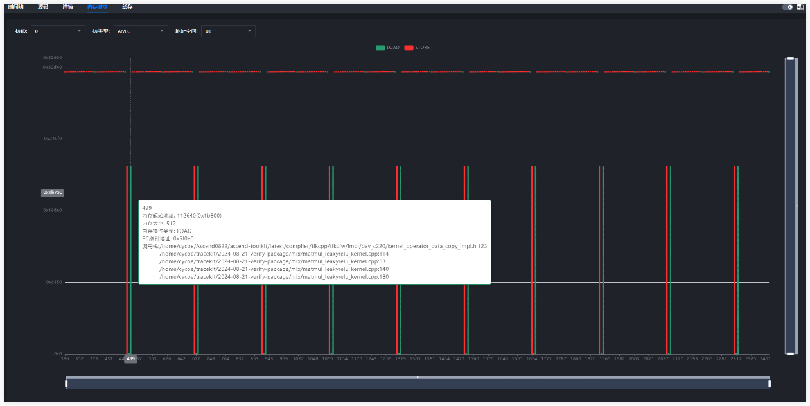    

Binary structure:    

Data block content structure: overall binary delivery, as shown in the following figure.    

File protocol header:

```C++
struct BinaryBlockHeader {
    uint64_t contentSize = 0;
    uint8_t type = 0;
    uint8_t padding = 0;
    uint16_t reverse = 0x5a5a;
};
```

Memory read/write sequence diagrams can be constructed based on the memory read/write sequence information output by the msTraceKit tool. Memory read/write structure design:

```C++
struct TraceRecord {
    uint8_t type;
    int8_t coreId;
    int8_t space;
    uint8_t blockType;
    uint32_t recordId;
    uint64_t addr;
    uint64_t memSize;
    uint64_t pc;
};
```

Description of the fields in the TraceRecord structure:

| Parameter | Description                                                                                                        |
| --------- | ------------------------------------------------------------------------------------------------------------------ |
| type      | Memory Event Type MALLOC=0 FREE=1 MEMCPY_BLOCKS=2 LOAD=3 STORE=4                                                   |
| coreId    | ID of the core where this memory event occurs                                                                      |
| space     | The address space type of the memory that this memory event operates on PRIVATE=0 GM=1 L1=2 L0A=3 L0B=4 L0C=5 UB=6 |
| blockType | Type of the block where the memory event occurs. AIV=0 and AIC=1                                                   |
| recordId  | Number of this memory event                                                                                        |
| addr      | The memory address for this memory event operation                                                                 |
| memSize   | Memory length for this memory event operation                                                                      |
| pc        | The location of the code that this memory event occurred corresponds to the PC address                             |

The CallStack map table is designed as a JSON object. The field types and meanings are as follows:

| Field            | Type   | Description                                                                                                                    |
| ---------------- | ------ | ------------------------------------------------------------------------------------------------------------------------------ |
| root             | Object | JSON object of memory read/write records.                                                                                      |
| +PcAddr          | Object | To facilitate query, the PC address is used as the key, and the corresponding call stack information is represented by Object. |
| ++Address        | String | PC address corresponding to the call stack.                                                                                    |
| ++ModuleName     | String | Name of the compilation unit corresponding to the call stack.                                                                  |
| ++Symbol         | Array  | Symbolic relationships involved in the call stack call array.                                                                  |
| +++Symbol.Item   | Object | Each symbol information is represented by an object.                                                                           |
| ++++Column       | Int    | Column number of the call stack symbol in the code.                                                                            |
| ++++Line         | Int    | Line number of the call stack symbol in the code.                                                                              |
| ++++FileName     | String | Name of the code file where the call stack symbol is located.                                                                  |
| ++++FunctionName | String | Name of the function where the call stack symbol is located.                                                                   |

An example of the call stack information mapping is as follows:

```JSON
[
{
    "Address": "0x4004be",
    "ModuleName": "inlined.elf",
    "Symbol": [
      {
        "Column": 18,
        "Discriminator": 0,
        "FileName": "/tmp/test.cpp",
        "FunctionName": "baz()",
        "Line": 11,
        "StartAddress": "0x4004be",
        "StartFileName": "/tmp/test.cpp",
        "StartLine": 9
      },
      {
        "Column": 0,
        "Discriminator": 0,
        "FileName": "/tmp/test.cpp",
        "FunctionName": "main",
        "Line": 15,
        "StartAddress": "0x4004be",
        "StartFileName": "/tmp/test.cpp",
        "StartLine": 14
      }
    ] 
  }
]
```

0x0B L2Cache Map (POC)

Function page: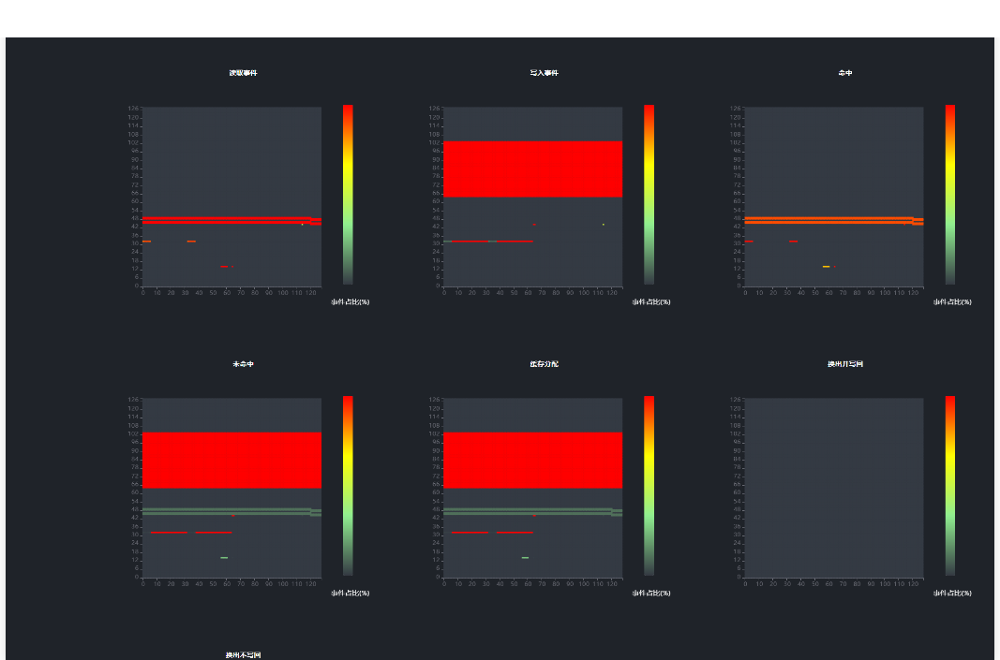    

Binary structure:    

Data block content: Cache information record structure design:

```C++
struct CacheRecord {
    uint32_t loadCount{0};
    uint32_t storeCount{0};
    uint32_t cacheLineId{0};
    uint32_t hit{0};
    uint32_t miss{0};
    uint32_t allocate{0};
    uint32_t evictAndWrite{0};
    uint32_t evictWithoutWrite{0};
};
```

Field Description:

| Parameters        | Description                                                                                                   |
| ----------------- | ------------------------------------------------------------------------------------------------------------- |
| loadCount         | Total number of read events on the current cache set.                                                         |
| storeCount        | Total number of write events on the current cache set.                                                        |
| hit               | Total number of cache set hits.                                                                               |
| miss              | Total number of cache set misses.                                                                             |
| allocate          | Total number of cache set allocations caused by cache misses.                                                 |
| evictAndWrite     | Total number of times that the current cache set swaps out the cacheline and writes the cacheline back to L2. |
| evictWithoutWrite | Number of times that cachelines are not written back after cache sets are swapped out.                        |

Calculation formula: Hit rate = Number of times in each dimension/(loadCount + storeCount)

0x0C Inter-core load

Function page:    

Binary structure:    

Data block content:

```JSON
{
    "advice": "1) core0 vector0 took more time than other vector cores.",
    "op_detail": [
        {
            "core_detail": [
                {
                    "L2cache_hit_rate": "80.157990",
                    "cycles": "265838",
                    "subcore_id": "0",
                    "subcore_type": "vector",
                    "throughput": "2635776"
                },
                {
                    "L2cache_hit_rate": "80.165741",
                    "cycles": "139164",
                    "subcore_id": "1",
                    "subcore_type": "vector",
                    "throughput": "2635776"
                },
                {
                    "L2cache_hit_rate": "94.524757",
                    "cycles": "267206",
                    "subcore_id": "0",
                    "subcore_type": "cube",
                    "throughput": "6825472"
                }
            ],
            "core_id": 0
        }
    ],
    "op_type": "mix",
    "soc": "xxxx"
}
```

0x0D roofline

Function page:    

Binary structure: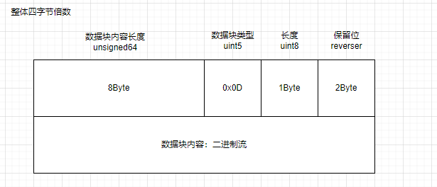    

Data block content format:

```JSON
//Roofline data block
{
 "multiple_rooflines": [
    {
      "title": "Memory Unit",             //Chart Title
      "rooflines": [
        {
          "bw": float,                   //Theoretical bandwidth 
          "computility": float,            //Rooftop Computing Power
          "computility_name": str,       //Computing Power Name
          "point": [float, float]          //Corresponding coordinate point
        },
        {
          "bw": float,                      
          "computility": float,
          "computility_name": str,
          "point": [float, float]
        }
      ]
    }
  ]
}
```

### Timeline View Interface

# Interface List Overview

| Interface Commands       | action                | Type | Remarks |
| ------------------------ | --------------------- | ---- | ------- |
| import/action            | Importing a .bin File |      |         |
| unit/threadTracesSummary |                       |      |         |
| unit/threadTraces        |                       |      |         |

## import/action

### Requested

```JSON
{
  "id": 4769,
  "moduleName": "timeline",
  "type": "request",
  "command": "import/action",
  "params": {
    "path": [
      "D:\\visualize_data.bin"
    ]
  }
}
```

### Response

```JSON
{
  "type": "response",
  "id": 11925,
  "requestId": 4769,
  "result": true,
  "command": "import/action",
  "moduleName": "timeline",
  "body": {
    "isCluster": false,
    "reset": true,
    "isSimulation": true,
    "isBinary": true,
    "isIpynb": false,
    "coreList": [
      "core0.cubecore0",
      "core0.veccore0",
      "core0.veccore1"
    ],
    "sourceList": [
      "/home/xxx.cpp"
    ],
    "result": [
      {
        "cardName": "timeline和热点函数",
        "rankId": "timeline和热点函数",
        "cardPath": "Directory: timeline和热点函数",
        "result": true
      }
    ]
  }
}
```

## unit/threadTracesSummary

### Requested

```JSON
{
  "id": 5022,
  "moduleName": "timeline",
  "type": "request",
  "command": "unit/threadTracesSummary",
  "params": {
    "cardId": "timeline和热点函数",
    "processId": "3",
    "metaType": "",
    "startTime": 0,
    "endTime": 289326,
    "dataSource": {
      "remote": "127.0.0.1",
      "port": 9000,
      "dataPath": [
        "D:\\visualize_data.bin"
      ]
    },
    "timePerPx": 335.6450116009281
  }
}
```

### Response

```JSON
{
  "type": "response",
  "id": 12178,
  "requestId": 5022,
  "result": true,
  "command": "unit/threadTracesSummary",
  "moduleName": "timeline",
  "body": {
    "data": [
      {
        "startTime": 18446744073709550000,
        "duration": 0
      },
      {
        "startTime": 1,
        "duration": 144677
      }
    ]
  }
}
```

## unit/threadTraces

### Requested

```JSON
{
  "id": 5033,
  "moduleName": "timeline",
  "type": "request",
  "command": "unit/threadTraces",
  "params": {
    "cardId": "timeline和热点函数",
    "processId": "3",
    "threadId": "18",
    "metaType": "",
    "startTime": 46319,
    "endTime": 243007,
    "dataSource": {
      "remote": "127.0.0.1",
      "port": 9000,
      "dataPath": [
        "D:\\visualize_data.bin"
      ]
    },
    "timePerPx": 335.6450116009281
  }
}
```

### Responding to

```JSON
{
  "type": "response",
  "id": 12189,
  "requestId": 5033,
  "result": true,
  "command": "unit/threadTraces",
  "moduleName": "timeline",
  "body": {
    "data": [
      [
        {
          "name": "BAR",
          "duration": 1,
          "startTime": 144513,
          "endTime": 144514,
          "depth": 0,
          "threadId": "18",
          "cname": "good",
          "id": "78138"
        }
      ]
    ]
  }
}
```

## unit/flows

### Requested

```JSON
{
  "id": 5238,
  "moduleName": "timeline",
  "type": "request",
  "command": "unit/flows",
  "params": {
    "rankId": "timeline和热点函数",
    "tid": "4",
    "pid": "1",
    "id": "6146",
    "metaType": "",
    "startTime": 107782,
    "endTime": 108381,
    "isSimulation": true
  }
}
```

### Responding to

```JSON
{
  "type": "response",
  "id": 12395,
  "requestId": 5238,
  "result": true,
  "command": "unit/flows",
  "moduleName": "timeline",
  "body": {
    "unitAllFlows": [
      {
        "cat": "MTE2ToVECTOR",
        "flows": [
          {
            "title": "flow",
            "cat": "MTE2ToVECTOR",
            "id": "770",
            "from": {
              "pid": "1",
              "tid": "7",
              "timestamp": 108380,
              "duration": 0,
              "depth": 1,
              "name": "",
              "id": "",
              "metaType": "",
              "rankId": ""
            },
            "to": {
              "pid": "1",
              "tid": "4",
              "timestamp": 108381,
              "duration": 0,
              "depth": 1,
              "name": "",
              "id": "",
              "metaType": "",
              "rankId": ""
            }
          }
        ]
      }
    ]
  }
}
```

## unit/threadDetail

### Requested

```JSON
{
  "id": 5239,
  "moduleName": "timeline",
  "type": "request",
  "command": "unit/threadDetail",
  "params": {
    "rankId": "timeline和热点函数",
    "metaType": "",
    "pid": "1",
    "tid": "4",
    "id": "6146",
    "startTime": 107782,
    "depth": 1,
    "timePerPx": 30.116764580116918
  }
}
```

### Responding to

```JSON
{
  "type": "response",
  "id": 12396,
  "requestId": 5239,
  "result": true,
  "command": "unit/threadDetail",
  "moduleName": "timeline",
  "body": {
    "emptyFlag": false,
    "data": {
      "selfTime": 0,
      "args": "{\"code\":\"/tikcpp/tikcfw/impl/kernel_event.h:719\\n/tikcpp/tikcfw/interface/kernel_common.h:159...",\"detail\":\"PIPE:MTE2,TRIGGERPIPE:VEC,FLAGID:0,\",\"pc_addr\":\"0x126a9674\"}",
      "title": "WAIT_FLAG",
      "duration": 599,
      "cat": "",
      "inputShapes": "",
      "inputDataTypes": "",
      "inputFormats": "",
      "outputShapes": "",
      "outputDataTypes": "",
      "outputFormats": "",
      "attrInfo": ""
    }
  }
}
```

### Data Structure Description

## Data type

If the ninth byte of the data block is an integer 2, it indicates that the data body content is timeline information.

    

## Data body format

### Data Structure Description

    

The data source is tracing.json, which meets the Trace Event Format requirements. The following is an example:

```JSON
{"profilingType": "op",
    "displayTimeUnit": "ns",
    "schemaVersion": 1,
    "traceEvents": [
  {    
   "args": {
                "code": "/home/yanyuwei/workspace/samples-master/operator/AddCustomSample/FrameworkLaunch/AddCustom/build_out/op_kernel/binary/xxxx/kernel_meta_AddCustom_1e04ee05ab491cc5ae9c3d5c9ee8950b/kernel_meta/AddCustom_1e04ee05ab491cc5ae9c3d5c9ee8950b_413903_kernel.cpp:23",
                "detail": "x[1]=0x0,imme16:0x4000",
                "pc_addr": "0x10cfa004"
            },
            "cname": "process_block0",
            "dur": 20,
            "name": "block0",
            "ph": "X",
            "pid": "process_name",
            "tid": "process_block0",
            "ts": 1
        },
        {    
   "args": {
                "code": "/home/yanyuwei/workspace/samples-master/operator/AddCustomSample/FrameworkLaunch/AddCustom/build_out/op_kernel/binary/xxxx/kernel_meta_AddCustom_1e04ee05ab491cc5ae9c3d5c9ee8950b/kernel_meta/AddCustom_1e04ee05ab491cc5ae9c3d5c9ee8950b_413903_kernel.cpp:23",
                "detail": "x[1]=0x0,imme16:0x4000",
                "pc_addr": "0x10cfa004"
            },
            "cname": "prepare",
            "dur": 5,
            "name": "hccl::prepare",
            "ph": "X",
            "pid": "process_name",
            "tid": "process_block0",
            "ts": 2
        },
  {    
   "args": {
                "code": "/home/yanyuwei/workspace/samples-master/operator/AddCustomSample/FrameworkLaunch/AddCustom/build_out/op_kernel/binary/xxxx/kernel_meta_AddCustom_1e04ee05ab491cc5ae9c3d5c9ee8950b/kernel_meta/AddCustom_1e04ee05ab491cc5ae9c3d5c9ee8950b_413903_kernel.cpp:23",
                "detail": "x[1]=0x0,imme16:0x4000",
                "pc_addr": "0x10cfa004"
            },
            "cname": "prepare",
            "dur": 5,
            "name": "hccl::wait",
            "ph": "X",
            "pid": "process_name",
            "tid": "process_block0",
            "ts": 10
        }
    ]
}
```

# Hotspot Command View

This paper introduces the structure and content of the related data body in the binary file.

# Data Type

If the ninth byte of the data block is an integer 1, 3, or 4, the data body content is information related to the hotspot instruction view. Definition in the code:

    

Data type table

| Data Type | Name      | Data Content                                                       |
| --------- | --------- | ------------------------------------------------------------------ |
| 0x01      | SOURCE    | Operator source code, that is, the content of the .cpp file.       |
| 0x03      | API_FILE  | Source code line information, that is, the files part in api.json. |
| 0x04      | API_INSTR | Command line information, that is, instructions in api.json.       |

# Data Body Format

## SOURCE

Description of the binary structure:    4096-byte additional data block (storage file path information):

```text
/home/matmul_leakyrelu_custom.cpp
```

Data block content (CPP source code content)

```text
#include "kernel_operator.h"\n#include "lib/matmul_intf.h"\n\nusing namespace...
```

## API_FILE

Description of the binary structure:

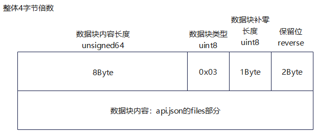    Data block content description (files in api.json):

```json
{
  "Cores": [ //Computing core for executing the operator, for example, core0.cubecore0 or core0.veccore0.
    string
  ],
  "Files Dtype": { //Specify column names and data types
//Key-value pair in the Files Dtype->Lines object, which specifies the key name and value type of the key-value pair in each object in the Files->Lines array.
//skip 0 (indicates that the column does not need to be displayed on the GUI.), int 1, float 2, string 3
//Data fields that are not collected do not need to be specified here.
//Key-value pair that supports dynamic parsing. The value must be a single or one-dimensional array. Two-dimensional arrays such as Address Range do not support dynamic parsing and need to be specified separately.
        "Lines": {
            "Address Range": 0,
            "Cycles": 1,
            "Instructions Executed": 1,
            "Line": 1,
            "L2Cache Hit Rate": 3
    }
  },
  "Files": [ //Code line information in the source code file
    {
      "Lines": [ //Instruction address range associated with the line of code, clock cycles consumed, total number of instructions executed
        {
          "Address Range": [ //The instruction address range associated with the current line of code
            [
              string
            ]
          ],
          "Cycles": [ //Total number of clock cycles consumed by the current code line on each computing core (corresponding order?)
            int
          ],
          "Instructions Executed": [ //Total number of instructions executed by the current code line on each computing core (corresponding order?)
            int
          ],
          "Line": 100 //Code line number
        }
      ],
      "Source": string //Source Code File Path
    }
  ]
}
```

## API_INSTR

Description of the binary structure:

    Data block content description (instructions in api.json):

```json
{
  "Cores": [ //Computing core for executing the operator, for example, core0.cubecore0 or core0.veccore0.
    string
  ],
"Instructions Dtype": { //Specify column names and data types
//Instructions Dtype->Key-value pair in the Instructions object, which specifies the key name and value type of the key-value pair in each object in the Instructions array.
//skip 0 (indicates that the column does not need to be displayed on the GUI.), int 1, float 2, string 3
//Data fields that are not collected do not need to be specified here.
//Key-value pair that supports dynamic parsing. The value must be a single or one-dimensional array. Two-dimensional arrays do not support dynamic parsing and need to be defined separately.
    "Instructions": {
        "Address": 3,
        "AscendC Inner Code": 3,
        "Cycles": 1,
        "Instructions Executed": 1,
        "Pipe": 3,
        "TheoreticalStallCycles": 1,
        "Source": 3,
        "RealStallCycles": 1,
        "L2Cache Hit Rate": 3
     }
},
  "Instructions": [
    {
      "Address": string,    //Indicates the offset address of an instruction, for example, 0x1269f000.
      "AscendC Inner Code": string, //Source code file path and code line number, for example, /home/xxx.cpp:23.
      "Cycles": [      //Clock cycles consumed by an instruction on each computing core
        int
      ],
      "Instructions Executed": [  //Number of times an instruction is executed on each computing core.
        int
      ],
      "Pipe": string,     //Instruction queue to which an instruction belongs, for example, SCALAR.
      "TheoreticalStallCycles": [                    //Expected Blocking Time
        int
      ],
      "Source": string,     //Instruction content, for example, "MOV_XD_IMM XD:X29,IMM"
      "RealStallCycles": [                    //Actual blocking time
        int
      ]
    }
  ]
}
```

# Hot Command Interface Document

# Interface List Overview

| Interface Commands      | action                                                                     | Type | Remarks |
| ----------------------- | -------------------------------------------------------------------------- | ---- | ------- |
| source/code/file        | Obtains the operator source code text.                                     | Get  |         |
| source/api/line         | Gets information about the directive associated with the source code line. |      |         |
| source/api/instructions | Obtain the information corresponding to the instruction.                   |      |         |

# Interface Definition

## source/code/file

### Requested

```json
{
  "id": 4772,
  "moduleName": "source",
  "type": "request",
  "command": "source/code/file",
  "params": {
    "sourceName": "/home/xxx.cpp"
  }
}
```

### Response

```json
{
  "type": "response",
  "id": 11928,
  "requestId": 4772,
  "result": true,
  "command": "source/code/file",
  "moduleName": "source",
  "body": {
    "fileContent": "#include \"kernel_operator.h\"\n#include \"lib/matmul_intf.h\"\n\nusing namespace AscendC;\nusing namespace matmul;..."
  }
}
```

## source/api/line

### Requested

```json
{
  "id": 4776,
  "moduleName": "source",
  "type": "request",
  "command": "source/api/line",
  "params": {
    "sourceName": "xxx.cpp",
    "coreName": "core0.cubecore0"
  }
}
```

### Response

```json
{
  "type": "response",
  "id": 11929,
  "requestId": 4773,
  "result": true,
  "command": "source/api/line",
  "moduleName": "source",
  "body": {
    "lines": [
      {
        "Line": 0,
        "Instructions Executed": 15,
        "Cycles": 15,
        "Address Range": [
          [
            "0x1269fe78",
            "0x1269feb0"
          ]
        ]
      }
    ]
  }
}
```

## source/api/instructions

### Requested

```json
{
  "id": 4777,
  "moduleName": "source",
  "type": "request",
  "command": "source/api/instructions",
  "params": {
  }
}
```

### Response

```json
{
  "type": "response",
  "id": 11927,
  "requestId": 4771,
  "result": true,
  "command": "source/api/instructions",
  "moduleName": "source",
  "body": {
    "instructions": "{\"Cores\":[\"core0.cubecore0\",\"core0.veccore0\"...]}"
  }
}
```

# Memory Load View Interface Documentation

# Interface List Overview

| Interface address              | action                               | Type | Remarks |
| ------------------------------ | ------------------------------------ | ---- | ------- |
| source/details/baseInfo        | Obtaining Basic Operator Information | Get  |         |
| source/details/computeworkload | Obtaining the Computing Load Graph   |      |         |
| source/details/memoryGraph     | Obtaining the Memory Heatmap         |      |         |
| source/details/memoryTable     | Get access table                     |      |         |

# Obtaining Basic Operator Information

## Request

```json
{
    "id": 281,
    "moduleName": "source",
    "type": "request",
    "command": "source/details/baseInfo",
    "params": {
    }
}
```

## Response

```json
{
    "type": "response",
    "id": 603,
    "requestId": 285,
    "result": true,
    "command": "source/details/baseInfo",
    "moduleName": "source",
    "body": {
        "name": "sin_custom",
        "soc": "xxxx",
        "opType": "vector",
        "blockDim": "32",
        "mixBlockDim": "-1",
        "duration": "13.15999984741211",
        "blockDetail": {
            "headerName": [
                "Block ID",
                "Core Type",
                "Duration (μs)"
            ],
            "size": [
                "33",
                "3"
            ],
            "row": [
                {
                    "value": [
                        "0",
                        "vector",
                        "5.480606"
                    ]
                }
            ]
        },
        "advice": []
    }
}
```

# source/details/computeworkload

## Request

```json
{
    "id": 286,
    "moduleName": "source",
    "type": "request",
    "command": "source/details/computeworkload",
    "params": {
    }
}
```

## Response

```json
{
    "type": "response",
    "id": 604,
    "requestId": 286,
    "result": true,
    "command": "source/details/computeworkload",
    "moduleName": "source",
    "body": {
        "blockIdList": [
            "31"
        ],
        "chartData": {
            "detailDataList": [
                {
                    "blockId": "0",
                    "blockType": "vector0",
                    "name": "ALL_ACTIVE",
                    "unit": "PRE",
                    "value": "73.6",
                    "originValue": "6656.0"
                }
            ],
            "advice": []
        },
        "tableData": {
            "detailDataList": [
                {
                    "blockId": "0",
                    "blockType": "vector0",
                    "name": "ALL_ACTIVE",
                    "unit": "Instructions",
                    "value": "3606.0"
                }
            ],
            "advice": []
        }
    }
}
```

# source/details/memoryGraph

## Request

```json
{
    "id": 287,
    "moduleName": "source",
    "type": "request",
    "command": "source/details/memoryGraph",
    "params": {
        "blockId": "0",
        "showAs": "request"
    }
}
```

## Response

```json
{
    "type": "response",
    "id": 605,
    "requestId": 287,
    "result": true,
    "command": "source/details/memoryGraph",
    "moduleName": "source",
    "body": {
        "coreMemory": [
            {
                "advice": [],
                "blockId": "0",
                "l2Cache": {
                    "hitRatio": "16.88311767578125",
                    "hit": "13",
                    "totalRequest": "77",
                    "miss": "64"
                },
                "blockType": "vector",
                "chipType": "xxxx",
                "memoryUnit": [
                    {
                        "request": 257,
                        "display": true,
                        "peakRatio": "4.737319",
                        "bandwidth": "3.637730836868286",
                        "memoryPath": "12"
                    }
                ],
                "vector": {
                    "cycle": "6656",
                    "totalCycles": "9043",
                    "ratio": ""
                },
                "vector1": {
                    "cycle": "",
                    "totalCycles": "",
                    "ratio": ""
                },
                "cube": {
                    "cycle": "",
                    "totalCycles": "",
                    "ratio": ""
                }
            }
        ]
    }
}
```

# source/details/memoryTable

## Request

```json
{
    "id": 288,
    "moduleName": "source",
    "type": "request",
    "command": "source/details/memoryTable",
    "params": {
        "blockId": "0",
        "showAs": "request"
    }
}
```

## Response

```json
{
    "type": "response",
    "id": 606,
    "requestId": 288,
    "result": true,
    "command": "source/details/memoryTable",
    "moduleName": "source",
    "body": {
        "memoryTable": [
            {
                "advice": [],
                "blockId": "0",
                "tableOpType": "vector",
                "tableDetail": [
                    {
                        "headerName": [
                            "",
                            "hit",
                            "miss",
                            "total",
                            "hit rate(%)"
                        ],
                        "tableName": "Cache",
                        "size": [
                            "4",
                            "4"
                        ],
                        "row": [
                            {
                                "name": "L2 Cache Write",
                                "value": [
                                    "13",
                                    "64",
                                    "77",
                                    "16.883118"
                                ]
                            },
                        ]
                    },
                ]
            }
        ]
    }
}
```

# Memory view data structure description

# Data format in the input .bin file

## Data Type

If the ninth byte of the data block is an integer 5-9, it indicates that the data body content is the information about the load. Definition in the code:

    

Data type table

| Data Type | Name                       | Data Content                |
| --------- | -------------------------- | --------------------------- |
| 0x05      | DETAILS_BASE_INFO          | Operator basic information  |
| 0x06      | DETAILS_COMPUTE_LOAD_GRAPH | Calculate the load diagram. |
| 0x07      | DETAILS_COMPUTE_LOAD_TABLE | Calculate the load diagram. |
| 0x08      | DETAILS_MEMORY_GRAPH       | Memory access heat map      |
| 0x09      | DETAILS_MEMORY_TABLE       | fetch table                 |

## Data body format

The data source is tracing.json, which meets the Trace Event Format requirements. The following is an example:

### DETAILS_BASE_INFO

Description of the binary structure:

    

The JSON format is described as follows:

```json
{
    "name": str,            //Operator name
    "soc": str,             //Operator running platform
    "op_type": enum,        //Operator type: aic, aiv, mix
    "block_dim": uint16,    //Block dim data
    "mix_block_dim": uint16,//Number of slave cores under the mix operator
    "duration": float32,    //Operator Total Duration
    "device_id": uint16,    //Device No.
    "pid": str,                    //Process ID
    "block_detail": [       //Valid when op_type = aic/aiv
        {
            "block_id": uint16,     //Sub block ID.
            "core_type": enum,      //Indicates the sub block type. The options are as follows: aic and aiv.
            "duration": float32,    //Duration of sub block
        }
    ],
    "mix_block_detail": [ //Valid when op_type == mix
        {
            "block_id": uint16,  //Block ID.                 
            "duration": [float32, float32, float32], //Indicates the duration of the sub block. The values are as follows: aic, aiv0, and aiv1.
        }
    ],
    "advice": [ //Suggestion. Currently, this field is empty and reserved.
        string, string, ...
    ]
}
```

**Note that only one of the block_detail and mix_block_detail fields is valid. block_detail and mix_block_detail are lists, including 0 to N dict/map.**

### DETAILS_COMPUTE_LOAD_GRAPH

Description of the binary structure:

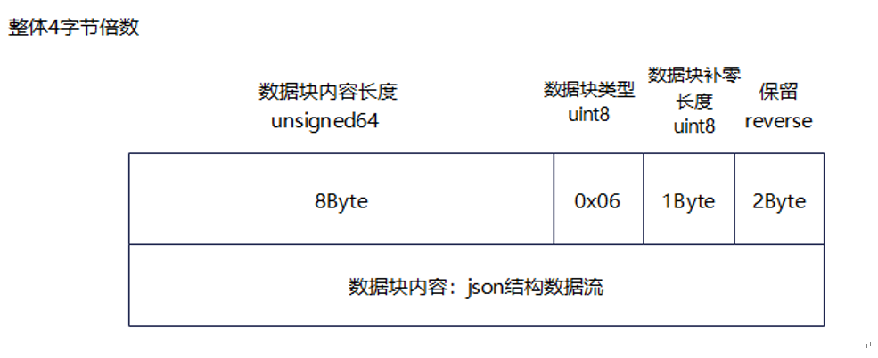    The JSON structure is described as follows:

```json
{
    "subblock_detail": [
        {
            "block_id": uint8,      //Block ID, that is, the sequence number of the master core.
            "block_type": enum,     //Indicates the sub block type. The options are as follows: aic, aiv, aiv0, and aiv1.
            "data_detail": {
                "name": string,     //Calculate the load data name.
                "unit": enum,       //Data unit:%
                "value": float32,    //Value
            },
           "advice": string
        }
    ],
    "advice": [ //Suggestion. Currently, this field is empty and reserved.
        string, string, ...
    ]
}
```

### DETAILS_COMPUTE_LOAD_TABLE

Description of the binary structure:

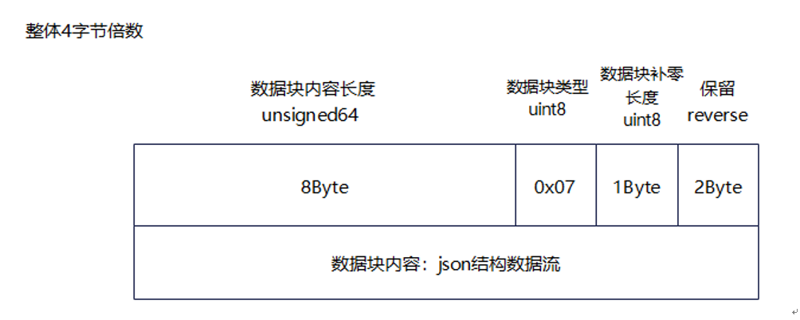    

The JSON structure is described as follows:

```json
{
    "subblock_detail": [
        {
            "block_id": uint8,      //Block ID, that is, the sequence number of the master core.
            "block_type": enum,     //Sub block type: aic, aiv, aiv0, aiv1
            "data_detail": {
                "name": string,     //Calculate the load data name.
                "unit": enum,       //Data unit: us, instructions, and data volume (byte)
                "value": float32,   //Value
            },
            "advice": string
        }
    ],
    "advice": [ //Suggestion. Currently, this field is empty and reserved.
        string, string, ...
    ]
}
```

### DETAILS_MEMORY_GRAPH

Description of the binary structure:

    

JSON structure description

```json
{
    "core_memory_map": [
        {
            "core_no": uint16,      //Block ID.
            "core_type": enum,      //Block type: aic, aiv, mix
            "memory_unit": [        //Path List
                {
                    "memory_path": enum,        //Transfer path name.
                    "request": uint64,          //Number of requests
                    "request_per_byte": uint8,  //Data volume requested each time
                    "bandwidth": float32,       //Bandwidth
                    "peak_ratio": float32,         //Indicates the peak band ratio. The value -1 indicates invalid data.
                    "display": bool,            //Display this channel
                }
            ],
            "L2cache": [
                "hit": uint64,              //Number of cache hits
                "miss": uint64,             //Number of cache misses
                "total_request": uint64,    //Total number of cache requests.
                "hit_ratio": int8,          //Hit ratio: - 1 indicates invalid data.
            ], 
            "advice": [ //Advice
                string, string, ...
            ]
        }
    ]
}
```

### DETAILS_MEMORY_TABLE

Description of the binary structure:

    

The JSON structure is described as follows:

```json
{
    "table_per_block": [
        {
            "block_id": uint,       //block id
            "table_op_type": enum,  //Table data type: aic, aiv, mix
            "tables_detail": [
                {
                    "table_name": string,   //Table Name
                    "size": [uint8, uint8], //Table size: [Number of rows, Number of columns]
                    "header_name": [        //Column name (consistent with the number of columns)
                        string, string, ...
                    ],
                    "row": [                //Row data (consistent with the number of rows)
                        "name": string,     //Line Name
                        "value": [          //Row data: length is the number of columns - 1
                            float16, float16, ....
                        ]
                    ],
                }
            ],
            "advice": [ //The suggestion
                string, string, ...
             ]
        },
    ],

    "advice": [ //Suggestion. Currently, this field is empty and reserved.
        string, string, ...
    ]
}
```

# Data structure of the memory read/write timing diagram (POC)

The format of the unified binary deliverable is as follows: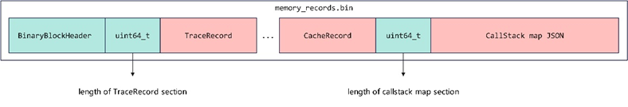    

File protocol header structure design:

```C++
struct BinaryBlockHeader {
    uint64_t contentSize = 0;
    uint8_t type = 0;
    uint8_t padding = 0;
    uint16_t reverse = 0x5a5a;
};
```

Memory read/write sequence diagrams can be constructed based on the memory read/write sequence information output by the msTraceKit tool. Memory Read and Write Record Structure Design

```C++
struct TraceRecord {
    uint8_t type;
    int8_t coreId;
    int8_t space;
    uint8_t blockType;
    uint32_t recordId;
    uint64_t addr;
    uint64_t memSize;
    uint64_t pc;
};
```

Description of the fields in the TraceRecord structure:

| Parameter | Description                                                                                                         |
| --------- | ------------------------------------------------------------------------------------------------------------------- |
| type      | Memory event type: - MALLOC=0 - FREE=1 - MEMCPY_BLOCKS=2 - LOAD=3 - STORE=4                                         |
| coreId    | ID of the core where this memory event occurs                                                                       |
| space     | Type of address space for this memory event action memory: - PRIVATE=0 - GM=1 - L1=2 - L0A=3 - L0B=4 - L0C=5 - UB=6 |
| blockType | Type of block where this memory event occurred: - AIV=0 - AIC=1                                                     |
| recordId  | Number of this memory event                                                                                         |
| addr      | Memory address for this memory event operation                                                                      |
| memSize   | Memory length for this memory event operation ()                                                                    |
| pc        | The location of the code where this memory event occurred corresponds to the PC address                             |

The CallStack map table is designed as a JSON object. The field types and meanings are as follows:

| Field              | Type   | Description                                                                                                                    |
| ------------------ | ------ | ------------------------------------------------------------------------------------------------------------------------------ |
| `<root>`           | Object | JSON object of memory read/write records.                                                                                      |
| +`<PcAddr>`        | Object | To facilitate query, the PC address is used as the key, and the corresponding call stack information is represented by Object. |
| ++`Address`        | String | PC address corresponding to the call stack.                                                                                    |
| ++`ModuleName`     | String | Name of the compilation unit corresponding to the call stack.                                                                  |
| ++`Symbol`         | Array  | Symbolic relationships involved in the call stack call array.                                                                  |
| +++`<Symbol>`      | Object | Each symbol information is represented by an object.                                                                           |
| ++++`Column`       | Int    | Column number of the call stack symbol in the code.                                                                            |
| ++++`Line`         | Int    | Line number of the call stack symbol in the code                                                                               |
| ++++`FileName`     | String | Name of the code file where the call stack symbol is located.                                                                  |
| ++++`FunctionName` | String | Name of the function where the call stack symbol is located.                                                                   |

An example of the call stack information mapping is as follows:

```JSON
[
{
    "Address": "0x4004be",
    "ModuleName": "inlined.elf",
    "Symbol": [
      {
        "Column": 18,
        "Discriminator": 0,
        "FileName": "/tmp/test.cpp",
        "FunctionName": "baz()",
        "Line": 11,
        "StartAddress": "0x4004be",
        "StartFileName": "/tmp/test.cpp",
        "StartLine": 9
      },
      {
        "Column": 0,
        "Discriminator": 0,
        "FileName": "/tmp/test.cpp",
        "FunctionName": "main",
        "Line": 15,
        "StartAddress": "0x4004be",
        "StartFileName": "/tmp/test.cpp",
        "StartLine": 14
      }
    ] 
  }
]
```

# Cache hit ratio graph data structure (POC)

Data block structure of the binary .bin file:    

Cache information record structure design:

```cpp
struct CacheRecord {
    uint32_t loadCount{0};
    uint32_t storeCount{0};
    uint32_t cacheLineId{0};
    uint32_t hit{0};
    uint32_t miss{0};
    uint32_t allocate{0};
    uint32_t evictAndWrite{0};
    uint32_t evictWithoutWrite{0};
};
```

Field Description:

| Parameters        | Description                                                                                                   |
| ----------------- | ------------------------------------------------------------------------------------------------------------- |
| loadCount         | Total number of read events on the current cache set.                                                         |
| storeCount        | Total number of write events on the current cache set.                                                        |
| hit               | Total number of cache set hits.                                                                               |
| miss              | Total number of cache set misses.                                                                             |
| allocate          | Total number of cache set allocations caused by cache misses.                                                 |
| evictAndWrite     | Total number of times that the current cache set swaps out the cacheline and writes the cacheline back to L2. |
| evictWithoutWrite | Number of times that cachelines are not written back after cache sets are swapped out.                        |

Calculation formula: Hit rate = Number of times in each dimension/(loadCount + storeCount)
