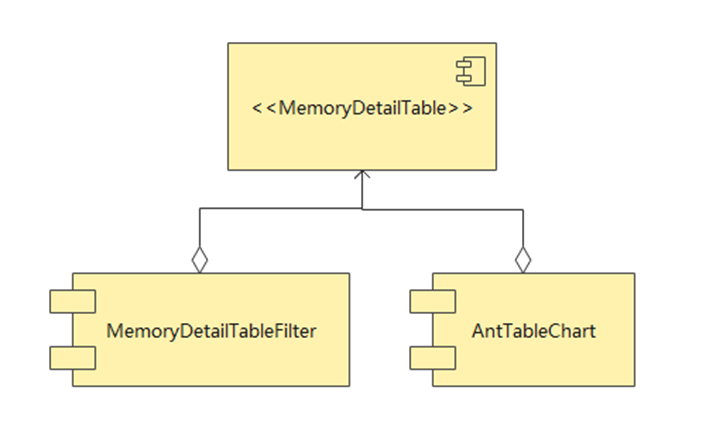
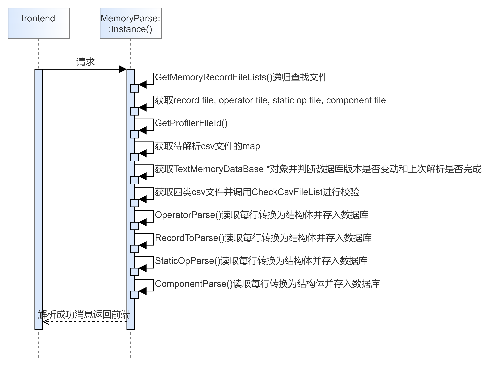
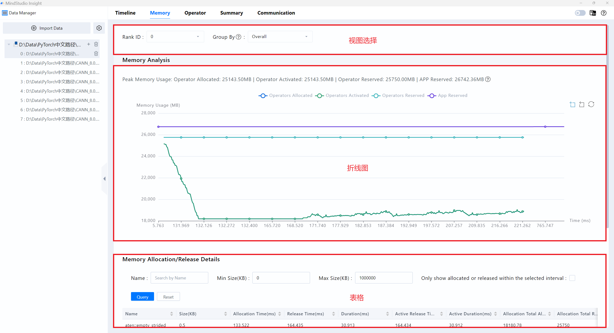
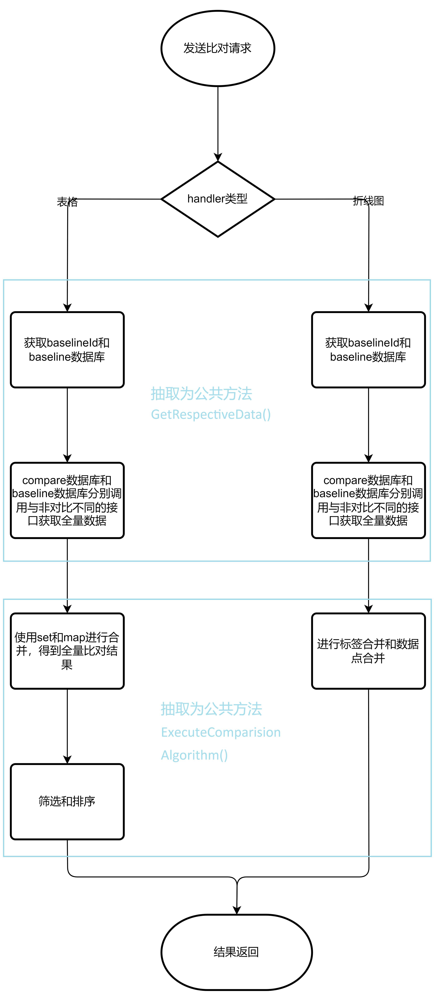

# Memory Design Document

## Memory front-end logic

Main Ideas for Optimizing the Memory Interface    

Memory GUI Architecture    

Implementation of Header on the Memory Page    

Implementation of the line chart on the Memory page    

Implementation of the Table at the Bottom of the Memory Interface    

## Backend code logic of the memory interface

### File parsing

The file parsing entry of MindStudio Insight is ImportActionHandler. Different functions are invoked to parse files based on the file format.

#### TEXT

For a text file, the file parsing entry of the Memory module is Memory::MemoryParse::Instance().Parse(), as shown in the following figure.    The server/src/modules/memory/parser parses a text file and saves it to the database.

#### DB

If the file is in DB format, the file parsing entry of the Memory module is FullDb::FullDbParser::Instance().Parse(). The DB format file remains basically the same when it is parsed.

### Querying data

The following figure shows the sequence from the frontend to the backend.    The server/src/modules/memory/protocol processes the task of converting the JSON structure to the request structure and the response structure to the JSON structure. The server/src/modules/memory/database processes the tasks for querying the TextMemoryDataBase and DbMemoryDataBase. The server/src/modules/memory/handler processes the handler logic and compares the logic. The QueryMemoryOperatorHandler (dynamic chart table) and QueryMemoryStaticOperatorListHandler (static chart table) can be compared. QueryMemoryViewHandler (Dynamic Line Chart), QueryMemoryStaticOperatorGraphHandler (Static Line Chart), and QueryMemoryComponentHandler (Component Table) You can view the parameters of the interface TinyMock, an efficient, easy-to-use, and powerful visual interface management platform.

## Service Process

1. Business Process    The Memory interface is divided into three parts. The first part is view selection, the second part is a line chart, and the third part is a table. 1. In the Select View area, you can select rank id and grouping mode from the drop-down list box. If the data is in full DB format, you can select host name from the drop-down list box. The combination of host name and rank ID uniquely identifies a single SIM card. The grouping mode can be Global, Flow, or Component. Data source of Global and Stream: In the dynamic chart scenario, a line chart and a table are available. The line chart data is obtained from memory_record.csv, and the table data is obtained from operator_memory.csv. In the static chart scenario, two line charts and a table are available. The line chart data is obtained from memory_record.csv and static_op_mem.csv, and the table data is obtained from static_op_mem.csv. Data source of the component: a line chart and a table. The line chart data is obtained from memory_record.csv, and the table data is obtained from npu_module_mem.csv. 2. The display logic of a line chart is the same, regardless of the dynamic or static scenario, one or two charts. Each diagram consists of two parts: a legend and a polyline. The data type for the legend is`std::vector<std::string> legends`to store legend names in sequence. The data type of a polyline is`std::vector<std::vector<std::string>> lines`, first look at the outermost vector. For each fixed index, lines\[index\] indicates a vertical line on the line chart, that is, the points corresponding to a fixed horizontal coordinate on the line chart. That inner data structure`std::vector<std::string>`, is the order of these points, and the order of these points corresponds to the order of legends. 3. Tables and tables display corresponding CSV data. The query function is added (not supported when the grouping mode is component). Supported query conditions: name (substring) and size: The upper and lower bound charts are associated. Line charts can be selected by box. In dynamic charts, a time range (node index range corresponding to static charts) is displayed after a box is selected,    If Only show allocated or released within the selected interval is not selected, operators of category 1, 2, 3, and 4 are displayed. If only show allocated or released within the selected interval is selected, operators of category 2, 3, and 4 are displayed. Sorting II. Comparison Function    
