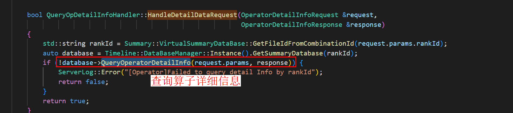
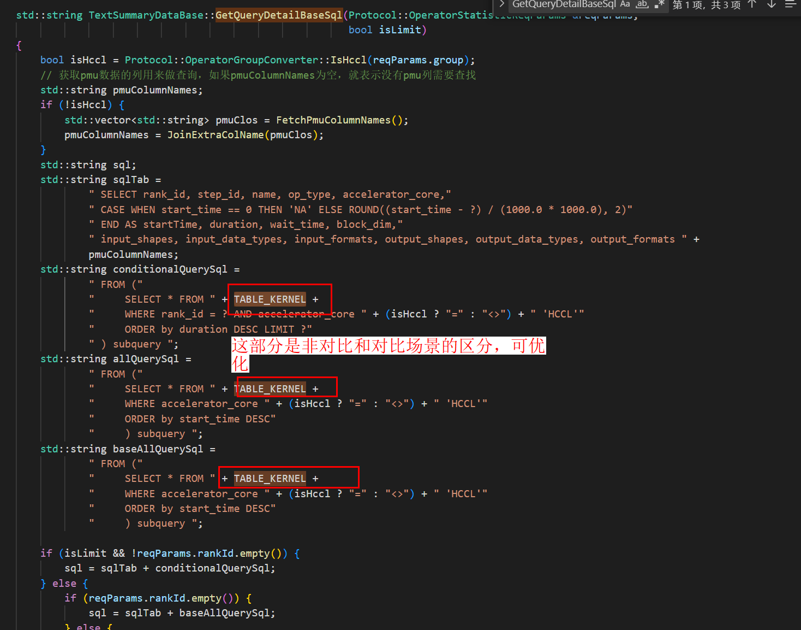
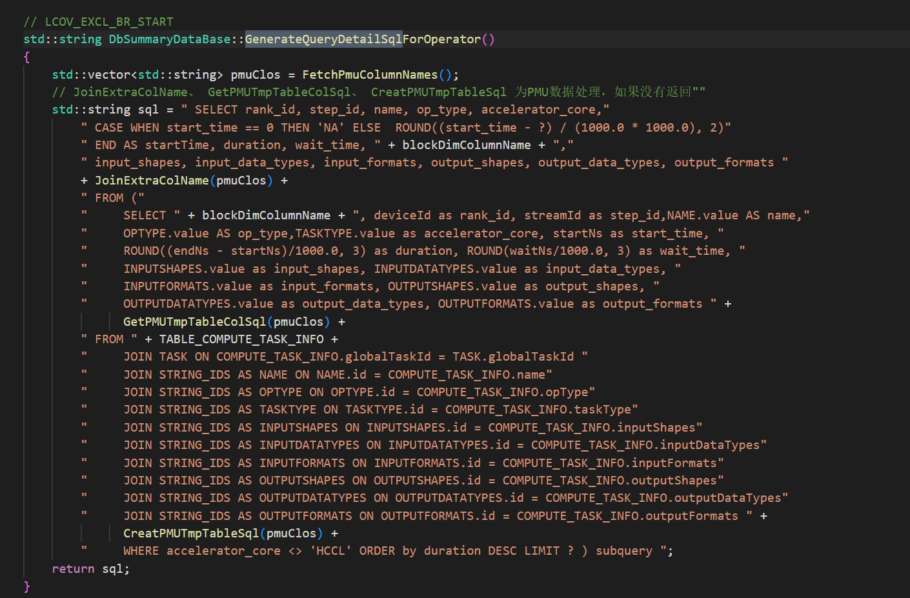

# Operator Design Document

## Frontend code logic on the operator page

    

### Logical structure of the main body

    

The Operator page consists of the following three parts: upper filter criteria, middle pie chart, and details table. The corresponding code block is Filter.tsx+DetailChart.tsx+DetailTable.tsx. In addition, the implementation of the table details in the lower part focuses on the BaseTable.

Other items to be concerned

1. Communication between the operator module and the framework: modules\\operator\\src\\connection\\handler.ts
2. Front-end and back-end communication ports of the operator module: modules\\operator\\src\\components\\RequestUtils.ts
3. Column name configuration in the table details of the operator module: modules\\operator\\src\\components\\TableColumnConfig.tsx

## Backend code logic on the operator page

The following code is used as an example in the QueryOpDetailInfoHandler non-comparison scenario. The logical structure of the request operator for obtaining operator details is clear and the overall process is not complex. The main purpose is to query data from the database and return the data to the frontend for display. Handlers do similar things, but they need the assistance of peripheral components. Support is mainly provided by peripheral components, such as dbManager, kernelParser, and TimelineParser.

### Front-end information (supported by peripheral components)

KernelParser: dbManager: full DB structure:

### 1. The PU sends a message

The ProtocolDefs.h file contains all message definitions. The frontend sends a message of the character string type to the backend. For example, REQ_RES_OPERATOR_DETAIL_INFO is used as an example. Check the request and response relationship of the operator details const std::string REQ_RES_OPERATOR_DETAIL_INFO = "operator/details";. The frontend sends the operator/details message and related parameters of the request.

### 2. Distribute the message to the corresponding handler

The requestHandlerMap is registered in OperatorModule.cpp. Find the handler corresponding to operator/details based on the message type.

### 3. Invoke the QueryOpDetailInfoHandler function

    

### 4. Query the database and obtain the parameters

    

#### 4.1 Database management

```c++
auto database = Timeline::DataBaseManager::Instance().GetSummaryDatabase(rankId);
```

The database is in the DataBaseManager. You can view the reason why the database connection can be obtained and the specified database can be queried. The rank ID is used.    

#### 4.2 TEXT and DB Database

##### 4.2.1 Text

When Type is set to TXT, data is stored in the kernelTable. SQL statements can be used to directly query data.    pmuColumnNames is the table header for querying operator details, mainly register information.

##### 4.2.2 Type=DB Scenario

Multi-table linked query required    

### 5. Return data and convert the data into JSON files for the frontend


