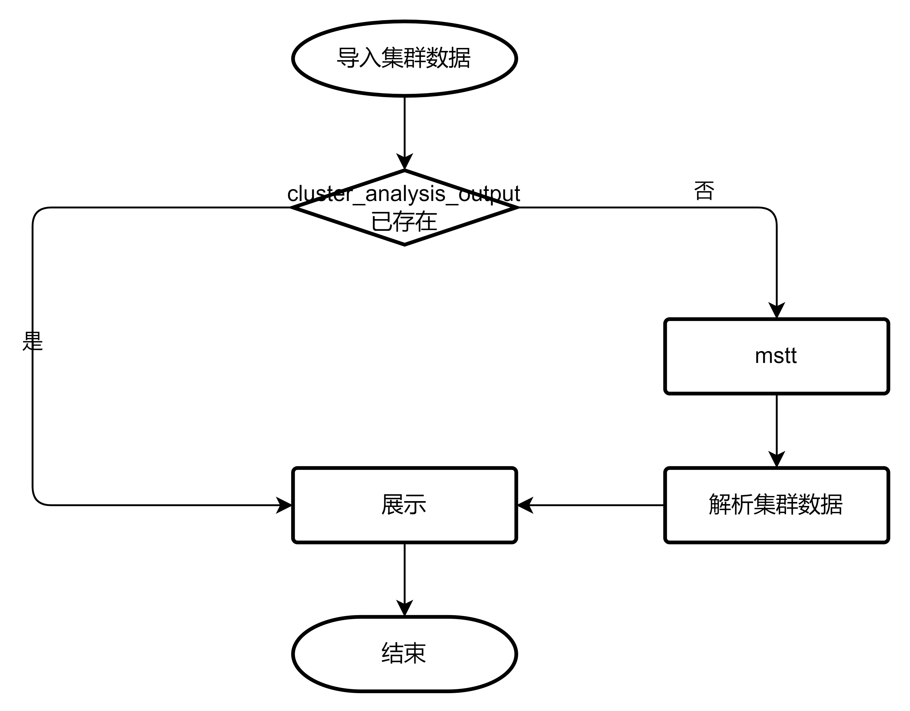
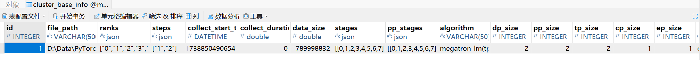
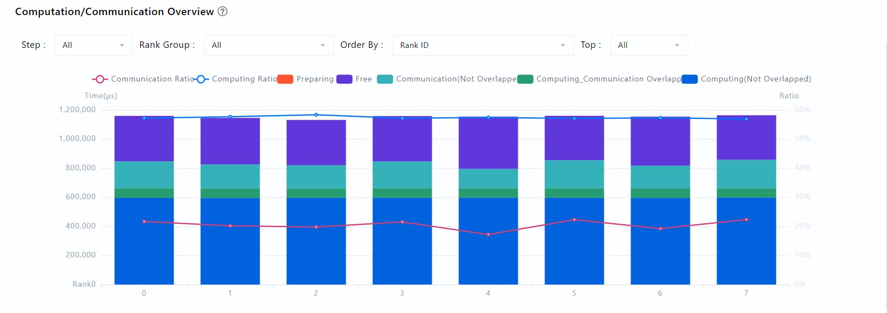
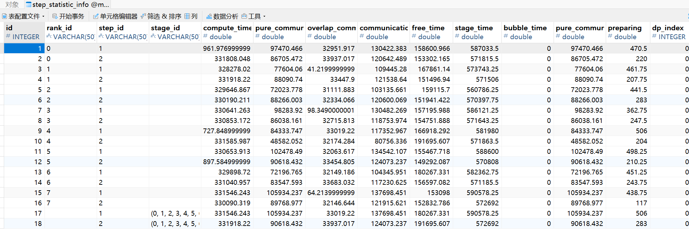

# Summary Design Document

## Cluster data parsing

### Data source of the cluster

[Collection Mode](https://gitcode.com/Ascend/pytorch/blob/v2.7.1-26.0.0/docs/en/ascend_pytorch_profiler/ascend_pytorch_profiler_user_guide.md)    

Only PyTorch training data is considered. Text format: └── localhost.localdomain_139247_20230628101435_ascend_pt   ├── profiler_info.json   ├── profiler_metadata.json   ├── ASCEND_PROFILER_OUTPUT   │  ├── communication.json // provides visualized data basis for performance analysis in scenarios where multiple cards or clusters communicate with each other. Configure profiler_level=torch_npu.profiler.ProfilerLevel.Level1 or profiler_level=torch_npu.profiler.ProfilerLevel.Level2 of experimental_config to generate basic information files about small │  ├── communication_matrix.json // communication operators. Configure profiler_level=torch_npu.profiler.ProfilerLevel.Level1 or profiler_level=torch_npu.profiler.ProfilerLevel.Level2 of experimental_config to generate basic information files about small operators.

DB format: In scenarios where multiple └── localhost.localdomain_139247_20230628101435_ascend_pt   ├── profiler_info.json   ├── profiler_metadata.json   ├── ASCEND_PROFILER_OUTPUT   │  ├── analysis.db // cards or cluster communication exists, .db files are generated in this directory when export_type=torch_npu.profiler.ExportType.Db is set. Other .json and .csv files are not generated and displayed by the MindStudio Insight tool.

### mstt cluster analysis tool

[mstt cluster analysis tool](https://gitcode.com/Ascend/mstt/blob/26.0.0/profiler/msprof_analyze/README.md)    

Windows

```shell
cluster_analysis.exe -d . -m mode
```

Linux

```shell
python3 cluster_analysis.py -d . -m mode
```

Why does Linux start the cluster analysis tool in Python mode? Because most popular Linux distributions have the Python interpreter installed by default. (However, manual installation may be required in some lite or custom environments). You can directly invoke the Python interpreter. In Windows and macOS systems, the Python interpreter and cluster analysis tool scripts are packaged into executable files using pyinstaller to prevent users from installing the Python interpreter.

Mac

```shell
cluster_analysis -d . -m mode
```

If the data is in DB format, the following options are added:

```shell
--data_simplification
```

The mode options are all communication_time communication_matrix.

### Output of the mstt cluster analysis tool

Text format: 
└── cluster_analysis_output   
     ├── cluster_step_trace_time.csv   
     ├── cluster_communication_matrix.json   
     ├── cluster_communication.json   
     ├── communication_group.json

DB format: 
└── cluster_analysis_output   
     ├── cluster_analysis.db

Process of parsing text data:

    

Step 1: mode==communication_matrix processes cluster_communication_matrix.json cluster_step_trace_time.csv communication_group.json step2: mode==communication_time processes cluster_communication.json.

The process of parsing data in DB format is as follows:

    

## Summary data display

### Basic Information

Interface: summary/queryTopData

Data source: TEXT: cluster_base_info table

    DB: ClusterBaseInfo table

    

### parallelism strategy generation

Interface:

    

Interface: summary/set/parallelStrategy

Data source: parallelism strategy parameters configured by users or read from files

### parallelism strategy display

Interface: Assume that the data of the TP==tensor parallel CP==context parallel EP==expert parallel DP==data parallel PP==pipeline parallel is 16 cards, the Algorithm is TP-CP-EP-DP-PP, TP=2, CP=2, EP=1, DP=2, PP=2, and parallelism strategy is calculated as follows: At the beginning, each card of cards 0-15 is a group. Because TP=2, two neighboring groups are parallel TP, that is, 0-1 TP, 2-3 TP, and so on. Now, the grouping becomes eight groups: 0-1 TP, 2-3 TP, and so on. Two groups of TPs are displayed in parallel by using a box to frame the two groups together. Because CP=2, the neighboring groups perform CP parallel, that is, groups 0-1 and 2-3 perform CP parallel, groups 4-5 and 6-7 perform CP parallel, and so on. Now the grouping is changed to four groups: 0-1-2-3. Group 4-5-6-7, group 8-9-10-11, group 12-13-14-15. Two groups of CPs are displayed in parallel by two boxes to separate the two groups. Because EP=1, there is no impact. Because DP=2, every two neighboring groups perform DP parallel, that is, groups 0-1-2-3 and 4-5-6-7 perform DP parallel, groups 8-9-10-11 and 12-13-14-15 perform DP parallel, Now the groupings become 2 groups: 0-1-2-3-4-5-6-7 groups, 8-9-10-11-12-13-14-15 groups. Two group DPs are displayed in parallel by two boxes to separate the two groups. Because PP=2, the neighboring groups are configured with PP parallel, that is, groups 0-1-2-3-4-5-6-7 and 8-9-10-11-12-13-14-15 are configured with PP parallel. Now, the grouping becomes one group: 0-1-2-3-4-5-6-7-8-9-10-11-12-13-14-15 group. The parallel policy display is complete. Two groups of PPs are displayed in parallel by using a box to frame the two groups together.    

Interface: parallelism/arrangement/all

Data source: None

### Display of the time proportion of the internal card in the communication domain

Interface:

    

    

Interface: parallelism/performance/data

Data source: TEXT. Data in the step_statistic_info table is obtained from cluster_step_trace_time.csv.    

DB: ClusterStepTraceTime table

### Details

Interface:

    

Interface: summary/statistic

Data source: single SIM card information
