# Timeline Design Document

## 1. Concept Description

In the Ascend heterogeneous computing architecture, MindStudio Insight displays the running details of hosts and devices during training and inference on the timeline, and intuitively displays the API time consumption on the host and the task time consumption on the device. In addition, hosts and devices are associated and displayed, helping users quickly identify host bottlenecks or device bottlenecks. In addition, functions such as filtering categories and expert suggestions are provided to support in-depth optimization.

**Basic concepts:**

1. Unit: indicates a device, process, thread, or task flow.
    
    1. CardUnit
        
        1. ProcessUnit and LabelUnit (The main difference lies in the preview information.)
            
            1. ThreadUnit, CounterUnit (Minimum unit, corresponding to the two data display modes of the timeline)
2. Slice: indicates an action, event, operator, or the like.
    
    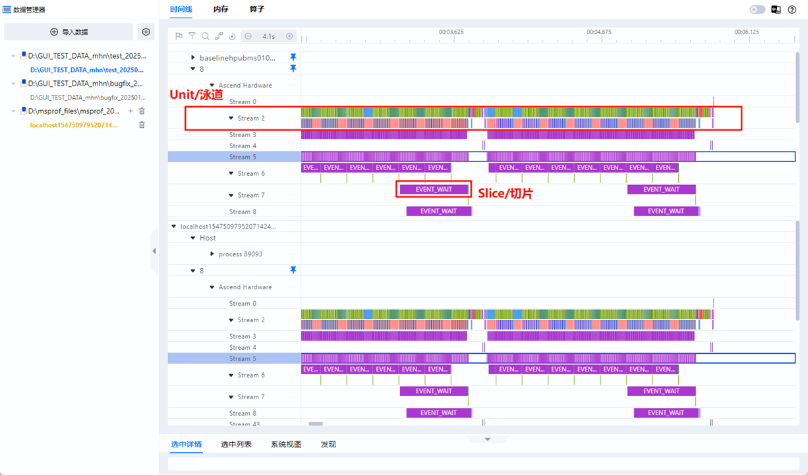    
3. Data scenario: The data on the timeline page can come from two scenarios.
    
    1. Text scenario: data source`Google Trace Format`Formatted`json`File
    2. DB scenario: Data source: collected and parsed by the msprof tool`ascend_profiler_output.db`File
    
    The data structures in the two scenarios are different. Therefore, the backend has two pieces of logic to process the two types of data.

## 2. GUI introduction

The timeline interface consists of four parts: toolbar (area 1), timeline tree (area 2), graphical pane (area 3), and data pane (area 4).

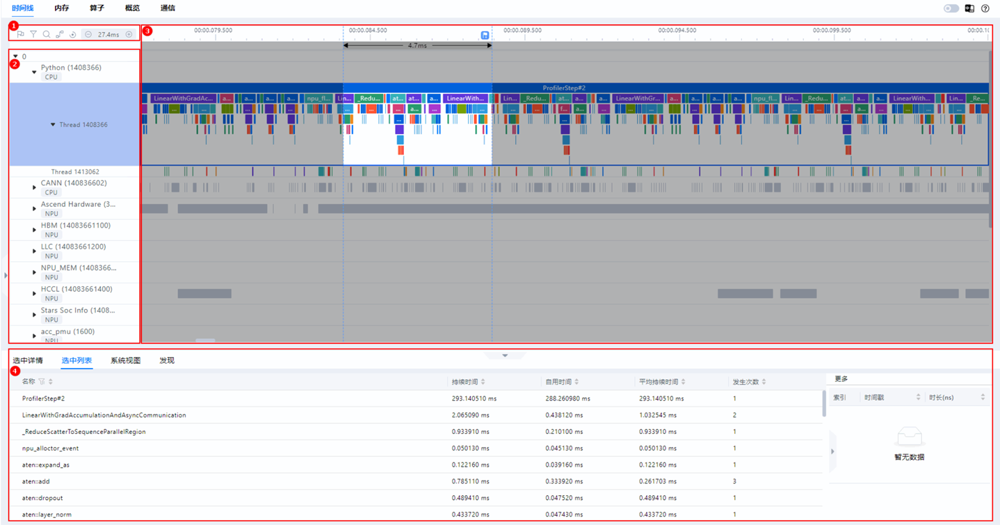    

### Area 1: Toolbar

Includes common shortcut buttons, including the mark list, filter (displayed by card or swimlane), search, connection event, restore (page restoration), and timeline zoom-in and zoom-out buttons from left to right.

    

### Area 2: timeline tree

> The text scenario and DB scenario are displayed differently.

 * In the text scenario, the hierarchical information about cards in the cluster scenario is displayed by rank. The first level is the rank ID, the second level is the process or special level, and the third level is the thread name.
 * In the DB scenario, information about each host is displayed. The first level is the host name, and the second level is the host and card.
    
     * At the host level, PyTorch and CANN data is displayed by process and thread.
     * The Card levels are as follows:
        
         * Bottom-layer data, including:
            
             * Time-consuming data and iteration track data of each stream task flow under Ascend Hardware
             * HCCL and Overlap Analysis communication data
             * Memory data
             * Other Ascend Hardware System Data
         * AI Core Freq and other layers.
    
    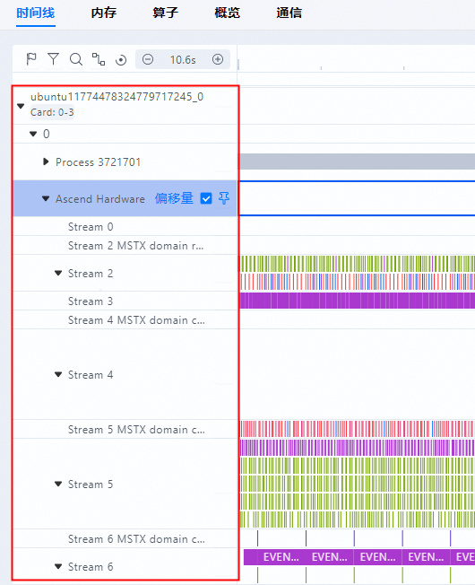    

> When a top lane is available, a top tree is displayed.

### Area 3: Graphical pane

The displayed data is data within the iteration. The graphical pane corresponds to the timeline tree and graphically displays the timeline row by row, including the execution sequence and duration of upper-layer application operators, components, and interfaces.

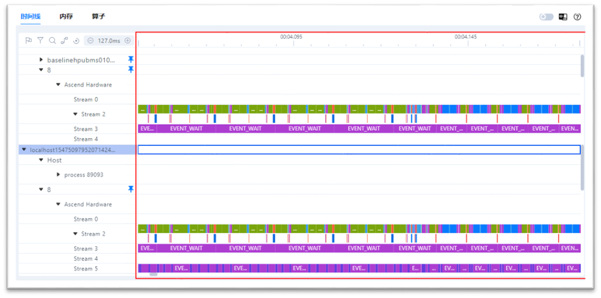    

### Area 4: Data pane

Displays statistics or operator details.

**The following tabs are included:**

1. Slice Detail: details about a selected operator.
2. The Slice List is the operator list in the selected area of a row of swimlanes.
3. The system view contains the summary information about a certain type of operator.
4. Find is the operator information to be searched.

    

## 3. Function Description

| No. | Level-1 Function                                        | Level-2 function                                            | Level 3 Function                                                         |
| --- | ------------------------------------------------------- | ----------------------------------------------------------- | ------------------------------------------------------------------------ |
| 1   | Tile training/inference process                         | Display swimlane, slice                                     | /                                                                        |
| 2   | List of Markers                                         | Mark the selected area and save it.                         | /                                                                        |
| 3   | Filtering a tree diagram                                | Filter by Card                                              | /                                                                        |
| 4   |                                                         | Filter by swimlane                                          | /                                                                        |
| 5   | Operator search                                         | Graphics Window Selection                                   | /                                                                        |
| 6   |                                                         | Jump to data window discovery                               | Operator discovery with the same name                                    |
| 7   |                                                         |                                                             | Click to go to the chart window.                                         |
| 8   | Displaying connection events                            | Full display                                                | /                                                                        |
| 9   |                                                         | Select a single display in the chart window.                | /                                                                        |
| 10  | Graphics Window Restore                                 | /                                                           | /                                                                        |
| 11  | Zoom in or out the drawing window                       | W. S key to zoom in or out                                  | /                                                                        |
| 12  |                                                         | Press Ctrl/cmd and click the mouse wheel to zoom in or out. | /                                                                        |
| 13  | Right-clicking a tree view                              | Full screen display                                         | /                                                                        |
| 14  |                                                         | Find in Communications                                      | /                                                                        |
| 15  |                                                         | Enlarge the selection                                       | /                                                                        |
| 16  |                                                         | Controlling Scaling                                         | Unzoom                                                                   |
| 17  |                                                         |                                                             | Reset Zoom                                                               |
| 18  |                                                         | Control pinned to the top                                   | Unpin Top (All)                                                          |
| 19  |                                                         |                                                             | Top (by same group)                                                      |
| 20  |                                                         |                                                             | Unpin Top (By Same Group)                                                |
| 21  |                                                         | Control Hide                                                | hides                                                                    |
| 22  |                                                         |                                                             | Show all hidden swimlanes                                                |
| 23  |                                                         | Display in Event View                                       | Jump to the event view in the data window                                |
| 24  |                                                         | Control the Python call stack.                              | Displays the Python call stack.                                          |
| 25  |                                                         | Control the Python call stack.                              | Hiding the Python Call Stack                                             |
| 26  | Right-clicking a tree view                              | Control all subitems                                        | Collapse all subitems                                                    |
| 27  |                                                         |                                                             | Expand all subitems                                                      |
| 28  |                                                         | Controlling SET/WAIT Events                                 | Hide SET/WAIT Events                                                     |
| 29  |                                                         |                                                             | Display SET/WAIT Events                                                  |
| 30  |                                                         | Controls swimlane height adaptation                         | Enable lane height adaptation.                                           |
| 31  |                                                         |                                                             | Turn off swimlane height adaptation                                      |
| 32  |                                                         | Restore the default offset for all cards.                   | /                                                                        |
| 33  |                                                         | Control reference operator                                  | Setting a reference operator                                             |
| 34  |                                                         |                                                             | Time when the custom operator is aligned to the reference operator       |
| 35  |                                                         |                                                             | Clear the reference operator.                                            |
| 36  | Set the time offset in the tree diagram.                | /                                                           | /                                                                        |
| 37  | Set the tree view to the top.                           | /                                                           | /                                                                        |
| 38  | Drag the graphics window to select a range and swimlane | View the selected interval and swimlane                     | /                                                                        |
| 39  |                                                         | Jump to the selected list in the data window                | /                                                                        |
| 40  | Selecting a Slice in the Graphics Window                | Viewing Slice Details                                       | /                                                                        |
| 41  |                                                         | Jump to the data window and select details.                 | /                                                                        |
| 42  | Data Window System View                                 | Statistics system view                                      | View by machine name and card number                                     |
| 43  |                                                         |                                                             | Viewing Comprehensive Indicators                                         |
| 44  |                                                         |                                                             | Viewing Python API Summary                                               |
| 45  |                                                         |                                                             | View CANN API Summary                                                    |
| 46  |                                                         |                                                             | View Ascend Hardware Task Summary                                        |
| 47  |                                                         |                                                             | View HCCL Summary                                                        |
| 48  |                                                         |                                                             | View Coverage Analysis                                                   |
| 49  |                                                         |                                                             | Viewing Operator Details                                                 |
| 50  |                                                         |                                                             | Click this button to go to the Timeline chart window. Specific operator. |
| 51  | Data Window System View                                 | Expert system view                                          | View by machine name and card number                                     |
| 52  |                                                         |                                                             | Viewing Affinity APIs                                                    |
| 53  |                                                         |                                                             | View Affinity Optimizer                                                  |
| 54  |                                                         |                                                             | Viewing the AICPU Operator                                               |
| 55  |                                                         |                                                             | Querying the ACLNN Operator                                              |
| 56  |                                                         |                                                             | Viewing Operator Fusion                                                  |
| 57  |                                                         |                                                             | Click this button to go to the Timeline chart window. Specific operator. |
| 58  |                                                         | Event View                                                  | View details about all operators in a swimlane.                          |
| 59  |                                                         |                                                             | Click this button to go to the Timeline chart window. Specific operator. |
| 60  | Data comparison                                         | Set up the base card                                        | /                                                                        |
| 61  |                                                         | Setting the Comparison Card                                 | /                                                                        |

## 4. Develop knowledge

### 4.1 Design for swimlane drawing

View Details[links](./TrackRender.md)    

### 4.2 Front-end swimlane operation design

#### 4.2.1 Frontend Jump Target Operator

On the front end code`CategorySearch.tsx`lower`CategorySearchContent`Called in`jumpSlice`Methodology

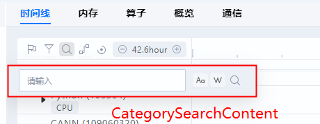    

`jumpSlice`Invoking`doJumpSlice`,`doJumpSlice`Only updated in`session.locateUnit`.

The front end uses React Hook. Here`session.locateUnit`Is one of the other components`use*`Dependency of hook.

After investigation, it is found that the hook related to the front-end unit is`modules\timeline\src\components\ChartContainer\Units\hooks`Under the folder, and the jump target hook is under the file`useLocate.tsx`Medium, it's just`useJumpTarget`.

`useJumpTarget`Currently only in`Scroller`Used in.

```ts
//Jump to the specified lane
useJumpTarget(session, unitsArea, supportJump, sortOptions, (ref as React.MutableRefObject<HTMLDivElement | null>).current);
```

`useJumpTarget`The core function of the, the dependency is`[session, dom, unitsArea, tuningScroller]`.

> of which`session`If the size is too large, it is easy to regenerate functions and consume a lot of computing resources.
> 
> In fact, the,`session`In this function, only the`session.units` `session.locateUnit`Two, dependencies can be simplified as`[session.units, session.locateUnit, dom, unitsArea, tuningScroller]`

```ts
React.useEffect(() => autorun(
    () => {
        if (dom === null || !supportJump) { return; }
        if (session.locateUnit === undefined) { return; }
        const targetUnit = getTargetUnit(getRootUnit(session.units), session.locateUnit.target);
        if (targetUnit === undefined) {
            message.warn(t('NotFoundJumpTargetWarn'));
        } else {
            handleUnitSelection(targetUnit);
            session.locateUnit?.onSuccess(targetUnit);
            const scrollHResult = getNormalUnitHeight(unitsArea, orderOptions, targetUnit);
            if (scrollHResult !== undefined) {
                //For the first time, scrollToResult to scrollHResult requests the backend to redraw the swimlane.
                scrollToResult(scrollHResult, tuningScroller);
            }
        }
        runInAction(() => {
            session.locateUnit = undefined;
        });
    },
), [session, dom, unitsArea, tuningScroller]);
```

##### 4.2.1.1 How to Adjust the Left and Right Positions of the Target Operator

Details

There's a sentence in the algorithm above`session.locateUnit?.onSuccess(targetUnit);`This one.`onSuccess`And apparently was the`doJumpSlice`Of the function assignment. Now let's look at the details`doJumpSlice`of the`onSuccess`How it was written

```txt
const doJumpSlice = (session: Session, slice: SliceData, isGlobal: boolean): void => {
    if (slice === undefined) {
        //slice is undefined.
        return;
    }
    runInAction(() => {
        session.locateUnit = {
            target: (unit): boolean => {
                return unit instanceof ThreadUnit && (Boolean(unit.metadata.cardId.includes(slice.rankId))) &&
                    unit.metadata.processId === slice.pid && unit.metadata.threadId === slice.tid;
            },
            onSuccess: (unit): void => {
            ~~~~~~~~~
                if (isGlobal) {
                    session.domainRange = { domainStart: 0, domainEnd: session.endTimeAll ?? session.domain.defaultDuration };
                    session.selectedData = undefined;
                    session.linkFlow = undefined;
                } else {
                    const [rangeStart, rangeEnd] = calculateDomainRange(session,
                        slice.startTime - getTimeOffset(session, unit.metadata as ThreadMetaData), slice.duration);
                    session.domainRange = { domainStart: rangeStart, domainEnd: rangeEnd };
                    session.selectedData = {
                        startTime: slice.startTime - getTimeOffset(session, unit.metadata as ThreadMetaData),
                        duration: slice.duration,
                        depth: slice.depth,
                        threadId: slice.tid,
                        id: slice.id,
                        metaType: (unit.metadata as ThreadMetaData).metaType,
                    };
                    session.linkFlow = generateFlowParam(unit.metadata as ThreadMetaData, slice);
                }
            },
        };
    });
};
```

Here, here.`doJumpSlice`Incoming`isGlobal`Yes`false`Let's not consider the core code.

```ts
//Calculation domain interval, which obviously refers to the left and right intervals of the target operator.
const [rangeStart, rangeEnd] = calculateDomainRange(session,
    slice.startTime - getTimeOffset(session, unit.metadata as ThreadMetaData), slice.duration);
//Assign the value to the session. The session updates the left and right ranges to the front end.
session.domainRange = { domainStart: rangeStart, domainEnd: rangeEnd };
//Updated the selected items and how to highlight the target operator.
session.selectedData = {
    startTime: slice.startTime - getTimeOffset(session, unit.metadata as ThreadMetaData),
    duration: slice.duration,
    depth: slice.depth,
    threadId: slice.tid,
    id: slice.id,
    metaType: (unit.metadata as ThreadMetaData).metaType,
};
//Updated the connection line, and added the details about how to display the connection line of the target operator.
session.linkFlow = generateFlowParam(unit.metadata as ThreadMetaData, slice);
```

###### Update Left and Right Ranges

The survey found that in five canvases (`EventChart`,`FilledLineChart`,`StackedBarChart`,`StackStatusChart`,`StatusChart`) has hooks.`useBatchedRender`Concerned`datasState`(from hook)`useData`processing`session.domainRange`(Returned value) changes to repaint the cloth

##### 4.2.1.2 How to Adjust the Up and Down Positions of the Target Operator

    

Details

`useJumpTarget`In the core function of, the upper and lower positions of operators are modified as follows:

```ts
//Select the target lane and open the lane.
handleUnitSelection(targetUnit);
//Processes the left and right location information (not related to the current logic).
session.locateUnit?.onSuccess(targetUnit);
//Calculate the number of pixels required to move to the top of the target lane.
const scrollHResult = getNormalUnitHeight(unitsArea, orderOptions, targetUnit);
if (scrollHResult !== undefined) {
    //When scrollToResult reaches the top of the target lane for the first time, the backend is requested to redraw the lane.
    //TuningScroller: After a lane is redrawn, the upper and lower positions are fine-tuned based on the depth of the operator.
    scrollToResult(scrollHResult, tuningScroller);
}
```

`tuningScroller`The function is specifically

```ts
const tuningScroller = React.useCallback((scrolled: number): void => {
    if (dom === null || !supportJump || session.selectedData === undefined) { return; }
    //UnitHeight.STANDARD is the standard height of the unfolded slice. 1 is the interval between slices.
    const relativeSliceY: number = Number.isInteger(session.selectedData.depth)
        ? (UnitHeight.STANDARD + 1) * Math.max(session.selectedData.depth as number - 1, 0)
        : 0;
    const halfScrollerHeight = dom.clientHeight / 2;
    const offset = Math.max(relativeSliceY - halfScrollerHeight, 0);
    scrollToResult(scrolled + offset);
}, [session, dom]);
```

### 4.3 UseDraggableContainer Component Design

The useDraggableContainer component is the basic component in the Timeline.

#### 4.3.1 Parameters

| No. | Name          | Type            | Description                                                  | Remarks                                                                                                                         |
| --- | ------------- | --------------- | ------------------------------------------------------------ | ------------------------------------------------------------------------------------------------------------------------------- |
| 1   | dragDirection | `DragDirection` | Position of a dragable component                             |                                                                                                                                 |
| 2   | draggableWH   | `number`        | Default width/height of dragable components                  |                                                                                                                                 |
| 3   | open          | `?boolean`      | Enable Dragable Component by Default                         | The default value is`false`                                                                                                     |
| 4   | minWH         | `?number`       | Minimum width/height of a dragable component                 | The default value is`0`                                                                                                         |
| 5   | sizeMethod    | `?SizeMethod`   | Calculated unit for the width/height of a dragable component | The default value is percentage. Currently, only the dragable component on the right is available. Other components are pixels. |

```ts
enum DragDirection {
    TOP = 0,
    BOTTOM = 1,
    LEFT = 2,
    RIGHT = 3,
}

enum SizeMethod {
    NUMBER = 'number',
    PERCENT = 'percent',
}
```

##### Global constant

```ts
const RIGHT_PERCENT = 0.99; //Indicates the maximum expandable scale of the dragable component on the right.
```

#### 4.3.2 Drag Control

##### 4.3.2.1 Drag Status

```ts
interface MovingState {
  stat: "idle" | "movable" | "moved";
  startX: number;
  startY: number;
  screenX: number;
  screenY: number;
}
```

###### Status Description

| No. | Name      | Description   |
| --- | --------- | ------------- |
| 1   | `idle`    | Standby state |
| 2   | `movable` | Move state    |
| 3   | `moved`   | Moved         |

 * `startX` `startY`Record the position of the mouse relative to the viewport when the movement starts, which is used to determine whether the drag behavior is valid.
 * `screenX` `screenY`Record the position of the mouse relative to the window when the movement starts, preventing the window from being moved.

##### 4.3.2.2 mousedown

The following figure shows the source code and interpretation of the event triggered after the mouse is pressed.

```text
const getHandleMouseDown = (dragDirection: DragDirection, draggable: React.RefObject<HTMLDivElement>,
    movingState: React.MutableRefObject<MovingState>, isOpen: React.MutableRefObject<boolean>) => (e: MouseEvent): void => {
    const domDrag = draggable.current; //Removable components
    ...
    let offset;
    const baseMS: MovingState = { stat: 'movable', startX: 0, startY: 0, screenX: e.screenX, screenY: e.screenY };
    const domDragRect = domDrag.getBoundingClientRect();
    switch (dragDirection) { //dragDirection indicates the position of a dragable component.
        case DragDirection.TOP: //Dragable components above
            offset = domDragRect.bottom - e.clientY; //e.clientY indicates the distance between the mouse and the top of the viewport, and domDragRect.bottom indicates the distance between the bottom of the dragable component and the top of the viewport.
            if (offset <= 8 && offset > 0 && isOpen.current) {
                movingState.current = {
                    ...baseMS,
                    startX: domDragRect.x,
                    startY: domDragRect.bottom,
                };
            }
            break;
        case DragDirection.BOTTOM:
            offset = e.clientY - domDragRect.top; //e.clientY indicates the distance between the mouse and the viewport, and domDragRect.top indicates the distance between the top of the dragable component and the top of the viewport.
            if (offset <= 8 && offset > 0 && isOpen.current) {
                movingState.current = {
                    ...baseMS,
                    startX: domDragRect.x,
                    startY: domDragRect.top,
                };
            }
            break;
        case DragDirection.LEFT:
            offset = domDragRect.right - e.clientX; //e. clientX indicates the distance between the mouse and the left side of the viewport, and domDragRect.right indicates the distance between the right side of the dragable component and the left side of the viewport.
            if (offset <= 8 && offset > 0 && isOpen.current) {
                movingState.current = {
                    ...baseMS,
                    startX: domDragRect.right,
                    startY: domDragRect.y,
                };
            }
            break;
        default:
            offset = e.clientX - domDragRect.left; //e.clientX refers to the distance between the mouse and the left side of the viewport, and domDragRect.left refers to the distance between the left side of the dragable component and the left side of the viewport
            if (offset <= 8 && offset > 0 && isOpen.current) {
                movingState.current = {
                    ...baseMS,
                    startX: domDragRect.left,
                    startY: domDragRect.y,
                };
            }
            break;
    }
};
```

##### 4.3.2.3 mousemove

The following figure shows the source code and interpretation of the event triggered when the mouse is moved.

    

```ts
const handleMouseMove =
  (
    container: React.RefObject<HTMLDivElement>,
    draggable: React.RefObject<HTMLDivElement>,
    movingState: React.MutableRefObject<MovingState>,
    dragDirection: DragDirection,
    minDragWh: number
  ) =>
  (e: MouseEvent): void => {
    const dom = container.current; //Entire container
    const domDrag = draggable.current; //Dragable component
    const moving = movingState.current; //Drag Status
    if (e.buttons !== 1) {
      //e.buttons === 1 indicates the left mouse button.
      moving.stat = "idle";
      return;
    }
    if (!dom || !domDrag) {
      return;
    }
    if (moving.stat === "idle") {
      return;
    }
    if (
      Math.abs(e.screenY - moving.screenY) < 2 &&
      Math.abs(e.screenX - moving.screenX) < 2
    ) {
      return;
    }
    let offsetY: number;
    let offsetX: number;
    const domRect = dom.getBoundingClientRect();
    switch (dragDirection) {
      case DragDirection.TOP:
        offsetY = e.y - moving.startY;
        if (Math.abs(offsetY) >= 5) {
          //Calculate the new height of the dragable component
          //By default, the dragable component is attached to the top of the viewport by default, so e.y, as a mouse, is exactly the same as the height of the dragable component from the top of the viewport.
          //Note: This default assumption may not be true, but this is what is currently used.
          domDrag.style.height = `${clamp(
            e.y,
            minDragWh,
            dom.clientHeight - minDragWh
          )}px`;
        }
        break;
      case DragDirection.BOTTOM:
        offsetY = e.y - moving.startY;
        if (Math.abs(offsetY) >= 5) {
          //Calculate the new height of the dragable component
          //By default, the dragable component fits tightly at the bottom of the viewport, and the entire container occupies the viewport height. So e.y is the mouse distance from the top of the viewport, dom.clientHeight is the viewport height, and dom.clientHeight - e.y is exactly the height of the dragable component.
          //Note: This default assumption may not be true, but this is exactly what is used today.
          domDrag.style.height = `${clamp(
            dom.clientHeight - e.y,
            minDragWh,
            dom.clientHeight - minDragWh
          )}px`;
        }
        break;
      case DragDirection.LEFT:
        offsetX = e.x - moving.startX;
        if (Math.abs(offsetX) >= 5) {
          //Calculate the new width of the dragable component
          //Here e.clientX is the left distance of the mouse from the viewport, domRect.left is the left distance of the entire container from the left of the viewport, and e.clientX - domRect.left is exactly the width of the dragable component.
          domDrag.style.width = `${clamp(
            e.clientX - domRect.left,
            245,
            dom.clientWidth - minDragWh
          )}px`;
        }
        break;
      default:
        offsetX = e.x - moving.startX;
        if (Math.abs(offsetX) >= 5) {
          //Calculate the new width of the dragable component
          //Here, e.clientX is the distance between the mouse and the left side of the viewport, domRect.left is the distance between the left side of the container and the left side of the viewport, dom.clientWidth is the width of the container, and domRect.left + dom.clientWidth - e.clientX is the width of the dragable component.
          domDrag.style.width = `${clamp(
            domRect.left + dom.clientWidth - e.clientX,
            minDragWh,
            dom.clientWidth * RIGHT_PERCENT
          )}px`;
        }
        break;
    }
    moving.stat = "moved"; //Status is Moved
    e.preventDefault();
  };
```

##### 4.3.2.4 mouseup

The following figure shows the source code and interpretation of the event triggered when the mouse is released.

```ts
const handleMouseUp =
  ({
    container,
    draggable,
    movingState,
    dragDirection,
    minDragWh,
    sizeMethod,
  }: {
    container: React.RefObject<HTMLDivElement>,
    draggable: React.RefObject<HTMLDivElement>,
    movingState: React.MutableRefObject<MovingState>,
    dragDirection: DragDirection,
    minDragWh: number,
    sizeMethod?: SizeMethod,
  }) =>
  (e: MouseEvent): void => {
    recoverIframePointerEvent();
    const dom = container.current;
    const domDrag = draggable.current;
    const moving = movingState.current;
    const isDomInvalid =
      !dom || !domDrag || dom.clientHeight === 0 || dom.clientWidth === 0;
    if (moving.stat !== "moved" || isDomInvalid) {
      moving.stat = "idle";
      return;
    }
    const domRect = dom.getBoundingClientRect();
    let dragWHTmp: number;
    //The algorithm here is the same as the mousemove algorithm.
    switch (dragDirection) {
      case DragDirection.TOP:
        dragWHTmp = clamp(e.y, minDragWh, dom.clientHeight - minDragWh);
        domDrag.style.height =
          sizeMethod === SizeMethod.NUMBER
            ? `${dragWHTmp}px`
            : `${(dragWHTmp / dom.clientHeight) * 100}%`;
        window.dispatchEvent(new Event("topResize"));
        break;
      case DragDirection.BOTTOM:
        dragWHTmp = clamp(
          dom.clientHeight - e.y,
          minDragWh,
          dom.clientHeight - minDragWh
        );
        domDrag.style.height =
          sizeMethod === SizeMethod.NUMBER
            ? `${dragWHTmp}px`
            : `${(dragWHTmp / dom.clientHeight) * 100}%`;
        window.dispatchEvent(new Event("bottomResize"));
        break;
      case DragDirection.LEFT:
        dragWHTmp = clamp(
          e.clientX - domRect.left,
          245,
          dom.clientWidth - minDragWh
        );
        domDrag.style.width =
          sizeMethod === SizeMethod.NUMBER
            ? `${dragWHTmp}px`
            : `${(dragWHTmp / dom.clientWidth) * 100}%`;
        window.dispatchEvent(new Event("leftResize"));
        break;
      case DragDirection.RIGHT:
        dragWHTmp = clamp(
          domRect.left + dom.clientWidth - e.clientX,
          minDragWh,
          dom.clientWidth * RIGHT_PERCENT
        );
        domDrag.style.width =
          sizeMethod === SizeMethod.NUMBER
            ? `${dragWHTmp}px`
            : `${(dragWHTmp / dom.clientWidth) * 100}%`;
        window.dispatchEvent(new Event("rightResize"));
        break;
      default:
        break;
    }
    //Restore the drag mode to standby mode.
    movingState.current = {
      stat: "idle",
      startX: 0,
      startY: 0,
      screenY: 0,
      screenX: 0,
    };
    window.dispatchEvent(new Event("resize"));
  };
```

#### 4.3.3 Layout Features and Potential Problems of Dragable Containers

Current html

```react
<Container>
    <div className="topC">主内容</div>
    <div className="bottomC">可拖动组件</div>
</Container>
```

In the`DragDirection.BOTTOM`And with the`DragDirection.RIGHT`, the position of the dragable components is consistent with the layout of the document flow.

And while in the`DragDirection.TOP`And to the`DragDirection.LEFT`When, used`flex-direction: column-reverse;` `flex-direction: row-reverse;`

These two css attributes can change the layout, allowing the position of the main content and dragable components to change, but it does not actually change the position of the main content and dragable components relative to the viewport.

In the name of`DragDirection.LEFT`For example:

> Applying flex-direction: row-reverse; does not change the position of the child element or parent container relative to the viewport. That is, if the elastic container is originally located somewhere on the page (say, 50 pixels from the top), the container and its contents remain the same relative to the viewport even if you change the order of the internal child elements.

Illustration: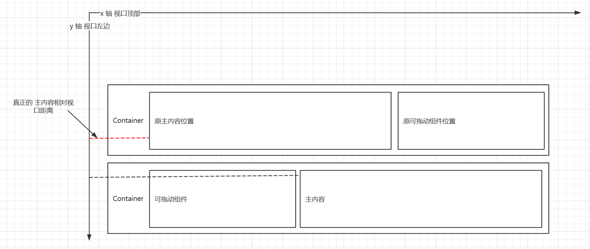    

### 4.4 Graphical Pane Event Design

The graphical pane event controls whether a user selects a rectangular area on the graphical pane, as shown in the following figure.

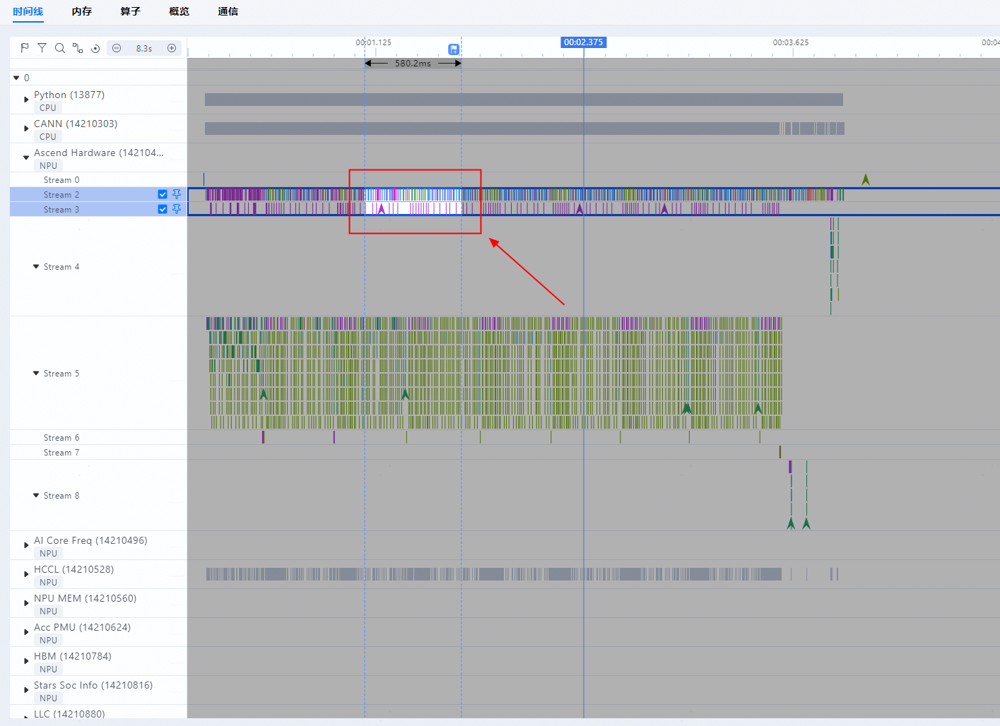    

#### 4.4.1 Basic Concepts

Controls the basic existence of data in the graphical pane.`session`,`ChartInteractor.ts`Medium

##### 4.4.1.1 session

| No. | Name          | Type                       | action                                                  |
| --- | ------------- | -------------------------- | ------------------------------------------------------- |
| 1   | domainRange   | `DomainRange`              | Control the realm size of the pane                      |
| 2   | selectedRange | `[ TimeStamp, TimeStamp ]` | Controls the size of the selected interval in the pane. |

```ts
export interface DomainRange {
    domainStart: TimeStamp;
    domainEnd: TimeStamp;
}
```

##### 4.4.1.2 ChartInteractorProps

| No. | Name                 | Type                              | action                                    |
| ---:|:-------------------- |:--------------------------------- |:----------------------------------------- |
|   1 | domainStart          | `number`                          | Pane start point                          |
|   2 | domainEnd            | `number`                          | Pane End Point                            |
|   3 | endTimeAll           | `number`                          | Maximum end time.                         |
|   4 | session              | `Session`                         | Session data of the timeline.             |
|   5 | interactorMouseState | `InteractorMouseState`            | Status of mouse-related events            |
|   6 | onTimeStamp          | `TimeStampCallbackFunc`           | To be determined                          |
|   7 | isNsMode             | `isNsMode`                        | Whether the NS mode is used               |
|   8 | splitLineRef         | `React.RefObject<HTMLDivElement>` | To be determined                          |
|   9 | renderTrigger        | `boolean`                         | Render Trigger                            |
|  10 | selectedRange        | `[ TimeStamp, TimeStamp ]`        | Size of the selected interval in the pane |

##### 4.4.1.3 InteractorMouseState

| No. | Name       | Type                                      | action                                  |
| ---:|:---------- |:----------------------------------------- |:--------------------------------------- |
|   1 | clickPos   | `React.MutableRefObject<Posundefined>` | Position of the first mouse click       |
|   2 | lastPos    | `React.MutableRefObject<Posndefined>` | Position where the mouse is moved last. |
|   3 | wheelEvent | `{ ctrlKey: boolean; deltaY: number }`    | Parameters of the mouse wheel event     |

#### 4.4.2 Drag Behavior

The logical sequence of events for the drag behavior is: `move -> press -> move -> release`.

In practice, however, you must move the mouse to the pane before clicking the mouse in the pane. Therefore, the actual event sequence is as follows: `move -> press -> move -> release`.

##### 4.4.2.1 Clicking the mouse

Triggering event: mousedown

```ts
const onMouseDown = (e: React.MouseEvent): void => {
    const disabled = !isTargetElement(e) || !chartInteractorRef.current || !interactive ||
        session.phase !== 'download' || isMouseOnScrollbar(e, scrollerRef.current);
    if (disabled) {
        interactorMouseState.lastPos.current = undefined;
        return;
    }
    const needDragOneSide = chartInteractorRef.current.mouseDownAction(interactorMouseState, e);
    if (needDragOneSide === MouseDownActionResult.NO_NEED_TO_DRAG_ONE_SIDE) {
        //The interactorMouseState.lastPos.current has a value because it has been assigned during the onMouseMove operation.
        interactorMouseState.clickPos.current = interactorMouseState.lastPos.current;
    }
};
```

##### 4.4.2.2 Mouse Movement

Triggering event: mousemove

```ts
const onMouseMove = (e: React.MouseEvent): void => {
    if (!chartInteractorRef.current) {
        return;
    }
    chartInteractorRef.current.mouseMoveAction(interactorMouseState, e);
    //Calculate the relative position x, y. is the position relative to the upper left corner of the pane
    const rect = e.currentTarget.getBoundingClientRect();
    const offsetX = e.nativeEvent.x - rect.left - LANE_INFO_WIDTH_PX.value;
    const offsetY = e.nativeEvent.y - rect.top;
    //The following is a value assigned to lastPos. If offsetX is less than 0, the cursor has moved out of the pane. Set x to the minimum value 0.
    if (offsetX <= 0) {
        interactorMouseState.lastPos.current = interactorMouseState.clickPos.current ? { x: 0, y: offsetY } : undefined;
        return;
    }
    interactorMouseState.lastPos.current = { x: offsetX, y: offsetY };
};
```

##### 4.4.2.3 Release the mouse

Triggering event: mouseup

```ts
const onMouseUp = (e: MouseEvent): void => {
    if (!chartInteractorRef.current || !interactive) {
        return;
    }
    chartInteractorRef.current.mouseUpAction(interactorMouseState, e);
};
```

About the`mouseUpAction`The code of the function is as follows to update the selectedRange:

```text
export const mouseUpAction = (interactorParams: InteractorParams, interactorMouseState: InteractorMouseState, e: MouseEvent): void => {
    const { normalCanvas: canvas, hoverCanvas, session, xReverseScaleRef, xScale, isNsMode, customRenderers, theme } = interactorParams;
    const clickPos = interactorMouseState.clickPos.current;
    const lastPos = interactorMouseState.lastPos.current;
    ...

    if (Math.abs(lastPos.x - clickPos.x) >= MIN_BRUSH_SIZE) {
        //In this example, clickPos.x and lastPos.x are converted to absolute time by xScale.
        const mouseRange: [number, number] = [xScale(clickPos.x), xScale(lastPos.x)];
        const newSelected = mouseRange.sort((a, b) => a - b);

        if (newSelected[0] < session.endTimeAll && session.endTimeAll < newSelected[1]) { newSelected[1] = session.endTimeAll; }
        //Update selectedRange.
        updateSessionStatus(e, session, newSelected);
    }

    interactorMouseState.clickPos.current = undefined;
    ...
};
```

About the`updateSessionStatus`The code of the function is as follows, describing how to update the selectedRange:

```ts
const updateSessionStatus = (e: MouseEvent, session: Session, newSelected: [number, number]): void => {
    runInAction(() => {
        //If you hold down the Alt key, the selected interval becomes the domain interval of the pane. In this way, the selected interval can be zoomed in to the selected interval.
        if (e.altKey) {
            session.domainRange = { domainStart: newSelected[0], domainEnd: newSelected[1] };
        }
        //The selected interval is updated here. The input is the time data after the relative offset position x is xScale.
        session.selectedRange = newSelected;
        changeRangeMarkerTimestamp(session, newSelected);
        const selectedRange = session.selectedRange[1] - session.selectedRange[0];
        traceStart('selectBrushScope', {
            action: 'selectBrushScope',
            units: session.selectedUnits.map((unit) => unit?.name),
            selectedRange: session.isNsMode ? Math.ceil(selectedRange / 1e6) : selectedRange,
        });
    });
};
```

> **Design Description**
> 
> In the ChartInteractor event, the mouse click and mouse movement only change the relative position x y of the and pane, and do not affect the`session.selectedRange`. Only when the mouse is released, the relative position x is converted to the absolute time timestamp and then updated.`session.selectedRange`.
> 
> The mask drawn during moving and the selected status are not at the same layer as the mask drawn after releasing and the selected status. The mask and selected status drawn during movement are displayed in ChartInteractor, and the mask and selected status drawn after release are displayed in ChartContainer.

#### 4.4.3 Moving a Pane Field Left or Right

Drives the whole pane to move left and right.

Triggering event: Keyboarda d ← →

`actionPan.ts`

```ts
//Update Pane Domain Interval here
const moveDomain = (session: Session, direction: number): void => {
    const { domainRange: { domainStart, domainEnd } } = session;
    const timeDuration = domainEnd - domainStart;
    const timeOffset = direction * PAN_RATE * timeDuration;
    const newEnd = clamp(domainEnd + timeOffset, timeDuration, session.endTimeAll ?? session.domain.defaultDuration);
    runInAction(() => {
        session.domainRange = { domainStart: newEnd - timeDuration, domainEnd: newEnd };
    });
};
```

> **Design Description**
> 
> Direct modification`session.domainRange`

### 4.5 Design of Counter-Type Swimlane Data

The following figure shows the counter lane.    

#### 4.5.1 Core Interface

 `unit/counter` req:

```tson
{
  "id": 24,
  "moduleName": "timeline",
  "type": "request",
  "command": "unit/counter",
  "projectName": "D:\\GUI_TEST_DATA\\mstx_profiling_data_db",
  "params": {
    "rankId": "localhost.localdomain2187962182031548519_0 0",
    "pid": "pid",
    "threadName": "0/Read",
    "threadId": "0/Read",
    "metaType": "类型",
    "startTime": 0,
    "endTime": 3061712000,
    "dataSource": {
      "remote": "127.0.0.1",
      "port": 9000,
      "projectName": "D:\\GUI_TEST_DATA\\mstx_profiling_data_db",
      "dataPath": [
        "D:\\GUI_TEST_DATA\\mstx_profiling_data_db\\localhost.localdomain_1106947_20240905131518179_ascend_pt\\ASCEND_PROFILER_OUTPUT"
      ]
    },
    "timePerPx": 2676321.678321678
  }
}
```

resp:

```tson
{
  "type": "response",
  "id": 828,
  "requestId": 26,
  "result": true,
  "command": "unit/counter",
  "moduleName": "timeline",
  "body": {
    "data": [
      {
        "timestamp": 573090,
        "value": {
          "Read(B/s)": 0
        }
      },
      {
        "timestamp": 20534090,
        "value": {
          "Read(B/s)": 115726466
        }
      },
      ...
    ]
  }
}
```

#### 4.5.2 Database Scenario

##### 4.5.2.1 Related Data Tables

| \# | Type               | Data table          | Attributes that are joined with the attribute id of STR_IDS. | startTime   | processName | args                                                                                      | Parameters required for search limit       |
| -- | ------------------ | ------------------- | ------------------------------------------------------------ | ----------- | ----------- | ----------------------------------------------------------------------------------------- | ------------------------------------------ |
| 1  | `HBM`              | HBM                 | type                                                         | timestampNs | `A*`        | value,bandwidth                                                                           | deviceId,processName,startTime,timestampNs |
| 2  | `LLC`              | LLC                 | mode                                                         | timestampNs | `B*`        | throughput,hitRate                                                                        | deviceId,startTime,processName             |
| 3  | `DDR`              | DDR                 | /                                                            | timestampNs | /           | read,write                                                                                | deviceId,startTime                         |
| 4  | `STARS_SOC`        | SOC_BANDWIDTH_LEVEL | /                                                            | timestampNs | /           | l2BufferBwLevel,mataBwLevel                                                               | deviceId,startTime                         |
| 5  | `ACC_PMU`          | ACC_PMU             | /                                                            | timestampNs | /           | readBwLevel,writeBwLevel,readOstLevel,writeOstLevel,accId                                 | deviceId,startTime                         |
| 6  | `NPU_MEM`          | NPU_MEM             | type                                                         | timestampNs | /           | ddr,hbm,                                                                                  | deviceId,type,startTime                    |
| 7  | `SAMPLE_PMU`       | SAMPLE_PMU_TIMELINE | coreType                                                     | timestampNs | `C*`        | freq,usage, totalCycle                                                                    | deviceId,value,coreId,startTime            |
| 8  | `ROCE`,`ROH`,`NIC` | RoCE,RoH,NIC        | /                                                            | timestampNs | `D*`        | rxByteRate,bandwidth,rxPackets,rxErrors,rxDropped,txByteRate,txPackets,txErrors,txDropped | deviceId,funcId,startTime                  |
| 9  | `HCCS`             | HCCS                | /                                                            | timestampNs | /           | txThroughput,rxThroughput                                                                 | deviceId,startTime                         |
| 10 | `PCIE`             | PCIE                | /                                                            | timestampNs | /           | txPostAvg,rxPostAvg,txNonpostAvg,rxNonpostAvg,txCplAvg,rxCplAvg,txNonpostLatencyAvg       | deviceId,startTime                         |
| 11 | `AI_CORE`          | AICORE_FREQ         | /                                                            | timestampNs | /           | freq                                                                                      | deviceId,startTime                         |

`A*`\: "hbmId\|\|'/'\|\| case when value='read' then'Read' else' Write' end"

 * `{hbmId}/Read`
 * `{hbmId}/Write`

`B*`\: "glob(modeName\|\|'\*', processName)", "format ('%s %s', llcId, case when value='read' then'Read' else' Write' end) as modeName"

 * `{llcId} Read*`
 * `{llcId} Write*`

`C*`\: "format('%s Core %s', value, coreId)"

`D*`\: "format('Port %s/rx', funcId)"

##### 4.5.2.2 Return Value

```cpp
bool DbTraceDataBase::QueryCounterMetadata(const std::string &fileId,
    std::vector<std::unique_ptr<Protocol::UnitTrack>> &metaData)

void DbTraceDataBase::GetCounterUnitsAndDataTypes(PROCESS_TYPE type, std::vector<std::string> &units,
    std::vector<std::vector<std::string>> &dataTypes, std::unique_ptr<Protocol::UnitTrack> &counter)
```

Return Values of Each Table and Names of the Process Lane on the Frontend

###### 1. HBM type

```tson
{
  "timestamp": 20534090,
  "value": {
    "Read(B/s)": 115726466
  }
}

{
  "timestamp": 20534090,
  "value": {
    "Write(B/s)": 115726466
  }
}
```

    

**processName:**`hbmId || '/' || case when value='read' then 'Read' else 'Write' end as processName`Use the hbmId and type fields.

###### 2. LLC type

```tson
{
  "timestamp": 20534090,
  "value": {
    "Throughput(B/s)": 115726466
  }
}

{
  "timestamp": 20534090,
  "value": {
    "Hit Rate(%)": 32
  }
}
```

    

**processName:**

1. `llcId || ' ' || case when value='read' then 'Read' else 'Write' end || '/Throughput' as processName`Use the llcId and mode fields.
2. `llcId || ' ' || case when value='read' then 'Read' else 'Write' end || '/Hit Rate' as processName`Use the llcId and mode fields.

###### 3. DDR type

```tson
{
  "timestamp": 20534090,
  "value": {
    "Read(B/s)": 115726466
  }
}

{
  "timestamp": 20534090,
  "value": {
    "Write(B/s)": 115726466
  }
}
```

    

**processName:**

1. `Read`
2. `Write`

###### 4. STARS_SOC

```tson
{
  "timestamp": 20534090,
  "value": {
    "L2 Buffer Bw Level": 115726466
  }
}

{
  "timestamp": 20534090,
  "value": {
    "Mata Bw Level": 115726466
  }
}
```

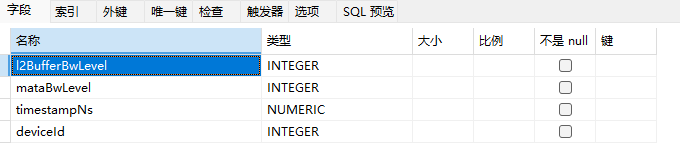    

**processName:**

1. `L2 Buffer Bw Level`
2. `Mata Bw Level`

###### 5. ACC_PMU type

```tson
{
  "timestamp": 20534090,
  "value": {
    "value": 115726466,
    "acc_id": 12
  }
}
```

    

**processName:**

1. `readBwLevel`
2. `writeBwLevel`
3. `readOstLevel`
4. `writeOstLevel`

###### 6. NPU_MEM type

```tson
{
  "timestamp": 20534090,
  "value": {
    "B": 115726466
  }
}
```

    

**processName: related to the type.**

1. `APP/DDR`
2. `APP/HBM`
3. `APP/MEMORY`
4. `Device/DDR`
5. `Device/HBM`
6. `Device/MEMORY`

###### 7. SAMPLE_PMU type

```tson
{
  "timestamp": 20534090,
  "value": {
    "freq(Mhz)": 115726466,
    "usage(%)": 32,
    "totalCycle": 115726466
  }
}
```

    

**processName:**`format('%s Core %s', value, coreId)`The coreId and coreType fields are used.

###### 8. ROCE, ROH, and NIC

```tson
//1
{
  "timestamp":20534090,
  "value": {
    "rx_bandwidth_effciency": 11572.6466,
    "rx_packets": 11572,
    "rx_error_rate": 11572.6466,
    "rx_dropped_rate": 11572.6466
  }
}
// 2
{
  "timestamp": 20534090,
  "value": {
    "tx_bandwidth_effciency": 11572.6466,
    "tx_packets": 11572,
    "tx_error_rate": 11572.6466,
    "tx_dropped_rate": 11572.6466
  }
}
```

    

**processName:**

1. `format('Port %s/rx', funcId)`The funcId field is used.
2. `format('Port %s/tx', funcId)`2. The funcId field is used.

###### 9. HCCS type

```tson
{
  "timestamp": 20534090,
  "value": {
    "txThroughput(B/s)": 11572.6466,
    "rxThroughput(B/s)": 11572.6466
  }
}
```

    

**processName:**`HCCS`

###### 10. PCIe type

```tson
//1
{
  "timestamp":20534090,
  "value": {
    "txAvg(B/s)": 11572.6466,
    "rxAvg(B/s)": 11572.6466,
  }
}
// 2
{
  "timestamp": 20534090,
  "value": {
    "txAvg(B/s)": 11572.6466
  }
}
```

    

**processName:**

1. `PCIe_post`\: 1
2. `PCIe_nonpost`\: 1
3. `PCIe_cpl`\: 1
4. `PCIe_nonpost_latency`\: 2

###### 11. AI_CORE Type

```tson
{
  "timestamp": 20534090,
  "value": {
    "Mhz": 115726466
  }
}
```

    

**processName:**`AI Core Freq`

--------------------

#### 4.5.3 Text Scenario

##### 4.5.3.1 Related Data Tables

| \#\#\# | Data table | startTime | args | Parameters required for search limit |
| ------ | ---------- | --------- | ---- | ------------------------------------ |
| 1      | counter    | timestamp | args | pid,processName,startTime,timestamp  |

    

##### 4.5.3.2 Parsing Logic

Understand the following logic with a question: How do you generate args?

1. Run the method for inserting a counter.
    
    ```cpp
    void EventParser::CounterEventsHandle(std::unique_ptr<Trace::Event> eventPtr)
    
    bool TextTraceDatabase::InsertCounter(const Trace::CounterResultDescription &event)
    
    bool TextTraceDatabase::InsertCounterList(const std::vector<Trace::CounterResultDescription> &eventList)
    ```

2. Parsing logic triggered during JSON file parsing.
    
    ```cpp
    eventHandleMap.emplace("C", std::bind(&EventParser::CounterEventsHandle, this, std::placeholders::_1));
    ```

3. Example: Counter fragment in a JSON file
    
    ```tson
    {"processName": "APP/DDR", "ts": "1707359574357536.879", "pid": 1717664, "tid": 0, "args": {"KB": 0.0}, "ph": "C"}
    
    {"processName": "APP/HBM", "ts": "1707359574357536.879", "pid": 1717664, "tid": 0, "args": {"KB": 9069036.0}, "ph": "C"}
    
    {"processName": "write_ost", "ts": "1707359579320538.120", "pid": 512, "tid": 0, "args": {"value": 0, "acc_id": 2}, "ph": "C"}
    ```

### 4.6 Slice ID Design

    

#### 4.6.1 Core Interface

1. `unit/threadTraces`
    
    Obtains the slice list of a swimlane by using the timeline.
    
    Return Value Structure
    
    resp:
    
    ```cpp
    struct ThreadTraces {
        std::string name;
        uint64_t duration = 0;
        uint64_t startTime = 0;
        uint64_t endTime = 0;
        uint32_t depth = 0;
        std::string threadId;
        std::string pid;
        std::string id;
        std::string cname;
    };
    ```

2. `unit/one/kernelDetail`
    
    Timeline Obtains the slice ID based on the slice name.
    
    Return Value Structure
    
    resp:
    
    ```cpp
    struct OneKernelBody {
        std::string id;
        uint64_t depth = {0};
        std::string threadId;
        std::string pid;
        std::string step;
        std::string group;
        std::string rankId;
    };
    ```

3. `query/all/same/operators/duration`
    
    The timeline obtains the slice list based on the slice and time range.
    
    Request body and return value structure
    
    req:
    
    ```tson
    {
      "rankId": "ubuntu8438122216155992192_0 0",
      "tid": ["272_0"],
      "pid": "HCCL",
      "startTime": 1531153458,
      "endTime": 3248708207,
      "name": "Reduce_Inline",
      "wallDuration": 583860,
      "metaType": "HCCL",
      "count": 194,
      "field": "duration",
      "order": "descend",
      "total": 195,
      "current": 1,
      "pageSize": 10,
      "orderBy": "duration"
    }
    ```
    
    resp:
    
    ```cpp
    struct SameOperatorsDetails {
        uint64_t timestamp{};
        uint64_t duration{};
        //ID and depth are used to support the selected list.
        std::string id;
        //name is used to support the overall metric more details list.
        std::string name;
        uint64_t depth{};
        std::string tid;
    };
    ```

#### 4.6.2 Core Code

##### 4.6.2.1`unit/threadTraces`Correlation logic

ID based on MSPROF DB design document

Table 1 Slice type, corresponding data table, and ID obtaining manner

| No. | Type             | C++ class      | Data table       | ID             | Remarks          |
| --- | ---------------- | -------------- | ---------------- | -------------- | ---------------- |
| 1   | CANN_API         | CannApiRepo    | CANN_API         | `connectionId` |                  |
| 2   | ASCEND_HARDWARE  | HardWareRepo   | TASK             | `ROWID`        |                  |
| 3   | HCCL             | HcclRepo       | TASK             | `rowid`        | Plane type.      |
| 4   |                  |                | COMMUNICATION_OP | `opId`         | Type of a group. |
| 5   | MS_TX            | MstxRepo       | MSTX_EVENTS      | `ROWID`        |                  |
| 6   | OVERLAP_ANALYSIS | OverlapAnsRepo | OVERLAP_ANALYSIS | `ROWID`        |                  |
| 7   | API              | PythonApiRepo  | PYTORCH_API      | `ROWID`        |                  |
| 8   | TEXT             | TextRepository | slice            | `id`           | Text scenario    |

###### Mapping between types and classes

```cpp
RepositoryFactory::RepositoryFactory()
{
    sliceRespoMap.emplace(PROCESS_TYPE::ASCEND_HARDWARE, std::make_unique<HardWareRepo>());
    sliceRespoMap.emplace(PROCESS_TYPE::HCCL, std::make_unique<HcclRepo>());
    sliceRespoMap.emplace(PROCESS_TYPE::OVERLAP_ANALYSIS, std::make_unique<OverlapAnsRepo>());
    sliceRespoMap.emplace(PROCESS_TYPE::CANN_API, std::make_unique<CannApiRepo>());
    sliceRespoMap.emplace(PROCESS_TYPE::API, std::make_unique<PythonApiRepo>());
    sliceRespoMap.emplace(PROCESS_TYPE::MS_TX, std::make_unique<MstxRepo>());
    sliceRespoMap.emplace(PROCESS_TYPE::TEXT, std::make_unique<TextRepository>());
    ...
};
```

##### 4.6.2.2`unit/one/kernelDetail`Correlation logic

> Note: The ID obtained by the HCCL Group type is COMMUNICATION_OP.rowId, not COMMUNICATION_OP.opId.

| No. | Type             | Query or Not | Data table       | ID             | Remarks          |
| --- | ---------------- | ------------ | ---------------- | -------------- | ---------------- |
| 1   | CANN_API         |              | CANN_API         | `connectionId` |                  |
| 2   | ASCEND_HARDWARE  | Yes          | TASK             | `ROWID`        |                  |
| 3   | HCCL             |              | TASK             | `rowid`        | Plane type.      |
| 4   |                  | Yes          | COMMUNICATION_OP | `rowId`        | Type of a group. |
| 5   | MS_TX            | Yes          | MSTX_EVENTS      | `ROWID`        |                  |
| 6   | OVERLAP_ANALYSIS |              | OVERLAP_ANALYSIS | `ROWID`        |                  |
| 7   | API              |              | PYTORCH_API      | `ROWID`        |                  |

##### 4.6.2.3`query/all/same/operators/duration`Correlation logic

> Note: The ID obtained by the HCCL Group type is COMMUNICATION_OP.rowId, not COMMUNICATION_OP.opId.

Core logic:`TraceDatabaseHelper::QueryThreadSameOperatorsDetails`

| No. | Type             | Query or Not | Data table       | ID             | Remarks          |
| --- | ---------------- | ------------ | ---------------- | -------------- | ---------------- |
| 1   | CANN_API         | Yes          | CANN_API         | `connectionId` |                  |
| 2   | ASCEND_HARDWARE  | Yes          | TASK             | `ROWID`        |                  |
| 3   | HCCL             | Yes          | TASK             | `rowid`        | Plane type.      |
| 4   |                  | Yes          | COMMUNICATION_OP | `rowId`        | Type of a group. |
| 5   | MS_TX            | Yes          | MSTX_EVENTS      | `ROWID`        |                  |
| 6   | OVERLAP_ANALYSIS | Yes          | OVERLAP_ANALYSIS | `ROWID`        |                  |
| 7   | API              | Yes          | PYTORCH_API      | `ROWID`        |                  |

### 4.7 Added the usability operations and related interfaces for the slice swimlane

| \# | Operation                                                                       | Interface                           |                                                                                  |
| -- | ------------------------------------------------------------------------------- | ----------------------------------- | -------------------------------------------------------------------------------- |
| 1  | Obtains a swimlane slice.                                                       | `unit/threadTraces`                 | 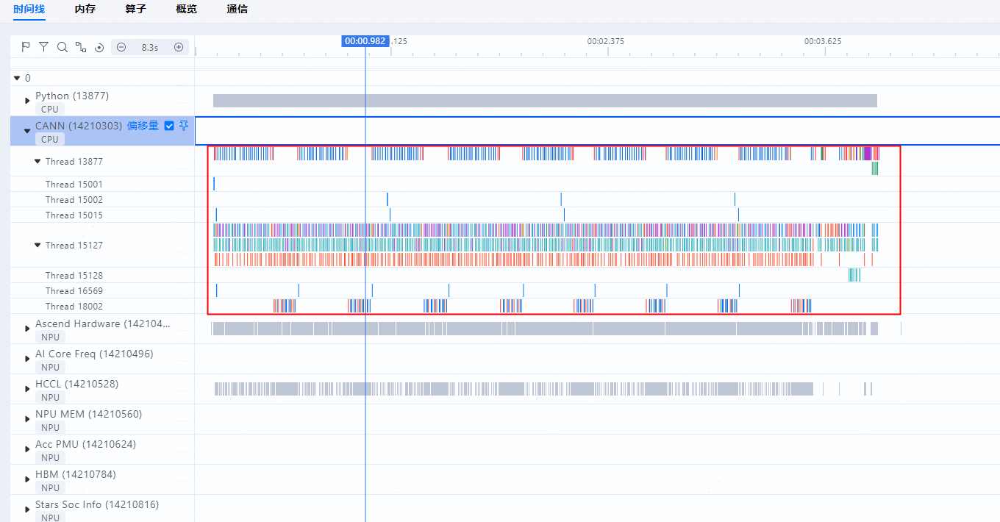                               |
| 2  | Gets a swimlane slice thumbnail.                                                | `unit/threadTracesSummary`          |                         |
| 3  | Click the operator to display the selected details.                             | `unit/threadDetail`                 |                               |
| 4  | Total number of global search fetches                                           | `search/count`                      |                               |
| 5  | Global search to obtain the current operator                                    | `search/slice`                      | 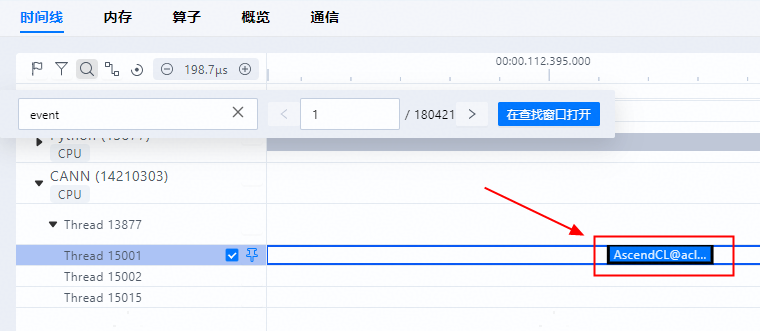                              |
| 6  | Discovery List Query                                                            | `search/all/slices`                 |                          |
| 7  | Click the redirection operator in the discovery list.                           | `unit/one/kernelDetail`             |                              |
| 8  | Get the selected list by box-selecting swimlanes                                | `unit/threads`                      | 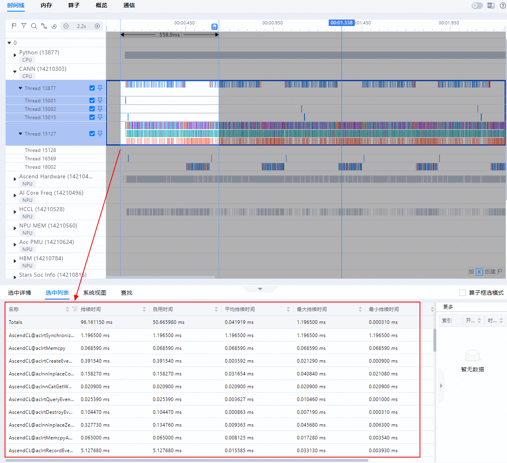        |
| 9  | Obtains the slice list based on the selected slice name and time range.         | `query/all/same/operators/duration` |      |
| 10 | Right-click a swimlane and choose Display in Event View from the shortcut menu. | `unit/eventView`                    |                      |

### 4.8 Expert System View Design

#### 4.8.1 Key Design

Experts suggest that the new module be superimposed on the original functions. The overall functions are based on the current data to further analyze possible data problems. Retain the parsing and query of the original profiling file in the process, and add operations related to data query. Therefore, code reconstruction is not involved in the code, but data query implementation files are modified, as shown in.`VirtualTraceDatabase.cpp/h`Waiting for the papers.

In terms of specific services, expert suggestions can be classified into single-card expert suggestions and cluster expert suggestions. Single-card expert suggestions are displayed together with the Timeline page. The cluster experts suggest that the cluster management function be displayed on the cluster pages, such as the Summary and Communication pages. In the preceding requirements, except the requirement of identifying the cause of the slow cluster, the slow link, the slow link, and the single card are all suggestions. The following describes the implementation idea in detail.

#### 4.8.2 Function Implementation Design

##### 4.8.2.1 Overall Logic

The following figure shows an example of expert advice. Optimization suggestions are provided by the affinity optimizer, affinity API, AICPU operator, ACLNN operator, and convergent operator identification, and optimization suggestions for cluster slow card and link identification.

    

The processing logics of the preceding two types of suggestions are basically the same, as shown in the sequence diagram in the following figure.

    

In the timing diagram above:

**(1) When the MindStudio Insight starts, the request handler needs to be registered. (Multiple handlers are summarized in AdvisorModule and bound to interface fields.) Register the protocol conversion in the ModuleManager. (Multi-protocol conversion is summarized in AdvisorProtocolUtil and bound to interface fields.)**

**(2) When the front end initiates a specific request, the front end searches the ModuleManager for the corresponding handler based on the interface field, and invokes the corresponding frontend JSON-to-Request data structure protocol conversion to convert the frontend request into a data structure, facilitating subsequent processing.**

**(3) Invoke the request handler to process the data. Further handlers invoke the method at the Process layer to process the data. (The reason why the process layer is added here is that many data does not need to be directly queried in the database, but needs to be further processed. These processing will be implemented at the process layer.). The process layer queries data in the corresponding database, and performs operations such as classifying, sorting, and filtering the queried data to obtain the final result and return the result to the handler.**

**(4) After obtaining the processed data, the handler returns to the ModuleManager, searches for and invokes the corresponding backend response data structure to the frontend JSON protocol conversion method, assembles the response into a JSON, and returns the JSON to the frontend for display.**

##### 4.8.2.2 Flowchart

###### Affinity API Identification

    

###### Affinity Optimizer Identification

Directly read SQL query results.

###### AI CPU Operator Identification

    

###### ACLNN operator identification

Same as the affinity optimizer process. The only difference is the SQL command, which needs to be implemented by the SQL command name`AscendCL@aclnn`Starts with no`GetWorkspaceSize`The operator at the end needs to appear more than 20 times.

###### Fusion operator identification

The fusion operator identifies continuously matched operator sequences in the same stream. You can use SQL to query consecutive matched operator sequences. However, the lengths of matching rules may be different. Therefore, only one rule can be matched each time. Continuous matching sequences can be implemented by using join, for example:

```sql
SELECT kd1.* FROM kernel_detail kd1
JOIN kernel_detail kd2 ON kd2.row_num = kd1.row_num + 1 AND kd2.name = 'BB'
WHERE kd1.name = 'AA';
```

#### 4.8.3 Interface Description

The Advisor module involves five new frontend and backend request/response messages:

1. `QueryAffinityAPIAdvice`\: Affinity API identification
2. `QueryAffinityOptimizerAdvice`\: Affinity optimizer identification
3. `QueryAiCpuOpAdviceHandler`\: AI CPU operator identification
4. `QueryAclnnOpAdvisorHandler`\: ACLNN operator identification
5. `QueryFusedOperatorAdviceHandler`\: Fusion operator recognition

#### 4.8.4 General Overview

For the single SIM card, it is recommended that the main body be placed on the Timeline tab page, which facilitates the linkage with the Timeline interface and helps developers quickly find the location of the optimization point, which is consistent with the design of NSight Systems. To be specific, the Expert System View option is added to the System View area on the Timeline tab page. The overall interface is placed in the lower part of the page.

#### 4.8.5 Code Design

New Advisor module, including`AdvisorModule`Class and`handler`,`process`,`protocol`Three packs:

1. `handler`The package is used to process front-end requests`handler`. Different interfaces are independent of each other and can be continuously expanded in the future,`AdvisorModule`Class except for the definition`Advisor`In addition to the basic information of the class, the above is also completed.`handler`register with the global message interface management instance;
2. `process`Package is an expert-recommended processing implementation, upward by`handler`Invoke and call down various database query interfaces. In addition to data query, data assembly, sorting, and filtering should be completed.
3. `protocol`The package contains the protocol format and protocol conversion implementation for frontend and backend interaction. In addition to defining the interface data structure, the package also includes the conversion of frontend request JSON data structure into request data structure and the conversion of backend response data structure into JSON data structure for return to the frontend. The preceding protocol conversion implementation is registered with the global protocol conversion management instance based on the interface field.

### 4.9 Full Connection Design

#### 4.9.1 Overall Logic

    

Query data can be classified into TEXT and DB. TEXT is further divided into operator optimization and system optimization. The performance optimization module uses the same processing logic for the TEXT and DB.

#### 4.9.2 Text Query Data

##### 4.9.2.1 Table Structure

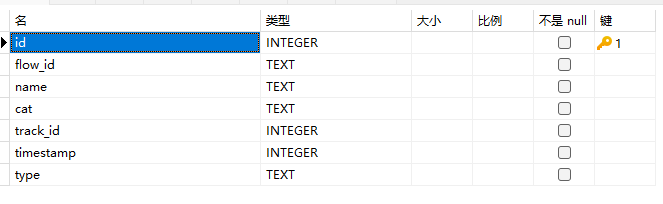    

**id: primary key, used to distinguish different data. One data indicates a connection point flow_id: connection ID. The connection points with the same flow_id form a connection point. Generally, a connection point is determined by two connection points name: connection name. Cat: connection type is not used.**

    

**track_id: unique identifier of a swimlane, used to identify the lane in which the connection point is located. timestamp: time of the connection point type: type of the connection point, which can be s, f, or t. s is the start point, and the rest are the end points.**

##### 4.9.2.2 Query Logic

Query all connection points based on cat and optimize performance later.

#### 4.9.3 Querying Data in the DB

##### 4.9.3.1 Query Logic

The DB scenario is a customized scenario, and the connection types are fixed.

###### async_task_queue

When a Python swimlane is connected to a Python swimlane, the operator is associated by connectionId. However, the name of the operator that ends the connection is ().`Enqueue`For details, see:

```cpp
HostFlowRepo::QueryAsyncTaskQueue
```

###### fwdbwd

When the Python swimlane is connected to the Python swimlane, the operator name that ends the connection is not`Enqueue`. For details, see:

```cpp
HostFlowRepo::QueryFwdbwd
```

###### async_npu

The Python swimlane is connected to the hardware and hccl by connectionId. The Python swimlane is the start point, and the hardware and hccl are the end points. For details, see the following:

```cpp
DbFlowRepo::QueryAsyncNpu
```

###### HostToDevice

Connect the CAN lane to the hardware and hccl by connectionId. The CAN lane is the start point, and the hardware and hccl are the end points. For details about the logic, see the following:

```cpp
DbFlowRepo::QueryHostToDevice
```

###### Mstx

The mstx lane is connected to the hardware by connectionId. The mstx lane is the start point, and the hardware is the end point. For details, see the following:

```cpp
DbFlowRepo::QueryMsTx
```

#### 4.9.4 Performance Optimization

##### 4.9.4.1 Handling Process

    

##### 4.9.4.2 Data sources are obtained through the following interfaces, regardless of database and text. The bottom layer ensures that the data formats returned by database and text are the same

```cpp
dataEngine->QueryFlowPointByCategory
```

##### 4.9.4.3 Sample connection points

```cpp
flowAnalyzerPtr->ComputeScreenFlowPoint
```

##### 4.9.4.4 Calculate the depth of the connection points after sampling

##### 4.9.4.5 Assemble the connection points into the connection points, and then return the connection points to the front end

```cpp
flowAnalyzerPtr->ComputeUintFlows
```
