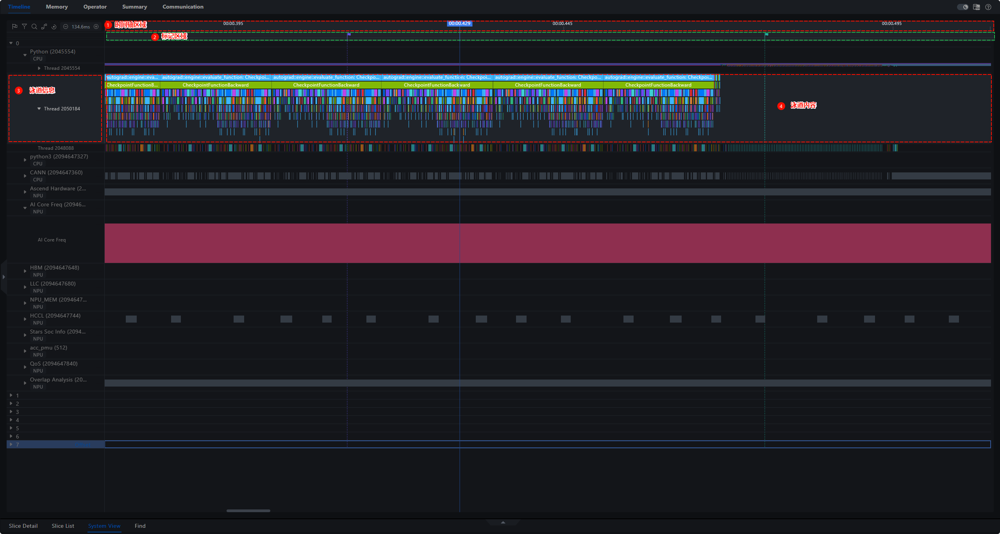
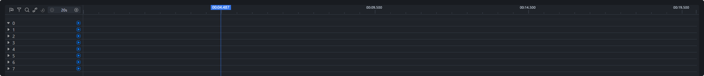
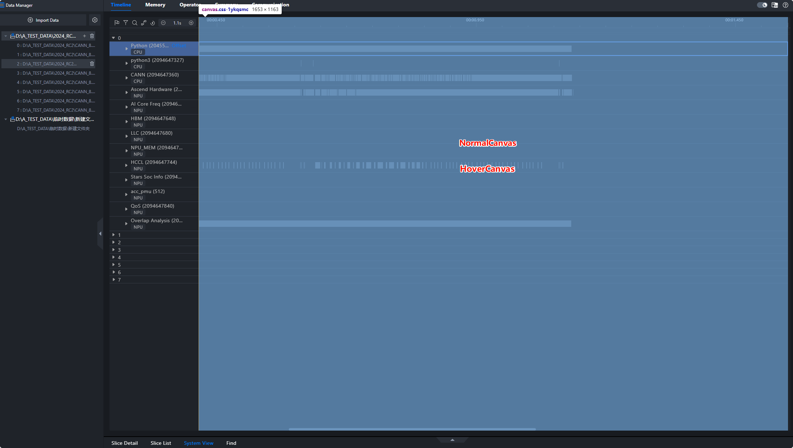

# swimlane drawing

## 1. Overview

The following areas are involved in the swimlane drawing in the Timeline:

**① Timeline area, 2 marker area, swimlane area (Each lane contains 3 lanes of information and 4 lanes of content).**



## 2. Component Relationship


## 3. Timeline area

**Component:**

```text
<TimelineAxis />
```

**Draw Frequency: Continuous redrawing with a custom rendering engine renderEngine**

**Drawing content: calculated based on _domainStart and _domainEnd in session.domain**

## 4. Marking (flag-planting) areas

**Component:**

```text
<TimeMarkerAxis />
```

**Drawing time: depends on the changes of the following parameters: width (region width), domainStart, domainEnd, session.timelineMarker.refreshTrigger (trigger flag), session.selectedRange**

**Draw Content:**

1. Click to plant the flag: Use the canvas ref=canvas to draw the flag by clicking the drawn flag.
2. Hover flag placement: The flag placement displayed by hovering the mouse is drawn using the canvas of ref=flagCursor.
3. Flag dashed line: dashed line connected by the insert side, drawn using the canvas of ref=vertical.

## 5. Swimlane area

### 5.1 Swimlane Information

**Component:**

```text
<UnitInfo />
```

**Content:**

1. Configuring the component
2. Top component
3. Lane name

### 5.2 Swimlane Contents

**Component:**

```text
<Chart />
```

#### 5.2.1 Type of swimlane

The AscendUnit.tsx file defines swimlane classes. The following table lists the graph types corresponding to each type of swimlane. Currently, three graph types are used: StatusChart, StackStatusChart, and FilledLineChart.

| Type of swimlane | Chart Type       |
| ---------------- | ---------------- |
| Root             | -                |
| Card             | -                |
| Process          | StatusChart      |
| Thread           | StackStatusChart |
| Counter          | FilledLineChart  |
| Label            | -                |

#### 5.2.2 Data Interface

| Interface                | Description                  |
| ------------------------ | ---------------------------- |
| import/action            | Import File Path             |
| parse/success            | Data parsed successfully.    |
| unit/threadTracesSummary | Obtains thread preview data. |
| unit/threadTraces        | Obtaining Thread Data        |
| unit/counter             | Obtaining Histogram Data     |

#### 5.2.3 Overall Process


1. Import data (import/action): Obtain the basic information about all cards, traverse the data, instantiate new CardUnit for each card swimlane, and store the new CardUnit in session.units.

    

2. Parse/success: After a single card is successfully parsed, the backend returns an event indicating that the card is successfully parsed. The event contains the detailed data of the card, such as children and metadata. Traverse children, instantiate different types of swimlanes based on the data type type, and add the child swimlanes to the parent swimlane corresponding to session.units.\\
    
    
    
    
3. When a swimlane is expanded, the content (drawing) data of the swimlane is requested. Different swimlanes use different interfaces:

| Type of swimlane | Interface                | Description                  |
| ---------------- | ------------------------ | ---------------------------- |
| Label Lane       | -                        | -                            |
| Process swimlane | unit/threadTracesSummary | Obtains thread preview data. |
| Thread Lane      | unit/threadTraces        | Obtaining Thread Data        |
| Counter Lane     | unit/counter             | Obtaining Histogram Data     |

### 5.3 Swimlane mask

In the area, there are two canvases, NormalCanvas and HoverCanvas, which are used to draw cross-lane content. HoverCanvas is used to draw required content during mouse movement.

The mouse events and keyboard events defined in the two canvases are exposed by usingImperativeHandle and bound to the ChartContainer component.



## 6. Interaction

### 6.1 Topping

### 6.2 Box Selection

### 6.3 Scaling

### 6.4 Jump
