# Communication Design Document

<!-- md-trans-meta sourceCommit=63323a8f22b6b37afd86f8821f5e7972ffe625b0 translatedAt=2026-08-12T11:38:18.177Z pushedAt=2026-08-12T11:57:31.084Z -->

## 1. Document Purpose and Scope

This document describes the data sources, interface commands, and frontend/backend code entry points related to the `cluster/communication` page, targeting developers who need to maintain the communication matrix, communication latency, operator list, bandwidth, and distribution chart.

- Both TEXT and DB data scenarios are supported.

- Screenshots on the page are for reference only. The actual key interfaces, paths, and data mappings may vary.

## 2. Interfaces and Data Mapping

### 2.1 Raw Data (ATT-Processed Files)

#### TEXT

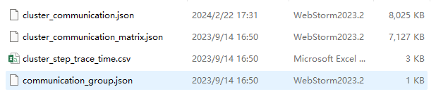

#### DB

### 2.2 Processed DB Data Content

#### TEXT

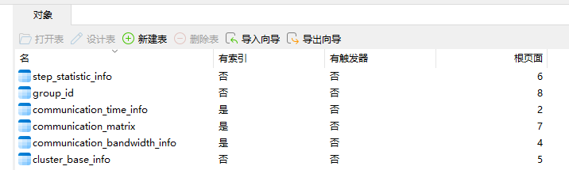

#### DB

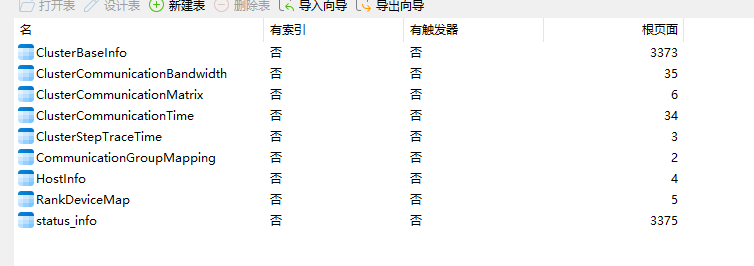

### 2.3 Page API Overview

| Page Data | URL Request | DB Data Type | Text Data Type | Description |
| --- | --- | --- | --- | --- |
|  | `communication/matrix/bandwidthInfo` |  |   | Matrix bandwidth details. |
|  | `communication/duration/iterations` |  |  | Iteration list and communication latency range. |
|  | `communication/matrix/group` |  | 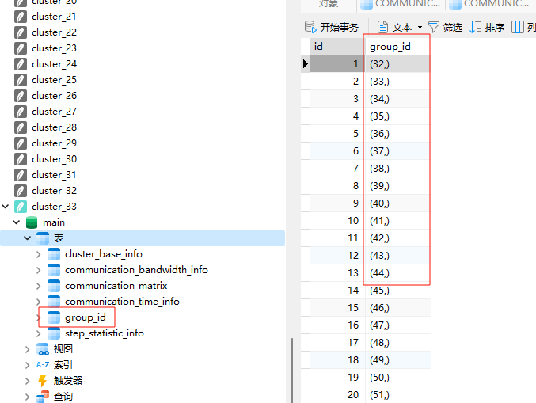 The underlying data comes from:  | Communication matrix group information. |
| 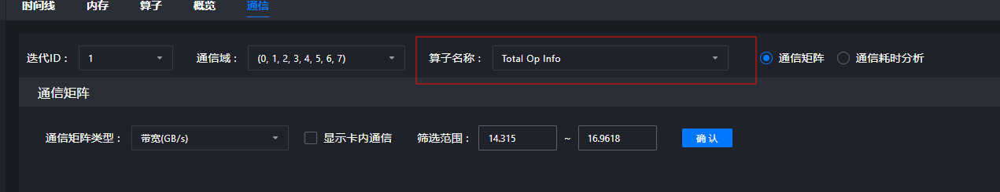 | `communication/matrix/sortOpNames` |  |  Underlying data: 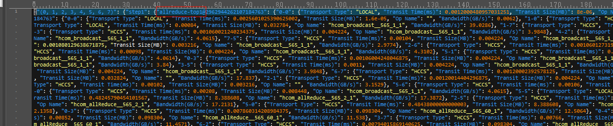 | Operator name sorting and aggregation results. Whether the DB scenario is supported depends on the source code implementation. |
|  | `communication/duration/operatorNames` | 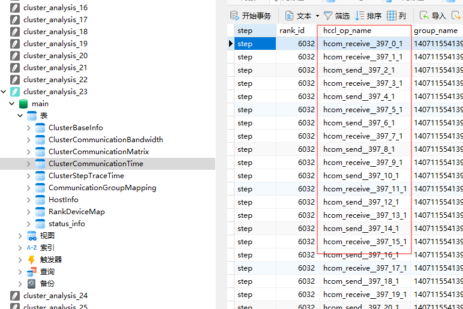 | 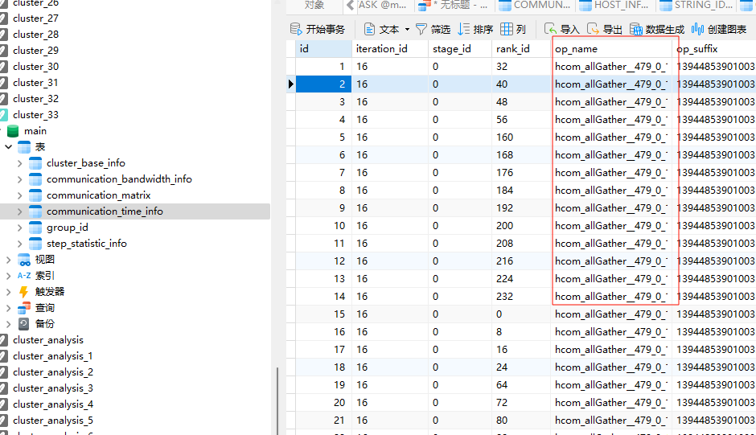 Data:    | Operator name list in the communication latency view. |
|  | `communication/operatorLists` |  | 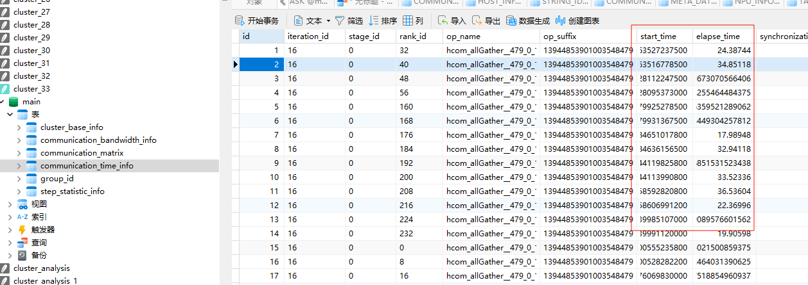 Data:  | Operator list view. |
|  | `communication/duration/list` |  |   | Communication latency detail list. It is recommended that experts derive this from data computation. |
|  | `communication/operatorDetails` | 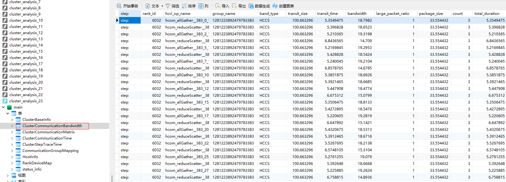 |  | Operator details. |
|  | `communication/distribution` | 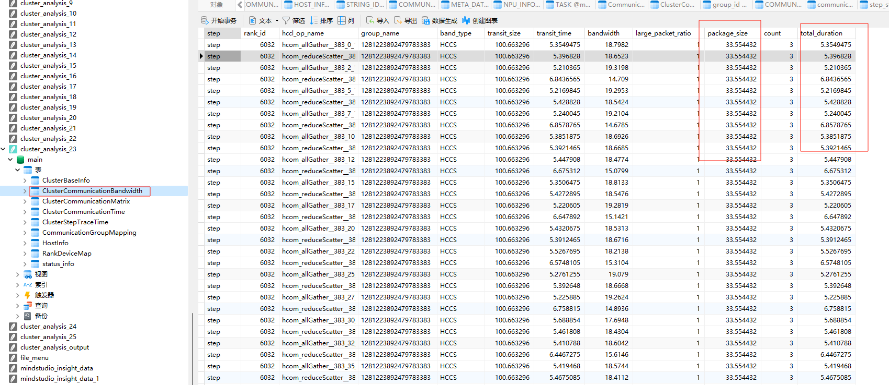 | 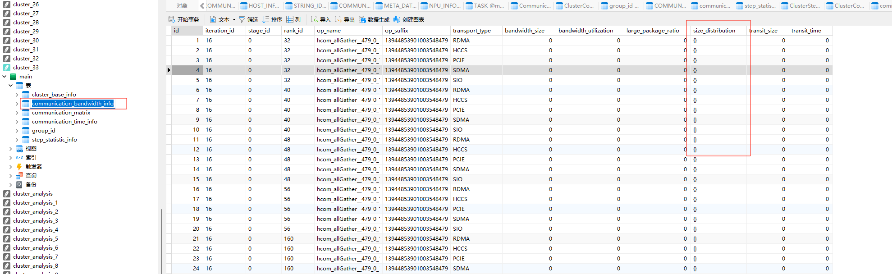 | Communication distribution chart. |
|  | `communication/bandwidth` |  |  | Bandwidth analysis. |

### 2.4 Code Entry

- Frontend request encapsulation: `modules/cluster/src/utils/RequestUtils.ts`

- Backend command constants: `server/src/modules/defs/ProtocolDefs.h`

- Backend plugin: `server/src/modules/communication/CommunicationPlugin.h`

- Plugin registration: `server/src/modules/Plugins.cpp`

- Protocol test: `server/src/test/modules/communication/protocol/CommunicationProtocolUtilTest.cpp`

- Request sample: `server/src/test/test_data/request.csv`

### 2.5 Notes

- `text` and `db` only indicate different data sources; the page capabilities and interface naming remain consistent.

- The images in the tables are retained to assist in quickly locating UI elements, but they are not the sole source of information.

- The DB scenario support status of `sortOpNames`, the specific algorithms for expert advice, and the complete response fields of each interface may vary according to the source code and test results.
