# Compute Design Document

<!-- md-trans-meta sourceCommit=49122e1f1d6621e5b8a8bbc1c0fdae9583659f48 translatedAt=2026-08-12T11:40:26.859Z pushedAt=2026-08-12T11:57:31.087Z -->

## Document Purpose and Scope

This document describes the development conventions for Compute (operator tuning) related data import, binary data blocks, Timeline view, Hotspot Instruction view, and Memory Load view.

- JSON data primarily reuses the Trace Event Format.

- Bin data is differentiated by data block encoding for different page data.

- The 0x0A Memory Read/Write Timing Diagram and 0x0B L2Cache Chart are currently documented as POC capabilities, and their stability is subject to implementation and testing.

- The example paths in this document are all sanitized paths. Actual paths are subject to the imported data.

## Business Process Overview

### End-to-End Process

It is primarily divided into profile data collection and profile data visualization.


### Backend Service Code Flow

#### File Parsing Process

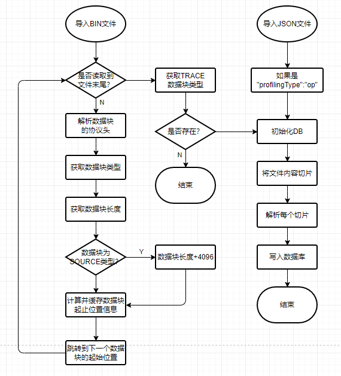

#### Data Request Process

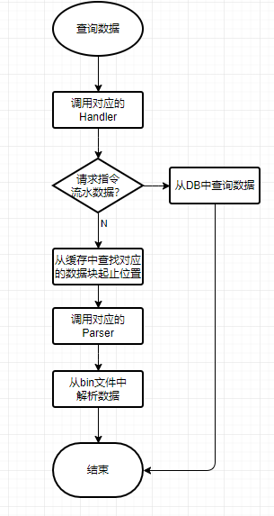

#### Code Logic Sequence Diagram


## Feature Design and Implementation

### Data File Format

#### Json File

File format: *.json
Determination logic: The json file contains "profilingType" and "op" before the first array begins.
Content format: traceEvents, equivalent to the timeline json file.
Content example:

```json
{
    "displayTimeUnit": "ns",
    "profilingType": "op",
    "schemaVersion": 1,
    "traceEvents": [
        {
            "args": {
                "code": "/home/xxx/projects/samples/operator/ascendc/0_introduction/3_add_kernellaunch/AddKernelInvocationNeo/build/auto_gen/ascendc_kernels_sim/auto_gen_add_custom.cpp:22",
                "detail": "XD:X29=0x7fa0,IMM:0x7fa0,",
                "pc_addr": "0x10d0d000"
            },
            "cname": "startup",
            "dur": 0.0010000000474974513,
            "name": "MOV_XD_IMM",
            "ph": "X",
            "pid": "core2.veccore1",
            "tid": "SCALAR",
            "ts": 3.568000078201294
        }
    ]
}
```

#### Bin File

File format: *.bin

Determination logic: Import a single file && ends with *.bin
Content format:

The operator bin file uses a binary format, where each data unit takes the following form:


Principles for assigning data types to data blocks in visualize_data.bin:
**Subsequently, 16 positions are allocated to each component at a time to prevent development conflicts between different components.**

| Data Block Encoding | Data Block Content |
|---|---|
|0x00 |Data block invalid|
|0x01 |Code file |
|0x02 |Pipeline graph `tracing.json` |
|0x03 |The `files` section of the heatmap mapping file `api.json` |
|0x04 |The `instructions` section of the heatmap mapping file `api.json` |
|0x05 |Basic information |
|0x06 |Compute load chart |
|0x07 |Compute load table |
|0x08 |Memory access heatmap |
|0x09 |Memory access table |
|0x0A |Memory read/write timing diagram (TraceKit) |
|0x0B |L2Cache diagram (TraceKit) |
|0x0C |Inter-core load |
|0x0D |Roofline model |

Example of JSON data content:
0x01 Code File:
Feature page:
 

The code file contains partial binary content, and its structure is as follows:
 

A 4096-byte additional data block (storing file path information):

```json
/home/matmul_leakyrelu_custom.cpp
```

Data block content description (i.e., the C++ source code content):

```C++
# include "kernel_operator.h"\n# include "lib/matmul_intf.h"\n\nusing namespace ...
```

0x03 source code line information
Feature page:
 

Binary structure description:
 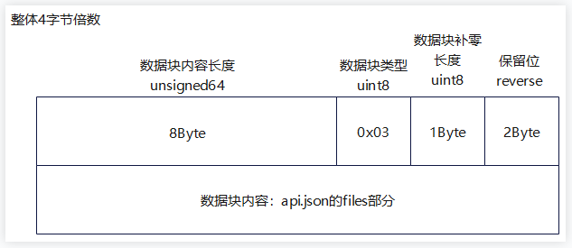

Data block content:

```json
{
  "Cores": [ // Compute cores that execute the operator, e.g., "core0.cubecore0", "core0.veccore0"
    string
  ],
  "Files Dtype": { // Specify column names and data types
// Key-value pairs in the Files Dtype->Lines object, used to specify the key names and value types of each key-value pair in the subsequent Files->Lines array objects
// skip 0 (indicates that this column does not need to be displayed on the UI, i.e., it will not appear on the interface), int 1, float 2, string 3
// Fields for which no data has been collected need not be declared here
// Currently, dynamically parsed key-value pairs are supported, and the value must be a single value or a one-dimensional array. Two-dimensional arrays such as Address Range are not supported for dynamic parsing and require separate conventions
        "Lines": {
            "Address Range": 0,
            "Cycles": 1,
            "Instructions Executed": 1,
            "Line": 1,
            "L2Cache Hit Rate": 3
    }
  },
  "Files": [ // Code line information in the source code file
    {
      "Lines": [ // Instruction address range associated with the code line, clock cycles consumed, and total number of executed instructions
        {
          "Address Range": [ // Instruction address range associated with the current code line
            [
              string
            ]
          ],
          "Cycles": [ // Total clock cycles consumed by the current code line on each compute core. (The array order in the code example must be consistent with the `Cores` field order. The specific meaning is subject to the agreement between the data producer and the parser.)
            int
          ],
          "Instructions Executed": [ // Total number of instructions executed by the current code line on each compute core. (The array order in the code example must be consistent with the `Cores` field order. The specific meaning is subject to the agreement between the data producer and the parser.)
            int
          ],
          "Line": 100 // Code line number
        }
      ],
      "Source": string // Source code file path
    }
  ]
}
```

 0x04 Instruction Information
Feature Page:
 

Binary Structure:
 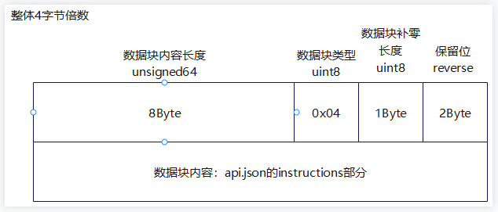

Data Content:

```json
{
  "Cores": [ // Compute cores that execute operators, e.g., "core0.cubecore0", "core0.veccore0"
    string
  ],
"Instructions Dtype": { // Specifies column names and data types
// Key-value pairs in the Instructions Dtype->Instructions object, used to specify the key names and value types of each key-value pair in each object within the subsequent Instructions array
// skip 0 (indicates that this column does not need to be displayed on the UI, i.e., it will not appear on the interface), int 1, float 2, string 3
// Data fields that are not collected do not need to be declared here
// Currently supported dynamically parsed key-value pairs must have values that are single values or one-dimensional arrays. Two-dimensional arrays and the like are not supported for dynamic parsing and require separate conventions
    "Instructions": {
        "Address": 3,
        "AscendC Inner Code": 3,
        "Cycles": 1,
        "Instructions Executed": 1,
        "Pipe": 3,
        "TheoreticalStallCycles": 1,
        "Source": 3,
        "RealStallCycles": 1,
        "L2Cache Hit Rate": 3
     }
},
  "Instructions": [
    {
      "Address": string,    // Offset address of the instruction, e.g., "0x1269f000"
      "AscendC Inner Code": string, // Source code file path and code line number, e.g., "/home/xxx.cpp:23"
      "Cycles": [      // Clock cycles consumed by the instruction on each compute core
        int
      ],
      "Instructions Executed": [  // Number of times the instruction is executed on each compute core
        int
      ],
      "Pipe": string,     // Instruction queue to which the instruction belongs, e.g., "SCALAR"
      "TheoreticalStallCycles": [                    // Expected stall time
        int
      ],
      "Source": string,     // Instruction content, e.g., "MOV_XD_IMM XD:X29,IMM"
      "RealStallCycles": [                    // Actual stall cycles.
        int
      ]
    }
  ]
}
```

0x02 Timeline Information
Feature page:
 

Binary structure:
 

Data content:

```json
{"profilingType": "op",
    "displayTimeUnit": "ns",
    "schemaVersion": 1,
    "traceEvents": [
  {
   "args": {
                "code": "/home/xxx/workspace/samples/operator/AddCustom/kernel.cpp:23",
                "detail": "x[1]=0x0,imme16:0x4000",
                "pc_addr": "0x10cfa004"
            },
            "cname": "process_block0",
            "dur": 20,
            "name": "block0",
            "ph": "X",
            "pid": "process_name",
            "tid": "process_block0",
            "ts": 1
        },
        {
   "args": {
                "code": "/home/xxx/workspace/samples/operator/AddCustom/kernel.cpp:23",
                "detail": "x[1]=0x0,imme16:0x4000",
                "pc_addr": "0x10cfa004"
            },
            "cname": "prepare",
            "dur": 5,
            "name": "hccl::prepare",
            "ph": "X",
            "pid": "process_name",
            "tid": "process_block0",
            "ts": 2
        },
  {
   "args": {
                "code": "/home/xxx/workspace/samples/operator/AddCustom/kernel.cpp:23",
                "detail": "x[1]=0x0,imme16:0x4000",
                "pc_addr": "0x10cfa004"
            },
            "cname": "prepare",
            "dur": 5,
            "name": "hccl::wait",
            "ph": "X",
            "pid": "process_name",
            "tid": "process_block0",
            "ts": 10
        }
    ]
}
```

NOTE
The data source is tracing.json, which complies with the Trace Event Format requirements.

0x05 Operator Basic Information

Feature Page:
 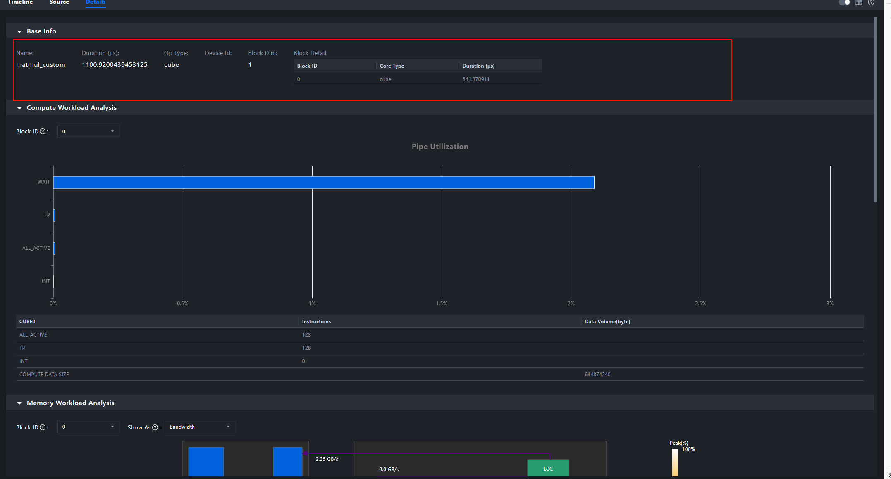

Binary Structure:
 

Data Content:

```json
{
    "name": str,            // Operator name
    "soc": str,             // Operator runtime platform
    "op_type": enum,        // Operator type: aic, aiv, mix
    "block_dim": uint16,    // Block dim data
    "mix_block_dim": uint16,// Number of slave cores under the mix operator
    "duration": float32,    // Total duration of the operator
    "device_id": uint16,    // device ID
    "pid": str,                    // Process ID
    "block_detail": [       // Valid when op_type == aic/aiv.
        {
            "block_id": uint16,     // Sub block index
            "core_type": enum,      //Sub block type: aic, aiv
            "duration": float32,    // sub block duration
        }
    ],
    "mix_block_detail": [ // Valid when op_type == mix
        {
            "block_id": uint16,  // block sequence number
            "duration": [float32, float32, float32], //sub block duration, representing in order: aic, aiv0, aiv1
        }
    ],
    "advice": [ // Advice, currently empty, reserved
        string, string, ...
    ]
}
```

**NOTE** Only one of the block_detail and mix_block_detail fields is valid. Both block_detail and mix_block_detail are lists containing 0 to N dict/map entries.

0x06 Compute Load Chart

Feature Page:
 

Binary Structure:
 

Data Content:

```json
{
    "subblock_detail": [
        {
            "block_id": uint8,      // block ID, i.e., the main core index
            "block_type": enum,     // sub block type: aic, aiv, aiv0, aiv1
            "name": string,     // Compute Load data name
            "unit": enum,       // data unit: %
            "value": float32,    // value
            "origin_value": float32    // Value
        }
    ],
    "advice": [ // Suggestion, currently empty, reserved.
        string, string, ...
    ]
}
```

0x07 Compute Load Chart:

Feature Page:
 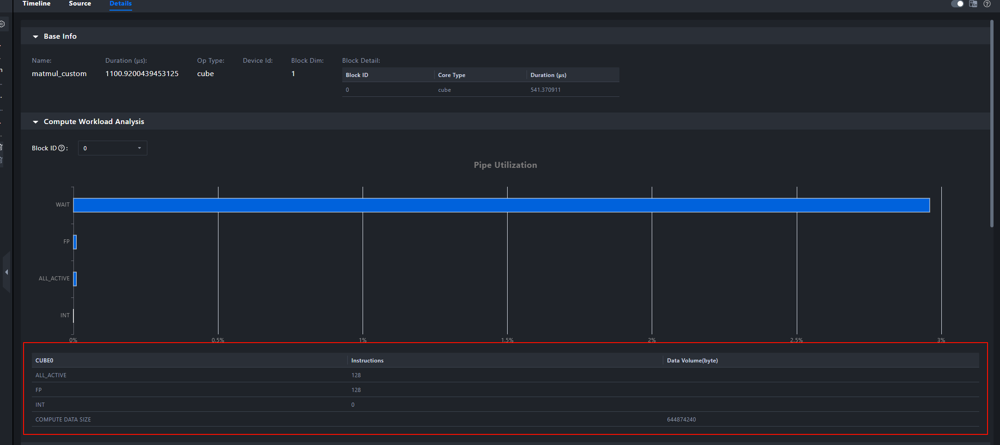

Binary Structure:
 

Data block content:

```json
{
    "subblock_detail": [
        {
            "block_id": uint8,      // block ID, i.e., the main core index
            "block_type": enum,     // sub block type: aic, aiv, aiv0, aiv1
            "name": string,     // compute load data name
            "unit": enum,       // data unit: us, instructions, data volume (Byte)
            "value": float32,   // Value
            "origin_value": float32   // Value
        }
    ],
    "advice": [ // Suggestion, currently empty, reserved.
        string, string, ...
    ]
}
```

0x08 Memory Access Heatmap

Feature Page:
 

Binary Structure:
 

Data Content:

```json
{
    "core_memory_map": [
        {
            "core_no": uint16,      // block number
            "op_type": enum,        // Operator type: cube, vector, mix
            "soc": str,             // Operator execution platform
            "memory_unit": [        // Memory path list
                {
                    "memory_path": enum,        // Memory path name
                    "request": uint64,          // Number of requests
                    "request_per_byte": uint8,  // Data volume per request
                    "bandwidth": float32,       // Bandwidth
                    "peak_ratio": float32,         // Peak bandwidth ratio: -1 indicates invalid data.
                    "display": bool,            // Whether to display this path.
                }
            ],
            "L2cache": [
                "hit": uint64,              // Number of cache hits.
                "miss": uint64,             // Number of cache misses.
                "total_request": uint64,    // Total number of cache requests.
                "hit_ratio": int8,          // Hit ratio: -1 indicates invalid data.
            ],
            "Cube": {
                "ratio": float32,
                "cycle": uint64,
                "total_cycles": uint64
            },
            "Vector": {
                "ratio": float32,
                "cycle": uint64,
                "total_cycles": uint64
            },
            "Vector1": {
                "ratio": float32,
                "cycle": uint64,
                "total_cycles": uint64
            },
            "advice": [ // Advice
                string, string, ...
            ]
        }
    ]
}
```

0x09 Memory Access Heatmap Table

Feature Page:
 

Binary Structure:
 

Data Block Content:

```json
{
    "table_per_block": [
        {
            "block_id": uint,       // block id
            "table_op_type": enum,  // Table data type: aic, aiv, mix
            "table_detail": [
                {
                    "table_name": string,   // Table name
                    "size": [uint8, uint8], // Table size: [row count, column count]
                    "header_name": [        // Column name (consistent with column count)
                        string, string, ...
                    ],
                    "row": [                // Row data (consistent with row count)
                        "name": string,     // Row name
                        "value": [          // Row data: length equals column count minus 1
                            float16, float16, ...
                        ]
                    ],
                }
            ],
            "advice": [ // Advice
                string, string, ...
             ]
        },
    ],

    "advice": [ // Advice, currently empty, reserved
        string, string, ...
    ]
}
```

0x0A Memory Read/Write Timing Diagram (POC)

Feature Page:
 

Binary Structure:
 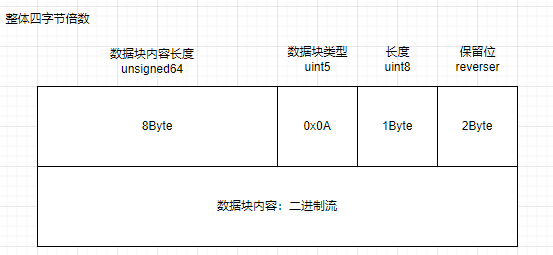

Data Block Content Structure:
Delivered as a whole binary, as shown in the following figure.
 

File Protocol Header:

```C++
struct BinaryBlockHeader {
    uint64_t contentSize = 0;
    uint8_t type = 0;
    uint8_t padding = 0;
    uint16_t reverse = 0x5a5a;
};
```

Supports building memory read/write timing diagrams based on memory read/write sequence information output by the msTraceKit tool.
Memory read/write struct design:

```C++
struct TraceRecord {
    uint8_t type;
    int8_t coreId;
    int8_t space;
    uint8_t blockType;
    uint32_t recordId;
    uint64_t addr;
    uint64_t memSize;
    uint64_t pc;
};
```

TraceRecord struct field description:

| Name | Description |
|---|---|
|type | Memory event type: MALLOC=0 FREE=1 MEMCPY_BLOCKS=2 LOAD=3 STORE=4 |
|coreId | Core ID where this memory event occurred |
|space | Address space type of the memory operated by this memory event: PRIVATE=0 GM=1 L1=2 L0A=3 L0B=4 L0C=5 UB=6 |
|blockType | Block type where this memory event occurred: AIV=0 AIC=1 |
|recordId | Number of this memory event |
|addr | Memory address operated by this memory event |
|memSize | Memory length operated by this memory event |
|pc | PC address corresponding to the code location where this memory event occurred |

The call stack information mapping table (CallStack map) is designed as a JSON object. The field types and descriptions are as follows:

| Name | Type | Description |
|---|---|---|
|root |Object |Memory read/write record information JSON object |
|+PcAddr |Object |For ease of query, the PC address is used as the key, and the corresponding call stack information is represented by an Object |
|++Address |String |PC address corresponding to the call stack |
|++ModuleName |String |Compilation unit name corresponding to the call stack |
|++Symbol |Array |Symbol relationship call array involved in the call stack |
|+++Symbol.Item |Object |Each symbol information is represented by an Object |
|++++Column |Int |Column number of the call stack symbol in the code |
|++++Line |Int |Line number of the call stack symbol in the code |
|++++FileName |String |Code file name where the call stack symbol is located |
|++++FunctionName |String |Function name where the call stack symbol is located |

An example of the call stack information mapping table is as follows:

```json
[
{
    "Address": "0x4004be",
    "ModuleName": "inlined.elf",
    "Symbol": [
      {
        "Column": 18,
        "Discriminator": 0,
        "FileName": "/tmp/test.cpp",
        "FunctionName": "baz()",
        "Line": 11,
        "StartAddress": "0x4004be",
        "StartFileName": "/tmp/test.cpp",
        "StartLine": 9
      },
      {
        "Column": 0,
        "Discriminator": 0,
        "FileName": "/tmp/test.cpp",
        "FunctionName": "main",
        "Line": 15,
        "StartAddress": "0x4004be",
        "StartFileName": "/tmp/test.cpp",
        "StartLine": 14
      }
    ]
  }
]
```

0x0B L2Cache Chart (POC)

Feature Page:
 

Binary Structure:
 

Data Block Content:
Cache information record struct design:

```C++
struct CacheRecord {
    uint32_t loadCount{0};
    uint32_t storeCount{0};
    uint32_t cacheLineId{0};
    uint32_t hit{0};
    uint32_t miss{0};
    uint32_t allocate{0};
    uint32_t evictAndWrite{0};
    uint32_t evictWithoutWrite{0};
};
```

Field Description:

| Name | Description |
| --- | --- |
|loadCount |Total count of read events occurring on the current cache set|
|storeCount |Total count of write events occurring on the current cache set|
|hit |Total count of hits on the current cache set|
|miss |Total count of misses on the current cache set|
|allocate |Total count of allocations caused by misses on the current cache set|
|evictAndWrite |Total count of cacheline evictions from the current cache set with write-back to L2|
|evictWithoutWrite |Total count of cacheline evictions from the current cache set without write-back|

Hit rate calculation formula: count of each dimension / (loadCount + storeCount)

0x0C Inter-Core Load

Feature Page:
 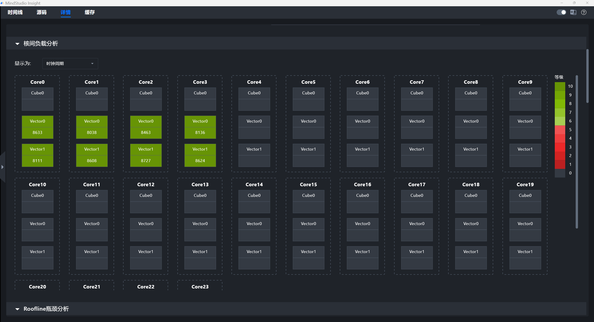

Binary Structure:
 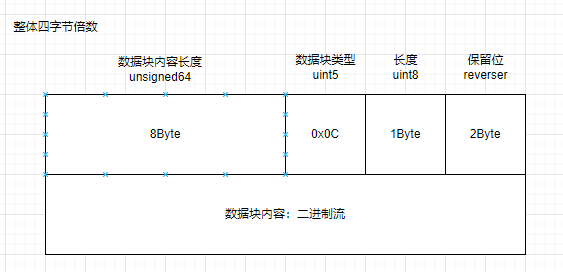

Data Content:

```json
{
    "advice": "1) core0 vector0 took more time than other vector cores.",
    "op_detail": [
        {
            "core_detail": [
                {
                    "L2cache_hit_rate": "80.157990",
                    "cycles": "265838",
                    "subcore_id": "0",
                    "subcore_type": "vector",
                    "throughput": "2635776"
                },
                {
                    "L2cache_hit_rate": "80.165741",
                    "cycles": "139164",
                    "subcore_id": "1",
                    "subcore_type": "vector",
                    "throughput": "2635776"
                },
                {
                    "L2cache_hit_rate": "94.524757",
                    "cycles": "267206",
                    "subcore_id": "0",
                    "subcore_type": "cube",
                    "throughput": "6825472"
                }
            ],
            "core_id": 0
        }
    ],
    "op_type": "mix",
    "soc": "xxxx"
}
```

0x0D roofline

Feature Page:
 

Binary Structure:
 

Data Block Content Format:

```json
// Roofline data block
{
 "multiple_rooflines": [
    {
      "title": "Memory Unit",             // Chart title
      "rooflines": [
        {
          "bw": float,                   // Theoretical bandwidth
          "computility": float,            // Roofline computility
          "computility_name": str,       // Compute power name
          "point": [float, float]          // Corresponding coordinate point
        },
        {
          "bw": float,
          "computility": float,
          "computility_name": str,
          "point": [float, float]
        }
      ]
    }
  ]
}
```

### Timeline View Interface

#### Interface List Overview

| Interface Command | Function | Type | Remarks |
| --- | --- | --- | --- |
| import/action | Import bin file | WebSocket request | The import result is processed by the timeline module |
| unit/threadTracesSummary | Obtain thread preview data | WebSocket request | Used for Process unit preview |
| unit/threadTraces | Obtain thread detailed data | WebSocket request | Used for Thread unit details |

##### import/action

###### Request

```json
{
  "id": 4769,
  "moduleName": "timeline",
  "type": "request",
  "command": "import/action",
  "params": {
    "path": [
      "D:\\visualize_data.bin"
    ]
  }
}
```

###### Response

```json
{
  "type": "response",
  "id": 11925,
  "requestId": 4769,
  "result": true,
  "command": "import/action",
  "moduleName": "timeline",
  "body": {
    "isCluster": false,
    "reset": true,
    "isSimulation": true,
    "isBinary": true,
    "isIpynb": false,
    "coreList": [
      "core0.cubecore0",
      "core0.veccore0",
      "core0.veccore1"
    ],
    "sourceList": [
      "/home/xxx.cpp"
    ],
    "result": [
      {
        "cardName": "Timeline and Hotspot Functions",
        "rankId": "Timeline and Hotspot Functions",
        "cardPath": "Directory: Timeline and Hotspot Functions",
        "result": true
      }
    ]
  }
}
```

##### unit/threadTracesSummary

###### Request

```json
{
  "id": 5022,
  "moduleName": "timeline",
  "type": "request",
  "command": "unit/threadTracesSummary",
  "params": {
    "cardId": "timeline and hotspot function",
    "processId": "3",
    "metaType": "",
    "startTime": 0,
    "endTime": 289326,
    "dataSource": {
      "remote": "127.0.0.1",
      "port": 9000,
      "dataPath": [
        "D:\\visualize_data.bin"
      ]
    },
    "timePerPx": 335.6450116009281
  }
}
```

###### Response

```json
{
  "type": "response",
  "id": 12178,
  "requestId": 5022,
  "result": true,
  "command": "unit/threadTracesSummary",
  "moduleName": "timeline",
  "body": {
    "data": [
      {
        "startTime": 18446744073709550000,
        "duration": 0
      },
      {
        "startTime": 1,
        "duration": 144677
      }
    ]
  }
}
```

##### unit/threadTraces

###### Request

```json
{
  "id": 5033,
  "moduleName": "timeline",
  "type": "request",
  "command": "unit/threadTraces",
  "params": {
    "cardId": "Timeline and hotspot functions",
    "processId": "3",
    "threadId": "18",
    "metaType": "",
    "startTime": 46319,
    "endTime": 243007,
    "dataSource": {
      "remote": "127.0.0.1",
      "port": 9000,
      "dataPath": [
        "D:\\visualize_data.bin"
      ]
    },
    "timePerPx": 335.6450116009281
  }
}
```

###### Response

```json
{
  "type": "response",
  "id": 12189,
  "requestId": 5033,
  "result": true,
  "command": "unit/threadTraces",
  "moduleName": "timeline",
  "body": {
    "data": [
      [
        {
          "name": "BAR",
          "duration": 1,
          "startTime": 144513,
          "endTime": 144514,
          "depth": 0,
          "threadId": "18",
          "cname": "good",
          "id": "78138"
        }
      ]
    ]
  }
}
```

##### unit/flows

###### Request

```json
{
  "id": 5238,
  "moduleName": "timeline",
  "type": "request",
  "command": "unit/flows",
  "params": {
    "rankId": "timeline and hotspot functions",
    "tid": "4",
    "pid": "1",
    "id": "6146",
    "metaType": "",
    "startTime": 107782,
    "endTime": 108381,
    "isSimulation": true
  }
}
```

###### Response

```json
{
  "type": "response",
  "id": 12395,
  "requestId": 5238,
  "result": true,
  "command": "unit/flows",
  "moduleName": "timeline",
  "body": {
    "unitAllFlows": [
      {
        "cat": "MTE2ToVECTOR",
        "flows": [
          {
            "title": "flow",
            "cat": "MTE2ToVECTOR",
            "id": "770",
            "from": {
              "pid": "1",
              "tid": "7",
              "timestamp": 108380,
              "duration": 0,
              "depth": 1,
              "name": "",
              "id": "",
              "metaType": "",
              "rankId": ""
            },
            "to": {
              "pid": "1",
              "tid": "4",
              "timestamp": 108381,
              "duration": 0,
              "depth": 1,
              "name": "",
              "id": "",
              "metaType": "",
              "rankId": ""
            }
          }
        ]
      }
    ]
  }
}
```

##### unit/threadDetail

###### Request

```json
{
  "id": 5239,
  "moduleName": "timeline",
  "type": "request",
  "command": "unit/threadDetail",
  "params": {
    "rankId": "timeline and hotspot functions",
    "metaType": "",
    "pid": "1",
    "tid": "4",
    "id": "6146",
    "startTime": 107782,
    "depth": 1,
    "timePerPx": 30.116764580116918
  }
}
```

###### Response

```json
{
  "type": "response",
  "id": 12396,
  "requestId": 5239,
  "result": true,
  "command": "unit/threadDetail",
  "moduleName": "timeline",
  "body": {
    "emptyFlag": false,
    "data": {
      "selfTime": 0,
      "args": "{\"code\":\"/tikcpp/tikcfw/impl/kernel_event.h:719\\n/tikcpp/tikcfw/interface/kernel_common.h:159...",\"detail\":\"PIPE:MTE2,TRIGGERPIPE:VEC,FLAGID:0,\",\"pc_addr\":\"0x126a9674\"}",
      "title": "WAIT_FLAG",
      "duration": 599,
      "cat": "",
      "inputShapes": "",
      "inputDataTypes": "",
      "inputFormats": "",
      "outputShapes": "",
      "outputDataTypes": "",
      "outputFormats": "",
      "attrInfo": ""
    }
  }
}
```

##### Data Type

If the 9th byte of the data block is the integer 2, it indicates that the data body content is timeline information.

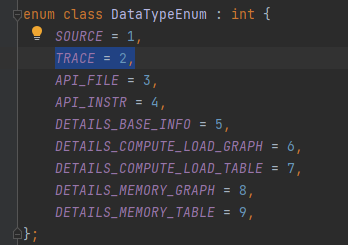

##### Data Body Format

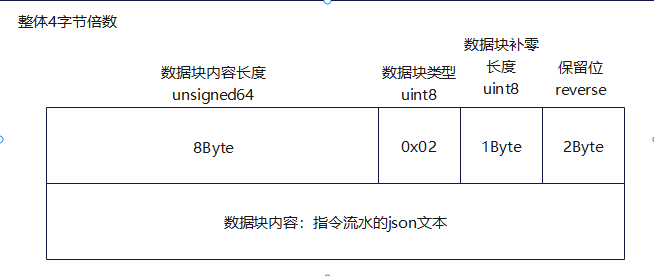

The data source is tracing.json, which complies with the Trace Event Format requirements. Refer to the following example:

```json
{"profilingType": "op",
    "displayTimeUnit": "ns",
    "schemaVersion": 1,
    "traceEvents": [
  {
   "args": {
                "code": "/home/xxx/workspace/samples/operator/AddCustom/kernel.cpp:23",
                "detail": "x[1]=0x0,imme16:0x4000",
                "pc_addr": "0x10cfa004"
            },
            "cname": "process_block0",
            "dur": 20,
            "name": "block0",
            "ph": "X",
            "pid": "process_name",
            "tid": "process_block0",
            "ts": 1
        },
        {
   "args": {
                "code": "/home/xxx/workspace/samples/operator/AddCustom/kernel.cpp:23",
                "detail": "x[1]=0x0,imme16:0x4000",
                "pc_addr": "0x10cfa004"
            },
            "cname": "prepare",
            "dur": 5,
            "name": "hccl::prepare",
            "ph": "X",
            "pid": "process_name",
            "tid": "process_block0",
            "ts": 2
        },
  {
   "args": {
                "code": "/home/xxx/workspace/samples/operator/AddCustom/kernel.cpp:23",
                "detail": "x[1]=0x0,imme16:0x4000",
                "pc_addr": "0x10cfa004"
            },
            "cname": "prepare",
            "dur": 5,
            "name": "hccl::wait",
            "ph": "X",
            "pid": "process_name",
            "tid": "process_block0",
            "ts": 10
        }
    ]
}

```

## Hotspot Instruction View

This document describes the structure and content of the relevant data body in the binary file.

### Data Types

If the 9th byte of the data block is an integer 1, 3, or 4, it indicates that the data body content is information related to the hotspot instruction view.
Definition in the code:


Data Type Table

| Type | Name | Data Content |
| --- | --- | --- |
| 0x01 | SOURCE | Operator source code, i.e., the content of the cpp file |
| 0x03 | API_FILE | Source code line information, i.e., the files section of api.json |
| 0x04 | API_INSTR | Instruction line information, i.e., the instructions section of api.json |

### Data Body Format

#### SOURCE

Binary Structure Description:
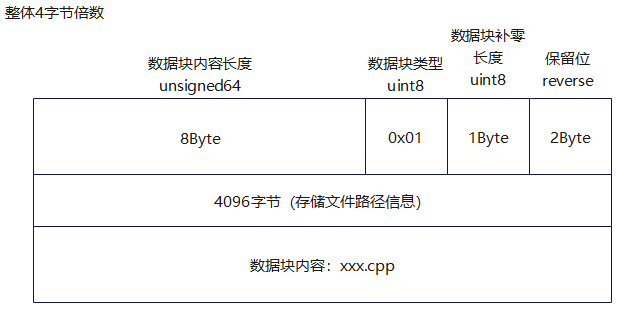
4096-byte additional data block (stores file path information):

```text
/home/matmul_leakyrelu_custom.cpp
```

Data Block Content Description (i.e., cpp source code content):

```text
#include "kernel_operator.h"\n#include "lib/matmul_intf.h"\n\nusing namespace ...
```

#### API_FILE

Binary Structure Description:


Data Block Content Description (i.e., the files section in api.json):

```json
{
  "Cores": [ // Compute cores that execute operators, e.g., "core0.cubecore0", "core0.veccore0".
    string
  ],
  "Files Dtype": { // Specify column names and data types.
// Key-value pairs in the Files Dtype->Lines object, used to specify the key names and value types of each key-value pair in the subsequent Files->Lines array.
// skip 0 (indicates that the column does not need to be displayed on the UI, i.e., it will not appear on the interface), int 1, float 2, string 3
// Data fields that are not collected do not need to be declared here.
// Currently supported dynamically parsed key-value pairs must have values that are single values or one-dimensional arrays. Two-dimensional arrays such as Address Range are not supported for dynamic parsing and require separate conventions.
        "Lines": {
            "Address Range": 0,
            "Cycles": 1,
            "Instructions Executed": 1,
            "Line": 1,
            "L2Cache Hit Rate": 3
    }
  },
  "Files": [ // Code line information in the source code file.
    {
      "Lines": [ // Instruction address range, clock cycles consumed, and total number of instructions executed associated with the code line
        {
          "Address Range": [ // Instruction address range associated with the current code line
            [
              string
            ]
          ],
          "Cycles": [ // Total clock cycles consumed by the current code line on each compute core (the array order in the code example must be consistent with the order of the `Cores` field; the specific meaning is subject to the agreement between the data producer and the parser.)
            int
          ],
          "Instructions Executed": [ // Total number of instructions executed by the current code line on each compute core (the array order in the code example must be consistent with the order of the `Cores` field; the specific meaning is subject to the agreement between the data producer and the parser.)
            int
          ],
          "Line": 100 // Code line number
        }
      ],
      "Source": string // Source code file path
    }
  ]
}
```

#### API_INSTR

Binary Structure Description:

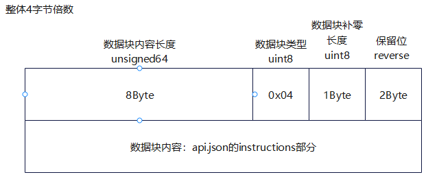
Data Block Content Description (i.e., the Instructions section in api.json):

```json
{
  "Cores": [ // Compute cores that execute the operator, e.g., "core0.cubecore0", "core0.veccore0"
    string
  ],
"Instructions Dtype": { // Specify column names and data types.
// Key-value pairs in the Instructions Dtype->Instructions object, used to specify the key names and value types of each key-value pair in each object within the Instructions array.
// skip 0 (indicates that this column is not displayed on the UI), int 1, float 2, string 3.
// Data fields that are not collected do not need to be declared here.
// Currently supported dynamically parsed key-value pairs. The value must be a single value or a one-dimensional array. Multi-dimensional arrays and the like are not supported for dynamic parsing and require separate conventions.
    "Instructions": {
        "Address": 3,
        "AscendC Inner Code": 3,
        "Cycles": 1,
        "Instructions Executed": 1,
        "Pipe": 3,
        "TheoreticalStallCycles": 1,
        "Source": 3,
        "RealStallCycles": 1,
        "L2Cache Hit Rate": 3
     }
},
  "Instructions": [
    {
      "Address": string,    // Offset address of the instruction, e.g., "0x1269f000".
      "AscendC Inner Code": string, // Source code file path and line number, e.g., "/home/xxx.cpp:23"
      "Cycles": [      // Clock cycles consumed by the instruction on each compute core
        int
      ],
      "Instructions Executed": [  // Number of times the instruction is executed on each compute core
        int
      ],
      "Pipe": string,     // Instruction queue to which the instruction belongs, e.g., "SCALAR"
      "TheoreticalStallCycles": [                    // Expected stall cycles
        int
      ],
      "Source": string,     // Instruction content, e.g. "MOV_XD_IMM XD:X29,IMM"
      "RealStallCycles": [                    // Actual stall cycles
        int
      ]
    }
  ]
}
```

## Hotspot Instruction Interface Documentation

### Interface List Overview

| Interface Command | Function | Type | Remarks |
| --- | --- | --- | --- |
| source/code/file | Get operator source code text | WebSocket request | Query by sourceName |
| source/api/line | Get instruction information associated with source code lines | WebSocket request | Query by source code file and core |
| source/api/instructions | Get instruction information | WebSocket request | params is empty in the example request; refer to the source code for specific parameters |

### Detailed Interface Definition

#### source/code/file

##### Request

```json
{
  "id": 4772,
  "moduleName": "source",
  "type": "request",
  "command": "source/code/file",
  "params": {
    "sourceName": "/home/xxx.cpp"
  }
}
```

##### Response

```json
{
  "type": "response",
  "id": 11928,
  "requestId": 4772,
  "result": true,
  "command": "source/code/file",
  "moduleName": "source",
  "body": {
    "fileContent": "#include \"kernel_operator.h\"\n#include \"lib/matmul_intf.h\"\n\nusing namespace AscendC;\nusing namespace matmul; ..."
  }
}
```

#### source/api/line

##### Request

```json
{
  "id": 4776,
  "moduleName": "source",
  "type": "request",
  "command": "source/api/line",
  "params": {
    "sourceName": "xxx.cpp",
    "coreName": "core0.cubecore0"
  }
}
```

##### Response

```json
{
  "type": "response",
  "id": 11929,
  "requestId": 4773,
  "result": true,
  "command": "source/api/line",
  "moduleName": "source",
  "body": {
    "lines": [
      {
        "Line": 0,
        "Instructions Executed": 15,
        "Cycles": 15,
        "Address Range": [
          [
            "0x1269fe78",
            "0x1269feb0"
          ]
        ]
      }
    ]
  }
}
```

#### source/api/instructions

##### Request

```json
{
  "id": 4777,
  "moduleName": "source",
  "type": "request",
  "command": "source/api/instructions",
  "params": {
  }
}
```

##### Response

```json
{
  "type": "response",
  "id": 11927,
  "requestId": 4771,
  "result": true,
  "command": "source/api/instructions",
  "moduleName": "source",
  "body": {
    "instructions": "{\"Cores\":[\"core0.cubecore0\",\"core0.veccore0\"...]}"
  }
}
```

## Memory Load View Interface Documentation

### Interface List Overview

| Interface Command | Function | Type |
| --- | --- | --- |
| source/details/baseInfo | Get operator basic information | WebSocket request |
| source/details/computeworkload | Get compute load chart and table data | WebSocket request |
| source/details/memoryGraph | Get memory access heatmap | WebSocket request |
| source/details/memoryTable | Get memory access table | WebSocket request |

### Get Operator Basic Information

#### Request

```json
{
    "id": 281,
    "moduleName": "source",
    "type": "request",
    "command": "source/details/baseInfo",
    "params": {
    }
}
```

#### Response

```json
{
    "type": "response",
    "id": 603,
    "requestId": 285,
    "result": true,
    "command": "source/details/baseInfo",
    "moduleName": "source",
    "body": {
        "name": "sin_custom",
        "soc": "xxxx",
        "opType": "vector",
        "blockDim": "32",
        "mixBlockDim": "-1",
        "duration": "13.15999984741211",
        "blockDetail": {
            "headerName": [
                "Block ID",
                "Core Type",
                "Duration (μs)"
            ],
            "size": [
                "33",
                "3"
            ],
            "row": [
                {
                    "value": [
                        "0",
                        "vector",
                        "5.480606"
                    ]
                }
            ]
        },
        "advice": []
    }
}
```

### source/details/computeworkload

#### Request

```json
{
    "id": 286,
    "moduleName": "source",
    "type": "request",
    "command": "source/details/computeworkload",
    "params": {
    }
}
```

#### Response

```json
{
    "type": "response",
    "id": 604,
    "requestId": 286,
    "result": true,
    "command": "source/details/computeworkload",
    "moduleName": "source",
    "body": {
        "blockIdList": [
            "31"
        ],
        "chartData": {
            "detailDataList": [
                {
                    "blockId": "0",
                    "blockType": "vector0",
                    "name": "ALL_ACTIVE",
                    "unit": "PRE",
                    "value": "73.6",
                    "originValue": "6656.0"
                }
            ],
            "advice": []
        },
        "tableData": {
            "detailDataList": [
                {
                    "blockId": "0",
                    "blockType": "vector0",
                    "name": "ALL_ACTIVE",
                    "unit": "Instructions",
                    "value": "3606.0"
                }
            ],
            "advice": []
        }
    }
}
```

### source/details/memoryGraph

#### Request

```json
{
    "id": 287,
    "moduleName": "source",
    "type": "request",
    "command": "source/details/memoryGraph",
    "params": {
        "blockId": "0",
        "showAs": "request"
    }
}
```

#### Response

```json
{
    "type": "response",
    "id": 605,
    "requestId": 287,
    "result": true,
    "command": "source/details/memoryGraph",
    "moduleName": "source",
    "body": {
        "coreMemory": [
            {
                "advice": [],
                "blockId": "0",
                "l2Cache": {
                    "hitRatio": "16.88311767578125",
                    "hit": "13",
                    "totalRequest": "77",
                    "miss": "64"
                },
                "blockType": "vector",
                "chipType": "xxxx",
                "memoryUnit": [
                    {
                        "request": 257,
                        "display": true,
                        "peakRatio": "4.737319",
                        "bandwidth": "3.637730836868286",
                        "memoryPath": "12"
                    }
                ],
                "vector": {
                    "cycle": "6656",
                    "totalCycles": "9043",
                    "ratio": ""
                },
                "vector1": {
                    "cycle": "",
                    "totalCycles": "",
                    "ratio": ""
                },
                "cube": {
                    "cycle": "",
                    "totalCycles": "",
                    "ratio": ""
                }
            }
        ]
    }
}
```

### source/details/memoryTable

#### Request

```json
{
    "id": 288,
    "moduleName": "source",
    "type": "request",
    "command": "source/details/memoryTable",
    "params": {
        "blockId": "0",
        "showAs": "request"
    }
}
```

#### Response

```json
{
    "type": "response",
    "id": 606,
    "requestId": 288,
    "result": true,
    "command": "source/details/memoryTable",
    "moduleName": "source",
    "body": {
        "memoryTable": [
            {
                "advice": [],
                "blockId": "0",
                "tableOpType": "vector",
                "tableDetail": [
                    {
                        "headerName": [
                            "",
                            "hit",
                            "miss",
                            "total",
                            "hit rate(%)"
                        ],
                        "tableName": "Cache",
                        "size": [
                            "4",
                            "4"
                        ],
                        "row": [
                            {
                                "name": "L2 Cache Write",
                                "value": [
                                    "13",
                                    "64",
                                    "77",
                                    "16.883118"
                                ]
                            }
                        ]
                    }
                ]
            }
        ]
    }
}

```

## Memory View Data Structure Description

### Data Format in the Input Bin File

#### Data Type

If the 9th byte of the data block is an integer from 5 to 9, it indicates that the data body content is memory access load information.
Definition in the code:


Data Type Table

| Data Type | Name | Data Content |
| --- | --- | --- |
| 0x05 | DETAILS_BASE_INFO | Operator basic information |
| 0x06 | DETAILS_COMPUTE_LOAD_GRAPH | Compute Load Chart |
| 0x07 |  DETAILS_COMPUTE_LOAD_TABLE | Compute Load Chart |
| 0x08 | DETAILS_MEMORY_GRAPH | Memory Access Heatmap |
| 0x09 | DETAILS_MEMORY_TABLE | Memory access table |

#### Data Body Format

The data source is tracing.json, which must comply with the Trace Event Format requirements. Refer to the following example:

##### DETAILS_BASE_INFO

Binary Structure Description:

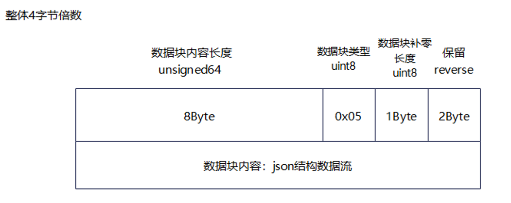

JSON Format Description:

```json
{
    "name": str,            // Operator Name
    "soc": str,             // Operator runtime platform
    "op_type": enum,        // Operator type: aic, aiv, mix
    "block_dim": uint16,    // block dim data
    "mix_block_dim": uint16,// Number of slave cores in mix operator
    "duration": float32,    // Total operator duration
    "device_id": uint16,    // device ID
    "pid": str,                    // Process ID
    "block_detail": [       // Valid when op_type == aic/aiv.
        {
            "block_id": uint16,     // Sub block index
            "core_type": enum,      //Sub block type: aic, aiv
            "duration": float32,    // Sub block duration.
        }
    ],
    "mix_block_detail": [ // Valid when op_type == mix.
        {
            "block_id": uint16,  // Block sequence number.
            "duration": [float32, float32, float32], //Sub block duration, representing in order: aic, aiv0, aiv1.
        }
    ],
    "advice": [ // Advice, currently empty, reserved.
        string, string, ...
    ]
}
```

**Note: Only one of the block_detail and mix_block_detail fields is valid. Both block_detail and mix_block_detail are lists containing 0 to N dict/map entries.**

##### DETAILS_COMPUTE_LOAD_GRAPH

Binary Structure Description:


JSON Structure Description:

```json
{
    "subblock_detail": [
        {
            "block_id": uint8,      // block ID, i.e., the main core sequence number
            "block_type": enum,     // sub block type: aic, aiv, aiv0, aiv1
            "data_detail": {
                "name": string,     // Compute load data name
                "unit": enum,       // Data unit: %
                "value": float32,    // Value
            },
           "advice": string
        }
    ],
    "advice": [ // Suggestion, currently empty, reserved
        string, string, ...
    ]
}

```

##### DETAILS_COMPUTE_LOAD_TABLE

Binary Structure Description:


JSON Structure Description:

```json
{
    "subblock_detail": [
        {
            "block_id": uint8,      // block ID, i.e., the primary core index.
            "block_type": enum,     // sub block type: aic, aiv, aiv0, aiv1
            "data_detail": {
                "name": string,     // compute load data name
                "unit": enum,       // data unit: us, instructions, data volume (Byte)
                "value": float32,   // value
            },
            "advice": string
        }
    ],
    "advice": [ // advice, currently empty, reserved
        string, string, ...
    ]
}
```

##### DETAILS_MEMORY_GRAPH

Binary structure description:


JSON structure description

```json
{
    "core_memory_map": [
        {
            "core_no": uint16,      // Block sequence number
            "core_type": enum,      // Block type: aic, aiv, mix
            "memory_unit": [        // Path list
                {
                    "memory_path": enum,        // Transfer path name
                    "request": uint64,          // Number of requests
                    "request_per_byte": uint8,  // Data volume per request
                    "bandwidth": float32,       // Bandwidth
                    "peak_ratio": float32,         // Peak bandwidth ratio: -1 indicates invalid data.
                    "display": bool,            // Whether to display this path
                }
            ],
            "L2cache": [
                "hit": uint64,              // Number of cache hits
                "miss": uint64,             // Number of cache misses
                "total_request": uint64,    // Total number of cache requests.
                "hit_ratio": int8,          // Hit ratio: -1 indicates invalid data.
            ],
            "advice": [ // Recommendations
                string, string, ...
            ]
        }
    ]
}
```

##### DETAILS_MEMORY_TABLE

Binary structure description:


JSON structure description:

```json
{
    "table_per_block": [
        {
            "block_id": uint,       // block id
            "table_op_type": enum,  // Table data type: aic, aiv, mix.
            "table_detail": [
                {
                    "table_name": string,   // Table name
                    "size": [uint8, uint8], // Table size: [rows, columns]
                    "header_name": [        // Column names (consistent with column count)
                        string, string, ...
                    ],
                    "row": [                // Row data (consistent with row count)
                        "name": string,     // Row name
                        "value": [          // Row data: length equals number of columns minus 1
                            float16, float16, ...
                        ]
                    ],
                }
            ],
            "advice": [ // Advice
                string, string, ...
             ]
        },
    ],

    "advice": [ // Advice, currently empty, reserved
        string, string, ...
    ]
}
```

## Memory Read/Write Timing Diagram Data Structure (POC)

The content format of the unified binary deliverable is as follows:


File protocol header structure design:

```C++
struct BinaryBlockHeader {
    uint64_t contentSize = 0;
    uint8_t type = 0;
    uint8_t padding = 0;
    uint16_t reverse = 0x5a5a;
};
```

Memory read/write timing diagrams are constructed based on the memory read/write sequence information output by the msTraceKit tool.
Memory read/write record struct design

```C++
struct TraceRecord {
    uint8_t type;
    int8_t coreId;
    int8_t space;
    uint8_t blockType;
    uint32_t recordId;
    uint64_t addr;
    uint64_t memSize;
    uint64_t pc;
};

```

TraceRecord struct field description:

| Name       | Description                                                                 |
|------------|----------------------------------------------------------------------|
| type       | Memory event type:<br>- MALLOC=0<br>- FREE=1<br>- MEMCPY_BLOCKS=2<br>- LOAD=3<br>- STORE=4 |
| coreId     | Core ID where this memory event occurs                                               |
| space      | Address space type of the memory operated by this memory event:<br>- PRIVATE=0<br>- GM=1<br>- L1=2<br>- L0A=3<br>- L0B=4<br>- L0C=5<br>- UB=6 |
| blockType  | Block type where this memory event occurs:<br>- AIV=0<br>- AIC=1                  |
| recordId   | Sequence number of this memory event                                                    |
| addr       | Memory address operated by this memory event                                            |
| memSize    | Memory length operated by this memory event, in units as recorded by the data producer                                        |
| pc         | PC address corresponding to the code location where this memory event occurs                                  |

The Call Stack Information Mapping Table (CallStack map) is designed as a JSON object. The field types and descriptions are as follows:

| Field       | Type   | Description                                                                 |
|------------|--------|----------------------------------------------------------------------|
| `<root>`   | Object | JSON object of memory read/write record information                                             |
| +`<PcAddr>` | Object | For ease of query, the PC address is used as the key, and the corresponding call stack information is represented by an Object             |
| ++`Address` | String | PC Address Corresponding to Call Stack                                                   |
| ++`ModuleName` | String | Compilation unit name corresponding to the call stack                                            |
| ++`Symbol` | Array  | Array of symbol relationship calls involved in the call stack                                         |
| +++`<Symbol>` | Object | Each symbol information is represented by an Object                                        |
| ++++`Column` | Int   | Column number of the call stack symbol in the code                                              |
| ++++`Line`   | Int   | Line number of the call stack symbol in the code                                              |
| ++++`FileName` | String | Code file name where the call stack symbol is located                                          |
| ++++`FunctionName` | String | Function name where the call stack symbol is located                                           |

An example of the Call Stack Information Mapping Table is as follows:

```json
[
{
    "Address": "0x4004be",
    "ModuleName": "inlined.elf",
    "Symbol": [
      {
        "Column": 18,
        "Discriminator": 0,
        "FileName": "/tmp/test.cpp",
        "FunctionName": "baz()",
        "Line": 11,
        "StartAddress": "0x4004be",
        "StartFileName": "/tmp/test.cpp",
        "StartLine": 9
      },
      {
        "Column": 0,
        "Discriminator": 0,
        "FileName": "/tmp/test.cpp",
        "FunctionName": "main",
        "Line": 15,
        "StartAddress": "0x4004be",
        "StartFileName": "/tmp/test.cpp",
        "StartLine": 14
      }
    ]
  }
]
```

## Cache Hit Rate Chart Data Structure (POC)

Binary bin file data block structure:
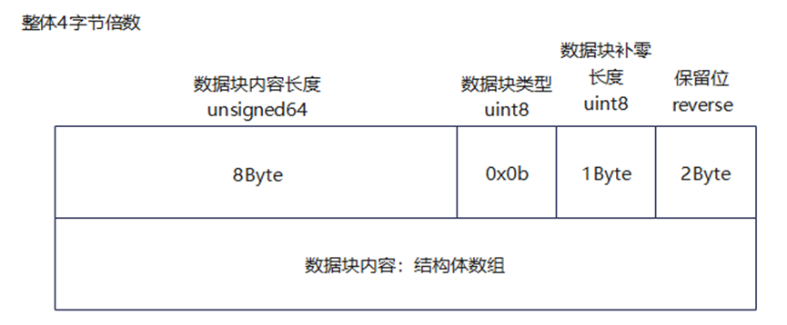

Cache information record struct design:

```cpp
struct CacheRecord {
    uint32_t loadCount{0};
    uint32_t storeCount{0};
    uint32_t cacheLineId{0};
    uint32_t hit{0};
    uint32_t miss{0};
    uint32_t allocate{0};
    uint32_t evictAndWrite{0};
    uint32_t evictWithoutWrite{0};
};
```

Field description:

| Name | Description |
|------------------|----------------------------------------------------------------------|
| loadCount | Total number of read events that occurred on the current cache set |
| storeCount | Total number of write events that occurred on the current cache set |
| hit | Total number of times the current cache set was hit |
| miss | Total number of times the current cache set was missed |
| allocate | Total number of allocations caused by misses on the current cache set |
| evictAndWrite | Total number of times a cacheline was evicted from the current cache set and written back to L2 |
| evictWithoutWrite | Total number of times a cacheline was evicted from the current cache set without write-back |

Hit rate calculation formula: count of each dimension / (loadCount + storeCount)
