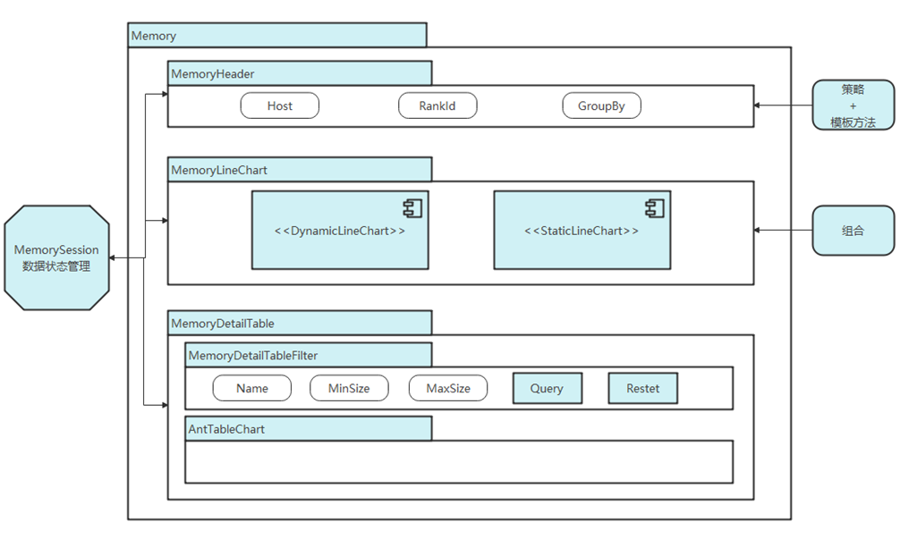
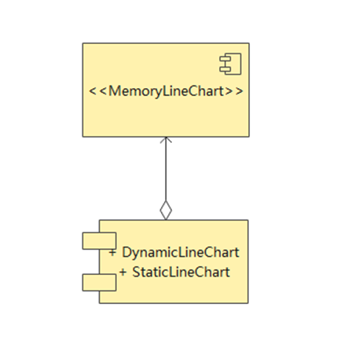

# Memory Module Design Document

<!-- md-trans-meta sourceCommit=63323a8f22b6b37afd86f8821f5e7972ffe625b0 translatedAt=2026-08-12T11:38:36.251Z pushedAt=2026-08-12T11:57:31.075Z -->

## 1. Document Objectives and Scope

This document describes the data flow, main views, data sources, and query capabilities of the Memory page frontend and backend, intended for developers who need to maintain memory tuning, comparison, and filtering capabilities.

- Both TEXT and DB data scenarios are supported.

- Dynamic graph, static graph, and component-level views are supported.

- The screenshots in this document are for illustration only. The key data sources and handlers are subject to the main text and source code.

## 2. Memory Frontend Logic

The Memory interface consists of three main parts: View Selection, line chart, and table.

- View Selection: Select `rankId` and grouping mode; in the DB scenario, `hostName` can also be selected.

- Line chart: Displays the trend of memory changes over time. The number of charts differs between dynamic graphs and static graphs, but they use the same data organization approach.

- Table: Displays the detailed data corresponding to CSV/DB, supporting filtering by conditions such as name and size. The Component View does not support queries.

Related interface illustration:

**Main Optimization Ideas for the Memory Interface**

**Main Architecture of the Memory Interface**

**Specific Implementation of the Memory Interface Header**

**Specific Implementation of the Memory Interface Line Chart**

**Specific Implementation of the Bottom Table in the Memory Interface**

## 3. Memory Interface Backend Code Logic

### 3.1 File Parsing

The file parsing entry point of MindStudio Insight is `ImportActionHandler`. Different data formats invoke different parsers:

- TEXT: `Memory::MemoryParse::Instance().Parse()`

- DB: `FullDb::FullDbParser::Instance().Parse()`

**TEXT File Parsing Sequence Diagram**

After TEXT format parsing, the data is written to the database; DB format parsing remains largely unchanged.

### 3.2 Data Query

After a query request is initiated from the frontend, the result is returned through the backend handler and database layers:

**Data Query Sequence Diagram**

- `server/src/modules/memory/protocol`: Responsible for converting between JSON and request/response structs.

- `server/src/modules/memory/database`: Responsible for querying `TextMemoryDataBase` and `DbMemoryDataBase`.

- `server/src/modules/memory/handler`: Responsible for specific business query and comparison logic.

The handlers that can be confirmed as supported in the current document include:

- `QueryMemoryOperatorHandler`: dynamic graph table

- `QueryMemoryStaticOperatorListHandler`: static graph table

- `QueryMemoryViewHandler`: dynamic graph line chart

- `QueryMemoryStaticOperatorGraphHandler`: static graph line chart

- `QueryMemoryComponentHandler`: component-level table

### 3.3 Notes

`TinyMock` serves only as a supplement to the internal interface inspection tool and should not be treated as the sole source of documentation. If specific request fields need to be supplemented, the protocol definitions and test samples in the source code should be used as the primary reference.

## 4. Business Process

**Memory Business Process Flowchart**

### 4.1 View Selection

In the View Selection section, you can select `rankId` and a grouping method from the dropdown list; for DB-format data, you can also select `hostName`. The combination of `hostName` and `rankId` can locate a single card.

The grouping methods include:

- Global

- Stream

- Component

### 4.2 Data Sources

- Dynamic graph: The line chart is sourced from `memory_record.csv`, and the table is sourced from `operator_memory.csv`.

- Static graph: The line chart is sourced from `memory_record.csv` and `static_op_mem.csv`, and the table is sourced from `static_op_mem.csv`.

- Component View: The line chart is sourced from `memory_record.csv`, and the table is sourced from `npu_module_mem.csv`.

### 4.3 Line Chart

The legend is represented by `std::vector<std::string> legends`, and the lines are represented by `std::vector<std::vector<std::string>> lines`. `lines[index]` corresponds to the complete data at a single horizontal axis position, and the order corresponds one-to-one with `legends`.

### 4.4 Table and Filtering

The table supports:

- Fuzzy name query

- Size upper and lower bound filtering

- Time range selection linkage

- Sorting

After box selection on the dynamic graph, the time range is displayed; for the static graph, the corresponding node index range is displayed. When "Only show allocated or released within the selected interval" is checked, only operators related to allocation or release within the selected interval are displayed.

### 4.5 Comparison Function

The comparison function screenshots in the document are retained for reference:

The specific comparison algorithms, field semantics, and exception handling are subject to the source code and tests of `QueryMemory*Handler`.

## 5. Verification Method

- Import TEXT and DB data, and check whether View Selection, line charts, and tables are available.

- Verify whether the name, size, box selection, sorting, and comparison functions meet expectations.

- Verify whether the dynamic graph, static graph, and Component View use the corresponding data sources.

- For newly added fields or filter items, update the parser / database / handler first, and then synchronize the frontend column configuration and text.
