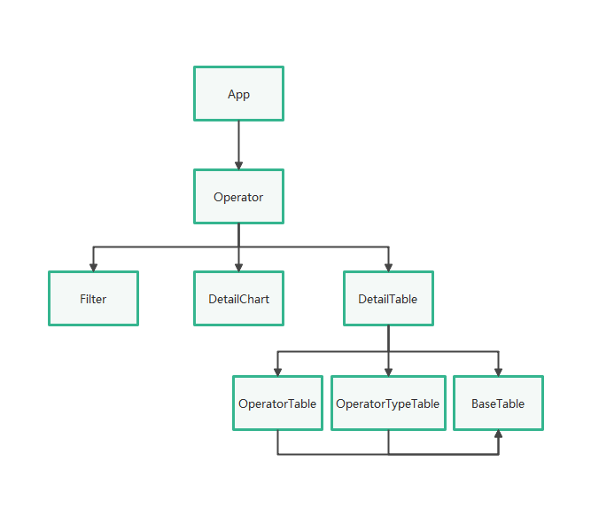
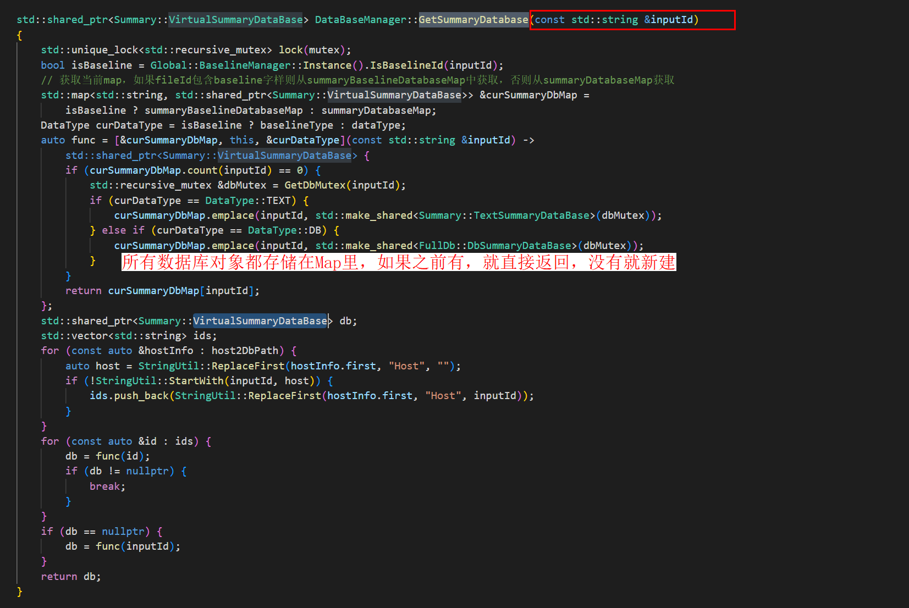

# Operator Design Document

<!-- md-trans-meta sourceCommit=63323a8f22b6b37afd86f8821f5e7972ffe625b0 translatedAt=2026-08-12T11:39:41.255Z pushedAt=2026-08-12T11:57:31.080Z -->

## 1. Document Objectives and Scope

This document describes the request chain between the frontend and backend of the Operator page, data query scenarios, and table display logic, targeting developers who need to maintain operator details, filtering, and comparison capabilities.

- Supports both TEXT and DB data scenarios.

- The page consists of filter criteria, a pie chart, and a detail table.

## 2. Operator Page Frontend Code Logic

The Operator page frontend is mainly divided into three parts: filter conditions at the top, a pie chart in the middle, and a detail table at the bottom.

Corresponding code blocks:

- `Filter.tsx`

- `DetailChart.tsx`

- `DetailTable.tsx`

- `BaseTable`

Other code that requires attention:

- `modules/operator/src/connection/handler.ts`

- `modules/operator/src/components/RequestUtils.ts`

- `modules/operator/src/components/TableColumnConfig.tsx`

Related interface illustration:

**Operator Interface**


**Main Logic Structure Diagram**



## 3. Operator Page Backend Code Logic

Taking `QueryOpDetailInfoHandler` as an example, the processing chain for operator detail requests is as follows:

1. The frontend sends an `operator/details` request.

2. `ProtocolDefs.h` defines `REQ_RES_OPERATOR_DETAIL_INFO = "operator/details"`.

3. `OperatorModule.cpp` registers and dispatches the request to the corresponding handler based on the request string.

4. `QueryOpDetailInfoHandler` is responsible for querying the database and assembling the results.

5. `OperatorProtocol.cpp` is responsible for converting request/response structures to and from JSON.

6. After the response is returned to the frontend, the Detail Table and Pie Chart are refreshed based on the response data.

**QueryOpDetailInfoHandler Processing Logic**


**Query the database to obtain parameters.**


### 3.1 Prerequisites (Supporting Component Functionality)

The only supporting component that can be confirmed in this document is the database management entry:

```c++
auto database = Timeline::DataBaseManager::Instance().GetSummaryDatabase(rankId);
```

**Database Management**



The complete description of `KernelParser`, `dbManager`, and the full DB structure is subject to the source code; if confirmed later, it can be supplemented here.

### 3.2 TEXT and DB Database

#### TEXT Scenario

When `type=TEXT`, data is stored in `kernelTable`, and queries can typically be completed directly via SQL.

**TEXT Scenario Illustration**


`pmuColumnNames` serves as the table header when querying operator detail information, primarily carrying register-related information.

#### DB Scenario

When `type=DB`, a multi-table join query is required.

**DB Scenario Illustration**


### 3.3 Return Data

The return data is converted to JSON on the backend before being sent back to the frontend.

**Convert Return Data to JSON and Send to Frontend**


## 4. Development and Verification Suggestions

### 4.1 When Adding an Interface or Filter Option

- First, confirm whether the data source is TEXT or DB.

- First, add the query logic on the backend, then add the protocol response fields.

- Synchronously update the table column configuration and i18n text on the frontend.

- If sorting, pagination, or comparison is involved, add corresponding tests synchronously.

### 4.2 Verification Methods

- Import operator tuning data and check whether the filter conditions, pie chart, and detail table display normally.

- Verify whether the detail query results in TEXT and DB scenarios are consistent.

- Verify whether the field names remain consistent between the frontend and backend when adding new columns or filter items.
