# Timeline Design Document

<!-- md-trans-meta sourceCommit=49122e1f1d6621e5b8a8bbc1c0fdae9583659f48 translatedAt=2026-08-12T11:43:09.895Z pushedAt=2026-08-12T11:57:31.113Z -->

## 1. Concept Description

In the Ascend heterogeneous computing architecture, the MindStudio Insight tool presents the detailed runtime conditions on the host and device sides during training/inference on a time axis in the form of a Timeline, intuitively displaying the API time consumption on the host side and the task time consumption on the device side, and correlating the host and device for presentation, helping users quickly identify host bottlenecks or device bottlenecks, while also providing various filtering and classification functions, expert suggestions, and other capabilities to support users in performing deep tuning.

**Basic Concepts:**

1. Unit: Represents a device, process, thread, task flow, etc.

    1. CardUnit

        1. ProcessUnit and LabelUnit (the main difference lies in whether preview information is available)

            1. ThreadUnit and CounterUnit (the smallest units, corresponding to the two data display modes of the Timeline respectively)

2. Slice: represents an action, event, operator, etc.

   

3. Data Scenario: the data on the Timeline page can come from two scenarios.

    1. TEXT scenario: refers to the data source being a `json` file in `Google Trace Format`.

    2. DB scenario: refers to the data source being the `ascend_profiler_output.db` file collected and parsed by the msprof tool.

    The data structures of the two scenarios differ, so the backend has two separate sets of logic to process each type of data.

## II. Interface Introduction

The Timeline interface consists of four parts: the toolbar (Area 1), the timeline tree diagram (Area 2), the graphical pane (Area 3), and the data pane (Area 4).


### Area 1: Toolbar

Contains common shortcut buttons, which are, from left to right: Marker List, Filter (supports filtering display by card or by unit), Search, Connection Event, Restore (page restoration), and Timeline zoom in/out buttons.

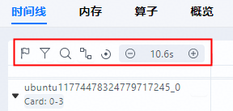

### Area 2: Timeline Tree View

> The display differs between the TEXT scenario and the DB scenario.

- TEXT scenario: Displays the hierarchical information of each "Card" in the cluster scenario, presented by the Rank dimension. The first level is the Rank ID, the second level is the process or specialized layer, and the third level is the thread or other names.

- DB scenario: Displays the information under each machine. The first level is the machine name, and the second level includes Host and "Card".

    - The Host level displays PyTorch and CANN data by the process and thread dimensions;

    - The "Card" level includes:

        - Underlying data, including:

            - Duration data and iteration trace data of each Stream task flow under Ascend Hardware

            - HCCL and Overlap Analysis communication data

            - Memory data

            - Other Ascend hardware system data

        - AI Core Freq and other levels.

  

> When a pinned unit exists, a pinned tree diagram is separated out.

### Area 3: Graphical Pane

The data displayed is intra-iteration data. The graphical pane corresponds to the timeline tree diagram, presenting the timeline graphically row by row, including the execution sequence and execution duration of upper-layer app operators, various components, and interfaces.


### Area 4: Data Pane

A display area for statistical information or operator detail information.

**Specifically includes the following tabs:**

1. Slice Detail: detailed information of a single selected operator.

2. Slice List: operator list information of the selected region in a unit row.

3. System View is the summary information of a certain type of operators.

4. Find is the information of the searched operators.


## III. Feature Details

| Serial Number | Primary Function          | Secondary Function              | Tertiary Function                       |
|:---|:--------------|:------------------|:---------------------------|
| 1  | Tile training/inference process     | Display units and slices           | /                          |
| 2  | Marker list          | Mark and save the selected area      | /                          |
| 3  | Tree diagram filtering         | Filter by card              | /                          |
| 4  |               | Filter by unit             | /                          |
| 5  | Operator search          | Graphical window selection            | /                          |
| 6  |               | Jump to data window discovery          | Same-name operator discovery                     |
| 7  |               |                   | Click to jump to graphical window selection                 |
| 8  | Display connection events        | Full display              | /                          |
| 9  |               | Graphical window single selection display        | /                          |
| 10 | Graphical window restore        | /                 | /                          |
| 11 | Graphical window zoom      | W/S key zoom          | /                          |
| 12 |               | Ctrl/Cmd + mouse wheel zoom | /                          |
| 13 | Tree diagram right-click operations       | Full screen display              | /                          |
| 14 |               | Find in communication            | /                          |
| 15 |               | Zoom to selected content            | /                          |
| 16 |               | Control zoom              | Undo zoom                       |
| 17 |               |                   | Reset zoom                       |
| 18 |               | Control pin              | Unpin (all)                  |
| 19 |               |                   | Pin (by same group)                  |
| 20 |               |                   | Unpin (by same group)                |
| 21 |               | Control hide              | Hide                         |
| 22 |               |                   | Show all hidden units                  |
| 23 |               | Show in event view          | Jump to data window event view                 |
| 24 |               | Control Python call stack       | Show Python call stack              |
| 25 |               | Control Python call stack       | Hide Python call stack              |
| 26 | Tree diagram right-click operations       | Control all sub-items            | Collapse all sub-items                     |
| 27 |               |                   | Expand all sub-items                     |
| 28 |               | Control SET/WAIT events      | Hide SET/WAIT events             |
| 29 |               |                   | Show SET/WAIT events             |
| 30 |               | Control unit height auto-fit         | Enable unit height auto-fit                  |
| 31 |               |                   | Disable unit height auto-fit                  |
| 32 |               | Restore default offset for all ranks       | /                          |
| 33 |               | Control baseline operator            | Set baseline operator                     |
| 34 |               |                   | Custom operator **align to** baseline operator time         |
| 35 |               |                   | Clear baseline operator                     |
| 36 | Tree diagram set time offset    | /                 | /                          |
| 37 | Tree diagram set pin       | /                 | /                          |
| 38 | Graphical window drag to select range and unit | View selected range and unit         | /                          |
| 39 |               | Jump to data window selection list        | /                          |
| 40 | Graphical window select Slice   | View Slice details         | /                          |
| 41 |               | Jump to data window selection details        | /                          |
| 42 | Data window system view      | Statistics system view            | View by machine name and card serial number                |
| 43 |               |                   | View comprehensive metrics                     |
| 44 |               |                   | View Python API summary           |
| 45 |               |                   | View CANN API summary             |
| 46 |               |                   | View Ascend Hardware Task summary |
| 47 |               |                   | View HCCL summary                 |
| 48 |               |                   | View coverage analysis                     |
| 49 |               |                   | View operator details                     |
| 50 |               |                   | Click to jump to specific operator in Timeline graphical window     |
| 51 | Data window system view      | Expert system view            | View by machine name and card serial number                |
| 52 |               |                   | View affinity API                   |
| 53 |               |                   | View affinity optimizer                    |
| 54 |               |                   | View AICPU operator                |
| 55 |               |                   | View ACLNN operator                |
| 56 |               |                   | View operator fusion                     |
| 57 |               |                   | Click to jump to specific operator in Timeline graphical window     |
| 58 |               | Event view              | View all operator details in unit                 |
| 59 |               |                   | Click to jump to specific operator in Timeline graphical window     |
| 60 | Data comparison          | Set baseline card             | /                          |
| 61 |               | Set comparison card             | /                          |

## 4. Development Knowledge

### 4.1 Unit Rendering Design

For details, see [link](./TrackRender.md)

### 4.2 Frontend Unit Operation Design

#### 4.2.1 Frontend Jump to Target Operator

In the frontend code, the `jumpSlice` method is called within `CategorySearchContent` under `CategorySearch.tsx`.


`jumpSlice` invokes `doJumpSlice`, and within `doJumpSlice`, only `session.locateUnit` is updated.

The frontend uses React Hooks. Here, `session.locateUnit` serves as a dependency of a certain `use*` hook in another component.

After investigation, it was found that the frontend unit-related hooks are located in the `modules\timeline\src\components\ChartContainer\Units\hooks` folder, and the jump target hook resides in `useLocate.tsx` within that folder, which is `useJumpTarget`.

`useJumpTarget` is currently only used in `Scroller`.

```ts
// Jump to the specified unit
useJumpTarget(session, unitsArea, supportJump, sortOptions, (ref as React.MutableRefObject<HTMLDivElement | null>).current);
```

The core function of `useJumpTarget`, with dependencies being `[session, dom, unitsArea, tuningScroller]`.

> Among them, `session` is too large, which easily causes the function to be regenerated, consuming significant computational resources.
>
> In fact, `session` is only used in this function for `session.units` and `session.locateUnit`, so the dependencies can be simplified to `[session.units, session.locateUnit, dom, unitsArea, tuningScroller]`.

```ts
React.useEffect(() => autorun(
    () => {
        if (dom === null || !supportJump) { return; }
        if (session.locateUnit === undefined) { return; }
        const targetUnit = getTargetUnit(getRootUnit(session.units), session.locateUnit.target);
        if (targetUnit === undefined) {
            message.warn(t('NotFoundJumpTargetWarn'));
        } else {
            handleUnitSelection(targetUnit);
            session.locateUnit?.onSuccess(targetUnit);
            const scrollHResult = getNormalUnitHeight(unitsArea, orderOptions, targetUnit);
            if (scrollHResult !== undefined) {
                // The first time scrollToResult is called with scrollHResult, it requests the backend to redraw the unit.
                scrollToResult(scrollHResult, tuningScroller);
            }
        }
        runInAction(() => {
            session.locateUnit = undefined;
        });
    },
), [session, dom, unitsArea, tuningScroller]);
```

##### 4.2.1.1 Analyze How to Adjust the Left and Right Positions of the Target Operator

<details>
<summary>Details</summary>

In the algorithm above, there is a line `session.locateUnit?.onSuccess(targetUnit);`. This `onSuccess` is obviously assigned by the `doJumpSlice` function. Now let us examine specifically how `onSuccess` in `doJumpSlice` is written.

```txt
const doJumpSlice = (session: Session, slice: SliceData, isGlobal: boolean): void => {
    if (slice === undefined) {
        // slice is undefined.
        return;
    }
    runInAction(() => {
        session.locateUnit = {
            target: (unit): boolean => {
                return unit instanceof ThreadUnit && (Boolean(unit.metadata.cardId.includes(slice.rankId))) &&
                    unit.metadata.processId === slice.pid && unit.metadata.threadId === slice.tid;
            },
            onSuccess: (unit): void => {
            ~~~~~~~~~
                if (isGlobal) {
                    session.domainRange = { domainStart: 0, domainEnd: session.endTimeAll ?? session.domain.defaultDuration };
                    session.selectedData = undefined;
                    session.linkFlow = undefined;
                } else {
                    const [rangeStart, rangeEnd] = calculateDomainRange(session,
                        slice.startTime - getTimeOffset(session, unit.metadata as ThreadMetaData), slice.duration);
                    session.domainRange = { domainStart: rangeStart, domainEnd: rangeEnd };
                    session.selectedData = {
                        startTime: slice.startTime - getTimeOffset(session, unit.metadata as ThreadMetaData),
                        duration: slice.duration,
                        depth: slice.depth,
                        threadId: slice.tid,
                        id: slice.id,
                        metaType: (unit.metadata as ThreadMetaData).metaType,
                    };
                    session.linkFlow = generateFlowParam(unit.metadata as ThreadMetaData, slice);
                }
            },
        };
    });
};
```

Here, the `isGlobal` passed into `doJumpSlice` is `false`. Ignoring that for now, let us look at the core code:

```ts
// Calculate the domain range, which obviously refers to the left and right range of the target operator.
const [rangeStart, rangeEnd] = calculateDomainRange(session,
    slice.startTime - getTimeOffset(session, unit.metadata as ThreadMetaData), slice.duration);
// Assign to session, which will handle how to update the left and right ranges to the frontend.
session.domainRange = { domainStart: rangeStart, domainEnd: rangeEnd };
// Update the selected item, which will handle how to highlight the target operator.
session.selectedData = {
    startTime: slice.startTime - getTimeOffset(session, unit.metadata as ThreadMetaData),
    duration: slice.duration,
    depth: slice.depth,
    threadId: slice.tid,
    id: slice.id,
    metaType: (unit.metadata as ThreadMetaData).metaType,
};
// Update the links, which will handle how to display the related links of the target operator.
session.linkFlow = generateFlowParam(unit.metadata as ThreadMetaData, slice);
```

###### Update the Left and Right Range

Investigation reveals that in all five canvases (`EventChart`, `FilledLineChart`, `StackedBarChart`, `StackStatusChart`, `StatusChart`), the hook `useBatchedRender` monitors changes in `datasState` (the value returned by the hook `useData` after processing `session.domainRange`) to redraw the canvas.

</details>

##### 4.2.1.2 Analyze How to Adjust the Vertical Position of the Target Operator

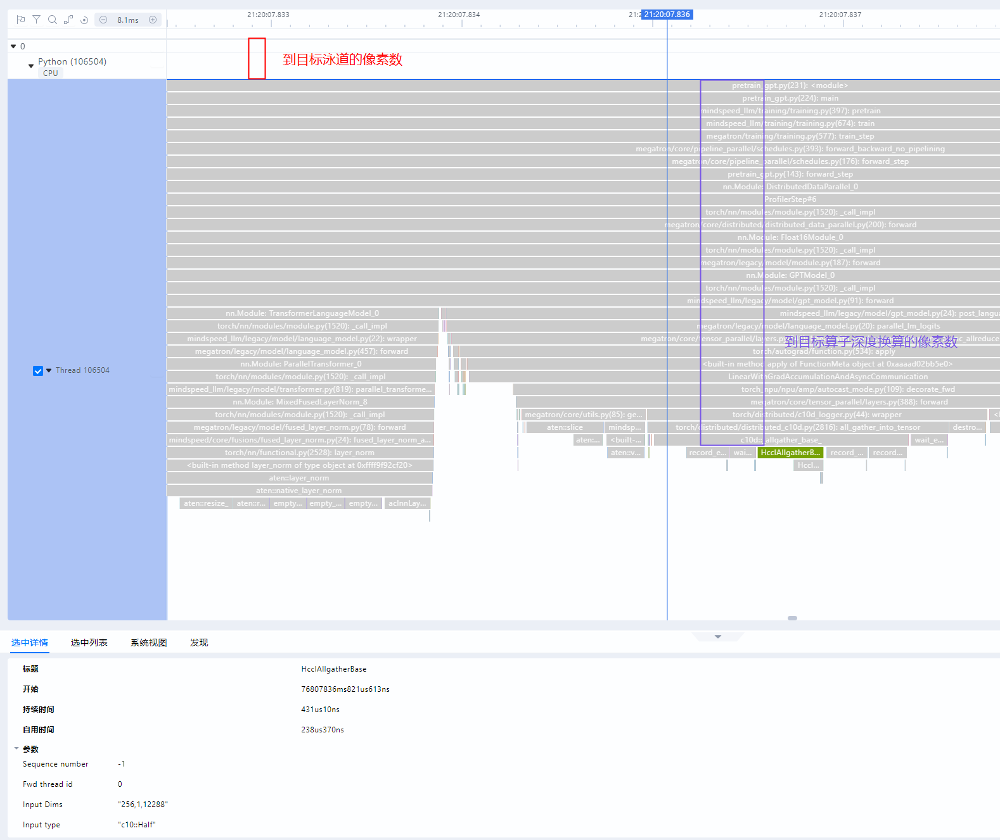

<details>
<summary>Details</summary>

The part of the core function of `useJumpTarget` that modifies the vertical position of the operator is:

```ts
// Select the target unit and open the unit.
handleUnitSelection(targetUnit);
// Process the left and right position information (not relevant to the current logic here).
session.locateUnit?.onSuccess(targetUnit);
// Calculate the pixels required to move to the top of the target unit.
const scrollHResult = getNormalUnitHeight(unitsArea, orderOptions, targetUnit);
if (scrollHResult !== undefined) {
    // The first scrollToResult scrolls to the top of the target unit, which requests the backend to redraw the unit.
    // tuningScroller waits for the unit to be redrawn and then fine-tunes the vertical position based on the depth of the operator.
    scrollToResult(scrollHResult, tuningScroller);
}
```

The `tuningScroller` function is specifically:

```ts
const tuningScroller = React.useCallback((scrolled: number): void => {
    if (dom === null || !supportJump || session.selectedData === undefined) { return; }
    // UnitHeight.STANDARD is the standard height of an expanded Slice; 1 is the interval between Slices.
    const relativeSliceY: number = Number.isInteger(session.selectedData.depth)
        ? (UnitHeight.STANDARD + 1) * Math.max(session.selectedData.depth as number - 1, 0)
        : 0;
    const halfScrollerHeight = dom.clientHeight / 2;
    const offset = Math.max(relativeSliceY - halfScrollerHeight, 0);
    scrollToResult(scrolled + offset);
}, [session, dom]);
```

</details>

### 4.3 useDraggableContainer Component Design

The useDraggableContainer component is a basic component in the Timeline.

#### 4.3.1 Parameters

| Serial Number | Name            | Type              | Description            | Remarks                                |
|:---|:--------------|:----------------|:--------------|:----------------------------------|
| 1  | dragDirection | `DragDirection` | Position of the draggable component      |                                   |
| 2  | draggableWH   | `number`        | Default width/height of the draggable component    |                                   |
| 3  | open          | `?boolean`      | Whether to open the draggable component by default   | Defaults to `false`                       |
| 4  | minWH         | `?number`       | Minimum width/height of the draggable component   | Defaults to `0`                           |
| 5  | sizeMethod    | `?SizeMethod`   | Calculation unit for the width/height of the draggable component | Defaults to percentage. Currently available only for draggable components on the right; other positions use pixels. |

```ts
enum DragDirection {
    TOP = 0,
    BOTTOM = 1,
    LEFT = 2,
    RIGHT = 3,
}

enum SizeMethod {
    NUMBER = 'number',
    PERCENT = 'percent',
}
```

##### Global Constants

```ts
const RIGHT_PERCENT = 0.99; // Indicates the maximum expandable ratio when the draggable component is on the right side.
```

#### 4.3.2 Drag Control

##### 4.3.2.1 Drag State

```ts
interface MovingState {
  stat: "idle" | "movable" | "moved";
  startX: number;
  startY: number;
  screenX: number;
  screenY: number;
}
```

###### State Description

| Serial Number | Name        | Description   |
|:---|:----------|:-----|
| 1  | `idle`    | Standby state |
| 2  | `movable` | Moving state |
| 3  | `moved`   | Moved state  |

- `startX` `startY` records the mouse position relative to the viewport when the movement starts, used to determine whether the drag behavior is valid.

- `screenX` `screenY` records the mouse position relative to the window when the movement starts, to prevent the window from being moved.

##### 4.3.2.2 mousedown

The event triggered after the mouse is pressed. The following shows the approximate source code and its interpretation:

```txt
const getHandleMouseDown = (dragDirection: DragDirection, draggable: React.RefObject<HTMLDivElement>,
    movingState: React.MutableRefObject<MovingState>, isOpen: React.MutableRefObject<boolean>) => (e: MouseEvent): void => {
    const domDrag = draggable.current; // Draggable component
    ...
    let offset;
    const baseMS: MovingState = { stat: 'movable', startX: 0, startY: 0, screenX: e.screenX, screenY: e.screenY };
    const domDragRect = domDrag.getBoundingClientRect();
    switch (dragDirection) { // dragDirection refers to the position of the draggable component
        case DragDirection.TOP: // The draggable component is at the top
            offset = domDragRect.bottom - e.clientY; // e.clientY refers to the distance of the mouse relative to the top of the viewport, and domDragRect.bottom is the distance from the bottom of the draggable component to the top of the viewport.
            if (offset <= 8 && offset > 0 && isOpen.current) {
                movingState.current = {
                    ...baseMS,
                    startX: domDragRect.x,
                    startY: domDragRect.bottom,
                };
            }
            break;
        case DragDirection.BOTTOM:
            offset = e.clientY - domDragRect.top; // e.clientY refers to the distance of the mouse relative to the viewport, and domDragRect.top is the distance from the top of the draggable component to the top of the viewport.
            if (offset <= 8 && offset > 0 && isOpen.current) {
                movingState.current = {
                    ...baseMS,
                    startX: domDragRect.x,
                    startY: domDragRect.top,
                };
            }
            break;
        case DragDirection.LEFT:
            offset = domDragRect.right - e.clientX; // e.clientX refers to the distance of the mouse relative to the left edge of the viewport, and domDragRect.right is the distance from the right edge of the draggable component to the left edge of the viewport.
            if (offset <= 8 && offset > 0 && isOpen.current) {
                movingState.current = {
                    ...baseMS,
                    startX: domDragRect.right,
                    startY: domDragRect.y,
                };
            }
            break;
        default:
            offset = e.clientX - domDragRect.left; // e.clientX refers to the distance of the mouse relative to the left edge of the viewport, and domDragRect.left is the distance from the left edge of the draggable component to the left edge of the viewport.
            if (offset <= 8 && offset > 0 && isOpen.current) {
                movingState.current = {
                    ...baseMS,
                    startX: domDragRect.left,
                    startY: domDragRect.y,
                };
            }
            break;
    }
};
```

##### 4.3.2.3 mousemove

The event triggered during mouse movement. The following is the approximate source code and interpretation:

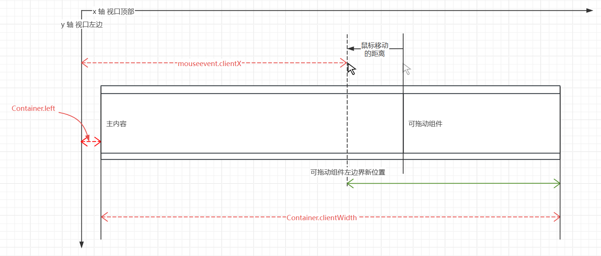

```ts
const handleMouseMove =
  (
    container: React.RefObject<HTMLDivElement>,
    draggable: React.RefObject<HTMLDivElement>,
    movingState: React.MutableRefObject<MovingState>,
    dragDirection: DragDirection,
    minDragWh: number
  ) =>
  (e: MouseEvent): void => {
    const dom = container.current; // Entire container
    const domDrag = draggable.current; // Draggable component
    const moving = movingState.current; // Drag state
    if (e.buttons !== 1) {
      // e.buttons === 1 indicates the left mouse button.
      moving.stat = "idle";
      return;
    }
    if (!dom || !domDrag) {
      return;
    }
    if (moving.stat === "idle") {
      return;
    }
    if (
      Math.abs(e.screenY - moving.screenY) < 2 &&
      Math.abs(e.screenX - moving.screenX) < 2
    ) {
      return;
    }
    let offsetY: number;
    let offsetX: number;
    const domRect = dom.getBoundingClientRect();
    switch (dragDirection) {
      case DragDirection.TOP:
        offsetY = e.y - moving.startY;
        if (Math.abs(offsetY) >= 5) {
          // Calculate the new height of the draggable component.
          // By default, the draggable component at the top is tightly attached to the viewport top, so e.y, as the mouse distance from the viewport top, exactly equals the height of the draggable component.
          // Note: This default assumption may not always hold, but it happens to be the case in the current usage.
          domDrag.style.height = `${clamp(
            e.y,
            minDragWh,
            dom.clientHeight - minDragWh
          )}px`;
        }
        break;
      case DragDirection.BOTTOM:
        offsetY = e.y - moving.startY;
        if (Math.abs(offsetY) >= 5) {
          // Calculate the new height of the draggable component.
          // By default, when the draggable component is at the bottom, it is tightly attached to the bottom of the viewport, and the entire container exactly fills the viewport height. Therefore, e.y is the distance from the mouse to the top of the viewport, dom.clientHeight is equivalent to the viewport height, and dom.clientHeight - e.y exactly equals the height of the draggable component.
          // Note: This default assumption may not always hold, but it happens to be the case in the current usage.
          domDrag.style.height = `${clamp(
            dom.clientHeight - e.y,
            minDragWh,
            dom.clientHeight - minDragWh
          )}px`;
        }
        break;
      case DragDirection.LEFT:
        offsetX = e.x - moving.startX;
        if (Math.abs(offsetX) >= 5) {
          // Calculate the new width of the draggable component.
          // Here, e.clientX is the distance from the mouse to the left edge of the viewport, domRect.left is the distance from the left edge of the entire container to the left edge of the viewport, and e.clientX - domRect.left exactly equals the width of the draggable component.
          domDrag.style.width = `${clamp(
            e.clientX - domRect.left,
            245,
            dom.clientWidth - minDragWh
          )}px`;
        }
        break;
      default:
        offsetX = e.x - moving.startX;
        if (Math.abs(offsetX) >= 5) {
          // Calculate the new width of the draggable component.
          // Here, e.clientX is the distance from the mouse to the left edge of the viewport, domRect.left is the distance from the left edge of the entire container to the left edge of the viewport, dom.clientWidth is the width of the entire container, and domRect.left + dom.clientWidth - e.clientX exactly equals the width of the draggable component.
          domDrag.style.width = `${clamp(
            domRect.left + dom.clientWidth - e.clientX,
            minDragWh,
            dom.clientWidth * RIGHT_PERCENT
          )}px`;
        }
        break;
    }
    moving.stat = "moved"; // The status is moved.
    e.preventDefault();
  };
```

##### 4.3.2.4 mouseup

The event triggered when the mouse is released. The following is the approximate source code and interpretation:

```ts
const handleMouseUp =
  ({
    container,
    draggable,
    movingState,
    dragDirection,
    minDragWh,
    sizeMethod,
  }: {
    container: React.RefObject<HTMLDivElement>,
    draggable: React.RefObject<HTMLDivElement>,
    movingState: React.MutableRefObject<MovingState>,
    dragDirection: DragDirection,
    minDragWh: number,
    sizeMethod?: SizeMethod,
  }) =>
  (e: MouseEvent): void => {
    recoverIframePointerEvent();
    const dom = container.current;
    const domDrag = draggable.current;
    const moving = movingState.current;
    const isDomInvalid =
      !dom || !domDrag || dom.clientHeight === 0 || dom.clientWidth === 0;
    if (moving.stat !== "moved" || isDomInvalid) {
      moving.stat = "idle";
      return;
    }
    const domRect = dom.getBoundingClientRect();
    let dragWHTmp: number;
    // The algorithm here is the same as that of mousemove.
    switch (dragDirection) {
      case DragDirection.TOP:
        dragWHTmp = clamp(e.y, minDragWh, dom.clientHeight - minDragWh);
        domDrag.style.height =
          sizeMethod === SizeMethod.NUMBER
            ? `${dragWHTmp}px`
            : `${(dragWHTmp / dom.clientHeight) * 100}%`;
        window.dispatchEvent(new Event("topResize"));
        break;
      case DragDirection.BOTTOM:
        dragWHTmp = clamp(
          dom.clientHeight - e.y,
          minDragWh,
          dom.clientHeight - minDragWh
        );
        domDrag.style.height =
          sizeMethod === SizeMethod.NUMBER
            ? `${dragWHTmp}px`
            : `${(dragWHTmp / dom.clientHeight) * 100}%`;
        window.dispatchEvent(new Event("bottomResize"));
        break;
      case DragDirection.LEFT:
        dragWHTmp = clamp(
          e.clientX - domRect.left,
          245,
          dom.clientWidth - minDragWh
        );
        domDrag.style.width =
          sizeMethod === SizeMethod.NUMBER
            ? `${dragWHTmp}px`
            : `${(dragWHTmp / dom.clientWidth) * 100}%`;
        window.dispatchEvent(new Event("leftResize"));
        break;
      case DragDirection.RIGHT:
        dragWHTmp = clamp(
          domRect.left + dom.clientWidth - e.clientX,
          minDragWh,
          dom.clientWidth * RIGHT_PERCENT
        );
        domDrag.style.width =
          sizeMethod === SizeMethod.NUMBER
            ? `${dragWHTmp}px`
            : `${(dragWHTmp / dom.clientWidth) * 100}%`;
        window.dispatchEvent(new Event("rightResize"));
        break;
      default:
        break;
    }
    // Restore the drag state to standby.
    movingState.current = {
      stat: "idle",
      startX: 0,
      startY: 0,
      screenY: 0,
      screenX: 0,
    };
    window.dispatchEvent(new Event("resize"));
  };
```

#### 4.3.3 Layout Characteristics and Potential Issues of the Draggable Container

The current HTML

```react
<Container>
    <div className="topC">主内容</div>
    <div className="bottomC">可拖动组件</div>
</Container>
```

In the `DragDirection.BOTTOM` and `DragDirection.RIGHT` cases, the position of the draggable component conforms to the document flow layout.

In the `DragDirection.TOP` and `DragDirection.LEFT` cases, `flex-direction: column-reverse;` and `flex-direction: row-reverse;` are used.

These two CSS properties can change the layout mode, causing the positions of the main content and the draggable component to swap, but they **do not actually change the positions of the main content and the draggable component relative to the viewport**.

Taking <code>DragDirection.LEFT</code> as an example:

> Applying <code>flex-direction: row-reverse;</code> does not change the position of child elements or the parent container relative to the viewport. That is, if the flex container is originally located at a certain position on the page (for example, 50 pixels from the top), then even if you change the arrangement order of the internal child elements, the position of this container and its content relative to the viewport remains unchanged.

Diagram:


### 4.4 Graphical Pane Event Design

Graphical pane events primarily control the user's action of selecting a rectangular area on the graphical pane by dragging a box. As shown in the figure:


#### 4.4.1 Basic Concepts

The data controlling the graphical pane is primarily stored in `session` and `ChartInteractor.ts`.

##### 4.4.1.1 session

| Serial Number | Name          | Type                       | Function       |
|:---|:--------------|:---------------------------|:-------------|
| 1  | domainRange   | `DomainRange`              | Controls the domain size of the pane.    |
| 2  | selectedRange | `[ TimeStamp, TimeStamp ]` | Controls the size of the selected interval in the pane. |

```ts
export interface DomainRange {
    domainStart: TimeStamp;
    domainEnd: TimeStamp;
}
```

##### 4.4.1.2 ChartInteractorProps

| Serial Number | Name | Type | Function |
|---:|:---------------------|:----------------------------------|:----------------------|
|  1 | domainStart | `number` | Start point of the pane |
|  2 | domainEnd | `number` | End point of the pane |
|  3 | endTimeAll | `number` | Maximum end time |
|  4 | session | `Session` | Session data of the timeline |
|  5 | interactorMouseState | `InteractorMouseState` | State of mouse-related events |
|  6 | onTimeStamp | `TimeStampCallbackFunc` | To be confirmed |
|  7 | isNsMode | `isNsMode` | Whether it is NS mode |
|  8 | splitLineRef | `React.RefObject<HTMLDivElement>` | To be confirmed |
|  9 | renderTrigger | `boolean` | Whether to render the trigger |
| 10 | selectedRange | `[ TimeStamp, TimeStamp ]` | Size of the selected range in the pane |

##### 4.4.1.3 InteractorMouseState

| Serial Number | Name       | Type                                        | Function                              |
|---:|:-----------|:-------------------------------------------|:--------------------------------------|
|  1 | clickPos   | `React.MutableRefObject<Pos \| undefined>` | Position of the first mouse click     |
|  2 | lastPos    | `React.MutableRefObject<Pos \| undefined>` | Position where the mouse last moved to |
|  3 | wheelEvent | `{ ctrlKey: boolean; deltaY: number }`     | Mouse wheel event parameters          |

#### 4.4.2 Drag Behavior

Logically, the event sequence of the drag behavior is: `Mouse Press -> Mouse Move -> Mouse Release`

In practice, however, the mouse must first be moved into the pane before pressing within the pane area. Therefore, the actual event sequence is: `Mouse Move -> Mouse Press -> Mouse Move -> Mouse Release`

##### 4.4.2.1 Mouse Press

Trigger Event: mousedown

```ts
const onMouseDown = (e: React.MouseEvent): void => {
    const disabled = !isTargetElement(e) || !chartInteractorRef.current || !interactive ||
        session.phase !== 'download' || isMouseOnScrollbar(e, scrollerRef.current);
    if (disabled) {
        interactorMouseState.lastPos.current = undefined;
        return;
    }
    const needDragOneSide = chartInteractorRef.current.mouseDownAction(interactorMouseState, e);
    if (needDragOneSide === MouseDownActionResult.NO_NEED_TO_DRAG_ONE_SIDE) {
        // Here interactorMouseState.lastPos.current has a value, because it was already assigned during onMouseMove.
        interactorMouseState.clickPos.current = interactorMouseState.lastPos.current;
    }
};
```

##### 4.4.2.2 Mouse Move

Trigger Event: mousemove

```ts
const onMouseMove = (e: React.MouseEvent): void => {
    if (!chartInteractorRef.current) {
        return;
    }
    chartInteractorRef.current.mouseMoveAction(interactorMouseState, e);
    // Calculate the relative position x, y, which refers to the position relative to the top-left corner of the pane.
    const rect = e.currentTarget.getBoundingClientRect();
    const offsetX = e.nativeEvent.x - rect.left - LANE_INFO_WIDTH_PX.value;
    const offsetY = e.nativeEvent.y - rect.top;
    // The following assigns a value to lastPos. When offsetX &lt; 0, it indicates that the mouse has moved out of the pane, and x is set to the minimum value 0.
    if (offsetX <= 0) {
        interactorMouseState.lastPos.current = interactorMouseState.clickPos.current ? { x: 0, y: offsetY } : undefined;
        return;
    }
    interactorMouseState.lastPos.current = { x: offsetX, y: offsetY };
};
```

##### 4.4.2.3 Mouse Release

Trigger Event: mouseup

```ts
const onMouseUp = (e: MouseEvent): void => {
    if (!chartInteractorRef.current || !interactive) {
        return;
    }
    chartInteractorRef.current.mouseUpAction(interactorMouseState, e);
};
```

The code of the <code>mouseUpAction</code> function is as follows, and its purpose is to update selectedRange:

```txt
export const mouseUpAction = (interactorParams: InteractorParams, interactorMouseState: InteractorMouseState, e: MouseEvent): void => {
    const { normalCanvas: canvas, hoverCanvas, session, xReverseScaleRef, xScale, isNsMode, customRenderers, theme } = interactorParams;
    const clickPos = interactorMouseState.clickPos.current;
    const lastPos = interactorMouseState.lastPos.current;
    ...

    if (Math.abs(lastPos.x - clickPos.x) >= MIN_BRUSH_SIZE) {
        // Convert the relative positions clickPos.x and lastPos.x to absolute time TimeStamp through xScale.
        const mouseRange: [number, number] = [xScale(clickPos.x), xScale(lastPos.x)];
        const newSelected = mouseRange.sort((a, b) => a - b);

        if (newSelected[0] < session.endTimeAll && session.endTimeAll < newSelected[1]) { newSelected[1] = session.endTimeAll; }
        // Update selectedRange.
        updateSessionStatus(e, session, newSelected);
    }

    interactorMouseState.clickPos.current = undefined;
    ...
};
```

The code for the <code>updateSessionStatus</code> function is as follows, describing how to update selectedRange:

```ts
const updateSessionStatus = (e: MouseEvent, session: Session, newSelected: [number, number]): void => {
    runInAction(() => {
        // When the Alt key is held down, directly set the selected range as the pane domain range to zoom directly into the selected range.
        if (e.altKey) {
            session.domainRange = { domainStart: newSelected[0], domainEnd: newSelected[1] };
        }
        // Here the selected range is updated with the time data obtained by converting the relative offset position x through xScale.
        session.selectedRange = newSelected;
        changeRangeMarkerTimestamp(session, newSelected);
        const selectedRange = session.selectedRange[1] - session.selectedRange[0];
        traceStart('selectBrushScope', {
            action: 'selectBrushScope',
            units: session.selectedUnits.map((unit) => unit?.name),
            selectedRange: session.isNsMode ? Math.ceil(selectedRange / 1e6) : selectedRange,
        });
    });
};
```

> **Design Notes**
>
> In the events on ChartInteractor, **Mouse Press** and **Mouse Move** only change the relative position x and y with respect to the pane, and do not affect <code>session.selectedRange</code>.
> Only on **Mouse Release** is the relative position x converted to an absolute timestamp, which then updates <code>session.selectedRange</code>.
>
> The mask and selected state drawn during movement are on a different layer from the mask and selected state after release. The mask and selected state drawn during movement reside in ChartInteractor, while the mask and selected state after release reside in ChartContainer.

#### 4.4.3 Pane Domain Left/Right Movement

Moves the entire pane left or right.

Trigger events: Keyboard <kbd>a</kbd> <kbd>d</kbd> <kbd>&larr;</kbd> <kbd>&rarr;</kbd>

`actionPan.ts`

```ts
// Update the pane domain range here.
const moveDomain = (session: Session, direction: number): void => {
    const { domainRange: { domainStart, domainEnd } } = session;
    const timeDuration = domainEnd - domainStart;
    const timeOffset = direction * PAN_RATE * timeDuration;
    const newEnd = clamp(domainEnd + timeOffset, timeDuration, session.endTimeAll ?? session.domain.defaultDuration);
    runInAction(() => {
        session.domainRange = { domainStart: newEnd - timeDuration, domainEnd: newEnd };
    });
};
```

> **Design Description**
>
> Directly modify `session.domainRange`

### 4.5 Counter-Type Unit Data Design

The Counter unit is shown in the following figure:


#### 4.5.1 Core Interface

<details>
<summary> <code>unit/counter</code> </summary>
req:

```json
{
  "id": 24,
  "moduleName": "timeline",
  "type": "request",
  "command": "unit/counter",
  "projectName": "D:\\GUI_TEST_DATA\\mstx_profiling_data_db",
  "params": {
    "rankId": "localhost.localdomain2187962182031548519_0 0",
    "pid": "pid",
    "threadName": "0/Read",
    "threadId": "0/Read",
    "metaType": "Type",
    "startTime": 0,
    "endTime": 3061712000,
    "dataSource": {
      "remote": "127.0.0.1",
      "port": 9000,
      "projectName": "D:\\GUI_TEST_DATA\\mstx_profiling_data_db",
      "dataPath": [
        "D:\\GUI_TEST_DATA\\mstx_profiling_data_db\\localhost.localdomain_1106947_20240905131518179_ascend_pt\\ASCEND_PROFILER_OUTPUT"
      ]
    },
    "timePerPx": 2676321.678321678
  }
}
```

resp:

```json
{
  "type": "response",
  "id": 828,
  "requestId": 26,
  "result": true,
  "command": "unit/counter",
  "moduleName": "timeline",
  "body": {
    "data": [
      {
        "timestamp": 573090,
        "value": {
          "Read(B/s)": 0
        }
      },
      {
        "timestamp": 20534090,
        "value": {
          "Read(B/s)": 115726466
        }
      },
      ...
    ]
  }
}
```

</details>

#### 4.5.2 DB Scenario

##### 4.5.2.1 Related Data Table

| #  | Type                 | Data Table                 | Attribute Joined with the id Attribute of STRING_IDS | startTime   | processName | args                                                                                      | Search Limit Required Parameters                                   |
|:---|:-------------------|:--------------------|:---------------------------------------------|:------------|:------------|:------------------------------------------------------------------------------------------|:-------------------------------------------|
| 1  | `HBM`              | HBM                 | type                                         | timestampNs | `A*`        | value,bandwidth                                                                           | deviceId,processName,startTime,timestampNs |
| 2  | `LLC`              | LLC                 | mode                                         | timestampNs | `B*`        | throughput,hitRate                                                                        | deviceId,startTime,processName             |
| 3  | `DDR`              | DDR                 | /                                            | timestampNs | /           | read,write                                                                                | deviceId,startTime                         |
| 4  | `STARS_SOC`        | SOC_BANDWIDTH_LEVEL | /                                            | timestampNs | /           | l2BufferBwLevel,mataBwLevel                                                               | deviceId,startTime                         |
| 5  | `ACC_PMU`          | ACC_PMU             | /                                            | timestampNs | /           | readBwLevel,writeBwLevel,readOstLevel,writeOstLevel,accId                                 | deviceId,startTime                         |
| 6  | `NPU_MEM`          | NPU_MEM             | type                                         | timestampNs | /           | ddr,hbm,                                                                                  | deviceId,type,startTime                    |
| 7  | `SAMPLE_PMU`       | SAMPLE_PMU_TIMELINE | coreType                                     | timestampNs | `C*`        | freq,usage, totalCycle                                                                    | deviceId,value,coreId,startTime            |
| 8  | `ROCE`,`ROH`,`NIC` | RoCE,RoH,NIC        | /                                            | timestampNs | `D*`        | rxByteRate,bandwidth,rxPackets,rxErrors,rxDropped,txByteRate,txPackets,txErrors,txDropped | deviceId,funcId,startTime                  |
| 9  | `HCCS`             | HCCS                | /                                            | timestampNs | /           | txThroughput,rxThroughput                                                                 | deviceId,startTime                         |
| 10 | `PCIE`             | PCIE                | /                                            | timestampNs | /           | txPostAvg,rxPostAvg,txNonpostAvg,rxNonpostAvg,txCplAvg,rxCplAvg,txNonpostLatencyAvg       | deviceId,startTime                         |
| 11 | `AI_CORE`          | AICORE_FREQ         | /                                            | timestampNs | /           | freq                                                                                      | deviceId,startTime                         |

`A*`: "hbmId||'/'|| case when value='read' then 'Read' else 'Write' end"

- `{hbmId}/Read`

- `{hbmId}/Write`

`B*`: "glob(modeName||'\*', processName)", "format('%s %s', llcId, case when value='read' then 'Read' else 'Write' end) as modeName"

- `{llcId} Read*`

- `{llcId} Write*`

`C*`: "format('%s Core %s', value, coreId)"

`D*`: "format('Port %s/rx', funcId)"

##### 4.5.2.2 Return Value

```cpp
bool DbTraceDataBase::QueryCounterMetadata(const std::string &fileId,
    std::vector<std::unique_ptr<Protocol::UnitTrack>> &metaData)

void DbTraceDataBase::GetCounterUnitsAndDataTypes(PROCESS_TYPE type, std::vector<std::string> &units,
    std::vector<std::vector<std::string>> &dataTypes, std::unique_ptr<Protocol::UnitTrack> &counter)
```

<details>
<summary> Return values of each type of table and their corresponding names on the frontend Process unit </summary>

###### 1. HBM Type

```json
{
  "timestamp": 20534090,
  "value": {
    "Read(B/s)": 115726466
  }
}

{
  "timestamp": 20534090,
  "value": {
    "Write(B/s)": 115726466
  }
}
```

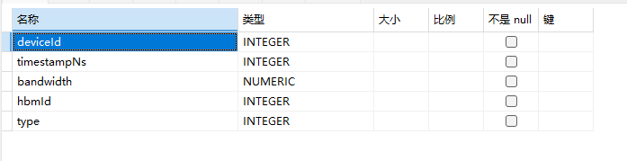

**processName:** `hbmId || '/' || case when value='read' then 'Read' else 'Write' end as processName`, using the hbmId and type fields.

###### 2. LLC Type

```json
{
  "timestamp": 20534090,
  "value": {
    "Throughput(B/s)": 115726466
  }
}

{
  "timestamp": 20534090,
  "value": {
    "Hit Rate(%)": 32
  }
}
```


**processName:**

1. `llcId || ' ' || case when value='read' then 'Read' else 'Write' end || '/Throughput' as processName`, using the llcId and mode fields

2. `llcId || ' ' || case when value='read' then 'Read' else 'Write' end || '/Hit Rate' as processName`, using the llcId and mode fields

###### 3. DDR Type

```json
{
  "timestamp": 20534090,
  "value": {
    "Read(B/s)": 115726466
  }
}

{
  "timestamp": 20534090,
  "value": {
    "Write(B/s)": 115726466
  }
}
```

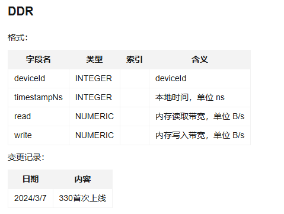

**processName:**

1. `Read`

2. `Write`

###### 4. STARS_SOC Type

```json
{
  "timestamp": 20534090,
  "value": {
    "L2 Buffer Bw Level": 115726466
  }
}

{
  "timestamp": 20534090,
  "value": {
    "Meta Bw Level": 115726466
  }
}
```


**processName:**

1. `L2 Buffer Bw Level`

2. `Meta Bw Level`

###### 5. ACC_PMU Type

```json
{
  "timestamp": 20534090,
  "value": {
    "value": 115726466,
    "acc_id": 12
  }
}
```

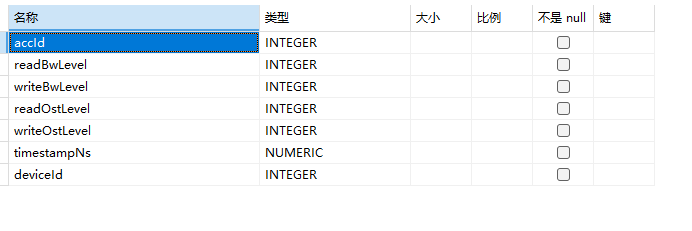

**processName:**

1. `readBwLevel`

2. `writeBwLevel`

3. `readOstLevel`

4. `writeOstLevel`

###### 6. NPU_MEM Type

```json
{
  "timestamp": 20534090,
  "value": {
    "B": 115726466
  }
}
```

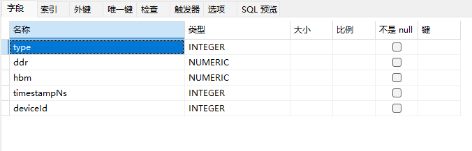

**processName:** Related to type

1. `APP/DDR`

2. `APP/HBM`

3. `APP/MEMORY`

4. `Device/DDR`

5. `Device/HBM`

6. `Device/MEMORY`

###### 7. SAMPLE_PMU Type

```json
{
  "timestamp": 20534090,
  "value": {
    "freq(Mhz)": 115726466,
    "usage(%)": 32,
    "totalCycle": 115726466
  }
}
```

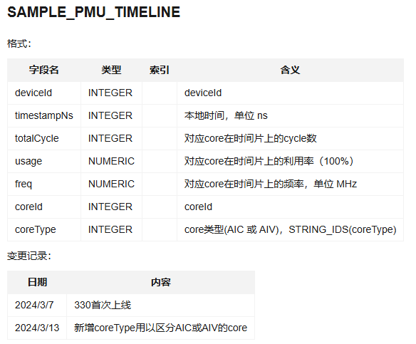

**processName:** `format('%s Core %s', value, coreId)`, using the coreId and coreType fields.

###### 8. ROCE\ROH\NIC Type

```json
// 1
{
  "timestamp": 20534090,
  "value": {
    "rx_bandwidth_efficiency": 11572.6466,
    "rx_packets": 11572,
    "rx_error_rate": 11572.6466,
    "rx_dropped_rate": 11572.6466
  }
}
// 2
{
  "timestamp": 20534090,
  "value": {
    "tx_bandwidth_efficiency": 11572.6466,
    "tx_packets": 11572,
    "tx_error_rate": 11572.6466,
    "tx_dropped_rate": 11572.6466
  }
}
```


**processName:**

1. `format('Port %s/rx', funcId)`, using the funcId field: 1

2. `format('Port %s/tx', funcId)`, using the funcId field: 2

###### 9. HCCS Type

```json
{
  "timestamp": 20534090,
  "value": {
    "txThroughput(B/s)": 11572.6466,
    "rxThroughput(B/s)": 11572.6466
  }
}
```


**processName:** `HCCS`

###### 10. PCIE Type

```json
// 1
{
  "timestamp": 20534090,
  "value": {
    "txAvg(B/s)": 11572.6466,
    "rxAvg(B/s)": 11572.6466
  }
}
// 2
{
  "timestamp": 20534090,
  "value": {
    "txAvg(B/s)": 11572.6466
  }
}
```


**processName:**

1. `PCIe_post`: 1

2. `PCIe_nonpost`: 1

3. `PCIe_cpl`: 1

4. `PCIe_nonpost_latency`: 2

###### 11. AI_CORE Type

```json
{
  "timestamp": 20534090,
  "value": {
    "Mhz": 115726466
  }
}
```


**processName:** `AI Core Freq`

</details>

#### 4.5.3 Text Scenario

##### 4.5.3.1 Related Data Table

| ### | Data Table | startTime | args | Search Limit Required Parameters |
|:----|:--------|:----------|:-----|:------------------------------------|
| 1   | counter | timestamp | args | pid,processName,startTime,timestamp |

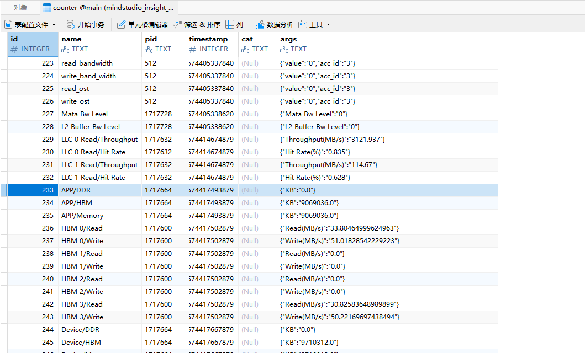

##### 4.5.3.2 Parsing Logic

Understand the following logic with a question in mind: How are the args generated?

1. Run the method for inserting a Counter.

   ```cpp
   void EventParser::CounterEventsHandle(std::unique_ptr<Trace::Event> eventPtr)

   bool TextTraceDatabase::InsertCounter(const Trace::CounterResultDescription &event)

   bool TextTraceDatabase::InsertCounterList(const std::vector<Trace::CounterResultDescription> &eventList)
   ```

2. The parsing logic triggered when parsing the JSON file.

   ```cpp
   eventHandleMap.emplace("C", std::bind(&EventParser::CounterEventsHandle, this, std::placeholders::_1));
   ```

3. Example: A Counter snippet in the JSON file.

   ```json
   {"processName": "APP/DDR", "ts": "1707359574357536.879", "pid": 1717664, "tid": 0, "args": {"KB": 0.0}, "ph": "C"}

   {"processName": "APP/HBM", "ts": "1707359574357536.879", "pid": 1717664, "tid": 0, "args": {"KB": 9069036.0}, "ph": "C"}

   {"processName": "write_ost", "ts": "1707359579320538.120", "pid": 512, "tid": 0, "args": {"value": 0, "acc_id": 2}, "ph": "C"}
   ```

### 4.6 Slice ID Design


#### 4.6.1 Core Interface

1. `unit/threadTraces`

   Obtains the specific slice list of a unit from the timeline.

   <details>
   <summary>Return Value Structure</summary>

   resp:

   ```cpp
   struct ThreadTraces {
       std::string name;
       uint64_t duration = 0;
       uint64_t startTime = 0;
       uint64_t endTime = 0;
       uint32_t depth = 0;
       std::string threadId;
       std::string pid;
       std::string id;
       std::string cname;
   };
   ```

   </details>

2. `unit/one/kernelDetail`

   The Timeline obtains the slice ID based on the slice name.

   <details>
   <summary>Return Value Structure</summary>

   resp:

   ```cpp
   struct OneKernelBody {
       std::string id;
       uint64_t depth = {0};
       std::string threadId;
       std::string pid;
       std::string step;
       std::string group;
       std::string rankId;
   };
   ```

   </details>

3. `query/all/same/operators/duration`

   Timeline retrieves the list of slices within it based on the slice and time range.

   <details>
   <summary>Request Body and Return Value Structure</summary>

   req:

   ```json
   {
     "rankId": "ubuntu8438122216155992192_0 0",
     "tid": ["272_0"],
     "pid": "HCCL",
     "startTime": 1531153458,
     "endTime": 3248708207,
     "name": "Reduce_Inline",
     "wallDuration": 583860,
     "metaType": "HCCL",
     "count": 194,
     "field": "duration",
     "order": "descend",
     "total": 195,
     "current": 1,
     "pageSize": 10,
     "orderBy": "duration"
   }
   ```

   resp:

   ```cpp
   struct SameOperatorsDetails {
       uint64_t timestamp{};
       uint64_t duration{};
       // id and depth are used to support the selected list;
       std::string id;
       // name is used to support the overall metric more details list
       std::string name;
       uint64_t depth{};
       std::string tid;
   };
   ```

   </details>

#### 4.6.2 Core Code

##### 4.6.2.1 Related Logic of `unit/threadTraces`

The ID is based on the MSPROF DB design document.

Table 1 Slice types, corresponding data tables, and ID retrieval methods

| Serial Number | Type               | C++ Class      | Data Table         | ID             | Remarks        |
|:---|:-----------------|:---------------|:-----------------|:---------------|:----------|
| 1  | CANN_API         | CannApiRepo    | CANN_API         | `connectionId` |           |
| 2  | ASCEND_HARDWARE  | HardWareRepo   | TASK             | `ROWID`        |           |
| 3  | HCCL             | HcclRepo       | TASK             | `rowid`        | plane type |
| 4  |                  |                | COMMUNICATION_OP | `opId`         | group type |
| 5  | MS_TX            | MstxRepo       | MSTX_EVENTS      | `ROWID`        |           |
| 6  | OVERLAP_ANALYSIS | OverlapAnsRepo | OVERLAP_ANALYSIS | `ROWID`        |           |
| 7  | API              | PythonApiRepo  | PYTORCH_API      | `ROWID`        |           |
| 8  | TEXT             | TextRepository | slice            | `id`           | TEXT scenario   |

###### Definition of Type and Class Mapping Relationship

```cpp
RepositoryFactory::RepositoryFactory()
{
    sliceRespoMap.emplace(PROCESS_TYPE::ASCEND_HARDWARE, std::make_unique<HardWareRepo>());
    sliceRespoMap.emplace(PROCESS_TYPE::HCCL, std::make_unique<HcclRepo>());
    sliceRespoMap.emplace(PROCESS_TYPE::OVERLAP_ANALYSIS, std::make_unique<OverlapAnsRepo>());
    sliceRespoMap.emplace(PROCESS_TYPE::CANN_API, std::make_unique<CannApiRepo>());
    sliceRespoMap.emplace(PROCESS_TYPE::API, std::make_unique<PythonApiRepo>());
    sliceRespoMap.emplace(PROCESS_TYPE::MS_TX, std::make_unique<MstxRepo>());
    sliceRespoMap.emplace(PROCESS_TYPE::TEXT, std::make_unique<TextRepository>());
    ...
};
```

##### 4.6.2.2 Related Logic of `unit/one/kernelDetail`

> NOTE

| Serial Number | Type               | Query or Not | Data Table              | ID             | Remarks        |
|:---|:-----------------|:-----|:-----------------|:---------------|:----------|
| 1  | CANN_API         |      | CANN_API         | `connectionId` |           |
| 2  | ASCEND_HARDWARE  | Yes    | TASK             | `ROWID`        |           |
| 3  | HCCL             |      | TASK             | `rowid`        | plane type |
| 4  |                  | Yes    | COMMUNICATION_OP | `rowId`        | group type |
| 5  | MS_TX            | Yes    | MSTX_EVENTS      | `ROWID`        |           |
| 6  | OVERLAP_ANALYSIS |      | OVERLAP_ANALYSIS | `ROWID`        |           |
| 7  | API              |      | PYTORCH_API      | `ROWID`        |           |

##### 4.6.2.3 `query/all/same/operators/duration` Related Logic

> Note: The ID obtained for the HCCL Group type is COMMUNICATION_OP.rowId, not COMMUNICATION_OP.opId.

Core logic: `TraceDatabaseHelper::QueryThreadSameOperatorsDetails`

| Serial Number | Type               | Query or Not | Data Table              | ID             | Remarks        |
|:---|:-----------------|:-----|:-----------------|:---------------|:----------|
| 1  | CANN_API         | Yes    | CANN_API         | `connectionId` |           |
| 2  | ASCEND_HARDWARE  | Yes    | TASK             | `ROWID`        |           |
| 3  | HCCL             | Yes    | TASK             | `rowid`        | plane type |
| 4  |                  | Yes    | COMMUNICATION_OP | `rowId`        | group type |
| 5  | MS_TX            | Yes    | MSTX_EVENTS      | `ROWID`        |           |
| 6  | OVERLAP_ANALYSIS | Yes    | OVERLAP_ANALYSIS | `ROWID`        |           |
| 7  | API              | Yes    | PYTORCH_API      | `ROWID`        |           |

### 4.7 Usability Operations and Related Interfaces That a New Slice Unit Should Support

| #  | Operation                                | Interface                            |                                                                                 |
|:---|:----------------------------------|:------------------------------------|:--------------------------------------------------------------------------------|
| 1  | Get unit Slice                         | `unit/threadTraces`                 |                            |
| 2  | Get unit Slice summary                      | `unit/threadTracesSummary`          |                     |
| 3  | Click an operator to display selection details                        | `unit/threadDetail`                 | 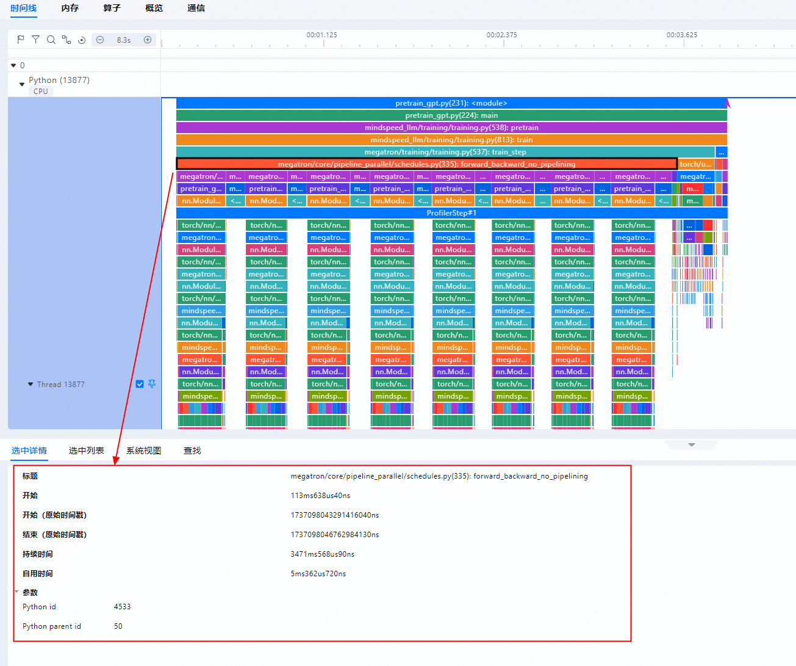                          |
| 4  | Global search to get the total count                          | `search/count`                      |                           |
| 5  | Global search to get the current operator                        | `search/slice`                      |                           |
| 6  | Discovery list query                            | `search/all/slices`                 |                      |
| 7  | Click to jump to an operator in the discovery list                        | `unit/one/kernelDetail`             |                          |
| 8  | Rectangle-select a unit to get the selection list                        | `unit/threads`                      |     |
| 9  | Get the Slice list within a selected Slice name and time range | `query/all/same/operators/duration` | 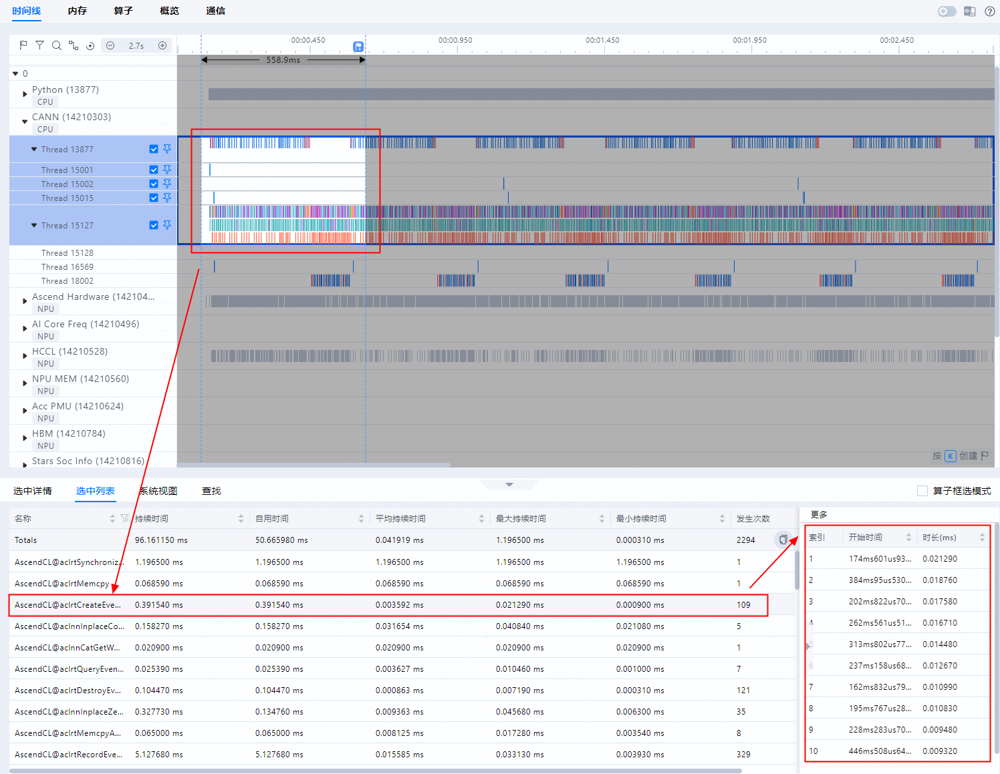 |
| 10 | Right-click a unit and select to display in the Event View                  | `unit/eventView`                    |                  |

### 4.8 Expert System View Design

#### 4.8.1 Key Design

The Expert Suggestion module is newly added and overlaid on top of the existing functionality. The overall feature uses the current data as a basis to further analyze potential issues in the data. In terms of the workflow, the original profiling file parsing and querying remain unchanged, and data query-related operations are newly added. Therefore, the code implementation essentially involves no code refactoring, but the implementation files related to data queries, such as `VirtualTraceDatabase.cpp/h`, will be modified.

In terms of specific business scenarios, Expert Suggestions can be broadly divided into single-rank expert suggestions and cluster expert suggestions. Single-card expert suggestions are primarily displayed together with the Timeline interface, while cluster expert suggestions need to be displayed on cluster interfaces (such as the Summary interface and the Communication interface). Among the above requirements, except for the "Support cluster slow card and slow link cause identification" requirement, all others are single-rank expert suggestions. The implementation approach is analyzed in detail below.

#### 4.8.2 Function Implementation Design

##### 4.8.2.1 Overall Logic

The use case of Expert Suggestion is shown in the following figure. It mainly includes single-rank optimization suggestions such as Affinity Optimization, Affinity API, AICPU operator, ACLNN operator, and Fusion Operator Identification, as well as optimization suggestions for cluster slow-rank and slow-link identification.

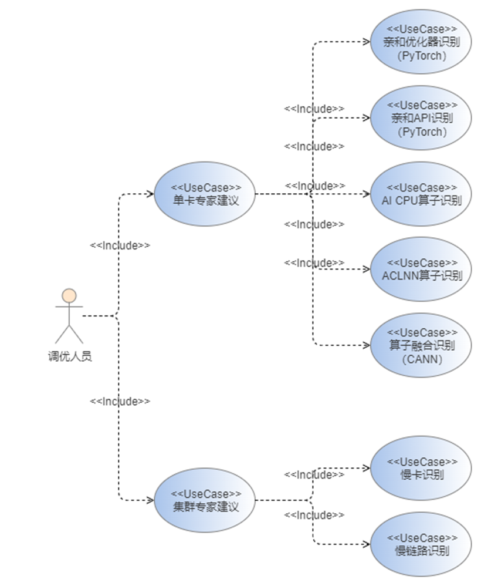

For the above two categories totaling seven suggestions, the overall processing logic is essentially consistent, as shown in the sequence diagram below.


In the sequence diagram above:

**(1)** When MindStudio Insight starts, it needs to register request processing Handlers (multiple Handlers are aggregated into AdvisorModule and bound to interface fields) with ModuleManager, and register protocol conversions (multiple protocol conversions are aggregated into AdvisorProtocolUtil and bound to interface fields).

**(2)** When the frontend initiates a specific request, it first looks up the corresponding Handler in ModuleManager via the interface field, and simultaneously looks up and invokes the corresponding frontend JSON-to-Request data structure protocol conversion to convert the frontend request into a data structure for subsequent processing.

**(3)** The request processing Handler is invoked to process the data. The Handler further calls the process layer methods for processing (the reason for introducing the process layer here is that much of the data cannot be used directly after querying the database, but requires further processing, which is implemented at the process layer). The process layer queries the corresponding database for data, and performs further classification, sorting, filtering, and other operations on the queried data to obtain the final result, which is returned to the Handler.

**(4)** After the Handler obtains the processed data, it returns to ModuleManager to look up and invoke the corresponding backend Response data structure-to-frontend JSON protocol conversion method, assembling the response into JSON and returning it to the frontend for display.

##### 4.8.2.2 Flowchart

###### Affinity API Identification

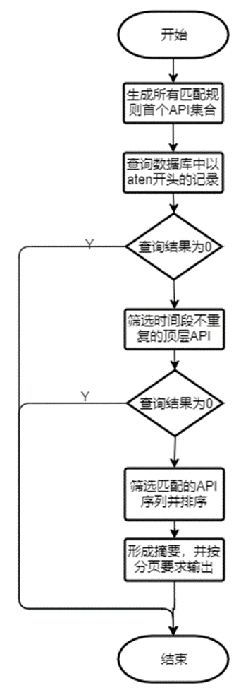

###### Affinity Optimizer Identification

Directly read the SQL query result.

###### AI CPU Operator Identification

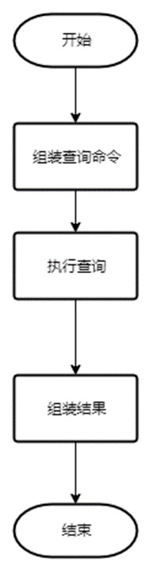

###### ACLNN Operator Identification

The process is the same as that of the Affinity Optimizer, with the only difference being the SQL command. The SQL command needs to identify operators whose name starts with `AscendCL@aclnn` and does not end with `GetWorkspaceSize`, and which appear more than 20 times.

###### Fusion Operator Identification

Fusion operator identification implements the matching of consecutively matching operator sequences within the same stream. SQL can be used to query consecutive matching sequences, but the lengths of matching rules may vary, so only one rule can be matched at a time. Consecutive matching sequences can be implemented using joins, for example:

```sql
SELECT kd1.* FROM kernel_detail kd1
JOIN kernel_detail kd2 ON kd2.row_num = kd1.row_num + 1 AND kd2.name = 'BB'
WHERE kd1.name = 'AA';
```

#### 4.8.3 Interface Description

The Advisor module involves five new frontend/backend request/response messages:

1. `QueryAffinityAPIAdvice`: Affinity API Identification

2. `QueryAffinityOptimizerAdvice`: Affinity Optimizer Identification

3. `QueryAiCpuOpAdviceHandler`: AI CPU Operator Identification

4. `QueryAclnnOpAdvisorHandler`: ACLNN Operator Identification

5. `QueryFusedOperatorAdviceHandler`: Fusion Operator Identification

#### 4.8.4 Overall Overview

For single-rank expert suggestions, the main body will be placed within the Timeline tab, enabling more convenient linkage with the Timeline interface and helping developers locate optimization points more quickly. This design is consistent with that of NVIDIA NSight Systems. Specifically: under the "Timeline" tab, a new "Expert System View" option is added within "System View", and the overall interface is placed at the bottom of the page.

#### 4.8.5 Code Design

A new Advisor module is added, which includes the `AdvisorModule` class and three packages: `handler`, `process`, and `protocol`:

1. The `handler` package contains handlers that process frontend requests. Different interfaces are implemented in separate files, making them independent of each other and extensible in the future. In addition to defining the basic information of the `Advisor` class, the `AdvisorModule` class also registers the aforementioned handlers with the global message interface management instance.

2. The `process` package implements the processing of expert suggestions. It is called by the `handler` layer above and invokes various database query interfaces below. In addition to performing data queries, it also handles data assembly, sorting, filtering, and other processing tasks.

3. The `protocol` package implements the protocol format and protocol conversion for frontend-backend interaction. In addition to defining the data structures of the interfaces, it also includes the conversion of frontend request JSON into request data structures and the conversion of backend response data structures into JSON to be returned to the frontend. The aforementioned protocol conversion implementations are registered with the global protocol conversion management instance according to the interface fields.

### 4.9 Full Connection Design

#### 4.9.1 Overall Logic


Query data is divided into two categories: TEXT and DB, where TEXT is further subdivided into operator tuning and system tuning. The performance optimization module applies the same processing logic to both TEXT and DB.

#### 4.9.2 TEXT Query Data

##### 4.9.2.1 Table Structure


**id:** Primary key, used to distinguish different data entries. One entry represents one connection point.
**flow_id:** Connection ID. Connection points with the same flow_id form a connection. Typically, a connection is determined by two connection points.
**name:** Name of the connection, not yet used.
**cat:** Connection category.

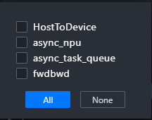

**track_id:** Unique identifier of the unit, used to identify which unit the connection point belongs to.
**timestamp:** Timestamp of the connection point.
**type:** Type of the connection point, which can be s, f, or t, where s indicates a start point and the rest indicate end points.

##### 4.9.2.2 Query Logic

Directly query all connection points based on cat, with performance optimization to be performed later.

#### 4.9.3 DB Query Data

##### 4.9.3.1 Query Logic

The DB scenario is a customized scenario, and the connection types are fixed.

###### async_task_queue

From a Python unit to a Python unit, associated via connectionId, but the name of the operator at the endpoint is `Enqueue`. For the specific logic, see:

```cpp
HostFlowRepo::QueryAsyncTaskQueue
```

###### fwdbwd

Connects from a Python unit to a Python unit, associated via connectionId, but the name of the operator at the endpoint is not `Enqueue`. For the specific logic, see:

```cpp
HostFlowRepo::QueryFwdbwd
```

###### async_npu

Connects from the python unit to hardware and hccl, associated via connectionId, where the python unit is always the source and hardware and hccl are always the destinations. For the specific logic, see:

```cpp
DbFlowRepo::QueryAsyncNpu
```

###### HostToDevice

Connects from the CANN unit to hardware and HCCL, associated via connectionId. The CANN unit serves as the start point, while hardware and HCCL serve as the end points. For the specific logic, see:

```cpp
DbFlowRepo::QueryHostToDevice
```

###### Mstx

Connects from the mstx unit to hardware, associated via connectionId, where the mstx unit is always the source and hardware is the destination. For the specific logic, see:

```cpp
DbFlowRepo::QueryMsTx
```

#### 4.9.4 Performance Optimization

##### 4.9.4.1 Processing Flow

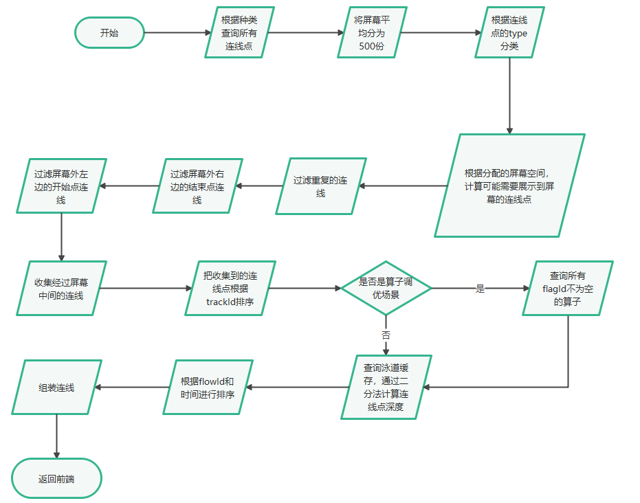

##### 4.9.4.2 Data sources are uniformly obtained through the following interfaces, without distinguishing between db and text. The underlying layer ensures that the data formats returned by db and text are consistent. For details, see

```cpp
dataEngine->QueryFlowPointByCategory
```

##### 4.9.4.3 Sampling of connection points. For details, see

```cpp
flowAnalyzerPtr->ComputeScreenFlowPoint
```

##### 4.9.4.4 Compute the Depth of Connection Points After Sampling

##### 4.9.4.5 Assemble connection points into connections, then return them to the frontend. For details, see

```cpp
flowAnalyzerPtr->ComputeUintFlows
```
