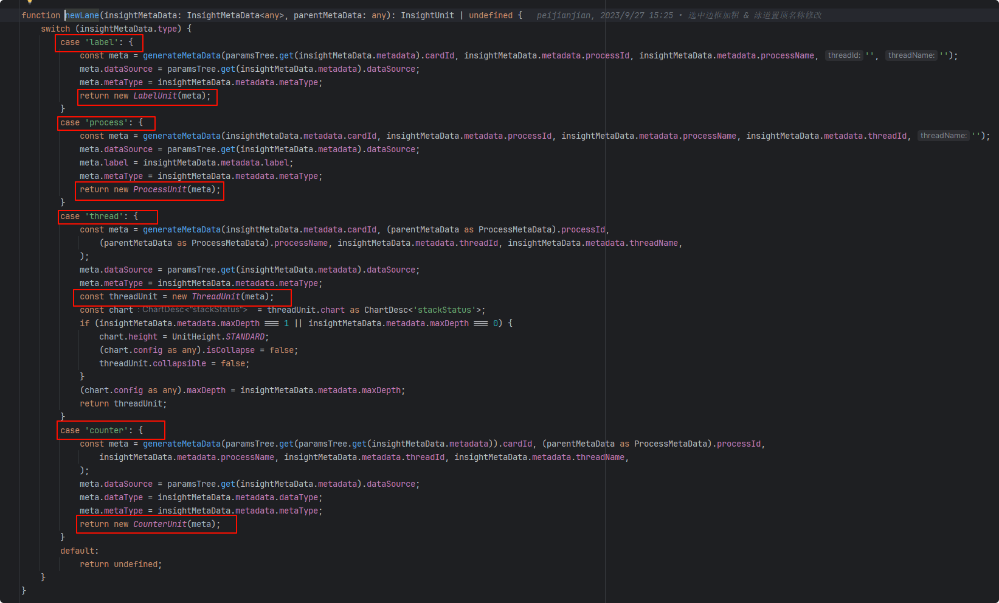
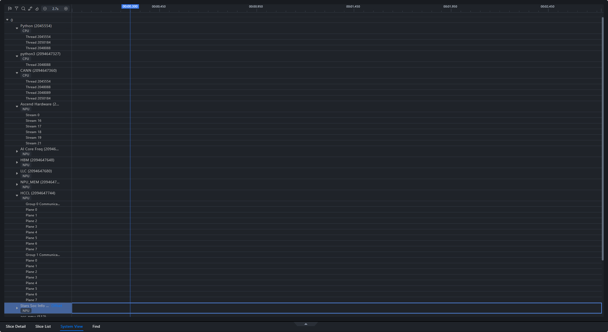

# Unit Rendering

<!-- md-trans-meta sourceCommit=49122e1f1d6621e5b8a8bbc1c0fdae9583659f48 translatedAt=2026-08-12T11:42:11.655Z pushedAt=2026-08-12T11:57:31.096Z -->

## 1. Overview

Unit rendering in the Timeline involves the following areas:

**① Timeline Area**, **② Marker Area**, and **Unit Area** (each unit includes **③ Unit Information** and **④ Unit Content**).


## 2. Component Relationship

")

")

## 3. Timeline Area

**Components:**

```jsx
<TimelineAxis />
```

**Rendering Frequency:** Continuously re-rendered using the custom rendering engine renderEngine.

**Rendered Content:** Calculated based on domainStart and domainEnd in session.domain.

## 4. Flagging (Marker) Area

**Component:**

```jsx
<TimeMarkerAxis />
```

**Rendering Trigger:**
Depends on changes to the following parameters:
width (area width), domainStart, domainEnd, session.timelineMarker.refreshTrigger (trigger flag), session.selectedRange

**Rendered Content:**

1. Click flag: a flag drawn by clicking, rendered using the canvas with ref=canvas

2. Hover flag: the flag displayed on mouse hover, drawn using the canvas with ref=flagCursor

3. Flag dashed line: the dashed line connected below the flag, drawn using the canvas with ref=vertical

## 5. Unit Area

### 5.1 Unit Information

**Components:**

```jsx
<UnitInfo />
```

**Content:**

1. Configuration component

2. Pin component

3. Unit name

### 5.2 Unit Content

**Component:**

```jsx
<Chart />
```

#### 5.2.1 Unit Type

Unit classes are defined in AscendUnit.tsx. The following lists the chart type rendered for each unit type. Currently, three chart types are used:
**StatusChart, StackStatusChart, FilledLineChart**

| Unit Type | Chart Type         |
|---------------|--------------------|
| Root          | -                  |
| Card          | -                  |
| Process       | StatusChart        |
| Thread        | StackStatusChart   |
| Counter       | FilledLineChart    |
| Label         | -                  |

#### 5.2.2 Data Interface

| Interface                 | Description            |
|---------------------------|------------------------|
| import/action             | Import file path       |
| parse/success             | Data parsing succeeded |
| unit/threadTracesSummary  | Get thread preview data |
| unit/threadTraces         | Get thread data        |
| unit/counter              | Get histogram data     |

#### 5.2.3 Overall Process


1. Import data (import/action): Obtain the basic information of all ranks, iterate through the data to instantiate a unit for each card via new CardUnit, and store them in session.units.

   

2. Single-card parsing success (parse/success): After each card is successfully parsed, the backend returns a parsing success event containing the card's detailed data (such as child unit data children, metadata, etc.). Iterate through children, instantiate different unit types based on the data type type, and add the child swimlanes to the corresponding parent unit in session.units.

   

   

3. When a unit is expanded, the content (rendering) data of that unit is requested. Different swimlanes use different interfaces:

   | Unit Type | Interface                 | Description            |
   |---------------|---------------------------|------------------------|
   | Label unit   | -                         | -                      |
   | Process unit | unit/threadTracesSummary  | Get thread preview data |
   | Thread unit  | unit/threadTraces         | Get thread data         |
   | Counter unit | unit/counter              | Get histogram data      |

### 5.3 Unit Mask

In all unit content areas, there are two canvases, NormalCanvas and HoverCanvas, used for cross-unit content rendering. HoverCanvas is used for rendering content required during mouse movement.

Mouse events and keyboard events defined on these two canvases are exposed externally via useImperativeHandle and are actually bound to the ChartContainer component.

[Canvas](./figures/track-render/content-4.png)

## 6. Interaction

### 6.1 Pin

The pin interaction is located in the unit information area and is carried by the `UnitInfo`-related components. After a user pins a unit, the unit needs to remain visible when scrolling or expanding other swimlanes, facilitating comparison with the content of other swimlanes.

Key considerations during development:

- Whether the pin state is bound to the unit ID.

- Whether the pinned unit can still be correctly positioned after parent-child swimlanes are expanded or collapsed.

- The data requests of a pinned unit are consistent with those of ordinary swimlanes and must not bypass interfaces such as `unit/threadTracesSummary`, `unit/threadTraces`, and `unit/counter`.

### 6.2 Box Selection

Box selection is used to select a time range in the chart area. The box selection range affects the linkage of tables, details, or other modules, and the related state is typically associated with `session.selectedRange`.

Key considerations during development:

- Whether the box selection start time and end time fall within the current `session.domain` range.

- Whether the related charts are re-rendered after the box selection range changes.

- Whether different chart types (`StatusChart`, `StackStatusChart`, `FilledLineChart`) handle the box selection range consistently.

### 6.3 Zoom

Zoom drives graph redrawing by changing the time domain range. The timeline area calculates ticks based on `domainStart` and `domainEnd` in `session.domain`, and the unit content also needs to use the same time domain for coordinate conversion.

Key considerations during development:

- After zooming, the timeline area, marker area, and unit content use the same time domain.

- In large data volume scenarios, avoid repeatedly executing high-cost computations in each redraw.

- When data needs to be re-requested, prioritize reusing existing cache or requesting based on the current time range.

### 6.4 Jump

Jump is used to locate a target time point, target slice, or target operator. After a jump, the visible area should be updated, and the target object should be visible within the current view range.

Key considerations during development:

- Whether the jump target has an explicit timestamp or slice ID.

- Whether `domainStart` / `domainEnd` and the selection state are updated synchronously after the jump.

- If the target data has not been loaded yet, you need to first trigger the corresponding unit data request and then perform the positioning.

## 7. Development and Verification Recommendations

### 7.1 Key Code Entry Points

- Unit class definition: `modules/timeline/src/insight/units/AscendUnit.tsx`

- Unit information component: `modules/timeline/src/components/ChartContainer/Units/UnitInfo.tsx`

- Chart types: `StatusChart`, `StackStatusChart`, `FilledLineChart`

- Data cache: `modules/timeline/src/cache/simplecache.ts`

Specific paths may change as the code evolves. When maintaining this document, always refer to the repository source code as the authoritative reference.

### 7.2 Steps for Developing a New Unit

1. Add the new Unit type and necessary metadata in the unit definition.

2. Specify the chart type used by the new unit.

3. Add or reuse data interfaces on the backend.

4. Trigger the corresponding data request on the frontend when the unit is expanded.

5. Verify whether interactions such as pin, box selection, zoom, hover, and jump are affected.

### 7.3 Verification Method

- Import TEXT or DB data containing Timeline data.

- Expand different unit types such as Card, Process, Thread, and Counter.

- Verify the request chains of `import/action`, `parse/success`, `unit/threadTracesSummary`, `unit/threadTraces`, and `unit/counter`.

- Verify whether pin, box selection, zoom, jump, and hover work properly.
