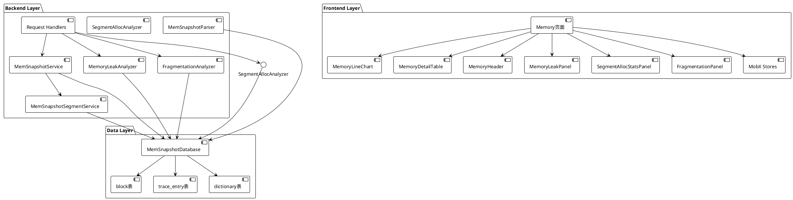
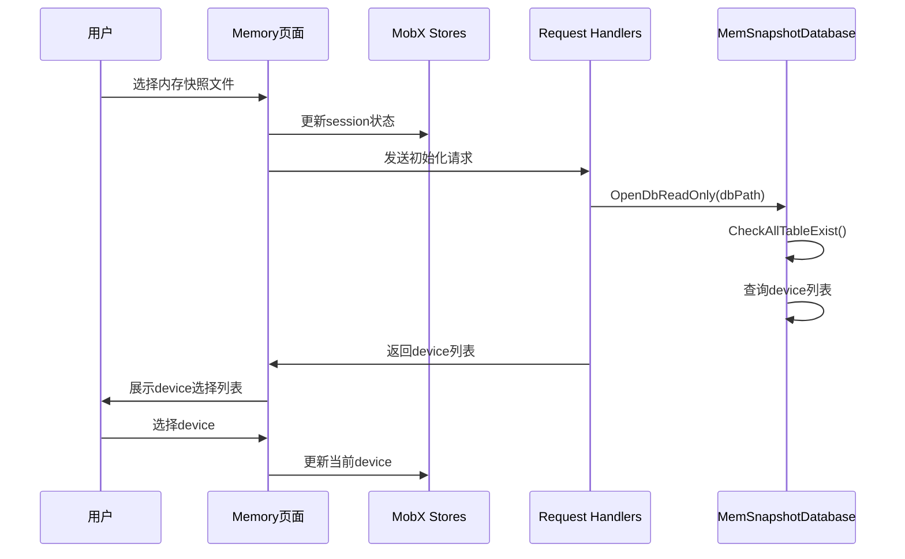
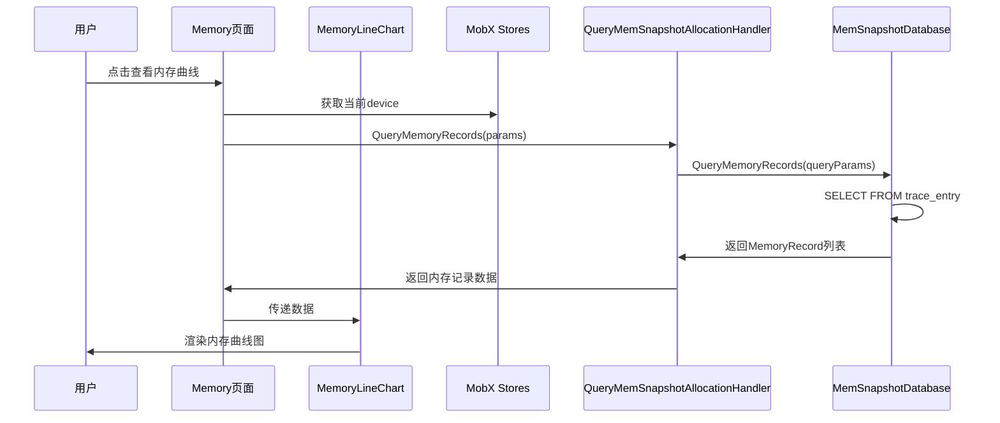
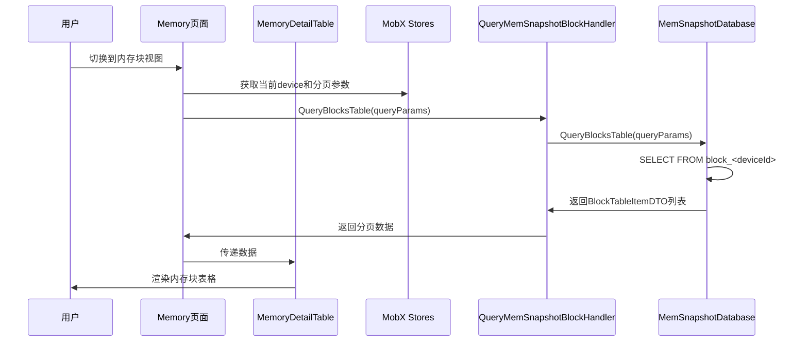
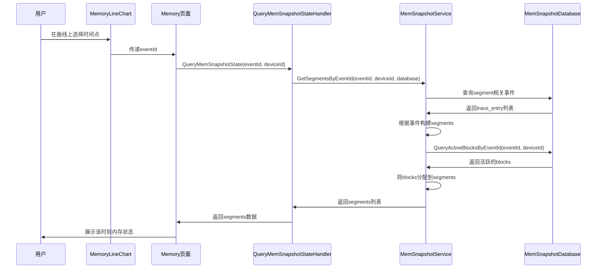
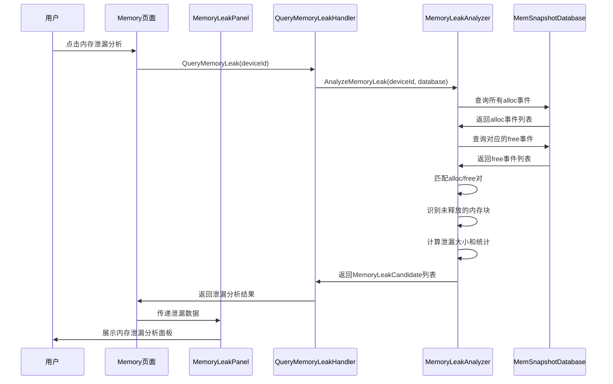
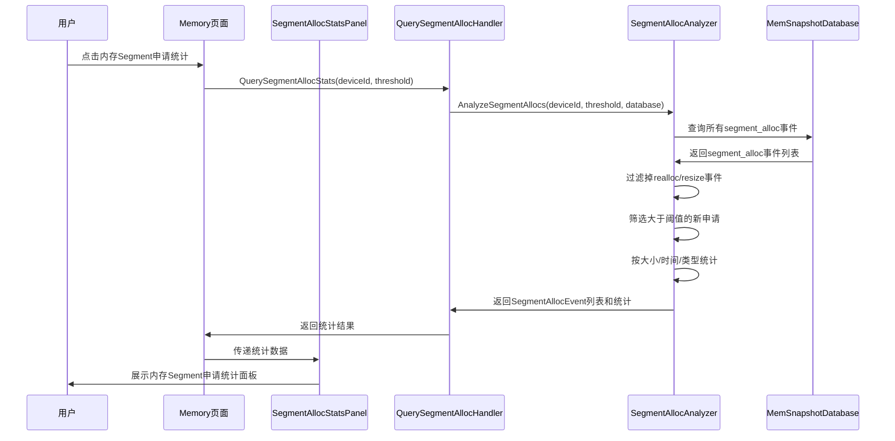
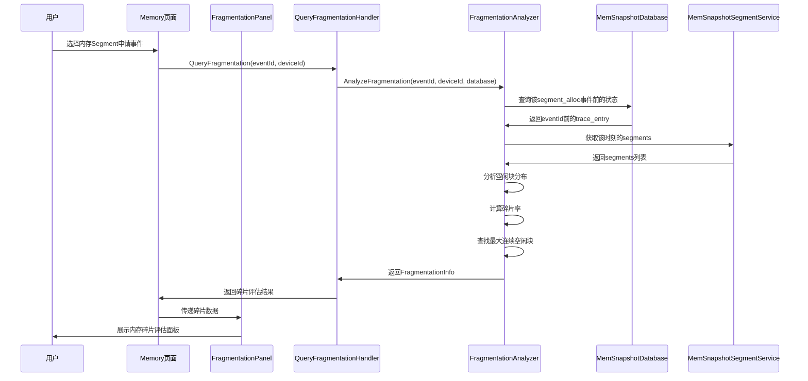

# Supporting Memory Snapshot Display and Analysis

<!-- md-trans-meta sourceCommit=81c78c7bc5b57be8952a8eb0685833246e436fe7 translatedAt=2026-08-12T11:42:24.048Z pushedAt=2026-08-12T11:57:31.098Z -->

Status: Draft
Authors: @leo920320
Created: 2026-05-07
Updated: 2026-05-07
Related Issue/PR: #TBD

# 1. Overview

## 1.1 Introduction

This proposal aims to design and implement the snapshot analysis support feature for MindStudio Insight, targeting memory analysis scenarios on the Ascend platform and addressing the efficiency issues in large file analysis. The solution adopts a C++ backend and React frontend architecture, uses an SQLite database for storage, and supports efficient Memory Snapshot analysis, including Memory Curve display, Memory Block detail query, and event tracking.

## 1.2 Motivation

During deep learning training and inference, memory analysis is a critical step in performance optimization. The following pain points currently exist:

1. **Large File Analysis Requirements**: Memory snapshot data on the Ascend platform is substantial in size, necessitating efficient analysis tools.

2. **Multi-dimensional Analysis**: Analysis needs to be conducted from multiple dimensions (total memory, memory blocks, events, etc.).

3. **Visualization Requirements**: Intuitive visual presentation is required to help developers understand memory usage conditions.

4. **Difficulty in locating issues**: The ability to quickly locate problems such as memory leaks and memory fragmentation is required.

To address the above issues, a snapshot analysis feature is proposed to be designed and implemented in MindStudio Insight, providing comprehensive memory analysis capabilities.

## 1.3 Target

### Objectives

- Support efficient analysis of Ascend platform memory snapshot data

- Provide memory curve display (allocated/reserved/active)

- Provide memory block detail query and display

- Provide memory event tracing functionality

- Support memory analysis across multiple devices.

- Provide data query capabilities such as pagination, filtering, and sorting.

- Provide Memory Leak Analysis to identify memory that has been allocated but not released within the collection period.

- Provide Segment Allocation Event Statistics.

- Provide Pre-allocation Memory Fragmentation Assessment for memory segments.

### Non-Goals

- The data collection method for memory snapshots is not to be changed.

- Real-time memory monitoring functionality is not provided (only previously collected snapshot data is analyzed).

- Support for the PyTorch native snapshot format is not included in this phase.

- Automated memory optimization suggestions are not provided.

# 2. Use Case Analysis

## 2.1 Primary Use Cases

### Use Case 1: Memory Curve Analysis

- **Feature Point**: Display the curve of memory usage over time, including three metrics: allocated, reserved, and active.

- **Performance Requirements**: Curve rendering time < 10 seconds (for hundreds of thousands of data points).

- **Interaction Requirements**: Support timeline zooming and hovering over data points to view details.

### Use Case 2: Memory Block Detail Query

- **Feature Point**: Queries detailed information of memory blocks, including address, size, status, allocation/deallocation events, etc.

- **Performance Requirements**: Pagination query response time < 10 seconds

- **Interaction Requirements**: Supports filtering, sorting, and searching by conditions such as status and size

### Use Case 3: Memory Event Tracking

- **Feature Point**: View a detailed list of all memory operation events (alloc/free/segment_alloc, etc.)

- **Performance Requirements**: Pagination query response time < 10 seconds

- **Interaction Requirements**: Support filtering and sorting by conditions such as event type and size

### Use Case 4: Multi-Rank Memory Analysis

- **Feature Point**: Supports selecting different devices to view their memory usage.

- **Performance Requirements**: device switching response time < 10 seconds.

### Use Case 5: Time-Point Memory State Analysis

- **Feature Point**: View the memory state at a specified time point (Event ID), including active segments and blocks

- **Performance Requirements**: State query time < 10 seconds

### Use Case 6: Memory Leak Analysis

- **Feature Point**: Analyzes memory that has been allocated but not deallocated within the collection period, and identifies potential memory leak points.

- **Performance Requirements**: Leak analysis time < 5 seconds.

- **Interaction Requirements**: Supports sorting and filtering by dimensions such as leak size and leaked object type.

### Use Case 7: Memory Segment Allocation Event Statistics

- **Feature Point**: Statistical analysis of newly allocated memory Segment events (excluding reallocation of already allocated or reserved memory)

- **Performance Requirements**: Statistical analysis time < 10 seconds

- **Interaction Requirements**: Supports configuring the threshold for "large Segment" and statistical display by dimensions such as size and time

### Use Case 8: Pre-allocation Memory Fragmentation Assessment for Memory Segments

- **Feature Point**: Before a memory segment allocation event occurs, the memory fragmentation conditions at that time are assessed.

- **Performance Requirements**: Fragmentation assessment time < 10 seconds.

- **Interaction Requirements**: Metrics such as fragmentation rate, fragmentation distribution, and maximum contiguous free block are displayed.

## 2.2 DFX (Design for X) Requirements

### Compatibility

- Supports memory snapshot data generated by the Ascend platform

- Supports mainstream Linux distributions (Ubuntu 20.04+, CentOS 8+) and Windows 10+

- Compatible with multi-rank scenarios

### Maintainability

- Provide comprehensive logging.

- Adopt a modular design to facilitate extension.

- Provide detailed error messages.

### Testability

- Provide standard test datasets.

- Support automated regression testing.

- Provide performance benchmark tests.

### Reliability

- The SQLite database is used, ensuring reliable data persistence.

- Large file analysis is supported without crashes caused by excessive data volume.

- A comprehensive exception handling mechanism is provided.

# 3. Solution Design

## 3.1 Overall Solution

### 3.1.1 System Architecture

A front-end and back-end separation architecture is adopted overall, with C++ used for the back end and React + TypeScript for the front end:

```plain
┌─────────────────────────────────────────────────────────────┐
│                      前端层 (React)                          │
│  ┌─────────────┐  ┌─────────────┐  ┌─────────────────────┐  │
│  │ Memory页面  │  │ 内存曲线图   │  │ 内存详情表格          │ │
│  └─────────────┘  └─────────────┘  └─────────────────────┘  │
│  ┌─────────────┐  ┌─────────────┐                           │
│  │ MobX Store  │  │ 请求工具    │                            │
│  └─────────────┘  └─────────────┘                           │
└─────────────────────────────────────────────────────────────┘
                              │
                              ▼ WebSocket
┌─────────────────────────────────────────────────────────────┐
│                    后端层 (C++)                              │
│  ┌─────────────┐  ┌─────────────┐  ┌─────────────────────┐  │
│  │ 请求处理器   │  │ 服务层      │   │ Segment服务         │  │
│  └─────────────┘  └─────────────┘  └─────────────────────┘  │
└─────────────────────────────────────────────────────────────┘
                              │
                              ▼
┌─────────────────────────────────────────────────────────────┐
│                    数据层 (SQLite)                           │
│  ┌─────────────┐  ┌─────────────┐  ┌─────────────────────┐  │
│  │ block表     │  │trace_entry表│  │ dictionary表        │   │
│  └─────────────┘  └─────────────┘  └─────────────────────┘  │
└─────────────────────────────────────────────────────────────┘
```

### 3.1.2 Core Components

The following is the UML component diagram of the core components of the system:



**Component Description**:

**Backend Components**:

1. **MemSnapshotDatabase**: The database access layer, which encapsulates all SQLite database operations and provides interfaces for querying data such as blocks, trace entries, and memory records.

2. **MemSnapshotService**: The core service layer, which provides advanced query capabilities for memory snapshots, such as retrieving the segment status at a specified point in time.

3. **MemSnapshotSegmentService**: A segment-specific service that inherits from MemSnapshotService and is dedicated to handling construction and query logic related to memory segments.

4. **MemoryLeakAnalyzer**: A memory leak analyzer, responsible for analyzing memory that has been allocated but not released within the collection period, and identifying potential memory leak points.

5. **SegmentAllocAnalyzer**: A memory segment allocation analyzer, responsible for collecting statistics on newly allocated memory segment events (excluding reallocation of already allocated or reserved memory).

6. **FragmentationAnalyzer**: A memory fragmentation analyzer, responsible for assessing the memory fragmentation status prior to memory segment allocation.

7. **Request Handlers**: HTTP request handlers that process frontend API requests, including QueryMemSnapshotAllocationHandler, QueryMemSnapshotBlockHandler, QueryMemoryLeakHandler, and others.

8. **MemSnapshotParser**: A parser responsible for parsing raw memory snapshot data and importing it into the SQLite database.

**Frontend Components**:

1. **Memory Page**: The main page component, which integrates all memory analysis functions and serves as the entry point for user interaction.

2. **MemoryLineChart**: The memory curve chart component, which uses ECharts to render the three curves of allocated, reserved, and active memory.

3. **MemoryDetailTable**: The memory detail table component, which supports pagination, filtering, and sorting functions, and displays a list of Memory Blocks or Memory Events.

4. **MemoryHeader**: The page header component, which provides functions such as device selection and data type switching.

5. **MemoryLeakPanel**: Memory Leak Analysis panel, which displays potential memory leak points and statistical information.

6. **SegmentAllocStatsPanel**: Memory Segment Allocation Statistics panel, which displays the statistical analysis of memory segment allocation events.

7. **FragmentationPanel**: Memory Fragmentation Assessment panel, which displays the memory fragmentation status before memory segment allocation.

8. **MobX Stores**: State management layer, including memoryStore, sessionStore, etc., which manages the app state.

**Data Structure**:

1. **TraceEntry**: Memory event data structure that records detailed information about operations such as alloc, free, and segment_alloc.

2. **Block**: Memory block data structure that records the address, size, status, and allocation/deallocation event IDs of a memory block.

3. **Segment**: Memory segment data structure that records information about large memory segments and the blocks they contain.

4. **MemoryRecord**: Memory record data structure that records the allocated/reserved/active values at a specific moment.

5. **MemoryLeakCandidate**: Memory leak candidate data structure that records potential memory leak information (address, size, type, allocation time, etc.).

6. **SegmentAllocEvent**: A data structure for memory segment allocation events, which records information about newly allocated memory segment events.

7. **FragmentationInfo**: A data structure for memory fragmentation information, which records metrics such as fragmentation rate, fragmentation distribution, and the maximum contiguous free block.

### 3.1.3 Core Process

#### Data Loading Process



#### Memory Curve Query Process



#### Memory Block Query Process



#### Point-in-Time Memory State Query Process



#### Memory Leak Analysis Flow



#### Memory Segment Allocation Event Statistics Flow



#### Pre-allocation Memory Fragmentation Assessment Flow for Memory Segment



## 3.2 Technology Selection

### 3.2.1 Implemented Technical Solution

| Hierarchy | Technology Selection | Description |
|------|----------|------|
| Backend Language | C++ | High performance, suitable for processing large data |
| Frontend Framework | React + TypeScript | Type-safe, rich ecosystem |
| State Management | MobX | Simple and easy to use, suitable for medium-sized apps |
| Database | SQLite | Embedded database, suitable for desktop apps |
| Visualization | ECharts/Custom Components | Flexible chart display |

### 3.2.2 Rationale for Core Technology Selection

1. **SQLite Database**:

   - Advantages: Embedded, zero-configuration, transaction support, mature and stable

   - Applicable scenarios: Desktop apps, scenarios requiring persistent storage

   - Implementation: Data is stored in the block and trace_entry tables, with support for multiple devices (table names suffixed with deviceId)

2. **Pagination Query**:

   - Implementation: The backend supports pagination, filtering, and sorting parameters.

   - Advantage: Avoids loading large amounts of data at once, improving response speed.

3. **Dictionary Table**:

   - Implementation: A dictionary table is used to store enumeration value mappings.

   - Advantages: saves storage space and facilitates internationalization.

## 3.3 Data Model Design

### 3.3.1 Main Data Table Structure

**block table** (records memory block information):

- id: Memory block ID

- address: Memory address

- size: Size

- requested_size: Requested size

- state: State (inactive/active_allocated/active_pending_free)

- alloc_event_id: Allocation event ID

- free_event_id: Deallocation event ID

**trace_entry table** (records memory events):

- id: Event ID

- action: Event type (segment_map/segment_unmap/segment_alloc/segment_free/alloc/free_requested/free_completed/workspace_snapshot)

- address: Address

- size: Size

- stream: Stream ID

- allocated: Total allocated

- active: Total active

- reserved: Total reserved

- callstack: Call stack

**dictionary table** (dictionary mapping table):

- table_name: Table name

- column_name: Column name

- int_val: Integer value

- real_val: Actual value

### 3.3.2 Event Type Definitions

```cpp
const std::string TRACE_ENTRY_ACTION_SEG_MAP = "segment_map";
const std::string TRACE_ENTRY_ACTION_SEG_UNMAP = "segment_unmap";
const std::string TRACE_ENTRY_ACTION_SEG_ALLOC = "segment_alloc";
const std::string TRACE_ENTRY_ACTION_SEG_FREE = "segment_free";
const std::string TRACE_ENTRY_ACTION_ALLOC = "alloc";
const std::string TRACE_ENTRY_ACTION_FREE_REQUESTED = "free_requested";
const std::string TRACE_ENTRY_ACTION_FREE_COMPLETED = "free_completed";
const std::string TRACE_ENTRY_ACTION_WORKSPACE = "workspace_snapshot";
```

### 3.3.3 Memory Block State Definition

```cpp
const std::string BLOCK_STATE_INACTIVE = "inactive";
const std::string BLOCK_STATE_ACTIVE_ALLOC = "active_allocated";
const std::string BLOCK_STATE_ACTIVE_PENDING_FREE = "active_pending_free";
```

### 3.3.4 New Data Structure Definitions

**MemoryLeakCandidate**:

- id: Candidate ID

- address: Memory Address

- size: Leak Size

- allocTime: Allocation time

- allocEventId: Allocation event ID

- objectType: Object type (inferred from call stack or metadata)

- callstack: Allocation call stack

- confidence: Leak confidence level (0–100)

**SegmentAllocEvent** (Memory Segment Allocation Event):

- eventId: Event ID

- address: Memory Address

- size: Allocation Size

- timestamp: Timestamp

- isNewAlloc: Whether it is a new allocation (true excludes realloc)

- streamId: stream ID

- callstack: call stack

**FragmentationInfo** (Memory Fragmentation Information):

- eventId: ID of the corresponding allocation event

- fragmentationRate: Fragmentation rate (0–100%)

- totalFreeSize: Total free size

- freeBlockCount: Number of free blocks

- largestFreeBlock: Maximum contiguous free block size

- largestFreeBlockAddress: Address of the largest free block

- freeBlockSizeDistribution: Free block size distribution (quantile statistics)

## 3.4 Security, Privacy, and DFX Design

### 3.4.1 Security Design

1. **Data Security**

   - Data is stored in a local SQLite file and is not uploaded.

   - Database file permission control is enforced.

   - The database can be opened in read-only mode.

2. **Access Control**

   - File system permission check

   - Workspace isolation

### 3.4.2 Maintainability Design

1. **Log Management**

   - Detailed operation log recording

   - Each module has an independent LOG_TAG

   - Error logs and stack information

2. **Modular Design**

   - Separation of the database layer, service layer, and request processing layer

   - Clear interface definitions

   - Facilitation of unit testing

3. **Exception Handling**

   - A comprehensive exception catching and handling mechanism

   - Returning meaningful error messages

### 3.4.3 Reliability Design

1. **Database Transactions**

   - SQLite transactions are used to ensure data consistency.

   - The database is opened in read-only mode to prevent data corruption.

2. **Multi-Rank Support**

   - Table names are distinguished by the deviceId suffix.

   - Querying the device list is supported.

3. **Lazy Loading**

   - Data such as block_id_range is lazily queried.

   - The initialization speed is improved.

## 3.5 API Interface Design

### 3.5.1 Main API Interfaces

#### Query Memory Records (Memory Curve)

- **Interface**: QueryMemSnapshotAllocation

- **Function**: Queries the change of memory usage over time

- **Parameters**:

  - deviceId: device ID

  - Pagination Parameter

- **Return**: MemoryRecord list (allocated/reserved/active)

#### Query Memory Block List

- **Interface**: QueryMemSnapshotBlock

- **Function**: Pagination query of memory block information

- **Parameters**:

  - deviceId: device ID

  - Pagination Parameter

  - Filter Condition

  - Sorting Parameter

- **Return**: BlockTableItemDTO list

#### Query Memory Event List

- **Interface**: QueryMemSnapshotEvent

- **Function**: Performs pagination query of memory events

- **Parameters**:

  - deviceId: device ID

  - Pagination Parameter

  - Filter Condition

  - Sorting Parameter

- **Return**: TraceEntryTableItemDTO list

#### Query Memory State at a Specified Time Point

- **Interface**: QueryMemSnapshotState

- **Function**: Queries the memory state at a specified event ID

- **Parameters**:

  - eventId: Event ID

  - deviceId: device ID

- **Return**: Segment list

#### Query Details

- **API**: QueryMemSnapshotDetail

- **Function**: Queries detailed information of a single block or event

- **Parameters**:

  - type: Type (block/event)

  - id: ID

  - deviceId: device ID

- **Returns**: detailed information

#### Memory Leak Analysis

- **Interface**: QueryMemoryLeak

- **Function**: Analyzes memory that was allocated but not deallocated during the collection period, and identifies potential memory leak points

- **Parameters**:

  - deviceId: device ID

  - minSize: Minimum leak size (optional, default 0)

- **Returns**:

  - MemoryLeakCandidate list (leak candidates)

  - Leak statistics (total leak size, leak count, statistics by type, etc.)

#### Memory Segment Allocation Event Statistics

- **Interface**: QuerySegmentAllocStats

- **Function**: Performs statistical analysis on newly allocated memory Segment events (excluding reallocation of already allocated or reserved memory)

- **Parameters**:

  - deviceId: device ID

  - threshold: Large Segment threshold (in bytes, default: 1 MB)

  - groupBy: Grouping dimension (size/time/type, default: size)

- **Returns**:

  - SegmentAllocEvent list (Segment Allocation Events)

  - Statistical information (total allocation count, total allocation size, distribution statistics, etc.)

#### Pre-allocation Memory Fragmentation Assessment for Memory Segments

- **Interface**: QueryFragmentation

- **Function**: Assesses the memory fragmentation status before a Memory Segment allocation event occurs.

- **Parameters**:

  - eventId: Memory Segment allocation event ID

  - deviceId: device ID

- **Return**:

  - FragmentationInfo (fragmentation information)

  - Metrics such as fragmentation rate, fragmentation distribution, and maximum contiguous free block

# 4. Test Design

## 4.1 Unit Tests

- Test database query functionality

- Test service layer logic

- Test Segment construction logic

- Test boundary conditions

- Test the leak identification logic of MemoryLeakAnalyzer

- Test the Segment filtering and statistical logic of SegmentAllocAnalyzer

- Test the fragmentation assessment algorithm of FragmentationAnalyzer

## 4.2 Integration Testing

- Test the complete query flow.

- Test frontend-backend interaction.

- Test multi-rank scenarios.

- Test large database performance.

- Test the complete workflow of Memory Leak Analysis

- Test the complete workflow of Memory Segment Allocation Statistics

- Test the complete workflow of Fragmentation Assessment

## 4.3 End-to-End Test

- Test the complete user operation flow.

- Test memory curve display.

- Test memory block query.

- Test time point status query.

- Test the end-to-end functionality of Memory Leak Analysis.

- Test the end-to-end functionality of Memory Segment Allocation Statistics.

- Test the end-to-end functionality of Memory Fragmentation Assessment.

## 4.4 Performance Test

- Test large table query performance

- Test pagination query response time

- Test frontend rendering performance

- Test memory leak analysis performance (target: <5 seconds)

- Test the performance of Memory Segment Allocation Statistics (target: <3 seconds)

- Test the performance of Memory Fragmentation Assessment (target: <4 seconds)

# 5. Disadvantages and Risks

## 5.1 Potential Risks

1. **Large Database Performance**

   - Risk: Query performance may degrade when the data volume is very large.

   - Mitigation: Pagination queries have been implemented, and index optimization may be considered for further improvement.

2. **SQLite Concurrency**

   - Risk: SQLite has limited concurrent write capability.

   - Mitigation: Open in read-only mode and protect with recursive_mutex.

3. **Data Format Changes**

   - Risk: Future data formats may change.

   - Mitigation: Version-compatible design, with dictionary tables supporting enumeration changes.

## 5.2 Impact on Existing Users

- The feature has been implemented and integrated, and users can use it directly.

- Other functions are not affected.

# 6. Unresolved Issues

1. Is it necessary to support the native PyTorch snapshot format?

2. Is it necessary to add an automated memory leak detection feature?

3. Is it necessary to add more visualization views (such as a memory fragmentation diagram)?

4. Is it necessary to further optimize performance?

## Appendix

### References

- SQLite Official Documentation: <https://www.sqlite.org/docs.html>

- React Official Documentation: <https://react.dev/>

- MobX Official Documentation: <https://mobx.js.org/>

### Glossary

- **Snapshot**: A memory snapshot that records the memory usage state.

- **Block**: A memory block, the basic unit for recording memory allocation.

- **Segment**: A memory segment, a large memory allocation region.

- **Trace Entry**: A memory event that records operations such as alloc and free.

- **SQLite**: embedded SQL database engine

### Document Update Plan

- 2026-05-07: Initial version created

- To be updated based on review comments

- **
