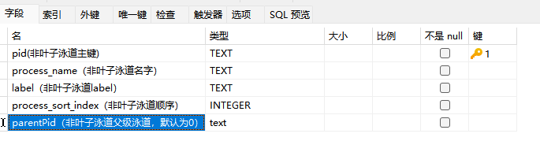
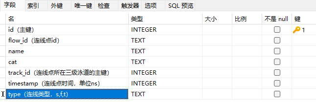
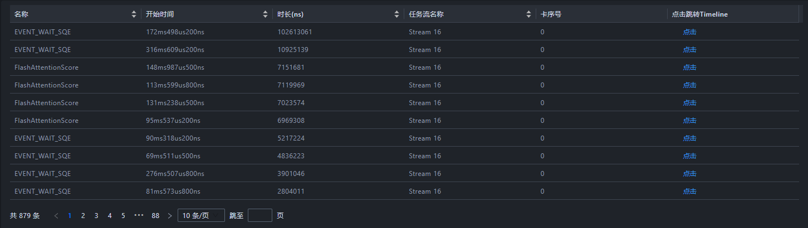
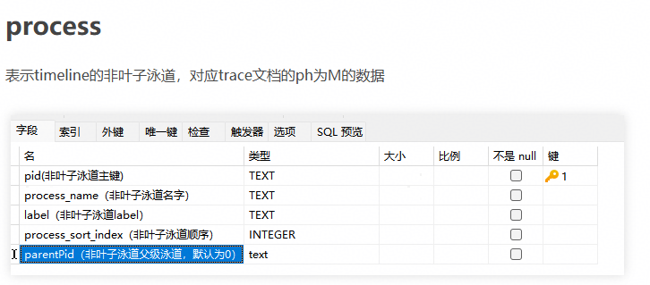
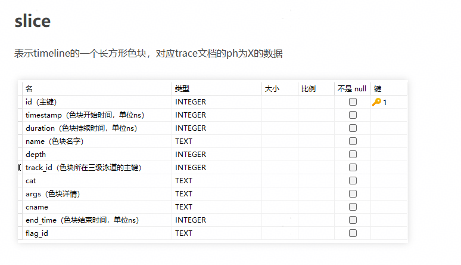
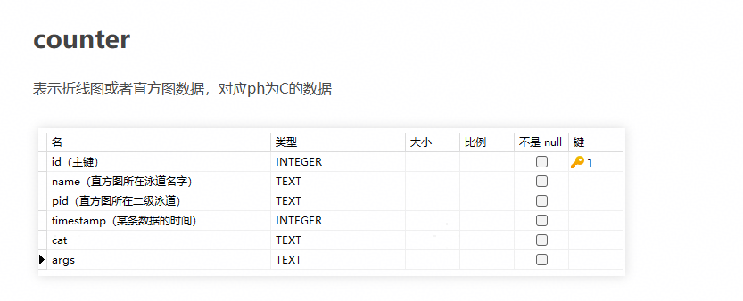

# **Development Guide**

<!-- md-trans-meta sourceCommit=49122e1f1d6621e5b8a8bbc1c0fdae9583659f48 translatedAt=2026-08-12T11:43:00.418Z pushedAt=2026-08-12T11:57:31.106Z -->

## 1. Code Repository Directory Description

### 1.1 Top-Level Directory Structure

```text
​```
├── build                              # Build scripts
├── docs                               # Project documentation
├── e2e                                # End-to-end test cases
├── modules                            # Frontend modules
│   ├── build                          # Frontend build scripts
│   ├── cluster                        # Overview & communication
│   ├── compute                        # Operator tuning
│   ├── framework                      # Core frontend framework (base functionality)
│   ├── leaks                          # Memory leak detection
│   ├── lib                            # Shared libraries
│   ├── memory                         # Memory management
│   ├── memory-on-chip                 # On-chip memory
│   ├── operator                       # Operator module
│   ├── reinforcement-learning         # Reinforcement learning
│   ├── statistic                      # Serving tuning
│   ├── timeline                       # Timeline visualization
│   └── triton                         # Triton integration
├── platform                           # Base platform (Rust/Tauri)
├── plugins                            # Plugins
├── scripts                            # Utility scripts
└── server                             # Backend service
    ├── build                          # Build scripts
    ├── cmake                          # CMake configuration
    ├── src                            # Backend source
    │   ├── channel                    # Network communication
    │   ├── defs                       # Global definitions
    │   ├── entry/server/bin           # Program entry points
    │   ├── protocol                   # Message definitions
    │   ├── modules                    # Business modules
    │   │   ├── base                   # Shared module base classes
    │   │   ├── global                 # Global messaging
    │   │   ├── timeline               # Timeline message processing
    │   │   │   ├── core               # Core processing logic
    │   │   │   ├── handler            # Message handlers
    │   │   │   └── protocol           # Message format conversion
    │   │   └── ...                    # Other business modules
    │   ├── server                     # Server services
    │   ├── test                       # Backend developer tests
    │   └── utils                      # Utilities
    └── third_party                    # Third-party dependencies
​```
```

### 1.2 Frontend Module Description

| Folder Name | Corresponding Module |
| --- | --- |
| cluster | Summary and Communication |
| compute | Operator Tuning |
| framework | Basic Functions (Micro-Frontend Base) |
| leaks | Memory Leak Detection |
| memory | Memory |
| operator | Operator |
| reinforcement-learning | Reinforcement Learning |
| statistic | Service-Oriented Tuning |
| timeline | Timeline |

### 1.3 Developer Documentation Map

It is recommended to read the developer documentation in the following order:

| Scenario | Recommended Reading |
| --- | --- |
| First-time development | 2. Quickly Setting Up and Running the Tool in Linux Environment and 4. Testing the Tool in this document |
| Adding a frontend/backend module | 3.1 New Module Development in this document |
| Adding or maintaining a Timeline unit | 3.2 Adding a Unit in DB Scenarios in this document, [TrackRender](./design/TrackRender.md), [Timeline](./design/Timeline.md) |
| Maintaining the overview and communication modules | [Summary](./design/Summary.md), [Communication](./design/Communication.md) |
| Maintaining the memory module | [Memory](./design/Memory.md), [Device Memory Analysis](./design/support_device_memory_analysis.md), [Snapshot Analysis](./design/support_snapshot_analysis.md) |
| Maintaining the operator and operator tuning modules | [Operator](./design/Operator.md), [Compute](./design/Compute.md) |

When reading design documents, first verify whether the code paths, interface commands, and data structures in the documents are still consistent with the source code. If you modify interfaces, data fields, or page interactions, update the corresponding design documents accordingly.

## 2. Quickly Setting Up and Running the Tool in Linux Environment

MindStudio Insight is a cross-platform tool. This document uses the **Linux development environment** as the main line to describe the local development, debugging, and submission process. For Windows, macOS, CLion toolchain configuration, and packaging environment preparation on each platform, see [Development Environment Setup](./environment_setup.md).

### 2.1 Preparing Basic Dependencies

The following tools are recommended for local Linux development:

| Software Name | Version Requirement | Purpose |
| --- | --- | --- |
| git | No special requirement | Code retrieval and submission |
| Node.js | v18.20.8+ | Frontend development and build |
| pnpm | Use a version compatible with the lockfile | Frontend package management |
| Python | 3.11+ | Utility scripts, pre-commit, third-party dependency preprocessing |
| CMake | 3.16–3.20 | Backend project build and compilation |
| GCC/G++ or Clang | Use the stable version of the OS | Backend compilation |
| Ninja | No special requirement; installation recommended | Backend build |

Ubuntu/Debian:

```bash
sudo apt update
sudo apt install -y git python3 python3-pip cmake ninja-build build-essential
```

openEuler/CentOS/RHEL:

```bash
sudo yum install -y git python3 python3-pip cmake ninja-build gcc gcc-c++
```

It is recommended to install Node.js through the official installation package, system package manager, or version management tool, and ensure that the version v18.20.8+ is used.

After installation, run the following commands for verification:

```bash
git --version
node --version
python3 --version
cmake --version
g++ --version
ninja --version
```

### 2.2 Obtaining the Code

It is recommended to fork the code to your personal repository first, then clone it locally, and configure the official repository as upstream.

```bash
git clone https://gitcode.com/<your-user>/msinsight.git
cd msinsight
git remote add upstream https://gitcode.com/Ascend/msinsight.git
git remote -v
```

If you only need read-only access to the source code, you can also directly clone the official repository.

```bash
git clone https://gitcode.com/Ascend/msinsight.git
cd msinsight
```

### 2.3 Initializing Backend Dependencies

Before performing backend build for the first time or reloading the CMake project using an IDE, you need to download and preprocess third-party dependencies. Ensure that the network is accessible before executing this step. If you are in a proxy environment, configure the proxy or mirror sources for tools such as git, pip, and npm/pnpm in advance.

```bash
cd server/build
python3 download_third_party.py
python3 preprocess_third_party.py
```

### 2.4 Building and Starting the Backend

In the `server/build` directory, run the backend build script.

```bash
python3 build.py build
```

The build output is located in the `server/output/linux-<Architecture>/bin` directory, where `<Architecture>` is typically `x86_64` or `aarch64`. When starting `profiler_server`, it is recommended to explicitly specify the WebSocket port to avoid conflicts with an already running msInsight desktop app on the local machine. 

```bash
cd ../output/linux-$(uname -m)/bin
./profiler_server --wsPort=9000
```

To debug the backend in CLion, open the `server` directory, reload the CMake project, and run the `profiler_server` target, configuring `--wsPort=9000` in the startup parameters. If the msInsight desktop app is already running on the local machine, it is recommended to close the app or use a port in the range of `9050` to `9099`.

### 2.5 Installing and Starting the Frontend

Install pnpm and frontend dependencies:

```bash
npm install -g pnpm
cd modules
pnpm install
```

MindStudio Insight adopts a modular frontend design. The `framework` module is the basic functional module, and other modules can be started and loaded on demand. At least the `framework` module must be started first:

```bash
cd framework
pnpm start
```

To debug a specific business module, open a new terminal, navigate to the corresponding module directory, and run:

```bash
pnpm start
```

After both the frontend and backend are started, visit `http://localhost:5174` in a browser to open MindStudio Insight in the development environment.

### 2.6 Configuring pre-commit

pre-commit is a code quality control tool based on Git hooks. The project requires enabling pre-commit locally to complete code verification and format normalization before submission.

```bash
python3 -m pip install pre-commit
pre-commit install
```

Check staged files before submission:

```bash
git add <Modified files>
pre-commit run
```

To check all files in the repository:

```bash
pre-commit run --all-files
```

During the check, formatting issues (such as code indentation and line breaks) are automatically fixed. After the fix, you need to run `git add <Modified files>` again. For errors that cannot be automatically fixed, manually resolve them based on the prompts. Staged `js/jsx/ts/tsx` files in the frontend `modules` directory will undergo ESLint checks during the pre-commit phase. pre-commit only checks staged files and cannot replace the full `cd modules && pnpm lint` check in CI.

### 2.7 Local Build Entry

After initializing the basic dependencies, backend third-party dependencies, and frontend dependencies in the Linux environment, you can run the local build script in the project root directory:

```bash
cd build
python3 build.py
```

The artifacts are located in the `out` directory under the project root. Building on Windows and macOS requires additional preparation of Rust, platform runtimes, packaging tools, and an integrated Python interpreter. For details, see [Development Environment Setup](./environment_setup.md#5-local-packaging-environment).

## 3. Development Process

### 3.1 New Module Development

#### 3.1.1 Frontend

**1. Adding a New Module Directory**

Create a new module in the `modules` directory. Refer to the following directory structure:

```text
.
├── modules
│   ├── framework
│   ├── new_module
│   │   ├── src
│   │   │   ├── assets
│   │   │   ├── components
│   │   │   ├── connection
│   │   │   ├── store
│   │   │   ├── theme
│   │   │   ├── units
│   │   │   ├── App.tsx
│   │   │   ├── index.tsx
│   │   │   └── index.css
│   │   ├── craco.config.js
│   │   ├── tsconfig.json
│   │   └── package.json
│   └── package.json
```

**2. Build Configuration**

`craco.config.js`:

```js
const { webpackCfg, configureConfig } = require("../build-config");

const path = require("path");

const libPath = path.resolve(__dirname, "../lib/src");
const echartsPath = require.resolve("echarts");

module.exports = {
  devServer: {
    port: 3001,
    open: false,
    client: {
      overlay: {
        runtimeErrors: (error) => {
          // Prevent the UI from displaying the error: ResizeObserver loop completed with undelivered notifications
          return !error?.message.includes("ResizeObserver");
        },
      },
    },
  },
  webpack: {
    alias: webpackCfg.alias,
    configure: (webpackConfig) => {
      return configureConfig(webpackConfig, [libPath, echartsPath]);
    },
  },
};
```

**3. Basic Scripts Configuration**

`package.json`:

```json
{
    "scripts": {
        "start": "cross-env NODE_OPTIONS=--openssl-legacy-provider craco start",
        "build": "cross-env NODE_OPTIONS=--openssl-legacy-provider NODE_ENV=production GENERATE_SOURCEMAP=false CI=false craco build",
        "build:dev": "cross-env GENERATE_SOURCEMAP=true CI=false craco build",
        "..." : "// Custom configuration."
    }
}
```

**4. Essential Modules in src**

**Theme**

`theme/index.ts`:

```ts
export { themeInstance } from "@insight/lib/theme";
export type { ThemeItem } from "@insight/lib/theme";
```

**Connection**

`connection/index.ts`:

```ts
import { ClientConnector } from "@insight/lib/connection";
export default new ClientConnector({
  getTargetWindow: (): any[] => [window.parent],
  module: [new_module_request_name],
});
```

Other parts are customized based on the actual requirements of the new module.

**5. Adding the New Module (microservice) to the Main Service**

In the `moduleConfig.ts` file of the framework module, configure the new module in `modulesConfig`.

```ts
{
    name: [new_module],   // Microservice name of the new module, user-defined
    requestName: [new_module_request_name], // Module name for frontend-backend interaction, agreed upon with the backend
    attributes: {
        src: isDev ? 'http://localhost:[new_port]/' : './plugins/[new_module]/index.html', // Local development port, assigned by yourself
    },
    isDefault: true, // Whether to display the microservice by default
    // ... Other configuration conditions
}
```

**6. Adding the Properties of the New Module in the `ModuleConfig` Interface**

**Code source:** `modules/framework/src/moduleConfig.ts`

```ts
export interface ModuleConfig {
    name: string;
    requestName: Lowercase<string>;
    attributes: IframeHTMLAttributes<HTMLIFrameElement>;
    isDefault?: boolean;
    isCluster?: boolean;
    isCompute?: boolean;
    isLeaks?: boolean;
    isIE?: boolean;
    isRL?: boolean;
    hasCachelineRecords?: boolean;
    isOnlyTraceJson?: boolean;
    isHybridParse?: boolean;
    // Add the properties of the new module here
}
```

**7. Adding New Module Handling in the Data Update Scenario**

**Code source:** `modules/framework/src/components/TabPane/Index.tsx`

```tsx
export function updateDataScene(data: Record<string, any>): void {
    const sceneInfo = {
        // Add the new module here for corresponding data update.
        isCluster: data.isCluster ?? false,
        isReset: data.reset ?? false,
        isIpynb: data.isIpynb ?? false,
        isBinary: data.isBinary ?? false,
        hasCachelineRecords: data.hasCachelineRecords ?? false,
        isOnlyTraceJson: data.isOnlyTraceJson ?? false,
        instrVersion: data.instrVersion ?? -1,
        isLeaks: data.isLeaks ?? false,
        isIE: data.isIE ?? false,
        isRL: false,
        isHybridParse: data.isCluster && data.isIE,
    };
    updateSession(sceneInfo);
}

// Add the new module here for corresponding tab change handling.
useEffect(() => {
    if (session.isBinary === null && session.isCluster === null) {
        return;
    }
    setScene(session.scene);
    setDataCompose({ hasCachelineRecords: session.hasCachelineRecords, isRL: session.isRL });
}, [session.isBinary, session.isCluster, session.hasCachelineRecords, session.isOnlyTraceJson, session.isIE, session.isLeaks, session.isRL, session.isHybridParse]);
```

**8. Adding the New Module Scenario in the Session Class**

**Code source:** `modules/framework/src/entity/session.ts`

```ts
// Scene: Data scenarios: Default, Cluster, Operator Tuning, Leaks, trace.json file only.
export type Scene = 'Default' | 'Cluster' | 'Compute' | 'OnlyTraceJson' | 'IE' | 'Leaks' | 'RL' | 'HybridParse';

export class Session {
    isCluster: boolean | null = false;
    isBinary: boolean | null = false;
    isIE: boolean | null = false;
    isReset: boolean = false;
    isFullDb: boolean = false;
    isOnlyTraceJson: boolean = false;
    isLeaks: boolean = false;
    isRL: boolean = false;
    isHybridParse: boolean = false;
    hasCachelineRecords: boolean = false;
    instrVersion: number = -1;
    // Add the new module scene attribute here.

    get scene(): Scene {
        let scene: Scene;
        if (this.isHybridParse) {
            scene = 'HybridParse';
        } else if (this.isOnlyTraceJson) {
            scene = 'OnlyTraceJson';
        } else if (this.isLeaks) {
            scene = 'Leaks';
        } else if (this.isBinary) {
            scene = 'Compute';
        } else if (this.isCluster) {
            scene = 'Cluster';
        } else if (this.isIE) {
            scene = 'IE';
        } else {
            scene = 'Default';
        }
        return scene;
    }
    // ...
}
```

**9. Adding Query Interfaces and Chinese/English Translations in the Common Module**

**Code source:** `modules/lib/src/connection/index.ts`

```ts
// Write the query interface of the new module in connection.
```

**Code source:** <code>modules/lib/src/i18n/index.ts</code>

```ts
// The Chinese-English switching of the new module is managed by the common module.
import xxxEn from './xxx/en.json';
import xxxZh from './xxx/zh.json';

export const resources = {
    enUS: {
        ...en,
        ...frameworkEn,
        ...xxxEn,
    },
    zhCN: {
        ...zh,
        ...frameworkZh,
        ...xxxZh,
    },
};
```

**10. Build Script Update**

**Code source:** <code>build/build.py</code>

Post-build cleanup for the new module:

```python
def clean():
    out = os.path.join(PROJECT_PATH, Const.OUT_DIR)
    if os.path.exists(out):
        shutil.rmtree(out)
    ascend_insight = os.path.join(PROJECT_PATH, Const.PRODUCT_DIR)
    if os.path.exists(ascend_insight):
        shutil.rmtree(ascend_insight)
    framework_dist = os.path.join(PROJECT_PATH, Const.MODULES_DIR, Const.FRAMEWORK_DIR, 'build')
    if os.path.exists(framework_dist):
        shutil.rmtree(framework_dist)
    # Add your new module here.
    modules = ['cluster', 'memory', 'timeline', 'compute', 'jupyter', 'operator', 'lib', 'statistic', 'leaks',
               'reinforcement-learning']
    for module in modules:
        build_dir = os.path.join(PROJECT_PATH, Const.MODULES_DIR, module, Const.BUILD_DIR)
        if os.path.exists(build_dir):
            shutil.rmtree(build_dir)
```

Name and build of the new module:

```python
# Add your module and its corresponding module name here.
MODULES_MAP = {
    'cluster': 'Cluster',
    'reinforcement-learning': 'RL',
    'memory': 'Memory',
    'operator': 'Operator',
    'compute': 'Compute',
    'statistic': 'Statistic',
    'leaks': 'Leaks',
    'timeline': 'Timeline',
}
```

#### 3.1.2 Backend

**1. Backend Module Directory Structure**

```text
server
├── src
│   └── modules
│       └── xxx_module
│           ├── database
│           │   ├── xxxBase.h
│           │   └── xxxBase.cpp
│           ├── handler
│           └── protocol
```

**2. Protocol Handling**

**Code source:** `server/msinsight/include/base/ProtocolUtil.h`

Write JSON protocol handling and response passing here:

```c++
struct JsonResponse : public Response {
    explicit JsonResponse(const std::string &command) : Response(command) {}
    [[nodiscard]] virtual std::optional<document_t> ToJson() const = 0;
};

struct Event : public ProtocolMessage {
    explicit Event(const std::string &e) : event(e)
    {
        type = ProtocolMessage::Type::EVENT;
    }
    ~Event() override = default;
    std::string event;
    bool result = false;
};

struct JsonEvent : public Event {
    explicit JsonEvent(const std::string &e) : Event(e) {}
    [[nodiscard]] virtual std::optional<document_t> ToJson() const = 0;
};

class ProtocolUtil {
public:
    ProtocolUtil() = default;
    virtual ~ProtocolUtil() = default;

    void Register();
    void UnRegister();

    std::unique_ptr<Request> FromJson(const json_t &requestJson, std::string &error);
    std::optional<document_t> ToJson(const Response &response, std::string &error);
    std::optional<document_t> ToJson(const Event &event, std::string &error);

    static bool SetRequestBaseInfo(Request &request, const json_t &json);
    static void SetResponseJsonBaseInfo(const Response &response, document_t &json);
    static void SetEventJsonBaseInfo(const Event &event, document_t &json);

    template <class SubRequest>
    static std::unique_ptr<Request> BuildRequestFromJson(const json_t &json, std::string &error)
    {
        static_assert(std::is_same_v<std::unique_ptr<Request>, decltype(SubRequest::FromJson(json, error))>,
                      "SubRequest must have a static FromJson method returning std::unique_ptr<Request>");
        return SubRequest::FromJson(json, error);
    }

    static std::optional<document_t> CommonResponseToJson(const Response &response)
    {
        try {
            const auto& jsonResponse = dynamic_cast<const JsonResponse&>(response);
            return jsonResponse.ToJson();
        } catch (const std::bad_cast& e) {
            return std::nullopt;
        }
    }
    // ...
};
```

**3. CMake Configuration**

**Code source:** `server/src/CMakeLists.txt`

```cmake
# new Module
include_directories(${SRC_HOME_DIR}/modules/xxx)
include_directories(${SRC_HOME_DIR}/modules/xxx/xxx)

# new Module
aux_source_directory(${SRC_HOME_DIR}/modules/xxx xxx_xxx_SRC)

list(APPEND DIC_MODULES_SRC_LIST
        ${DIC_MODULES_XXX_SRC}
        ${DIC_MODULES_XXX_XXX_SRC}
)
```

**4. Register Plugin**

**Code source:** `server/src/modules/Plugins.cpp`

```cpp
/*
 * -------------------------------------------------------------------------
 * This file is part of the MindStudio project.
 * Copyright (c) 2025 Huawei Technologies Co.,Ltd.
 *
 * MindStudio is licensed under Mulan PSL v2.
 * You can use this software according to the terms and conditions of the Mulan PSL v2.
 * You may obtain a copy of Mulan PSL v2 at:
 *
 *          https://license.coscl.org.cn/MulanPSL2
 *
 * THIS SOFTWARE IS PROVIDED ON AN "AS IS" BASIS, WITHOUT WARRANTIES OF ANY KIND,
 * EITHER EXPRESS OR IMPLIED, INCLUDING BUT NOT LIMITED TO NON-INFRINGEMENT,
 * MERCHANTABILITY OR FIT FOR A PARTICULAR PURPOSE.
 * See the Mulan PSL v2 for more details.
 * -------------------------------------------------------------------------
 */
#include "AdvisorPlugin.h"
#include "GlobalPlugin.h"
#include "MemoryPlugin.h"
#include "OperatorPlugin.h"
#include "SourcePlugin.h"
#include "SummaryPlugin.h"
#include "TimelinePlugin.h"
#include "JupyterPlugin.h"
#include "CommunicationPlugin.h"
#include "IEPlugin.h"
#include "MemoryDetailPlugin.h"
// Add new module related information here
namespace Dic::Module {
    Core::PluginRegister ADVISOR_PLUGIN(std::make_unique<Advisor::AdvisorPlugin>());
    Core::PluginRegister GLOBAL_PLUGIN(std::make_unique<Global::GlobalPlugin>());
    Core::PluginRegister MEMORY_PLUGIN(std::make_unique<Memory::MemoryPlugin>());
    Core::PluginRegister OPERATOR_PLUGIN(std::make_unique<Operator::OperatorPlugin>());
    Core::PluginRegister SOURCE_PLUGIN(std::make_unique<Source::SourcePlugin>());
    Core::PluginRegister SUMMARY_PLUGIN(std::make_unique<Summary::SummaryPlugin>());
    Core::PluginRegister TIMELINE_PLUGIN(std::make_unique<Timeline::TimelinePlugin>());
    Core::PluginRegister JUPYTER_PLUGIN(std::make_unique<Jupyter::JupyterPlugin>());
    Core::PluginRegister COMM_PLUGIN(std::make_unique<Communication::CommunicationPlugin>());
    Core::PluginRegister IE_PLUGIN(std::make_unique<IE::IEPlugin>());
    Core::PluginRegister MEMORY_DETAIL_PLUGIN(std::make_unique<MemoryDetail::MemoryDetailPlugin>());
}
```

**5. Adding Module Name Constant**

**Code source:** `server/src/modules/defs/ProtocolDefs.h`

```cpp
// Add new module information here.
const std::string MODULE_XXX = "xxx";

const std::string MODULE_SUMMARY = "summary";
const std::string MODULE_COMMUNICATION = "communication";
const std::string MODULE_MEMORY = "memory";
const std::string MODULE_MEMORY_DETAIL = "memory_detail";
const std::string MODULE_OPERATOR = "operator";
const std::string MODULE_SOURCE = "source";
const std::string MODULE_ADVISOR = "advisor";
```

**6. Full DB Query (If Involved)**

**Code source:** `server/src/modules/full_db/database/FullDbParser.cpp`

```cpp
// If full DB queries are involved, add queries here
void FullDbParser::Reset()

void FullDbParser::BuildProfilingInitTask(
    std::shared_ptr<std::vector<std::future<void>>> &futures,
    std::string &dbId,
    std::unique_ptr<ThreadPool> &pool)
```

### 3.2 Adding a Unit in DB Scenario

#### 3.2.1 Frontend

**1. Configure the DB scenario display module.**

`framework/src/moduleConfig.ts`:

```ts
[
    {
        name: 'Timeline',
        requestName: 'timeline',
        attributes: {
            src: isDev ? 'http://localhost:3000/' : './plugins/Timeline/index.html',
        },
        isIE: true,
    },
    {
        name: 'Statistic',
        requestName: 'statistic',
        attributes: {
            src: isDev ? 'http://localhost:3006/' : './plugins/Statistic/index.html',
        },
        isIE: true,
    }
]
```

**2. Import DB file.**

Select a DB file and send the parsing command `import/action`.

**Code source:** `modules/framework/src/units/Project.tsx`

```ts
async function handleProjectAction({ action, project, isConflict, selectedFileType, selectedFilePath, selectedRankId }:
{action: ProjectAction;project: Project;isConflict: boolean;selectedFileType?: LayerType;selectedFilePath?: string;selectedRankId?: string}): Promise<void> {
    // ...
    runInAction(async() => {
        // ...
        const res = await addDataPath(newProject, action, isConflict, session);
        // ...
    });
    // ...
}
```

**3. The main service sends the parsing result to the microservice.**

**Code source:** `modules/framework/src/centralServer/server.ts`

```ts
export const addDataPath = async function(project: Project, action: ProjectAction, isConflict: boolean, session: Session): Promise<boolean> {
    // ...
    connector.send({
        event: 'remote/import',
        body: { dataSource: transformTimelineDataSource(project), importResult: res, switchProject },
        target: 'plugin',
    });
    // ...
}
```

**4. The microservice processes data to generate card/unit menus**.

**Code source:** `modules/timeline/src/connection/handler.ts`

```ts
export const importRemoteHandler: NotificationHandler = async (data): Promise<void> => {
    // ...
    runInAction(() => {
        initUnitInfo(session, result, dataSource, isNeedResetRankId); // Initialize the unit information based on the parsing result.
    });
    sendSessionUpdate(result, session);
    // ...
}
```

**5. The microservice receives and processes the card parsing result.**

**Code source:** `modules/timeline/src/connection/handler.ts`

```ts
export const parseSuccessHandler: NotificationHandler = (data): void => {
    // ...
}
```

**6. The microservice obtains unit data and draws the unit chart.**

**Code source:** `modules/timeline/src/insight/units/AscendUnit.tsx`

```tsx
const ThreadUnit = unit<ThreadMetaData>({
    name: 'Thread',
    pinType: 'copied',
    chart: chart()
})
```

#### 3.2.2 Backend

##### Create a `profiler.db` file


##### Table Structure Description

**1. slice (leaf unit color block data)**

Represents a rectangular color block on the timeline, corresponding to data with `ph` of `X` in the trace document.


```sql
CREATE TABLE slice (
    id INTEGER PRIMARY KEY AUTOINCREMENT,
    timestamp INTEGER,
    duration INTEGER,
    name TEXT,
    depth INTEGER,
    track_id INTEGER,
    cat TEXT,
    args TEXT,
    cname TEXT,
    end_time INTEGER,
    flag_id TEXT
);
```

**2. process (non-leaf unit)**

Represents a non-leaf unit of the timeline, corresponding to data with `ph` as `M` in the trace document.



```sql
CREATE TABLE "process" (
    "pid" TEXT,
    "process_name" TEXT,
    "label" TEXT,
    "process_sort_index" INTEGER,
    "parentPid" TEXT,
    PRIMARY KEY ("pid")
);
```

**3. thread (leaf unit)**

Represents a leaf unit of the timeline, corresponding to data with `ph` as `M` in the trace document.


**4. counter (line chart/histogram data)**

Represents line chart or histogram data, corresponding to data where `ph` is `C`.


```sql
CREATE TABLE counter (
    id INTEGER PRIMARY KEY AUTOINCREMENT,
    name TEXT,
    pid TEXT,
    timestamp INTEGER,
    cat TEXT,
    args TEXT
);
```

**5. flow (connection line data)**

Represents connection lines, corresponding to data where `ph` is `s`, `f`, or `t`.



```sql
CREATE TABLE flow (
    id INTEGER PRIMARY KEY AUTOINCREMENT,
    flow_id TEXT,
    name TEXT,
    cat TEXT,
    track_id INTEGER,
    timestamp INTEGER,
    type TEXT
);
```

**6. dataTable (tables displayed as pure tables)**

Indicates which tables need to be displayed as pure tables.



Table field description:


```sql
CREATE TABLE "data_table" (
    "id" INTEGER NOT NULL,
    "name" TEXT,
    "view_name" TEXT,
    PRIMARY KEY ("id")
);
```

**7. data_link (field association relationship)**

Indicates the association relationship between a field and a field in a certain table.


```sql
CREATE TABLE "data_link" (
    "source_name" TEXT NOT NULL,
    "target_table" TEXT NOT NULL,
    "target_name" TEXT NOT NULL,
    PRIMARY KEY ("source_name")
);
```

**8. translate (Chinese-English translation)**

Indicates the Chinese-English translation of the text.


```sql
CREATE TABLE "translate" (
    "key" TEXT NOT NULL,
    "value_en" TEXT,
    "value_zh" TEXT,
    PRIMARY KEY ("key")
);
```

##### Adding Data Operation Example

- Adding a non-leaf unit: Add second-level unit data in the process table.

  

- Adding a leaf unit

  

- Add color block data in the leaf unit

  

- Add color block associations

  

- Add histogram data

  

##### Drag the created `profiler.db` into Insight to view the new unit

## 4. Test Guide

### 4.1 Backend Developer Test

#### 4.1.1 Test Framework and Build Mode

- Test framework: GoogleTest + GMock

- Mock framework: mockcpp (automatically built via ExternalProject)

- Two build modes:

| Build Mode | Trigger Method | Coverage Instrumentation | Applicable Scenario |
| --- | --- | --- | --- |
| Full test build | Adding `-D_PROJECT_TYPE=test` in CMake | Enabled (-fprofile-arcs -ftest-coverage) | CI pipeline and coverage statistics |
| Development test build | CMake environment variable `DEV_TYPE=true` | Not enabled | Local development quick verification |

In CLion settings, add the environment variable `DEV_TYPE=true` in the **CMake** options under **Build, Execution, Deployment**, and then reload CMake to build the `insight_test` executable.

The full test build (with coverage) must be executed on Linux:

```bash
cd build
python3 build.py test
```

#### 4.1.2 Test Directory Structure

The backend DT code is located in `server/src/test`:

```text
server/src/test/
├── CMakeLists.txt                  # CMake configuration for tests
├── TestSuit.h / TestSuit.cpp       # Main integration test fixture
├── DatabaseTestConst.h / .cpp      # Shared DDL constants for table creation
├── DatabaseTestCaseMockUtil.h      # In-memory SQLite utilities
├── FullDbTestSuit.cpp              # Full database parsing integration test fixture
├── framework/
│   ├── DtFramework.h               # Test data path resolution utilities
│   └── DtFramework.cpp
├── mock/
│   └── MockDatabase.h              # Generic in-memory SQLite mock factory
├── modules/                        # Module‑organized test code
├── fuzz/                           # Fuzz testing (built only when _PROJECT_TYPE=fuzz)
├── performance/                    # Performance benchmark tests
├── server/                         # WebSocket server tests
├── test_data/                      # Test fixture data
└── utils/                          # Utility function tests
```

#### 4.1.3 Test Naming Conventions

- **Fixture naming**: `<ModuleName><ComponentName>Test`, such as `MemoryHandlerTest` and `CommunicationProtocolRequestTest`

- **Test case naming**:
- Functional style: `QueryComputeStatisticsData` (describes the function under test)
  
- Scenario style: `TestFindSliceByAllocationTimeHandlerWhenTimelineNotExist` (describes the test scenario)
  
- Parameter validation style: `OperatorDetailsParamTest` (validates parameter boundaries)
  
- Security injection style: `TestOpenDbWithPathInject` (validates security issues such as path injection)
  
- **Stateless utility test**: Use `TEST(UtilName, FunctionName)`, for example, `TEST(StringUtil, IntToString)`

#### 4.1.4 Steps for Adding a New Test Case

1. **Create a test file**: Create a test file under `server/src/test/modules/<module name>/`, for example, `<module name><component>Test.cpp`.

2. **Write test fixtures and cases**: Use the `TEST_F(FixtureName, CaseName)` macro to write them.

3. **Update CMakeLists.txt**: Add a new `aux_source_directory` entry in `server/src/test/CMakeLists.txt`.

4. **Build and run**: After reloading the CMake project, build `insight_test` and execute the test for verification.

**Common commands:**

```bash
# Run all tests
./insight_test

# Run a specific test suite or case
./insight_test --gtest_filter=TestSuit.*
./insight_test --gtest_filter=TestSuit.QueryComputeStatisticsData

# List all test case names
./insight_test --gtest_list_tests
```

For more usage, see the [GoogleTest official documentation](https://google.github.io/googletest/).

#### 4.1.5 Test Data Management

- Test data is located in the `server/src/test/test_data/` directory. Create module subdirectories as needed.

- Use the `DtFramework` tool to obtain the test data path:

  - `SRC_TEST_DATA`: data under `server/src/test/test_data/`

  - `ROOT_TEST`: data under the project root directory `test/`

- `TestSuit::SetUpTestSuite()` parses real profiler data such as `test_rank_0/` when the test suite is initialized.

#### 4.1.6 Coverage

- **Coverage requirements**: line coverage must reach **80%**, and branch coverage must reach **60%**.

- On Linux, run the following commands to generate coverage:

```bash
cd build
bash cpp_coverage.sh
```

- `cpp_coverage.sh` execution flow:

  1. Preprocess third-party dependencies.

  2. Use `-D_PROJECT_TYPE=test` to build `insight_test` with coverage instrumentation.

  3. Run `insight_test` to generate `.gcda` coverage data.

  4. Use lcov to filter out the `include/test/third_party` directory and generate coverage information.

  5. Use genhtml to generate an HTML report.

- Coverage report path: `build_llt/output/cpp_coverage/result/index.html`

- Note: The lcov/genhtml report generation feature is temporarily disabled, but coverage data files (.gcda) are still generated normally.

### 4.2 GUI Developer Test

#### 4.2.1 Test Framework and Configuration

- Test framework: Playwright 1.57 + TypeScript

- Test code is located in the project root directory `e2e/`.

- Configuration file: `e2e/playwright.config.ts`. Key configurations are as follows:

| Configuration Item | Value | Description |
| --- | --- | --- |
| timeout | 60s | Timeout for a single test case |
| workers | 1 | Number of parallel workers |
| baseURL | `http://localhost:5174` | Frontend development service address |
| headless | true | Default headless mode |
| viewport | 1920x1080 | Browser viewport size |
| webServer[0] | profiler_server --wsPort=9000 | Automatically starts the backend service |
| webServer[1] | framework npm run staging | Automatically starts the frontend development service |

Playwright automatically starts the frontend and backend services, so manual startup is not required. The `profiler_server` binary path is automatically selected based on the operating system:

- Windows: `../server/output/win_mingw64/bin/profiler_server.exe`

- macOS: `../server/output/darwin/bin/profiler_server`

- Linux: `../server/output/linux-{arch}/bin/profiler_server`

#### 4.2.2 Test Directory Structure

```text
e2e/src/
├── components/                    # Reusable UI component operation wrappers
├── page-object/                   # Page Object Model classes
├── tests/                         # Test cases
│   ├── smoke/                     # Smoke tests
│   ├── full-test/                 # Full regression tests
│   ├── joint-test/                # Integration tests
│   └── performance-test/          # Performance benchmark tests
└── utils/                         # Test utility functions
```

#### 4.2.3 Steps for Adding a GUI Test Case

1. **Creating a Page Object** (skip if the module already exists): Create a module page class under `e2e/src/page-object/`, encapsulating iframe positioning and module operations.

2. **Creating a spec file**: Create a `.spec.ts` file in the corresponding subdirectory under `e2e/src/tests/`.

3. **Defining a test Fixture**: Extend Playwright's `test` object to inject the Page Object and WebSocket connection.

```typescript
interface TestFixtures {
    timelinePage: TimelinePage;
    ws: Promise<WebSocket>;
}
const test = baseTest.extend<TestFixtures>({
    timelinePage: async ({ page }, use) => {
        const timelinePage = new TimelinePage(page);
        await use(timelinePage);
    },
    ws: async ({ page }, use) => {
        const ws = setupWebSocketListener(page);
        await use(ws);
    },
});
```

1. **Write test cases**: Use `test.describe` to organize test case groups, `test.beforeEach` for data preparation, and `test` to write specific scenarios.

2. **Export** the new Page Object **in `page-object/index.ts.`**

3. **Run verification.**

#### 4.2.4 Test Data Management

- The test data path is defined in `e2e/src/utils/constants.ts`.

- Main data directories:

| Constant | Path | Purpose |
| --- | --- | --- |
| File path constant | `C:\msinsight-quick-start-demo\GUI-test-data\` | Full local test data on Windows |
| `SMOKE_DATA` | `../../test/st/level2` | CI smoke test data (relative path) |
| `JOINT_DATA` | `/home/profiler_performance/task` | Joint test data (Linux path) |

- Test data can be downloaded from the data repository: `https://gitcode.com/zhangruoyu2/msinsight-quick-start-demo.git`

- Modify the path in `constants.ts` to the actual local path.

#### 4.2.5 Common Test Commands

```bash
# Install dependencies (first run).
cd e2e
npm install
npx playwright install

# Run the full regression test
npm run test

# Run the smoke test
npm run test:smoke

# Run the joint debugging test
npm run jointTest

# Run a single test file
npm run test timeline.spec.ts

# Run a single test case (filter by name)
npm run test -- -g test_unitsExpandAndCollapse_when_click

# UI interactive mode (convenient for debugging and locating)
npm run test -- --ui

# View the HTML test report
npx playwright show-report

# Automatically record test cases (Codegen)
npx playwright codegen localhost:5174 --viewport-size=1920,1080

# Update snapshots
npx playwright test tests/full-test/framework.spec.ts -u

# Lint check
npm run lint
```

#### 4.2.6 Pre-smoke Test (CI Environment)

##### Linux Environment (Docker)

- It is recommended to use the official Playwright Docker image ([reference](https://playwright.dev/docs/docker)), with the image tag `v1.57.0-jammy`.

- After creating a container from the image, install other dependencies required by the frontend and backend.

```bash
bash build/mindstudio_insight_gui_set_environment.sh
```

- After completing the dependency installation, run the pre-smoke test.

```bash
bash build/mindstudio_insight_gui_run.sh
```

- `gui_set_environment.sh`: Installs gcc-11, cmake, ninja, pnpm, and Python dependencies.

- `gui_run.sh`: Build backend → Build frontend → Execute `npm run test:smoke`

##### Windows Environment

- For dependency installation, refer to the [GUI Guide](https://gitcode.com/Ascend/msinsight/blob/master/e2e/README.md)

```bash
cd e2e
npm run test:smoke
```

#### 4.2.7 Notes

1. **WS connection conflict:** Close any open msInsight pages in the browser before running, as only one WS connection can be active at a time.
2. **Headless mode consistency:** Snapshots must be generated in headless mode (`headless: true`); results differ between headless and headed modes.
3. **Locator selection:** Prefer stable locators such as `getByRole()`, `getByText()`, or `getByTestId()`; avoid using Emotion‑generated class names.
4. **Avoid hard waits:** Do not use `page.waitForTimeout()`; synchronize via WS events or element visibility instead.
5. **Narrow snapshot scope:** Keep snapshot assertions scoped to functional impact areas as tightly as possible, and move the mouse off the region before capturing (`page.mouse.move(0, 0)`).
6. **Serial execution:** Tests run in parallel by default. To enforce sequential execution, set `test.describe.configure({ mode: 'serial' })` inside `test.describe`.

### 5. PR Submission Process

### 5.1 Pre-Submission Checks

Before submitting a PR, ensure the following:

1. The code passes local compilation and build.

2. **All pre-commit code checks pass** (see [2.6 Configuring pre-commit](#26-configuring-pre-commit)).

3. Backend code changes must include DT, with line coverage >= 80% and branch coverage >= 60%.

4. Frontend and backend code changes must pass the pre-smoke test (see [4.2.6 Pre-smoke Test (CI Environment)](#426-pre-smoke-test-ci-environment))

5. For changes involving user-facing features, update the corresponding user and developer documentation accordingly.

6. Each PR must contain only **one commit** (if there are multiple commits, squash them first).

### 5.2 PR Title Specification

Add an appropriate prefix before the PR title to indicate the PR type:

| Prefix | Description |
| --- | --- |
| `[Platform]` | Base platform related |
| `[Common]` | Common module related |
| `[Timeline]` | System tuning - Timeline related |
| `[Memory]` | System tuning - Memory related |
| `[Operator]` | System tuning - Operator related |
| `[MemScope]` | System tuning - memory details related |
| `[Cluster]` | System tuning - cluster details related |
| `[RL]` | System tuning - reinforcement learning related |
| `[Advisor]` | System tuning - expert advice related |
| `[Source]` | Operator tuning related |
| `[Servitization]` | Servitization tuning related |

Example: `[Timeline]`: Added xxx unit support.

### 5.3 PR Template

Follow the [Pull Request template](https://gitcode.com/Ascend/msinsight/blob/master/.gitcode/PULL_REQUEST_TEMPLATE.md) and fill in the following:

- **PR description**: Describes the changes and the reasons for them, and associates the issue number (if any).

- **User-facing changes**: Whether API, UI, or other behavioral changes are included.

- **Feature verification**: Self-test screenshots and UT coverage description.

### 5.4 Squashing Multiple Commits into a Single Commit

If the current branch contains multiple commits, use one of the following methods to squash them into a single commit.

**Method 1: Interactive Rebase (Recommended)**

```bash
# View the most recent commits to be squashed
git log --oneline -n 3

# Start interactive rebase (replace N with the number of commits to squash)
git rebase -i HEAD~N

# In the editor: keep the first pick, change the rest to squash(s)
# After saving, write the merged commit message

# Force push (only for your own feature branch)
git push --force-with-lease origin your-branch-name
```

**Method 2: reset + create a new commit**

```bash
# Obtain the latest target branch
git fetch origin main

# Soft-reset to the main branch (changes retained in the staging area)
git reset --soft origin/main

# Commit all changes as a single new commit
git commit -m "feat: concise description of your change"

# Force push
git push --force-with-lease origin your-branch-name
```

> Warning: Never perform a force push on a shared or protected branch.

### 5.5 Submitting and Merging Code

1. After completing the preparations above, submit the code.

2. Enter the `compile` command to trigger the bot build pipeline.

3. After the pipeline build passes, contact the [repository management and maintenance members](https://gitcode.com/Ascend/msinsight/member) for review and merging.

### 5.6 Finding Issues to Contribute To

- [good-first-issue](https://gitcode.com/Ascend/msinsight/issues?state=all&scope=all&page=1&categorysearch=%255B%257B%22field%22:%22labels%22,%22value%22:%255B%257B%22id%22:22797,%22name%22:%22good-first-issue%22%257D%255D,%22label%22:%22good-first-issue%22%257D%255D)

- [help-wanted](https://gitcode.com/Ascend/msinsight/pulls?categorysearch=%255B%257B%22field%22:%22labels%22,%22value%22:%255B%257B%22id%22:22796,%22name%22:%22help-wanted%22%257D%255D,%22label%22:%22help-wanted%22%257D%255D&state=opened&scope=all&page=1)

- [RFC](https://gitcode.com/Ascend/msinsight/issues?state=all&scope=all&page=1&categorysearch=%255B%257B%22field%22:%22labels%22,%22value%22:%255B%257B%22id%22:25328,%22name%22:%22rfc%22%257D%255D,%22label%22:%22rfc%22%257D%255D)

- [Roadmap](https://gitcode.com/Ascend/msinsight/issues?state=all&scope=all&page=1&categorysearch=%255B%257B%22field%22:%22labels%22,%22value%22:%255B%257B%22id%22:22807,%22name%22:%22roadmap%22%257D%255D,%22label%22:%22roadmap%22%257D%255D)
