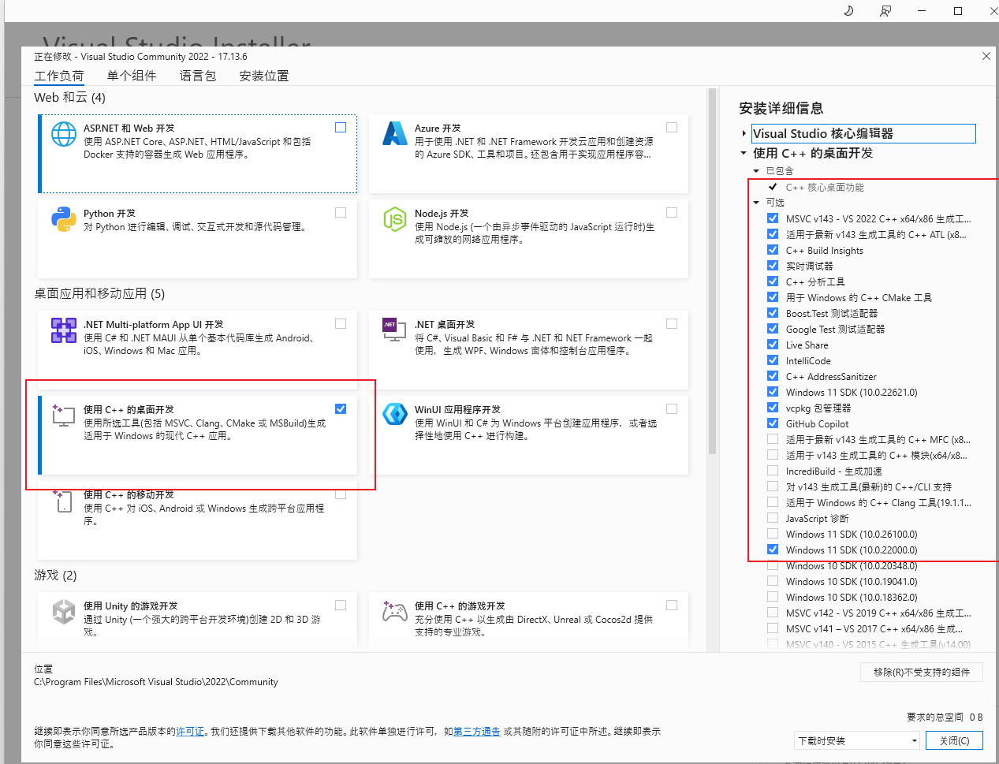

# Development Environment Setup

<!-- md-trans-meta sourceCommit=15d5f12e75e6b3c1fadecbe62afd5d79b7c887e6 translatedAt=2026-08-12T11:43:19.884Z pushedAt=2026-08-12T11:57:31.110Z -->

This document describes how to prepare the MindStudio Insight development environment, covering Linux, Windows, and macOS platforms. MindStudio Insight is a cross-platform tool, and the [Development Guide](./develop_guide.md) uses Linux as the primary platform by default to illustrate the rapid development workflow. Windows and macOS developers can refer to the corresponding platform sections in this document to complete environment preparation.

> **NOTE** This document is intended for source code development and local debugging, and is not equivalent to the user installation guide. For user-side installation, see [MindStudio Insight Installation Guide](../install_guide/mindstudio_insight_install_guide.md).

## 1. General Preparation

### 1.1 Code Pull

It is recommended to fork the code to your personal repository first, then clone it locally, and configure the official repository as upstream.

```bash
git clone https://gitcode.com/<your-user>/msinsight.git
cd msinsight
git remote add upstream https://gitcode.com/Ascend/msinsight.git
git remote -v
```

If you only need read-only access to the source code, you can also clone the official repository directly:

```bash
git clone https://gitcode.com/Ascend/msinsight.git
cd msinsight
```

### 1.2 Initializing Backend Third-party Dependencies

Before performing backend compilation for the first time or regenerating the CMake build directory, you need to download and preprocess third-party dependencies.

Linux/macOS:

```bash
cd server/build
python3 download_third_party.py
python3 preprocess_third_party.py
```

Windows:

```powershell
cd server\build
python download_third_party.py
python preprocess_third_party.py
```

> **NOTE** Ensure network connectivity before executing this step. If you are in a proxy environment, configure the proxy or mirror source for tools such as git, pip, and npm/pnpm in advance.

### 1.3 Installing Frontend Dependencies

```bash
npm install -g pnpm
cd modules
pnpm install
```

### 1.4 Configuring the pre-commit Code Checking Tool

pre-commit is a code quality control tool based on Git hooks. The project requires pre-commit to be enabled locally to complete code verification and format normalization before committing.

Install pre-commit.

```bash
python3 -m pip install pre-commit
```

On Windows, if <code>python3</code> is unavailable, you can use:

```powershell
python -m pip install pre-commit
```

Register Git hooks in the project root directory.

```bash
pre-commit install
```

Check staged files before commit.

```bash
git add <Modified files>
pre-commit run
```

To check all files in the repository:

```bash
pre-commit run --all-files
```

During the check, formatting issues (such as code indentation and line breaks) are automatically fixed. After the fix, run `git add <Modified files>` again. For errors that cannot be automatically fixed, resolve them manually based on the prompts.

Staged `js/jsx/ts/tsx` files under the frontend `modules` directory are checked by ESLint during the pre-commit phase. pre-commit only checks staged files and cannot replace the full `cd modules && pnpm lint` check in CI.

## 2. Linux Development Environment

Linux is the default local development environment used in this development guide.

### 2.1 Environment Dependencies

| Software Name | Version Requirements | Purpose |
| --- | --- | --- |
| git | No special requirements | Code Pull and Commit |
| Node.js | v18.20.8+ | Frontend development and build |
| pnpm | It is recommended to use a version compatible with the lockfile. | Frontend package management |
| Python | 3.11+ | Tool Scripts, pre-commit, third-party dependency preprocessing |
| CMake | 3.16~3.20 | Backend project build and compilation |
| GCC/G++ or Clang | Use the stable version of the operating system. | Backend compilation |
| Ninja | No special requirements | Backend build |

### 2.2 Dependency Installation Example

Ubuntu/Debian:

```bash
sudo apt update
sudo apt install -y git python3 python3-pip cmake ninja-build build-essential
```

openEuler/CentOS/RHEL:

```bash
sudo yum install -y git python3 python3-pip cmake ninja-build gcc gcc-c++
```

`Node.js` can be installed via the official installation package, system package manager, or version management tool. Ensure that the version v18.20.8+ is used.

### 2.3 Environment Verification

```bash
git --version
node --version
pnpm --version
python3 --version
cmake --version
g++ --version
ninja --version
```

After completing the environment preparation, you can return to [Development Guide](./develop_guide.md) to continue with the Linux quick build and run steps.

## 3. Windows Development Environment

The Windows platform uses the MinGW toolchain for backend compilation.

### 3.1 Basic Development Dependencies

| Software Name | Version Requirements | Purpose |
| --- | --- | --- |
| git | No special requirements | Code Pull and Commit |
| Node.js | v18.20.8+ | Frontend development and build |
| pnpm | It is recommended to use a version compatible with the lockfile. | Frontend package management |
| Python | 3.11+ | Tool Scripts, pre-commit, third-party dependency preprocessing |
| MinGW | 10.0+ (msvcrt version); 11.0+ recommended for packaging | Backend compilation |
| CMake | 3.16~3.20 | Backend project build and compilation |

### 3.2 Backend Toolchain Configuration

Before backend compilation, ensure that the `bin` directory of MinGW has been added to the system PATH and that CMake can use the MinGW compiler. After the initial configuration is complete, first finish [initializing backend third-party dependencies](#12-initializing-backend-third-party-dependencies), and then regenerate the CMake build directory.

### 3.3 Environment Verification

```powershell
git --version
node --version
pnpm --version
python --version
cmake --version
g++ --version
```

### 3.4 Packaging Environment Entry

If you only perform source code development and local debugging, completing the above basic dependencies is sufficient. If you need to build a Windows installation package, you must also prepare Rust, Windows Runtime, Ninja, NSIS, and an integrated Python interpreter. For details, see [Local Packaging Environment](#5-local-packaging-environment).

## 4. macOS Development Environment

On macOS, the backend compilation uses the Clang toolchain.

### 4.1 Basic Development Dependencies

| Software Name | Version Requirements | Purpose |
| --- | --- | --- |
| git | No special requirements | Code Pull and Commit |
| Node.js | v18.20.8+ | Frontend development and build |
| pnpm | It is recommended to use a version compatible with the lockfile. | Frontend package management |
| Python | 3.11+ | Tool Scripts, pre-commit, third-party dependency preprocessing |
| Clang | 15 | Backend compilation |
| CMake | 3.16~3.20 | Backend project build and compilation |
| Ninja | No special requirements | Backend build |

Basic compilation tools can be installed via Xcode command line tools:

```bash
xcode-select --install
```

Node.js, pnpm, Python, CMake, and Ninja can be installed via official installation packages or package managers.

### 4.2 Environment Verification

```bash
git --version
node --version
pnpm --version
python3 --version
cmake --version
clang --version
ninja --version
```

### 4.3 Packaging Environment Entry

If you only need source code development and local debugging, completing the basic dependencies above is sufficient. If you need to build a macOS installation package, you must also prepare Rust, cargo-bundle, dmgbuild, and an integrated Python interpreter. For details, see [Local Packaging](#5-local-packaging-environment).

## 5. Local Packaging Environment

Local packaging builds the frontend, backend, and desktop base simultaneously. Linux packaging reuses basic development dependencies; Windows and macOS packaging also require additional platform runtimes, packaging tools, and an integrated Python interpreter.

### 5.1 Linux Packaging

After completing the initialization of Linux basic dependencies, backend third-party dependencies, and frontend dependencies, execute the following commands under the project root directory:

```bash
cd build
python3 build.py
```

Artifacts are located under the `out` directory of the project root directory.

### 5.2 Windows Packaging

#### 5.2.1 Environment Dependencies

| Software Name | Version | Purpose |
| --- | --- | --- |
| rust | 1.89 | Base Compilation and Build |
| Windows 11 SDK | 10.0.22000.0+ | Basic development runtime for Windows platform |
| MSVC | v143 | Basic development runtime for Windows platform |
| MinGW | 10.0+ (msvcrt version); 11.0+ recommended | Backend Compiler |
| Ninja | No requirement | Backend Compilation |
| CMake | 3.16~3.20 | Backend Build |
| NSIS | No requirement | Installer packaging software |
| nsProcess plugin | unicode support | Check for duplicate running instances |
| Node.js | v18.20.8+ | Frontend Build |
| pnpm | No requirement | Frontend Build |
| Python | 3.11+ | Cluster Tool Packaging |

Python runtime dependencies:

```text
click
tabulate
networkx
jinja2
PyYAML
tqdm
prettytable
ijson
xlsxwriter>=3.0.6
sqlalchemy
numpy<=1.26.4
pandas<=2.3.2
psutil
```

Python development dependencies:

```shell
pyinstaller
```

#### 5.2.2 Packaging Steps

1. Enter the `server/build` directory under the project root directory and run:

   ```powershell
   python download_third_party.py
   python preprocess_third_party.py
   ```

2. MindStudio Insight integrates a Python interpreter into the Windows packaging artifacts. Manually install a Python interpreter (including pip) on the build environment. Python 3.12.10 is recommended. Set the environment variable `MINDSTUDIO_INSIGHT_PYTHON_INTERPRETER` to the Python interpreter installation directory. This directory must contain `python.exe`, for example, `D:\xxx\python`.

3. Enter the `build` directory under the project root directory and run:

   ```powershell
   python build.py
   ```

Artifacts are located in the `out` directory under the project root directory.

#### 5.2.3 Dependency Installation

- Windows Runtime (Windows 11 SDK and MSVC): Download Visual Studio Installer, double-click to open it, and select the following dependencies (the default selection is usually sufficient):

  

- MinGW: Download from [WinLibs](https://www.winlibs.com/), and select version 11.0 or later. After downloading, extract the archive, and add the `bin` directory under the extracted MinGW path to the system PATH environment variable:

  

  Verify the installation: run `g++ -v` in the terminal. The version information should be output normally.

- nsProcess plugin: first install NSIS (must be installed under `C:\Program Files (x86)`). Obtain the compressed package from [NsProcess plugin](https://nsis.sourceforge.io/NsProcess_plugin), place `Include/nsProcess.h` into `C:\Program Files (x86)\NSIS\Include`, and place `Plugin/nsProcess.dll` and `Plugin/nsProcessw.dll` into `C:\Program Files (x86)\NSIS\Plugins\x86-unicode`.

- Rust: can be installed via [rustup](https://www.rust-lang.org). Verify with `rustc --version` and `cargo --version`.

- Ninja: download the binary from the [official website](https://ninja-build.org) or install via a package manager. Verify with `ninja --version`.

- Node.js: install the LTS version (v18.20.8+) from the [official website](https://nodejs.org). Verify with `node --version`.

- pnpm: Run `npm install -g pnpm`. Verify with `pnpm --version`.

- Python: Install 3.11+ from the [official website](https://www.python.org). Check "Add Python to PATH". Verify with `python --version`.

### 5.3 macOS Packaging

#### 5.3.1 Environment Dependencies

| Software Name | Version | Purpose |
| --- | --- | --- |
| rust | 1.89 | Base compilation and build |
| cargo-bundle | N/A | Packaging |
| Ninja | N/A | Backend compilation |
| Node.js | v18.20.8+ | Frontend build |
| pnpm | N/A | Frontend build |
| Python | 3.11+ | Cluster tool packaging |
| Clang | 15 | Compilation |
| CMake | 3.16~3.20 | Backend build |
| dmgbuild | N/A | dmg artifact build |

Python runtime dependencies:

```text
click
tabulate
networkx
jinja2
PyYAML
tqdm
prettytable
ijson
xlsxwriter>=3.0.6
sqlalchemy
numpy<=1.26.4
pandas<=2.3.2
psutil
dmgbuild
```

Python development dependencies:

```shell
pyinstaller
```

#### 5.3.2 Packaging Steps

**Step 1. Preprocess build dependencies**.

```bash
cd server/build
python3 download_third_party.py
python3 preprocess_third_party.py
```

**Step 2. (Optional) Specify APP signing certificate.**

> NOTE Ensure that you have read and understood the license requirements.

When building and packaging the Insight macOS ARM version, the resulting APP is signed with a macOS developer certificate. You can configure the signing certificate via an environment variable. If not specified, an ad-hoc certificate is used by default, which may prevent the artifact from being distributed over the network (local debugging and running are not affected).

- Certificate prerequisites: An Apple Developer certificate valid for signing is required, and it must be correctly imported into the keychain (such as the login keychain `~/Library/Keychains/login.keychain`).

- Configure the certificate via environment variables, supporting either the certificate name or certificate ID.

```bash
export INSIGHT_APP_SIGN="insight_cert"
security unlock-keychain -p {You password} ~/Library/Keychains/login.keychain
```

**Step 3: Set the environment variable for the integrated Python interpreter**.

MindStudio Insight integrates a Python interpreter into the macOS packaging artifacts.

- Step 1: Manually install a portable Python interpreter (including pip) on the build environment. Python version 3.12.10 is recommended.

- Step 2: Set the environment variable `MINDSTUDIO_INSIGHT_PYTHON_INTERPRETER` to the Python interpreter installation directory. This directory must contain `bin/python3`, for example `/Users/xxx/python`. If the Python version is not 3.12, manually modify the `version` variable value in `server/build/build.py`.

"Portable" means that the Python folder on machine A can be copied to machine B and used directly. Some Python versions on macOS depend on dynamic libraries under `/Library`, so you must ensure that the installed version is portable.

**Step 4. Execute the packaging script**.

Enter the `build` directory under the project root directory and execute:

```bash
python3 build.py
```

Artifacts are located in the `out` directory under the project root directory.
