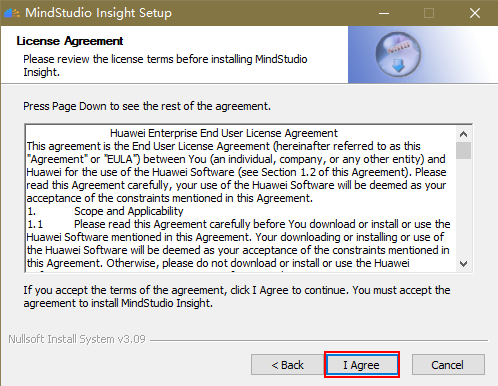
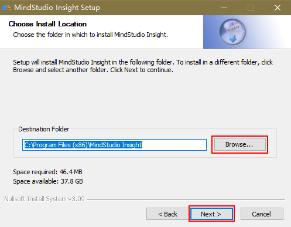
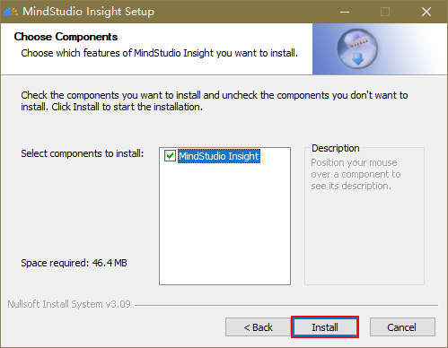
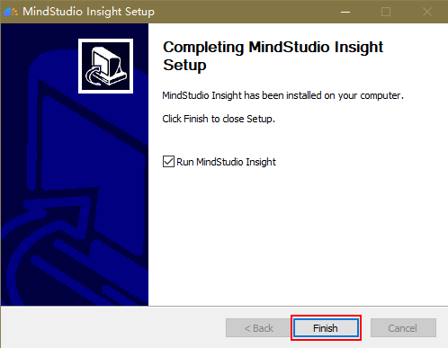
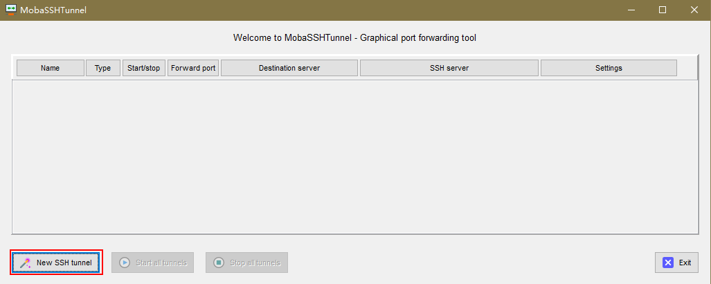
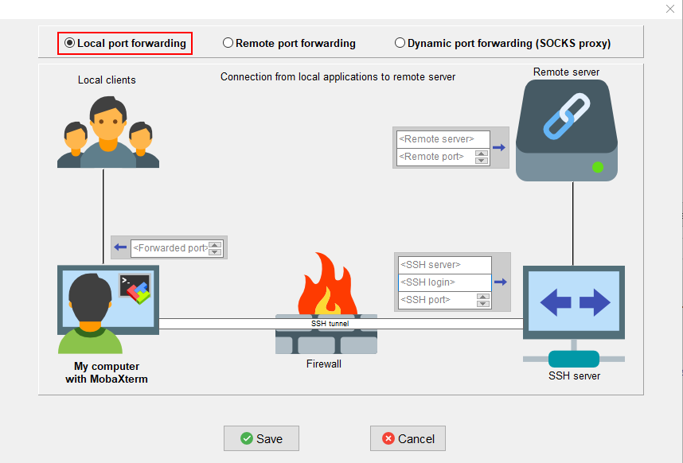
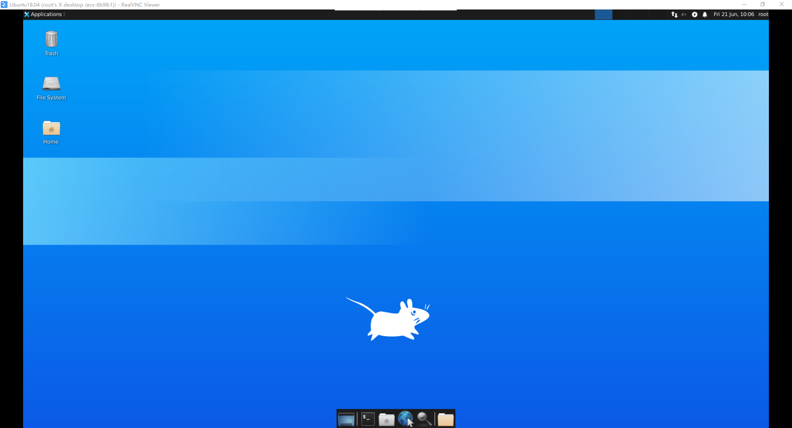
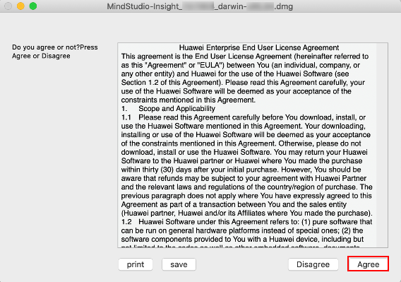
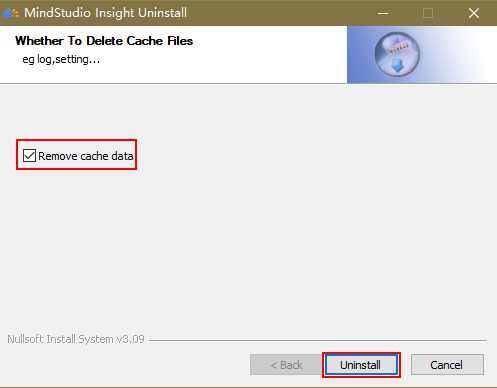

# **MindStudio Insight Installation Guide**

<!-- md-trans-meta sourceCommit=5026f5636b5a83b070ea810f3db20a00975088fc translatedAt=2026-08-12T11:44:35.541Z pushedAt=2026-08-12T11:57:31.139Z -->

## Installation Description

MindStudio Insight is a visual tuning tool for developers. It presents profile data in easy-to-understand charts such as timing diagrams and heatmaps, helping developers quickly identify performance bottlenecks and complete performance optimization. This document mainly describes how to install MindStudio Insight.

MindStudio Insight supports installation and use on Windows, Linux, and macOS systems, and also supports installation and use as a JupyterLab plugin.

## Preparing Software Packages

### Package Download

**MindStudio Insight 26.1.0 is now available.**

You can select the corresponding software package for your operating system to download. By downloading this software, you agree to the terms and conditions of the [Huawei Enterprise Business End User License Agreement (EULA)](https://e.huawei.com/cn/about/eula).

### Software Packages by Platform

<details>
<summary>Windows</summary>

[MindStudio Insight Windows](https://gitcode.host/Ascend/msinsight/releases/download/tag_MindStudio_26.1.0.B100_002/MindStudio-Insight_26.1.0_win.exe)

</details>

<details>
<summary>Linux</summary>

[MindStudio Insight Linux (x86_64)](https://gitcode.host/Ascend/msinsight/releases/download/tag_MindStudio_26.1.0.B100_002/MindStudio-Insight_26.1.0_linux_x86_64.zip)

[MindStudio Insight Linux (aarch64)](https://gitcode.host/Ascend/msinsight/releases/download/tag_MindStudio_26.1.0.B100_002/MindStudio-Insight_26.1.0_linux_aarch64.zip)

</details>

<details>
<summary>macOS</summary>

[MindStudio Insight macOS (arm64 Apple Silicon)](https://gitcode.host/Ascend/msinsight/releases/download/tag_MindStudio_26.1.0.B100_002/MindStudio-Insight_26.1.0_macos_aarch64.dmg)

[MindStudio Insight macOS Version (x86_64 Intel Chip)](https://gitcode.host/Ascend/msinsight/releases/download/tag_MindStudio_26.1.0.B100_002/MindStudio-Insight_26.1.0_macos_x86_64.dmg)

</details>

<details>
<summary>JupyterLab Plugin</summary>

[MindStudio Insight JupyterLab Extension (x86_64)](https://gitcode.host/Ascend/msinsight/releases/download/tag_MindStudio_26.1.0.B100_002/mindstudio_insight_jupyterlab-26.1.0-py3-none-linux_x86_64.whl)

[MindStudio Insight JupyterLab Extension (aarch64)](https://gitcode.host/Ascend/msinsight/releases/download/tag_MindStudio_26.1.0.B100_002/mindstudio_insight_jupyterlab-26.1.0-py3-none-linux_aarch64.whl)

</details>

<details>
<summary>Image</summary>

[MindStudio Insight Image (ubuntu_x86_64)](https://gitcode.com/Ascend/msinsight/releases/download/tag_MindStudio_26.1.0.B100_002/MindStudio-Insight_docker_image_26.1.0-ubuntu22.04_py3.10_x86_64.tar)

[MindStudio Insight Image (ubuntu_aarch64)](https://gitcode.com/Ascend/msinsight/releases/download/tag_MindStudio_26.1.0.B100_002/MindStudio-Insight_docker_image_26.1.0-ubuntu22.04_py3.10_aarch64.tar)

[MindStudio Insight Image (openEuler_x86_64)](https://gitcode.com/Ascend/msinsight/releases/download/tag_MindStudio_26.1.0.B100_002/MindStudio-Insight_docker_image_26.1.0-openeuler24.03_py3.11_x86_64.tar)

[MindStudio Insight Image (openEuler_aarch64)](https://gitcode.com/Ascend/msinsight/releases/download/tag_MindStudio_26.1.0.B100_002/MindStudio-Insight_docker_image_26.1.0-openeuler24.03_py3.11_aarch64.tar)

</details>

### Detailed Package List

Click [MindStudio Insight Release](https://gitcode.com/Ascend/msinsight/releases), confirm the version information, and obtain the packages listed in [**Table 1** Package list](#package-list).

>[!NOTE]
>
> The `{version}` in the package names in the table is a version number placeholder. Replace it with the current release version number when downloading. For version number details, see [Release Notes](../release_notes/release_notes.md).

**Table 1** Package list<a id="package-list"></a>

| Package                                                      | Description                                                  |
| ------------------------------------------------------------ | ------------------------------------------------------------ |
| MindStudio-Insight_*{version}*_win.exe                       | MindStudio Insight package for Windows, an integrated development environment with a GUI. |
| MindStudio-Insight_*{version}*_linux-*{arch}*.zip            | MindStudio Insight package for Linux.                        |
| MindStudio-Insight_*{version}*_macos-*{arch}*.dmg            | MindStudio Insight package for macOS, an integrated development environment with a GUI. |
| MindStudio-Insight_docker_image_*{version}*-*{os}*_*{Python_version}*_*{arch}*.tar | Docker image package of MindStudio Insight.                  |
| mindstudio_insight_jupyterlab-*{version}*-py3-none-*{platform}*.whl | Package for installation based on JupyterLab.                |

### Software Integrity Verification

To prevent software packages from being maliciously tampered with during transmission or storage, download the corresponding .sha256 file for integrity verification when downloading a software package.

Click [MindStudio Insight Release](https://gitcode.com/Ascend/msinsight/releases) to obtain the hash verification file (.sha256) for the corresponding software package, and perform integrity verification on the [downloaded software package](#package-download). If the verification fails, do not use the software package. For support and services, seek help on the forum or submit a technical ticket.

The specific verification method is as follows:

1. Obtain the SHA256 checksum of the software package locally.

   On Windows, run the following command to obtain the SHA256 checksum of the corresponding software package:

   ```powershell
   certutil -hashfile Software_package_name SHA256
   ```

   On macOS, run the following command to obtain the SHA256 checksum of the corresponding software package:

   ```shell
   shasum -a 256 Software_package_name
   ```

   On Linux, run the following command to obtain the SHA256 checksum of the corresponding software package:

   ```bash
   sha256sum Software_package_name
   ```

2. Open the corresponding hash verification file and compare the checksum in it with the obtained checksum (case-insensitive). If they match, the software package has passed the integrity verification.

<br>

## Installing MindStudio Insight

<details>
<summary>Installation on Windows</summary>

<h3 id="installation-operation-windows">Installation Operation (Windows)</h3>
**Environment Preparation**

The installation and visualization of the MindStudio Insight tool have certain requirements for the Windows system and device configuration. See [**Table 1** System Configuration Requirements](#system-configuration-requirements).

**Table 1** System configuration requirements<a id="system-configuration-requirements"></a>

| Category   | Requirement                           | Description                                                  |
| ---------- | ------------------------------------- | ------------------------------------------------------------ |
| System     | Windows 10 64-bit operating system    | -                                                            |
| Memory     | 16 GB or above recommended            | For large model cluster scenarios, the amount of data loaded is large. |
| Disk space | 30 GB or above free space recommended | Used to store database files generated when loading profile data. |

**Installation Steps**

1. Double-click the **MindStudio-Insight\__\{version\}_\_win.exe** package to start installing MindStudio Insight.

2. The MindStudio Insight Setup screen appears. Click **Next**, as shown in [**Figure 1** Setup](#Setup).

   **Figure 1** Setup<a id="Setup"></a>
   

3. On the **License Agreement** page, click **I Agree**, as shown in [**Figure 2** License-Agreement](#License-Agreement).

   **Figure 2** License-Agreement<a id="License-Agreement"></a>
   

4. Select the installation path for MindStudio Insight and click **Next**, as shown in [**Figure 3** Select Installation Path](#select-installation-path).

   **Figure 3** Select Installation Path<a id="select-installation-path"></a>
   

   >[!NOTE]
   >
   > The default installation directory is **C:\Program Files (x86)\MindStudio Insight**. If you choose to install to another directory, to prevent other users from modifying the runtime files, you need to revoke the modification permission of ordinary users. Right-click the selected folder, choose **Properties** > **Security**, and modify user permissions on the **Security** tab.

5. Select the installation component MindStudio Insight and click **Install**, as shown in [**Figure 4**  Select installation components](#select-installation-components).

   **Figure 4**  Select installation components<a id="select-installation-components"></a>
   

6. Complete the MindStudio Insight installation and click **Finish**, as shown in [**Figure 5**  Complete installation](#complete-installation).<a id="6"></a>

   **Figure 5**  Complete installation <a id="complete-installation"></a>
   

7. Start MindStudio Insight.

   - If you selected **Run MindStudio Insight** in [6](#6), MindStudio Insight will start automatically after you click **Finish**.
   - If you did not select **Run MindStudio Insight**, after the installation is complete, double-click the MindStudio Insight shortcut icon on the desktop, or double-click **MindStudio-Insight.exe** in the installation directory to start the MindStudio Insight tool.

>[!NOTE]
>
> If a "Missing Dependencies" error dialog box appears when you run the MindStudio Insight tool after installation, see [Missing Dependencies Error Dialog Box When Running MindStudio Insight Tool](../support/faq.md#faq-missing-dependencies) for resolution.

</details>

<details>
<summary>Installation on Linux System</summary>

<h3 id="installation-operation-linux">Installation Operation (Linux)</h3>
<h4 id="overview">Overview</h4>
In the Linux environment, MindStudio Insight can be used in local mode or forwarding mode.

- Local mode

    In local mode, the server running the Linux OS is directly connected to an external monitor. The tool GUI is displayed on the OS desktop, which is similar to the scenario where a local Windows host is connected to a monitor. In this scenario, there is no delay of the tool GUI.

- Forwarding mode

    If no Linux server is available locally, you can connect to a remote Linux server and use X11, VNC, or xRDP to forward the desktop or software GUI on the remote Linux server to the local PC. For example, the app GUI on the Linux server is displayed on the local Windows desktop. You can use the forwarding capability of MindStudio Insight to implement GUI forwarding on the Linux server, which is convenient for developers. However, compared with the local mode, the forwarding mode is affected by network performance and may cause network delay. As a result, suspension may occur during tool installation and use.

This document describes the X11 and VNC forwarding modes. Developers can select one forwarding mode according to the actual situation. For details, see [**Table 1** Forwarding modes](#forwarding-modes). To install and use MindStudio Insight in forwarding mode, install the forwarding mode and software dependencies first. For details, see [Installing Dependencies](#installing-dependencies).

> [!NOTE] NOTE
> The VNC forwarding mode is recommended, which provides a smoother experience.

**Table 1** Forwarding modes<a id="forwarding-modes"></a>

|Forwarding Mode|Network Delay|Security|Remarks|
|--|--|--|--|
|X11|Relatively high|The underlying layer is based on the SSH security protocol.|It is mostly used in local area networks with good network conditions.|
|VNC|Relatively low|By default, the TCP protocol is used. You can use the SSH security protocol to ensure secure access.|It is more widely used and can be used on cross-city networks and VPN networks.|

**Setting Up the Environment**

In the Linux OS, the environment requirements for installing MindStudio Insight are described in [**Table 2** Environment requirements for installing MindStudio Insight](#environment-requirements-for-installing-mindstudio-insight).

**Table 2** Environment requirements for installing MindStudio Insight<a id="environment-requirements-for-installing-mindstudio-insight"></a>

|Type|Limitation|
|--|--|
|Hardware|- Memory: at least 4 GB (8 GB or above recommended)<br> - Minimum disk space: 6 GB|
|System requirement|- The glibc version must be 2.27 or later.<br> - The OS provides a built-in GUI desktop or supports X11 or VNC forwarding.|
|Supported OSs|OSs that use APT as the package management software:<br> - Ubuntu 18.04-x86_64/aarch64<br> - Ubuntu 20.04-x86_64/aarch64<br> - Ubuntu 22.04-x86_64/aarch64<br> - CentOS 8.2-x86_64/aarch64<br> - Debian 10.0<br> - Debian 10.8<br> OSs that use Yum or DNF as the package management software:<br> - EulerOS 2.8-aarch64<br> - EulerOS 2.12-aarch64<br> - openEuler 20.03-x86_64/aarch64<br> - openEuler 22.03 LTS-x86_64/aarch64<br> - openEuler 22.03 LTS<br> - openEuler 22.03 LTS SP4<br> - HCE 2.0<br> - CUlinux 3.0<br> - Kylin V10 SP3<br> - Euler 2.13(ARM)<br> - HCE 2.0.2503(x86)<br> - Tlinux 3.1 - kernel version 5.4<br> - BClinux 21.10 U4<br> - TencentOS Server 4.4_x86|

> [!NOTE] NOTE  
> When installing and using MindStudio Insight on a passthrough VM running the veLinux 5.15 system, you are advised to use the JupyterLab plugin to install MindStudio Insight. For details about how to install the JupyterLab plugin, see section "[JupyterLab Plugin Installation](#installation-operation-jupyterlab-plugin)".

<a id="installing-dependencies"></a>
<h4>Installing Dependencies</h4>
**Dependency List**

In the Linux environment, install related dependencies before installing MindStudio Insight. For details, see [**Table 1** Dependency list](#dependency-list).

<a id="dependency-list"></a>

| Dependency | Description |
|------------|-------------|
| `libwebkit2gtk-4.0-dev` | Required runtime library for MindStudio Insight display on Ubuntu systems. |
| `gtk3-devel` `webkit2gtk4.1-devel` | Required runtime libraries for MindStudio Insight display on CentOS systems. |
| `gtk3-devel` `webkit2gtk3-devel` | Required runtime libraries for MindStudio Insight display on EulerOS and openEuler systems. |
| `xterm` | Required dependency for X11 forwarding on all systems when using this display mode. |
| `x11-apps` | Required dependency for X11 forwarding on Ubuntu systems when using this display mode. |
| `xorg-x11-xauth` | Required dependency for X11 forwarding on CentOS, EulerOS, and OpenEuler systems when using this display mode. |
| `xfce4` | Required dependency for VNC forwarding on Ubuntu, CentOS, and OpenEuler systems when using this display mode. |
| `gnome-desktop` | Required dependency for VNC forwarding on EulerOS systems when using this display mode. |
| `click` | Python library dependency for the integrated `msprof-analyze` cluster analysis tool. See the [build.txt](https://gitcode.com/Ascend/msprof-analyze/blob/master/requirements/build.txt) file for version requirements. |
| `tabulate` | Python library dependency for the integrated `msprof-analyze` cluster analysis tool. See the [build.txt](https://gitcode.com/Ascend/msprof-analyze/blob/master/requirements/build.txt) file for version requirements. |
| `networkx` | Python library dependency for the integrated `msprof-analyze` cluster analysis tool. See the [build.txt](https://gitcode.com/Ascend/msprof-analyze/blob/master/requirements/build.txt) file for version requirements. |
| `jinja2` | Python library dependency for the integrated `msprof-analyze` cluster analysis tool. See the [build.txt](https://gitcode.com/Ascend/msprof-analyze/blob/master/requirements/build.txt) file for version requirements. |
| `PyYaml` | Python library dependency for the integrated `msprof-analyze` cluster analysis tool. See the [build.txt](https://gitcode.com/Ascend/msprof-analyze/blob/master/requirements/build.txt) file for version requirements. |
| `tqdm` | Python library dependency for the integrated `msprof-analyze` cluster analysis tool. See the [build.txt](https://gitcode.com/Ascend/msprof-analyze/blob/master/requirements/build.txt) file for version requirements. |
| `prettytable` | Python library dependency for the integrated `msprof-analyze` cluster analysis tool. See the [build.txt](https://gitcode.com/Ascend/msprof-analyze/blob/master/requirements/build.txt) file for version requirements. |
| `ijson` | Python library dependency for the integrated `msprof-analyze` cluster analysis tool. See the [build.txt](https://gitcode.com/Ascend/msprof-analyze/blob/master/requirements/build.txt) file for version requirements. |
| `xlsxwriter` | Python library dependency for the integrated `msprof-analyze` cluster analysis tool. See the [build.txt](https://gitcode.com/Ascend/msprof-analyze/blob/master/requirements/build.txt) file for version requirements. |
| `sqlalchemy` | Python library dependency for the integrated `msprof-analyze` cluster analysis tool. See the [build.txt](https://gitcode.com/Ascend/msprof-analyze/blob/master/requirements/build.txt) file for version requirements. |
| `numpy` | Python library dependency for the integrated `msprof-analyze` cluster analysis tool. See the [build.txt](https://gitcode.com/Ascend/msprof-analyze/blob/master/requirements/build.txt) file for version requirements. |
| `pandas` | Python library dependency for the integrated `msprof-analyze` cluster analysis tool. See the [build.txt](https://gitcode.com/Ascend/msprof-analyze/blob/master/requirements/build.txt) file for version requirements. |
| `psutil` | Python library dependency for the integrated `msprof-analyze` cluster analysis tool. See the [build.txt](https://gitcode.com/Ascend/msprof-analyze/blob/master/requirements/build.txt) file for version requirements. |

**Installing Dependencies**

1. Run the following commands to install Python-related dependencies.

    ```shell
    pip3 install click
    pip3 install tabulate
    pip3 install networkx
    pip3 install jinja2
    pip3 install PyYaml
    pip3 install tqdm
    pip3 install prettytable
    pip3 install ijson
    pip3 install "xlsxwriter>=3.0.6"
    pip3 install sqlalchemy
    pip3 install "numpy<=1.26.4"
    pip3 install "pandas<=2.3.2"
    pip3 install psutil
    ```

2. Configure the forwarding method and install dependencies required by the MindStudio Insight software package. You are advised to configure VNC and X11 for forwarding.

<h4 id="installing-vnc-forwarding-mode">Configuring VNC Forwarding Mode</h4>
Starting MindStudio Insight through VNC forwarding provides a smoother experience. Therefore, you are advised to use the VNC forwarding to use MindStudio Insight.

> [!NOTE] NOTE 
>
> - MindStudio Insight cannot be started through VNC in EulerOS 2.12.
> - This section is for reference only. For details about how to install VNC, see the [VNC Official Documentation](https://docs.redhat.com/en/documentation/red_hat_enterprise_linux/6/html/deployment_guide/chap-tigervnc#s2-starting-vncserver).

**Installing Dependencies**

1. Run the following command to install the libraries required for running MindStudio Insight.

    - Ubuntu and other OSs that use APT as the package management software

        ```shell
        sudo apt install -y libwebkit2gtk-4.0-dev
        ```

    - CentOS, EulerOS, openEuler, and other OSs that use Yum or DNF as the package management software

        1. Run the following command to query the webkit2gtk library file.

            ```shell
            sudo yum search webkit2gtk
            ```

            The command output is as follows:

            ```tex
            = Name and Summary match：webkit2gtk =====================================================================================
            webkit2gtk3-devel.aarch64 : Development files for webkit2gtk3
            webkit2gtk3-help.noarch : Documentation files for webkit2gtk3
            webkit2gtk3-jsc.aarch64 : JavaScript engine from webkit2gtk3
            webkit2gtk3-jsc-devel.aarch64 : Development files for JavaScript engine from webkit2gtk3
            ========================================================================================== Name match：webkit2gtk ===========================================================================================
            webkit2gtk3.aarch64 : GTK+ Web content engine library
            ========================================================================================= Summary match：webkit2gtk =========================================================================================
            libproxy-webkitgtk4.aarch64 : plugin for webkit2gtk3
            ```

        2. Based on the command output, run the following command to install the webkit2gtk library file:

            ```shell
            sudo yum install -y ${dependency_name}
            ```

            Where `dependency_name` is the name of the dependency file, which can be determined by referring to the command output. For example, as shown in the command output above, if `webkit2gtk3-devel` exists in the command output, the dependency file name here is `webkit2gtk3-devel`; if `webkit2gtk3-devel` does not exist in the command output, you need to find `webkit2gtk3`, and the dependency file name here is `webkit2gtk3`.

    >[!NOTE]
    >
    > EulerOS 2.12 is developed based on openEuler 22.03 LTS SP1. You need to configure the openEuler 22.03 LTS SP1 repository before running the installation command. For details about how to configure the openEuler repository, see [openEuler Software Repository Configuration](https://mirrors.huaweicloud.com/mirrorDetail/5ebe3408c8ac54047fe607f0?mirrorName=openEuler&catalog=os).

2. As the root user, execute the following command to install the desktop dependencies for MindStudio Insight forwarding through VNC.

    - Ubuntu and other OSs that use APT as the package management software

        ```shell
        apt-get install -y xfce4 xfce4-goodies
        ```

    - CentOS, EulerOS, openEuler, and other OSs that use Yum or DNF as the package management software
        1. Run the following command to check whether xfce exists:

            ```shell
            yum search xfce
            ```

            If the echo contains xfce-related information, execute the following command to install xfce.

            ```shell
            yum install -y xfce4*
            ```

            If the echo is "No match found", go to [2](#2_b).

        2. Run the following command to check whether gnome exists:<a id="2_b"></a>

            ```shell
            yum search gnome
            ```

            If the echo contains gnome-related information, run the following command to install gnome:

            ```shell
            yum install -y gnome*
            ```

3. Install the VNC Server.
    - Ubuntu and other OSs that use APT as the package management software

        ```shell
        apt-get install -y tightvncserver
        ```

    - CentOS, EulerOS, openEuler, and other OSs that use Yum or DNF as the package management software

        ```shell
        yum install -y tigervnc-server
        ```

**Setting Up the VNC Server**

1. Run the following command to set the password for the first VNC connection:

    ```shell
    vncserver
    ```

2. The echo is as follows. Enter the password as prompted.

    ```shell
    You will require a password to access your desktops.
    Password:Enter your password.
    Verify:Re-enter your password.
    ```

3. After entering the password, the following information is displayed. <a id="3"></a>

    ```ColdFusion
    Would you like to enter a view-only password (y/n)?
    ```

    Enter **n** as prompted. The following information is displayed, indicating that the startup script and default configuration are being created. The `x` value in the first line indicates the display number, which varies depending on the actual situation.

    ```ColdFusion
    New 'localhost.localdomain:x' desktop is localhost.localdomain:x
    Creating default startup script /home/xxx/.vnc/xstartup
    Creating default config /home/xxx/.vnc/config
    Starting applications specified in /home/xxx/.vnc/xstartup
    Log file is /home/xxx/.vnc/localhost.localdomain:3.log
    ```

4. Run the following command to stop the enabled VNC server:

    ```shell
    vncserver -kill :x
    ```

    > [!NOTE] NOTE
    > The `x` value here is the same as the `x` value displayed in the first line of step [3](#3).

5. Run `vi ~/.vnc/xstartup` to open the xstartup startup script, and add a new line of text at the end of the script to configure it. For the text content to be added, see [**Table 1** Text content](#text-content).

    **Table 1** Text content<a id="text-content"></a>

    |Installed Dependency|Text Content|
    |--|--|
    |xfce|startxfce4 &|
    |gnome|gnome-session &|

6. Run the `:wq!` command to save the script and exit.

**Starting the VNC Server**

Run the following command to start the VNC Server:

```shell
vncserver -localhost -geometry 1920x1080
```

> [!NOTE] NOTE
>
> - `localhost`: Starts the VNC service on the local host, which must be used together with [Port Forwarding](#port-forwarding). In a secure network environment, you can also skip using localhost and [Port Forwarding](#port-forwarding), and directly [connect to VNC Server locally](#connecting-to-vnc-server-locally) (not recommended).
> - `geometry 1920x1080`: Configures the VNC desktop resolution to 1920x1080. You can also configure it based on the resolution of your monitor.

**Port Forwarding**<a id="port-forwarding"></a>

Securely forward the Linux local host service to a Windows local port through an SSH tunnel.

1. Open the remote login tool and choose **Tools** \> **MobaSSHTunnel \(port forwarding\)**. MobaXterm is used as an example here.
2. Click **New SSH Tunnel** to create a new SSH configuration.

    **Figure 1**  Creating an SSH configuration  
    

3. Select **Local port forwarding** and configure the page information according to [**Table 2**  Configuring Local port forwarding page information](#configuring-local-port-forwarding-page-information).

    **Figure 2**  Local port forwarding  
    

    **Table 2**  Configuring Local port forwarding page information<a id="configuring-local-port-forwarding-page-information"></a>

    |Name|Description|Example|
    |--|--|--|
    |Remote server|Address of the Linux server.|127.0.0.1|
    |Remote port|Port of the Linux server. The value is 5900 plus the value of `x` (display number) set in the VNC Server.|5901|
    |SSH server|IP or URL address for the SSH connection.|192.168.25.38|
    |SSH login|Username/password pair for SSH login.|-|
    |SSH port|Port used for SSH login, generally `22`.|22|
    |Forwarded port|Port on the local Windows to which the port is forwarded. It can be the same as the Remote port.|5901|

4. Click **Save** to complete the SSH configuration.
5. In the **MobaSSHTunnel** dialog, select the configured SSH Tunnel and click  to enable port forwarding.

    If the **SSH login** parameter in the SSH configuration is set to a username, a dialog box will pop up when you start the SSH Tunnel for the first time. Enter the password corresponding to the user to start the SSH Tunnel.

**Connecting to VNC Server Locally**<a id="connecting-to-vnc-server-locally"></a>

1. On the MobaXterm tool homepage, click **Session** to enter the **Session settings** page.
2. Click **VNC** and configure **Remote hostname or IP address** and **Port** based on the actual situation.

> [!NOTE] NOTE
>
> - If port forwarding is used, **Remote hostname or IP address** is **127.0.0.1**, and **Port** is the **Forwarded port** in port forwarding.
> - If port forwarding is not used, **Remote hostname or IP address** is the actual IP of the remote Linux server, and **Port** is 5900 plus the `x` (display number) value set in the VNC Server.

    **Figure 3** Configuring VNC  
    

3. After the configuration is complete, click **OK**. Enter the VNC password in the dialog box that appears, and the desktop will be forwarded to the local PC for subsequent operations.

    **Figure 4** Desktop  
    

<h4 id="installing-x11-forwarding-mode">Configuring X11 Forwarding Mode</h4>
**Prerequisites**

Ensure the source is available. You can run the following command as the `root` user to check whether the source is available.

- Ubuntu and other OSs that use APT as the package management software

    ```shell
    apt-get update
    ```

- CentOS, EulerOS, openEuler, and other OSs that use Yum or DNF as the package management software

    ```shell
    yum makecache
    ```

> [!NOTE] NOTE
> If openEuler and its derivative OSs prompt that related dependencies cannot be found during installation, the possible reason is that the source configured in the system does not have the related dependencies. See [solution](https://www.hiascend.com/forum/thread-02101178181671140059-1-1.html) to configure a new source and reinstall the corresponding dependencies.

**Procedure**

1. Install the library files that MindStudio Insight depends on for display running.
    - Ubuntu and other OSs that use apt as the package management software type

        ```shell
        sudo apt install -y libwebkit2gtk-4.0-dev
        ```

    - CentOS/EulerOS/openEuler and other OSs that use yum/dnf as the package management software type

        1. Query the webkit2gtk library file.

            ```shell
            sudo yum search webkit2gtk
            ```

            The echo information is as follows:

            ```ColdFusion
            = Name and Summary match: webkit2gtk =====================================================================================
            webkit2gtk3-devel.aarch64 : Development files for webkit2gtk3
            webkit2gtk3-help.noarch : Documentation files for webkit2gtk3
            webkit2gtk3-jsc.aarch64 : JavaScript engine from webkit2gtk3
            webkit2gtk3-jsc-devel.aarch64 : Development files for JavaScript engine from webkit2gtk3
            ========================================================================================== Name match: webkit2gtk ===========================================================================================
            webkit2gtk3.aarch64 : GTK+ Web content engine library
            ========================================================================================= Summary match: webkit2gtk =========================================================================================
            libproxy-webkitgtk4.aarch64 : plugin for webkit2gtk3
            ```

        2. Based on the echo information, run the following command to install the webkit2gtk library file:

            ```shell
            sudo yum install -y ${dependency_name}
            ```

            Where `dependency_name` is the name of the dependency file, which can be determined by referring to the echo information. For example, as shown in the echo information above, if `webkit2gtk3-devel` exists in the echo information, the dependency file name here is `webkit2gtk3-devel`; if `webkit2gtk3-devel` does not exist in the echo information, you need to find `webkit2gtk3`, and the dependency file name here is `webkit2gtk3`.

        > [!NOTE] NOTE 
        > EulerOS 2.12 is developed based on openEuler 22.03 LTS SP1. You need to configure the openEuler 22.03 LTS SP1 repository before executing the installation command. For details about configuring the openEuler repository, see [openEuler Software Repository Configuration](https://mirrors.huaweicloud.com/mirrorDetail/5ebe3408c8ac54047fe607f0?mirrorName=openEuler&catalog=os).

2. Install the dependency files for MindStudio Insight forwarding through X11.

    - Ubuntu and other OSs that use APT as the package management software type

        ```shell
        sudo apt-get install -y xterm x11-apps
        ```

    - CentOS, EulerOS, openEuler, and other OSs that use Yum or DNF as the package management software

        ```shell
        sudo yum install -y xterm xorg-x11-xauth
        ```

<h4 id="installing-mindstudio-insight">Installing MindStudio Insight</h4>

1. Use the installation user of MindStudio Insight to upload the software package to the environment to be installed.

2. In the directory where the software package is located, run the following command to decompress the MindStudio Insight software package.

    - AArch64 architecture software package

        ```shell
        unzip MindStudio-Insight_{version}_linux_aarch64.zip
        ```

    - x86_64 architecture software package

        ```shell
        unzip MindStudio-Insight_{version}_linux_x86_64.zip
        ```

3. Start MindStudio Insight.

    ```shell
    ./MindStudio-Insight
    ```

    > [!NOTE] NOTE
    > - If you run MindStudio Insight on an EulerOS system and clicking  in the toolbar at the upper left corner of the interface fails to open the import selection dialog, see [The Data Import Dialog Box Cannot Be Displayed When MindStudio Insight Is Running on EulerOS](../support/faq.md#faq-euleros-import-dialog).
    > - When running MindStudio Insight in X11 forwarding mode, if pasting information into the input box does not work as expected, resulting in incorrect input, see [The Information in the Text Box Is Incorrectly Pasted When MindStudio Insight Is Running in X11 Forwarding Mode](../support/faq.md#faq-x11-paste-error).

</details>

<details>
<summary>Image Installation Operation</summary>

<h3 id="installation-operation-image">Installation Operation (Image)</h3>
**Environment Preparation**

1. Prepare a Linux server with Docker installed and the Docker service running properly.

2. Select an image acquisition method based on the server's network environment:

    - Online acquisition: Ensure that the server can access the AscendHub image repository.

    - Offline acquisition: Download the MindStudio Insight image package corresponding to the server's CPU architecture, and complete the [Software Integrity Verification](#software-integrity-verification).

3. Ensure that the client can access the mapped port for MindStudio Insight on the server.

> [!NOTE] NOTE
> The operating system and Python runtime environment are pre-installed in the image, so you do not need to install MindStudio Insight runtime dependencies on the server separately. If you need to build an image yourself, see [MindStudio Insight Image Description](../../../docker/OVERVIEW.md#local-build).

**Obtaining the Image**

Depending on the network environment of the server, you can pull the image online from the AscendHub image repository or load a downloaded offline image package.

<h4 id="online-pull">Method 1: Pulling the Image Online</h4>
1. Visit the [AscendHub MindStudio Insight Image Page](https://www.hiascend.com/developer/ascendhub/detail/e40957c8eb4245e3a189b818b2408eb1) and select an image tag based on the base operating system and Python version of the image.

    The following image tags are currently available, all supporting both `x86_64` and `aarch64` architectures.

    |Image Tag|Base Operating System|Python Version|
    |--|--|--|
    |`26.1.0-ubuntu22.04-py3.10`|Ubuntu 22.04|3.10|
    |`26.1.0-openeuler24.03-py3.11`|openEuler 24.03 LTS|3.11|

2. In the operation column of the corresponding tag on the image page, click **Download**, and follow the steps displayed on the page to copy and execute the image pull command.

    >[!NOTE]
    >
    > The image address and pull command in the AscendHub image repository may change with repository configuration. Refer to the information displayed in real time on the image page.

3. Run the following command to confirm that the image has been pulled successfully:

    ```shell
    docker images
    ```

    In the echo information, locate the pulled MindStudio Insight image and record the image name and tag. The image is represented by `{image_name}:{image_tag}` in the following text.

<h4 id="loading-an-offline-image">Method 2: Loading an Offline Image</h4>

1. Upload the downloaded image package to the server.

2. In the directory where the image package is located, run the following command to load the image:

    ```shell
    docker load -i MindStudio-Insight_docker_image_{version}-{os}_{Python_version}_{arch}.tar
    ```

    The command echo information displays the name and tag of the loaded image, for example:

    ```text
    Loaded image: {image_name}:{image_tag}
    ```

3. Run the following command to confirm that the image has been loaded successfully:

    ```shell
    docker images
    ```

    Locate the loaded MindStudio Insight image in the echo information, and record the image name and tag. The image is represented by `{image_name}:{image_tag}` in the following text.

**Running the Image**

Choose either HTTPS + mTLS mode or HTTP mode to run the MindStudio Insight image based on your usage scenario. HTTPS + mTLS mode is recommended for production environments or multi-user shared service scenarios.

It is recommended to use the MindStudio Insight Streamer script to control container startup and shutdown. The script can automatically complete image selection, port mapping, and mounting of data and certificate directories, and automatically remove the container object after the container stops. You can also directly use Docker commands to run the image as needed.

<h4 id="using-the-streamer-script-to-run-the-image">Method 1: Using the Streamer Script to Run the Image (Recommended)</h4>

1. Obtain the `streamer` directory from the [MindStudio Insight Code Repository](https://gitcode.com/Ascend/msinsight) and navigate to this directory on the server.

2. Select an image based on the image name after obtaining the image:

    - If the image repository name is `msinsight`, the script automatically selects the latest local `msinsight` image, and you do not need to specify `--image`.
    - If the image repository name is not `msinsight`, specify the image using `--image {image_name}:{image_tag}` when executing the script.

3. Start MindStudio Insight based on the usage scenario.

    - HTTPS + mTLS mode (recommended)

        1. Prepare the server certificate, server private key, and CA certificate, and place the certificate files in the same directory on the server. The file names must be as follows:

            ```text
            server.crt
            server.key
            ca.crt
            ```

            > [!NOTE] NOTE
            > Properly set the access permissions for the certificate directory and private key files to prevent certificate or private key leakage. The client must also be configured with a client certificate issued by this CA to complete mTLS mutual authentication.

        2. Start the container.

            ```shell
            python3 run_insight_streamer.py \
              --image {image_name}:{image_tag} \
              --cert-dir /path/to/certs \
              -v /path/to/profile_data
            ```

            If the image repository name is `msinsight`, you can omit `--image`. By default, the script maps the server's `8443` port to the container's HTTPS port. If the default port is already occupied, you can add `--https-port dynamic` to automatically select an available port, or specify a port using `--https-port {host_https_port}`.

        3. Based on the URL in the command echo information, open MindStudio Insight in a browser that has the client certificate configured. The default access address is as follows:

            ```text
            https://{host_ip}:8443/?proxy=true
            ```

    - HTTP mode (applicable only to development, testing, or temporary access)

        1. Start the container.

            ```shell
            python3 run_insight_streamer.py \
              --image {image_name}:{image_tag} \
              -v /path/to/profile_data
            ```

            If the image repository name is `msinsight`, you can omit `--image` . By default, the script maps the server's `8080` port to the container's HTTP port. If the default port is already occupied, you can add `--http-port dynamic` to automatically select an available port, or specify a port using `--http-port {host_http_port}`.

        2. Open MindStudio Insight in a browser using the URL displayed in the command echo. The default access address is as follows:

            ```text
            http://{host_ip}:8080/?proxy=true
            ```

        > [!WARNING] WARNING
        > The HTTP mode does not provide transport layer encryption or client authentication. Do not use it in production environments or untrusted networks.

4. To stop the default container started by the Streamer script, run the following command in the `streamer` directory:

    ```shell
    python3 stop_insight_streamer.py
    ```

    For more information about image specification, port configuration, container stopping, and Docker parameter passthrough, see [MindStudio Insight Streamer Script Description](../../../streamer/README.md).

<h4 id="using-docker-commands-to-run-an-image">Method 2: Using Docker Commands to Run an Image</h4>
- HTTPS + mTLS mode (recommended)

    1. Prepare certificates as required in [Method 1](#using-the-streamer-script-to-run-the-image).

    2. Start the container.

        ```shell
        docker run -d \
          -p {host_https_port}:443 \
          -v /path/to/profile_data:/opt/insight/data \
          -v /path/to/certs:/etc/nginx/certs:ro \
          --name msinsight \
          {image_name}:{image_tag}
        ```

    3. Access the following address in a browser with the client certificate configured to open MindStudio Insight:

        ```text
        https://{host_ip}:{host_https_port}/?proxy=true
        ```

- HTTP mode (applicable only to development, testing, or temporary access)

    1. Start the container.

        ```shell
        docker run -d \
          -p {host_http_port}:80 \
          -v /path/to/profile_data:/opt/insight/data \
          --name msinsight \
          {image_name}:{image_tag}
        ```

    2. Access the following address in a browser to open MindStudio Insight:

        ```text
        http://{host_ip}:{host_http_port}/?proxy=true
        ```

    > [!WARNING] Warning
    > The HTTP mode does not provide transport layer encryption or client identity authentication. Do not use it in production environments or untrusted networks.

The related parameters are described as follows:

|Parameter|Description|
|--|--|
|`{host_https_port}`|HTTPS port on the server for accessing MindStudio Insight, for example, `9443`.|
|`{host_http_port}`|HTTP port on the server for accessing MindStudio Insight, for example, `9880`.|
|`/path/to/profile_data`|Directory on the server where the profile data to be analyzed is stored. Replace it with the actual absolute path.|
|`/path/to/certs`|Directory on the server where the mTLS certificates are stored. Replace it with the actual absolute path.|
|`msinsight`|Container name, which can be modified based on the actual situation.|
|`{image_name}:{image_tag}`|Image name and tag obtained after online pull or offline image loading.|

Run the following command to check whether the container has started successfully:

```shell
docker ps --filter name=msinsight
```

If the container is not running properly, run the following command to view the container logs:

```shell
docker logs msinsight
```

> [!NOTE] NOTE
>
> - `{host_ip}` is the IP address of the server running the container. Ensure that the client can communicate with the server over the network and that the server firewall has opened the corresponding mapped ports.
> - The server directory mounted to `/opt/insight/data` can be used in MindStudio Insight to access the profile data to be analyzed.
> - When starting a container using the Docker command, HTTPS + mTLS mode is enabled only if `server.crt`, `server.key`, and `ca.crt` all exist in the `/etc/nginx/certs` directory; otherwise, HTTP mode is enabled.

</details>

<details>
<summary>Installation on macOS</summary>

<h3 id="installation-operation-macos">Installation Operation (macOS)</h3>
**Environment Setup**

Prepare a macOS system running macOS Ventura 13.5 or later.

**Procedure**

1. Double-click the **MindStudio-Insight\__\{version\}_\_macos-_\{arch\}_.dmg** software package to enter the license agreement page, and click **Agree**, as shown in [**Figure 1** License Agreement](#license-agreement).

    **Figure 1** License Agreement<a id="license-agreement"></a>  
    

2. In the **Installer** dialog that appears, drag the MindStudio Insight app to the **Applications** folder, as shown in [**Figure 2** Drag app to folder](#drag-app-to-folder).

    **Figure 2** Drag app to folder<a id="drag-app-to-folder"></a>  
    

3. Double-click the MindStudio Insight app in **Applications** to open the MindStudio Insight tool.

> [!NOTE] NOTE  
> 
> - When running the MindStudio Insight app on some macOS systems, you may encounter a situation where MindStudio Insight cannot be opened.<br> If a dialog appears indicating that MindStudio Insight cannot be opened when you run MindStudio Insight, click **OK** in the dialog message, then go to **System Settings** \> **Privacy & Security** \> Security and select **App Store & Known Developers**. In the "MindStudio Insight was blocked to protect your Mac" message that appears, click **Open Anyway** to grant execution permission. Double-click the MindStudio Insight app again. When the dialog indicating that MindStudio Insight cannot be opened appears, click **Open** in the dialog to open the MindStudio Insight tool normally.
> - If you need to open multiple MindStudio Insight tools simultaneously on a macOS system, you can run the `open -n /Applications/MindStudio Insight.app` command in a cmd window. However, it is not recommended to open the same data in two MindStudio Insight windows at the same time to avoid data parsing issues.

</details>

<details>
<summary>JupyterLab Plugin Installation </summary>

<h3 id="installation-operation-jupyterlab-plugin">Installation Operation (JupyterLab Plugin)</h3>
**Introduction**

In the Linux environment, the MindStudio Insight tool provides a more intuitive and interactive operation interface by integrating into JupyterLab as a plugin. The advantages of the JupyterLab plugin are shown in [**Table 1** JupyterLab plugin advantages](#jupyterlab-plugin-advantages).

**Table 1** JupyterLab plugin advantages<a id="jupyterlab-plugin-advantages"></a>

|Advantage|Description|
|--|--|
|Seamless integration|Supports running the MindStudio Insight tool directly in the Jupyter environment, eliminating the need to switch platforms or copy data on the server and enabling immediate use of data upon collection.|
|Quick startup|The MindStudio Insight tool can be quickly started through the JupyterLab command line or graphical interface.|
|Smooth operation|In the Linux environment, starting MindStudio Insight through the JupyterLab environment effectively resolves stuttering issues compared to full-package communication, significantly improving the operational experience.|
|Remote connection|Supports remote startup of MindStudio Insight, allowing direct visual analysis through a remote connection service in a local browser, alleviating the difficulties of uploading and downloading large model training or inference data.|

**Environment Setup**

1. Install the JupyterLab environment in the Linux environment. For environment requirements, see [**Table 2** Environment requirements](#environment-requirements).

    ```shell
    pip install jupyterlab
    ```

    >[!NOTE]
    >
    > To enable cluster‑scenario data, install the Python dependencies as described in the [Installing Dependencies](#installing-dependencies) section.

    **Table 2** Environment requirements<a id="environment-requirements"></a>

    |Type|Requirement|
    |--|--|
    |System|Linux|
    |Python|Python >= 3.8<br>|
    |JupyterLab environment|JupyterLab >= 4.0 and < 5.0|

2. After the installation is complete, check the JupyterLab version.

    ```shell
    jupyter --version
    ```

3. (Optional) You are advised to use conda for environment management.

   Create a virtual environment and activate it.

    ```shell
    conda create -n {your_env_name} python={python version} jupyterlab={jupyterlab version}
    conda activate {your_env_name}  # Activate the virtual environment
    ```

**Procedure**

1. Install the MindStudio Insight plugin package.

    ```shell
    pip install mindstudio_insight_jupyterlab-{version}-py3-none-{platform}.whl
    ```

    > [!NOTE] NOTE 
    > Before installing the plugin package, confirm the umask setting of the current user. The recommended setting is `0027`. For specific suggestions, see [Security Statement](../legal/security_statement.md).

2. Check whether MindStudio Insight is installed successfully.

    ```shell
    jupyter labextension list
    ```

    If the echo contains the following content, the installation is successful.

    ```ColdFusion
    mindstudio_insight_jupyterlab v{version} enabled  X (python, mindstudio_insight_jupyterlab)
    ```

3. Enable the JupyterLab service and open the MindStudio Insight tool.

   <a id="jupyter_3"></a>

    - If you are a non-root user, run the following command:

        ```shell
        jupyter lab
        ```

    - If you are the `root` user, run the following command:

        ```shell
        jupyter lab --allow-root
        ```

    > [!NOTE] NOTE 
    > It is recommended to use a non-root user to execute commands. If you actually need to start as the `root` user, strictly execute the root user's command. Otherwise, there will be security risks.

    After enabling, use a browser and enter the address **http://**\{_your\_server\_ip_\}**:**\{_your\_server\_port_\}**/lab** to open the JupyterLab environment homepage, as shown in [**Figure 1** JupyterLab environment homepage](#jupyterlab-environment-homepage). Click the MindStudio Insight icon to open the MindStudio Insight tool. The port number can be checked in the terminal in real time; the default value for the port is `8888`.

    **Figure 1** JupyterLab environment homepage<a id="jupyterlab-environment-homepage"></a>
    

4. If the MindStudio Insight icon is not found after opening the JupyterLab environment homepage, run the following command to check whether the MindStudio Insight plugin is enabled:

    ```shell
    jupyter server extension list
    ```

    - If the echo is as follows, the plugin is enabled.

        ```ColdFusion
        mindstudio_insight_jupyterlab enabled
            - Validating mindstudio_insight_jupyterlab...
              mindstudio_insight_jupyterlab  OK
        ```

    - If it is not enabled, execute the following command to enable the MindStudio Insight plugin.

        ```shell
        jupyter server extension enable --py mindstudio_insight_jupyterlab
        ```

5. After enabling the MindStudio Insight plugin, repeat step [3](#jupyter_3) to open the MindStudio Insight tool.

    **Precautions**

    - If no browser is installed on the local machine, or if the large model performance tuning data and JupyterLab reside on a server, you need to enable the service on the server and load the data, then use a local browser to access and view it. For details about how to enable the JupyterLab service, refer to the following steps.

        1. Create a JupyterLab configuration file. The configuration here is the official JupyterLab configuration and is unrelated to the MindStudio Insight plugin.

            ```shell
            jupyter lab --generate-config
            ```

        2. Go to the jupyter directory and open the `jupyter_lab_config.py` configuration file.

        3. Modify the configuration file. Search for the keywords `c.ServerApp.ip` and `c.ServerApp.open_browser`, delete the comment symbol before the line where they are located, modify them to the following configuration, and save to make the configuration file take effect.

            ```text
            # Modify the value to make it effective (remove the comment from the configuration file)
            c.ServerApp.ip = '0.0.0.0'
            c.ServerApp.open_browser = False
            ```

        4. After the configuration is complete, see [3](#jupyter_3) to restart the JupyterLab service and open the MindStudio Insight tool.

    - If the cloud platform you are currently using has integrated the JupyterLab service and you need to use the MindStudio Insight tool on the cloud platform, you can install the Jupyter proxy service plugin **jupyter-server-proxy** on the cloud platform to use the MindStudio Insight tool normally.<br>
    If the Jupyter proxy service plugin cannot be installed on the cloud platform and ports 9000 to 9099 are not open to the public network, the MindStudio Insight tool cannot be used.

        1. Install the Jupyter proxy service plugin.

            ```shell
            pip install jupyter-server-proxy
            ```

        2. See [3](#jupyter_3) to restart the JupyterLab service and open the MindStudio Insight tool.

    - On the JupyterLab environment homepage, you can click the MindStudio Insight icon multiple times to open multiple MindStudio Insight tabs, and they can be used simultaneously.

    - Pay attention to the security risks when using MindStudio Insight after installing it via the JupyterLab plugin. For details, see [Security Statement](../legal/security_statement.md).

</details>

<details>
<summary>Plugin Development and Installation </summary>

<h3 id="installation-operation-plugin-development">Installation Operation (Plugin Development)</h3>
The MindStudio Insight tool supports plugin development, providing developers with the ability to develop independently. Developers can independently develop plugin packages and install them to use custom-developed features.

**Developing Plugins**

Developers can independently develop plugins. For details, see [Plugin Development Guide](https://gitcode.com/ascend/mstt/blob/poc/plugins/mindstudio-insight-plugins/document/%E6%8F%92%E4%BB%B6%E5%BC%80%E5%8F%91%E6%8C%87%E5%8D%97.md#%E6%8F%92%E4%BB%B6%E5%BC%80%E5%8F%91%E6%8C%87%E5%8D%97).

The plugin package requirements are as follows:

1. The plugin package must be in ZIP format.
2. The plugin package must contain the following files:

    - `config.json` configuration file.
    - Frontend artifact: must be a ZIP package, containing the frontend `asset` directory and its files, as well as the `index.html` file.
    - Backend artifact: must be a ZIP package, containing the dynamic libraries required by the plugin for the corresponding platform and architecture, and a single dynamic library file. The key name for the backend artifact in the `config.json` configuration file is `backend_{platform}_{machine}`, where `platform` is the platform name and `machine` is the architecture name. For example, in a Linux x86 environment, the backend artifact key name is `backend_linux_x86_64`.

    The format requirements for the `config.json` configuration file are as follows:

        ```json
        {
            "pluginName":"plugin name",
            "frontend":"frontend artifact name",                      # zip archive
            "backend_{platform}_{machine}":"backend artifact name"  # zip or dynamic library
        }
        ```

    Where `platform` is the platform name and `machine` is the architecture name.

3. The number of files contained in the plugin package cannot exceed 1000, and the size of a single file cannot exceed 200 MB.
4. The plugin package must be owned by the current user, have read and write permissions, and must not support linked files or files containing links.

> [!NOTE] NOTE  
> The MindStudio Insight tool supports loading any plugin in the `.so` format. You must perform an integrity check on the required plugin package to ensure that its source is secure and trustworthy, thereby effectively avoiding potential security risks such as community poisoning and malicious code injection.

**Installing the Plugin**

Go to the installation directory of the MindStudio Insight tool and run the following command to install the developed plugin package. `plugin package path` is the path where the plugin package is located.

```shell
python resources/profiler/plugin_install.py install --path="plugin package path"
```

**Using the Plugin**

After the installation is complete, open the MindStudio Insight tool and import data to use it normally.

If the plugin package uses a self-developed wake-up logic, use it according to the actual situation.
</details>

<br>

## Upgrading MindStudio Insight

If you need to upgrade MindStudio Insight, you must first uninstall the currently installed MindStudio Insight, then obtain the latest MindStudio Insight software package and reinstall it.

Based on your actual scenario, refer to [Uninstalling MindStudio Insight](#uninstalling-mindstudio-insight) to complete the uninstallation, and then reinstall the latest MindStudio Insight software package.

<br>

## Uninstalling MindStudio Insight

<details>
<summary>Uninstallation on Windows</summary>

<h3 id="uninstallation-windows">Uninstallation (Windows)</h3>
1. Go to the MindStudio Insight installation directory, double-click **Uninstall.exe**, and the uninstall interface is displayed. Click **Uninstall** to uninstall, as shown in [**Figure 1** MindStudio Insight uninstall interface](#mindstudio-insight-uninstall-interface).

    **Figure 1** MindStudio Insight uninstall interface<a id="mindstudio-insight-uninstall-interface"></a>
    

2. Click **Next**.

    **Figure 2** Uninstall
    

3. Select **Remove cache data** to clear cache data, and click **Uninstall**.

    **Figure 3** Clear cache data
    

4. Complete the uninstallation.

    **Figure 4** Uninstallation completed
    

</details>

<details>
<summary>Uninstallation on Linux</summary>

<h3 id="uninstallation-linux">Uninstallation (Linux)</h3>
On Linux, there are two ways to uninstall the MindStudio Insight tool.

- Method 1: Uninstall by directly deleting the extracted MindStudio Insight software package. This operation does not delete log files.

- Method 2: Uninstall using the command line.

    1. Uninstall MindStudio Insight.

        ```shell
        rm -rf MindStudio-Insight resources
        ```

    2. Delete the log files of MindStudio Insight.

        ```shell
        rm -rf ${HOME}/.mindstudio_insight
        ```

</details>

<details>
<summary>Image Uninstallation Operations</summary>

<h3 id="uninstallation-operations-image">Uninstallation Operations (Image)</h3>
1. Stop and delete the MindStudio Insight container.

    - If the container was started using the Streamer script, it is recommended to run the following command in the `streamer` directory to stop the default container:

        ```shell
        python3 stop_insight_streamer.py
        ```

        The container started by Streamer is configured with `--rm`, so the container object is automatically deleted after the container stops. If a different container name was specified at startup, you can specify that name using `-n`:

        ```shell
        python3 stop_insight_streamer.py -n {container_name}
        ```

    - If you started the container using a Docker command, run the following command to stop and delete the container:

        ```shell
        docker rm -f {container_name}
        ```

        Where `{container_name}` is the container name specified when starting the container, for example, `msinsight`.

2. Run the following command to confirm that no containers you need to keep are using the image to be deleted:

    ```shell
    docker ps -a --filter ancestor={image_name}:{image_tag}
    ```

3. Run the following command to delete the MindStudio Insight image:

    ```shell
    docker rmi {image_name}:{image_tag}
    ```

    Where `{image_name}:{image_tag}` is the image name and tag recorded when loading the image, which can be queried using `docker images`.

>[!NOTE]
>
> - Deleting containers and images does not delete the server data directory mounted via `-v`. If you confirm that the profile data in it is no longer needed, manually clean it up based on the actual mount path.
> - If `docker rmi` prompts that the image is in use, first identify and delete the associated container based on the echo information, and then re-execute the image deletion command. Do not forcibly delete an image without confirming the purpose of the container.
> - For more methods such as stopping containers by port and stopping all running `msinsight` containers, see [MindStudio Insight Streamer Script Description](../../../streamer/README.md#stop-insight).

</details>

<details>
<summary>Uninstallation on macOS</summary>

<h3 id="uninstallation-macos">Uninstallation (macOS)</h3>
1. Locate MindStudio Insight.
2. Right-click the MindStudio Insight app to bring up the menu bar.
3. Click **Move to Trash** to uninstall.

</details>

<details>
<summary>JupyterLab Plugin Uninstallation </summary>

<h3 id="jupyterlab-plugin-uninstallation">Uninstallation Operation (JupyterLab Plugin)</h3>
Uninstall the MindStudio Insight plugin package.

```shell
pip uninstall mindstudio_insight_jupyterlab
```

</details>
