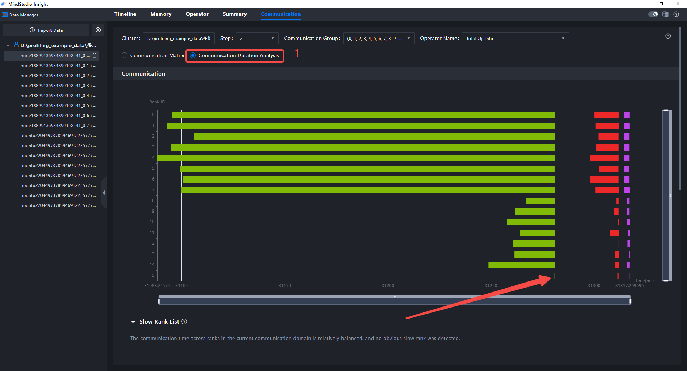
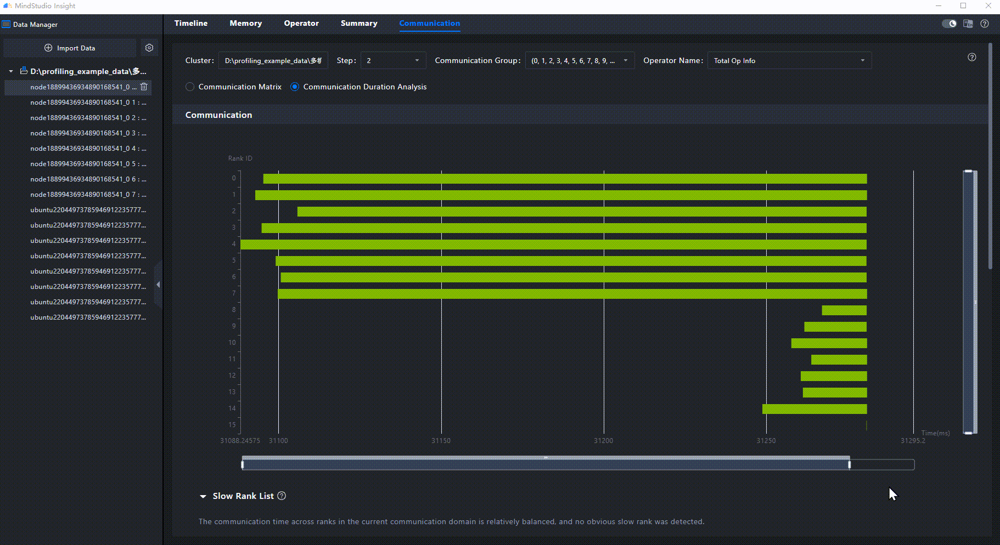

# Quick Start (System Tuning)

<!-- md-trans-meta sourceCommit=4d31aa7808cfa63b1e9a65d9252c982b334ca6f5 translatedAt=2026-08-12T11:44:14.805Z pushedAt=2026-08-12T11:57:31.124Z -->

MindStudio Insight supports importing system profile data of models running on Ascend AI Processors, collected by the [msProf](https://gitcode.com/Ascend/msprof) tool. Based on the key performance metrics displayed, you can quickly identify software and hardware performance bottlenecks of the model and perform system performance tuning.

This document uses two-server 16-rank sample data as an example to demonstrate how to progressively locate system performance bottlenecks caused by fast/slow ranks (i.e., performance imbalance among ranks) from the **Summary**, **Communication**, and **Timeline** tabs.

## 1. Scope and Prerequisites

### 1.1 Scope

This document is intended for developers who want to quickly experience the system tuning capabilities of MindStudio Insight, focusing on the following workflow:

1. Import system profile data collected by msProf.

2. Observe overall resource utilization on the **Summary** tab.

3. Identify potential performance bottleneck ranks on the **Communication** tab.

4. Further verify the idle and computing distribution on the **Timeline** page.

>[!NOTE]
>
> This document uses prepared sample data to demonstrate the analysis path, without elaborating on msProf data collection commands. If you need to collect real system data, refer to the data description in [MindStudio Insight System Tuning](../user_guide/system_tuning.md) and the msProf tool documentation.

### 1.2 Pre-Start Check

| Check Item | Requirement |
| --- | --- |
| Tool installation | MindStudio Insight has been installed. For the installation method, see [MindStudio Insight Installation Guide](../install_guide/mindstudio_insight_install_guide.md). |
| Version compatibility | The versions of MindStudio Insight, CANN, and the collection tool must be compatible. For version relationships, see [Release Notes](../release_notes/release_notes.md). |
| Sample data | The system performance sample data provided in this document has been downloaded and is accessible locally. |
| Data source | The sample data is collected by [msProf](https://gitcode.com/Ascend/msprof) and contains the information required by **Summary**, **Communication**, and **Timeline**. |
| Applicable scenario | Applicable to introductory system performance analysis in multi-rank training or inference scenarios, especially suitable for learning fast/slow rank analysis, communication latency analysis, and idle time analysis. |

### 1.3 Sample Data

Click to download the [system data](https://gitcode.com/zhangruoyu2/msinsight-quick-start-demo/blob/main/system).

After downloading, verify that the directory contains the following structure:

```text
└─MultiProfLevel2MemoryUB_db
    ├─cluster_analysis_output
    ├─node1_2166651_20240619060505060_ascend_pt
    │  ├─ASCEND_PROFILER_OUTPUT
    │  ├─FRAMEWORK
    │  └─PROF_000001_20240619140505099_GNIJBPBEBIHIHCKB
    ├─node1_2166652_20240619060505059_ascend_pt
    │  ├─ASCEND_PROFILER_OUTPUT
    │  ├─FRAMEWORK
    │  └─PROF_000001_20240619140505221_GOGOEMKAROGRMIMC
    ├─node1_2166653_20240619060505061_ascend_pt
    │  ├─ASCEND_PROFILER_OUTPUT
    │  ├─FRAMEWORK
    │  └─PROF_000001_20240619140505106_OBPMMFGEPENJQFGB
    ├─node1_2166654_20240619060505060_ascend_pt
    │  ├─ASCEND_PROFILER_OUTPUT
    │  ├─FRAMEWORK
    │  └─PROF_000001_20240619140505226_QDMBAQFOGNGMDQKA
    ├─node1_2166655_20240619060505059_ascend_pt
    │  ├─ASCEND_PROFILER_OUTPUT
    │  ├─FRAMEWORK
    │  └─PROF_000001_20240619140505102_CAMQMCOANGFPNHKC
    ├─node1_2166656_20240619060505059_ascend_pt
    │  ├─ASCEND_PROFILER_OUTPUT
    │  ├─FRAMEWORK
    │  └─PROF_000001_20240619140505221_HEKHQMKAREGIKAQB
    ├─node1_2166657_20240619060505060_ascend_pt
    │  ├─ASCEND_PROFILER_OUTPUT
    │  ├─FRAMEWORK
    │  └─PROF_000001_20240619140505169_QQNFRMQFEEKHCIFA
    ├─node1_2166658_20240619060505060_ascend_pt
    │  ├─ASCEND_PROFILER_OUTPUT
    │  ├─FRAMEWORK
    │  └─PROF_000001_20240619140505196_CHIRLGBCBGMLEFJC
    ├─ubuntu2204_1660963_20240619060440181_ascend_pt
    │  ├─ASCEND_PROFILER_OUTPUT
    │  ├─FRAMEWORK
    │  └─PROF_000001_20240619060440316_NDJQFQRGIMPECACC
    ├─ubuntu2204_1660964_20240619060440179_ascend_pt
    │  ├─ASCEND_PROFILER_OUTPUT
    │  ├─FRAMEWORK
    │  └─PROF_000001_20240619060440323_JQBHAHKEDBPDBBDC
    ├─ubuntu2204_1660965_20240619060440181_ascend_pt
    │  ├─ASCEND_PROFILER_OUTPUT
    │  ├─FRAMEWORK
    │  └─PROF_000001_20240619060440310_CGDJCKDFAOCOKNMB
    ├─ubuntu2204_1660966_20240619060440181_ascend_pt
    │  ├─ASCEND_PROFILER_OUTPUT
    │  ├─FRAMEWORK
    │  └─PROF_000001_20240619060440326_QKMBONEJDLBAHCOA
    ├─ubuntu2204_1660970_20240619060440179_ascend_pt
    │  ├─ASCEND_PROFILER_OUTPUT
    │  ├─FRAMEWORK
    │  └─PROF_000001_20240619060440334_AGCKEFNHPCNEHKHB
    ├─ubuntu2204_1660971_20240619060440180_ascend_pt
    │  ├─ASCEND_PROFILER_OUTPUT
    │  ├─FRAMEWORK
    │  └─PROF_000001_20240619060440319_OAEDHALJOJOJKECC
    ├─ubuntu2204_1660972_20240619060440181_ascend_pt
    │  ├─ASCEND_PROFILER_OUTPUT
    │  ├─FRAMEWORK
    │  └─PROF_000001_20240619060440320_RAGMCOQPGDMOJECA
    └─ubuntu2204_1660973_20240619060440181_ascend_pt
        ├─ASCEND_PROFILER_OUTPUT
        ├─FRAMEWORK
        └─PROF_000001_20240619060440316_MONIINKACEIFDCRA
```

Note during import: The analysis target of this document is the entire `MultiProfLevel2MemoryUB_db` directory, not any single subdirectory within it.

### 1.4 Terminology

| Term | Description |
| --- | --- |
| msProf | A tool for collecting system profile data. This document uses the analysis data exported by msProf for system tuning. |
| Summary (Overview) | Used to view the overall computing/communication overview, resource utilization, and preliminary bottleneck identification. |
| Communication | Used to view communication latency and communication operator distribution, helping determine whether fast/slow ranks exist. |
| Timeline | Used to view the behavioral distribution of ranks over time, confirming computing, communication, and idle states. |
| Overlap Analysis | An analysis unit in the timeline, used to simultaneously observe the relationship among Computing, Communication, and Free. |
| Computing | Indicates that the rank is computing. |
| Communication | Indicates that the rank is communicating. |
| Free | Indicates that the rank is idle. |
| Fast/slow ranks | Refers to the performance imbalance among different ranks in a cluster. |

## 2. Procedure

### 2.1 Analyzing the Summary Tab

**Operation:** Import the `MultiProfLevel2MemoryUB_db` folder and switch to the **Summary** tab.

**Observation objective:** First review the overall computation/communication overview to determine whether any ranks have obviously underutilized resources.


In the **Computation/Communication Overview** section, ranks 8 and 15 exhibit significant idle time. This indicates that the resources of these ranks are not fully utilized, and there is room for system performance optimization.

> Preliminary conclusion: There is room for system performance optimization.

### 2.2 Analyzing the Communication Tab

**Operation:** Switch to the **Communication** tab and select the "**Communication Duration Analysis**" radio button.

**Observation objective:** Check whether there are significant differences in communication latency among ranks, and determine whether any rank enters the synchronization phase too early or too late.



Observing the communication operator thumbnails reveals that the first communication operator on rank 15 has the shortest duration. In multi-rank parallel scenarios, the communication phase typically includes the time spent "waiting for other ranks to reach the synchronization point." If a rank's communication latency is noticeably short, it indicates that the rank spent less time waiting on that communication operator. However, considering the significant idle time observed for this rank in the **Summary** tab, you need to further check whether there is a prolonged Free state before and after the communication, so as to determine whether the bottleneck originates from rank idleness or from the host side failing to dispatch tasks in a timely manner.

> _Note: This dataset uses a parallel strategy, so data across ranks must be synchronized through "communication" at regular intervals._
>
> _Communication latency alone cannot serve as the basis for fast/slow rank determination. It must be evaluated together with the idle time in **Summary** and the Computing/Free distribution before and after communication in **Timeline**._
>
> Conclusion: Rank 15 requires focused analysis. The next step is to go to **Timeline** to examine its behavior before and after communication.

### 2.3 Analyzing the Timeline Tab

**Operation:** Right-click the smallest communication operator of rank 15 in the communication operator thumbnail, select **Find in Timeline**, and then zoom appropriately to observe the behavior of rank 15 before the communication.

**Observation objective:** Confirm whether this rank was in a computing, communication, or idle state before the communication, so as to determine the cause of the synchronization discrepancy.



**Operation:** Select the **Overlap Analysis** unit to observe the behavior of rank 15.

> _Note: In the **Overlap Analysis** unit, the **Computing** sub-unit is a projection of the **Ascend Hardware** unit above, indicating that the rank is computing; the **Communication** sub-unit is a projection of the **Communication** unit above, indicating that the rank is communicating; and the **Free** sub-unit indicates that the rank is idle._


Observe the **Slice List** section after the selection. The Free time is approximately three times the computing time. Common causes of rank idleness include time-consuming pure CPU operations in user code and host system thread preemption. At this point, you should continue to supplement host-side data to further analyze why this rank was idle before communication.

> Conclusion: The performance bottleneck is more likely due to excessive rank idle time. The next step is to check user code, collect host data, and continue analyzing the root cause of rank idleness.

## 3. Common Issues and Troubleshooting

| Phenomenon | Suggested Action |
| --- | --- |
| No data displayed after importing `MultiProfLevel2MemoryUB_db` | First confirm that the entire root directory, not a subdirectory, is imported. If data is still not displayed, see the data import issues in [FAQs](../support/faq.md). |
| Page display does not exactly match the screenshots in this document | Interface fields may vary slightly across different MindStudio Insight, CANN, or msProf versions. Refer to the key metrics on the **Summary**, **Communication**, and **Timeline** tabs. |
| Unable to determine which rank is the bottleneck | First observe the communication latency on the **Communication** tab, then confirm the rank's computation/idle status before communication on the **Timeline** tab. |
| Meaning of Timeline units | See [Timeline Unit Introduction](../best_practices/Timeline_Common_Lanes_and_Interface.md). |

## 4. More Information

- For data import, opening views, and basic operations: see [MindStudio Insight Basic Operations](../user_guide/basic_operations.md).

- For in-depth learning of system tuning capabilities: see [MindStudio Insight System Tuning](../user_guide/system_tuning.md).

- For common **Timeline** units and interactions: see [Timeline Unit Introduction](../best_practices/Timeline_Common_Lanes_and_Interface.md).

- For further understanding of host-side idle and bottleneck analysis: see [Host Bound Analysis Based on Linux Kernel Trace](../best_practices/host_bound_analysis_with_linux_kernel_trace.md).

- If you encounter import or interface anomalies, see [FAQs](../support/faq.md).
