# **FAQs**

<a id="faq-missing-dependencies"></a>

## 1. What should I do if I encounter a "Missing Dependencies" error when running MindStudio Insight on Windows?

**Symptom**

When MindStudio Insight is running on Windows, the "Missing Dependencies" error message is displayed, and MindStudio Insight cannot be run.

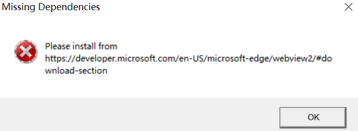

**Possible Causes**

The **WebView2Runtime** file required for running the tool is missing.

**Solution**

1. Click [download](https://developer.microsoft.com/en-US/microsoft-edge/webview2/#download-section) to go to the Microsoft official website.
2. Download the x64 installation package for Evergreen Standalone Installer, as shown in [**Figure 1** WebView2 installation package](#webview2-installation-package).

    **Figure 1** WebView2 installation package <a id="webview2-installation-package"></a>   
    

3. After the installation is complete, run MindStudio Insight again.

## 2. How Do I Re-parse a Profiling File in TEXT Format?

**Symptom**

When a profiling file in text format is imported to the MindStudio Insight software of the same version, the data will not be re-parsed. If you need to re-parse the data,  handle it as follows.

**Solution**

Delete the `mindstudio_insight_data.db` file in the profile data directory and import the data again.

<a id="faq-euleros-import-dialog"></a>

## 3. What should I do if the data import selection dialog fails to appear on EulerOS or similar systems?

**Symptom**

When MindStudio Insight is running on a system such as EulerOS, the import selection box is not displayed after you click  on the toolbar in the upper left corner of the page.

**Solution**

1. Log in to the environment where MindStudio Insight is installed.
2. Run the following command to set environment variables:

    ```shell
    export WEBKIT_DISABLE_COMPOSITING_MODE=1
    ```

3. Run the following command to start MindStudio Insight:

    ```shell
    ./MindStudio-Insight
    ```

<a id="faq-x11-paste-error"></a>

## 4. What Should I Do If Pasted Content in the Input Box Is Incorrect Under X11 Forwarding Mode?

**Symptom**

When MindStudio Insight is running in X11 forwarding mode in Linux, an error occurs if you paste the required information again after the information is entered in the text box.

**Possible Causes**

When MindStudio Insight is running in X11 forwarding mode in Linux, **copy on select** is enabled by default. As a result, the clipboard information is changed to the information that already exists in the text box, and the information in the text box is incorrectly pasted.

**Solution**

Solution 1:

1. On the menu bar of the remote login tool, choose **Settings** \> **Configuration**. MobaXterm is used as an example.
2. Click the **X11** tab and select **disable "copy on select"** for Clipboard, as shown in [**Figure 1** MobaXterm Configuration](#mobaxterm-configuration).

    **Figure 1** MobaXterm Configuration <a id="mobaxterm-configuration"></a> 
    

3. Click **OK**.
4. After the configuration is complete, run MindStudio Insight again.

Solution 2:

On the MindStudio Insight page, delete the existing information in the text box and copy and paste the required information.

<a id="faq-network-disk-import"></a>

## 5. What Should I Do If Data Cannot Be Loaded by Dragging a Network Disk Directory?

**Symptom**

When data is imported to MindStudio Insight, the import fails if the network drive directory is selected.

**Possible Causes**

MindStudio Insight allows you to import only local drive directories. Network drives are not mapped to the local PC and data cannot be imported.

**Solution**

1. Open the **File Explorer** on the computer.
2. Choose **This PC** \> **Map Network Drive**. The **Map Network Drive** dialog box is displayed, as shown in [**Figure 1** Map Network Drive](#map-network-drive).

    **Figure 1** Map Network Drive <a id="map-network-drive"></a> 
    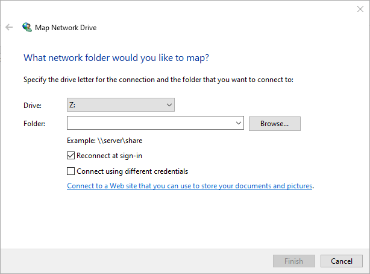

3. Select the drive letter from the **Drive** drop-down list.
4. Click **Browse** next to **Folder** and select the network directory to be mapped.
5. Click **Finish** to complete the mapping from the network directory to the local directory.
6. Open MindStudio Insight and select the mapped directory again.

## 6. What should I do if I encounter an Out of Memory error at runtime?

**Symptom**

When MindStudio Insight is running, the error code "Out of Memory" is displayed.

**Possible Causes**

The overall memory of the computer system is insufficient.

**Solution**

1. Close programs that consume a large amount of memory and unnecessary applications to release the system memory.
2. On the error page of MindStudio Insight, click the refresh button to reload the page.

<a id="faq-drag-file-disabled"></a>

## 7. What should I do if dragging a file shows disabled after Windows installation?

**Symptom**

When MindStudio Insight is installed in the Windows OS and **Run MindStudio Insight** is selected for automatic start of MindStudio Insight, the file drag and drop is disabled.

**Solution**

1. Close the opened MindStudio Insight.
2. Double-click the MindStudio Insight shortcut icon on the desktop or **MindStudio-Insight.exe** in the installation directory to open MindStudio Insight again.
3. Drag the file into the tool again.

## 8. What should I do if I encounter a swrast_dri.so missing error when starting on Linux?

**Symptom**

When MindStudio Insight is started in X11 or VNC mode in the Linux OS, the MindStudio Insight GUI is blank and the error message "cannot open shared object file swrast\_dri.so" is displayed, as shown in [**Figure 1** Error message](#error-message).

**Figure 1** Error message <a id="error-message"></a> 
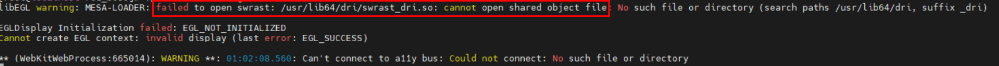

**Possible Causes**

The dependency may be missing.

**Solution**

1. Run the following command to install the forwarding dependency file:

    ```shell
    yum install -y mesa-dri-drivers
    ```

2. After the installation is complete, open MindStudio Insight again.

## 9. What should I do if I encounter an "Oh no! Something has gone wrong." error when starting VNC?

**Symptom**

When MindStudio Insight is started in VNC mode in the Linux OS, the error message "Oh no! Something has gone wrong" is displayed, as shown in [**Figure 1** Error message](#error-message).

**Figure 1** Error message <a id="error-message"></a> 


**Possible Causes**

**AllowTcpForwarding** may not be enabled.

In some cases, VNC needs to be connected through the SSH channel, and TCP forwarding is the key to this function. If **AllowTcpForwarding** is disabled, SSH does not allow port forwarding. As a result, the VNC service cannot be accessed through the SSH channel. After **AllowTcpForwarding** is enabled, you can connect to the VNC service through the SSH channel locally or remotely.

**Solution**

Configure the SSH server.

1. Go to the **/etc/ssh/** directory and open the **sshd\_config** file.
2. Change **AllowTcpForwarding** in the file to **yes**.
3. Run the following command to restart the SSH service:

    ```shell
    systemctl restart sshd
    ```

4. After the restart is successful, start the VNC in a new window.

## 10. What should I do if dependencies are reported as missing when installing on openEuler or its derivative systems?

**Symptom**

In the Linux OS, when openEuler and its derivative OSs are installed, a message indicating that the dependency cannot be found is displayed.

**Possible Causes**

The configured source does not have any dependency.

**Solution**

Configure a new source by referring to [solution](https://www.hiascend.com/forum/thread-02101178181671140059-1-1.html) and reinstall the corresponding dependency.

## 11. What should I do if the page goes black when importing data?

**Symptom**

On the **Summary** and **Communication** pages of MindStudio Insight, the data is displayed properly after the first import. However, when the same data is imported for the second time, a black screen is displayed.

**Solution**

Solution 1: Close MindStudio Insight and restart it.

Solution 2: On the MindStudio Insight page, view or import other data, and then view the data that is imported earlier again.

## 12. What should I do if the communication interface shows no data after importing?

**Symptom**

After data is imported to MindStudio Insight, no data is displayed on the communication page.

**Possible Causes**

There are multiple levels of subfolders between the imported profile data directory and the directory ending with **ascend\_ms**, for example, **profiling/rank\_*x*/dyn\_prof\_data/rank\_*x*\_start\_*xxx*\_end\_*xxx*/*xxx*\_ascend\_ms**. In this case, MindStudio Insight identifies the imported data as cluster data and the communication page is displayed abnormally.

**Solution**

Find the directory whose name ends with **ascend\_ms** and copy it to the newly created directory. Ensure that the directory is named in the format of **_directory name_/ascend\_ms**. Then, import the directory to MindStudio Insight again. The directory will be displayed properly.

## 13. What should I do if startup fails on TencentOS Server 4.4_x86?

**Symptom**

In the Linux TencentOS Server 4.4\_x86 OS, MindStudio Insight fails to be started, and the following error information is displayed:

```tex
** (MindStudio-Insight:302256): WARNING **: 08:07:35.531: webkit_settings_set_enable_offline_web_application_cache is deprecated and does nothing.
JIT session error: Missing definitions in module fs789_variant0_6-jitted-objectbuffer: [ fs_variant_whole ]
Failed to materialize symbols: { (fs789_variant0_6, { fs_variant_partial, fs_variant_whole }) }
JIT session error: Could not find symbol at given index, did you add it to JITSymbolTable? index: 4, shndx: 0 Size of table: 5
Failed to materialize symbols: { (fs790_variant0_7, { fs_variant_partial }) }
```

**Solution**

Run the following commands to restart MindStudio Insight:

```shell
export JSC_useJIT=0
export JSC_useDFGJIT=0
export JSC_useFTLJIT=0
export WEBKIT_DISABLE_COMPOSITING_MODE=1
unset HTTPS_PROXY
unset HTTP_PROXY
```

## 14. What should I do if I encounter an error about excessively long paths or too many nested directories when importing files?

**Symptom**

The nesting depth of the imported sub-file exceeds 5 or the sub-file path length exceeds

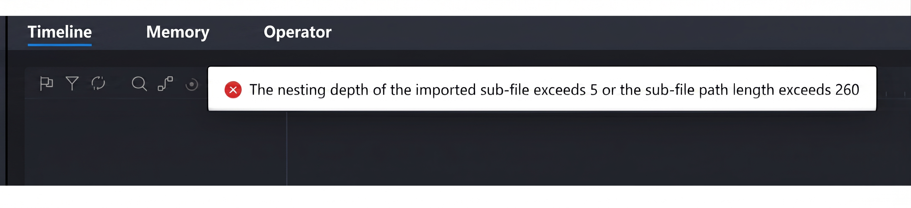

**Solution**

1. First, check whether the file path is too long. If the **file path length exceeds 260**, modify the file path name.
2. Then, check whether the file nesting is too deep. For example, determine whether the **nesting depth from the import directory to the `trace_view.json` file** exceeds 5 levels. If it exceeds 5 levels, modify the nesting depth.

   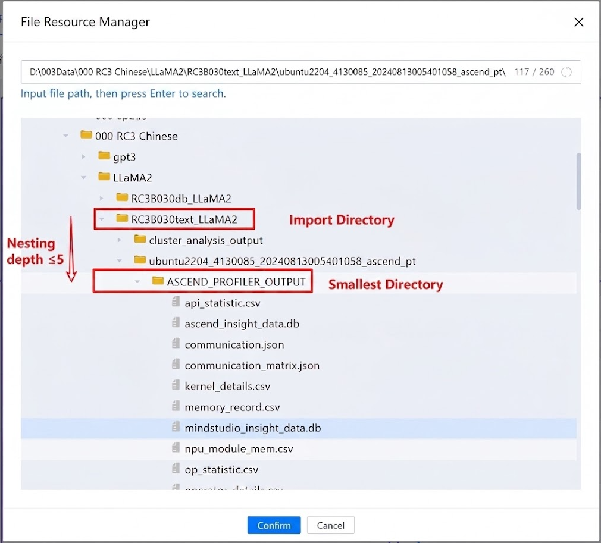
3. Check whether the imported file contains valid data and whether the file is corrupted or incomplete.
4. If none of the above methods resolves the issue, contact the MindStudio Insight tool contact person for further diagnosis.

## 15. What should I do if the System View and Operator tabs have no content?

**Symptom**

When the collection configuration is normal, the collected profile data shows no content in **System View** in MindStudio Insight, as follows:

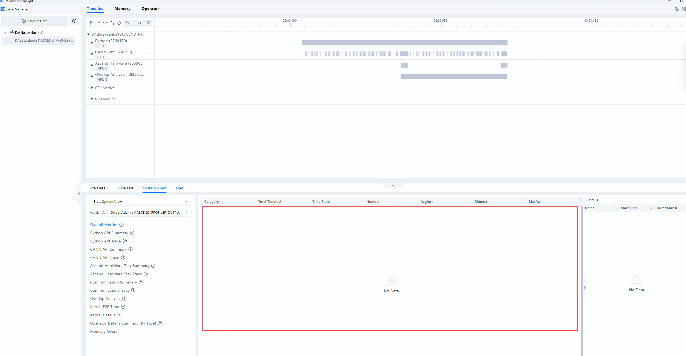

It may also appear as no content in the **Operator** tab, as shown below:

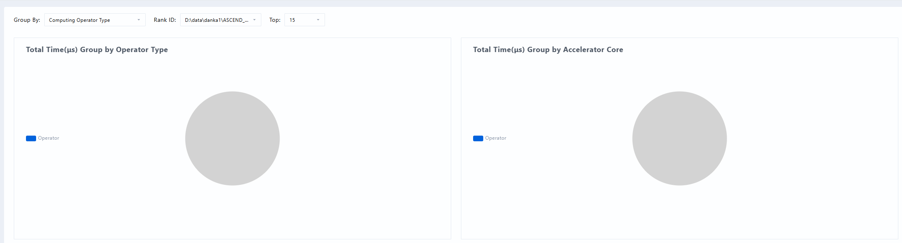

**Cause Analysis**

When using an older version of `torch_npu`, such as 2.5.1.post1.dev20250722, the device information in the collected `operator_memory.csv` file is incorrect. When configuring the `ASCEND_RT_VISIBLE_DEVICES` resource, each device has two concepts: device ID and device index value. The `operator_memory.csv` file records the device index value, which is inconsistent with the device ID in other files, causing the **System View** and **Operator** pages to fail to display properly. This issue has been fixed in `torch_npu` versions after August 6, 2025.

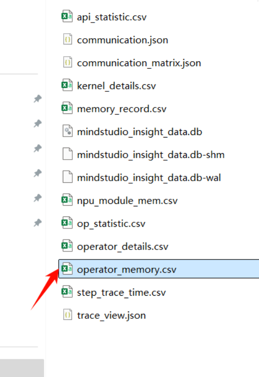

**Solution**

1. Manually modify the content of `operator_memory.csv`.

Based on the configured `ASCEND_RT_VISIBLE_DEVICES` information, modify the `Device Type` column in the `operator_memory.csv` file.

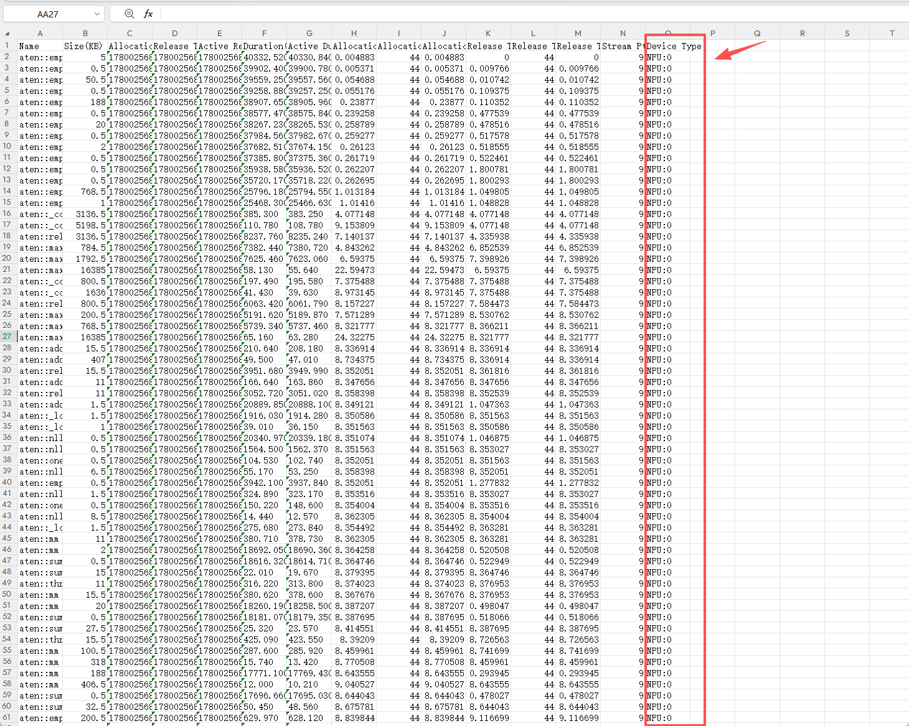

Note: This should be modified to the local device ID, not the global Rank ID. For example, if a single node has 8 ranks and two nodes have a total of 16 ranks, the global Rank IDs range from 0 to 15, while the device IDs range from 0 to 7. Rank ID = 8 corresponds to the rank with device ID = 0 on the second node, Rank ID = 9 corresponds to the rank with device ID = 1 on the second node, and so on.
2. Version Update
The `torch_npu` version after August 6, 2025 has fixed this issue. Update `torch_npu` to a version after August 6, 2025.

## 16. What should I do if a WebSocket disconnection is prompted after startup?

**Symptom**

WebSocket is already in CLOSING or CLOSED state! You are advised to restart MindStudio Insight.


**Solution**

1. First, check whether the issue is caused by proxy settings. Go to the host settings interface and navigate to **Network &amp; Internet &gt; Proxy &gt; Manual proxy setup**.

   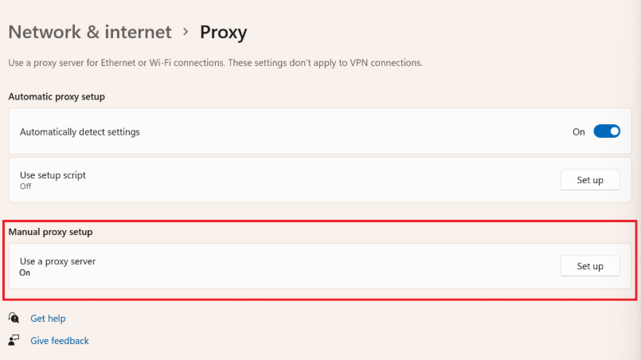

2. Click **Edit** to view the details.

   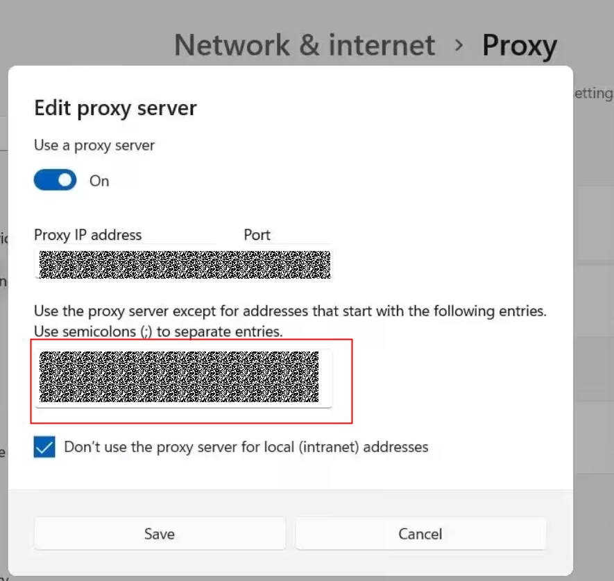

3. Check whether the **&lt;-loopback&gt;** keyword exists in the proxy whitelist shown above. If it does, delete it and save the changes.

   

4. If removing the whitelist affects some local web access, you can add the keyword , and then reopen MindStudio Insight to use it.

5. If the keyword does not exist and the modification is ineffective, contact the MindStudio Insight tool contact for further diagnosis.

## 17. How can I view only text data when profiling both DB and text mixed data?

**Symptom**

**Symptom 1: Unit display inconsistent with expectations**

Expected result 👇

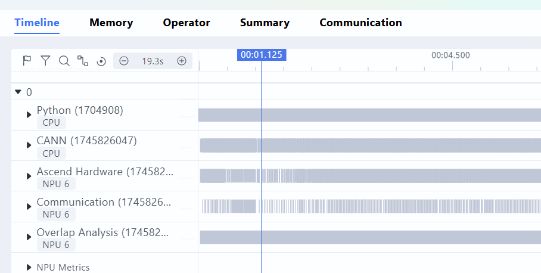

But the result is as follows 👇


**Symptom 2: Common CSV deliverable not displayed**

The desired result is as follows:

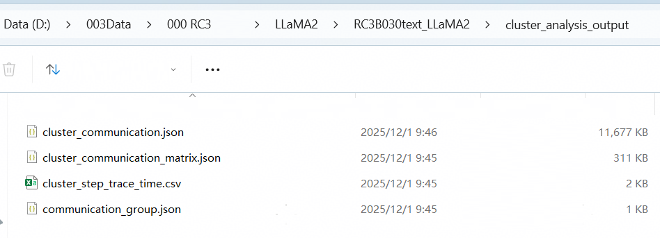

But the result is as follows:

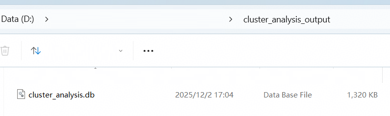

**Cause Analysis**

Profiling collection deliverables are classified into **Text type** and **DB type**. When Profiling collection is performed using a CANN package later than 8.1.RC1, if text deliverables are selected for output, both text and DB type data are generated simultaneously, and MindStudio Insight prioritizes recognition as DB data.

The advantage of DB data is smaller disk usage and faster file parsing and loading. However, some users may not be accustomed to the new DB deliverables and the new unit layout, and may wish to revert to the text scenario.

**Solution**

Search for and delete all DB deliverables in the data directory, including the `ascend_pytorch_profiler_x.db` and `analysis.db` files. MindStudio Insight will then only recognize Text data.

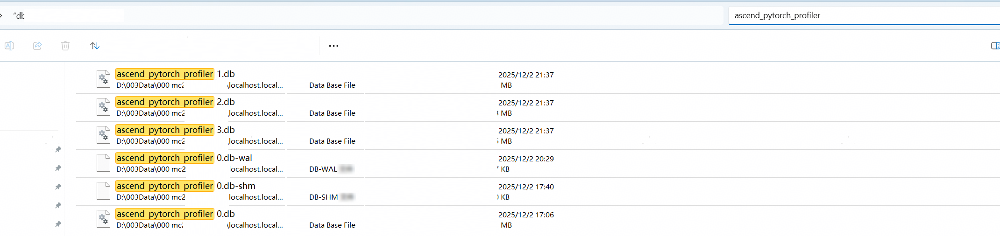

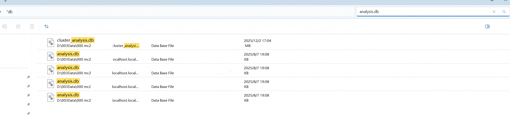
