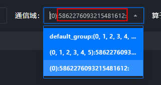
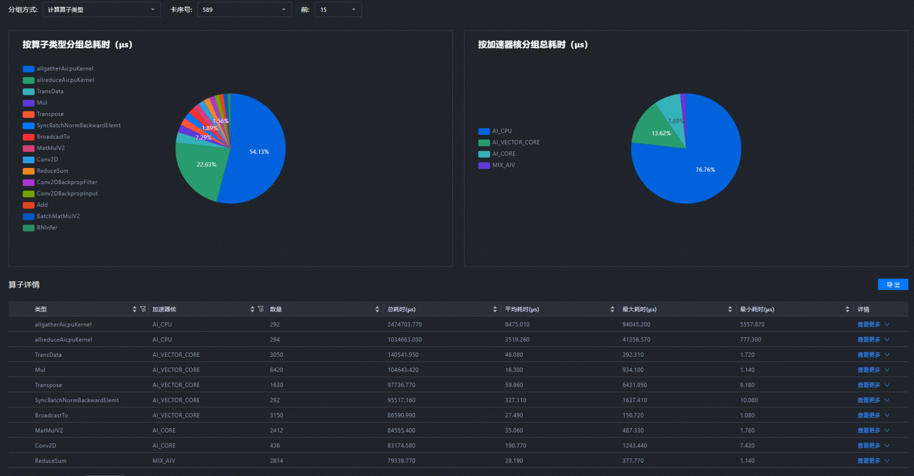
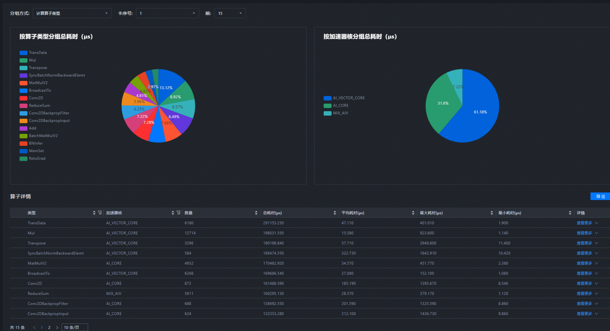
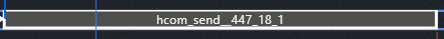

# Communication Issues

<!-- md-trans-meta sourceCommit=e99edc859b9c75396352963171ba410aa66e4e0d translatedAt=2026-08-12T11:44:59.316Z pushedAt=2026-08-12T11:57:31.142Z -->

## Abnormal Values in A3 Log Communication Group 

### Problem Description

For a job with four A3 ranks and eight dies, there are abnormally large values in the Communication Domain. The tool version is 8.2.RC1.



### Solution

This string is not an abnormal value. It is a hash value collected by profiling in different collective communication groups, serving as a unique identifier to distinguish different communication groups. When profiling fails to collect the specific type of a communication group, this unique identifier is used to differentiate cases where the RankSet is the same but the communication groups are different (for example, in the figure above, there are two communication groups containing the RankSet 0, 1, 2, 3, 4, 5, but they are not the same communication group, and the communication behaviors within them also differ).

## A3 AICPU Related Operator Collection Issues

### Problem Description

The profile data collected on A3 shows that the model has a large number of AICPU-related operators.



However, the corresponding data collected on A2 does not contain any AICPU-related operators. What is the reason for this? Is there a difference in operators between A3 and A2, or is this a profiling collection issue?



Tool Version: 8.1.RC1

### Solution

As shown in the screenshot, the A3 operators include allgatherAicpuKernel, whose name contains "Aicpu" and is reported as the AICPU type, so it is classified under AICPU operations.

By analyzing the names, it can be determined that these operators are communication operators executed through the AICPU path.

## Data Statistics Analysis Under Different Communication Planes

### Problem Description

Taking the HcomAllToAllVC operator as an example, is there a way to separately collect statistics on the time consumed by Memcpy and the time consumed by Notify_Wait in the operator?


### Solution

Select this range to view statistics.


## MindStudio Insight Encounters All-Gather Communication Algorithm with HD Suffix

### Problem Description

[Chip Type] 910B3

[CANN Version] 8.0.RC3

[Framework] torch 2.5.1; TorchNPU 2.5.1.post1.dev20250619

[Collection Method]

```python
+def get_npu_profiler(option: DictConfig, role: Optional[str] = None, profile_step: Optional[str] = None):
+    """Generate and return an NPU profiler object.
+
+    Args:
+        option (DictConfig):
+            The options to control npu profiler.
+        role (str, optional):
+            The role of the current data collection. Defaults to None.
+        profile_step(str, optional):
+            The current training step. Defaults to None.
+    """
+    if option.level == "level_none":
+        profile_level = torch_npu.profiler.ProfilerLevel.Level_none
+    elif option.level == "level0":
+        profile_level = torch_npu.profiler.ProfilerLevel.Level0
+    elif option.level == "level1":
+        profile_level = torch_npu.profiler.ProfilerLevel.Level1
+    elif option.level == "level2":
+        profile_level = torch_npu.profiler.ProfilerLevel.Level2
+    else:
+        raise ValueError(f"level only supports level0, 1, 2, and level_none, but gets {option.level}")
+
+    profile_save_path = option.save_path
+    if profile_step:
+        profile_save_path = os.path.join(profile_save_path, profile_step)
+    if role:
+        profile_save_path = os.path.join(profile_save_path, role)
+
+    experimental_config = torch_npu.profiler._ExperimentalConfig(
+        aic_metrics=torch_npu.profiler.AiCMetrics.PipeUtilization,
+        profiler_level=profile_level,
+        export_type=torch_npu.profiler.ExportType.Text,
+        data_simplification=True,
+        msprof_tx=False,
+    )
+
+    activities = []
+    if option.with_npu:
+        activities.append(torch_npu.profiler.ProfilerActivity.NPU)
+    if option.with_cpu:
+        activities.append(torch_npu.profiler.ProfilerActivity.CPU)
+
+    prof = torch_npu.profiler.profile(
+        with_modules=option.with_module,
+        with_stack=option.with_stack,
+        record_shapes=option.record_shapes,
+        profile_memory=option.with_memory,
+        activities=activities,
+        on_trace_ready=torch_npu.profiler.tensorboard_trace_handler(profile_save_path, analyse_flag=option.analysis),
+        experimental_config=experimental_config,
+    )
+    return prof
```

I exported the communication algorithm `export HCCL_ALGO="allgather=level0:NA;level1:H-D_R"` in the project. Without the verl framework, it is displayed as MESH-HD, while under the verl framework, it is displayed as shown in the following figure. No other communication algorithm settings were found in the project.


### Solution

[Problem]
Why does the communication algorithm have an extra HD?

[Cause]
This is caused by the collection level configuration. level1 is MESH-HD, and level2 is MESH-HD-HD.

## How to Find the Peer for hcom_send

### Problem Description



How does hcom_send locate the peer hcom_receive, and what rules apply?

### Solution

[Problem Analysis]
The user wants to find the receive communication operator corresponding to hcom_send__447_18_1. Send and receive communicate within the same communication group.

[Solution]

1. Note that hcom_send is followed by `447_18_1`, which is a unique identifier. The user can perform a global search for `447_18_1` to locate the corresponding hcom_receive__447_18_1.

2. Send and receive communicate within the same communication group. Right-click the unit corresponding to this send and pin the communication group unit of the corresponding receive end.

## Right-clicking a Communication Operator Fails to Jump to Communication, and the Corresponding Communication Group Cannot Be Found in the Communication Tab

### Problem Description

When right-clicking a communication operator, the context menu lacks the options to jump to the communication and pin the same communication domain.


The corresponding communication domain cannot be found in the **Communication** tab.


### Solution

[Problem Analysis]
The pin feature requires that the communication group name must not consist solely of digits.

The collection side collected purely numeric data, and the data itself is problematic.
