# Import Issues

<!-- md-trans-meta sourceCommit=e99edc859b9c75396352963171ba410aa66e4e0d translatedAt=2026-08-12T11:46:39.892Z pushedAt=2026-08-12T11:57:31.158Z -->

## Information Displayed Incompletely When Opening a Profile Data File in MindStudio Insight

### Problem Description

When opening the profiling folder `./localhost.localdomain_355720_20251204222740460_ascend_pt` with MindStudio Insight, only profiling information at and above the CANN layer is displayed.


If the subfolder `./localhost.localdomain_355720_20251204222740460_ascend_pt/PROF_000001_20251204222740461_RKFAKPJFMEEOIMMB` within the folder is opened, only profiling information at and below the CANN layer is displayed.

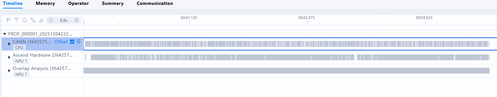

MindStudio version information: 8.2

Hardware: A5.

### Solution

The A5 currently has a known issue with DB export, and DB export has been manually blocked.

It is recommended to delete all DB files under the `ASCEND_PROFILER_OUTPUT` folder and use TEXT format data for reading.

## Unable to Import Project

### Problem Description

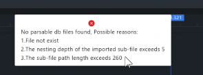

When opening profiling with MindStudio Insight, it shows that the file cannot be opened. Steps 2 and 3 have been checked, and the steptrace in profiling can also be opened normally with Google Perfetto.

Tool version: Insight 8.1

### Solution

Update msInsight to version 8.2 or later.

## cluster_analyze Cluster Analysis Result Cannot Be Recognized by MindStudio Insight

### Problem Description

After collecting profile data from 128 machines on the customer's internal network, the results generated by executing the `msprof-analyze cluster all -d {profiling\_path}` command cannot be recognized by the MindStudio Insight tool.

Many warnings appear during command execution:
`Rank 58 does not have valid communication data and communication\_matrix data.`

`The dst local 993 of the operator allgather -bottom3@xxx cannot be mapped to the global rank.`

### Solution

[Problem Cause]

The **Summary** page displays data, but the **Communication** page does not. This is because `cluster_communication_matrix.json` lacks a specific step, which causes the on-disk database step to be recorded as `0`, while the step in `cluster_step_trace_time.csv` is `114`. The mismatch results in no display on the communication page.

[Solution]

Perform offline parsing on a single rank.

## No Summary Communication After MindStudio Insight Multi-rank Collection Result Import

### Problem Description

Collection background: llamafactory lora fine-tuning of the qwen model, with two ranks on a single machine. Collected using `msprof --output=`.

Operators and timelines are visible.

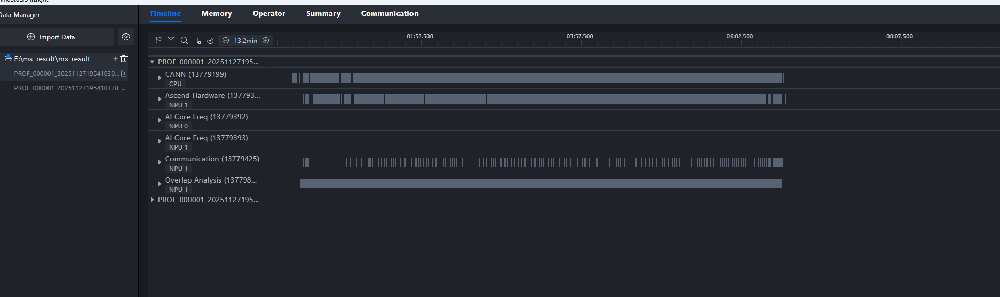

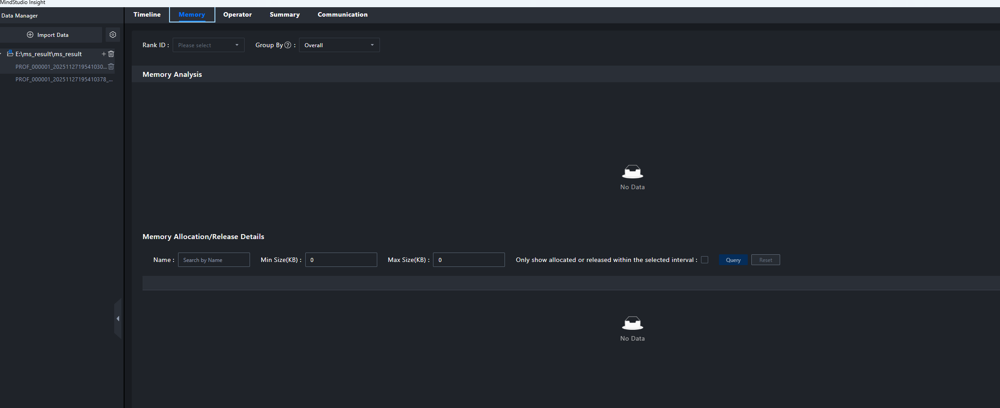

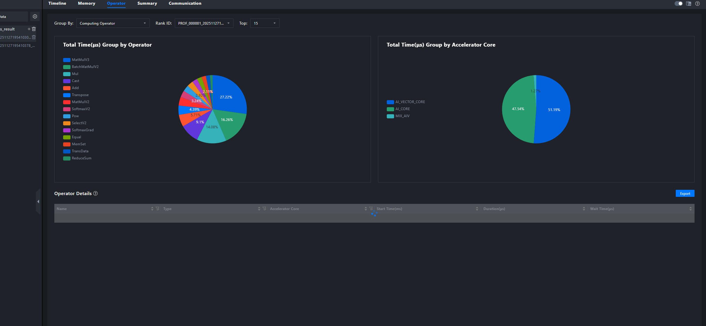

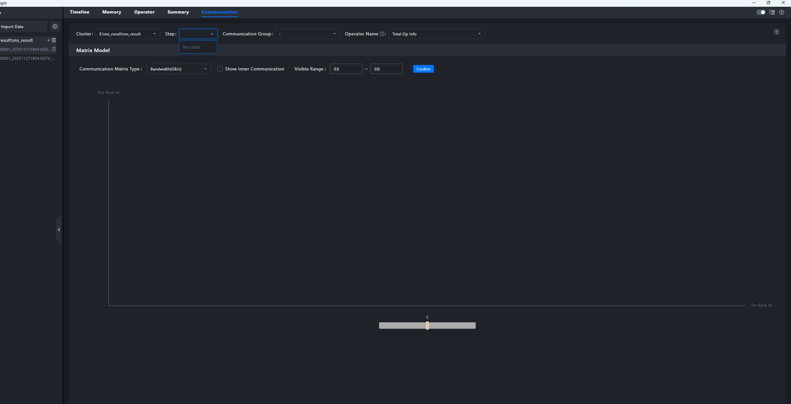

### Solution

【Problem Analysis】
msprof collects data within an NPU rank. **Summary** and **Communication** display inter-rank data. Therefore, parsing the data collected by msprof does not yield inter-rank data, and **Summary** and **Communication** will have no data.

【Solution】

1. Use Ascend PyTorch Profiler, which can collect both intra-rank and inter-rank data. For details, see [Performance Data Collection and Automatic Parsing](https://www.hiascend.com/document/detail/zh/CANNCommunityEdition/850alpha001/devaids/Profiling/atlasprofiling_16_0033.html).

2. mstt may support cluster analysis of msprof data.

## L1 Collection Cluster Information Has No Collective Communication or Cluster Overview Information

### Problem Description

The collection configuration is as follows:

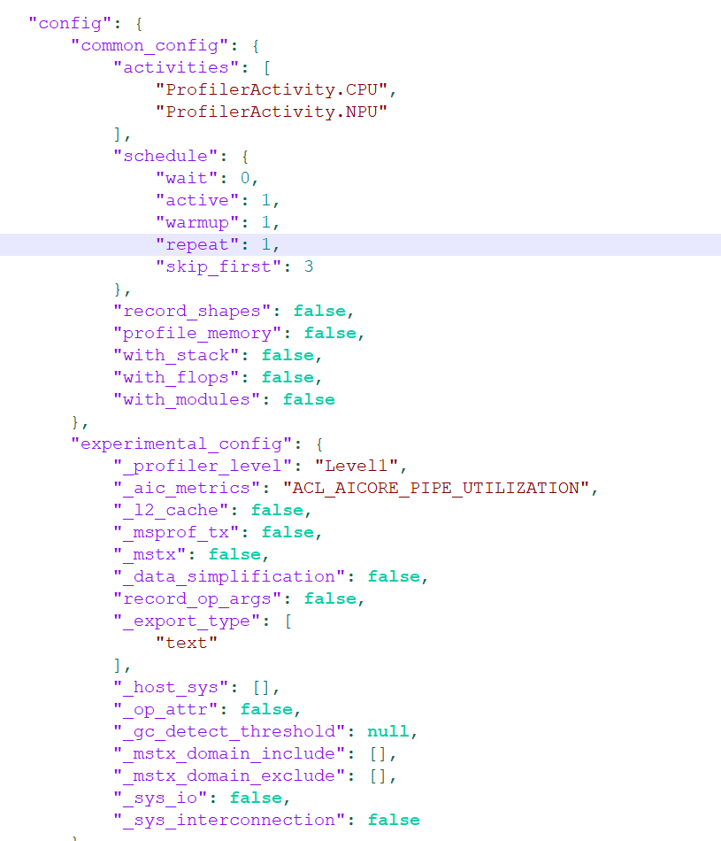

After data is imported into msInsight, the page displays:

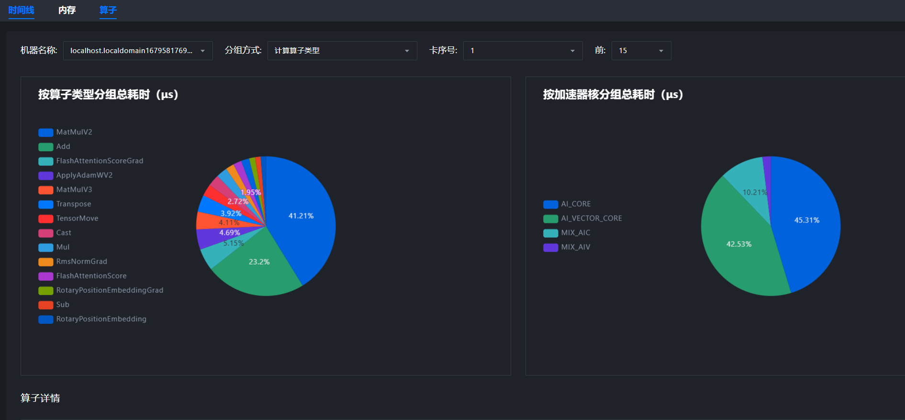

### Solution

The data analysis is correct, but the msInsight version is too old. Update msInsight to version 8.2 to resolve the issue.

## No NPU Operator Information After Multi-rank Collection Result Import in MindStudio Insight

### Problem Description

Environment: The image version is `mindie:dev-2.1.RC1.B152-800I-A3-py311-ubuntu22.04-aarch64`.

The following shows the result after msprof collection and parsing:


The op_summary of the multi-rank collection result contains NPU operator information, but after importing the output file:

No NPU operator information is displayed:


After changing only the number of ranks, the single-rank collection result contains NPU operator information:


### Solution

**Problem Analysis**
When multi-rank data is imported on a personal computer, the Ascend Hardware unit is visible.
It is suspected that the data was previously parsed, but msInsight was closed before parsing completed, causing the Ascend Hardware unit to not be displayed.
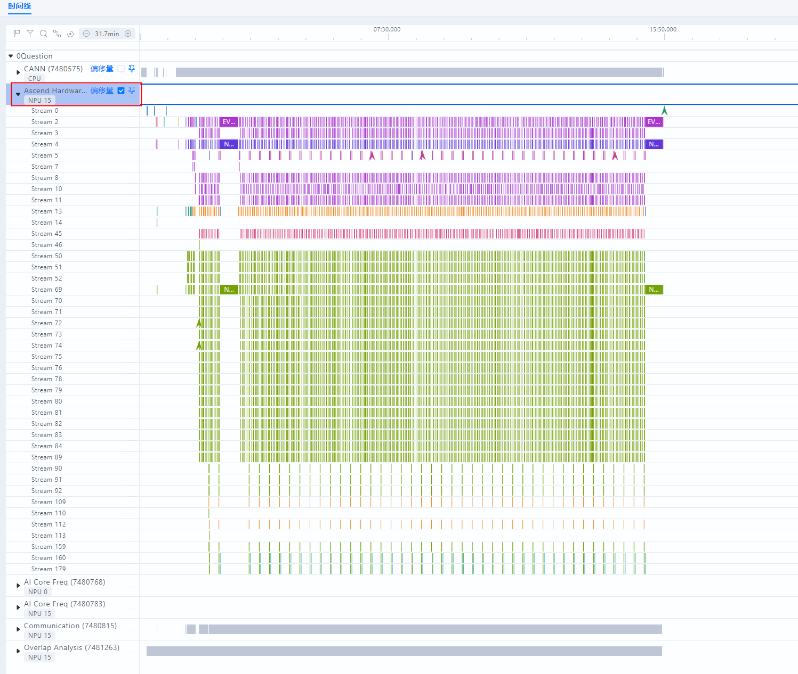

**Solution**
Delete the `mindstudio_insight_data.db` cache database under the import directory, and then re-import and parse the data.

## How to View Memory Information of GPU-Collected Profile Data in MindStudio Insight

### Problem Description

The user wants to view memory data collected from the GPU.

### Solution

In the msInsight 8 version released in 2025, the data files required for the **Memory** tab are `memory_record.csv`, `npu_module_mem.csv`, `static_op_mem.csv`, and `operator_memory.csv`.

These data files are not generated on GPUs, so memory data collected from GPUs cannot be viewed.

## No Data Is Displayed in Communication After Importing a Project

### Problem Description

No data is displayed in **Communication** after a project is imported.


**Tool Version:** Insight 8.2.RC1

**Issue Source:** MinSpeed-MM Team, Ascend Computing Training Development Department

**Model Usage Scenario:** qwen3vl-30B, 8-card

**Performance Problem Description:** In the training scenario, the out-of-the-box performance did not meet expectations.

#### Solution

[Problem Analysis]
Upon checking `analysis.db`, it is found that the `CommAnalyzerBandwidth` table contains no data.

[Solution]
It is suspected that an error occurred during the online profiling parsing process. Offline parsing is recommended for troubleshooting.

## [Cluster] No Results After Importing Profile Data in MindStudio Insight

### Problem Description

When using MindStudio Insight to import cluster profile data collected via the `msprof-analyze cluster all -d ./profile` command, no response occurs.


### Solution

The issue occurs because `--data_simplification` was not enabled during msprof cluster analysis, and msInsight does not support non-simplified mode data. Run `msprof-analyze cluster -m all -d {data location} --data_simplification` again. It has been confirmed with the msprof team that data simplification will be enabled by default in future versions, and the non-simplified mode will be removed.

## [Import Issue] MindStudio Insight Reports Error "No parsable db files found" When Opening a Profile File

### Solution

[Problem Cause]

In the imported folder, `msprof.db` exists under the `PROF_***` folder, while the `ASCEND_PROFILER_OUTPUT` folder contains text format data. MindStudio Insight prioritizes recognition of `msprof.db`, resulting in the inability to display the data in the `ASCEND_PROFILER_OUTPUT` folder.

[Solution]

During import, simply import the `ASCEND_PROFILER_OUTPUT` folder.

From the collection perspective, the reason why `ASCEND_PROFILER_OUTPUT` contains text format data while `PROF_***` has `msprof.db` is that CANN uses the default db export method, whereas the framework-side profiling is of an older version.

## [Import Issue] All Files Exist but Unable to Import: No parsable db files found

### Problem Description

All files exist, but the import fails.


### Solution

[Problem Cause]

In the imported folder, the `PROF_***` folder contains `msprof.db`, while `ASCEND_PROFILER_OUTPUT` contains text format data. MindStudio Insight prioritizes `msprof.db`, which prevents the data in the `ASCEND_PROFILER_OUTPUT` folder from being displayed.

[Solution]

When importing, import only the ASCEND_PROFILER_OUTPUT folder.

From a collection perspective, the reason why ASCEND_PROFILER_OUTPUT contains text format data while PROF_*** has msprof.db is that CANN uses the default db export method, whereas PTA uses an older one. It is recommended to update PTA.

## Unable to See Directory When Importing Profile Data in MindStudio Insight

### Problem Description

Version: 8.1.RC1

The directory remains invisible after restarting Insight.


### Solution

[Problem Cause]

Import path security check protection is triggered, primarily by the following characters:

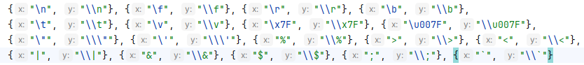

[Follow-up Measures]

A simple prompt can be provided.

## MindStudio Insight Parses nodata

### Problem Description

Data exists, but parsing shows nodata.


### Solution

The issue is resolved after re-importing. The probable cause is that the data file is too large, resulting in disk space exhaustion.

## MindStudio Insight Opening Profile Shows No Data

### Problem Description

Tool version 8.1.RC1

### Solution

This issue occurs because the `trace_view.json` file is missing from the profile data. The display returns to normal after the file is downloaded.

## No Trace Graph Displayed When Opening a JSON File

### Problem Description

Tool version 8.2.RC1

### Solution

[Error Cause]

This is a collection-side issue and is unrelated to MindStudio Insight. The time span on the collection side is excessively large, and the initial time span displayed on the **Timeline** interface is the same as the time span on the collection side.

[Solution]

You can first search for any event. The interface will automatically zoom in to the corresponding scale, and then you can use WASD to navigate.

## Error Occurs When MindStudio Insight Opens the Performance Simulation Diagram trace.json

### Problem Description

An operator simulation graph is generated via msprof op simulator.

Failed to open the `trace.json` file via MindStudio Insight, with the following error:

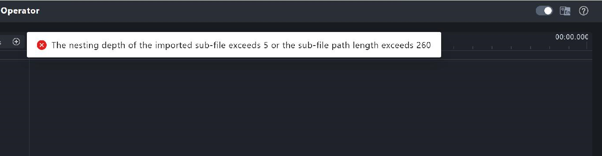

### Solution

[Problem Cause]

After the customer downloaded the raw data from VSCode, the JSON data format was converted into a bin file format, causing interpretation and recognition to fail.

[Solution]

The data can be successfully imported after restoring the raw data to JSON format.

[Further Improvement]

The error prompts in older versions of msInsight were not sufficiently accurate. The new version of msInsight provides more user-friendly error prompts, and this can be continuously optimized.

## Unable to Load Profiling, Constantly Spinning

### Problem Description

Jupyter version: It initially loaded successfully, then a pop-up window appeared.

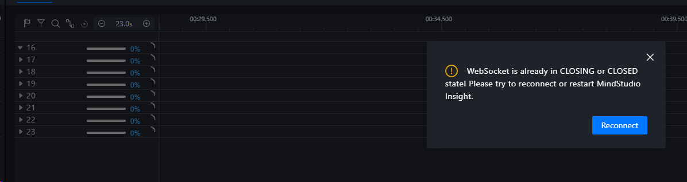

Then it kept spinning.


### Solution

[Solution]

After downloading the data locally, open it using the Windows version, and it can be displayed normally.

[Remaining Issues]

1. Identify the cause of the Jupyter loading failure and disconnection.

2. The ACC PMU cannot be displayed because excessive data in a single unit causes the frontend communication load to be overwhelmed, resulting in disconnection. The Counter unit has reduced data volume through sampling in iteration four. The issue of being unable to load and disconnection does not occur when user data is imported via single-rank import.

## No Cluster Communication Information When Using msprof to Collect Cluster Profiling

### Problem Description

* No cluster communication information is available after opening cluster profiling.

### Solution

Check whether the profiler level was set to `Level0` during collection, and change it to `Level1`.

If the issue persists at `Level1` and the collection method is the msprof general command (rather than the AI framework interface command), check whether communication profile data parsing has been performed. Refer to the following command:

```bash
msprof --export=on --output=<dir>
msprof --analyze=on --output=<dir>
```

[Parse and Export Performance Data - MindStudio 8.1.RC1 - Ascend Community](https://www.hiascend.com/document/detail/en/mindstudio/81RC1/T&ITools/Profiling/atlasprofiling_16_0018.html)

## Unable to Open Profile Data Collected from the vllm Service in MindStudio Insight

### Problem Description

When the `/start_profile` API is used to collect profile data of the vllm service, opening the data via MindStudio Insight reports the error "The nesting depth of the imported sub-file exceeds 5 or the sub-file path length exceeds," indicating that the directory depth is too deep or the path is too long, but the actual depth or length does not exceed the limit.

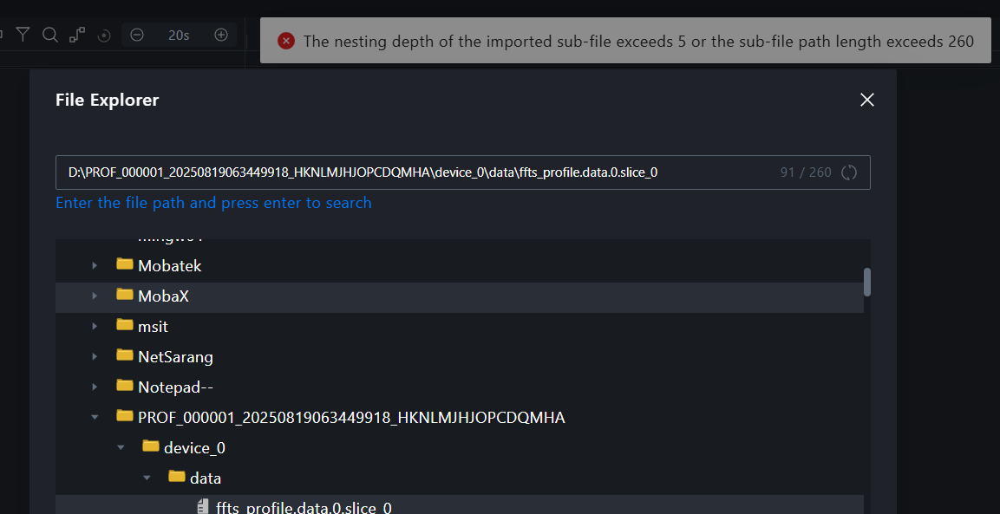

The collected profile data does not contain the `mindstudio_profiler_output` directory.

### Solution

If no excessively long or deep directories exist, the deliverables may be damaged or incomplete. This prompt has been added in the latest version of Insight.

A common cause of incomplete profiler deliverables is that the profiler data was **only collected but not parsed**, resulting in **missing parsing-related deliverables**.

Follow the official profiler documentation to confirm whether the deliverables are complete based on the collection method.

vllm-ascend should have encapsulated the Ascend PyTorch Profiler interface. Perform offline parsing using the corresponding command.

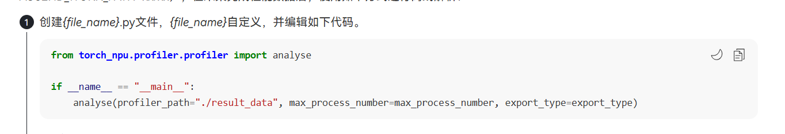

[Offline Parsing - MindStudio 8.1.RC1 - Ascend Community](https://www.hiascend.com/document/detail/en/mindstudio/81RC1/T&ITools/Profiling/atlasprofiling_16_0091.html)

① (PROF_XXX, FRAMEWORK) After parsing, the deliverable ② (ASCEND_PROFILER_OUTPUT) is obtained.

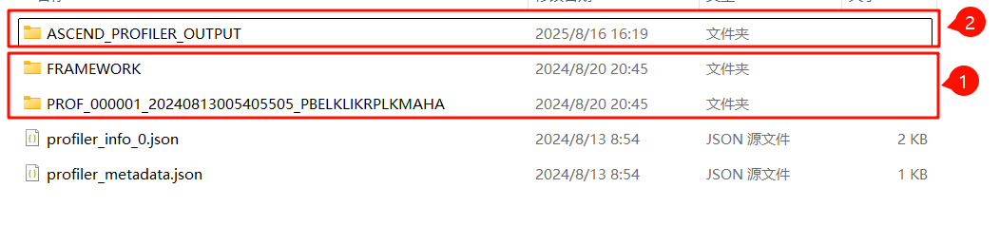

User reply: Confirmed that parsing was not performed. It is recommended to optimize the error message.

After parsing via the following script, the data can be loaded normally.

```python
from torch_npu.profiler.profiler import analyse

if __name__ == "__main__":
    analyse(profiler_path="path/to/profiling")
​
```

## Data Disappears After Opening Two Files

### Problem Description

When two JSON files are opened, data loss occurs.

### Solution

Your two JSON files are in the same directory, and the .db files saved after data parsing are identical. Therefore, when you open two JSON files simultaneously, the parsed data will be overwritten. To open two JSON files at the same time, you can resolve this issue by importing them within a project. This issue will be optimized in the 930 mainline version.

## Profile Data Imported But Not Displayed

### Problem Description

After profile data was imported into MindStudio Insight, the communication analysis did not display. The issue persisted after restarting and deleting the original old files followed by another restart. The profile data was successfully displayed after re-importing it the next day.

### Solution

[Error Cause]

This dataset contains communication latency data but no communication matrix data.

Currently, the parsing logic for cluster data in msInsight first parses the matrix data and then asynchronously parses the communication latency data.

After the matrix data is parsed, the frontend page renders in advance. However, since the matrix data content is empty, the dropdown boxes contain no data. Subsequently, after the communication latency data is parsed, the dropdown box content is not refreshed, resulting in no content being displayed throughout.

[Workaround]

Restart msInsight and open the data that has been fully parsed.

[Modification Plan]

When the communication latency data parsing is complete, refresh the content of the upper dropdown box.

## DB Data Collected by msprof Fails to Import to MindStudio Insight

### Problem Description

After collecting DB data using the msprof tool, MindStudio Insight is unable to import it:

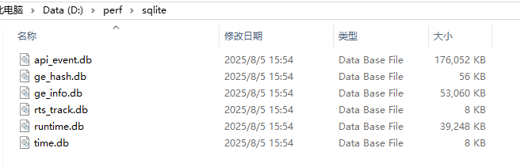

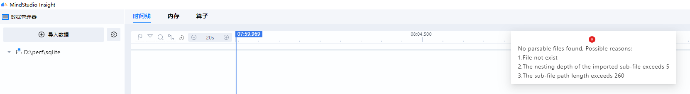

### Solution

[Error Cause]

In this scenario, multiple processes run on a single rank and cannot be collected using msprof. Dynamic profiling was used instead for collection. The timeline can be displayed normally, but the memory page lacks relevant data and therefore shows nothing. The operator page cannot display data because the import method of a single `msprof_*.db` under a single folder lacks the deviceId.

[Workaround]

1. Use the Q1 commercial version as a workaround.

[Modification Plan]

The introduction of new features has resulted in relatively strict import constraints for the offline inference msprof scenario. Subsequent analysis will be conducted to appropriately relax the import constraints for the msprof scenario.

## Communication Group Missing After Opening Cluster Results in MindStudio

### Problem Description

#### Background

Organization: Siye Noah

4096p training multimodal 7Bv5 cluster analysis

#### Tool Version

MindStudio-Insight_8.1.RC1_win.exe

#### Detailed Problem Description

After opening the cluster result in MindStudio, only communication group 0 remains, while the original cluster result contained 4096 NPU ranks.


Upon inspecting `communication_group.json`, the original file indeed contains a large number of communication groups.

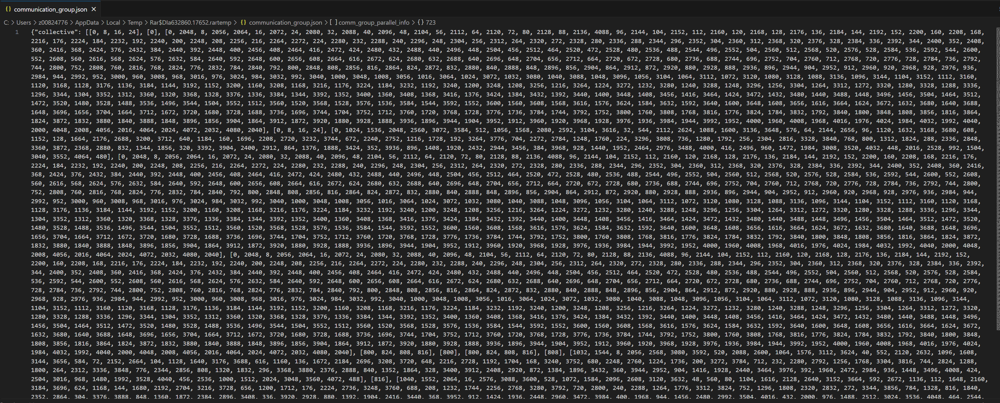

### Solution

[Error Cause]

During cluster import, the `cluster_communication_matrix.json` file was not recognized (the import logic did not account for the case where only `cluster_communication.json` exists without `cluster_communication_matrix.json`, i.e., it was not adapted to the time mode of mstt cluster analysis). The mstt cluster analysis function was re-invoked for the imported 0 ranks, and **the 0-rank cluster analysis result erroneously overwrote the full-rank cluster analysis result**, causing **Communication** to display only 0 ranks.

[Workaround]

1. Directly import the cluster analysis output subdirectory, which will bypass the overwrite logic described above.

2. Manually invoke the communication matrix mode of cluster analysis for all ranks, and add the `cluster_communication_matrix.json` file to the cluster analysis output.

[Modification Plan]

An erroneous logic exists during cluster import parsing. The process is as follows:


Modify it to the following correct process:


## Unable to Load a Profiling File of Approximately 80 GB After Importing into MindStudio Insight

### Problem Description

After training the Qwen3-32B model using the verl framework, profile data (level1) for one step was collected. After data parsing, the entire file was approximately 80 GB. Upon importing it into MindStudio Insight, no visualized performance parsing data was loaded, and no related error was reported.


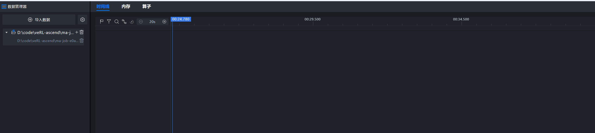

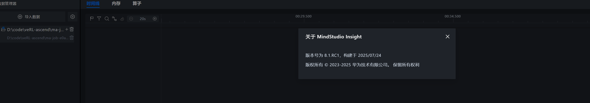

### Solution

The profile data collected during the verl rollout phase is excessively large. Reduce the batch size and prompt+response length, or add profiling to vllm to collect only a small number of decode steps, which can reduce the amount of collected data.
