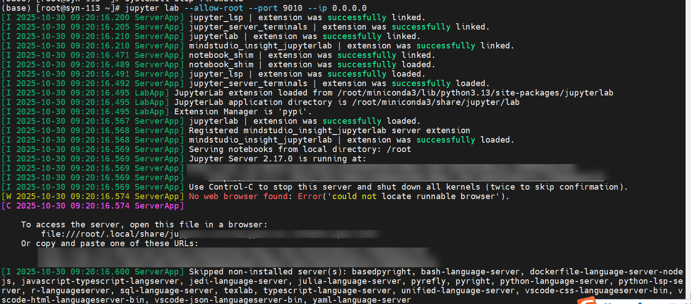
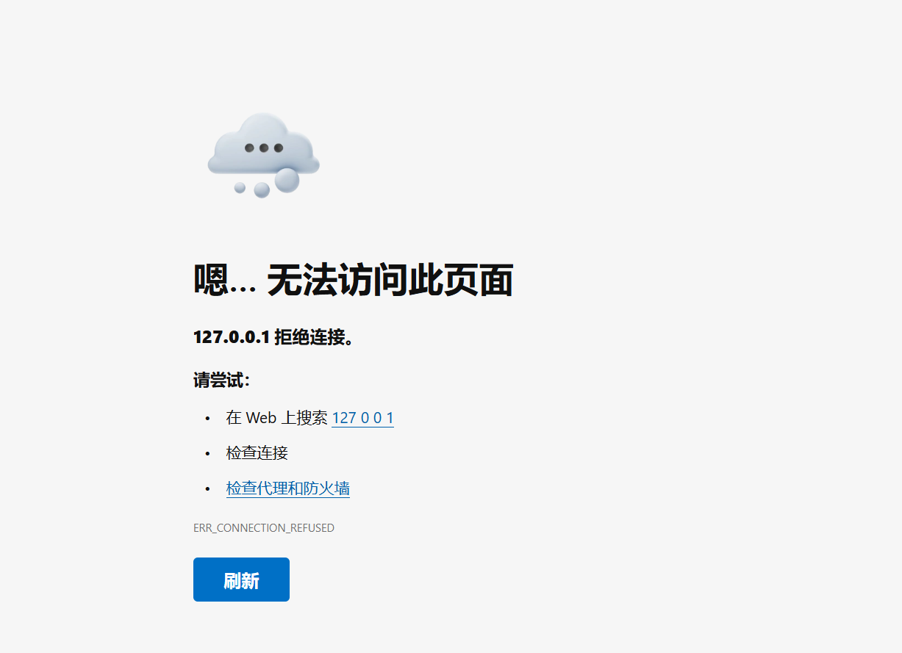

# JupyterLab Issues

<!-- md-trans-meta sourceCommit=49122e1f1d6621e5b8a8bbc1c0fdae9583659f48 translatedAt=2026-08-12T11:45:28.013Z pushedAt=2026-08-12T11:57:31.146Z -->

## Unable to Open Webpage When Using mindstudio_insight_jupyterlab

### Problem Description

Unable to open the webpage when using the mindstudio_insight_jupyterlab version.

### Solution

[Problem Analysis]
`127.0.0.1` refers to the local machine address. JupyterLab runs on a remote server, so accessing it from the local machine requires passing the remote server address.

[Solution]
Use the Linux server IP address to open it.
