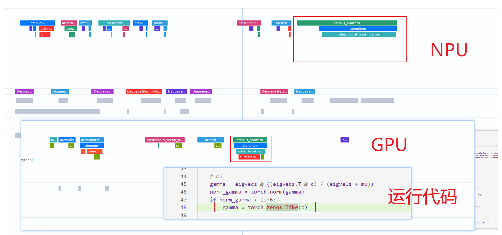
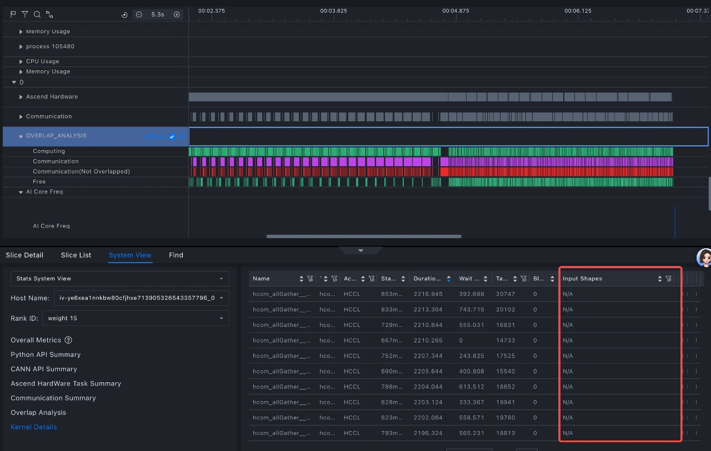
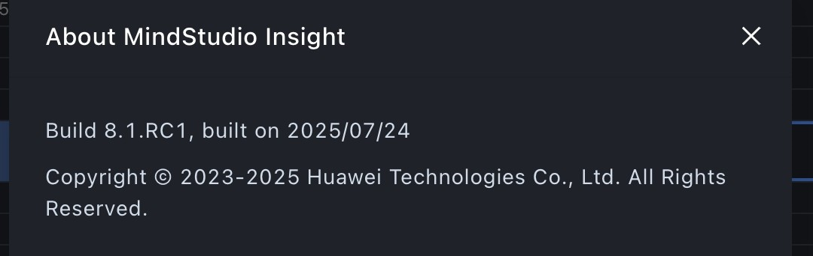
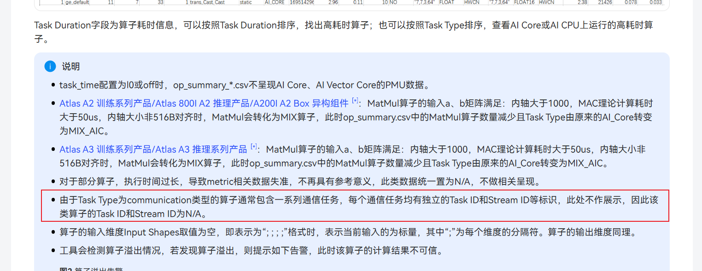

# Operator Issues

<!-- md-trans-meta sourceCommit=fa1a6c7eaa3f2f5893a21924aaf47beb93b490b6 translatedAt=2026-08-12T11:45:46.365Z pushedAt=2026-08-12T11:57:31.149Z -->

## How to Open Multiple Files Simultaneously for Comparison

### Problem Description

How to open multiple files simultaneously for comparison.

### Solution

1. The product documentation was consulted at `https://www.hiascend.com/document/detail/en/mindstudio/81RC1/GUI_baseddevelopmenttool/msascendinsightug/Insight_userguide_0028.html`, but the comparison functionality could not be achieved by following the documented steps.

2. Place the files in different projects and set them as baseline and compare respectively.

## torch_zeros_like Fails to Collect NPU Execution Operators

### Problem Description

When `torch_zeros_like` is invoked, no corresponding operation is observed on the NPU. It is unclear whether the tool failed to capture the operation or if another cause is responsible. The API is confirmed to be supported, yet the performance here is four times slower.



### Solution

This is expected behavior, as the implementations on NPUs and GPUs differ. Additionally, there is no dispatch flow for this operation on the NPU; the copy is performed directly on the CPU side.

## Shape Collection for Operators Is Enabled but Not Displayed in MindStudio Insight

### Problem Description

**Symptom:**

During profile collection, `torch_npu.profiler.ProfilerActivity.CPU` and `record_shapes=True` were enabled,

but the tool does not display 

**Software Version:**



**Profile collection configuration:**

```python
experimental_config = torch_npu.profiler._ExperimentalConfig(
    export_type=[
        torch_npu.profiler.ExportType.Text,
        torch_npu.profiler.ExportType.Db
    ],
    profiler_level=torch_npu.profiler.ProfilerLevel.Level0,
    msprof_tx=False,
    mstx_domain_include=[],
    mstx_domain_exclude=[],
    aic_metrics=torch_npu.profiler.AiCMetrics.AiCoreNone,
    l2_cache=False,
    op_attr=False,
    data_simplification=False,
    record_op_args=False,
    gc_detect_threshold=None,
    host_sys=[
        torch_npu.profiler.HostSystem.CPU,
        torch_npu.profiler.HostSystem.MEM],
    sys_io=False,
    sys_interconnection=False
)
begin = time.time()

with torch_npu.profiler.profile(
        activities=[
            torch_npu.profiler.ProfilerActivity.CPU,
            torch_npu.profiler.ProfilerActivity.NPU
        ],
        schedule=torch_npu.profiler.schedule(wait=0, warmup=0, active=1, repeat=1, skip_first=0),
        # Used together with prof.step().
        on_trace_ready=torch_npu.profiler.tensorboard_trace_handler("./result"),
        record_shapes=True,
        profile_memory=True,
        with_stack=True,
        with_modules=False,
        with_flops=False,
        experimental_config=experimental_config) as prof:
```

### Solution

HCCL-type operators do not have data values in this column.



The same applies to the tensor column.


