# Timeline Issues

<!-- md-trans-meta sourceCommit=e99edc859b9c75396352963171ba410aa66e4e0d translatedAt=2026-08-12T11:46:36.822Z pushedAt=2026-08-12T11:57:31.156Z -->

## Opening Two Pages to View Profiling Results in Inability to Collect Statistics and Incorrect Time Consumption Display

### Problem Description

When two msInsight windows are opened simultaneously to view two profiling results, one of them cannot be selected to view event statistics, and the time consumption calculation is incorrect when a point is clicked.

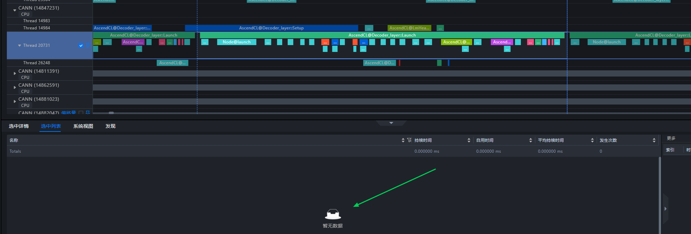

Tool Version: Insight 8.1

### Solution

[Cause]
The two profiling results are stored in the same folder, causing them to read from and write to the same .db file, which leads to mutual overwriting and errors in one of the results.

[Resolution]
Delete the DB file, separate the multiple files into different folders, and re-import them.

## Timeline Overall Metric No Data

### Problem Description

After manually modifying the source file, the Overall Metric of the profile data still displays "no data" when opened with MindStudio_insight_jupyter.

### Solution

[Background]
This is a legacy bug in older versions of TorchNPU. When parsing the rank-device mapping, we use `operator_memory.csv`, but the older TorchNPU version had an issue where all NPU numbers were mapped to 0. Therefore, either manually modify the device Type column in the source file `operator_memory.csv` to the correct NPU numbers, or update the TorchNPU version to a version later than 2025-08-06.

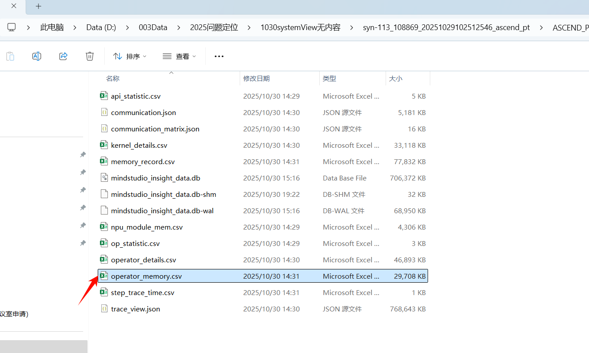

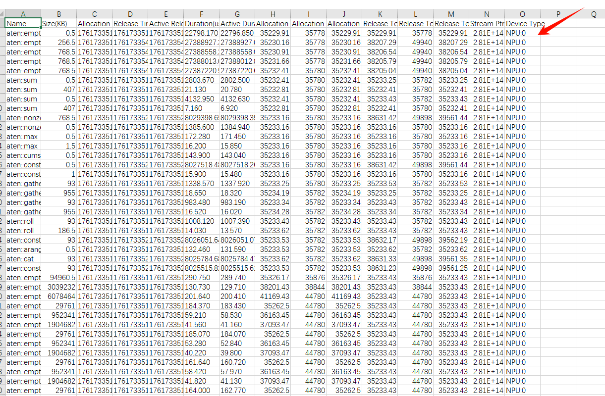

[Troubleshooting Process]
Upon inspecting the source file, it was found that the user modified **Device Type** to **NPU:9**, while other files show **NPU Type** as **NPU:1**.
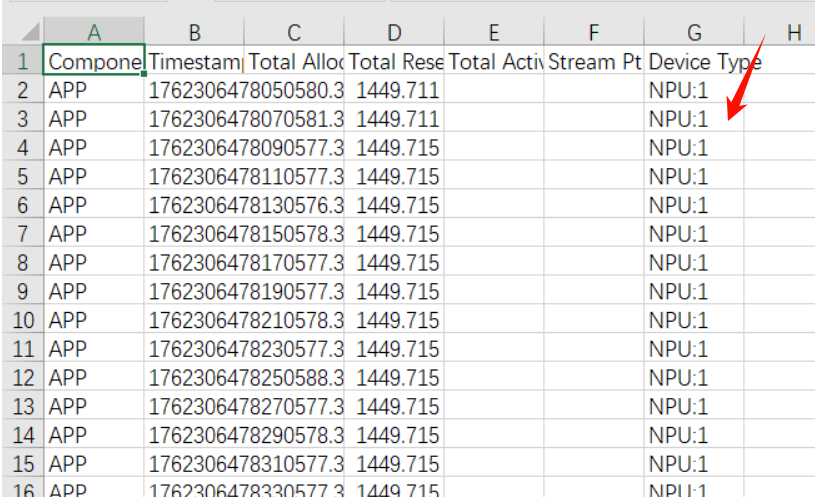

**9** is the global rank ID. The **Device Type** should be changed to the local ID within the node (that is, if a single node has 8 ranks and two nodes have 16 ranks in total, the global rank ID ranges from 0 to 15, while the device ID ranges from 0 to 7). `RankId=9` corresponds to rank 1 of the second node, so the **Device Type** should be changed to **NPU:1**.

## Inconsistency Between the Displayed Duration of the Box Selection Time in Timeline and the Total Duration in the Selected List

### Problem Description

The total duration in the selected list is more than twice the duration displayed on the **Timeline**.

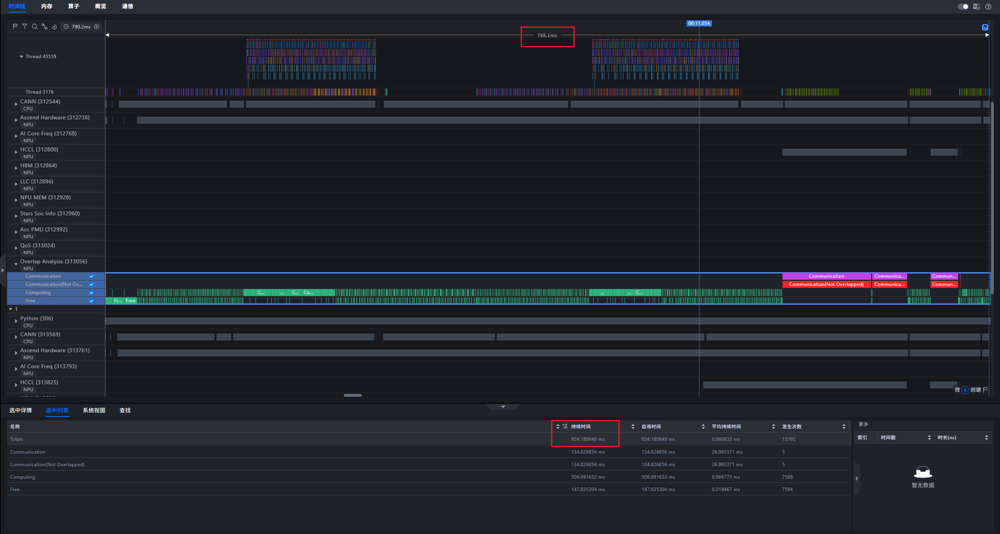

### Solution

This is normal behavior. The time displayed in **Totals** for the selected area is the sum of the durations of the selected items. Since the selected <code>Communication</code> and <code>Communication(Not Overlapped)</code> have the same duration, the time of the communication operator is counted twice in **Totals**, resulting in a discrepancy with the duration of the selected area.

## Unit Sorting Control

### Problem Description

When a self-generated JSON file is imported into MindStudio Insight, how can the tid sorting be controlled? Adding `thread_sort_index` has no effect and instead hides the corresponding tid.

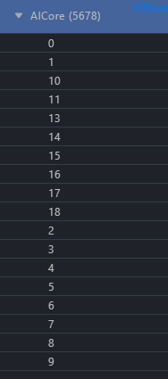

### Solution

Add the `thread_sort_index` of all units and update the version. The version must be 20250930 or later.

## Insight Slice Color Customization

### Problem Description

The colors of entries in msInsight cannot be easily distinguished, as both compute and free entries are displayed in green.

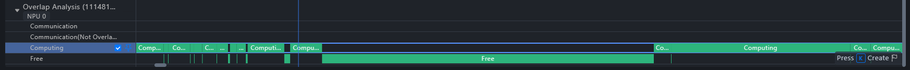

### Solution

Color changes are not currently supported. To view the compute and free ratios, use the **Overall Metrics** feature under **System View**.

## Overall Metric Shows No Data When Opening Profile Data

### Problem Description

Data from rank0 and rank1 was collected. rank0 has overall metrics, while rank1 does not.

Tool Version: MindStudio_insight_jupyter 8.2

### Solution

Data issue: The content in the device Type column of the `operator_memory.csv` file is incorrect, resulting in no data being retrieved here. There are two approaches to resolve this:

1. Manually modify the **Device Type** column.

2. Update to a TorchNPU version later than 8.6.

## msInsight Timeline Shows ProfilerStep Not in the First Row

### Problem Description

In msInsight Timeline , ProfilerStep is displayed in a non-first row, and the upstream timeline also shows multiple step displays.

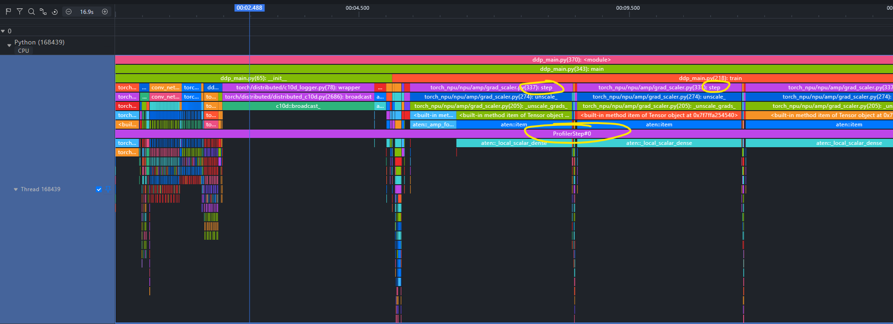

Tool Version: Insight 8.1

### Solution

[Problem Analysis]
This stacking of unit slices on the Timeline page is normal. In the Python unit, both the Python call stack and trace point data are present. The order between the two has no special meaning.

[Solution]
If you want to see what ProfilerStep looks like in the first row, right-click the unit and click "Hide Python Call Stack". This will display only the trace point data, and ProfilerStep will then appear in the first row.

Regarding the second issue, "Does the upstream timeline also show multiple steps?" — these steps are merely call stack hints indicating that the Python code calls the step method of `torch_npu/npu/amp/grad_scaler.py`. They have no relationship with the relative position of ProfilerStep.

## Timeline Stack and Operator Information Not Displayed

### Problem Description

An Insight display issue: stack and operator information is not displayed.

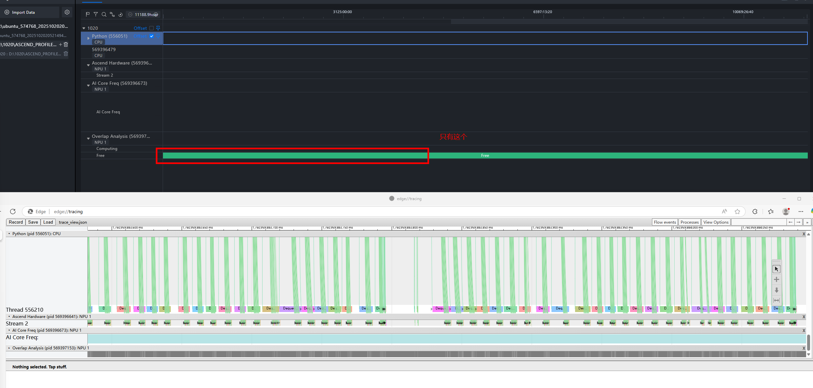

Tool Version: Insight 8.2

### Solution

[Problem Analysis]
A data entry in the JSON file has a ts value of 0, causing an abnormal timeline due to problematic data.

[Solution]
Delete the data entry with ts set to 0, and the timeline will display normally.

## On a Single Node with 16 Ranks, Only Rank 0 Displays "Ascend Hardware" and "Communication", While Other Ranks Have Data but Lack These Two Values

### Problem Description

Tool Version: Insight 8.1

### Solution

**[Problem Analysis]**
It was found that the **deviceid** values in the `RANK_DEVICE_MAP` table of other ranks were incorrectly mapped.

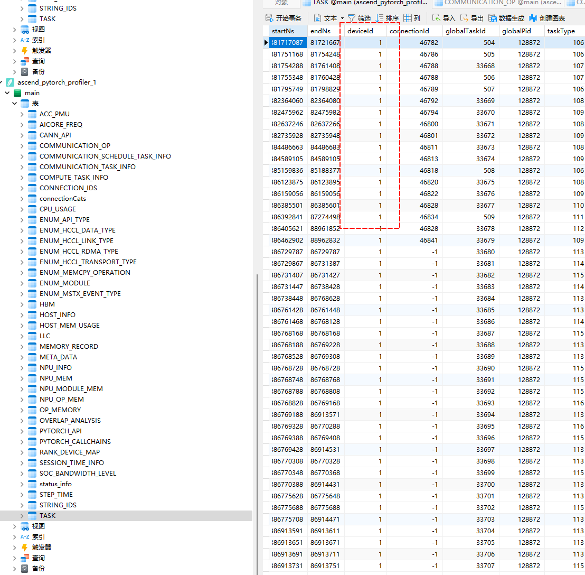

**[Solution**]
The PTA package and CANN version are too old. Update them to the latest versions and collect data again.

## Collective Communication Operator Alignment Failure

### Problem Description

1. The positions of the same communication operator deviate significantly, which may indicate an incorrect communication operator name. 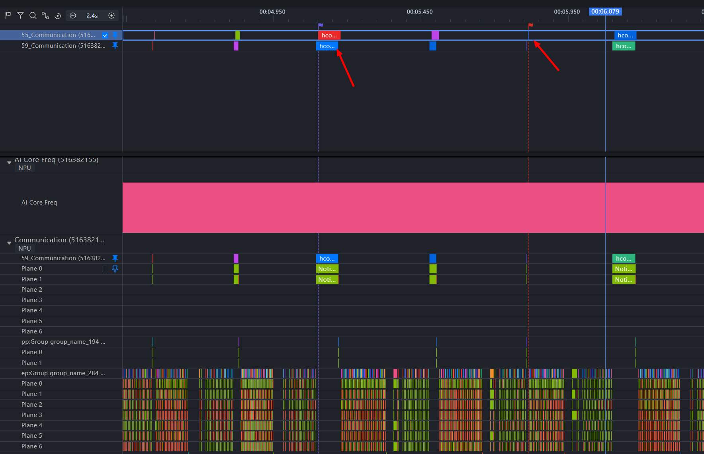

2. The communication overview is disordered. Even after using one-click alignment, some communication operators still cannot be aligned. 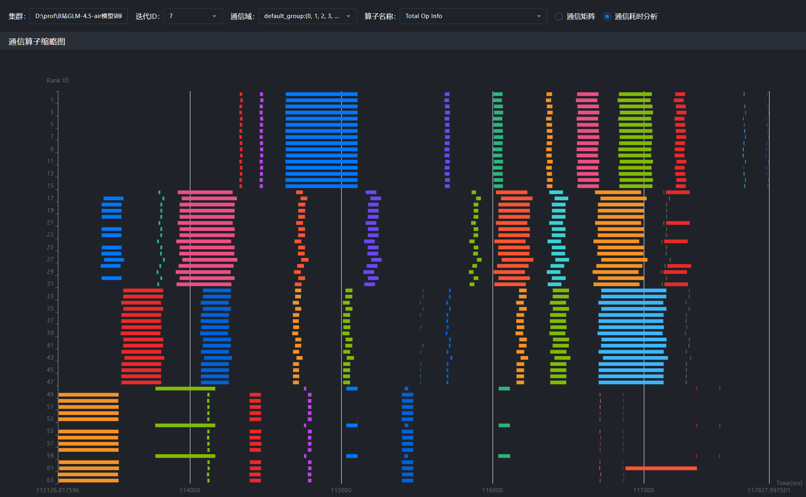

### Solution

[Problem Cause] Currently, when profile data is parsed, communication operator sequence numbers are first accumulated globally from 0, and then communication operators in the warmup phase are filtered out. If different ranks run different communication operators during the warmup phase, the final communication operator sequence numbers displayed may be inconsistent. (Warmup allows users to start some profiler processes in advance, preventing the profiling processes from affecting the training step duration during the actual collection phase.)

Take the following data as an example. The two operators appear to be the same communication operator, but their sequence numbers are offset.

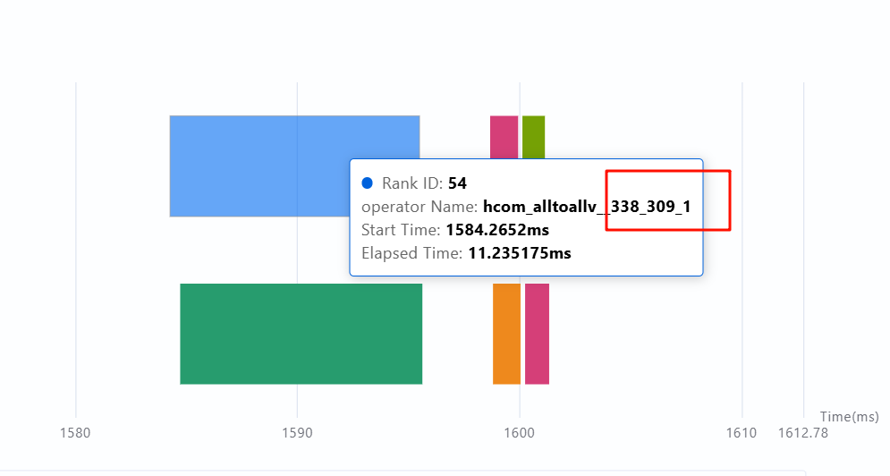

[Workaround] Temporarily set warmup to 0 to avoid this issue. (Warmup allows users to start some profiler processes in advance to prevent the profiler processes from affecting the training step duration during the actual collection phase. You can set warmup to 0, collect a few more steps, and then manually skip the first few steps.)

[Future Modification Plan] When parsing data, the profiler should first correctly filter out the communication duration in the warmup phase and then start counting from 0. This has been transferred to an internal task for tracking, and the tuning team will follow up on the modification progress.

## No Communication Data for Specific Steps Visible During Profiling

### Problem Description

When using the PyTorch Lightning library, specific step-level communication data is not visible in the profiling results, raising suspicion of an issue with the profiling method.

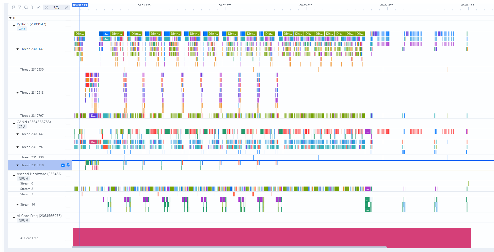

### Solution

After analyzing the data, it was found that only steps 2, 3, and 4 were collected, while the main operators were in step 0. The data from step 0 must also be collected during profiling.

## Clicking Communication Operator Shows No Operator Flows

### Problem Description

When clicking collective communication, the hcom_allGather__ operator has no flow, and it is unclear where this operator was issued from.

Tool Version: Insight 8.1

### Solution

Update to Insight 8.2 or later.

## Significant Discrepancy in Operator Duration Between Timeline and Communication

### Problem Description

The execution time of the hcom_allGather__145_10 operator differs significantly between the timeline and communication views.

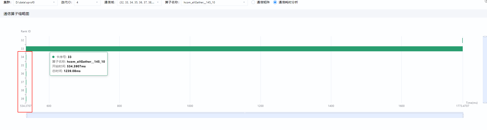

Tool Version: Insight 8.1

### Solution

[Problem Analysis]
This is a data issue. 1. The data on the **Communication** tab comes from the `communication.json` file; the data on the **Timeline** tab comes from the `trace_view.json` file.

[Resolution]
The collection team recommends using a newer TorchNPU version to re-collect and parse the data.

## Multi-Rank Timeline Misalignment in Cluster Scenarios, with a Discrepancy Exceeding the Minute Level

### Problem Description

In a cluster scenario, multi-rank timelines are misaligned, with discrepancies exceeding the minute level.

### Solution

[Problem Analysis]
The time on the machines corresponding to the 64 ranks in this data may be inconsistent with that on other machines, resulting in a misalignment exceeding the minute level.

[Resolution]

1. You can align by modifying the unit offset, or after setting a reference operator, press L/R on the keyboard to align based on the start or end of the reference operator.

2. Alternatively, if you only want to view the alignment of communication operators, you can right-click an operator you wish to align on the **Communication** page and select "Align by Selected Operator" to align the communication operators across all ranks.

    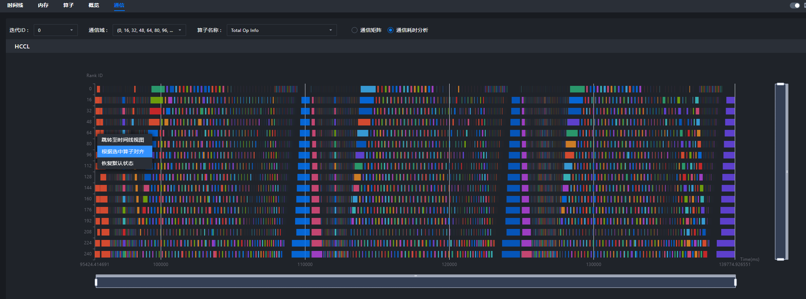

## When Using msInsight for Profiling Analysis, the Operation Causing Free Time Cannot Be Identified

### Problem Description

This task runs in ACLGraph mode. A large number of units have no flows dispatched for tasks, making it impossible to locate the corresponding Python API through flows.

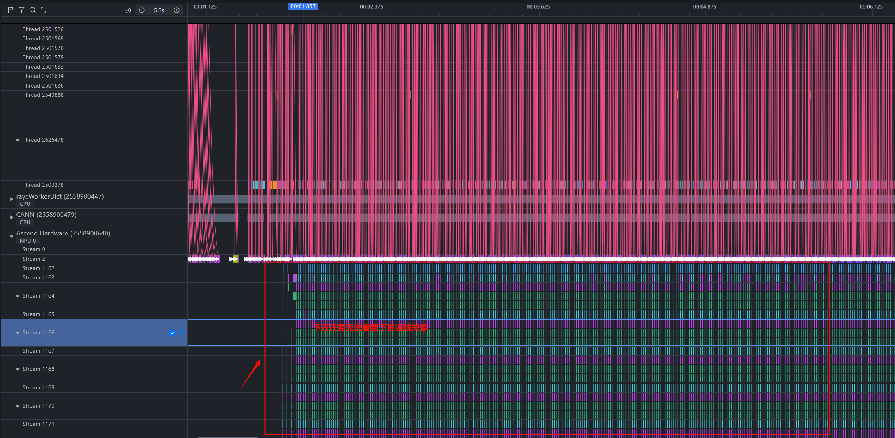

### Solution

[Problem Analysis]
vllm performs all compilation actions related to ACLGraph or graphs during the initialization phase of the vllm object, but the profiler can only be enabled after vllm is instantiated. Therefore, this data cannot be captured at present.
