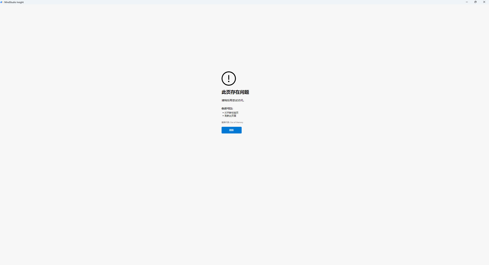

# White Screen Issues

<!-- md-trans-meta sourceCommit=fa1a6c7eaa3f2f5893a21924aaf47beb93b490b6 translatedAt=2026-08-12T11:46:02.323Z pushedAt=2026-08-12T11:57:31.151Z -->

## White Screen on MindStudio Startup

### Problem Description

Version: MindStudio 8.2.RC1.B120

OS: win11

### Solution

This can be temporarily resolved by using the frontend-backend separated startup method.

## White Screen When Loading Memory

### Problem Description

### Solution

[Cause]

The line chart data source `memory_record.csv` is too large, reaching 1.3 GB, causing the page to run out of memory (OOM).

[Resolution]

msInsight 8.3 optimized the memory page.
