# **MindStudio Insight Memory Tuning**

## Overview

MindStudio Insight displays the detailed memory allocation on the device in graphics. Currently, two types of memory data sources are supported:

### MemScope Data Source

Based on the visualization of the memory allocation and release lifetime, the tool marks the details of various memory allocations using the **Python call stack** and **customized tracing labels**, to locate memory problems, **analyze peak values**, and **identify inefficient memory blocks** to achieve the tuning objective.

### PyTorch Snapshot Data Source

Based on the visualization of the memory allocation and release lifetime, the tool locates and tunes memory fragmentation problems based on the **memory pool allocation status**.

>[!NOTE]
>
>The PyTorch Snapshot function is referred to as the memory snapshot function in this document.

**Data Source Selection Guide**

| Data Source | Applicable Scenarios | Advantages | Limitations |
| --- | --- | --- | --- |
| msMemScope | Analyze all memory events (including memory outside the framework), detect memory leaks, and perform memory breakdown analysis. | Complete data covering all memory events; supports Memory Block Timeline Graph, Memory Details Disassembly Diagram, and Call Stack Flame Graph. | Collection has a certain impact on runtime performance. |
| PyTorch Snapshot | Only analyze the memory pool managed by the PyTorch framework, perform memory fragmentation analysis, and optimize memory peaks. | Low collection performance overhead; memory pool status data included | Covering only memory managed by the PyTorch framework; large-scale data analysis depends on visualization tools. |

## Preparations

### Collecting MemScope Data

**Environment Setup**

Install MindStudio Insight first. For details, see [MindStudio Insight Installation Guide](../install_guide/mindstudio_insight_install_guide.md).

Install the msMemScope tool. Before installation, ensure that the following conditions are met:

- The CANN toolkit (version 7.0 or later) has been installed and the environment variables have been configured.
- Python version >= 3.8

Installation command:

```shell
pip install msmemscope
```

For more installation methods, see [msMemScope Tool Installation Guide](https://gitcode.com/Ascend/msmemscope/blob/master/docs/en/install%5Fguide/install%5Fguide.md).

**Data Collection**

Data for memory tuning scenarios is collected and generated by the msMemScope tool, which supports the following collection methods:

| Collection Method | Applicable Scenario | Collection Command Example | Generated File |
| --- | --- | --- | --- |
| Command line | General command-line approach, applicable to multiple frameworks | `msmemscope --output=./output python train.py` | memscope_dump_{timestamp}.db |
| Python API | Custom collection scope and parameters | See [msMemScope Python API Collection](https://gitcode.com/Ascend/msmemscope/blob/master/docs/en/user%5Fguide/memory%5Fprofile.md#python-api-collection-feature-introduction) | memscope_dump_{timestamp}.db |
| mstx instrumentation | Combined with mstx instrumentation capability | See [msMemScope mstx Instrumentation Collection](https://gitcode.com/Ascend/msmemscope/blob/master/docs/zh/user%5Fguide/memory%5Fprofile.md#mstx-instrumentation-collection-feature-introduction) | memscope_dump_{timestamp}.db |

>[!NOTE]
>
> - `--events` must include at least the `alloc` and `free` events; otherwise, the Memory Block Timeline Graph cannot be generated.
> - The Memory Details Disassembly Diagram is generated only when `--analysis` value includes `decompose`.
> - For more collection parameters and usage, see [msMemScope User Guide](https://gitcode.com/Ascend/msmemscope/blob/master/docs/en/user%5Fguide/memory%5Fprofile.md).

**Importing Data**

After collection is complete, import the generated db-format file into the MindStudio Insight tool. For data import operations, see [Importing Data](./basic_operations.md#importing-data).

### Collecting PyTorch Snapshot Data

#### Basic Collection Process

torch_npu provides APIs for collecting memory snapshots. The basic collection process is as follows:

1. Enable the memory history function. Before running the model code, call `torch_npu.npu.memory._record_memory_history()` to enable the memory history function. This function records memory allocation and release events and stack information.
2. Run the target code, that is, the model code for analyzing the memory usage scenario (such as training or inference).
3. Export the memory snapshot. After the code execution is complete, call `torch_npu.npu.memory._dump_snapshot("snapshot.pickle")` to save the memory snapshot as a `pickle` file.

|Core API Parameters|Description|
|--|--|
|`torch_npu.npu.memory._record_memory_history()` function parameters|- `enabled`: Controls the scope of recorded content. `None` disables recording; `state` records only current allocations; `all` records all memory allocation/deallocation events (default).<br>- `context`: Controls the scope of recorded stack information. `None` does not record; `state` records only current allocations; `alloc` additionally records allocation operation stacks; `all` additionally records deallocation operation stacks (default).<br>- `stacks`: Controls the stack depth. `python` includes Python/TorchScript/inductor; `all` additionally includes C++ (default).<br>- `max_entries`: Limits the number of recorded memory events. Default is `9223372036854775807` (no limit).<br>- `device`: Optional parameter that specifies the device for which to record memory history.|
|`torch_npu.npu.memory._dump_snapshot(file_path)` function parameters|- `file_path`: specifies the path of the file that stores the memory snapshot. The file format is `pickle`.|

The following is an example of the code for collecting **PyTorch Snapshot (memory snapshot)** data:

```python
import torch
import torch_npu

# Enable the memory history to record all events and stack information.
torch_npu.npu.memory._record_memory_history(stacks='python')

# Run the model code.
def run_model():
    # Model definition and training/inference code
    model = torch.nn.Linear(1000, 1000).cuda()
    input = torch.randn(1000, 1000).cuda()
    output = model(input)
    loss = output.sum()
    loss.backward()

run_model()

# Export memory snapshot.
torch_npu.npu.memory._dump_snapshot("model_memory_snapshot.pickle")
```

## Data Description

### MemScope Data Description

You can import the memory result files in DB format collected by the msMemScope tool to display related content in graphics. For details about how to obtain the DB file, see section "[Collection via CLI](https://gitcode.com/Ascend/msmemscope/blob/master/docs/en/user%5Fguide/memory%5Fprofile.md#%E5%91%BD%E4%BB%A4%E8%A1%8C%E9%87%87%E9%9B%86%E5%8A%9F%E8%83%BD%E4%BB%8B%E7%BB%8D)" in the *msMemScope Memory Collection*. For details about the memory data that can be imported, see [**Table 1** Data visualization dependencies](#data-visualization-dependencies).

**Table 1** Data visualization dependencies <a id="data-visualization-dependencies"></a>

<style type="text/css">

</style>
<table class="tg"><thead>
  <tr>
    <th class="tg-0lax">File Name</th>
    <th class="tg-0lax">Description</th>
    <th class="tg-0lax">Displayed Content</th>
  </tr></thead>
<tbody>
  <tr>
    <td class="tg-0pky" rowspan="3">memscope_dump_{timestamp}.db</td>
    <td class="tg-0lax">The value of <code>--events</code> must contain at least the alloc and free events.</td>
    <td class="tg-0pky">Memory block lifetime chart (memory allocation/release curve and memory block chart)</td>
  </tr>
  <tr>
    <td class="tg-0lax">The value of <code>--analysis</code> contains <code>decompose</code>.</td>
    <td class="tg-0lax">Memory details chart</td>
  </tr>
  <tr>
    <td class="tg-0lax">The tracer function is enabled using the Python API.</td>
    <td class="tg-0pky">Python call stack chart</td>
  </tr>
</tbody>
</table>

### PyTorch Snapshot Data Description

PyTorch Memory Snapshot is a memory snapshot function provided by PyTorch. It is used to record and analyze the memory usage of the memory pool managed by PyTorch during model running. For details about the original data of memory snapshot, see "[Memory Snapshot Application Scenarios](https://gitcode.com/Ascend/pytorch/blob/v2.7.1-26.0.0/docs/en/framework_feature_guide_pytorch/memory_snapshot.md#%E4%BD%BF%E7%94%A8%E5%9C%BA%E6%99%AF)" in *Memory Snapshot*.

**Common Memory Problems**

- Memory leak, overflow, or reallocation: During model training or inference, the memory usage keeps increasing step by step or request by request until an avalanche occurs (APP or PTA reserved memory suddenly decreases after reaching a certain point) or out of memory (OOM) occurs.

- Memory fragmentation: During model training, there is a large gap between the operator reservation and operator allocation curves.

- Peak memory tuning: During model training, the peak memory needs to be analyzed to determine which operators or tensors cause the peak memory. Then evaluate whether the memory peak can be reduced by adjusting the allocation order of tensors or the execution order of operators.

>[!NOTE]
>
>The preceding common memory problems occur when the memory tab page is displayed on the **System Tuning** page after profile data is collected.

## Memory Details

### MemScope Data Memory Details

#### Function Description

During memory tuning, MindStudio Insight displays the memory status through the Python call stack and memory block lifetime charts, allowing developers to conveniently analyze and locate memory issues.

#### GUI Description

The memory details (msMemScope) page consists of the Call Stack Flame Graph (area 1), Memory Block Timeline Graph (area 2), Memory Details Disassembly Diagram (area 3), and Memory Details Table (area 4).

- Area 1: Call Stack Flame Graph. By selecting a thread ID, the corresponding Python call stack diagram is displayed. Enter a function name to search in the "Search" input box, or click the drop-down box to select a function name. Multiple function names can be selected for searching, and the searched functions will be highlighted in the call stack graph, as shown in [**Figure 1** Call Stack Flame Graph](#call-stack-flame-graph).

  >[!NOTE]
  >
  >
  > By default, the **Allow Trim** option is selected in this area. In this state, the tool compresses data without affecting the overall data display, improving the tool usability.

 **Figure 1**  Call Stack Flame Graph<a id="call-stack-flame-graph"></a>

 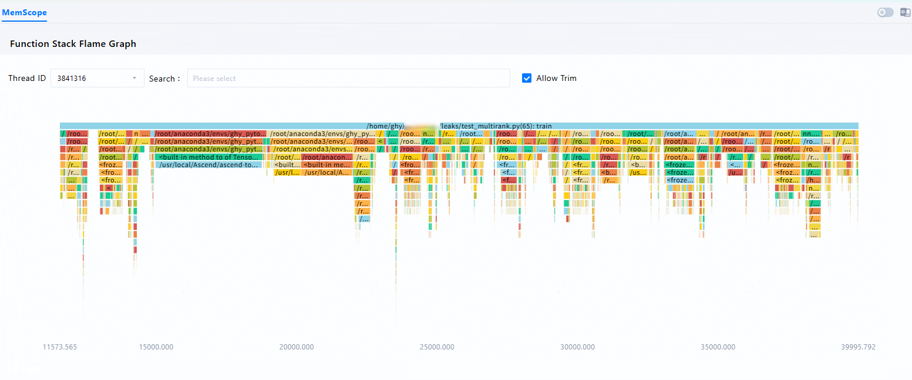

- Area 2: The Memory Block Timeline Graph displays the memory allocation/release line graph and memory block graph. You can select a color block in the memory block chart to view details about the memory block. You can also select a device ID and type to view the corresponding memory block timeline graph, as shown in [**Figure 2** Memory Block Timeline Graph](#memory-block-timeline-graph).

  **Figure 2**  Memory Block Timeline Graph<a id="memory-block-timeline-graph"></a>

  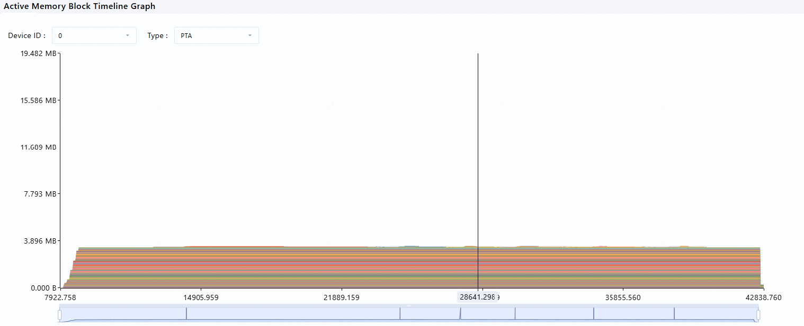

- Area 3: The Memory Details Disassembly Diagram is not displayed by default. When you hover the mouse pointer over the call stack flame graph or Memory Block Timeline Graph, a timeline is displayed. In the Memory Block Timeline Graph area, click the timeline to view the memory details disassembly graph at the corresponding time point. After the memory details disassembly graph is displayed, you can click the button in the upper left corner to hide or display the graph, as shown in [**Figure 3** Memory Details Disassembly Diagram](#memory-details-disassembly-diagram).

  **Figure 3**  Memory Details Disassembly Diagram<a id="memory-details-disassembly-diagram"></a>

  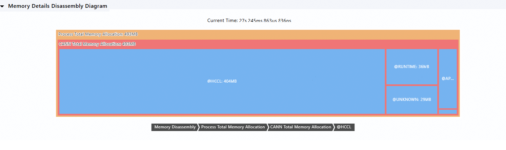

- Area 4: The Memory Details Table is classified into **Block View** and **Event View** for your selection, as shown in [**Figure 4**  Memory Details Table](#memory-details-table). For details, see [Memory Details](#memory-details).

  **Figure 4**  Memory Details Table<a id="memory-details-table"></a>

  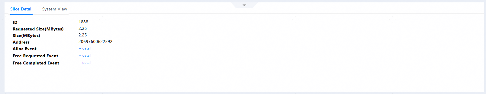

#### Usage Description

**The call stack flame graph and Memory Block Timeline Graph can be used to view data within a specified time range.**

In the call stack flame graph and Memory Block Timeline Graph of MindStudio Insight, you can select a range by dragging the zoom slider in the trend chart to display data within a specified range, as shown in [**Figure 1** Zoom slider in the trend chart](#zoom-slider-in-the-trend-chart).

**Figure 1** Zoom slider in the trend chart <a id="zoom-slider-in-the-trend-chart"></a>


**The zoom slider in the trend chart supports trend chart visualization and diversified operations on the time domain.**

1. Trend chart visualization:

    The background of the zoom slider in the trend chart of MindStudio Insight displays the trend of the memory usage (Operator Allocated) in the overall time range, and intuitively displays the memory usage trend in the selected time range.

    >[!NOTE]
    >
    >
    >The Operator Allocated curve indicates the change trend of the allocated memory collected when the operator allocates or releases the memory. It represents the total allocated memory of all operators.

2. Diversified operations on the time domain:

- You can use the left and right arrow keys to select the start time and end time and view the memory usage.
- You can select any range in the trend chart to select a time range and display the corresponding memory usage.
- You can set a fixed time length and drag the slider leftwards or rightwards to view the memory usage in the fixed time length.

**The Memory Block Timeline Graph and Memory Details Disassembly Diagram support dragging and scrolling.**

 - The Memory Block Timeline Graph and Memory Details Disassembly Diagram can be moved by dragging and zoomed in or out by scrolling.
 - The Memory Block Timeline Graph supports selecting a zoom mode via the button in the upper-right corner of the view. Two modes are available: horizontal zoom and proportional zoom, with proportional zoom as the default:

   - Horizontal Zoom: Only the horizontal time axis is zoomed. After selection, use the `Shift` key + `↑` key/`↓` key to zoom horizontally.
   - Proportional Zoom: The entire view is zoomed proportionally. After selection, use the `Ctrl` key + `↑` key/`↓` key to zoom proportionally.

**Memory Details Disassembly Diagram**

When you hover the mouse pointer over the call stack flame graph or Memory Block Timeline Graph, a timeline is displayed. In the Memory Block Timeline Graph area, click the timeline to view the Memory Details Disassembly Diagram at the corresponding time point below the Memory Block Timeline Graph, helping you view the memory usage. The content displayed in Memory Details Disassembly Diagram varies depending on the selected type.

To view a specified memory layer, click the layer bar below Memory Details Disassembly Diagram.

- When the type is set to HAL, Memory Details Disassembly Diagram displays only the memory data classified at the CANN layer, as shown in [**Figure 2** Memory Details Disassembly Diagram at the CANN layer](#memory-details-disassembly-diagram-at-the-cann-layer).

    **Figure 2** Memory Details Disassembly Diagram at the CANN layer <a id="memory-details-disassembly-diagram-at-the-cann-layer"></a>

    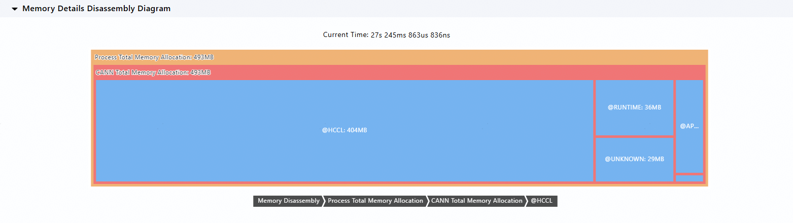

- If **Type** is set to a value other than **HAL**, Memory Details Disassembly Diagram displays the memory type and layer of the memory pool on the corresponding framework. For example, if **Type** is set to PTA, Memory Details Disassembly Diagram displays only the memory information of the PTA framework, as shown in [**Figure 3** Memory Details Disassembly Diagram of the PTA framework](#memory-details-disassembly-diagram-of-the-pta-framework).

    **Figure 3** Memory Details Disassembly Diagram of the PTA framework <a id="memory-details-disassembly-diagram-of-the-pta-framework"></a>

    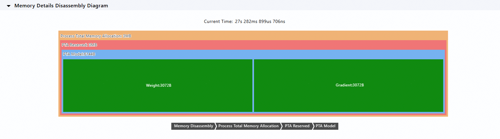

>[!NOTE]
>
> You can drag the Memory Details Disassembly Diagram leftward, rightward, upward, and downward, and zoom in or out the diagram.
>
> - Place the cursor on the diagram and hold down the left mouse button to drag the diagram left, right, up, or down.
> - On the Memory Details Disassembly Diagram, you can use the mouse wheel to zoom in or out the diagram. Alternatively, you can select a memory block and left-click to zoom in on the selected memory layer.

<a id="memory-details"></a>

**Memory Details**

The Memory Details Table area displays memory details by **Block View** and **Event View**. By default, all memory information is displayed.
>[!NOTE]
>
> - The memory details are hidden by default. To view the details, click the expand button to display the memory details. If you do not need to view the memory details, click the collapse button to hide the memory details.
> - Filter is supported for the **Size**, **Malloc Timestamp**, and **Free Timestamp** fields in **Block View**, and the **Timestamp** field in **Event View**. After you click , you can enter integers between **0** and the value displayed in the table to set the minimum and maximum values of the filter range.

- **Block View**: displays detailed information about memory blocks, as shown in [**Figure 4** Block View](#block-view). For details about the fields, see [**Table 1** Block View fields](#block-view-fields).

    When you select different device IDs and types in the Memory Block Timeline Graph, the information displayed in the memory block view is updated accordingly. When you select an area in the Memory Block Timeline Graph, the information displayed in the memory block view is also updated accordingly, showing information about all memory blocks that overlap with the selected time range.

    To filter inefficient memory blocks, you can click **Filter Inefficient Memory Blocks** in the upper right corner of the **Block View** table, and set thresholds for early request, delayed release, or long idle period.

    **Figure 4** Block View <a id="block-view"></a>

    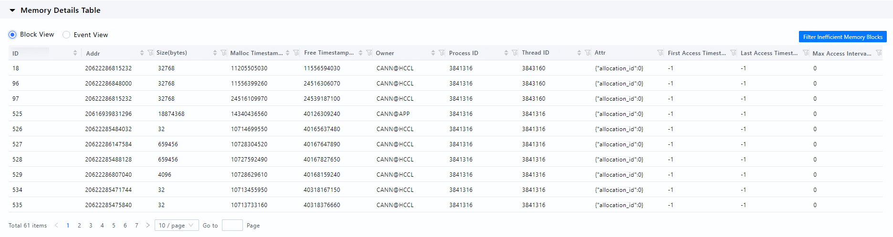

    **Table 1** Block View fields <a id="block-view-fields"></a>

    |Field|Description|
    |--|--|
    |ID|Memory Block ID – a unique identifier for each memory block. Clicking it navigates to the corresponding block in the call stack flame graph and highlights it.|
    |Addr|Memory block address, which corresponds to the address of the memory request, release, or access event.|
    |Size(KBytes)|Size of the memory block, which corresponds to the memory request event. The unit is KBytes.|
    |Malloc Timestamp(ns)|Time when the memory block is requested, which corresponds to the memory request event. The unit is nanoseconds.|
    |Free Timestamp(ns)|Time when the memory block is released, which corresponds to the memory release event. The unit is nanoseconds.|
    |Owner|Memory block owner.|
    |Process ID|Memory block process ID, which corresponds to the process ID of the memory request or release event.|
    |Thread ID|Memory block thread ID, which corresponds to the thread ID of the memory request or release event.|
    |First Access Timestamp(ns)|Time of the first access event.|
    |Last Access Timestamp(ns)|Time of the last access event.|
    |Max Access Interval(ns)|Maximum interval of access events.|
    |Attr|Extended attributes:<br> - **allocation_id**: ID for the request, access, or release sequence of a memory block. It uniquely identifies a group of memory events.<br> - **lazy_used**: early request. The value can be **true** or **false**. **true** indicates that the scenario has been detected.<br> - **delayed_free**: delayed release. The value can be **true** or **false**. **true** indicates that the scenario has been detected.<br> - **long_idle**: long idle period. The value can be **true** or **false**. **true** indicates that the scenario has been detected.|

  >[!NOTE]
  >
  > - If the imported data is collected by the msMemScope tool of a version earlier than MindStudio 8.2.RC1 or no access event is collected, **allocation\_id** is displayed as **0**, **First Access Timestamp\(ns\)** and **Last Access Timestamp\(ns\)** are displayed as **-1**, and **Max Access Interval\(ns\)** is displayed as **0**.
  > - Currently, the msMemScope tool can collect memory access events only in the ATB and Ascend for PyTorch operator scenarios. Therefore, **First Access Timestamp\(ns\)**, **Last Access Timestamp\(ns\)**, and **Max Access Interval\(ns\)** are available only in these scenarios. In other scenarios, **First Access Timestamp\(ns\)** and **Last Access Timestamp\(ns\)** are displayed as **-1**, and **Max Access Interval\(ns\)** is displayed as **0**.

- **Event View**: displays detailed information about memory events, as shown in [**Figure 5** Event View](#event-view). For details about the fields, see [**Table 2** Event View fields](#event-view-fields).

    When you select different device IDs in the Memory Block Timeline Graph, the information displayed in the event view is updated accordingly. When you select a specific area in the Memory Block Timeline Graph, the information in the event view is also updated, displaying all memory events within the selected time range.

    **Figure 5** Event View <a id="event-view"></a>

    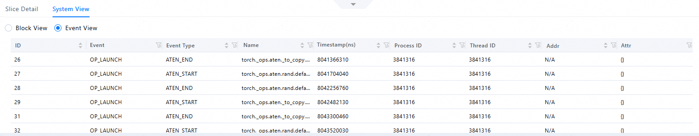

    **Table 2** Event View fields <a id="event-view-fields"></a>

    | |Field|Description|
    |--|--|--|
    | |ID|Event ID, which, together with **Process ID**, uniquely identifies an event.|
    | |Event|Events recorded by msMemScope.|
    | |Event Type|Event subtypes.|
    | |Name|Event name, which is related to the value of **Event**.|
    | |Timestamp(ns)|Time when a memory event occurs.|
    | |Process ID|Process information.|
    | |Thread ID|Thread ID.|
    | |Addr|Memory address.|
    | |Attr|Memory event attribute. Each event type has its own attribute.|
    | |Call Stack(Python)|Python call stack. This field is displayed only when the information is collected.|
    | |Call Stack(C)|C call stack. This field is displayed only when the information is collected.|

    >[!NOTE]
    >
    > For details about the values of **Event**, **Event Type**, and **Name** fields, see the description of the **msmemscope\_dump\_\{timestamp\}.csv** result file in section "[Collection via CLI](https://gitcode.com/Ascend/msmemscope/blob/master/docs/en/user%5Fguide/memory%5Fprofile.md#%E5%91%BD%E4%BB%A4%E8%A1%8C%E9%87%87%E9%9B%86%E5%8A%9F%E8%83%BD%E4%BB%8B%E7%BB%8D)" in *msMemScope Memory Collection*.

- **Slice Detail**: displays details about the memory block, as shown in [**Figure 6** Slice Detail](#Slice Detail).

    When you click the view of any time point in the Memory Block Timeline Graph, the displayed information in the **Slice Detail** area is updated accordingly.

    **Figure 6** Slice Detail <a id="Slice Detail"></a>

    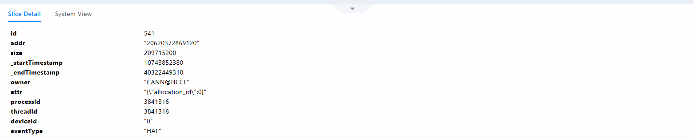

### PyTorch Snapshot Data Memory Details (Memory Snapshot)

#### Description

Based on the visualization of the memory allocation and release lifetime, the tool locates and tunes memory fragmentation problems based on the **memory pool allocation status**.

#### GUI Description

The **PyTorch Snapshot** page consists of the Memory Block Timeline Graph (area 1), Memory Pool Status Graph (area 2), and Memory Details Table (area 3).

- Area 1: As shown in [**Figure 1** Memory Snapshot Memory Block Timeline Graph](#memory-snapshot-memory-block-timeline-graph). The Memory Block Timeline Graph displays the reserved line chart, the memory allocation/deallocation line chart, and the memory block diagram. Selecting a colored block in the memory block diagram displays the details of that memory block, and calculates **Unreleased Total**, **Unreleased Max Block**, and **Unreleased Min Block** within the range selected by the zoom bar. The meanings of these three statistics are as follows:

  - **Unreleased Total**: the sum of the sizes of memory blocks that are **allocated but not deallocated** within the zoom bar interval.
  - **Unreleased Max Block**: the size of the **largest** memory block that is **allocated but not deallocated** within the zoom bar interval.
  - **Unreleased Min Block**: the size of the **minimum** memory block that is **allocated but not released** within the zoom bar interval.

  >[!NOTE]
  >
  > reserved line chart: a trend chart of the total PTA cache pool size (Operator Reserved), showing the change trend of the total PTA Caching pool size. It intuitively presents the actual cache pool size requested and managed by PTA from the driver, which is the sum of all segment sizes at any given moment.

  **Figure 1** Memory Snapshot Memory Block Timeline Graph<a id="memory-snapshot-memory-block-timeline-graph"></a>

  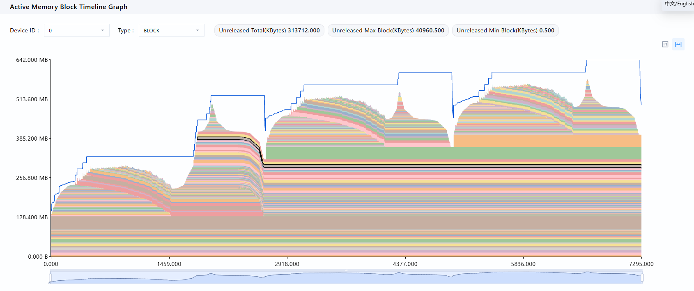

- Area 2: As shown in [**Figure 2** Memory Snapshot Memory Pool State Diagram](#memory-snapshot-memory-pool-state-diagram), when you hover the mouse pointer over the Memory Block Timeline Graph, a timeline is displayed. In the Memory Block Timeline Graph area, click the timeline to view the memory pool status graph at the corresponding time point. For details, see [Memory Pool Status Graph](#memory-pool-status-graph).

  **Figure 2** Memory Snapshot Memory Pool State Diagram<a id="memory-snapshot-memory-pool-state-diagram"></a>

  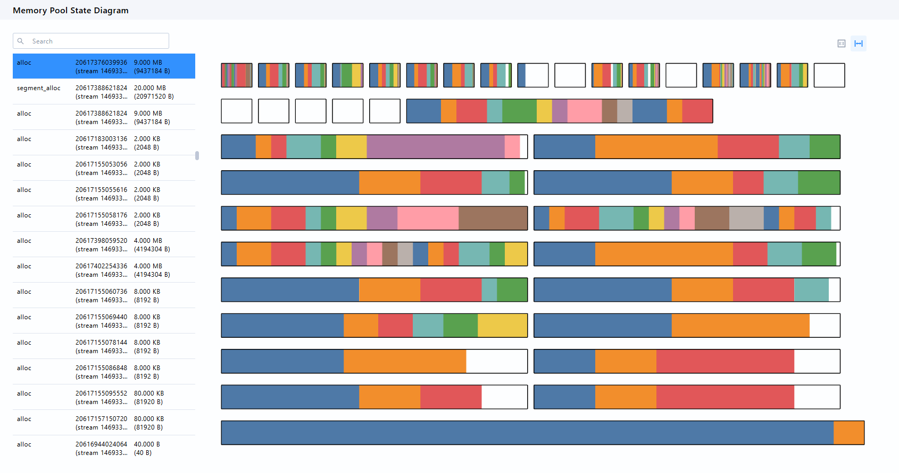

- Area 3: As shown in [**Figure 3** Memory Snapshot Detail Data](#memory-snapshot-detail-data), the memory snapshot details table is classified into **Block View** and **Event View** for your selection. For details, see [Memory Snapshot Details](#memory-snapshot-details).

  **Figure 3** Memory Snapshot Detail Data<a id="memory-snapshot-detail-data"></a>

  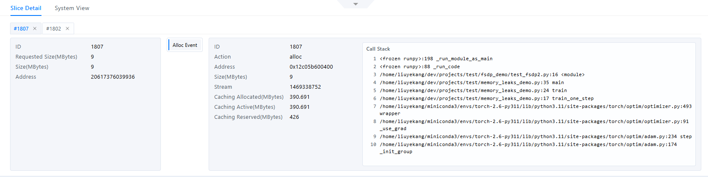

#### Usage Description

**The Memory Block Timeline Graph can be used to view data within a specified time range.**

In the Memory Block Timeline Graph of MindStudio Insight, you can select a range by dragging the zoom slider in the memory snapshot trend chart to display data within a specified range, as shown in [**Figure 1** Zoom slider in the memory snapshot trend chart](#zoom-slider-in-the-memory-snapshot-trend-chart).

**Figure 1** Zoom slider in the memory snapshot trend chart <a id="zoom-slider-in-the-memory-snapshot-trend-chart"> </a>

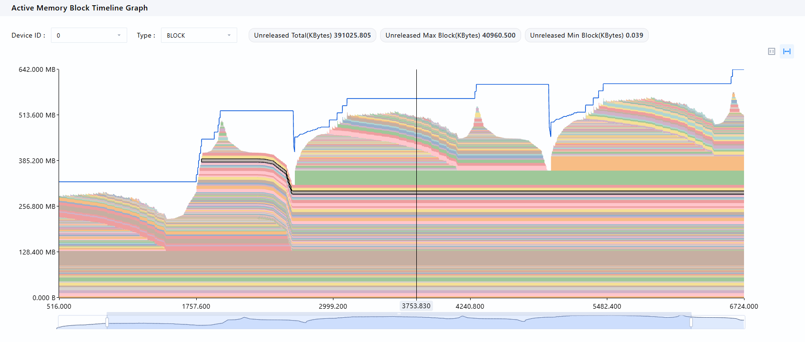

**The zoom slider in the trend chart supports trend chart visualization and diversified operations on the time domain.**

1. Trend chart visualization:

    The background of the zoom slider in the memory snapshot trend chart of MindStudio Insight displays the trend chart of the memory usage (Operator Allocated) in the overall time range, intuitively showing the trend of the entire memory usage in the selected time range.

    >[!NOTE]
    >
    >The Operator Allocated curve indicates the change trend of the allocated memory collected when the operator allocates or releases the memory. It represents the total allocated memory of all operators.

2. Diversified operations on the time domain:

    - You can use the left and right arrow keys to select the start time and end time and view the memory usage.
    - You can select any range in the trend chart to select a time range and display the corresponding memory usage.
    - You can set a fixed time length and drag the slider leftwards or rightwards to view the memory usage in the fixed time length.

**The Memory Block Timeline Graph and memory pool status graph support dragging and scrolling.**

 - The Memory Block Timeline Graph and memory pool status graph can be moved by dragging and zoomed in or out by scrolling.
 - The Memory Block Timeline Graph and Memory Pool Status Diagram support selecting a zoom mode via the button in the upper-right corner of the view. Two modes are available: horizontal zoom and proportional zoom. The default mode is proportional zoom:

   - Horizontal zoom: Only the horizontal timeline is zoomed. After selection, use the <code>Shift</code> key + <code>↑</code> key/<code>↓</code> key to zoom horizontally.
   - Proportional zoom: The entire view is zoomed proportionally. After selection, use the <code>Ctrl</code> key + <code>↑</code> key/<code>↓</code> key to zoom proportionally.

<a id="memory-pool-status-graph"></a>

**Memory Pool Status Graph**

When the mouse is placed over the "Memory Block Timeline Graph" area, clicking a memory color block displays the event overview and Memory Block Timeline Graph for the corresponding time point below the "Memory Block Timeline Graph." You can also precisely locate event details by searching for the corresponding address, and filter data by specific event types, as shown in [**Figure 2** Memory Pool Status Diagram](#memory-pool-status-diagram).

>[!NOTE]
>
>If the memory pool status is not updated after you click a memory block, no allocation event is collected for the memory block in the lifetime.

**Figure 2** Memory Pool Status Diagram <a id="memory-pool-status-diagram"></a>

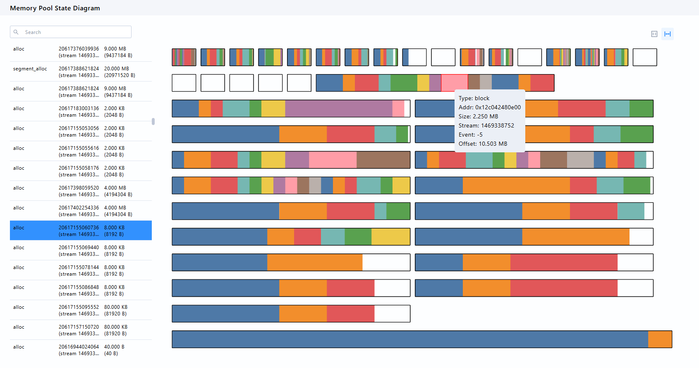

<a id="memory-snapshot-details"></a>

**Memory Snapshot Details**

The memory details include the slice detail and system view. The slice detail displays the details of the event. In the system view, the memory block view and memory event view are used to display memory details. By default, all memory-related information is displayed.
>[!NOTE]
> 
> - The memory details are hidden by default. To view the details, click the expand button to display the memory details. If you do not need to view the memory details, click the collapse button to hide the memory details.
> - For the **Size(KBytes)** and **Requested Size(KBytes)** fields in the memory block view, and the **Size(KBytes)**, **Allocated(KBytes)**, **Active(KBytes)**, and **Reserved(KBytes)** fields in the memory event view, you can click  to enter the minimum and maximum values for range filtering.

- **Block View**: displays detailed information about memory blocks within the selected interval of the zoom bar, as shown in [**Figure 3** Block View](#block-view). For details about the fields, see [**Table 1** Block View fields](#block-view-fields). When hovering the mouse over the view, a  button appears in the upper right corner. Click it to copy the currently displayed content in the table.

    **Figure 3** Block View <a id="block-view"></a>

    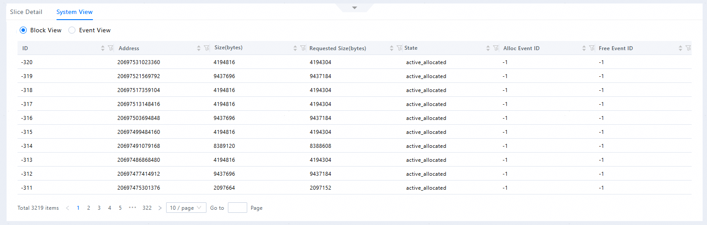

    **Table 1** Block View fields <a id="block-view-fields"></a>

    |Field|Required/Optional|Description|Type|Example Value|Remarks|
    |--|--|--|--|--|--|
    |ID|Required|Unique ID of a memory event.|Integer|0|You can click the ID to navigate to the corresponding memory block in the memory timeline graph and highlight it.<ul><li>A negative value indicates that the allocation event of this memory block was not recorded during the memory snapshot collection lifetime (the negative value has no actual meaning).</li><br><li>A non-negative value represents the memory block allocation event ID.</li></ul>|
    |Requested Size(KBytes)|Required|Size of the memory block to be allocated, in KBytes.|Floating point number|12.5|Size of the memory required by the allocation event. The PTA performs padding and alignment based on the requested size. Therefore, the allocated size may be greater than the requested size.|
    |Size(KBytes)|Required|Size of the memory operated by the memory event, in KBytes.|Floating point number|12.5|Actual size of the memory allocated to the memory block, in KBytes. The value is greater than or equal to the requested size.|
    |Address|Required|Memory event address.|0xhexadecimal address|0x7f9f00000000|Address of the memory block in the memory.|
    |State|Required|Memory block status.|One of the enumerated values. For details, see the remarks.|`active_allocated`|Current status of the memory block. The options are as follows:<br><ul><li>`active_allocated`: The memory block has been allocated and is currently in use. It cannot be reused.</li><br><li>`active_pending_free`: The memory block has been requested to be released, but the release is not complete (possibly due to cross-stream dependencies). It cannot be reused.</li><br><li>`inactive`: The memory block is not allocated (or the memory block has been released) and can be reused.</li></ul>|
    |Alloc Event ID|Optional|ID of the memory block allocation event.|Integer|1|Unique ID of the memory block allocation event. The value `-1` indicates that the memory block allocation event is not recorded in the memory snapshot collection lifetime. You can click the memory block allocation event ID to navigate to the corresponding event in the Memory Pool State Diagram and highlight it.|
    |Free Event ID|Optional|ID of the memory block release completion event.|Integer|2|Unique ID of the memory block release completion event. The value `-1` indicates that the memory block release completion event is not recorded in the memory snapshot collection lifetime. You can click the memory block deallocation completion event ID to navigate to the corresponding event in the Memory Pool Status Diagram and highlight it.|

   The **Block View** provides the "**Auto Filter Unreleased in Range**" feature. The filtering logic of this feature is as follows:

     - When this feature is not selected, all memory block details whose allocation/deallocation intervals intersect with the zoom bar selected interval are displayed. The schematic diagram is shown in "Before Enabled" in [Figure 4 Schematic diagram of the Auto Filter Unreleased in Range logic](#auto-filter-interval-non-deallocation-display-logic), and the actual effect is shown in [Figure 5 Block View with Auto Filter Unreleased in Range not selected](#memory-block-view-with-auto-filter-interval-non-deallocation-not-selected).

     - When this feature is selected, all memory block details that are allocated but not deallocated within the zoom bar selected interval are displayed. This is used to identify memory blocks occupied by potential leak tensors. The schematic diagram is shown in "After Enabled" in [Figure 4 Schematic diagram of the auto-filter interval non-deallocation display logic](#auto-filter-interval-non-deallocation-display-logic), and the actual effect is shown in [Figure 6 Block View with Auto Filter Unreleased in Range selected](#memory-block-view-with-auto-filter-interval-non-deallocation-selected).

       **Figure 4** Schematic diagram of the Auto Filter Unreleased in Range logic <a id="auto-filter-interval-non-deallocation-display-logic"></a>

       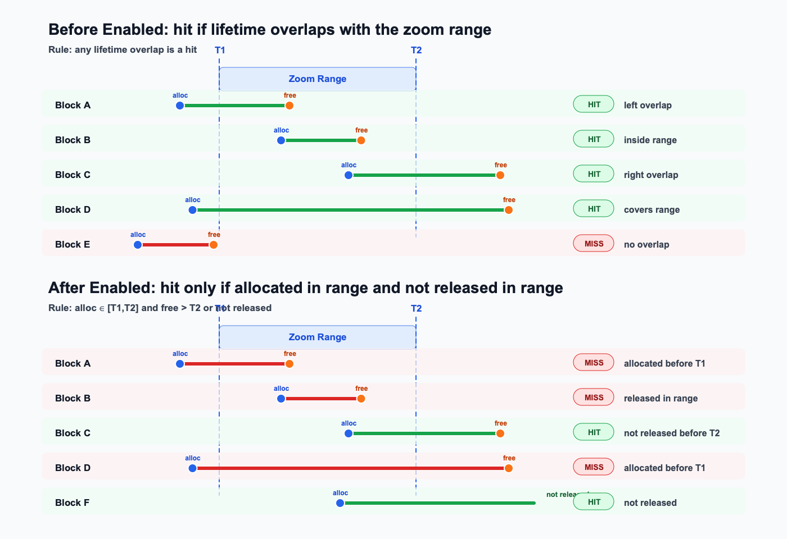

       **Figure 5** Block View with Auto Filter Unreleased in Range not selected<a id="memory-block-view-with-auto-filter-interval-non-deallocation-not-selected"></a>

       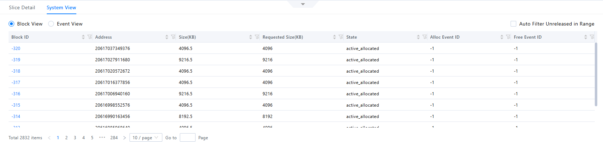

       **Figure 6** Block View with Auto Filter Unreleased in Range selected<a id="memory-block-view-with-auto-filter-interval-non-deallocation-selected"></a>

       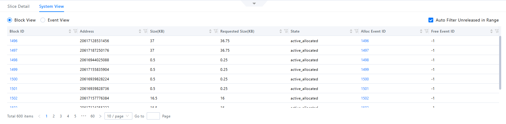

     - **Event View**: displays detailed information about memory events within the zoom bar selected interval, as shown in [**Figure 4** Event View](#event-view), with field descriptions provided in [**Table 2** Event View fields](#event-view-fields). When you hover the mouse over the view, a  button appears in the upper right corner. Click it to copy the content currently displayed in the table.

     When a different "Device ID" is selected in the "Memory Block Timeline Graph," the information displayed in the **Event View** updates accordingly. When a partial area is box-selected in the "Memory Block Timeline Graph," the information in the **Event View** also updates accordingly, displaying all memory events within the box-selected time range.

    **Figure 7** Event View <a id="event-view"></a>

    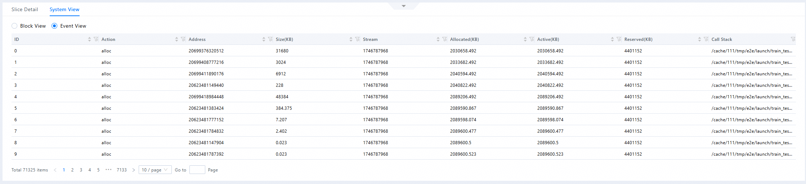

    **Table 2** Event View fields <a id="event-view-fields"></a>

    |Field|Required/Optional|Description|Type|Example Value|Remarks|
    |--|--|--|--|--|--|
    |ID|Required|Unique ID of a memory event.|Integer|0|You can click the memory event ID to jump to the corresponding event in the Memory Block Timeline Graph and highlight it.|
    |Action|Required|Memory event operation type.|One of the enumerated values. For details, see the description.|alloc|<ul><li>Memory segment operations:</li><br><ul><li>`segment_alloc`: memory segment allocation event, which triggers the PTA memory pool to allocate physical memory from the driver and triggers capacity expansion.</li><br><li>`segment_free`: memory segment release event, which triggers the PTA memory pool to release physical memory and triggers capacity reduction.</li><br><li>`segment_map`: memory segment mapping event. In the virtual memory scenario, this event triggers the PTA memory pool to map the physical memory to the virtual address space.</li><br><li>`segment_unmap`: memory segment unmapping event. In the virtual memory scenario, this event triggers the PTA memory pool to cancel the mapping of the physical memory to the virtual address space. </li></ul><li>Memory block operations:</li><br><ul><li>`alloc`: memory block allocation event. The PTA searches the memory pool for available inactive memory blocks for secondary allocation.</li><br><li>`free_requested`: memory block release request event. The PTA memory pool sets the memory block status to `active_pending_free` and waits for subsequent release. </li><li>`free_completed`: memory block release completion event. The PTA memory pool sets the memory block status to `inactive` and releases the memory block to the memory pool. </li></ul><li>Operator workspace snapshot: `workspace_snapshot`.</li></ul>|
    |Address|Required|Memory event address.|0xhexadecimal address|0x7f9f00000000|Memory address operated by the memory event.|
    |Size(KBytes)|Required|Size of the memory operated by the memory event, in KBytes.|Floating point number|12.5|None|
    |Stream|Required|ID of the stream to which the memory event belongs.|Integer|0|None|
    |Allocated(KBytes)|Required|Total size of secondary allocations from the PTA memory pool after the event, in KBytes.|Floating point number|12.5|Total size of all `active_allocated` blocks in all segments, indicating the size of memory that has been secondarily allocated from the PTA memory pool to tensors when the event occurs.|
    |Active(KBytes)|Required|Total size of active memory in the PTA memory pool after the event occurs, in KBytes.|Floating point number|12.5|Total size of all `active_allocated` blocks in all segments, indicating the size of memory that has been secondarily allocated from the PTA memory pool to tensors when the event occurs.|
    |Reserved(KBytes)|Required|Total size of reserved memory in the PTA memory pool after the event occurs, in KBytes.|Floating point number|12.5|The value is the total size of all memory segments, indicating the size of memory that is actually allocated from the driver and reserved in the PTA memory pool when the event occurs.|
    |Call Stack|Optional|Call stack of a memory event.|String|`/home/xxx/test/demo.py: 60 main`|Call stack of a memory event, which displays the call stack triggered when the memory event occurs. If the value is empty, the possible causes are as follows:<br><ul><li>Stacks are not enabled when `_record_memory_history` is called.</li><br><li>The event occurs in autograd during backward propagation, and there may be no call stack information.</li></ul>|

    >[!NOTE]
    >
    > For details about the values of **Event**, **Event Type**, and **Name** fields, see the description of the **msmemscope\_dump\_\{timestamp\}.csv** result file in section "[Collection via CLI](https://gitcode.com/Ascend/msmemscope/blob/master/docs/en/user%5Fguide/memory%5Fprofile.md#%E5%91%BD%E4%BB%A4%E8%A1%8C%E9%87%87%E9%9B%86%E5%8A%9F%E8%83%BD%E4%BB%8B%E7%BB%8D)" in *msMemScope Memory Collection*.

- **Slice Detail**: You can view multiple detail entries by clicking a color block in the Memory Block Timeline Graph, an event in the event list on the left side of the Memory Pool State Diagram, or a color block in the Memory Pool State Diagram. The detail information is divided into the following three categories:
  - Event-type: As shown in [**Figure 8** Event-type Slice Detail](#event-type-slice-detail). The field descriptions are provided in [**Table 3** Event-type Slice Details fields](#event-type-slice-detail-fields). Basic event information is displayed in the left area, and specific event information can be viewed by switching the event type.

    When you click the view of any time point in the Memory Block Timeline Graph, the displayed information in the **Slice Detail** area is updated accordingly.

    **Figure 8** Event-type Slice Detail <a id="event-type-slice-detail"></a>

    

    **Table 3** Event-type Slice Detail fields <a id="event-type-slice-detail-fields"></a>

    |Field|Required/Optional|Description|Type|Example Value|Remarks|
    |--|--|--|--|--|--|
    |ID|Required|Unique ID of a memory event. You can click the memory event ID to jump to the corresponding event in the Memory Block Timeline Graph and highlight it.|Integer|0|Click to jump to the Memory Block Timeline Graph.|
    |Action|Required|Memory event operation type.|One of the enumerated values. For details, see the description.|alloc|<ul><li>Memory segment operations:</li><br><ul><li><idp:inline displayname="code" id="code31262515467">segment_alloc</idp:inline>: memory segment allocation event, which triggers the PTA memory pool to allocate physical memory from the driver and triggers capacity expansion.</li><br><li><idp:inline displayname="code" id="code4698165713466">segment_free</idp:inline>: memory segment release event, which triggers the PTA memory pool to release physical memory and triggers capacity reduction.</li><br><li><idp:inline displayname="code" id="code52211310174716">segment_map</idp:inline>: memory segment mapping event. In the virtual memory scenario, this event triggers the PTA memory pool to map the physical memory to the virtual address space.</li><br><li><idp:inline displayname="code" id="code26361219154714">segment_unmap</idp:inline>: memory segment unmapping event. In the virtual memory scenario, this event triggers the PTA memory pool to cancel the mapping of the physical memory to the virtual address space. </li></ul><li>Memory block operations:</li><br><ul><li><idp:inline displayname="code" id="code1864793164714">alloc</idp:inline>: memory block allocation event. The PTA searches the memory pool for available inactive memory blocks for secondary allocation.</li><br><li><idp:inline displayname="code" id="code12643164524710">free_requested</idp:inline>: memory block release request event. The PTA memory pool sets the memory block status to `active_pending_free` and waits for subsequent release. </li><li><idp:inline displayname="code" id="code1395455394717">free_completed</idp:inline>: memory block release completion event. The PTA memory pool sets the memory block status to `inactive` and releases the memory block to the memory pool. </li></ul><li>Operator workspace snapshot: <idp:inline displayname="code" id="code281085764715">workspace_snapshot</idp:inline>.</li></ul>|
    |Address|Required|Memory event address.|0xhexadecimal address|0x7f9f00000000|Memory address operated by the memory event.|
    |Size(MBytes)|Required|Size of the memory operated by the memory event, in MBytes.|Floating point number|12.5|None|
    |Stream|Required|ID of the stream to which the memory event belongs.|Integer|0|None|
    |Caching Allocated(MBytes)|Required|Total size of secondary allocations from the PTA memory pool after the event, in MBytes.|Floating point number|12.5|Total size of all `active_allocated` blocks in all segments, indicating the size of memory that has been secondarily allocated from the PTA memory pool to tensors when the event occurs.|
    |Caching Active(MBytes)|Required|Total size of active memory in the PTA memory pool after the event occurs, in MBytes.|Floating point number|12.5|The value should be the sum of the total size of all `active_allocated` blocks and the total size of all `active_pending_free` blocks in all segments. Size of memory that is actually occupied but cannot be reused in the PTA memory pool when the event occurs.|
    |Caching Reserved(MBytes)|Required|Total size of reserved memory in the PTA memory pool after the event occurs, in MBytes.|Floating point number|12.5|The value is the total size of all memory segments. indicating the size of memory that is actually allocated from the driver and reserved in the PTA memory pool when the event occurs.|
    |Call Stack|Optional|Call stack of a memory event.|String|`/home/xxx/test/demo.py: 60 main`|Call stack of a memory event, which displays the call stack triggered when the memory event occurs. If the value is empty, the possible causes are as follows:<br><ul><li>Stacks are not enabled when `_record_memory_history` is called.</li><br><li>The event occurs in autograd during backward propagation, and there may be no call stack information.</li></ul>|

  - Block-type: As shown in [**Figure 9** Block-type Slice Detail](#block-type-slice-detail), with field descriptions in [**Table 4** Block-type Slice Detail fields](#block-type-slice-detail-fields). Basic event information is displayed in the left area, and specific event information can be viewed by switching event types.

    **Figure 9** Block-type Slice Detail<a id="block-type-slice-detail"></a>

    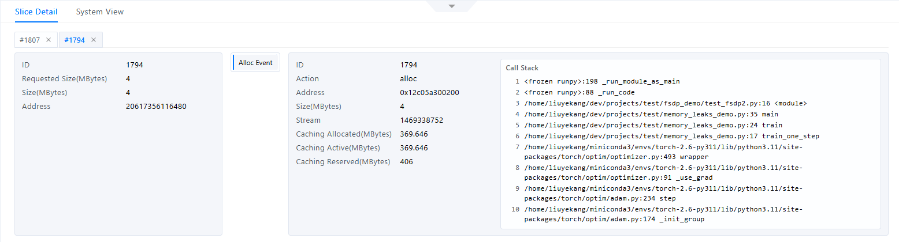

    **Table 4** Block-type Slice Detail fields<a id="block-type-slice-detail-fields"></a>

    |Field|Optional/Required|Description|
    |-|-|-|
    |ID|Required|Block ID: a value greater than zero indicates a valid allocation event ID, while a negative value means that no allocation event was captured for this block. The specific magnitude of a negative value carries no semantic meaning.|
    |Requested Size(MBytes)|Required|The memory size requested by the allocation event that actually triggered the allocation of this block. Due to alignment and other reasons, the actual block size may be slightly larger than the requested size, in MBytes.|
    |Size(MBytes)|Required|Block size, in MBytes.|
    |Address|Required|Block memory address, in hexadecimal.|

  - Segment-type: As shown in [**Figure 10** Segment-type Slice Detail](#segment-type-slice-detail). The field descriptions are provided in [**Table 5** Segment-type Slice Detail fields](#segment-type-slice-detail-fields). Basic event information is displayed in the left area, and specific event information can be viewed by switching the event type.

    **Figure 10** Segment-type Slice Detail<a id="segment-type-slice-detail"></a>

    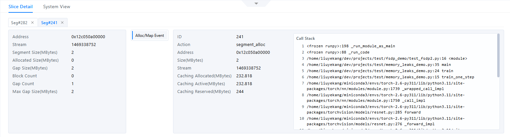

    **Table 5** Segment-type Slice Detail fields<a id="segment-type-slice-detail-fields"></a>

    |Field|Optional/Required|Description|
    |-|-|-|
    |Address|Required|Segment memory address, in hexadecimal.|
    |Stream|Required|Stream ID, which together with the address uniquely identifies a segment.|
    |Segment Size(MBytes)|Required|Total segment size, in MBytes.|
    |Allocated Size(MBytes)|Required|The memory within the segment that has been sub-allocated (in the form of blocks), i.e., the memory that is actually occupied and temporarily unavailable for reuse. It equals the sum of all active block sizes, in MBytes.|
    |Gap Size(MBytes)|Required|The total size of gaps caused by discontinuous addresses between blocks within the segment. This value indicates the total gap size in the memory segment, equal to "Segment Size - Allocated Size", in MBytes.|
    |Block Count|Required|The number of active blocks that have been sub-allocated.|
    |Gap Count|Required|The number of gaps between blocks.|
    |Max Gap Size(MBytes)|Required|The size of the largest gap, in MBytes.|

## Comparison Between MemScope Data Collection and PyTorch Snapshot Data Collection

- Compared with the memory tuning data collected by MemScope, memory snapshot data has the following advantages:

  1. Collection performance overhead: During the collection of memory snapshot data, memory events are recorded at the host level only after `record_memory_history` is enabled, and the PTA allocator segments are saved at the dump time. This has little impact on the model running performance.
  2. Tuning data size: The core data consists of PTA memory events and segments at the collection end time. The data density is high, and the data size is smaller than that collected by MemScope.
  3. Special memory pool status data: Compared with the memory tuning data collected by MemScope, the memory snapshot data also includes the status data of the PTA memory pool, such as the memory pool size and memory pool usage. This data helps users comprehensively analyze the memory usage. Especially in the case of memory fragmentation, the memory pool status data helps users intuitively analyze the memory fragmentation.

- Compared with the memory tuning data collected by MemScope, memory snapshot data has the following disadvantages:

  1. Tuning data analysis: Memory snapshot data is stored in Python pickle data files, which are difficult to use. The analysis relies heavily on visualization capabilities. To parse and analyze raw data, you need to have a basic understanding of memory events and data collection principles.
  2. Limited capabilities/performance of community visualization tools: Although community-based online visualization enables analysis of memory snapshot data, notable deficiencies remain in stability, performance, and interactivity.
      - Stability: Online web pages may be unavailable due to client environment issues (such as restricted to an intranet) or network problems (such as CDN resource exceptions).
      - Performance: When processing large-scale memory snapshots (with more than 15,000 events and a snapshot size exceeding 10 MB), the online visualization web page may experience performance issues, such as long loading times and delayed interaction responses.
      - Interactivity: During the analysis process on the online visualization web page, the only way to associate the Memory Block Timeline Graph with the memory pool status graph is to manually copy the memory address and search for it on the web page. Additionally, it is not possible to reverse the association from the memory pool status graph to the Memory Block Timeline Graph.

## Memory Issue Analysis Cases

### Overview

Memory issues are common in Ascend full-stack development activities. However, due to the complex software stack layers involved in memory issues (including the OS driver and runtime library, CANN, MindSpore/PyTorch_NPU, model training, and model inference), it is often challenging to locate and resolve these issues. For details about typical memory issue categories, see [**Table 1** Memory issue categories](#memory-issue-categories).

This document describes how to use MindStudio Insight to locate memory issues.

**Table 1** Memory issue categories <a id="memory-issue-categories"></a>

|Issue Category|Symptom|Scenario|
|--|--|--|
|Memory corruption|The precision is abnormal or NaN occurs, which usually occurs on the device.|Training, inference, and operator development|
|Excessive memory usage|Excessive memory usage is usually related to the following two situations:<br> - Memory leak or out of memory (OOM): The memory usage on the host or device keeps increasing or even OOM occurs.<br> - Great difference from the expected or baseline value: Actual measured memory usage far exceeds the expected or baseline data, with differences potentially reaching gigabytes. This behavior is typically observed on the device.|Training and inference|

**Analysis Process**

For excessive memory usage or OOM on the device, the issue analysis process is as follows:

1. Use the profiling tools to collect profile data and import the data to MindStudio Insight.
2. On the **Memory** page, view the memory curve and memory allocation/release details of operators or components in the memory analysis area to perform basic analysis and determine the exception scope, step, or operator.
3. Use the memory tool (msMemScope) to collect memory details and memory disassembly data within the exception scope, and import the data to MindStudio Insight.
4. On the memory details (msMemScope) page, analyze the memory usage based on the call stack flame graph, Memory Block Timeline Graph, and Memory Details Table.

### Preparation

**Preparing Software**

- Download and install MindStudio Insight. For details, see [MindStudio Insight Installation Guide](../install_guide/mindstudio_insight_install_guide.md).
- Install the msMemScope tool. For details, see [msMemScope Installation Guide](https://gitcode.com/Ascend/msmemscope/blob/master/docs/en/install%5Fguide/install%5Fguide.md).

**Preparing Data**

The following collects memory leak data.

1. Use the msMemScope tool to run the following command to allocate a 4 x 10 MB tensor in each step and add it to the global variable `leak\_mem\_list` (which will not be released with `train\_one\_step`). Collect Python trace data of three steps.

    ```shell
    msmemscope --level=0,1 --events=alloc,free,access,launch --analysis=decompose --data-format=db python test.py
    ```

    The sample code of `test.py` is as follows:

    ```python
    import torch
    import torch_npu
    from torchvision.models import resnet50
    import msmemscope
    import msmemscope.describe as describe
    leak_mem_list = []
    def train_one_step(model, optimizer, loss_fn, device):
        # Mark the code block. The owner attribute of all memory allocation events in the code block will be labeled as leaks_mem
        describe.describer(owner="leaks_mem").__enter__()
        # Memory leak code segment
        leak_mem_list.append(torch.randn(1024 * 1024 * 10, dtype=torch.float32).to(device))
        # End marker
        describe.describer(owner="leaks_mem").__exit__(None, None, None)
        # Single training code segment
        inputs = torch.randn(1, 3, 224, 224).to(device)
        labels = torch.rand(1, 10).to(device)
        pred = model(inputs)
        loss_fn(pred, labels).backward()
        optimizer.step()
        optimizer.zero_grad()
    def train(model, optimizer, loss_fn, device, steps=1):
        for i in range(steps):
            train_one_step(model, optimizer, loss_fn, device)
    device = torch.device("npu:0")
    torch.npu.set_device(device)  # Set the device.
    model = resnet50(pretrained=False, num_classes=10).to(device)  # Load the model
    optimizer = torch.optim.Adam(model.parameters(), lr=1e-2)  # Define the optimizer
    loss_fn = torch.nn.CrossEntropyLoss()  # Define the loss function

    # Enable the collection of Python function call data
    msmemscope.tracer.start()
    train(model, optimizer, loss_fn, device, steps=3)  # Start training

    # Disable the collection of Python function call data
    msmemscope.tracer.stop()
    ```

2. After the collection is complete, a file in .db format is generated.
3. Download the file to the local host.

### Memory Analysis

**Importing Data**

1. Open MindStudio Insight and click **Import Data** in the navigation tree on the left.
2. In the displayed **File Explorer** dialog box, select the .db file to be imported.
3. After the import is successful, the **Leaks** page is displayed.

**Memory Analysis**

1. Open the **Leaks** page and view the call stack flame graph and Memory Block Timeline Graph.
2. Click and drag the mouse to box-select the step 2 area in the Memory Block Timeline Graph, and release the mouse button to zoom in on the area.

    As shown in [**Figure 1** Unreleased memory blocks](#unreleased-memory-blocks), there is still an unreleased memory block when step 2 ends.

    **Figure 1** Unreleased memory blocks <a id="unreleased-memory-blocks"></a>

    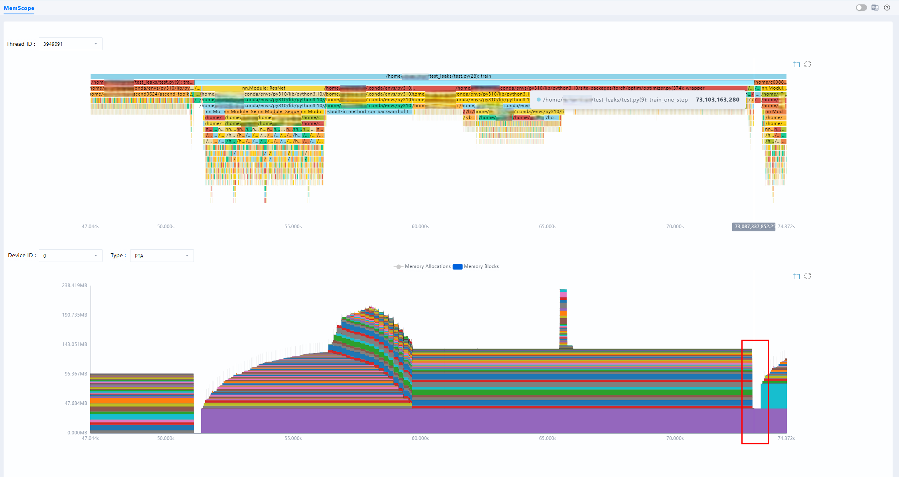

3. The call stack flame graph shows that the memory block comes from a tensor object and is allocated before the forward propagation starts, as shown in [**Figure 2** Tensor object](#Tensor object)

    **Figure 2** Tensor object <a id="Tensor object"></a>

    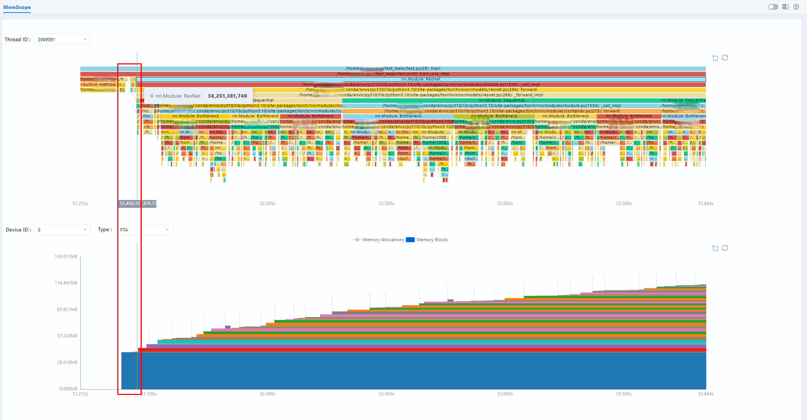

4. When cross-referencing the `leaks\_mem` segment against the Memory Details Disassembly Diagram, a clear increasing trend is detected within the segment. From step 1, the memory usage of the `leaks\_mem` segment is 40 MB for the first time, as shown in [**Figure 3** Checking the memory usage in step 1](#checking-the-memory-usage-in-step-1).

    **Figure 3** Checking the memory usage in step 1 <a id="checking-the-memory-usage-in-step-1"></a>

    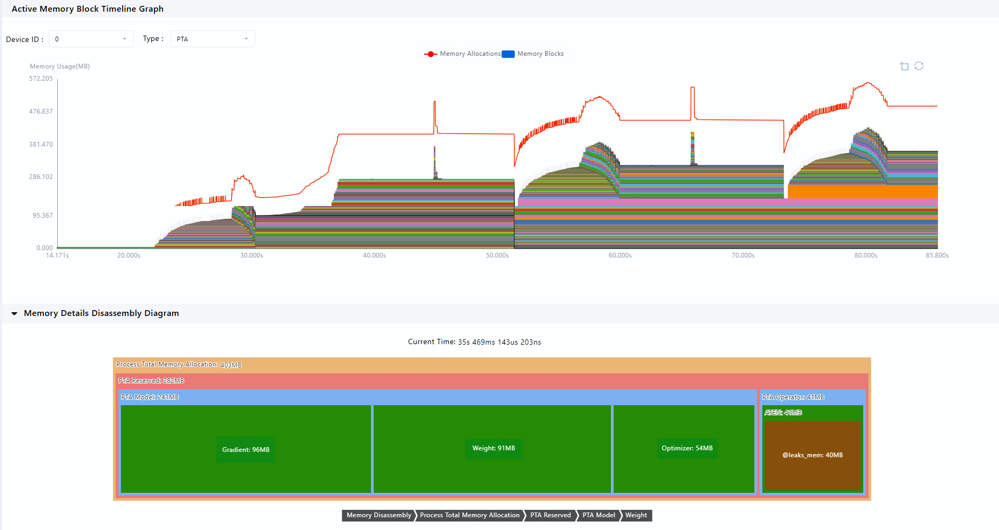

    As shown in [**Figure 4** Checking the memory usage in step 2](#checking-the-memory-usage-in-step-2), the `leaks_mem` memory usage in step 2 increases from 40 MB to 80 MB.

    **Figure 4** Checking the memory usage in step 2 <a id="checking-the-memory-usage-in-step-2"></a>

    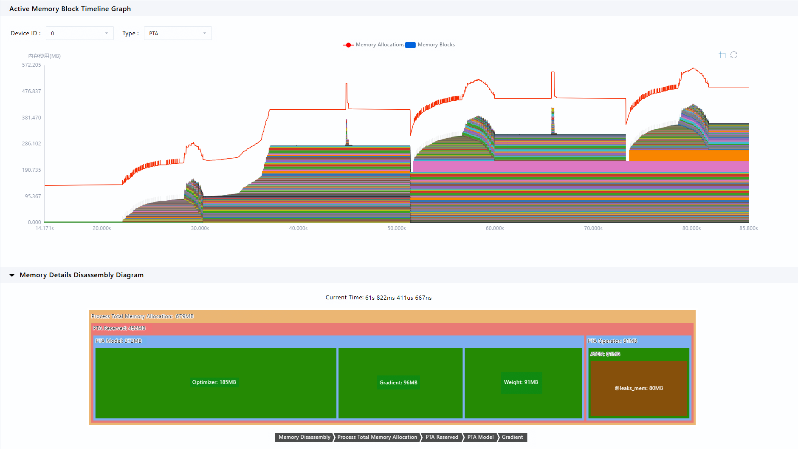

    As shown in [**Figure 5** Checking the memory usage in step 3](#checking-the-memory-usage-in-step-3), the `leaks_mem` memory usage in step 3 increases from 80 MB to 120 MB.

    **Figure 5** Checking the memory usage in step 3 <a id="checking-the-memory-usage-in-step-3"></a>
    
    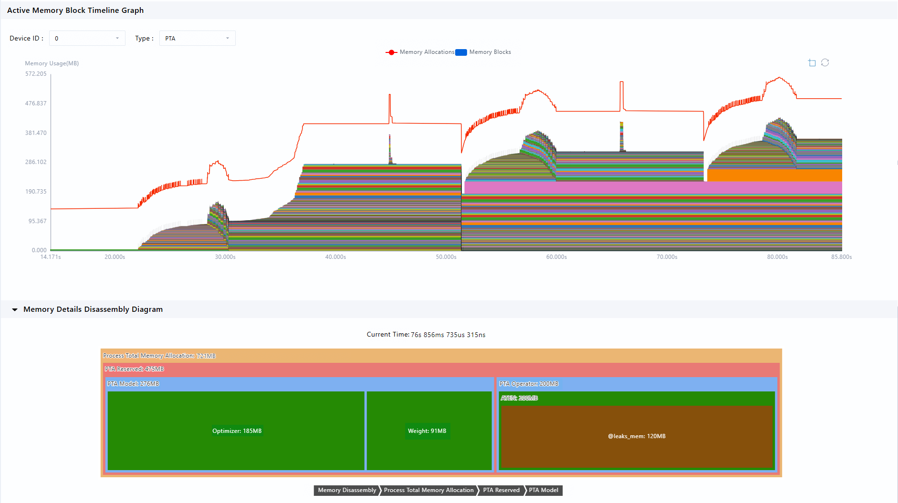
