# **MindStudio Insight Operator Tuning**

## Description

MindStudio Insight provides the instruction pipeline view, operator source code view, and operator runtime load analysis view to visualize the key performance metrics of operators running on the Ascend AI Processor, helping developers quickly locate software and hardware performance bottlenecks and improve operator performance analysis efficiency.

## Preparations

**Environment Setup**

Install MindStudio Insight first. For details, see [MindStudio Insight Installation Guide](./mindstudio_insight_install_guide.md).

**Data Preparation**

Import profile data in the correct format. For details about the data, see [Data Description](#data-description). For details about how to import data, see [Importing Data](./basic_operations.md#importing-data).

## Data Description

**Data file**

For details about the profile data files that can be imported in the operator tuning scenario, see [**Table 1** Importable profile data](#importable-profile-data).

**Table 1** Importable profile data 

<table><thead>
  <tr>
    <th>File Name</th>
    <th>Description</th>
    <th>How to Obtain</th>
    <th>GUI</th>
  </tr></thead>
<tbody>
  <tr>
    <td>trace.json</td>
    <td>Operator instruction pipeline trace file for visualization</td>
    <td>See <a href="https://gitcode.com/Ascend/msopprof/blob/26.0.0/docs/en/user_guide/msopprof_simulator_user_guide.md">msopprof simulator User Guide</a>.</td>
    <td>Timeline</td>
  </tr>
  <tr>
    <td rowspan="3">visualize_data.bin</td>
    <td>Visualized instruction pipeline file.</td>
    <td>See <a href="https://gitcode.com/Ascend/msopprof/blob/26.0.0/docs/en/user_guide/msopprof_user_guide.md">msopprof User Guide</a> and <a href="https://gitcode.com/Ascend/msopprof/blob/26.0.0/docs/en/user_guide/msopprof_simulator_user_guide.md">msopprof simulator User Guide</a>.</td>
    <td>Timeline</td>
  </tr>
  <tr>
    <td>Data file for visualizing basic operator information, computing unit load, and Roofline bottleneck analysis information.</td>
    <td>See <a href="https://gitcode.com/Ascend/msopprof/blob/26.0.0/docs/en/user_guide/msopprof_user_guide.md">msopprof User Guide</a>.</td>
    <td>Details</td>
  </tr>
  <tr>
    <td>Data file for visualizing information such as simulation hotspot functions.</td>
    <td>See <a href="https://gitcode.com/Ascend/msopprof/blob/26.0.0/docs/en/user_guide/msopprof_user_guide.md">msopprof User Guide</a> and <a href="https://gitcode.com/Ascend/msopprof/blob/26.0.0/docs/en/user_guide/msopprof_simulator_user_guide.md">msopprof simulator User Guide</a>.</td>
    <td>Source</td>
  </tr>
  <tr>
    <td>visualize_data.bin</td>
    <td>Visualized L2 cache access information file in the kernel function of the user program.</td>
    <td>See <a href="https://gitcode.com/Ascend/msopprof/blob/26.0.0/docs/en/user_guide/msopprof_user_guide.md">msopprof User Guide</a>.</td>
    <td>Cache</td>
  </tr>
</tbody>
</table>

**Constraints**

- In the operator tuning scenario, to import a JSON file into MindStudio Insight, the file must contain the "profilingType":"op" field before the first square bracket. Otherwise, the file cannot be imported.
- You can import JSON files by folder. A folder can contain multiple subfolders, but each subfolder can contain no more than one JSON file. Different JSON files must be placed in different subfolders.
- The size of a single JSON file to be imported cannot exceed 1GB.
- Only one binary (`.bin`) file can be imported at a time. The `.bin` files cannot be imported by folder.
- The size of a single `.bin` file to be imported cannot exceed 500MB.
- Only the Atlas 350 accelerator card supports the collection of instruction pipeline diagrams using the msopprof method and visualized display of the collected data on the timeline page.

## Timeline

### Function

During operator performance tuning, MindStudio Insight displays the detailed execution status of bottom-layer instructions in the operator running process on the timeline. The tool also displays the instruction call sequence and time consumption of each pipe on each core of the AI processor. By analyzing the timeline, you can quickly locate performance bottlenecks by viewing instruction details and duration.

By examining the duration and intervals at each layer of the timeline view, you can identify performance bottlenecks in the corresponding instructions and pipes, such as instruction execution bottlenecks or particularly time-consuming instructions.

### GUI Description

**GUI**

The **Timeline** tab page consists of the toolbar (area 1), graphical display (area 2), and data pane (area 3), as shown in [**Figure 1** Timeline page](#timeline-page).

**Figure 1** Timeline page   
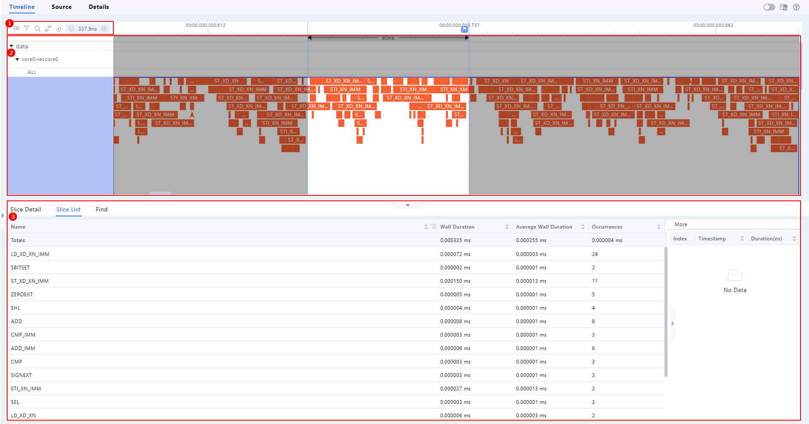

- Area 1: toolbar, which contains common shortcut keys. From left to right, the shortcut keys are **Marker List**, **Filter** (rank or unit), **Search**, **Flow Events**, **Reset** (page restoration), **Timeline Zoom Out**, and **Timeline Zoom In**.
- Area 2: graphical display. The left pane displays the layer information of each core. The first layer is **Core**, and the second layer is **Pipe**. The timeline view is displayed on the right by line, including the execution sequence and duration of each instruction. For details about the unit information, see [Unit Information](#unit-information).
- Area 3: data pane, which displays statistics or instruction details. To view the details of a single instruction, you can select **Slice Detail**. To view a list of instructions from a selected area in a unit, you can select **Slice List**.

**Unit Information**

| Unit           | Description                                                                                                                                                                                                                                                                                                                                                                                         |
| -------------- | --------------------------------------------------------------------------------------------------------------------------------------------------------------------------------------------------------------------------------------------------------------------------------------------------------------------------------------------------------------------------------------------------- |
| ALL            | Instructions in this channel will be executed in all channels.                                                                                                                                                                                                                                                                                                                                      |
| SCALAR         | Scalar unit.                                                                                                                                                                                                                                                                                                                                                                                        |
| FLOWCTRL       | Control flow instruction.                                                                                                                                                                                                                                                                                                                                                                           |
| MTE1           | Data transfer pipeline, from L1 to {L0A/L0B, UBUF}.                                                                                                                                                                                                                                                                                                                                                 |
| CUBE           | Matrix multiplication unit.                                                                                                                                                                                                                                                                                                                                                                         |
| FIXP           | Pipeline of data transfer from FIXPIPE L0C to OUT/L1  Only the profile data exported from the <term>Atlas A2 training products/Atlas A2 inference products</term> can be displayed.                                                                                                                                                                                                              |
| MTE2           | Data transfer pipeline, from {DDR/GM, L2} to {L1, L0A/B, UBUF}.                                                                                                                                                                                                                                                                                                                                     |
| VECTOR         | Vector unit.                                                                                                                                                                                                                                                                                                                                                                                        |
| MTE3           | Data transfer pipeline, from UBUF to {DDR/GM, L2, L1}, or from L1 to {DDR/L2}.                                                                                                                                                                                                                                                                                                                      |
| CACHEMISS      | Missed iCache.                                                                                                                                                                                                                                                                                                                                                                                      |
| USEMASK        | Custom instrumentation range.                                                                                                                                                                                                                                                                                                                                                                       |
| MTE Throughput | Memory throughput information.  - GM_TO_L1: throughput of data transferred from GM to L1.  - GM_TO_TOTAL: total throughput of GM output data.  - GM_TO_UB: throughput of data transferred from GM to UB.  - L1_TO_GM: throughput of data transferred from L1 to GM.  - TOTAL_TO_GM: total throughput of GM input data.  - UB_TO_GM: throughput of data transferred from UB to GM. |
| PUSHQ          | VF/SMIT_VF instructions.                                                                                                                                                                                                                                                                                                                                                                            |
| RVECLP         | Vector register LOOP instructions.                                                                                                                                                                                                                                                                                                                                                                  |
| RVECSU         | Vector register ASU instructions, including jumps and scalar data processing.                                                                                                                                                                                                                                                                                                                       |
| RVECLD         | Vector register LOAD instructions.                                                                                                                                                                                                                                                                                                                                                                  |
| RVECEX         | Vector register EXECUTE instructions.                                                                                                                                                                                                                                                                                                                                                               |
| RVECST         | Vector register SET instructions.                                                                                                                                                                                                                                                                                                                                                                   |

### Instructions

#### Basic Functions

**Zooming In and Out on the GUI**

You can zoom in or out the **Timeline** interface, or move it left and right. The operations are as follows:

- Click any position in the tree chart or graphical pane on the **Timeline** interface and press **W** (zoom in) or **S** (zoom out) key to zoom. The maximum zoom-in precision is 1ns.

- Click any position in the tree chart or graphical pane on the **Timeline** interface and press **A** (move left), **D** (move right), left arrow (move left), or right arrow (move right) key to move it left or right, or press up arrow (move up) or down arrow (move down) key to move it upward or downward.

- In the graphical pane, hold down **Alt** and click the left mouse button to zoom in a selected area.

- Click  (zoom in) or  (zoom out) on the toolbar in the upper left corner of the page.

- Click  on the toolbar in the upper left corner to restore the graphical pane to display all timeline views.

- Move the pointer to any position in the tree chart or graphical pane on the **Timeline** interface, and hold down **Ctrl** and scroll the mouse wheel to zoom in or out.

- In the graphical pane, hold down **Ctrl** and click the left mouse button to drag the unit chart left or right.
  
  > [!NOTE]   
  > On macOS, you need to press the Command key and scroll the mouse wheel to zoom in or out, and press the Command key and left mouse button to drag the unit chart left or right.

- In the graphical pane, right-click to zoom in or out. For details, see [**Table 1** Right-click menu](#right-click-menu).
  
    **Table 1** Right-click menu
  
  | Menu                | Description                                                                                                                                            | Operation                                                                                                                                                                                                           |
  | ------------------- | ------------------------------------------------------------------------------------------------------------------------------------------------------ | ------------------------------------------------------------------------------------------------------------------------------------------------------------------------------------------------------------------- |
  | Fit to screen       | Enlarges a single instruction to the maximum width of the visible range of the screen. If no instruction is selected, this parameter is not displayed. | Select an instruction and right-click it. In the displayed menu, click **Fit to screen** to enlarge the selected instruction to fit the maximum visible width of the screen.                                        |
  | Zoom into selection | Zooms in on the selected area to the maximum width of the visible range of the screen. If no area is selected, this parameter is not displayed.        | Select an area and right-click it. In the displayed menu, click **Zoom into selection** to enlarge the selected area to the maximum width of the visible range of the screen.                                       |
  | Undo Zoom(0)        | Undoes the zoom. The number in the parentheses changes with the number of zoom operations. The initial value is **0**.                                 | On the zoomed-in **Timeline** page, right-click to display a shortcut menu. Click **Undo Zoom(0)** to cancel the zooming. The page is zoomed out once, and the number in the brackets decreases by one accordingly. |
  | Reset Zoom          | Resets the zoom to restore the chart to the initial state.                                                                                             | On the zoomed-in Timeline page, right-click and choose **Reset Zoom** from the shortcut menu. The chart is reset to the initial state.                                                                              |

**Instruction Search**

MindStudio Insight allows you to search for instructions on the **Timeline** tab page.

- Click  on the toolbar in the upper left corner of the page. In the displayed text box, enter the command to be searched for and press **Enter**. The matched commands are displayed, as shown in [**Figure 1** Total number of searched commands](#total-number-of-searched-commands). In this example, 11,754 instructions containing "mov" are found.
  
    **Figure 1** Total number of searched commands  
    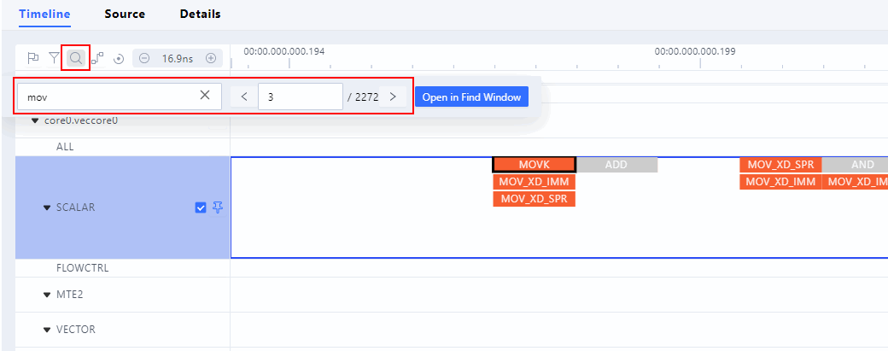

- Click  on the toolbar in the upper left corner of the page. You can click  and 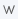 on the left of the search text box to enable case-sensitive matching and whole-word matching, as shown in [**Figure 2** Case match and whole word match](#case-match-and-whole-word-match).
  
    Click  to enable case match. Enter the information to be searched for and press **Enter**. The instructions whose names contain the search item will be matched.
  
    Click  to enable whole-word match. Enter the information to be searched for and press **Enter**. The instructions whose names are the same as the search item will be matched, regardless of the case.
  
    If both  and  are selected, case match and whole-word match are enabled. Enter the name of the instruction to be searched for in the text box and press **Enter**. The instruction whose name is the same as the search item will be matched.
  
    **Figure 2** Case match and whole word match  
    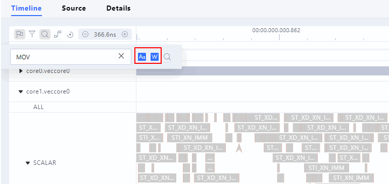

- Click the switch button next to the search box to view the previous or next matched instruction, or type a number next to the search box to search for the corresponding instruction. The instruction is highlighted in the middle of the page, as shown in [**Figure 3** Locating an instruction](#locating-an-instruction).
  
    **Figure 3** Locating an instruction  
    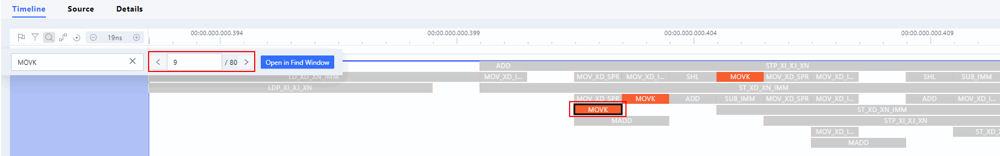

- Click **Open in Find Window** next to the search box. The **Find** tab page is displayed in the lower part of the page, showing all search instructions, as shown in [**Figure 4** Open in Find Window](#open-in-find-window-2). [**Table 2** Field description](#field-description) describes the fields. Click the instruction in the Jump to Timeline column to go to the specific location of the instruction in the timeline view.
  
    **Figure 4** Open in Find Window  
    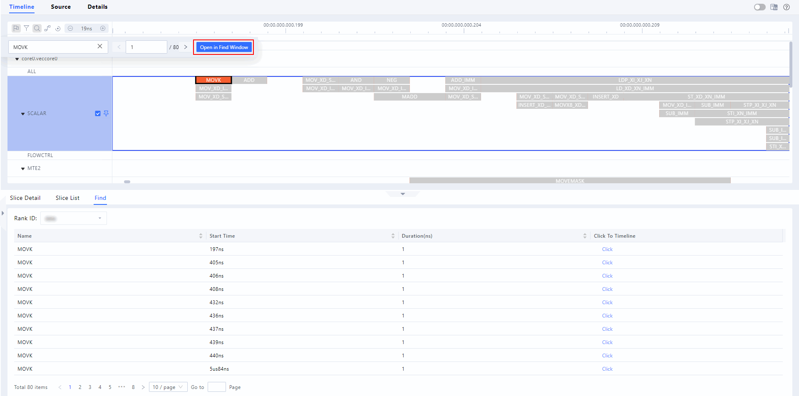
  
    **Table 2** Field description 
  
  | Field             | Description                                                                             |
  | ----------------- | --------------------------------------------------------------------------------------- |
  | Rank ID           | Rank ID. You can select the data file to be viewed.                                     |
  | Name              | Instruction name.                                                                       |
  | Start Time        | Start time of instruction execution.                                                    |
  | Duration(ns)      | Total duration of instruction execution.                                                |
  | Click To Timeline | Click **Click** to go to the specific location of the instruction in the timeline view. |

#### Displaying Profile Data

**Setting and Viewing Markers**

- Region marker
  
  On the **Timeline** page, select a region and click  or press the **K** key to mark and save the selected region, as shown in [**Figure 1** Region marker](#region-marker-4).
  
  **Figure 1** Region marker  
  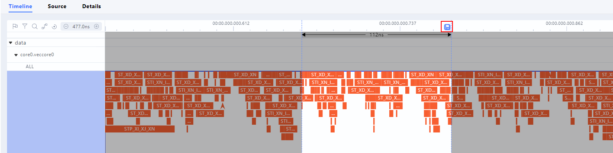
  
  Double-click a marker to set the marker pair attributes. You can modify the marker pair name and color, and delete the marker pair, as shown in [**Figure 2** Modifying marker pair attributes](#modifying-marker-pair-attributes-5).
  
  **Figure 2** Modifying marker pair attributes  
  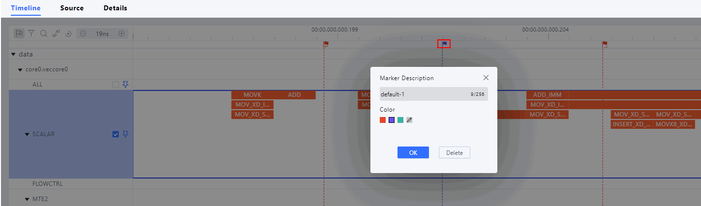

- Single-point marker
  
  Click anywhere in the uppermost empty unit or press **K** to generate a single-point marker, as shown in [**Figure 3** Single-point marker](#single-point-marker-6). Double-click a marker to set its attributes. You can modify the marker name and color, and delete the marker.
  
  **Figure 3** Single-point marker  
  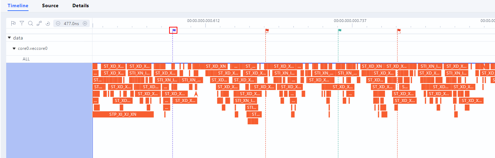

- Marker management
  
  Click  on the toolbar in the upper left corner to show all marker information, as shown in [**Figure 4** Viewing marker information](#viewing-marker-information-7).
  
  **Figure 4** Viewing marker information  
  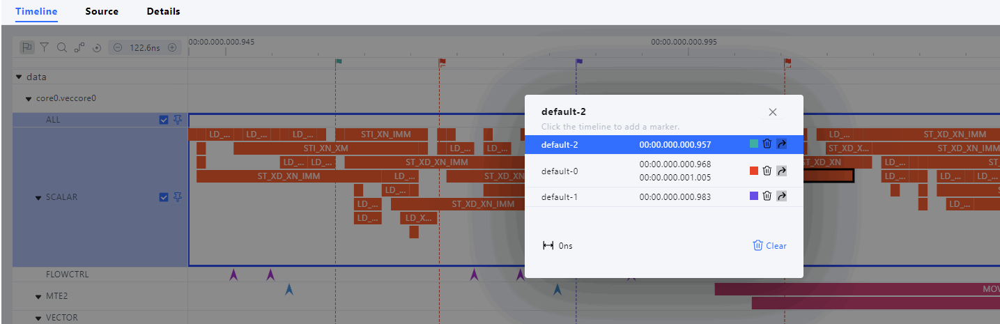
  
  - Click the  icon corresponding to a marker to delete the marker.
  - Click **Clear** in the lower part of the dialog box to delete all markers.
  - Click a region marker. The **Slice Detail** tab page in the lower part of the page displays the duration information of the region.
  - If a marker is not displayed on the current visualization page, click the  icon corresponding to the marker to go to the marker page.
  - Click the color icon corresponding to a marker to set the color to facilitate marker category management.

**Synchronizing Flows Between Instructions**

- MindStudio Insight displays the synchronization flows between instructions (from `SET_FLAG` to `WAIT_FLAG`). Click an instruction with a flow to display the flow associated with the instruction. Even if the pipe at the start point or end point of the flow is folded, the flow does not disappear, as shown in [**Figure 5** Instruction flows](#instruction-flows).
  
    **Figure 5** Instruction flows  
    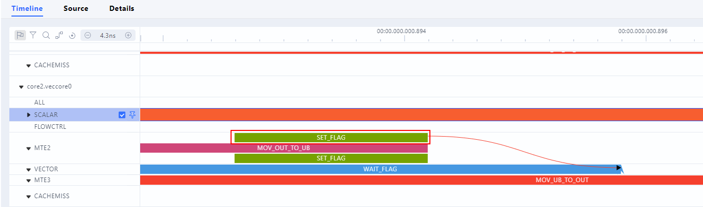

- MindStudio Insight supports the full flow function. You can click  on the toolbar in the upper left corner of the page. In the dialog box that is displayed, select one or more flow types. All flows between pipes are displayed in the timeline view, as shown in [**Figure 6** Full flows](#full-flows-8).
  
  > [!NOTE]   
  > A maximum of 10 flow types can be selected.
  
    **Figure 6** Full flows 
    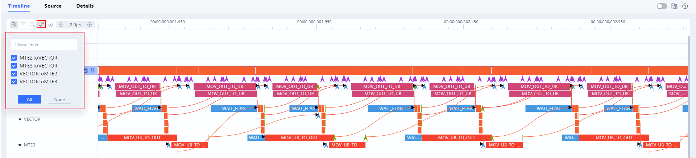

- The `SET_FLAG` and `WAIT_FLAG` instructions can be hidden.
  
    In the operator display area, right-click and choose **Hide SET/WAIT events** from the shortcut menu to hide the `SET_FLAG` and `WAIT_FLAG` instructions. The flow disappears at the same time. See [**Figure 7** Hiding SET/WAIT events](#hiding-set-wait-events).
  
    **Figure 7** Hiding SET/WAIT events  
    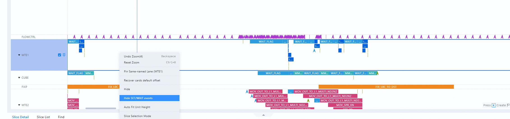
  
    After hiding SET/WAIT events, right-click the menu again and click **Show SET/WAIT events**, the hidden `SET_FLAG` and `WAIT_FLAG` instructions are displayed. The instruction flow can be displayed properly based on the flow function. See [**Figure 8** Show SET/WAIT events](#show-set-wait-events).
  
    **Figure 8** Showing SET/WAIT events  
    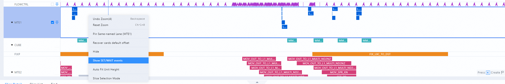

#### Tuning Display

**Hide**

For details about how to hide units in the operator tuning scenario, see [hiding units](./system_tuning.md#displaying-page-optimization).

**Auto Unit Height**

For details about the auto unit height function in operator tuning scenarios, see [Auto Unit Height](./system_tuning.md#displaying-page-optimization).

#### Displaying Statistics

MindStudio Insight allows you to view instruction statistics and details about a single instruction.

- Left-click to select instructions within a single pipe unit or across multiple core units. The selection is reflected in the **Slice List** below, which displays statistical information for the selected instructions (see [Figure 1 Slice List](#slice-list-9)). For details about the fields, see [Table 1 Fields on the Slice List tab page](#fields-on-the-slice-list-tab-page).
  
    You can move the cursor to the **Slice List** tab page and click  to copy the content displayed in the **Slice List** tab page and paste the content to an Excel file for analysis.
  
    Click an instruction in the **Slice List** column. All instructions with the same name as the instruction in the area are displayed in the **More** list on the right. Click a row in the **More** list to locate the instruction in the timeline view, and go to the **Slice Detail** page, where you can view the details about the instruction.
  
    **Figure 1** Slice List  
    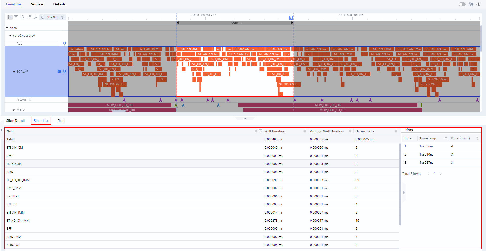
  
    **Table 1** Fields on the Slice List tab page 
  
  | Field                 | Description                                    |
  | --------------------- | ---------------------------------------------- |
  | Name                  | Instruction name.                              |
  | Wall Duration         | Total duration of instruction execution.       |
  | Average Wall Duration | Average instruction execution time.            |
  | Max Wall Duration     | Maximum operator execution duration.           |
  | Min Wall Duration     | Minimum operator execution duration.           |
  | Occurrences           | Number of times that an instruction is called. |
  | Index                 | Sequence number.                               |
  | Start Time            | Timestamp in the graphical pane.               |
  | Duration(ms)          | Execution duration.                            |

- If you select a single instruction, you can view the details of the instruction in the lower part, as shown in [**Figure 2** Slice Detail](#slice-detail-10). For details about the fields, see [**Table 2** Slice Detail fields](#slice-detail-fields).
  
    Select a single instruction and press **M** to select the **Timeline** area to which the instruction belongs. Press **M** again to cancel the selection.
  
    **Figure 2** Slice Detail  
    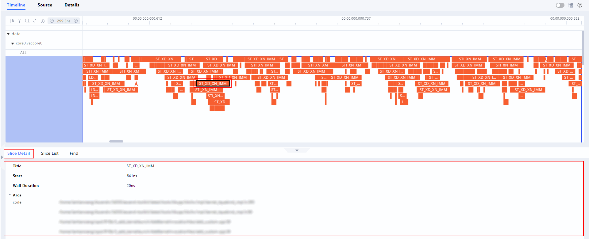
  
    **Table 2** Slice Detail fields 
  
  | Field                | Description                                                                                                                          |
  | -------------------- | ------------------------------------------------------------------------------------------------------------------------------------ |
  | Title                | Name.                                                                                                                                |
  | Start                | Start time.                                                                                                                          |
  | Start(Raw Timestamp) | Original start time of data collection.                                                                                              |
  | Wall Duration        | Total duration.                                                                                                                      |
  | Args                 | Operator parameters, including:  - `code`: code call stack.  - `detail`: instruction source code.  - `pc_addr`: PC address. |

## Source

### Function

The **Source** tab page displays the operator instruction heatmap, and allows you to view the mapping between operator source code and instruction sets and the duration. During Ascend C operator development, developers can analyze the performance.

### GUI Description

The **Source** tab page consists of three parts: filter bar (area 1), source file code attributes (area 2), and instructions (area 3), as shown in [**Figure 1** Source tab page](#source-tab-page).

**Figure 1** Source tab page  
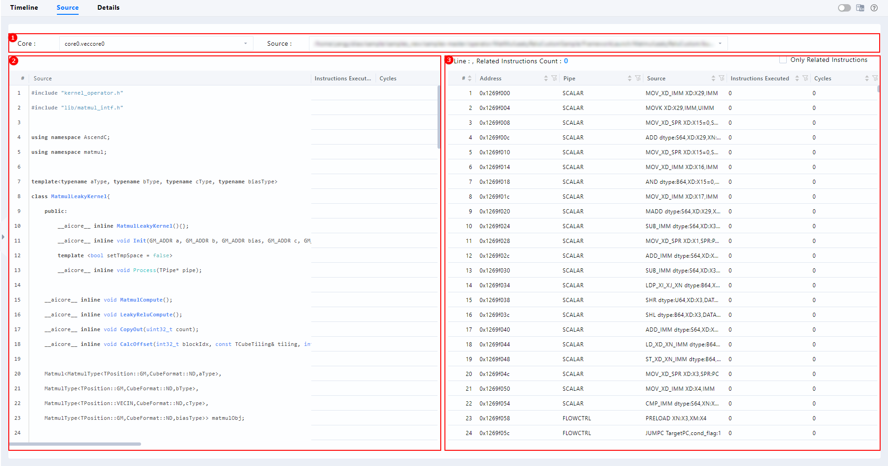

- Area 1: filter bar. You can filter the content to be viewed by **Core** and **Source**.

- Area 2: source code attribute table. You can view the code line, execution duration, and execution times of each line of code. For details about the fields in the table, see [**Table 1**](#fields_in_the_source_code_attribute_table).
  
    **Table 1** Fields in the source code attribute table 
  
  | Field                 | Description                                                                                                                                                                               | Examples |
  | --------------------- | ----------------------------------------------------------------------------------------------------------------------------------------------------------------------------------------- | -------- |
  | #                     | Code line number.                                                                                                                                                                         | 100      |
  | Source                | Source file code.                                                                                                                                                                         | -        |
  | Instructions Executed | Number of codes in the line executed on each core.                                                                                                                                        | 100      |
  | Cycles                | Number of cycles (clock cycles) consumed when the codes in the line are executed on each core.                                                                                            | 100      |
  | GPR Count             | Number of times the general-purpose register is used when the codes in the line are executed on each core. This field is displayed only when the data is collected by msopprof simulator. | 10       |
  | L2 Cache Hit Rate     | L2 cache hit rate of the line of code executed on all cores. This field is displayed only when the data is collected by msopprof.                                                         | 100%     |
  | Process Bytes         | Sum of the data volume processed by the line of code on each core, in Bytes.                                                                                                              | 2048     |

- Area 3: instructions. You can view instruction records, including the address, content, quantity, and times. [**Table 2** Instruction fields](#instruction-fields) describes the fields in the table.
  
    **Table 2** Instruction fields 
  
  | Field                         | Description                                                                                                                                                                                                                                                                                                                                                                                                                   | Examples     |
  | ----------------------------- | ----------------------------------------------------------------------------------------------------------------------------------------------------------------------------------------------------------------------------------------------------------------------------------------------------------------------------------------------------------------------------------------------------------------------------- | ------------ |
  | #                             | Sequence number.                                                                                                                                                                                                                                                                                                                                                                                                              | 100          |
  | Address                       | Offset address of the instruction.                                                                                                                                                                                                                                                                                                                                                                                            | 0x1122a828   |
  | Pipe                          | Pipe (instruction queue) where the instruction is located.                                                                                                                                                                                                                                                                                                                                                                    | MTE2         |
  | Source                        | Instruction content.                                                                                                                                                                                                                                                                                                                                                                                                          | BAR PIPE:ALL |
  | Instructions Executed         | Number of instructions in the line executed on each core.                                                                                                                                                                                                                                                                                                                                                                     | 100          |
  | GPR Count                     | Number of times the general-purpose register is used when the instructions in the line are executed on each core. This field is displayed only when the data is collected by msopprof simulator.                                                                                                                                                                                                                              | 10           |
  | GPR Status                    | Register dependency information is presented graphically as a set of directed lines, each representing a register. A solid leftward arrow indicates a write, a hollow rightward arrow indicates a read, and a vertical bar denotes that the register is still in use. Hovering over a register displays its details.  This parameter is displayed only when the data exported from the Atlas 350 accelerator card is used. | -            |
  | Cycles                        | Number of cycles (clock cycles) consumed when the instructions in the line are executed on each core.                                                                                                                                                                                                                                                                                                                         | 100          |
  | L2 Cache Hit Rate             | L2 cache hit rate of the instruction executed on all cores. This field is displayed only when the data is collected by msopprof.                                                                                                                                                                                                                                                                                              | 72%          |
  | Process Bytes                 | Data volume processed by the instruction on each core, in Bytes.                                                                                                                                                                                                                                                                                                                                                              | 2048         |
  | UB Read Conflict              | Read conflicts of vector instructions on the UB Bank. This field is displayed only when the data is collected by msopprof simulator.                                                                                                                                                                                                                                                                                          | 1            |
  | UB Write Conflict             | Write conflicts of vector instructions on the UB Bank. This field is displayed only when the data is collected by msopprof simulator.                                                                                                                                                                                                                                                                                         | 0            |
  | Vector Utilization Percentage | Utilization of the vector computing unit, in percentage. This field is displayed only when the data is collected by msopprof simulator.                                                                                                                                                                                                                                                                                       | 35.29        |

### Instructions

**Source Code Search**

In the **Source** area, press **Ctrl+F** on the keyboard to display the search box. Enter a keyword in the search box to select **Match case** and other functions as required and press **Enter**. The keyword is highlighted, as shown in [**Figure 1** Searching source code](#searching-source-code). [**Table 1** Icon functions](#icon-functions) describes the functions of the icons in the search box.

> [!NOTE]   
> In macOS, press **Command+F** on the keyboard to display the search box.

**Figure 1** Searching source code  
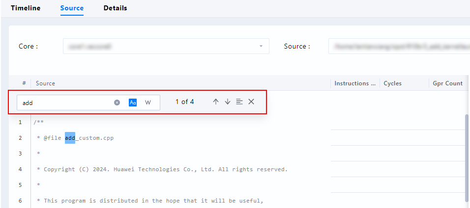

**Table 1** Icon functions 

| Icon                                                            | Function                                                                                                                                                                                                      |
| --------------------------------------------------------------- | ------------------------------------------------------------------------------------------------------------------------------------------------------------------------------------------------------------- |
|  | Indicates the **Match case** function. After this icon is selected, the entered keyword can be found, and the search is case-sensitive.                                                                       |
|  | Indicates the **Words** function. After this icon is selected, keywords that match exactly can be found.                                                                                                      |
|  | Scrolls up the search results.                                                                                                                                                                                |
|  | Scrolls down the search results.                                                                                                                                                                              |
|  | Allows you to drag select a source code area. After clicking this icon, you can select the source code area by clicking the left mouse button. Then, you can search for the source code in the selected area. |
|  | Allows you to close the search box and exit the search function. Alternatively, press **Esc** to exit.                                                                                                        |

**Viewing Related Instructions**

Click any line of code in the source file code attributes. The code related to the line is highlighted in the instructions. The number of lines (**Line**) and the total number of instructions (**Related Instructions Count**) associated with the selected code are displayed above the instructions, as shown in [**Figure 2** Viewing related instructions](#viewing-related-instructions). The selected code is in line 10 and 112 instructions are associated with the code.

**Figure 2** Viewing related instructions  
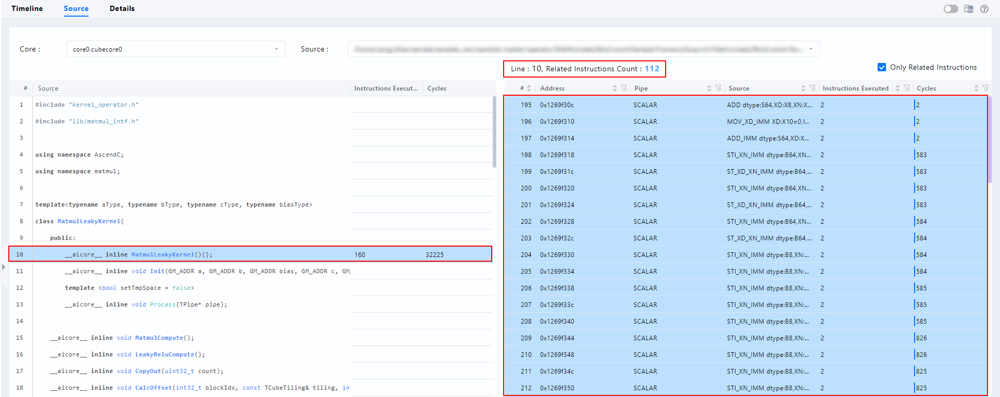

If you select **Only Related Instructions** in the instruction table, only the instructions related to the line of code are displayed, as shown in [**Figure 3** Filtering related instructions](#filtering-related-instructions).

**Figure 3** Filtering related instructions  
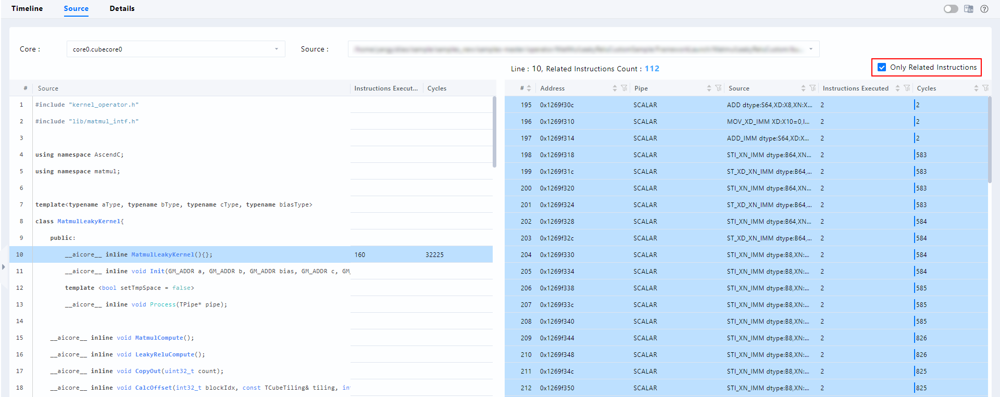

**Viewing Related Code**

Click any row in the instruction table to highlight the related code in the source code attribute table, and to highlight all related instructions for that row. See [**Figure 4** Viewing related code](#viewing-related-code) for an example.

**Figure 4** Viewing related code  
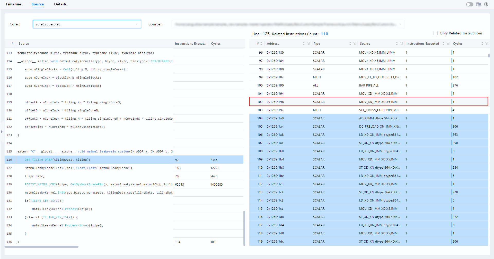

> [!NOTE]   
> If there are multiple lines of associated codes, only the uppermost codes are highlighted.

**Filtering Instructions**

In the instruction table, click  next to each field in the table header to filter the content to be viewed, as shown in [**Figure 5** Filtering instructions](#filtering-instructions).

**Figure 5** Filtering instructions 
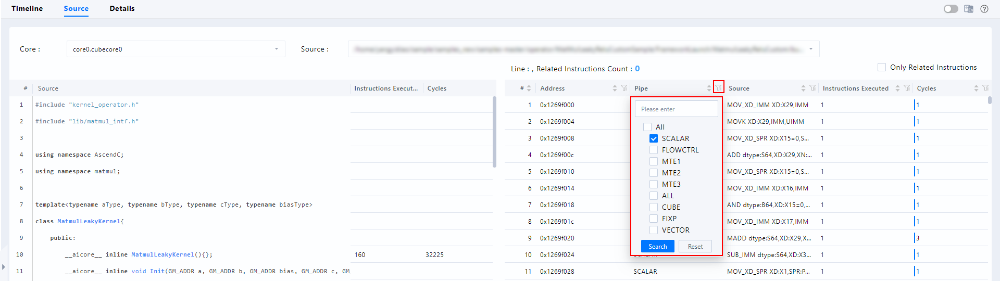

## Details

### Function

The **Details** tab page displays **Base Info**, **Compute Workload Analysis**, **Core Occupancy**, **Roofline**, and **Memory Workload Analysis**. The analysis results are displayed in charts and data panes.

### GUI Description

The **Details** tab page consists of five areas: **Base Info** (area 1), **Core Occupancy** (area 2), **Roofline** (area 3), **Compute Workload Analysis** (area 4), and **Memory Workload Analysis** (area 5), as shown in [**Figure 1** Details tab page](#details-tab-page).

**Figure 1** Details tab page  
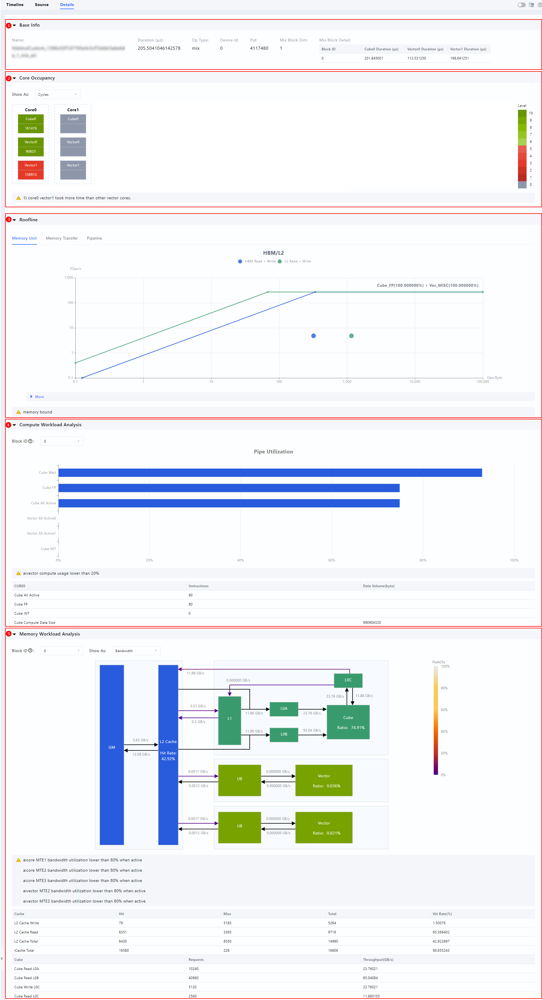

**Base Info**

Area 1: **Base Info**. You can view the basic operator information, including the name, duration, and type. [**Table 1** Base Info fields](#base-info-fields) describes the fields.

**Table 1** Base Info fields 

| Field            | Description                                                                                                                                                                                          |
| ---------------- | ---------------------------------------------------------------------------------------------------------------------------------------------------------------------------------------------------- |
| Name             | Operator name.                                                                                                                                                                                       |
| Duration (μs)    | Total operator duration.                                                                                                                                                                             |
| Op Type          | Operator type. The options are **mix**, **vector**, **cube**, and **AiCore**.                                                                                                                        |
| Device Id        | Device ID.                                                                                                                                                                                           |
| Pid              | Process ID                                                                                                                                                                                           |
| Block Dim        | Number of sub blocks. This parameter is used when the operator type is **vector**, **cube**, or **AiCore**.                                                                                          |
| Mix Block Dim    | Number of sub blocks. This parameter is used when the operator type is **mix**.                                                                                                                      |
| Block Detail     | Duration details of sub blocks. This parameter is used when the operator type is vector, cube, or AI Core. For details about the fields, see **Table 2** "Block details".                            |
| Mix Block Detail | Duration details of sub blocks. If the operator type is mix, the value is the parameter name. For details about the parameters, see [**Table 3** Mix Block Detail fields](#mix-block-detail-fields). |

**Table 2** Block Detail fields

| Field         | Description                                                                         |
| ------------- | ----------------------------------------------------------------------------------- |
| Block ID      | Sub block ID. This parameter is not available when the operator type is **AiCore**. |
| Core Type     | Sub block type.                                                                     |
| Duration (μs) | Duration of sub blocks.                                                             |

**Table 3** Mix Block Detail fields

| Field                 | Description                                 |
| --------------------- | ------------------------------------------- |
| Block ID              | Sub block ID.                               |
| Cube0 Duration (μs)   | Duration of the cube core in AI Core.       |
| Vector0 Duration (μs) | Duration of one vector core in AI Core.     |
| Vector1 Duration (μs) | Duration of another vector core in AI Core. |

**Core Occupancy**

Area 2: **Core Occupancy**. The inter-core load is displayed and analyzed based on the number of clock cycles, total core throughput, and cache hit rate, as shown in [**Figure 2** Core Occupancy](#core-occupancy).

Developers can select **Cycles**, **Throughput**, or **Cache Hit Rate\(%\)** to display the core usage and analysis result, helping them locate and analyze exceptions.

**Figure 2** Core Occupancy  
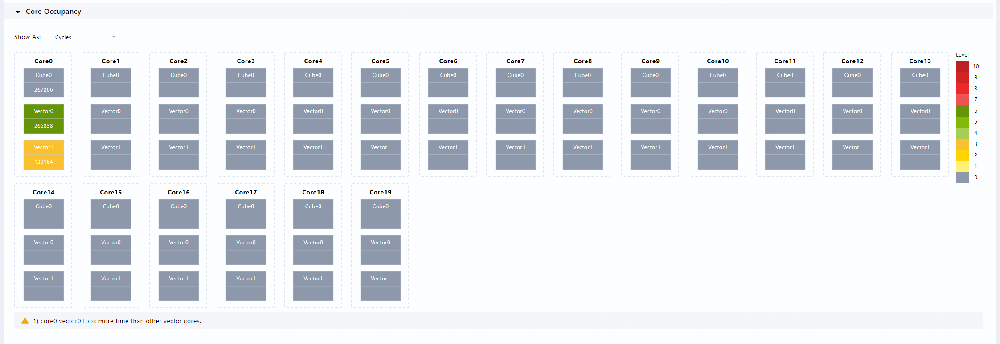

> [!NOTE]  
> 
> - This module is supported by the profile data exported from the <term>Atlas A3 training products/Atlas A3 inference products</term>, <term>Atlas A2 training products/Atlas A2 inference products</term>, and Atlas 350 accelerator card.
> - Core Occupancy is classified into 10 levels. Levels 4–6 indicate balance near the average, while levels 0–3 and 7–10 signify significant deviation from the average.

**Roofline**

Area 3: **Roofline**. Developers use the Roofline model graph to view operator performance and analyze the results to provide a basis for performance optimization. In the Roofline model graph, the X axis represents the arithmetic intensity (Ops/Byte), which indicates the number of operations supported by each byte of memory. The Y axis represents the performance (TOPS/s), which indicates the number of trillion operations per second.

The Roofline model graph displays the computing power name, which describes the instruction types that maximize the computing power, such as **Cube\_INT\(100.000000%\) + Vec\_FP16\(30.000000%\),Vec\_FP32\(70.000000%\)** (indicating that cube computing units process only INT instructions, and vector computing units process 30% FP16 instructions and 70% FP32 instructions).

> [!NOTE]
> 
> - This module is supported only by the Atlas 350 accelerator card, <term>Atlas A3 training series/Atlas A3 inference series</term>, <term>Atlas A2 training series/Atlas A2 inference series</term>, and <term>Atlas inference series</term>.
> - When the data of the Atlas 350 accelerator card is imported, the instruction types are displayed in the Roofline model graph. You can filter the instruction types based on the parameters in the graph to view the Roofline model graph.

- For the Atlas 350 accelerator card, <term>Atlas A3 training products/Atlas A3 inference products</term>, and <term>Atlas A2 training products/Atlas A2 inference products</term>, the Roofline model analysis includes the memory unit, memory channel, and MTE tabs.
  
    **Memory Unit**: displays the HBM/L2 and memory unit model, as shown in [**Figure 3** Memory Unit](#memory-unit). For details about the parameters, see [**Table 4** Memory Unit parameters](#memory_unit_parameters).
  
    **Figure 3** Memory Unit 
    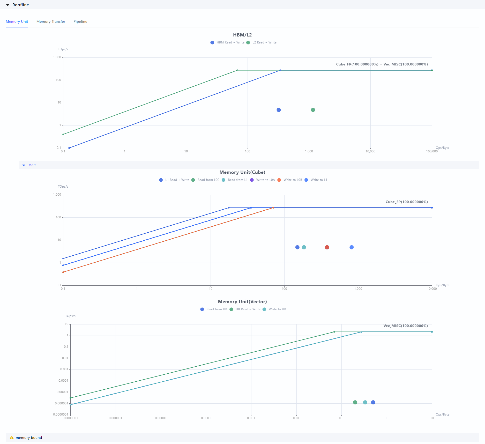
  
    **Table 4** Memory Unit parameters 
  
  | Parameter        | Description                                       |
  | ---------------- | ------------------------------------------------- |
  | HBM Read + Write | Read and write of the high bandwidth memory unit. |
  | L2 Read + Write  | Read and write of the L2 memory unit.             |
  | L1 Read + Write  | Read and write of the L1 memory unit.             |
  | Write to L1      | Write to the L1 memory unit.                      |
  | Read from L1     | Read from the L1 memory unit.                     |
  | Write to L0A     | Write to the L0A memory unit.                     |
  | Write to L0B     | Write to the L0B memory unit.                     |
  | Read from L0C    | Read from the L0C memory unit.                    |
  | UB Read + Write  | Read and write of the UB memory unit.             |
  | Read from UB     | Read from the UB memory unit.                     |
  | Write to UB      | Write to the UB memory unit.                      |
  | Vector Read UB   | Read from the UB memory unit by the vector unit.  |
  | Vector Write UB  | Write to the UB memory unit by the vector unit.   |
  
    **Memory Transfer**: displays the memory transfer path, as shown in [**Figure 4** Memory Transfer](#memory-transfer). For details about the parameters, see [**Table 5** Memory Transfer parameters](#memory-transfer-parameters).
  
    **Figure 4** Memory Transfer 
    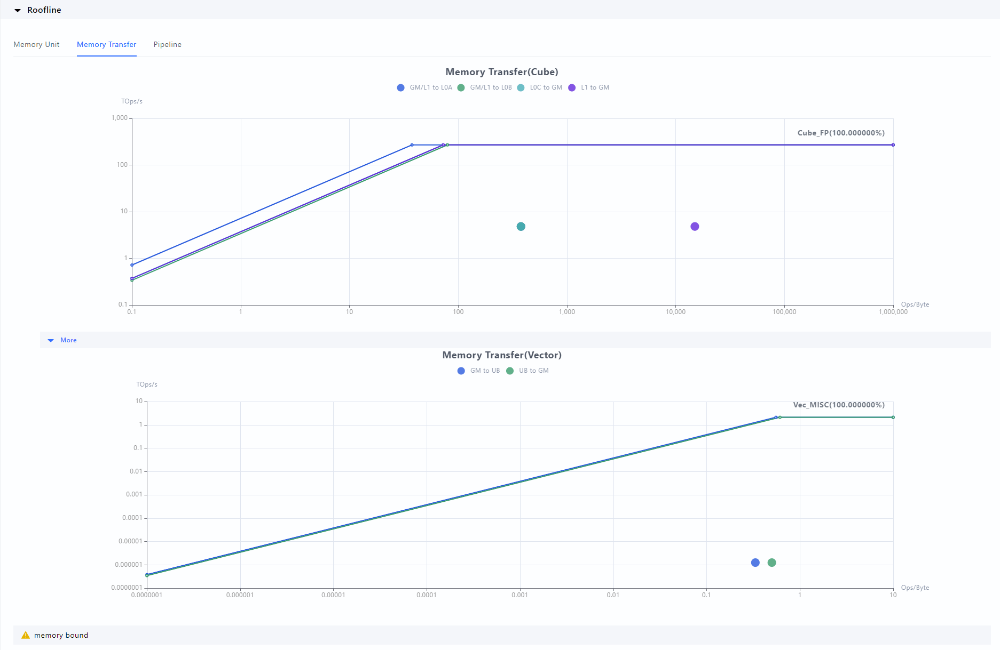
  
    **Table 5** Memory Transfer parameters
  
  | Parameter    | Description                       |
  | ------------ | --------------------------------- |
  | GM/L1 to L0A | Memory channel from GM/L1 to L0A. |
  | GM/L1 to L0B | Memory channel from GM/L1 to L0B. |
  | L0C to GM    | Memory channel from L0C to GM.    |
  | L1 to GM     | Memory channel from L1 to GM.     |
  | L0C to L1    | Memory channel from L0C to L1.    |
  | GM to UB     | Memory channel from GM to UB.     |
  | UB to GM     | Memory channel from UB to GM.     |
  
    **Pipeline**: displays the pipeline model, as shown in [**Figure 5** Pipeline](#pipeline). For details about the parameters, see [**Table 6** Pipeline parameters](#pipeline-parameters).
  
    **Figure 5** Pipeline   
    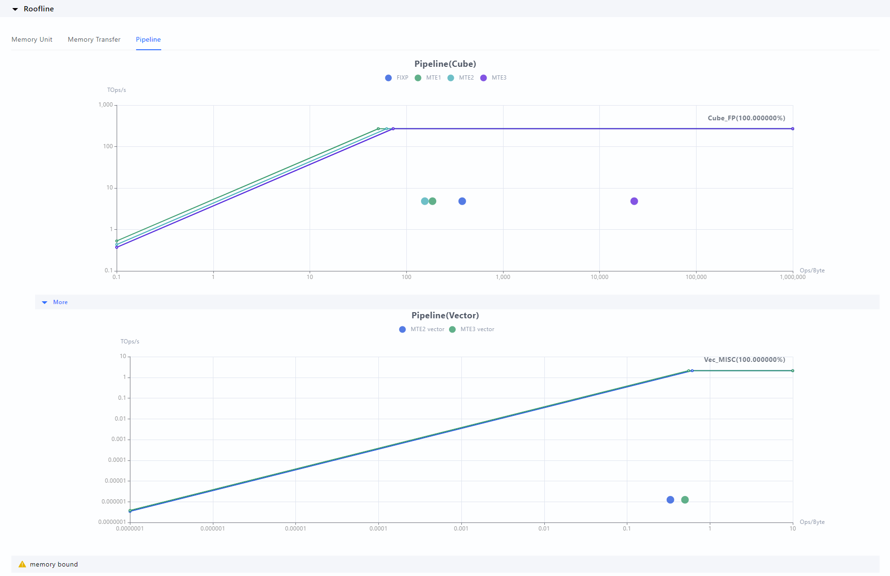
  
    **Table 6** Pipeline parameters 
  
  | Parameter   | Description                                |
  | ----------- | ------------------------------------------ |
  | MTE1        | MTE1 channel.                              |
  | MTE2        | MTE2 channel.                              |
  | MTE3        | MTE3 channel.                              |
  | FIXP        | FIXP channel.                              |
  | MTE2 vector | MTE2 channel of the vector computing unit. |
  | MTE3 vector | MTE3 channel of the vector computing unit. |

- If the hardware product is an <term>Atlas inference product</term>, only **Memory Unit** exists, as shown in [**Figure 6** Memory Unit](#memory-unit-graph). For details about the parameters, see [**Table 7** Memory Unit parameters](#memory-unit-parameters-1).
  
    **Figure 6** Memory Unit model  
    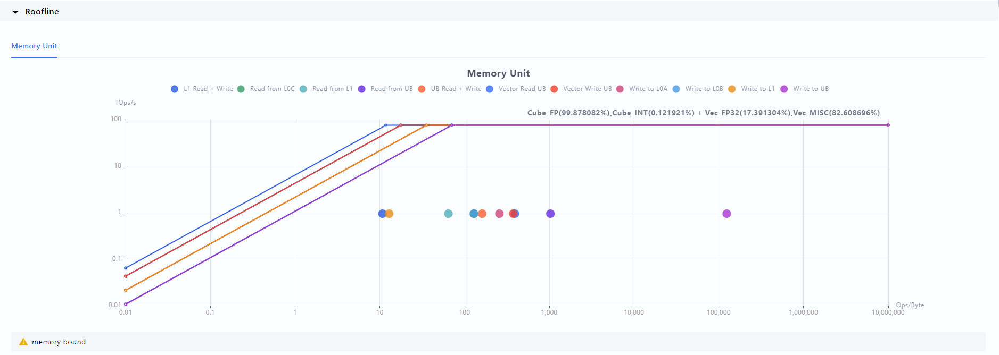
  
    **Table 7** Memory Unit parameters 
  
  | Parameter       | Description                                      |
  | --------------- | ------------------------------------------------ |
  | L1 Read + Write | Read and write of the L1 memory unit.            |
  | Read from L0C   | Read from the L0C memory unit.                   |
  | Read from L1    | Read from the L1 memory unit.                    |
  | Read from UB    | Read from the UB memory unit.                    |
  | UB Read + Write | Read and write of the UB memory unit.            |
  | Vector Read UB  | Read from the UB memory unit by the vector unit. |
  | Vector Write UB | Write to the UB memory unit by the vector unit.  |
  | Write to L0A    | Write to the L0A memory unit.                    |
  | Write to L0B    | Write to the L0B memory unit.                    |
  | Write to L1     | Write to the L1 memory unit.                     |
  | Write to UB     | Write to the UB memory unit.                     |

**Compute Workload Analysis**

Area 4: **Compute Workload Analysis**. Developers can view the information in a bar chart and data pane, helping them analyze compute workload, as shown in [**Figure 7** Compute Workload Analysis](#compute-workload-analysis). The parameters are displayed in a bar chart and data pane based on the collected data. For details about the parameters, see [**Table 8** Compute Workload Analysis parameters](#compute-workload-analysis-parameters). The content indicated by the  icon indicates the compute workload analysis result of each block.

**Figure 7** Compute Workload Analysis 
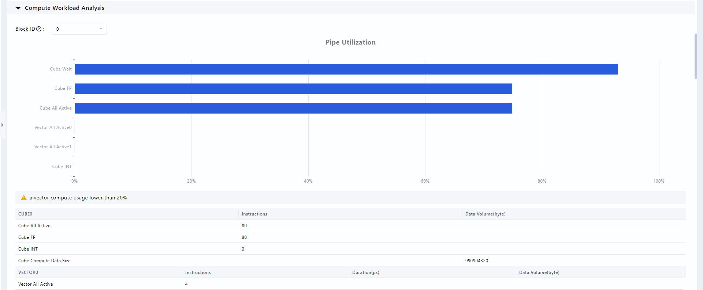

**Table 8** Compute Workload Analysis parameters

| Parameter         | Description                                                                                                                                                                                                                                                                                                                                               |
| ----------------- | --------------------------------------------------------------------------------------------------------------------------------------------------------------------------------------------------------------------------------------------------------------------------------------------------------------------------------------------------------- |
| Block ID          | Sub block ID. You can switch the block ID to view the corresponding information. When the operator type is **AiCore**, this parameter is displayed as **NA**, and the multi-core average value is displayed.                                                                                                                                              |
| Pipe Utilization  | Pipe (instruction queue) visualization. It is displayed in a bar chart.  - Horizontal coordinate: Cycles percentage, calculated as follows: Cycles/Total cycles. **Cycles** indicates the clock cycles consumed by the instruction execution on the sub block.  - Vertical coordinate: operator instructions, provided by the data in the BIN file. |
| CUBE              | Name of a cube instruction. This parameter is displayed when the operator type is **cube**.                                                                                                                                                                                                                                                               |
| CUBE0             | Name of a cube instruction. This parameter is displayed when the operator type is **mix**.                                                                                                                                                                                                                                                                |
| VECTOR            | Name of a vector instruction. This parameter is displayed when the operator type is vector.                                                                                                                                                                                                                                                               |
| VECTOR0           | Name of a vector instruction. This parameter is displayed when the operator type is **mix**.                                                                                                                                                                                                                                                              |
| VECTOR1           | Name of a vector instruction. This parameter is displayed when the operator type is **mix**.                                                                                                                                                                                                                                                              |
| AICORE            | Name of an AI Core instruction. This parameter is displayed when the operator type is **AiCore**.                                                                                                                                                                                                                                                         |
| Instructions      | Number of operator instructions.                                                                                                                                                                                                                                                                                                                          |
| Duration(μs)      | Duration of operator instructions.                                                                                                                                                                                                                                                                                                                        |
| Data Volume(Byte) | Operator instruction data volume.                                                                                                                                                                                                                                                                                                                         |

**Memory Workload Analysis**

Area 5: **Memory Workload Analysis**. It displays the memory workload analysis information in the memory heatmap and data pane, as shown in [**Figure 8** Memory Workload Analysis](#memory-workload-analysis). The parameters in the memory heatmap and data pane are displayed based on the collected data. For details about the parameters, see [Table 9 Parameter description](#parameter-description). **Peak\(%\)** on the right of the heatmap indicates the arrow color, with the value representing the peak bandwidth proportion (i.e., the proportion of the maximum bandwidth). The content indicated by the  icon indicates the memory workload analysis result of each block.

**Figure 8** Memory Workload Analysis  
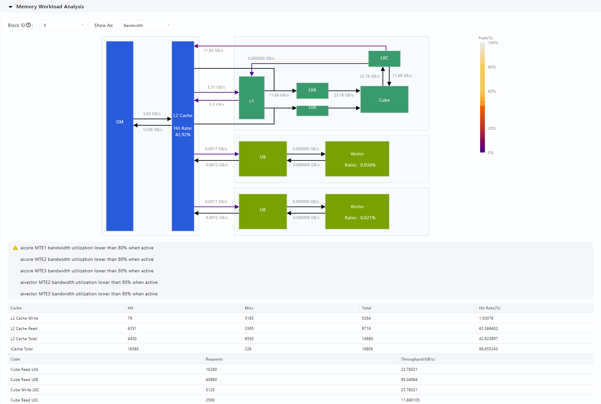

**Table 9** Parameter description

| Parameter | Description                                                                                                                                                                                                             |
| --------- | ----------------------------------------------------------------------------------------------------------------------------------------------------------------------------------------------------------------------- |
| Block ID  | Sub block ID. You can select the sub block to be viewed from the **Block ID** drop-down list. When the operator type is **AiCore**, **Block ID** is displayed as **NA**, and the multi-core average value is displayed. |
| Show As   | Optional. You can select the flow arrow content of the heatmap to display the number of requests or bandwidth. The arrow on the heatmap indicates the flow direction.  - Num of Request  - Bandwidth              |

The content displayed in the data pane varies according to the operator type. The content is the data parsing result based on the BIN file. The details are as follows:

- If the operator type is AI Core, the parameters in the table pane are described in [**Table 10** Parameters for AI Core](#parameters-for-ai-core).
  
    **Table 10** Parameters for AI Core 
  
  | Parameter        | Description                                                                               |
  | ---------------- | ----------------------------------------------------------------------------------------- |
  | Cache            | L2 cache.                                                                                 |
  | Cube             | Cube computing unit.                                                                      |
  | HBM              | High bandwidth memory unit.                                                               |
  | L0A              | L0A memory unit.                                                                          |
  | L0B              | L0B memory unit.                                                                          |
  | L0C              | L0C memory unit.                                                                          |
  | L1               | L1 memory unit.                                                                           |
  | Pipe             | Computing channel.                                                                        |
  | UB               | UB memory unit.                                                                           |
  | Vector           | Vector computing unit.                                                                    |
  | Requests         | Number of operations.                                                                     |
  | Throughput(GB/s) | Throughput, indicating the amount of data transferred per second by the channel, in GB/s. |

- If the operator type is mix, the parameters in the table pane are described in [**Table 11** Parameters for mix](#parameters-for-mix).
  
    **Table 11** Parameters for mix 
  
  | Parameter           | Description                                                                               |
  | ------------------- | ----------------------------------------------------------------------------------------- |
  | Cache               | L2 cache.                                                                                 |
  | Hit                 | Number of cache hits.                                                                     |
  | Miss                | Number of times that the cache is reallocated after a cache miss.                         |
  | Total               | Total number of cache requests.                                                           |
  | Hit Rate(%)         | Cache hit rate.                                                                           |
  | Cube                | Cube computing unit.                                                                      |
  | HBM Cube            | High bandwidth memory unit of the cube unit.                                              |
  | HBM Vector Core0    | High bandwidth memory unit of the vector unit of core 0 in AI Core.                       |
  | HBM Vector Core1    | High bandwidth memory unit of the vector unit of core 1 in AI Core.                       |
  | Scalar              | Scalar unit                                                                               |
  | Scalar Cube         | Scalar unit of the cube unit.                                                             |
  | Scalar Vector Core0 | Scalar unit of the vector unit of core 0 in AI Core.                                      |
  | Scalar Vector Core1 | Scalar unit of the vector unit of core 1 in AI Core.                                      |
  | L0A                 | L0A memory unit.                                                                          |
  | L0B                 | L0B memory unit.                                                                          |
  | L0C                 | L0C memory unit.                                                                          |
  | L1                  | L1 memory unit.                                                                           |
  | Requests            | Number of operations.                                                                     |
  | Throughput(GB/s)    | Throughput, indicating the amount of data transferred per second by the channel, in GB/s. |
  | Peak(%)             | Ratio of the actual bandwidth to the theoretical bandwidth.                               |
  | Pipe Cube           | Computing channel of the cube unit.                                                       |
  | Pipe Vector Core0   | Computing channel of the vector unit of core 0 in AI Core.                                |
  | Pipe Vector Core1   | Computing channel of the vector unit of core 1 in AI Core.                                |
  | Instructions        | Number of instructions.                                                                   |
  | Cycle               | Clock cycle consumed by the channel.                                                      |
  | Time(μs)            | Running time of the scalar unit.                                                          |
  | Wait Cycles         | Number of blocked cycles on the corresponding pipe.                                       |
  | Active Rate(%)      | Percentage of the running cycles to the total cycles.                                     |
  | UB Core0            | UB memory unit of core 0 in AI Core of the **mix** operator.                              |
  | UB Core1            | UB memory unit of core 1 in AI Core of the **mix** operator.                              |
  | Vector Core0        | Vector computing unit.                                                                    |
  | Vector Core1        | Vector computing unit.                                                                    |

- If the operator type is vector, the parameters in the table pane are described in [**Table 12** Parameters for vector](#parameters-for-vector).
  
    **Table 12** Parameters for vector 
  
  | Parameter        | Description                                                                               |
  | ---------------- | ----------------------------------------------------------------------------------------- |
  | Cache            | L2 cache.                                                                                 |
  | Hit              | Number of cache hits.                                                                     |
  | Miss             | Number of times that the cache is reallocated after a cache miss.                         |
  | Total            | Total number of cache requests.                                                           |
  | Hit Rate(%)      | Cache hit rate.                                                                           |
  | HBM              | High bandwidth memory unit.                                                               |
  | Scalar           | Scalar unit                                                                               |
  | Requests         | Number of operations.                                                                     |
  | Throughput(GB/s) | Throughput, indicating the amount of data transferred per second by the channel, in GB/s. |
  | Pipe             | Computing channel.                                                                        |
  | Instructions     | Number of instructions.                                                                   |
  | Cycle            | Clock cycle consumed by the channel.                                                      |
  | Time(μs)         | Running time of the scalar unit.                                                          |
  | Wait Cycles      | Number of blocked cycles on the corresponding pipe.                                       |
  | Active Rate(%)   | Percentage of the running cycles to the total cycles.                                     |
  | UB               | UB memory unit.                                                                           |
  | Vector           | Vector computing unit.                                                                    |
  | Peak(%)          | Ratio of the actual bandwidth to the theoretical bandwidth.                               |

- If the operator type is cube, the parameters in the table pane are described in [**Table 13** Parameters for cube](#parameters-for-cube).
  
    **Table 13** Parameters for cube 
  
  | Parameter        | Description                                                                               |
  | ---------------- | ----------------------------------------------------------------------------------------- |
  | Cache            | L2 cache.                                                                                 |
  | Hit              | Number of cache hits.                                                                     |
  | Miss             | Number of times that the cache is reallocated after a cache miss.                         |
  | Total            | Total number of cache requests.                                                           |
  | Hit Rate(%)      | Cache hit rate.                                                                           |
  | Cube             | Cube computing unit.                                                                      |
  | HBM              | High bandwidth memory unit.                                                               |
  | Scalar           | Scalar unit                                                                               |
  | L0A              | L0A memory unit.                                                                          |
  | L0B              | L0B memory unit.                                                                          |
  | L0C              | L0C memory unit.                                                                          |
  | L1               | L1 memory unit.                                                                           |
  | Requests         | Number of operations.                                                                     |
  | Throughput(GB/s) | Throughput, indicating the amount of data transferred per second by the channel, in GB/s. |
  | Peak(%)          | Ratio of the actual bandwidth to the theoretical bandwidth.                               |
  | Pipe             | Computing channel.                                                                        |
  | Instructions     | Number of instructions.                                                                   |
  | Cycle            | Clock cycle consumed by the channel.                                                      |
  | Time(μs)         | Running time of the scalar unit.                                                          |
  | Wait Cycles      | Number of blocked cycles on the corresponding pipe.                                       |
  | Active Rate(%)   | Percentage of the running cycles to the total cycles.                                     |

### Instructions

**Viewing Cycles**

In the **Pipe Utilization** bar chart area, move the pointer over the bar chart of the corresponding instruction. The actual cycles information is displayed, as shown in [**Figure 1** Viewing Cycles](#viewing-cycles).

**Figure 1** Viewing Cycles 
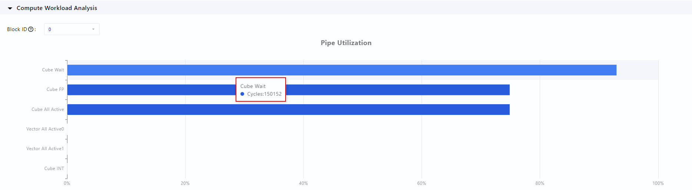

**Viewing Operator Performance in the Roofline Model Performance Graph**

In any view of the **Memory Unit**, **Memory Transfer**, or **Pipeline** in the **Roofline** area, hover over a parameter point to display the corresponding performance metrics for that memory unit, as shown in [**Figure 2** Displaying operator performance information](#displaying-operator-performance-information). For details about the parameters, see [**Table 1** Performance parameters](#performance-parameters).

**Figure 2** Displaying operator performance information  
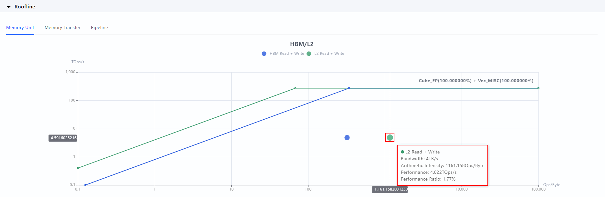

**Table 1** Performance parameters 

| Parameter            | Description                                                                                                        |
| -------------------- | ------------------------------------------------------------------------------------------------------------------ |
| Bandwidth            | Indicates the upper limit of the hardware bandwidth.                                                               |
| Arithmetic Intensity | Corresponds to the X axis, indicating the number of operations supported by a unit of memory.                      |
| Performance          | Corresponds to the Y axis, indicating the number of operations per unit time (trillions of operations per second). |
| Performance Ratio    | Performance percentage = Actual operator performance/Optimal hardware performance                                  |

**Comparing Operator Performance**

MindStudio Insight allows developers to compare the details of two operators to intuitively view the differences between the two operators, facilitating analysis. Before comparing operator details, you need to set the baseline operator and comparison operator. For details, see [Data Comparison](./basic_operations.md#managing-data).

In operator comparison mode, the **Details** tab page displays comparison data in terms of **Base Info**, **Core Occupancy**, **Compute Workload Analysis**, and **Memory Workload Analysis**. Only operators of the same type can be compared.

- **Base Info**: The basic information between operators is compared.

- **Core Occupancy**: Based on the comparison data, if the comparison data contains core occupancy data, the analysis result is displayed on the page. If the comparison data does not contain core occupancy data, the analysis result is not displayed on the page.

- **Roofline**: This module does not support comparison. If the comparison data contains this module, the content of this module is displayed in operator comparison mode.

- **Compute Workload Analysis**: You can view the corresponding information in the bar chart and data pane. In the bar chart, blue bars indicate the comparison data, and green bars indicate the baseline data. The data pane displays the differences between operators. You can click **See more** in the **Details** column to view details about the baseline data and comparison data, as shown in [**Figure 3** Compute Workload Analysis comparison](#compute-workload-analysis-comparison).
  
    **Figure 3** Compute Workload Analysis comparison  
    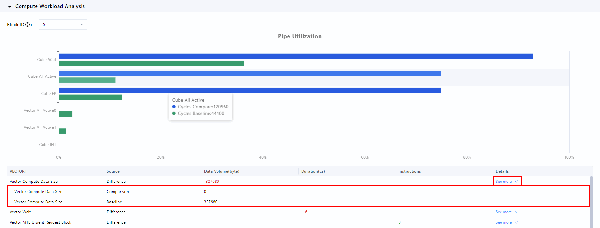

- **Memory Workload Analysis**: You can view the corresponding information in the memory heatmap and data pane. The data in the brackets in the heatmap is the baseline data, and the data outside the brackets is the comparison data. The data pane displays the differences between operators. You can click **See more** in the **Details** column to view details about the baseline data and comparison data, as shown in [**Figure 4** Memory Workload Analysis comparison](#memory-workload-analysis-comparison).
  
    **Figure 4** Memory Workload Analysis comparison 
    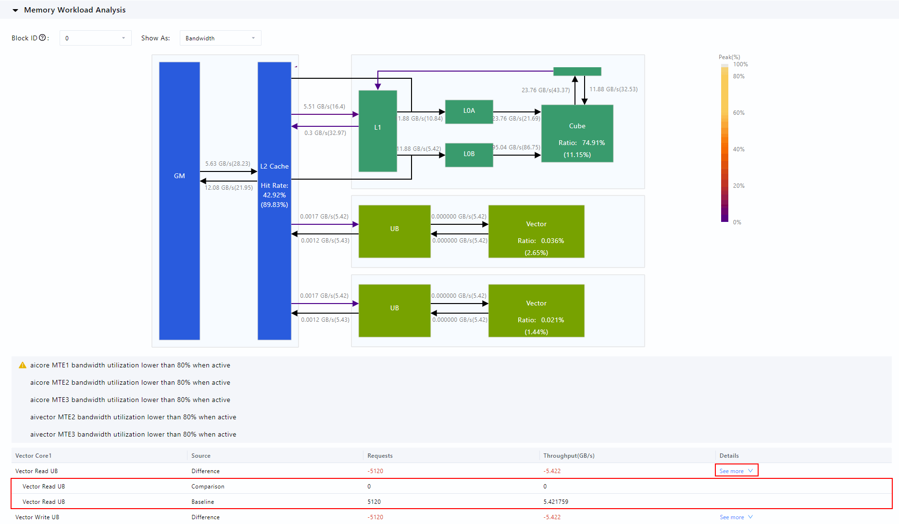

## Cache

### Function

The **Cache** tab page displays the L2 cache access status of kernel functions in user programs, helping users optimize the cache hit rate.

### GUI Description

The **Cache** tab page displays the L2 cache access status of kernel functions in user programs, as shown in [**Figure 1** Cache tab page](#cache-tab-page). Click any graph on the **Cache** tab page to zoom in on the graph.

Select a memory unit to display details about the memory unit, including the cache line index, number of events, and event proportion.

**Figure 1** Cache tab page  
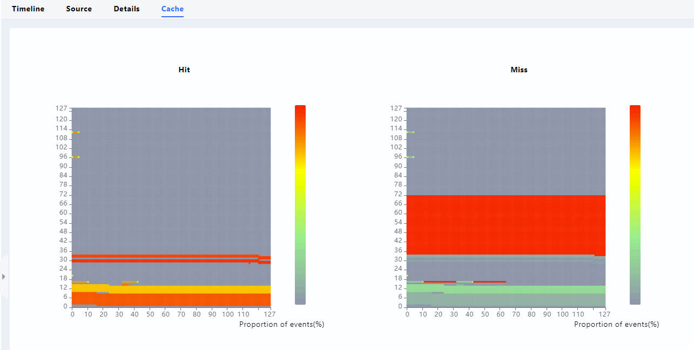

### Instructions

**Event Graphs Can Be Associated with Source Codes**

On the **Cache** tab page, select a hit or miss event graph and click to enlarge the event graph. In the enlarged event graph, right-click the selected memory cell and choose **Show Instructions in Source** from the shortcut menu. The **Source** tab page is displayed, and the related instruction line is highlighted, as shown in [**Figure 1** Jumping to instruction table](#jumping-to-instruction-table).

**Figure 1** Jumping to instruction table  
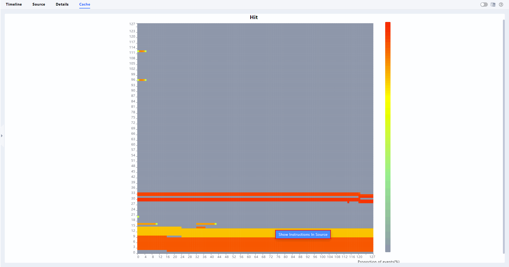

## On-Chip Memory

### Function

The **On-Chip Memory** page displays the memory layout, helping you understand the memory layout and details and analyze the unified buffer (UB) overflow problem.

### GUI Description

After the `memory_info.json` file in the specified directory is imported, the **On-Chip Memory** page is displayed, showing the memory layout, as shown in [**Figure 1** On-Chip Memory - Memory Block Graph](#on-chip-memory-memory-block-graph). Click a color block in the memory block graph to view the details and layout of the memory block, as shown in [**Figure 2** On-Chip Memory - Slice Detail](#on-chip-memory-slice-detail) and [**Figure 3** On-Chip Memory - Memory Layout](#on-chip-memory-memory-layout).

- [**Figure 1** On-Chip Memory - Memory Block Graph](#on-chip-memory-memory-block-graph) shows the memory usage over time, including the peak memory usage and fragmentation during the entire running process. The horizontal axis indicates the virtual execution sequence, with each time unit representing a line in the IR file. The vertical axis indicates the address of the on-chip memory. Each color block in the figure represents a tensor memory block.
- [**Figure 2** On-Chip Memory - Slice Detail](#on-chip-memory-slice-detail) displays the memory block size, lifetime, allocation position, and whether the variable is temporary.
- [**Figure 3** On-Chip Memory - Slice Detail](#on-chip-memory-slice-detail) shows the physical layout of the memory, helping you tune the memory and reduce bank conflicts. To understand the layout of this figure, you need to understand the memory layout of the Ascend AI Processor. For details, see "[Avoiding Bank Conflicts in the Unified Buffer](https://www.hiascend.com/document/detail/en/canncommercial/850/opdevg/Ascendcopdevg/atlas_ascendc_best_practices_10_0025.html)" in *Ascend C Operator Development Guide*.

### Instructions

Import the `memory_info.json` file from the specified directory. **Memory Block Graph** is displayed, as shown in [**Figure 1** On-Chip Memory - Memory Block Graph](#on-chip-memory-memory-block-graph). The basic information is displayed on the top of the page, including the operator name, memory type, and compilation status. You can switch between memory types to view the corresponding on-chip memory status and compilation status. If the compilation fails, the error information is displayed, as shown in [**Figure 4** On-Chip Memory - Basic information](#on-chip-memory-basic-information).

Click any memory block in [**Figure 1** On-Chip Memory - Memory Block Graph](#on-chip-memory-memory-block-graph) to display the memory details and layout of the memory block, as shown in [**Figure 2** On-Chip Memory - Slice Detail](#on-chip-memory-slice-detail) and [**Figure 3** On-Chip Memory - Memory Layout](#on-chip-memory-memory-layout).

**Figure 1** On-Chip Memory - Memory Block Graph
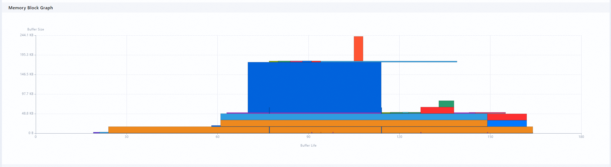

**Figure 2** On-Chip Memory - Slice Detail
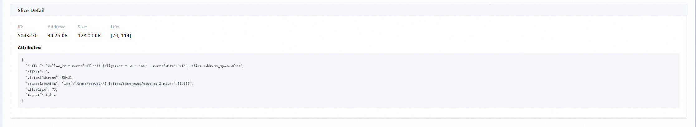

**Figure 3** On-Chip Memory - Memory Layout
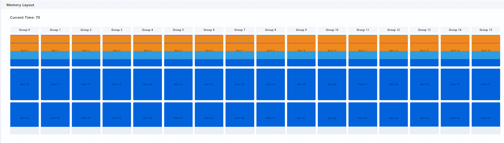

**Figure 4** On-Chip Memory - Basic information 
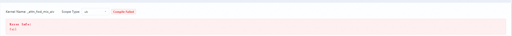
