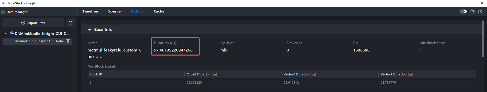
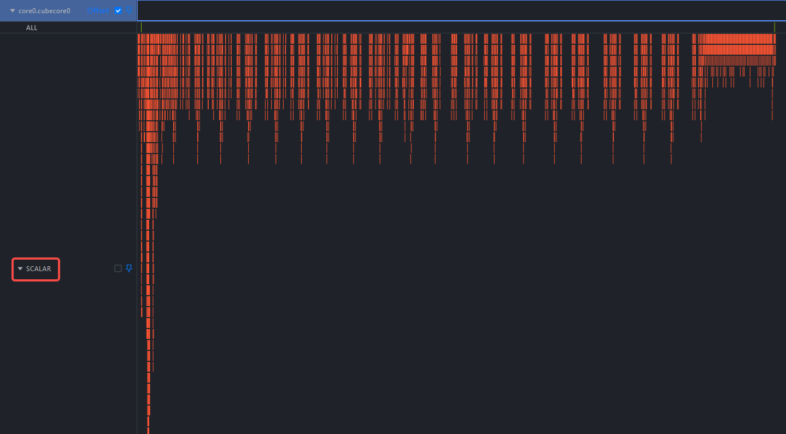
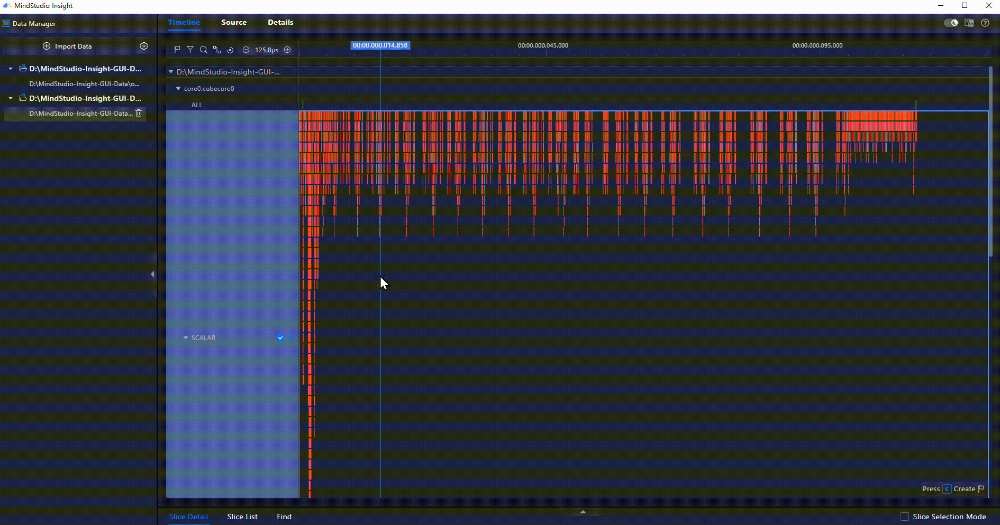
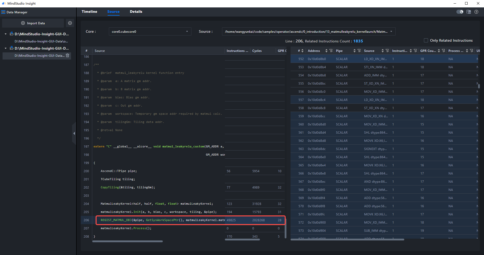

# **🚀 Quick Start (Operator Tuning)**

MindStudio Insight allows you to import the operator profile data collected by [msOpProf](https://gitcode.com/Ascend/msopprof/blob/26.0.0/docs/en/quick_start/msopprof_quick_start.md) on Ascend AI Processors. Users can quickly identify software and hardware performance bottlenecks for operators based on the displayed key performance indicators, enabling efficient operator performance tuning.

## Environment Setup

In operator performance tuning, common issues include load imbalance, excessive scalar overhead, and insufficient pipeline parallelism. The msOpProf tool can collect both board data and simulation data. The board data focuses on the performance information in the real hardware environment. The simulation data is collected from the simulator, and can be used to obtain information such as fine-grained instruction pipeline diagrams and code hotspot diagrams.

Assume that you have used msOpProf to collect the board data and simulation data of the `matmul_leakyrelu` operator.

Operator data: [Click here to download](https://gitcode.com/zhangruoyu2/msinsight-quick-start-demo/blob/main/operator)

Data directory structure:

```tex
├─msprof-op
│  ├─core_inter_load
│  ├─details
│  ├─ratio
│  ├─roofline
│  ├─source
│  └─timeline
└─msprof-op-simulator
```

## Procedure

### 1. Viewing Board Data

Import the `msprof-op/details/visualize_data.bin` board data file and switch to the **Details** tab page.



In the basic information, it is found that the operator takes more than 90μs.

> For the `matmul_leakyrelu` operator, the performance is mainly determined by the matrix multiplication, and the computation workload of LeakyReLU is relatively small.

Based on prior knowledge, for FP16 small matrix multiplication (1024×1024×1024) on Ascend 910, the expected execution time of the `matmul_leakyrelu` operator is between 16–30μs. Therefore, this operator is not performing optimally and can be optimized.


In the memory load analysis, reviewing the pipeline reveals high Scalar activity in the Cube pipeline, indicating frequent scalar computations within the operator—suggesting room for optimization.

> Preliminary findings: Operator performance is suboptimal, with a high scalar computation count indicating room for optimization.

### 2. Viewing Simulation Data

Import the `msprof-op-simulator/visualize_data.bin` simulation board data file and switch to the **Timeline** tab.



On the **Timeline** tab, observe the operator execution behavior. The Scalar unit shows significant activity, which aligns with the preliminary findings.

**Select the Scalar unit with the mouse, select the activity that occurs most frequently, and check the code that causes the activity.**




The specific user code is in `/home/wangyunkai/code/samples/operator/ascendc/0_introduction/13_matmulleakyrelu_kernellaunch/MatmulLeakyReluInvocationAsync/matmul_leakyrelu_custom.cpp:206`.

Switch to the **Source** tab page and open the user code found.



```c
206     REGIST_MATMUL_OBJ(&pipe, GetSysWorkSpacePtr(), matmulLeakyKernel.matmulObj, &matmulLeakyKernel.tiling);
```

`REGIST_MATMUL_OBJ` is a macro used to initialize the Matmul object and set tiling parameters. According to the Ascend official document, this macro performs a series of scalar operations to configure the Cube compute unit.

> Conclusion: Simulation data has pinpointed specific code lines for optimization. Operator development engineers should proceed with optimization.
