# 基于 Linux Kernel ftrace 的 Host Bound 问题分析

## 问题背景

在大模型中，CPU 主要负责任务下发，NPU 负责执行计算任务。无论训练还是推理场景，Host Bound 都是现网的高发问题。在 Profiling 数据中，Host Bound 通常表现为任务下发耗时较长，Device 侧和 Host 侧出现大量空泡，如下图所示。


分析 Host Bound 问题时，通常需要采集 Linux Kernel ftrace 数据来观察 CPU 上的进程调度情况。MindStudio Insight 提供了 [`ftrace_tools`](https://gitcode.com/Ascend/msinsight/blob/master/scripts/ftrace_tools/ReadMe.zh-CN.md)，其中 `trace_record.py` 用于采集 ftrace 数据，`trace_convert.py` 用于转换数据格式，`trace_analyze.py` 用于离线统计分析。这些脚本支持将 ftrace 数据与 Profiling 数据导入同一工程进行联合分析。

## 定位思路

1. 尝试绑核、流水优化、内存分配库替换等通用调度优化手段。Ascend Extension for PyTorch 的调度优化方法可参考[调度优化](https://www.hiascend.com/document/detail/zh/Pytorch/latest/ptmoddevg/trainingmigrguide/FrameworkPTAdapter/26.0.0/zh/pytorch_model_migration_fine_tuning/pipeline_opt.md)。
2. 如果通用优化未达到预期效果，在同一业务运行时间段内采集 ftrace 数据和 Profiling 数据。
3. 将原始 ftrace 数据优先转换为 MindStudio Insight 可导入的 SQLite DB；仅在已有 JSON 数据、需要 Chrome Trace JSON，或外部工具只支持 JSON 时使用 JSON 格式。
4. 将转换后的 ftrace 数据和 Profiling 数据导入同一工程，结合 CPU Scheduling、Process Scheduling 和 Profiling 视图分析任务调度情况。

> 容器场景下，推荐在宿主机采集 ftrace、在业务容器内采集 Profiling，两类数据无需在同一容器内采集。普通非特权容器通常无法直接采集 ftrace；若必须在容器内采集，需要满足额外的权限和 tracing 文件系统挂载要求，具体参见 [`ftrace_tools` README 的常见问题 8.5](https://gitcode.com/Ascend/msinsight/blob/master/scripts/ftrace_tools/ReadMe.zh-CN.md#85-能否在容器内直接使用-ftrace-采集能力)。如果业务容器未使用宿主机 PID 命名空间，还需要按[容器场景采集](#4-容器场景采集)中的说明完成 PID 映射。

## 模型 Profiling 数据采集

Profiling 数据采集方法请参考以下文档：

- [MindStudio Profiler 工具指南](https://gitcode.com/Ascend/msprof/blob/master/README.md)
- [msprof 采集通用命令](https://www.hiascend.com/document/detail/zh/canncommercial/latest/devaids/Profiling/atlasprofiling_16_0010.html)
- [PyTorch 训练/在线推理场景性能分析](https://www.hiascend.com/document/detail/zh/canncommercial/latest/devaids/Profiling/atlasprofiling_16_0006.html)

> 建议让 Profiling 和 ftrace 的采集时间段尽量重合；多卡场景可以指定包含多卡数据的上级目录，也可以指定任意单卡数据目录。

## Linux Kernel ftrace 数据采集

### 1. ftrace 数据介绍

Linux 内核内置了多种跟踪（trace）工具。ftrace 自 Linux 2.6.27 起被合入主线内核，是用于跟踪和调试内核运行行为的框架，可以帮助开发人员分析系统运行时的内部状态。ftrace 支持函数调用跟踪、进程调度跟踪和中断延迟分析等多种能力，可辅助定位内核态性能问题与调度异常。前文介绍的 `trace_record.py` 默认采集调度事件以及中断/软中断事件，下面仅节选其中与 CPU 任务调度相关的 sched 事件作为示例。

```text
# tracer: nop
#
# entries-in-buffer/entries-written: 112246/112246   #P:192
#
#                                _-----=> irqs-off
#                               / _----=> need-resched
#                              | / _---=> hardirq/softirq
#                              || / _--=> preempt-depth
#                              ||| / _-=> migrate-disable
#                              |||| /     delay
#           TASK-PID     CPU#  |||||  TIMESTAMP  FUNCTION
#              | |         |   |||||     |         |
   kworker/145:1-1023940 [145] d.... 1725926.126419: sched_stat_runtime: comm=kworker/145:1 pid=1023940 runtime=23230 [ns] vruntime=3450824076020452 [ns]
   kworker/145:1-1023940 [145] d.... 1725926.126423: sched_switch: prev_comm=kworker/145:1 prev_pid=1023940 prev_prio=120 prev_state=I ==> next_comm=release_thread next_pid=2813514 next_prio=120
  release_thread-2813514 [145] d.... 1725926.126427: sched_stat_runtime: comm=release_thread pid=2813514 runtime=8880 [ns] vruntime=468045121382 [ns]
  release_thread-2813514 [145] d.... 1725926.126429: sched_switch: prev_comm=release_thread prev_pid=2813514 prev_prio=120 prev_state=S ==> next_comm=swapper/145 next_pid=0 next_prio=120
          <idle>-0       [145] d.h.. 1725926.126478: sched_waking: comm=release_thread pid=2813514 prio=120 target_cpu=145
          <idle>-0       [145] dNh.. 1725926.126480: sched_wakeup: comm=release_thread pid=2813514 prio=120 target_cpu=145
          <idle>-0       [145] d.... 1725926.126485: sched_switch: prev_comm=swapper/145 prev_pid=0 prev_prio=120 prev_state=R ==> next_comm=release_thread next_pid=2813514 next_prio=120
```

本文使用 `ftrace_tools` 提供的 `trace_record.py` 采集 ftrace 数据。该脚本默认采集调度事件和中断/软中断事件，常用事件包括：

- `sched_switch`：记录任务上下文切换，包括前一个任务换出和下一个任务换入。
- `sched_waking`、`sched_wakeup`：记录任务唤醒过程。
- `sched_wakeup_new`：记录新建任务首次被唤醒。
- `sched_migrate_task`：记录任务在 CPU 核之间迁移。
- `sched_stat_runtime`：记录任务的运行时间统计。
- `sched_process_fork`、`sched_process_exec`、`sched_process_exit`：分别记录任务创建、执行新程序和退出。
- `irq_handler_entry`、`irq_handler_exit`、`softirq_raise`、`softirq_entry`、`softirq_exit`：记录硬中断和软中断行为。

ftrace 通常通过 tracefs 这一虚拟文件系统提供控制接口和跟踪数据，常见挂载路径为 `/sys/kernel/tracing/`；部分环境也可以通过 `/sys/kernel/debug/tracing/` 访问这些接口。[`trace-cmd`](https://www.trace-cmd.org/Documentation/trace-cmd/) 是 ftrace 的前端命令行工具，封装了对这些 tracefs 接口和跟踪数据的读写操作，提供了更易用的采集与解析命令。**ftrace 采集推荐以 `trace-cmd` 为主。**


### 2. 前置准备

- 使用 Python 3.10 或更高版本。
- 使用具备 ftrace 控制权限的 `root` 用户运行采集脚本。
- 从 MindStudio Insight 仓库获取 [`scripts/ftrace_tools`](https://gitcode.com/Ascend/msinsight/tree/master/scripts/ftrace_tools) 目录中的脚本。
- `trace-cmd` 是可选依赖，但本案例强烈推荐安装。脚本内置了回退方案：默认优先使用 `trace-cmd`，不可用时回退到直接读写 tracing 文件系统。回退方案的采集与转换方法请参见 [`ftrace_tools` README](https://gitcode.com/Ascend/msinsight/blob/master/scripts/ftrace_tools/ReadMe.zh-CN.md)。

如需安装 `trace-cmd`，可执行：

```bash
# Ubuntu
sudo apt-get install trace-cmd

# CentOS
sudo yum install trace-cmd
```

### 3. 命令行采集

进入 `scripts/ftrace_tools` 目录，启动 ftrace 采集。以下命令为通用示例，CPU 范围需要根据业务实际运行的 CPU 调整：

```bash
sudo python trace_record.py --record_time=30 --cpu=0-15 --output=trace.dat
```

在该采集窗口内启动业务并采集 Profiling 数据，确保两类数据的时间段重合。业务运行时间不确定时，可以设置 `--record_time=-1` 持续采集，待业务和 Profiling 采集结束后按 `Ctrl+C` 停止。

完整参数、后端差异和事件丢失处理方法请参见 [`ftrace_tools` README 的“采集 ftrace 数据”章节](https://gitcode.com/Ascend/msinsight/blob/master/scripts/ftrace_tools/ReadMe.zh-CN.md#3-采集-ftrace-数据)。

### 4. 容器场景采集

推荐在宿主机采集 ftrace，在业务容器内采集 Profiling。如果容器未使用宿主机 PID 命名空间，需要在业务进程启动后，由能够看到宿主机 `/proc` 的采集端使用 `--NSpid` 生成 PID 映射，并在转换时通过 `--pid_mapping` 传入 `pid_mapping.json`。命令行参数 `--NSpid` 只在采集开始时扫描一次，因此启动 ftrace 前需要确保待映射的业务进程已经存在；如果业务进程会在采集期间动态创建，可使用程序化持续映射接口，具体用法参见下方 README 链接。

容器内采集的权限和挂载要求、PID 映射命令及使用限制，请参见 [`ftrace_tools` README 的“容器 PID 映射”章节](https://gitcode.com/Ascend/msinsight/blob/master/scripts/ftrace_tools/ReadMe.zh-CN.md#43-容器-pid-映射)和[常见问题 8.5](https://gitcode.com/Ascend/msinsight/blob/master/scripts/ftrace_tools/ReadMe.zh-CN.md#85-能否在容器内直接使用-ftrace-采集能力)。

## ftrace 数据转换

`trace_convert.py` 会解析原始 ftrace 数据，并导出 SQLite DB 或 Chrome Trace JSON。MindStudio Insight 联合分析推荐使用默认的 SQLite DB；JSON 主要用于兼容已有 JSON 数据、Chrome Trace JSON 或仅支持 JSON 的外部工具。完整参数和格式约束请参见 [`ftrace_tools` README 的“转换 ftrace 数据”章节](https://gitcode.com/Ascend/msinsight/blob/master/scripts/ftrace_tools/ReadMe.zh-CN.md#4-转换-ftrace-数据)。

例如，Profiling 数据位于 `result_dir/ctl_1418857_20251025030529768_ascend_pt`，`trace-cmd` 输出位于 `result_dir/trace.dat` 时，推荐的 DB 转换命令如下：

```bash
python trace_convert.py \
  --input=result_dir/trace.dat \
  --output=result_dir/ftrace_data.db \
  --format=db \
  --profiling_data=result_dir/ctl_1418857_20251025030529768_ascend_pt
```

## 联合分析案例：定位 CPU 竞争导致的 Host Bound

本案例展示 CPU 密集型计算任务 `hb_hog*` 与 vLLM 关键任务同核运行时的调度竞争场景。问题数据（下文简称 Fault）记录了 vLLM 关键任务因同核竞争产生调度延迟的现象；优化数据（下文简称 Fixed）通过分离两类任务的 CPU 亲和性验证优化效果。

### 1. 场景与数据采集

本次实验运行 vLLM 推理，并启动 32 个名为 `hb_hog00`～`hb_hog31` 的周期性 CPU 密集型任务。每个 `hb_hog*` 以 500 ms 为一个周期，其中约 400 ms 执行整数计算、约 100 ms 等待，从而形成重复的 CPU 忙碌区间。下面仅展示与 CPU 负载和亲和性相关的关键实现，推理业务逻辑和数据落盘代码从略。

`hb_hog*` 工作进程启动后，首先设置进程名和 CPU 亲和性，然后等待统一的启动信号。进入忙碌阶段后，进程通过不分配内存的整数运算持续保持 Runnable；进入周期中的等待阶段后，则等待到下一个周期。

```python
def cpu_hog_worker(index, cpus, start_event, stop_event,
                   origin_ns, period_ms, duty_ms):
    set_process_name(f"hb_hog{index:02d}")
    os.sched_setaffinity(0, set(cpus))

    while not stop_event.is_set() and not start_event.wait(timeout=0.1):
        pass

    period_ns = period_ms * 1_000_000
    duty_ns = duty_ms * 1_000_000
    state = (0x9E3779B97F4A7C15 ^ os.getpid()) & 0xFFFFFFFFFFFFFFFF
    while not stop_event.is_set():
        phase_ns = (time.monotonic_ns() - origin_ns.value) % period_ns
        if phase_ns < duty_ns:
            busy_deadline = time.monotonic_ns() + min(
                duty_ns - phase_ns, 2_000_000
            )
            while time.monotonic_ns() < busy_deadline:
                state ^= (state << 13) & 0xFFFFFFFFFFFFFFFF
                state ^= state >> 7
                state ^= (state << 17) & 0xFFFFFFFFFFFFFFFF
        else:
            sleep_seconds = min((period_ns - phase_ns) / 1e9, 0.01)
            stop_event.wait(timeout=max(sleep_seconds, 0.0005))
```

Python 主进程在导入 vLLM 和初始化模型前，先将自身绑定到 `workload_cpus`。随后由该进程创建的 vLLM 进程和线程会继承这一 CPU 亲和性。`hb_hog*` 工作进程虽然由同一主进程创建，但会在 `cpu_hog_worker()` 入口立即将自身重新绑定到 `hog_cpus`，因此两类任务可以独立设置 CPU 集合。

```python
# 先设置 Python 主进程的 CPU 亲和性。
os.sched_setaffinity(0, set(workload_cpus))

hog_processes = [
    ctx.Process(
        target=cpu_hog_worker,
        args=(index, hog_cpus, start_event, stop_event, origin_ns, ...),
    )
    for index in range(hog_count)
]
for process in hog_processes:
    process.start()

# vLLM 在设置亲和性之后导入和初始化。
from vllm import LLM, SamplingParams

llm = LLM(**llm_kwargs)
```

使用其他推理程序或 CPU 密集型任务复现实验时，需要保持下述 CPU 集合、负载规模、忙碌周期和采集时序一致。

本例选择同一 NPU 本地 NUMA 节点中的 CPU 120～135。Fault 和 Fixed 两轮实验的 CPU 设置如下，实际复现时需要根据服务器 CPU 和 NUMA 拓扑替换核号。

| 数据 | Python/vLLM 进程树 | `hb_hog*` | 预期关系 |
| --- | --- | --- | --- |
| Fault | CPU 120～127 | CPU 120～127 | CPU 集合重叠 |
| Fixed | CPU 120～127 | CPU 128～135 | CPU 集合不重叠 |

除 CPU 亲和性外，两轮实验保持相同配置：模型为 `Qwen/Qwen3-0.6B`，`max_model_len=26240`、`tensor_parallel_size=1`，单轮批量输入 2 个请求，每个请求最多生成 64 个 Token，采样参数为 `temperature=0.8`、`top_p=0.95`，并在正式采集前生成 8 个 Token 完成预热。两轮均只执行 1 轮推理，启动 32 个 `hb_hog*`，使用 500/400 ms 的周期/忙碌时长，并保持 `workload_nice=5`：`hb_hog*` 使用普通优先级，Python/vLLM 进程树的 nice 值增加 5。

每轮开始前，需要确认 `profiling_fault`、`profiling_fixed` 和 `host_bound_state_*` 目录为空。重复实验时，应为每轮创建新的 Profiling 和运行状态输出目录，并在转换命令中使用本轮实际的 Profiling 目录，避免旧数据参与时间轴对齐。

每轮实验按以下顺序采集数据：

1. 在推理环境中启动对应的 Fault 或 Fixed 实验。实验程序先完成模型初始化和预热，然后输出 `[ARMED]` 并开始 10 秒倒计时；此时 vLLM 进程树和 `hb_hog*` 进程均已创建，但 CPU 密集型任务尚未开始运行。
2. 在倒计时结束前，在宿主机或使用宿主机 PID 命名空间、能够看到宿主机 `/proc` 的采集容器中，进入 `scripts/ftrace_tools` 目录并启动 ftrace。两轮都采集 CPU 120～130，以保持观察范围一致。下列命令适用于业务容器未使用宿主机 PID 命名空间的场景；如果采集端与业务使用同一 PID 命名空间，可以省略 `--NSpid` 和随后重命名 `pid_mapping.json` 的命令。

   ```bash
   # Fault
   sudo python trace_record.py \
     --record_time=30 \
     --cpu=120-130 \
     --output=trace_fault.dat \
     --NSpid
   mv pid_mapping.json pid_mapping_fault.json

   # Fixed
   sudo python trace_record.py \
     --record_time=30 \
     --cpu=120-130 \
     --output=trace_fixed.dat \
     --NSpid
   mv pid_mapping.json pid_mapping_fixed.json
   ```

3. 倒计时结束后，实验程序依次调用 `llm.start_profile()`、启动所有 `hb_hog*` 的忙碌周期并执行推理；推理完成后调用 `llm.stop_profile()`。等待本轮 ftrace 采集结束，再执行下一轮，避免输出文件相互覆盖。
4. 实验程序分别在 `host_bound_state_fault` 和 `host_bound_state_fixed` 目录生成 `metadata.json`，其中记录 Python/vLLM 根进程、`hb_hog*` PID、采集时已有的 TID 和两类任务的 CPU 集合。可以在推理容器内使用 `taskset -cp <PID>`，或检查 `/proc/<PID>/status` 中的 `Cpus_allowed_list`，确认 CPU 亲和性已经生效。ftrace 使用宿主机视角的 PID；转换时通过对应的 `pid_mapping_*.json` 将宿主机进程 PID 映射为推理容器内的进程 PID，`metadata.json` 中的 TID 列表仅用于辅助核对线程。

完成采集后，将 ftrace 文件和 PID 映射文件置于转换环境可访问的目录，并分别转换两轮数据：

```bash
python trace_convert.py \
  --input=trace_fault.dat \
  --output=fault_ftrace_data.db \
  --format=db \
  --profiling_data=profiling_fault \
  --pid_mapping=pid_mapping_fault.json

python trace_convert.py \
  --input=trace_fixed.dat \
  --output=fixed_ftrace_data.db \
  --format=db \
  --profiling_data=profiling_fixed \
  --pid_mapping=pid_mapping_fixed.json
```

如果采集和推理使用同一 PID 命名空间，转换时同样可以省略 `--pid_mapping`。本文截图沿用实验时生成的 JSON 数据；重新采集时推荐按上述命令转换为 SQLite DB，两种格式的调度分析方法相同。

### 2. 导入数据并定位目标任务

导入前，先使用 `trace_convert.py` 转换本轮 ftrace 数据，并通过 `--profiling_data` 将 ftrace 时间戳对齐到对应的 Profiling 时间轴；容器内外 PID 命名空间不同时，还需要在转换时传入 `--pid_mapping`。然后在 MindStudio Insight 的同一工程中分别导入 Profiling 数据和转换后的 ftrace 数据。

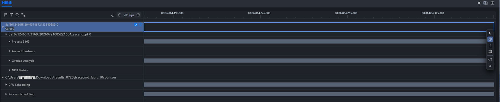

在 Profiling 数据中确认待分析任务的 ID。本例的目标任务 ID 为 3169；完成容器 PID 映射后，可以在 ftrace 的 Process Scheduling 中定位到 `VLLM::EngineCor:3169`。

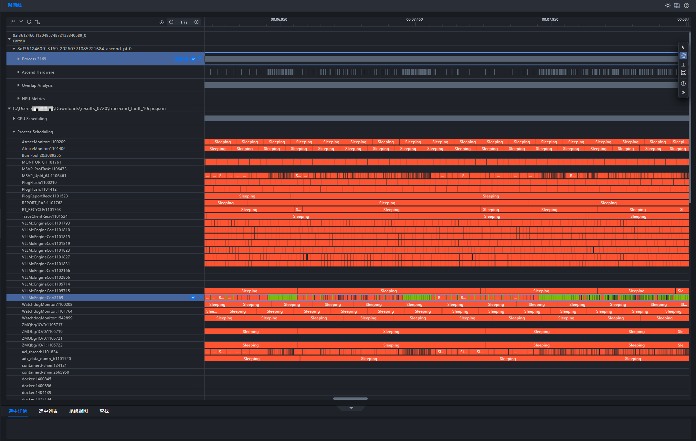

将鼠标移到目标 Process Scheduling 泳道，单击泳道名称右侧的置顶图标，将该泳道固定到顶部。置顶后，即使继续滚动或展开其他泳道，也能始终以该任务为基准对照 Profiling 与 CPU Scheduling。

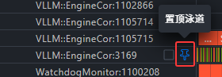

### 3. 关联 Runnable 等待与 Host/Device 间隙

Process Scheduling 中的 `Runnable` 表示任务已经具备运行条件，但尚未获得 CPU，是定位问题的重要线索之一。

展开 Profiling 中的 Process、Ascend Hardware 和 Overlap Analysis，以及 ftrace 中的 CPU Scheduling。先在较大时间范围内找到目标任务中连续的 `Runnable` 片段，再以该区域为中心放大；所有泳道会沿同一时间轴同步缩放。

缩放前：

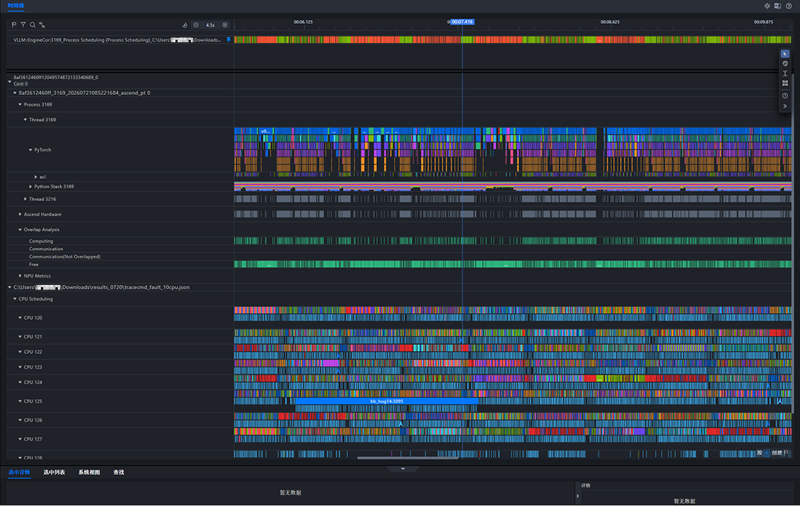

缩放后：

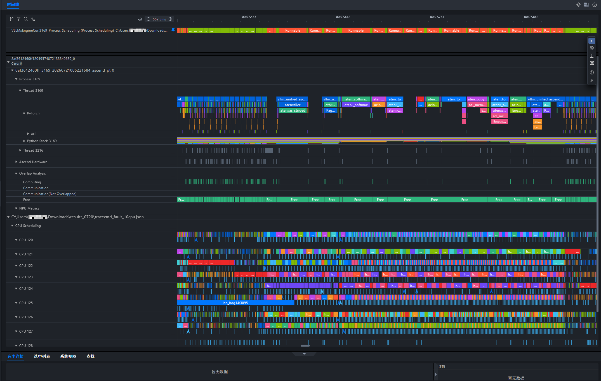

不过 `Runnable` 既可能是唤醒后的排队，也可能是任务仍可运行时被换出，不能单凭 `Runnable` 就断言发生了抢占。

我们进一步在同一时间窗中可以看到，目标任务较长的 `Runnable` 区间与 Profiling 中 Host 下发活动的间断、Overlap Analysis 的 Computing 间隙及较长 Free 区间在时间上对应。

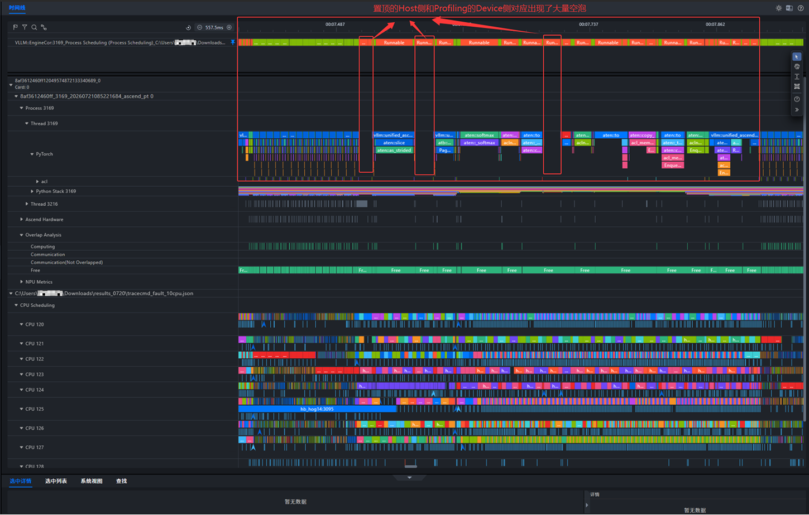

这一步建立了时间相关性：Host 下发延迟和 Device 侧间隙与目标任务等待 CPU 同时出现。要判断根因，还需要继续确认这些时间段内相应 CPU 的调度情况。

### 4. 分析 CPU 调度情况

方便起见，使用时间线的搜索功能输入 `VLLM`（或更详细的 `VLLM::EngineCor:3169`），可以高亮名称匹配的 vLLM 调度切片，并淡化其他切片，从复杂的 CPU Scheduling 数据中缩小观察范围。

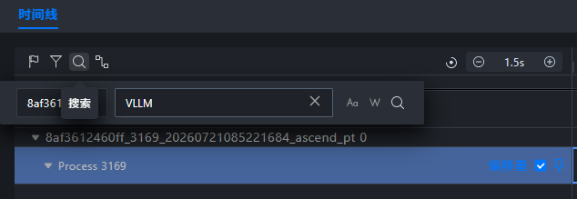

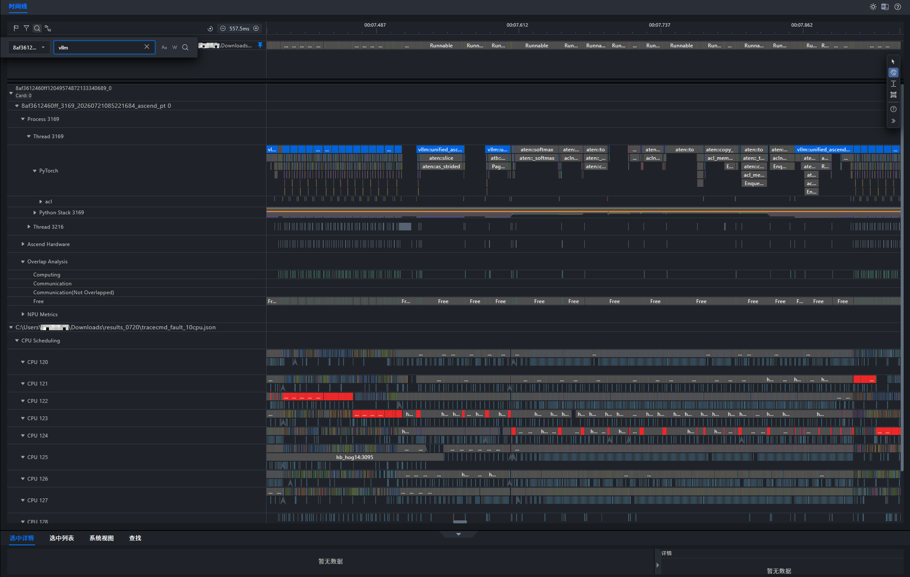

本例确认图中高亮切片均属于同一个 `VLLM::EngineCor:3169`；该任务的 Running 切片在所示时间窗内先后出现在不同 CPU 泳道，因此可以确认它在这些 CPU 之间发生了多次迁移。

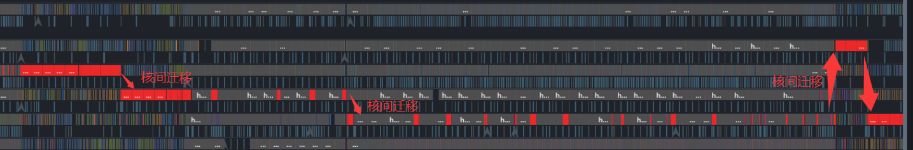

核间迁移本身不一定是性能故障，因此是否构成 Host Bound，仍需结合目标任务的 `Runnable` 状态和相应 CPU 上实际运行的任务继续判断。

可以观察到目标任务处于长 `Runnable` 的时间段内，对应 CPU 在 `hb_hog*` 的忙碌周期中被这些 CPU 密集型任务占用。若某段状态从 `Running` 直接转为 `Runnable`，说明该任务被换出时仍处于可运行状态；结合随后由 `hb_hog*` 占用同一 CPU，可以确认存在直接的同核调度竞争。

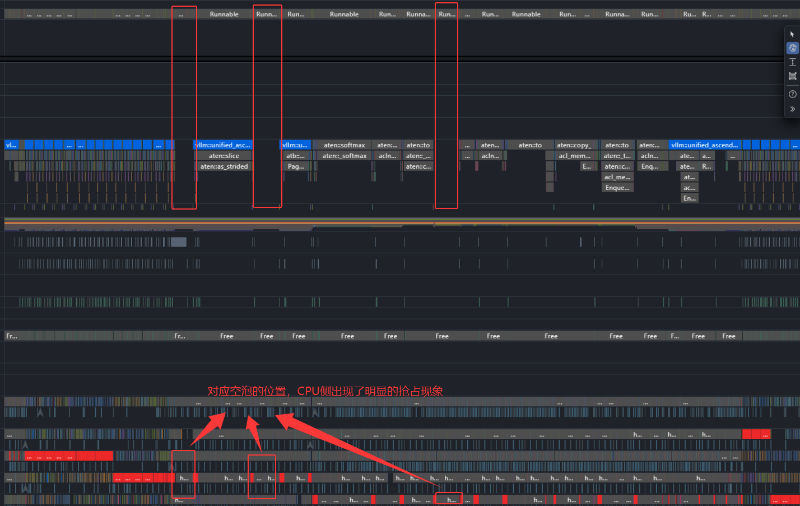

进一步放大后，可以看到在 `hb_hog*` 的忙碌周期内，多个 `hb_hog*` 任务频繁获得 CPU，而目标 vLLM 任务只能间歇运行。这解释了目标任务为何长时间处于 `Runnable`。

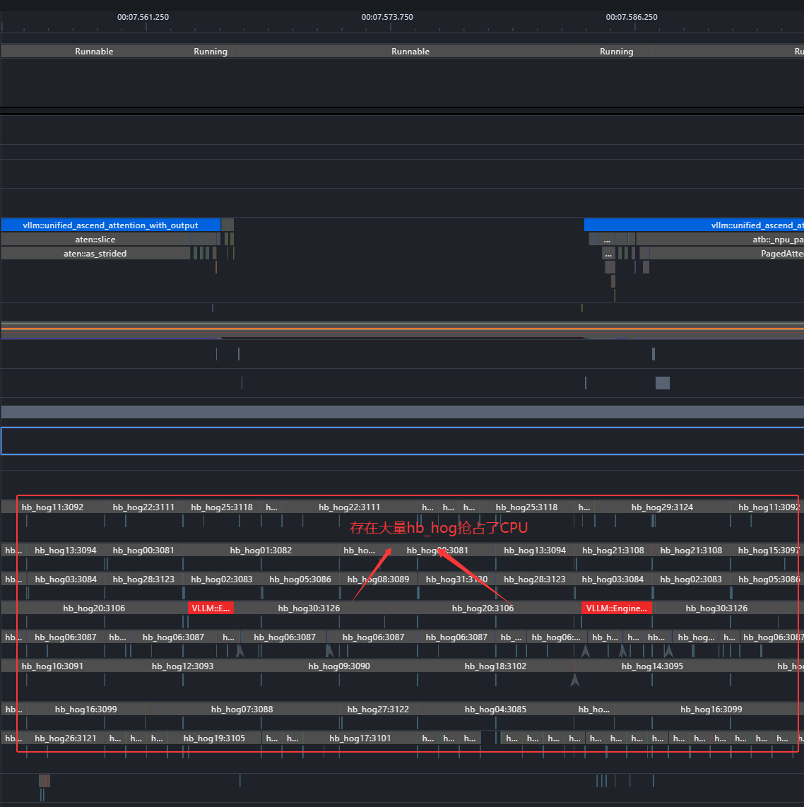

由此可以形成完整证据链：`hb_hog*` 与 vLLM 进程树使用重叠的 CPU 集合；目标任务被换出后仍保持可运行，并出现较长 `Runnable`，相应 CPU 同期由 `hb_hog*` 占用；这些等待区间又与 Host 下发中断及 Device 侧 Computing 间隙、Free 区间在时间上对应。期间还观察到目标任务多次发生核间迁移，但迁移本身不作为判断根因的充分条件。综合判断，本例的主要瓶颈是 CPU 同核竞争导致的 Host Bound。

### 5. 优化并验证结果

保持 Python/vLLM 进程树绑定在 CPU 120～127，仅将 `hb_hog*` 的 CPU 亲和性从 CPU 120～127 调整到 CPU 128～135，使两类任务使用互不重叠的 CPU 集合。该设置在进程启动阶段通过 `os.sched_setaffinity()` 完成，并可通过 `metadata.json`、`taskset -cp <PID>` 或 `/proc/<PID>/status` 中的 `Cpus_allowed_list` 验证。随后保持其他推理和负载配置不变，重新采集并导入 Profiling 与 ftrace 数据。

重新采集后，同角色关键任务的 ID 变为 3823，这是进程重新创建后的正常变化。在截图所示的代表性时间窗内，目标任务的异常长 `Runnable` 显著减少，vLLM 与 `hb_hog*` 的 Running 切片位于不同 CPU 集合，Host 下发和 Device 计算也更加连续。

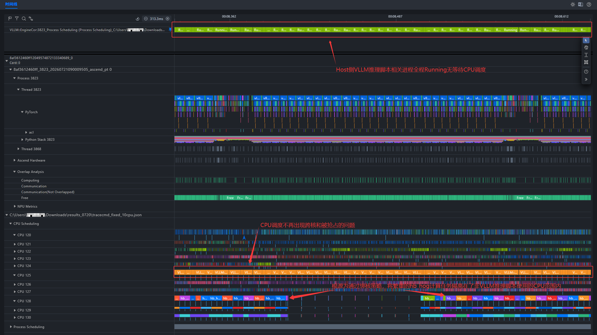

同核竞争造成的异常长 `Runnable` 及其对应的大段 Host/Device 间隙已经不再出现或显著减弱。但是 CPU affinity 只消除了 vLLM 与 `hb_hog*` 之间的直接同核竞争，并不意味着 CPU 已被独占。实际业务中仍应结合运行环境检查其他进程、cgroup/cpuset、NUMA 和中断亲和性，并在优化后重新采集 Profiling 与 ftrace 数据验证效果。
