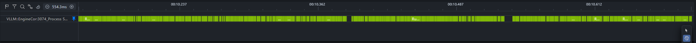
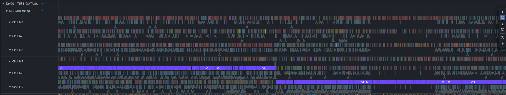
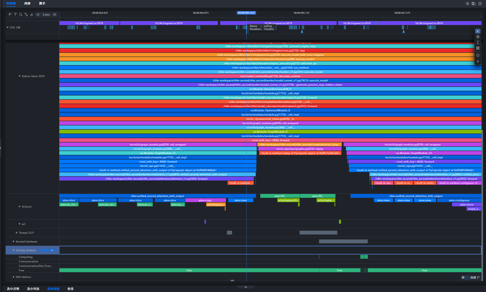
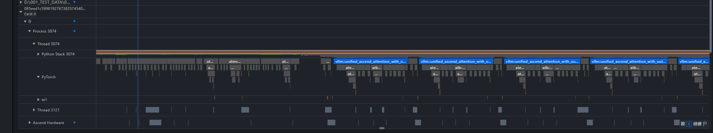
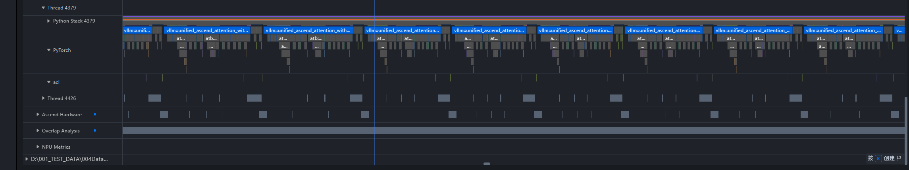
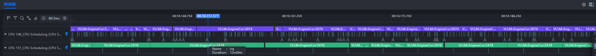

# 基于 Linux Kernel ftrace 的 Host Bound 问题分析

## 问题背景

在大模型中，CPU 主要负责任务下发，NPU 负责执行计算任务。无论训练还是推理场景，Host Bound 都是现网的高发问题。在 Profiling 数据中，Host Bound 通常表现为任务下发耗时较长，Device 侧和 Host 侧出现大量空泡，如下图所示。


分析 Host Bound 问题时，通常需要采集 Linux Kernel ftrace 数据来观察 CPU 上的进程调度情况。MindStudio Insight 提供了 [`ftrace_tools`](https://gitcode.com/Ascend/msinsight/blob/master/scripts/ftrace_tools/ReadMe.zh-CN.md)，其中 `trace_record.py` 用于采集 ftrace 数据，`trace_convert.py` 用于转换数据格式，`trace_analyze.py` 用于离线统计分析。这些脚本支持将 ftrace 数据与 Profiling 数据导入同一工程进行联合分析。

## 定位思路

1. 尝试绑核、流水优化、内存分配库替换等通用调度优化手段。Ascend Extension for PyTorch 的调度优化方法可参考[调度优化](https://www.hiascend.com/document/detail/zh/Pytorch/latest/ptmoddevg/trainingmigrguide/FrameworkPTAdapter/26.0.0/zh/pytorch_model_migration_fine_tuning/pipeline_opt.md)。
2. 如果通用优化未达到预期效果，在同一业务运行时间段内采集 ftrace 数据和 Profiling 数据。
3. 将原始 ftrace 数据优先转换为 MindStudio Insight 可导入的 SQLite DB；仅在已有 JSON 数据、需要 Chrome Trace JSON，或外部工具只支持 JSON 时使用 JSON 格式。
4. 将转换后的 ftrace 数据和 Profiling 数据导入同一工程，结合 CPU Scheduling、Process Scheduling 和 Profiling 视图分析任务调度情况。

> 容器场景下，推荐在宿主机采集 ftrace、在业务容器内采集 Profiling，两类数据无需在同一容器内采集。普通非特权容器通常无法直接采集 ftrace；若必须在容器内采集，需要满足额外的权限和 tracing 文件系统挂载要求，具体参见 [`ftrace_tools` README 的常见问题 8.5](https://gitcode.com/Ascend/msinsight/blob/master/scripts/ftrace_tools/ReadMe.zh-CN.md#85-能否在容器内直接使用-ftrace-采集能力)。如果业务容器未使用宿主机 PID 命名空间，还需要按[容器场景采集](#4-容器场景采集)中的说明完成 PID 映射。

## 模型 Profiling 数据采集

Profiling 数据采集方法请参考以下文档：

- [MindStudio Profiler 工具指南](https://gitcode.com/Ascend/msprof/blob/master/README.md)
- [msprof 采集通用命令](https://www.hiascend.com/document/detail/zh/canncommercial/latest/devaids/Profiling/atlasprofiling_16_0010.html)
- [PyTorch 训练/在线推理场景性能分析](https://www.hiascend.com/document/detail/zh/canncommercial/latest/devaids/Profiling/atlasprofiling_16_0006.html)

> 建议让 Profiling 和 ftrace 的采集时间段尽量重合；多卡场景可以指定包含多卡数据的上级目录，也可以指定任意单卡数据目录。

## Linux Kernel ftrace 数据采集

### 1. ftrace 数据介绍

Linux 内核内置了多种跟踪（trace）工具。ftrace 自 Linux 2.6.27 起被合入主线内核，是用于跟踪和调试内核运行行为的框架，可以帮助开发人员分析系统运行时的内部状态。ftrace 支持函数调用跟踪、进程调度跟踪和中断延迟分析等多种能力，可辅助定位内核态性能问题与调度异常。前文介绍的 `trace_record.py` 默认采集调度事件以及中断/软中断事件，下面仅节选其中与 CPU 任务调度相关的 sched 事件作为示例。

```text
# tracer: nop
#
# entries-in-buffer/entries-written: 112246/112246   #P:192
#
#                                _-----=> irqs-off
#                               / _----=> need-resched
#                              | / _---=> hardirq/softirq
#                              || / _--=> preempt-depth
#                              ||| / _-=> migrate-disable
#                              |||| /     delay
#           TASK-PID     CPU#  |||||  TIMESTAMP  FUNCTION
#              | |         |   |||||     |         |
   kworker/145:1-1023940 [145] d.... 1725926.126419: sched_stat_runtime: comm=kworker/145:1 pid=1023940 runtime=23230 [ns] vruntime=3450824076020452 [ns]
   kworker/145:1-1023940 [145] d.... 1725926.126423: sched_switch: prev_comm=kworker/145:1 prev_pid=1023940 prev_prio=120 prev_state=I ==> next_comm=release_thread next_pid=2813514 next_prio=120
  release_thread-2813514 [145] d.... 1725926.126427: sched_stat_runtime: comm=release_thread pid=2813514 runtime=8880 [ns] vruntime=468045121382 [ns]
  release_thread-2813514 [145] d.... 1725926.126429: sched_switch: prev_comm=release_thread prev_pid=2813514 prev_prio=120 prev_state=S ==> next_comm=swapper/145 next_pid=0 next_prio=120
          <idle>-0       [145] d.h.. 1725926.126478: sched_waking: comm=release_thread pid=2813514 prio=120 target_cpu=145
          <idle>-0       [145] dNh.. 1725926.126480: sched_wakeup: comm=release_thread pid=2813514 prio=120 target_cpu=145
          <idle>-0       [145] d.... 1725926.126485: sched_switch: prev_comm=swapper/145 prev_pid=0 prev_prio=120 prev_state=R ==> next_comm=release_thread next_pid=2813514 next_prio=120
```

本文使用 `ftrace_tools` 提供的 `trace_record.py` 采集 ftrace 数据。该脚本默认采集调度事件和中断/软中断事件，常用事件包括：

- `sched_switch`：记录任务上下文切换，包括前一个任务换出和下一个任务换入。
- `sched_waking`、`sched_wakeup`：记录任务唤醒过程。
- `sched_wakeup_new`：记录新建任务首次被唤醒。
- `sched_migrate_task`：记录任务在 CPU 核之间迁移。
- `sched_stat_runtime`：记录任务的运行时间统计。
- `sched_process_fork`、`sched_process_exec`、`sched_process_exit`：分别记录任务创建、执行新程序和退出。
- `irq_handler_entry`、`irq_handler_exit`、`softirq_raise`、`softirq_entry`、`softirq_exit`：记录硬中断和软中断行为。

ftrace 通常通过 tracefs 这一虚拟文件系统提供控制接口和跟踪数据，常见挂载路径为 `/sys/kernel/tracing/`；部分环境也可以通过 `/sys/kernel/debug/tracing/` 访问这些接口。[`trace-cmd`](https://www.trace-cmd.org/Documentation/trace-cmd/) 是 ftrace 的前端命令行工具，封装了对这些 tracefs 接口和跟踪数据的读写操作，提供了更易用的采集与解析命令。**ftrace 采集推荐以 `trace-cmd` 为主。**


### 2. 前置准备

- 使用 Python 3.10 或更高版本。
- 使用具备 ftrace 控制权限的 `root` 用户运行采集脚本。
- 从 MindStudio Insight 仓库获取 [`scripts/ftrace_tools`](https://gitcode.com/Ascend/msinsight/tree/master/scripts/ftrace_tools) 目录中的脚本。
- `trace-cmd` 是可选依赖，但本案例强烈推荐安装。脚本内置了回退方案：默认优先使用 `trace-cmd`，不可用时回退到直接读写 tracing 文件系统。回退方案的采集与转换方法请参见 [`ftrace_tools` README](https://gitcode.com/Ascend/msinsight/blob/master/scripts/ftrace_tools/ReadMe.zh-CN.md)。

如需安装 `trace-cmd`，可执行：

```bash
# Ubuntu
sudo apt-get install trace-cmd

# CentOS
sudo yum install trace-cmd
```

### 3. 命令行采集

进入 `scripts/ftrace_tools` 目录，启动 ftrace 采集。以下命令为通用示例，CPU 范围需要根据业务实际运行的 CPU 调整：

```bash
sudo python trace_record.py --record_time=30 --cpu=0-15 --output=trace.dat
```

在该采集窗口内启动业务并采集 Profiling 数据，确保两类数据的时间段重合。业务运行时间不确定时，可以设置 `--record_time=-1` 持续采集，待业务和 Profiling 采集结束后按 `Ctrl+C` 停止。

完整参数、后端差异和事件丢失处理方法请参见 [`ftrace_tools` README 的“采集 ftrace 数据”章节](https://gitcode.com/Ascend/msinsight/blob/master/scripts/ftrace_tools/ReadMe.zh-CN.md#3-采集-ftrace-数据)。

### 4. 容器场景采集

推荐在宿主机采集 ftrace，在业务容器内采集 Profiling。如果容器未使用宿主机 PID 命名空间，需要在业务进程启动后，由能够看到宿主机 `/proc` 的采集端使用 `--NSpid` 生成 PID 映射，并在转换时通过 `--pid_mapping` 传入 `pid_mapping.json`。命令行参数 `--NSpid` 只在采集开始时扫描一次，因此启动 ftrace 前需要确保待映射的业务进程已经存在；如果业务进程会在采集期间动态创建，可使用程序化持续映射接口，具体用法参见下方 README 链接。

容器内采集的权限和挂载要求、PID 映射命令及使用限制，请参见 [`ftrace_tools` README 的“容器 PID 映射”章节](https://gitcode.com/Ascend/msinsight/blob/master/scripts/ftrace_tools/ReadMe.zh-CN.md#43-容器-pid-映射)和[常见问题 8.5](https://gitcode.com/Ascend/msinsight/blob/master/scripts/ftrace_tools/ReadMe.zh-CN.md#85-能否在容器内直接使用-ftrace-采集能力)。

## ftrace 数据转换

`trace_convert.py` 会解析原始 ftrace 数据，并导出 SQLite DB 或 Chrome Trace JSON。MindStudio Insight 联合分析推荐使用默认的 SQLite DB；JSON 主要用于兼容已有 JSON 数据、Chrome Trace JSON 或仅支持 JSON 的外部工具。完整参数和格式约束请参见 [`ftrace_tools` README 的“转换 ftrace 数据”章节](https://gitcode.com/Ascend/msinsight/blob/master/scripts/ftrace_tools/ReadMe.zh-CN.md#4-转换-ftrace-数据)。

例如，Profiling 数据位于 `result_dir/ctl_1418857_20251025030529768_ascend_pt`，`trace-cmd` 输出位于 `result_dir/trace.dat` 时，推荐的 DB 转换命令如下：

```bash
python trace_convert.py \
  --input=result_dir/trace.dat \
  --output=result_dir/ftrace_data.db \
  --format=db \
  --profiling_data=result_dir/ctl_1418857_20251025030529768_ascend_pt
```

## 联合分析案例：定位 CPU 竞争导致的 Host Bound

本案例展示 CPU 密集型计算任务 `hb_hog*` 与 vLLM 关键任务同核运行时的调度竞争场景。问题数据（下文简称 Fault）记录了 vLLM 关键任务因同核竞争产生调度延迟的现象；优化数据（下文简称 Fixed）通过分离两类任务的 CPU 亲和性验证优化效果。

### 1. 场景与数据采集

本次实验运行 vLLM 推理，并启动 32 个名为 `hb_hog00`～`hb_hog31` 的周期性 CPU 密集型任务。每个 `hb_hog*` 以 500 ms 为一个周期，其中约 400 ms 执行整数计算、约 100 ms 等待，从而形成重复的 CPU 忙碌区间。完整的 Fault/Fixed 构造、vLLM Profiling 启停、PID/TID 元数据记录和 `trace_marker` 标记逻辑，请参见 [`host_bound_fault_lab.py`](https://gitcode.com/Ascend/msinsight/blob/master/scripts/ftrace_tools/examples/host_bound_fault_lab.py)。

Python 主进程在导入 vLLM 和初始化模型前，调用 `os.sched_setaffinity(0, set(workload_cpus))` 将当前主线程限制到 `--workload-cpus` 指定的 CPU 集合，`--workload-cpus` 和 `--hog-cpus` 接受 Linux CPU-list 写法，例如 `120-127` 或 `120-123,128-131`，区间端点均包含在内。随后创建的 vLLM 进程和线程通常会初始继承这一 CPU 亲和性。

`hb_hog*` 工作进程虽然由同一主进程创建，但每个进程都会在 `cpu_hog_worker()` 入口设置进程名，再调用 `os.sched_setaffinity(0, set(cpus))`；此处传入的 `cpus` 就是 `--hog-cpus` 解析得到的 `hog_cpus`。工作进程启动初期会短暂继承主进程的 `workload_cpus`，但在创建实验负载前就会完成重新绑核；绑核成功后，工作进程才向主进程报告就绪并等待统一的启动信号。进入忙碌阶段后，进程持续执行不分配内存的整数运算并保持可运行状态；进入等待阶段后，则等待到下一个周期。所有 `hb_hog*` 共用同一个 `hog_cpus` 允许集合，而不是将 32 个进程逐一固定到其中某个 CPU；它们可以在集合内迁移并相互竞争。

本例选择同一 NPU 本地 NUMA 节点中的 CPU 120～135。实际复现时，可先使用 `lscpu | grep -i numa` 或 `numactl --hardware` 查看在线 CPU 及 NUMA 归属，再根据设备所在 NUMA 节点替换示例核号。Fault 和 Fixed 两轮实验的 CPU 设置如下。

| 数据 | Python/vLLM 进程树 | `hb_hog*` | 预期关系 |
| --- | --- | --- | --- |
| Fault | CPU 120～127 | CPU 120～127 | CPU 集合重叠 |
| Fixed | CPU 120～127 | CPU 128～135 | CPU 集合不重叠 |

`--workload-cpus` 是 Python 主进程及后续 vLLM 进程和线程通常初始继承的允许 CPU 集合，`--hog-cpus` 是每个 `hb_hog*` 工作进程使用的允许 CPU 集合。脚本会校验 Fault 的两组 CPU 至少存在交集、Fixed 的两组 CPU 完全不相交；本例在 Fault 中使用完全重叠的集合，以稳定复现同核竞争。

从仓库根目录执行完整脚本，分别构造 Fault 和 Fixed 数据：

```bash
# Fault
python3 scripts/ftrace_tools/examples/host_bound_fault_lab.py \
  --mode fault \
  --workload-cpus 120-127 \
  --hog-cpus 120-127 \
  --hog-count 32 \
  --batch-size 2 \
  --max-tokens 64 \
  --request-seed 2026 \
  --rounds 1 \
  --profile-dir profiling_fault \
  --state-dir host_bound_state_fault

# Fixed
python3 scripts/ftrace_tools/examples/host_bound_fault_lab.py \
  --mode fixed \
  --workload-cpus 120-127 \
  --hog-cpus 128-135 \
  --hog-count 32 \
  --batch-size 2 \
  --max-tokens 64 \
  --request-seed 2026 \
  --rounds 1 \
  --profile-dir profiling_fixed \
  --state-dir host_bound_state_fixed
```

除 CPU 亲和性外，两轮实验保持相同配置：模型为 `Qwen/Qwen3-0.6B`，`max_model_len=26240`、`tensor_parallel_size=1`，单轮批量输入 2 个请求，每个请求固定生成 64 个 Token，采样参数为 `temperature=0.8`、`top_p=0.95`、`seed=2026`，并在正式采集前生成 8 个 Token 完成预热。脚本通过 `min_tokens=max_tokens` 避免遇到 EOS 提前结束，并在每轮生成后将各请求实际生成的 Token 数写入 `metadata.json`；任一请求实际生成的 Token 数不等于 64 时，本轮实验会被判定为无效。两轮均只执行 1 轮推理，启动 32 个 `hb_hog*`，使用 500/400 ms 的周期/忙碌时长，并设置 `--workload-nice 5`：`hb_hog*` 使用普通优先级，主进程在 `hb_hog*` 完成创建和重新绑核后调用 `os.nice(5)`，使后续 vLLM 任务初始继承较低的调度优先级。`nice` 值只影响调度优先级，不会修改 CPU 亲和性。由于完整脚本的默认批量、生成长度和轮数用于更通用的压力测试，复现本文数据时还需要显式设置 `--batch-size 2 --max-tokens 64 --request-seed 2026 --rounds 1`。

每轮开始前，推荐确认 `profiling_fault`、`profiling_fixed` 和 `host_bound_state_*` 目录为空。重复实验时，应为每轮创建新的 Profiling 和运行状态输出目录，并在转换命令中使用本轮实际的 Profiling 目录，避免旧数据参与时间轴对齐。

每轮实验按以下顺序采集数据：

1. 在推理环境中启动对应的 Fault 或 Fixed 实验。实验程序先完成模型初始化和预热，然后输出 `[ARMED]` 并开始 10 秒倒计时；此时 vLLM 进程树和 `hb_hog*` 进程均已创建，但 CPU 密集型任务尚未开始运行。
2. 在倒计时结束前，在宿主机或使用宿主机 PID 命名空间、能够看到宿主机 `/proc` 的采集容器中，进入 `scripts/ftrace_tools` 目录并启动 ftrace。两轮都采集 CPU 120～135，既覆盖 vLLM 的 CPU 120～127，也覆盖 Fixed 中 `hb_hog*` 重新绑定后的 CPU 128～135，并保持观察范围一致。这里的 `--cpu=120-135` 是 ftrace 采集过滤范围，取两轮 `workload_cpus` 和 `hog_cpus` 的并集，不会将采集进程或业务进程绑定到这些 CPU。下列命令适用于业务容器未使用宿主机 PID 命名空间的场景；如果采集端与业务使用同一 PID 命名空间，可以省略 `--NSpid` 和随后重命名 `pid_mapping.json` 的命令。

   ```bash
   # Fault
   sudo python trace_record.py \
     --backend=trace-cmd \
     --record_time=30 \
     --cpu=120-135 \
     --output=trace_fault.dat \
     --NSpid
   mv pid_mapping.json pid_mapping_fault.json

   # Fixed
   sudo python trace_record.py \
     --backend=trace-cmd \
     --record_time=30 \
     --cpu=120-135 \
     --output=trace_fixed.dat \
     --NSpid
   mv pid_mapping.json pid_mapping_fixed.json
   ```

   上述命令显式指定 `trace-cmd` 后端，确保实际输出与后续转换命令使用的 `.dat` 文件一致；如果 `trace-cmd` 不可用或不兼容，采集会直接失败并给出错误，而不会自动切换到 debugfs 后端并将输出文件改为 `.txt`。如需改用 debugfs，应显式设置 `--backend=debugfs`，将采集输出改为 `trace_fault.txt` 和 `trace_fixed.txt`，并同步修改后续 `trace_convert.py --input` 的文件名。

3. 倒计时结束后，实验程序依次调用 `llm.start_profile()`、启动所有 `hb_hog*` 的忙碌周期并执行推理；推理完成后调用 `llm.stop_profile()`。等待本轮 ftrace 采集结束，再执行下一轮，避免输出文件相互覆盖。

完成采集后，将 ftrace 文件和 PID 映射文件置于转换环境可访问的目录，并分别转换两轮数据：

```bash
python trace_convert.py \
  --input=trace_fault.dat \
  --output=fault_ftrace_data.db \
  --format=db \
  --profiling_data=profiling_fault \
  --pid_mapping=pid_mapping_fault.json

python trace_convert.py \
  --input=trace_fixed.dat \
  --output=fixed_ftrace_data.db \
  --format=db \
  --profiling_data=profiling_fixed \
  --pid_mapping=pid_mapping_fixed.json
```

如果采集和推理使用同一 PID 命名空间，转换时同样可以省略 `--pid_mapping`。本文截图沿用实验时生成的 JSON 数据；重新采集时推荐按上述命令转换为 SQLite DB，两种格式的调度分析方法相同。

### 2. 导入数据并定位目标任务

导入前，先使用 `trace_convert.py` 转换本轮 ftrace 数据，并通过 `--profiling_data` 将 ftrace 时间戳对齐到对应的 Profiling 时间轴；容器内外 PID 命名空间不同时，还需要在转换时传入 `--pid_mapping`。然后在 MindStudio Insight 的同一工程中分别导入 Profiling 数据和转换后的 ftrace 数据。


在 Profiling 数据中确认待分析任务的 ID。本例的目标任务 ID 为 3169；完成容器 PID 映射后，可以在 ftrace 的 Process Scheduling 中定位到 `VLLM::EngineCor:3169`。


将鼠标移到目标 Process Scheduling 泳道，单击泳道名称右侧的置顶图标，将该泳道固定到顶部。置顶后，即使继续滚动或展开其他泳道，也能始终以该任务为基准对照 Profiling 与 CPU Scheduling。


### 3. 关联 Runnable 等待与 Host/Device 间隙

Process Scheduling 中的 `Runnable` 表示任务已经具备运行条件，但尚未获得 CPU，是定位问题的重要线索之一。

展开 Profiling 中的 Process、Ascend Hardware 和 Overlap Analysis，以及 ftrace 中的 CPU Scheduling。先在较大时间范围内找到目标任务中连续的 `Runnable` 片段，再以该区域为中心放大；所有泳道会沿同一时间轴同步缩放。

缩放前：


缩放后：


不过 `Runnable` 既可能是唤醒后的排队，也可能是任务仍可运行时被换出，不能单凭 `Runnable` 就断言发生了抢占。

我们进一步在同一时间窗中可以看到，目标任务较长的 `Runnable` 区间与 Profiling 中 Host 下发活动的间断、Overlap Analysis 的 Computing 间隙及较长 Free 区间在时间上对应。


这一步建立了时间相关性：Host 下发延迟和 Device 侧间隙与目标任务等待 CPU 同时出现。要判断根因，还需要继续确认这些时间段内相应 CPU 的调度情况。

### 4. 分析 CPU 调度情况

方便起见，使用时间线的搜索功能输入 `VLLM`（或更详细的 `VLLM::EngineCor:3169`），可以高亮名称匹配的 vLLM 调度切片，并淡化其他切片，从复杂的 CPU Scheduling 数据中缩小观察范围。


本例确认图中高亮切片均属于同一个 `VLLM::EngineCor:3169`；该任务的 Running 切片在所示时间窗内先后出现在不同 CPU 泳道，因此可以确认它在这些 CPU 之间发生了多次迁移。


核间迁移本身不一定是性能故障，因此是否构成 Host Bound，仍需结合目标任务的 `Runnable` 状态和相应 CPU 上实际运行的任务继续判断。

可以观察到目标任务处于长 `Runnable` 的时间段内，对应 CPU 在 `hb_hog*` 的忙碌周期中被这些 CPU 密集型任务占用。若某段状态从 `Running` 直接转为 `Runnable`，说明该任务被换出时仍处于可运行状态；结合随后由 `hb_hog*` 占用同一 CPU，可以确认存在直接的同核调度竞争。


进一步放大后，可以看到在 `hb_hog*` 的忙碌周期内，多个 `hb_hog*` 任务频繁获得 CPU，而目标 vLLM 任务只能间歇运行。这解释了目标任务为何长时间处于 `Runnable`。


由此可以形成完整证据链：`hb_hog*` 与 vLLM 进程树使用重叠的 CPU 集合；目标任务被换出后仍保持可运行，并出现较长 `Runnable`，相应 CPU 同期由 `hb_hog*` 占用；这些等待区间又与 Host 下发间断及 Device 侧 Computing 间隙、Free 区间在时间上对应。期间还观察到目标任务多次发生核间迁移，但迁移本身不作为判断根因的充分条件。综合判断，本例的主要瓶颈是 CPU 同核竞争导致的 Host Bound。

### 5. 优化并验证结果

保持 `--workload-cpus 120-127` 不变，仅将 `--hog-cpus` 从 `120-127` 调整为 `128-135`，使两类任务使用互不重叠的 CPU 集合。Fixed 轮次中，Python 主进程仍调用 `os.sched_setaffinity(0, set(workload_cpus))`，每个 `hb_hog*` 则调用 `os.sched_setaffinity(0, set(hog_cpus))` 将自身限制到 CPU 128～135。随后保持其他推理和负载配置不变，重新采集并导入 Profiling 与 ftrace 数据。

重新采集后，同角色关键任务的 ID 变为 3823，这是进程重新创建后的正常变化。在截图所示的代表性时间窗内，目标任务的异常长 `Runnable` 显著减少，vLLM 与 `hb_hog*` 的 Running 切片位于不同 CPU 集合，Host 下发和 Device 计算也更加连续。


同核竞争造成的异常长 `Runnable` 及其对应的大段 Host/Device 间隙已经不再出现或显著减弱。但是 CPU 亲和性只消除了 vLLM 与 `hb_hog*` 之间的直接同核竞争，并不意味着 CPU 已被独占。实际业务中仍应结合运行环境检查其他进程、cgroup/cpuset、NUMA 和中断亲和性，并在优化后重新采集 Profiling 与 ftrace 数据验证效果。

## 联合分析案例：定位网络 SoftIRQ 导致的 Host Bound

本案例将构造即使用户态进程与 vLLM 工作核隔离，其引发的 `NET_RX` SoftIRQ 与 vLLM 关键任务共享 CPU 的场景，用于展示 SoftIRQ 直接占用 vLLM 工作核时较为隐蔽的 Host Bound。完整的 Fault/Fixed 构造、RPS 配置与恢复、vLLM Profiling 启停、SoftIRQ 统计和 `trace_marker` 标记逻辑，请参见 [`vllm_softirq_fault_lab.py`](https://gitcode.com/Ascend/msinsight/blob/master/scripts/ftrace_tools/examples/vllm_softirq_fault_lab.py)。

### 1. 场景与数据采集

实验脚本通过多组本机 UDP 流量构造网络接收负载。与前一案例相同，下列参数接受 `144-151` 或 `144-147,152-155` 等 Linux CPU-list 写法。本例同时使用三组 CPU 参数，但它们的作用对象和设置方式不同：

| 参数 | 作用对象 | 设置方式 |
| --- | --- | --- |
| `--workload-cpus` | Python 主进程及后续 vLLM 任务 | RPS 放置探测完成后、导入 vLLM 前，主线程调用 `os.sched_setaffinity(0, set(workload_cpus))`；后续创建的 vLLM 任务通常初始继承该集合 |
| `--traffic-worker-cpus` | 每个 `sir_tx*`、`sir_rx*` 用户态流量进程 | 每个工作进程在入口调用 `os.sched_setaffinity(0, set(cpus))`，其中 `cpus` 即 `traffic_worker_cpus` |
| `--softirq-cpus` | 回环设备 `lo/rx-0` 的 `NET_RX` 接收处理 | 脚本将 CPU-list 转换为十六进制 CPU 位图并写入 `/sys/class/net/lo/queues/rx-0/rps_cpus`；这是 RPS 定向，不是调用 `sched_setaffinity()` 绑定某个进程或 SoftIRQ 任务 |

`sir_tx*`、`sir_rx*` 启动初期会短暂继承父进程原有的允许 CPU 集合，但会在创建 socket、报告就绪和开始 RPS 探测前，将自身明确重新绑定到 `traffic_worker_cpus`。所有流量进程共用该允许集合，并非每个进程固定到其中一个 CPU。本例将它们限制在 CPU 160～167，使实际流量阶段的用户态进程与 vLLM 工作核保持隔离。

`--softirq-cpus` 只控制目标 RX 队列的 RPS/`NET_RX` 处理 CPU，不会改写 `sir_tx*`、`sir_rx*`、vLLM 或 `ksoftirqd` 的任务亲和性，也不会迁移 `TIMER`、`RCU` 等其他 SoftIRQ。RPS 会根据流哈希在允许集合中选择 CPU，将报文加入目标 CPU 的 backlog 队列并唤醒该 CPU 处理后续网络协议栈，因此不保证集合中每个 CPU 获得完全相同的包量。脚本会通过放置探测验证实际覆盖范围，具体机制可参见 [Linux 内核 RPS 文档](https://docs.kernel.org/networking/scaling.html#rps-receive-packet-steering)。Fault 将 RPS 目标 CPU 设置为 vLLM 使用的 CPU 144～151，Fixed 则将目标 CPU 调整到 CPU 152～159。

| 数据 | Python/vLLM 进程树 | `NET_RX` 的 RPS 目标 CPU | `sir_tx*`、`sir_rx*` | 预期关系 |
| --- | --- | --- | --- | --- |
| Fault | CPU 144～151 | CPU 144～151 | CPU 160～167 | `NET_RX` 与 vLLM 工作核重叠 |
| Fixed | CPU 144～151 | CPU 152～159 | CPU 160～167 | 三组 CPU 互不重叠 |

>不要使用 `taskset -c 144-151` 等窄 CPU 范围包裹整个脚本；本例的启动进程至少需要允许 CPU 144～167，否则 Fixed 的 RPS 目标 CPU 或流量工作进程无法使用指定范围。

从仓库根目录执行以下命令：

```bash
# Fault：NET_RX 在 vLLM 工作核上处理
python3 scripts/ftrace_tools/examples/vllm_softirq_fault_lab.py \
  --mode fault \
  --workload-cpus 144-151 \
  --softirq-cpus 144-151 \
  --traffic-worker-cpus 160-167 \
  --max-tokens 64 \
  --request-seed 2026 \
  --profile-dir profiling_softirq_direct_fault \
  --state-dir softirq_state_direct_fault

# Fixed：将 NET_RX 迁移到 CPU 152～159
python3 scripts/ftrace_tools/examples/vllm_softirq_fault_lab.py \
  --mode fixed \
  --workload-cpus 144-151 \
  --softirq-cpus 152-159 \
  --traffic-worker-cpus 160-167 \
  --max-tokens 64 \
  --request-seed 2026 \
  --profile-dir profiling_softirq_direct_fixed \
  --state-dir softirq_state_direct_fixed
```

两轮实验使用相同的 `--request-seed 2026`，并通过 `min_tokens=max_tokens=64` 让每个请求固定生成 64 个 Token。脚本会将各请求实际生成的 Token 数写入最终的 `metadata.json`，任一请求实际生成的 Token 数不等于 64 时会将本轮实验判定为无效，避免 Fault/Fixed 对比混入生成工作量差异。

当前示例只支持回环设备 `--rps-device lo --rps-queue rx-0`，并需要对 `/sys/class/net/lo/queues/rx-0/rps_cpus` 和 `rps_flow_cnt` 具有写权限。

<span style="color: red;">修改 RPS 配置会暂时影响该网络命名空间内经过目标 RX 队列的全部流量，建议仅在独占测试环境中执行。</span>

> 正式加载 vLLM 前，脚本会运行 RPS 放置探测并检查目标 CPU 上的 `NET_RX` 和 `received_rps` 增量。完整运行时，可从 `metadata_armed.json` 中获取根进程和流量工作进程 PID，通过 `taskset -cp <PID>` 或 `Cpus_allowed_list` 核对用户态任务亲和性；`taskset` 不能证明 RPS 定向已生效，后者需要结合 `rps_cpus` 回读和 `rps_probe.json` 验证。还应检查 `softirq_delta.json` 和 `softnet_delta.json`，确认目标 CPU 覆盖范围、`NET_RX` 增量和流量收发情况符合预期。

正常退出或收到可处理信号后，脚本会恢复原始 `rps_cpus` 和 `rps_flow_cnt` 配置。如果进程被 `SIGKILL` 终止或自动恢复失败，应根据标准错误中的提示，执行 `python3 scripts/ftrace_tools/examples/vllm_softirq_fault_lab.py --restore-rps-state <恢复快照>`，恢复 `softirq_state_*/rps_restore_pending.json` 或 `/run/lock/vllm_softirq_fault_lab/lo_rx-0.json` 中记录的配置，再开始下一轮实验。恢复前，脚本会核对快照中的系统启动标识、网络命名空间和本轮唯一运行标识，并要求本地快照与 `/run/lock` 下的全局 guard 一致；快照过期、被修改或不属于当前运行环境时，会在写入 RPS/RFS 配置前拒绝恢复。

> 本脚本使用回环流量隔离并复现 `NET_RX` SoftIRQ 的影响，不会产生物理网卡硬中断。当前代码会拒绝 `lo/rx-0` 以外的设备或队列；若需要分析真实网卡场景，需要单独配置多 RX 队列、物理 IRQ 及 RPS 亲和性，或先扩展脚本实现。

ftrace 的采集和转换流程沿用前文，并继续显式指定 `--backend=trace-cmd`。为覆盖两轮实验中的 vLLM 工作核、RPS 目标 CPU 和流量进程，两轮均使用 `trace_record.py --cpu=144-167` 采集 CPU 144～167。该参数仍只是 ftrace 采集过滤范围，取 `workload_cpus`、两轮 RPS 目标 CPU 和 `traffic_worker_cpus` 的并集，不会设置任务亲和性或 RPS。Fault 和 Fixed 的 ftrace、PID 映射文件不能重名，Profiling 和状态输出目录在实验前应为空。启动脚本后，应在 `[ARMED]` 倒计时结束前开始 ftrace 采集；如果实际推理时间超过 30 秒，需要相应增加 `--record_time`。两轮还应保持 UDP 流数量、单流发包速率、报文长度、流量周期和生成 Token 数等参数一致。由于两轮推理时长可能不同，校验流量时应优先比较单位时间内的收发速率和 SoftIRQ 增量，而不是只比较累计包数。

### 2. 仅观察任务状态容易遗漏问题

导入 Fault 的 Profiling 与 ftrace 数据后，先定位并置顶目标 `VLLM::EngineCor` 任务。Process Scheduling 中该任务以 `Running` 为主，没有出现前一个案例中明显的长 `Runnable` 区间。若只沿用“通过 `Runnable` 寻找用户态调度竞争”的方法，容易误以为目标任务一直正常执行。



在 CPU Scheduling 中搜索 vLLM 后，同样可以看到目标任务较长且较为连续的 Running 调度切片。这里的 `VLLM::EngineCor:<TID>` 表示 Linux 调度任务，并不代表某个具体算子，也不能仅凭调度切片连续就判断算子下发没有受到影响。



单独观察 Fault 的 Profiling 时间线时，可以看到周期性间隙，但在缺少同配置基线的情况下，这些间隙也可能被误认为正常的推理解码节奏。因此，还需要检查 CPU Scheduling 中与调度切片嵌套的中断事件，并结合 Fixed 数据进行对比。

### 3. 在 CPU Scheduling 中确认 SoftIRQ

展开目标 CPU 的 CPU Scheduling 泳道后，可以在 vLLM 调度切片下方看到密集的 SoftIRQ 执行区间。图中的短事件片段由 `softirq_entry` 和 `softirq_exit` 配对得到，悬浮提示中的名称为 `softirq`。分析时还需要在事件详情中核对 `action=NET_RX`，事件中的 `task=VLLM...` 表示进入 SoftIRQ 时的当前任务，不表示 SoftIRQ 属于 vLLM 线程。同时还应结合脚本生成的 RPS 探测和 SoftIRQ 统计结果，排除 `TIMER`、`RCU` 等其他 SoftIRQ。`softirq_entry`/`softirq_exit` 的含义可参见 [Linux Kernel Tracepoint API](https://docs.kernel.org/core-api/tracepoint.html)。



SoftIRQ 在当前任务上下文中执行时通常不会触发 `sched_switch`。因此，调度器视角下 vLLM 仍是该 CPU 的当前任务，Process Scheduling 可以持续显示 `Running`，CPU Scheduling 中的 vLLM 调度切片也可以保持连续；但在每个 SoftIRQ 执行区间内，CPU 实际正在运行内核网络协议栈，vLLM 用户态代码并未向前执行。这里的 `Running` 只表示调度状态，不等同于 vLLM 连续占用全部 CPU 执行时间。

### 4. 优化并对比验证

Fixed 仅将 `--softirq-cpus` 从 `144-151` 调整为 `152-159`；`--workload-cpus 144-151`、`--traffic-worker-cpus 160-167`、vLLM 配置和 UDP 流量参数均保持不变。CPU 152～159 只是 Fixed 的 `NET_RX` RPS 目标集合，并不因此成为系统独占 CPU。重新采集后，将两轮 Profiling 数据**按相同时间尺度**展开。下面两图依次为 Fault 和 Fixed：Fault 在相同时间范围内完成的重复推理片段更少，PyTorch、ACL 和 Ascend Hardware 的算子切片整体更稀疏，相邻片段之间的间隔也更长，而 Fixed 的任务下发与 Device 计算节奏更紧凑。这说明 Fault 的 Host 侧下发节奏受到拖延。





再分别置顶 Fault 和 Fixed 中对应的 vLLM 任务所在 CPU 泳道。下图上方为 Fault，下方为 Fixed。在截图所示的代表性时间窗内，Fault 的 vLLM 调度切片下方存在密集的 SoftIRQ 事件；Fixed 的 vLLM 工作核上不再出现同样的密集 SoftIRQ，只有少量 IRQ 事件。需要注意，Fixed 并未消除网络 SoftIRQ，而是将相同流量参数产生的 `NET_RX` 处理迁移到了 CPU 152～159。图中的少量 IRQ 可能来自 RPS 使用的核间中断或其他系统活动，并不代表产生了物理网卡硬中断。



不同轮次重新创建进程后，目标任务的 PID/TID 可能发生变化。对比时应通过任务角色、Profiling 数据和 PID 映射确认两条泳道均属于对应轮次的 `VLLM::EngineCor`，不能仅按数值 ID 直接匹配。

### 5. 原理与结论

本例的证据链为：用户态流量进程始终与 vLLM 工作核隔离，排除了 `sir_tx*`、`sir_rx*` 与 vLLM 的直接同核竞争；Fault 中，RPS 将 `NET_RX` 定向到 vLLM 工作核，密集 SoftIRQ 在 vLLM 当前上下文中执行；这些 SoftIRQ 执行没有改变目标任务的 `Running` 状态，却占用了原本可供 Host 侧执行和任务下发的 CPU 时间；Profiling 中随之表现为任务下发和 Device 计算间隔增大。将 `NET_RX` 迁移到独立 CPU 后，构造流量产生的密集 `NET_RX` SoftIRQ 不再集中出现在 vLLM 工作核上，Profiling 中的下发与计算节奏也相应改善。综合判断，本例是网络 SoftIRQ 占用 vLLM 工作核所导致的 Host Bound。

这个案例的隐蔽性在于仅观察由任务切换推导出的 Process Scheduling 和 CPU Scheduling 调度切片，无法区分连续的用户态执行与其中嵌套的 SoftIRQ 执行。将 SoftIRQ 事件详情与 Profiling 的下发间隔对齐，再通过仅调整 RPS 目标 CPU 的 Fault/Fixed 对比，观察到 Host 侧执行和下发的稀疏程度才可形成完整的定位与验证闭环。

> 如果网络处理积压并转移到 `ksoftirqd/<CPU>`，目标 vLLM 任务可能被换出并进入 `Runnable`，此时问题会表现为更常见的内核线程调度竞争。本案例通过检查 `time_squeeze`、控制流量速率，并确认 `NET_RX` 事件发生时的当前任务为目标 vLLM，重点复现 SoftIRQ 在当前任务上下文中直接执行的情形。
