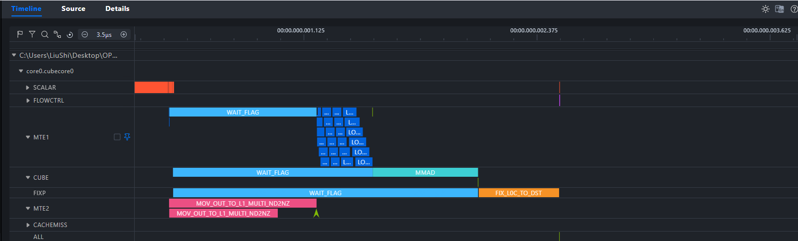
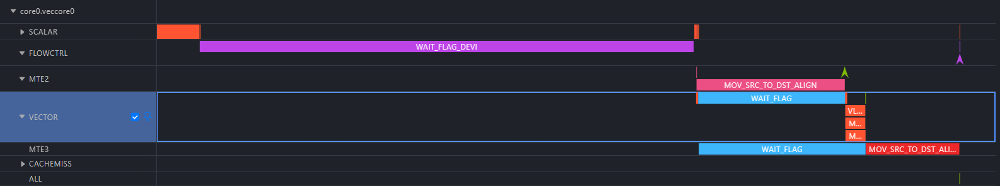
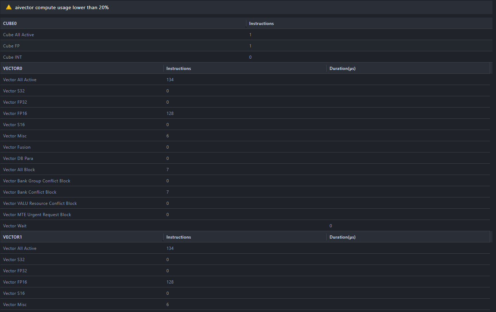
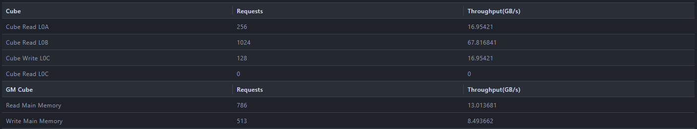
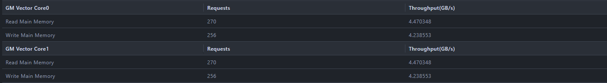
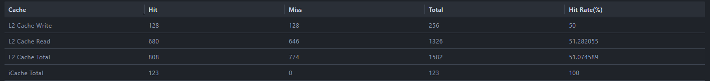
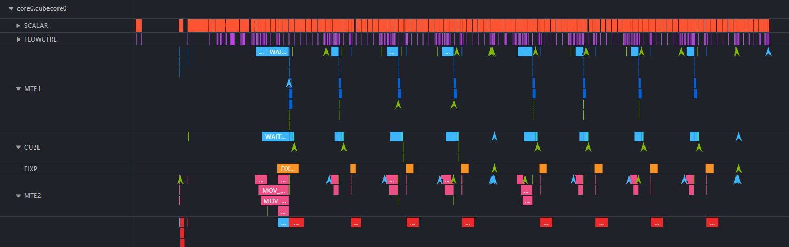
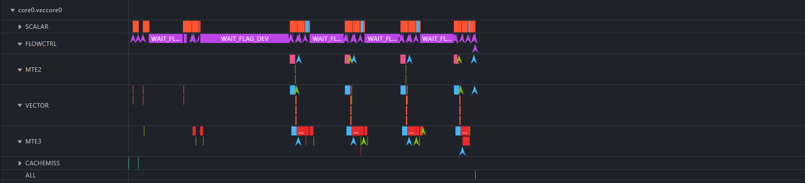
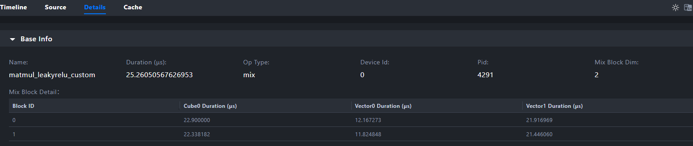
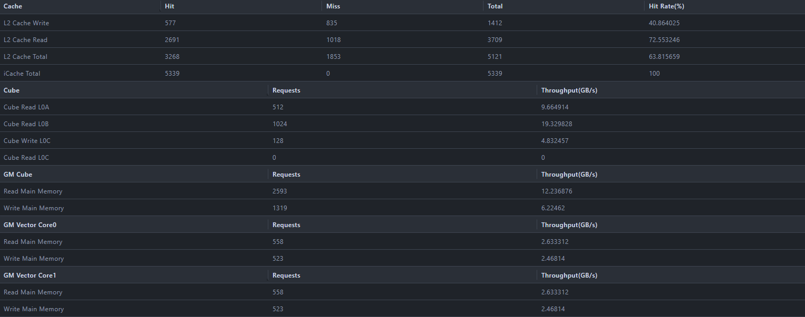

# 基于 MindStudio Insight 分析 Cube-Vector 融合算子性能

## 案例背景

在昇腾 AI 处理器中，算子融合（Operator Fusion）是一种重要的性能优化手段。通过将多个计算操作合并到单个 Kernel 中执行，可以显著减少数据在 Global Memory（GM）与 AI Core 片上缓存之间的搬运次数，降低内存带宽压力，提升整体计算效率。

常见的融合模式包括 Cube-Vector 融合（CV 融合），即将矩阵计算（Cube 单元）与向量激活计算（Vector 单元）合并为一个 Kernel。例如 Matmul + LeakyRelu、Matmul + GELU 等融合算子，计算结果无需写出到 GM 后再读回，而是通过片上数据通路直接传递给下一个计算阶段。

然而，融合算子涉及 Cube 和 Vector 两种计算单元的协同工作，以及核间同步（CrossCoreSetFlag/CrossCoreWaitFlag）机制的配合，其性能表现受多种因素影响：计算负载是否均衡、数据搬运是否隐藏、同步开销是否过大等。借助 MindStudio Insight 的算子调优功能，可以直观地可视化融合算子的计算负载和内存带宽，帮助开发者快速定位融合算子的性能瓶颈。

本案例以 Ascend C 官方示例 [MatmulLeakyRelu 融合算子](https://gitcode.com/cann/asc-devkit/tree/master/examples/01_simd_cpp_api/00_introduction/03_fusion_operation) 为例，介绍如何使用 MindStudio Insight 分析 Cube-Vector 融合算子的性能。

Ascend C 提供了两种编程风格的 MatmulLeakyRelu 融合算子实现：

- **Basic API（静态模板编程）**：开发者手写数据搬运、tiling 分块、PIPE 同步和核间通信，暴露完整的硬件细节，适合精细化调优。
- **Advanced API（Matmul 高阶 API）**：使用 `matmul::Matmul` 高阶 API 封装矩阵计算细节，配合 TQue 队列管理核间数据传递，代码更简洁，但在小规模场景下存在额外的 API 调度开销。

本案例先介绍融合算子的基本概念和分析方法论，然后分别对两种 API 版本进行 Insight 性能分析，最后基于上板实测数据给出对比和选型建议，帮助开发者理解从"会用融合"到"用好融合"的进阶路径。

## 分析方法论

融合算子性能分析建议按照以下顺序展开：

1. **编写并运行融合算子示例**：基于 Ascend C 编写融合算子，使用 msOpProf 采集硬件性能数据，同时使用 `msprof op simulator` 采集仿真追踪数据。
2. **分析算子流水图（PIPE 流水分析）**：基于仿真数据还原算子端到端流水图，识别各 PIPE（MTE2/MTE1/CUBE/FIXP/VECTOR/MTE3）的空闲区域。从而指导后续的计算负载、内存带宽、核间负载分析应该看哪里。
3. **分析计算工作负载**：带着流水图的认知，在详情界面查看 Cube、Vector 计算单元的指令分布和阻塞情况——流水图中 CUBE 空闲占比高，就重点看计算利用率为什么低；流水图中 VECTOR 空闲占比高，就重点看 Vector 核在等什么。
4. **分析内存工作负载**：带着流水图的认知，在详情界面查看内存带宽和搬运效率——流水图中 MTE2 活跃占比高，就重点看 GM 带宽是否被打满；流水图中 MTE1/FIXP 有大量等待，就重点看片上搬运是否存在同步瓶颈。
5. **分析核间负载均衡**：对比各 Block 的耗时分布，结合流水图中 CrossCoreWaitFlag 的等待时长，判断分核策略和核间同步是否合理。

## 编译运行融合算子并采集数据

### 环境准备

| 项目 | 验证环境 |
| --- | --- |
| NPU | Ascend 910C |
| CANN 版本 | 9.0.0 |
| MindStudio Insight | 26.0.0 |

- 安装 CANN 开发套件包，配置环境变量：

  ```bash
  source ${install_path}/cann/set_env.sh
  ```

- 安装 msOpProf 算子调优工具，具体步骤请参见 [msOpProf 安装指南](https://gitcode.com/Ascend/msopprof/blob/master/docs/zh/install_guide/msopprof_install_guide.md)。
- 安装 MindStudio Insight 工具，具体步骤请参见 [MindStudio Insight 安装指南](../install_guide/mindstudio_insight_install_guide.md)。

### 获取并编译示例代码

本案例使用 Ascend C 官方示例中的 MatmulLeakyRelu 融合算子，代码位于 [asc-devkit 仓库](https://gitcode.com/cann/asc-devkit)的 `examples/01_simd_cpp_api/00_introduction/03_fusion_operation/` 目录下。

两种示例均实现 Matmul 和 LeakyRelu 的 Cube-Vector 融合计算，Basic API 计算公式为：

$$C = A \times B$$
$$C_{ij} = \begin{cases} C_{ij} & \text{if } C_{ij} \geq 0 \\ C_{ij} \times 0.001 & \text{if } C_{ij} < 0 \end{cases}$$

Advanced API 在此基础上增加了 Bias 三元融合：`C = LeakyRelu(A × B + Bias)`。

A 矩阵形状为 `[M, K]`，B 矩阵形状为 `[K, N]`，输出 C 矩阵形状为 `[M, N]`。本样例中 M=512、K=128、N=128。

#### Basic API：编译与采集

Basic API 位于 `matmul_leakyrelu_basic_api/` 目录。算子采用 `__mix__(1, 2)` 核函数声明，每个逻辑核由 1 个 AIC（Cube 核）和 2 个 AIV（Vector 核）组成，Block Dim=2（总计 2 个 Cube 核 + 4 个 Vector 核）。Cube 核完成矩阵乘计算后，通过 CrossCoreSetFlag 通知 Vector 核，Vector 核从 GM 读取结果执行 LeakyRelu 激活后写回。

```bash
cd asc-devkit/examples/01_simd_cpp_api/00_introduction/03_fusion_operation/matmul_leakyrelu_basic_api

# 编译
mkdir -p build && cd build
cmake .. && make -j

# 生成测试数据
python3 ../scripts/gen_data.py

# 采集硬件性能数据（用于 Insight 详情界面分析）
msprof op --output=./prof_output ./demo

# 采集仿真追踪数据（用于 PIPE 流水图分析）
msprof op simulator ./demo
```

#### Advanced API：编译与采集

> **说明**：Advanced API 示例的默认配置为 Block Dim = 1（1 AIC + 2 AIV，核数仅为 Basic API 的一半）。为排除核数差异对性能对比的干扰，本例将 Advanced API 的 `numBlocks` 调整为 2、`SetDim` 调整为 4，与 Basic API 保持相同的 2 AIC + 4 AIV 核心数量，每个 AIV 逻辑核负责 512×32 输出区域。

Advanced API 位于 `matmul_leakyrelu_advanced_api/` 目录。与 Basic API 相比，核心架构变化为：Matmul 结果输出到 VECIN（消除 GM 中转）、增加 Bias 三元融合、输出保持 FP32 精度、N 轴分核、TQue 队列化同步。

```bash
cd asc-devkit/examples/01_simd_cpp_api/00_introduction/03_fusion_operation/matmul_leakyrelu_advanced_api

# 编译
mkdir -p build && cd build
cmake .. && make -j

# 生成测试数据
python3 ../scripts/gen_data.py

# 采集硬件性能数据（用于 Insight 详情界面分析）
msprof op --output=./prof_output ./demo

# 采集仿真追踪数据（用于 PIPE 流水图分析）
msprof op simulator ./demo
```

采集完成后，`prof_output` 目录下会生成 `visualize_data.bin` 文件，导入 MindStudio Insight 后可在详情（Details）界面查看算子基本信息、计算工作负载和内存工作负载等数据。仿真完成后会在当前目录下生成 `OPPROF_<timestamp>/simulator/` 目录，这是构建 PIPE 流水图的核心数据源。

## Basic API 

### 算子流水图分析

昇腾 AI Core 内部有多个硬件流水线（PIPE），包括：

- **MTE2**：负责 GM ↔ L1 之间的数据搬运（DataCopy）
- **MTE1**：负责 L1 ↔ L0A/L0B 之间的数据搬运（LoadData）
- **CUBE（M 流水）**：负责矩阵乘计算（Mmad）
- **FIXP（FIX 流水）**：负责 L0C → GM 的结果搬出（Fixpipe）
- **VECTOR（V 流水）**：负责向量计算（LeakyRelu 等）
- **MTE3**：负责 Vector 侧的 GM ↔ UB 数据搬运（DataCopyPad）

这些 PIPE 之间通过 SetFlag / WaitFlag 机制进行同步。**指令重排的目标是让这些 PIPE 的工作时间互相掩盖**，压缩各 PIPE 的空闲区域，从而减少端到端耗时。流水图能告诉你**每个 PIPE 在什么时刻空闲、空闲了多长时间**：

#### Cube 核流水图分析

> **说明**：本算子有 2 个逻辑 Block，每个 Block 含 1 个 Cube 核。两个 Block 执行完全相同的指令序列，耗时也几乎一致。以下分析以 **Block 0 的 Cube 核（core0.cubecore0）** 为例。

**Step 1：获取各 PIPE 的耗时**

从仿真输出的 `core0.cubecore0` 各 PIPE Tracing 中提取关键指令耗时：



| PIPE | 指令 | 耗时 (ns) | 说明 |
|:-----|:-----|:--------:|:-----|
| **MTE2** | `MOV_OUT_TO_L1_MULTI_ND2NZ` | ~580 | A 矩阵 GM→L1，ND→Nz 格式转换 |
| **MTE2** | `MOV_OUT_TO_L1_MULTI_ND2NZ` | ~790 | B 矩阵 GM→L1，ND→Nz 格式转换 |
| **MTE1** | `LOAD_2D` × 16 (L1→L0A) | ~770 | 16 块 A 矩阵分形，每块约 50ns |
| **MTE1** | `LOAD_2D` × 8 (L1→L0B) | ~740 | 8 块 B 矩阵分形，每块约 90ns（含转置 Nz→Zn） |
| **CUBE** | `MMAD` | ~560 | 矩阵乘加：256×128×128，fp16→fp32 |
| **FIXP** | `FIX_L0C_TO_DST` | ~430 | L0C→GM，Nz→ND + fp32→fp16 |
| **FIXP** | `SET_CROSS_CORE` | ~2 | 核间同步通知 Vector 核 |

凭各PIPE的活跃指令耗时就能看出：MTE2搬运数据（合计~1370ns）比CUBE计算（~560ns）多了一倍以上，FIXP的Fixpipe（~430ns）反而是所有活跃工作中最短的。MTE2搬完MTE1才能搬，MTE1搬完CUBE才能算，CUBE算完FIXP才能写。没有一个PIPE在工作时其他PIPE可以被利用，具有指令重排的空间。**Cube 核流水图核心结论**：

1. **所有PIPE严格串行工作**：MTE2 → MTE1 → CUBE → FIXP，没有任何两个 PIPE 在同一时刻活跃。端到端的~2600ns完全是各阶段时长累加。
2. **CUBE是本问题规模下的计算瓶颈**：Mmad仅~560ns，算力远未用满。但CUBE前面的~1000ns等待无法消除——这是MTE1搬运数据的刚性开销。
3. **FIXP有最大的空闲气泡**：~1640ns的等待，远超Fixpipe自身的~430ns。这为后续"Mmad与Fixpipe细粒度并行"的指令重排提供了明确方向。
4. **MTE2是最繁忙的PIPE**：DataCopy A + B 共~1370ns（~50%），说明这个融合算子的Cube侧实际上是**搬运密集型**而非计算密集型，数据搬运耗时远大于计算。

#### Vector 核流水图分析

> **说明**：每个 Block 含 2 个 Vector 核（`veccore0` 和 `veccore1`），它们平分一个 Cube 核的输出结果——`veccore0` 通过 `GetBlockIdx() % 2 * (baseM / 2 * N)` 偏移读取前半块结果，`veccore1` 读取后半块。两个 Vector 核执行完全相同的指令序列，仅在 GM 偏移地址上不同（`veccore0` 偏移 0，`veccore1` 偏移 0x8000），耗时几乎一致（Block 0 中 veccore0 耗时 4023ns、veccore1 耗时 4288ns）。以下分析以 **Block 0 的 Vector 核 0（core0.veccore0）** 为例。

从仿真输出的 `core0.veccore0` 各 PIPE Tracing 中提取关键指令耗时：



**各 PIPE 活跃指令**：

| PIPE | 指令 | 耗时 (ns) | 说明 |
|:-----|:-----|:--------:|:-----|
| **FLOWCTRL** | `WAIT_FLAG_DEVI` (CrossCoreWaitFlag) | ~2100 | 等待 Cube 核 CrossCoreSetFlag |
| **MTE2** | `MOV_SRC_TO_DST_ALIGN` (GM→UB) | ~630 | 读取半块 Matmul 结果到 UB |
| **VECTOR** | `VLRELU` (LeakyRelu) | ~80 | 向量激活计算 |
| **MTE3** | `MOV_SRC_TO_DST_ALIGN` (UB→GM) | ~400 | 激活结果写回 GM |

CrossCoreWaitFlag是LeakyRelu计算（80ns）的**26 倍**。换句话说，Vector核花在"等Cube核"上的时间，足够它执行26次LeakyRelu。这说明Vector核的大部分时间都在空等,优化空间非常有限。**Vector 核流水图核心结论**：

1. **CrossCoreWaitFlag占比大**：Vector核总耗时~4000ns中，~2100ns在等待Cube核完成。Vector核的瓶颈不在自身，而在Cube侧的产出速度。这意味着优化Vector核意义有限——除非减少Cube核的产出延迟。
2. **VECTOR 计算占比低**：LeakyRelu计算仅~80ns。Vector侧确实吃不饱。
3. **Vector 核也是纯串行**：CrossCoreWaitFlag → MTE2 → VECTOR → MTE3，没有任何并行。

### 计算工作负载分析

> **从流水图到这里**：流水图告诉我们Cube核空闲、Vector核占比低。接下来在 Insight 详情界面看计算工作负载（Compute Workload Analysis），验证各计算单元的指令分布和阻塞情况。

在 MindStudio Insight 中导入步骤一采集的 `visualize_data.bin` 文件（具体操作请参见 [导入数据](../user_guide/basic_operations.md#导入数据)），进入详情（Details）界面查看：



在详情界面中，Base Info 区域展示算子基本信息，Mix Block Detail 展示各核耗时分布：

- **Mix Block Dim = 2**：表示共 2 个逻辑 Block，与 `__mix__(1, 2)` 声明一致（每个 Block 含 1 个 AIC + 2 个 AIV），总计 2 个 Cube 核 + 4 个 Vector 核。

计算负载分析面板中各指标与流水图的对应关系：

- **顶部提示**：若出现 "compute usage lower than 20%" 等提示，说明对应计算单元利用率偏低。从流水图已知这个提示在意料之中。
- **Cube 核指令分布**：融合算子中 Cube 核负责矩阵乘，流水图显示只有 1 条 Mmad 指令（~560ns）。面板上的 Cube All Active / Cube FP 计数应该很小——这与流水图中小问题规模（M=512, K=128, N=128）导致的单次 Mmad 完成全部矩阵乘一致。
- **Vector 核指令分布**：流水图显示 VECTOR 仅有 1 条 VLRELU（80ns）。面板上的 Vector FP16 应占主要比例（128 条 FP16 指令），Misc 类指令来自 SetFlag、MOVEMASK 等同步和配置操作——流水图中 VECTOR 的 BAR、SET_FLAG 指令证实了这些开销。
- **阻塞/停顿指标**：Vector All Block 表示 Vector 核的总阻塞次数，Vector Wait 表示等待数据/同步的空闲时间。从流水图已知 VECTOR 的 WAIT_FLAG 等待了 MTE2 630ns，面板上的 Vector Wait 数值可以与此交叉验证。

在 `__mix__(1, 2)` 模式下，2 个 Vector 核平分一个 Cube 核的输出结果。可对比 Cube 核和 Vector 核的指令数/耗时：如果 Vector 核的指令数远多于 Cube 核但总体利用率仍偏低，说明 Vector 侧的计算量不足以匹配 Cube 侧的计算产出，可能存在 Vector 核空闲等待的情况——流水图已经精确量化了这个等待：CrossCoreWaitFlag = 2100ns。

> **为什么 MatmulLeakyRelu 融合算子会出现 "compute usage lower than 20%"？**
>
> 以本案例为例，Cube 核仅执行 1 条 Mmad 指令完成整个矩阵乘（512×128×128，约 1677 万次 MAC），耗时约 560ns。而每个 Vector 核只处理 256×128 = 32,768 个元素的 LeakyRelu（每个元素 1 次比较 + 最多 1 次乘法，约 6.5 万次操作），用 128 条 FP16 指令即可完成，实际计算时间仅 80ns。
>
> Vector 核约 4000ns 的耗时中，大部分时间花在：
>
> - **等待 Cube 核**：CrossCoreWaitFlag 阻塞等待 Cube 核 Fixpipe 写回完成（流水图量化：2100ns）
> - **数据搬运**：DataCopyPad 从 GM 读取 Cube 结果（流水图量化：MTE2 630ns）和写回结果（流水图量化：MTE3 400ns）
> - **存储冲突**：数据中 Vector Bank Conflict Block = 7，说明 UB 访问存在存储体冲突
>
> 简而言之，**Matmul 的计算量是 LeakyRelu 的 256 倍，Vector 侧"吃不饱"是正常的**。融合的核心收益是省去 GM 中转，而不是让 Vector 核跑满。

### 内存工作负载分析

> **从流水图到这里**：流水图告诉我们 Cube 核 MTE2 活跃 52.1%（最繁忙 PIPE）、FIXP 有 1640ns 的等待气泡。接下来在 Insight 详情界面看内存工作负载（Memory Workload Analysis），验证 DDR 带宽使用和 L2 Cache 命中情况，确认"MTE2 的 52.1% 活跃是否意味着 DDR 带宽饱和"。

#### Cube 核内存带宽



| 指标 | 值 | 与流水图的对应关系 |
|------|------|------|
| Cube Read L0A | 16.95 GB/s | 对应 MTE1 的 16 条 LOAD_2D（L1→L0A, ~770ns） |
| Cube Read L0B | 67.82 GB/s | 对应 MTE1 的 8 条 LOAD_2D（L1→L0B, ~740ns，含 Nz→Zn 转置） |
| Cube Write L0C | 16.95 GB/s | 对应 CUBE 的 MMAD（L0C 写入, 560ns） |
| Read Main Memory | 13.01 GB/s | 对应 MTE2 的 DataCopy A+B（GM→L1, 1370ns） |
| Write Main Memory | 8.49 GB/s | 对应 FIXP 的 FIX_L0C_TO_DST（L0C→GM, 430ns） |

#### Vector 核内存带宽



| 指标 | 值 | 与流水图的对应关系 |
|------|------|------|
| Read Main Memory | 4.47 GB/s | 对应 MTE2 的 MOV_SRC_TO_DST_ALIGN（GM→UB, 630ns） |
| Write Main Memory | 4.24 GB/s | 对应 MTE3 的 MOV_SRC_TO_DST_ALIGN（UB→GM, 400ns） |

#### L2 Cache 命中率



| Cache | Hit | Miss | Total | Hit Rate |
|------|:---:|:---:|:---:|:---:|
| L2 Cache Write | 128 | 128 | 256 | 50% |
| L2 Cache Read | 680 | 646 | 1,326 | 51.28% |
| L2 Cache Total | 808 | 774 | 1,582 | 51.07% |
| iCache Total | 123 | 0 | 123 | 100%

#### 分析要点

- **Cube 核 DDR 读写均衡**：DDR 读 13.01 GB/s（对应流水图中 MTE2 最繁忙的 PIPE，活跃 1370ns）、写 8.49 GB/s（对应流水图中 FIXP 活跃 430ns）。L0B 读带宽（67.82 GB/s）显著高于其他通道，这是因为 B 矩阵在 MTE1 的 LoadData 阶段需要转置（Nz→Zn），产生了额外的片上搬运开销。
- **Vector 核 DDR 读写对称**：DDR 读 4.47 GB/s、写 4.24 GB/s，读写对称且带宽较低，说明 Vector 核的数据搬运量较小（每个核仅处理 32 KB 数据），与流水图中 MTE2 630ns + MTE3 400ns 一致。
- **L2 Cache 命中率反映融合数据复用**：L2 Cache 总命中率 51.07%，其中写命中率 50%、读命中率 51.28%。这个聚合值混合了 Cube 核和 Vector 核的访问模式——Cube 核访问 A/B 矩阵数据量大且为顺序访问，命中率低；Vector 核处理的数据量小且 Cube 核刚写入的数据仍在 Cache 中，命中率接近 100%。这体现了融合算子的优势：**Cube 核写回的结果被 Vector 核直接从 L2 Cache 读取，避免了 GM 往返**。从流水图的角度看，Cube 核的 Fixpipe（FIXP）写 GM 后，数据在 L2 Cache 中驻留，Vector 核的 MTE2（DataCopyPad 读 GM）可以直接从 Cache 命中，减少了 DDR 访问延迟——这就是 51.07% 命中率背后的 PIPE 级原因。iCache 命中率 100%，说明指令缓存无缺失。

### 核间负载分析

> **从流水图到这里**：流水图告诉我们 Vector 核的 CrossCoreWaitFlag 占了 2100ns（52.4%），Vector 核的总耗时 4010ns 远大于 Cube 核的 2630ns。接下来在 Insight 详情界面看 Mix Block Detail 面板，验证各核的耗时差异和负载均衡情况。

在详情界面中查看各 Core（Block）的耗时分布：

- 如果各 Block 的执行时间接近，说明分核策略合理，负载均衡。
- 如果某些 Block 的执行时间明显长于其他 Block，说明存在负载不均，需检查分核逻辑（例如 M 方向分核时 M 是否能被 singleCoreM 整除）。

对于融合算子，还需关注 Cube 核和 Vector 核之间的协同情况：Vector 核等待 Cube 核 CrossCoreSetFlag 的时间是否过长，是否存在 Vector 核"等数据"的空闲时间——流水图已经精确量化了这个等待。

> 本案例中 Block Dim = 2、Mix Block Dim = 4，对应 2 个逻辑 Block（每个含 1 个 Cube 核 + 2 个 Vector 核），总计 2 个 Cube 核 + 4 个 Vector 核。
>
> 从 Mix Block Detail 表格可读出各核耗时：
>
> | Block | Cube0 耗时 | Vector0 耗时 | Vector1 耗时 |
> |:-----:|:----------:|:------------:|:------------:|
> | 0 | 3202ns | 4023ns | 4288ns |
> | 1 | 3165ns | 4125ns | 3923ns |
>
> 结合流水图数据交叉验证：
>
> - **Block 间负载均衡**：Block 0 和 Block 1 的 Cube 核耗时接近（~3202ns ≈ 流水图的 2630ns），Vector 核耗时也接近（~4023ns ≈ 流水图的 4010ns），说明 M 方向分核均匀，负载均衡良好。
> - **Cube 与 Vector 核内差异**：每个 Block 内 Cube 核（~3200ns）明显短于 Vector 核（~4000ns），差值约 800ns。从流水图看，这个差值的来源是：**Vector 核需要等待 Cube 核 Fixpipe 完成后才能开始**（CrossCoreWaitFlag = 2100ns），而且 Vector 核自己的 MTE2+VLRELU+MTE3 串行执行（共 1110ns）也需要时间。Cube 核总时间 2630ns 与 Vector 核的 CrossCoreWaitFlag 启动时间（CrossCoreSetFlag 发生在 Cube 核流水图的末端）加上 Vector 核自身执行时间大致吻合。
> - **Vector 核间差异**：同一 Block 内 Vector0 和 Vector1 耗时接近，说明两个 Vector 核平分 Cube 输出结果的分块策略合理——流水图中 Vector0（blockIdx%2=0）和 Vector1（blockIdx%2=1）的 GM 偏移不同但执行指令相同。
>
> 如果核数增加到 4 或 8，M 方向分得更细，singleCoreM 变小，每个核处理的元素数减少，搬运占比会进一步升高，需关注分核粒度是否过细导致搬运开销超过计算收益。

### 分析小结

通过以上四个维度的分析，对 Basic API 实现的 MatmulLeakyRelu 融合算子性能瓶颈形成以下清单：

- **流水图**：所有PIPE严格串行，无并行掩盖；Vector核~52.4%时间在等待 Cube 核（CrossCoreWaitFlag=2100ns）；MTE2 是最繁忙的 PIPE
- **计算负载**：CUBE 和 VECTOR 利用率极低（M=512, K=128, N=128 问题规模太小）
- **内存负载**：数据经 GM 中转（FIXP 写 GM + MTE2 读 GM，合计 1060ns）；L2 Cache 有融合数据复用但 Cube 侧命中率仅 ~10%
- **核间负载**：Block 间负载均衡良好；Cube 核与 Vector 核耗时差 ~800ns，核间同步等待是最大瓶颈

## Advanced API 

Advanced API 使用 Matmul 高阶 API 封装矩阵乘计算，相比 Basic API 实现了 6 个方向的架构变化：

1. 消除 GM 中转——Matmul 结果输出到 VECIN（片上）
2. 三元融合——增加 Bias 加法
3. 全精度输出——保持 FP32 精度
4. N 轴分核——SetDim(4) 将 N 轴切分 4 份（singleCoreN=32）
5. 队列化同步——TQue 替代 CrossCoreSetFlag/WaitFlag
6. 动态 Tiling——运行时通过 `MultiCoreMatmulTiling` 自动计算分块和分核策略

### 流水图分析

以下数据均来自 `msprof op simulator` 仿真追踪结果，与步骤二中 Basic API 的仿真流水图分析保持相同数据源，便于对比。

#### Cube 核流水图分析

**Advanced API Cube 核**（core0.cubecore0）仿真数据：



**关键指令时序**（8 次 Iterate，每次处理 baseM×baseN×baseK = 128×32×128）：

| PIPE | 关键指令 | 耗时 | 说明 |
|:-----|:-----|:--------:|:-----|
| **MTE2** | `MOV_OUT_TO_L1_MULTI_ND2NZ` 等 | 7.64 μs | Matmul API 内部 A/B/Bias 矩阵 GM→L1：A 8×375ns（128×128 half）、B 8×371ns（128×32 half）、Bias 2×835ns |
| **MTE1** | `LOAD_L1_TO_DST_3DV2`（L1→L0A/L0B） | 1.75 μs | 16 次加载：L0A 8×92ns + L0B 8×126ns，每 tile 加载 A/B 分形 |
| **CUBE** | `MMAD` × 8 次 | 0.64 μs | 每次 128×32×128（约 80ns），总计算量为 Basic API 单次 256×128×128 的一半 |
| **FIXP** | `FIX_L0C_TO_DST`（L0C→**VECIN**） | 2.80 μs | 8 次 Fixpipe 写入片上 VECIN（每 call 350ns, 128×32 float=16KB），消除 GM 写回的格式转换开销 |
| **MTE3** | `MOV_L1_TO_OUT` ×25 | 7.04 μs | Matmul API 内部 L1→GM 搬出：8 次主循环（3.88μs）+ 17 次内部管理（3.16μs） |
| **SCALAR** | API 调度 + 迭代控制 | ~83.17 μs | Matmul 高阶 API 的调度开销，包括 1742 次 LD/ST 地址计算、tiling 遍历、队列管理等 |

**Cube 核流水图核心结论**：

1. **FIXP 目标从 GM 变为 VECIN，且单次数据量减半**：Basic API 的 Fixpipe 写 L0C→GM（需 float→half + Nz→ND），Advanced API 的 Fixpipe 写 L0C→VECIN（片上），消除了类型和格式转换。配合 baseN 从 64 降至 32，单次 Fixpipe 数据量从 32KB 降至 16KB，FIXP 总耗时从 7.50μs 降至 2.80μs（↓63%）。
2. **MMAD 细粒度化且计算量减半**：1 条大 MMAD（Basic API 256×128×128, 560ns）→ 8 条小 MMAD（128×32×128, 80ns/call）。每个 Cube 核的 MMAD 总计算量从 Basic API 的 256×128×128 降至 8×128×32×128（等价的 work 但分给 2 个 Cube 核）。
3. **SCALAR 单元仍是绝对瓶颈**：Matmul 高阶 API 的 tiling 调度、迭代控制、队列管理等开销占 Cube 核时间的 ~97%（CUBE 仅 ~0.5%）。SCALAR 耗时高达 83.17 μs——SetDim(4) 虽然每 Iterate 数据量减半，但 tiling API 的调度复杂度增加，SCALAR 固定开销极高。这是 Advanced API 在小规模场景下性能不如 Basic API 的根因——**固定开销远大于计算收益**。

#### Vector 核流水图分析

**Advanced API Vector 核**（core0.veccore0）仿真数据：



**关键指令时序**：

| PIPE | 关键指令 | 耗时 | 说明 |
|:-----|:-----|:--------:|:-----|
| **FLOWCTRL** | `WAIT_FLAG_DEV` × 4 次 | 8.02 μs | **CrossCoreWaitFlag 已消除**，改为硬件队列同步等待 VECIN 数据就绪（每 Iterate ~2.0μs） |
| **MTE2** | `MOV_OUT_TO_UB`（**VECIN**→UB） | 0.89 μs | 数据来源从 GM 变为片上 VECIN，每 Iterate 搬运 128×32 float=16KB（~222ns/call） |
| **VECTOR** | `VLRELU` × 4 次 | 0.19 μs | 4 次 Iterate 的 LeakyRelu（单次 ~48ns，4096 个 float 元素），计算量随 singleCoreN 减半 |
| **MTE3** | `MOV_UB_TO_OUT`（UB→GM） | 2.85 μs | FP32 输出写回，13 次 DataCopy（4 次主循环写回 + 9 次内部管理），每核总输出 64KB |
| **SCALAR** | 调度 + 等待 | ~11.75 μs | 队列管理和同步等待等 Scalar 操作 |

**Vector 核流水图核心结论**：

1. **CrossCoreWaitFlag 完全消除，改为 WAIT_FLAG_DEV**：这是最大的架构收益。Vector 核不再阻塞等待 Cube 核 Fixpipe 写 GM，改为硬件队列同步等待 VECIN 数据就绪。WAIT_FLAG_DEV 耗时 8.02μs（4 个 Iterate），对应 Cube 核每次 Iterate 完成 FIXP 写 VECIN 后的数据到达延迟。
2. **MTE2 搬运量减半**：数据来源从外部 DDR（Basic API 的 GM→UB）变为片上 VECIN（Advanced API 的 VECIN→UB）。配合 singleCoreN 从 64 降至 32，每 Iterate 搬运量从 32KB 降至 16KB，MTE2 总耗时从 1.09μs 降至 0.89μs。
3. **VECTOR 计算占比仍极低**：VLRELU 4 次合计 ~0.19μs（占总时间 ~0.6%），每 Iterate 处理 4096 个 float 元素。LeakyRelu 逐元素计算量小这一固有特征未变。
4. **MTE3 写回量随 singleCoreN 减半**：每核输出从 512×64×4=128KB 降至 512×32×4=64KB，MTE3 耗时从 2.89μs 略降至 2.85μs。

### 计算工作负载分析

导入 Advanced API 的 `visualize_data.bin` 文件进入 Insight 详情界面，观察以下指标：



- **Mix Block Dim = 2**：Block Dim=2，总计 2 个 Cube 核 + 4 个 Vector 核，与 Basic API 核数一致，消除了核数差异的干扰
- **Task Duration ~25.26 μs**：约为 Basic API（7.04 μs）的 3.6 倍，主要膨胀来自 Cube 核 SCALAR 单元的 API 调度开销，在同等核数下 tiling 调度的固定开销无法被摊薄

#### 核间负载分析

在详情界面的 Mix Block Detail 面板中查看 2 个 Block 内 6 个核的耗时分布：

- **Cube 核耗时**：Block 0 Cube 核 22.90 μs，Block 1 Cube 核 22.34 μs。两个 Cube 核耗时接近（差值仅 ~0.56 μs），**负载均衡良好**。主要时间消耗在 Matmul API 的 Scalar 调度（SCALAR 活跃占比 ~87–89%）
- **Vector0 耗时**：Block 0 Vector0 12.17 μs，Block 1 Vector0 11.82 μs。两个 Vector0 耗时接近，以等待 WAIT_FLAG_DEV（wait_id0 ~7.0–7.3 μs）和 MTE3 写回为主
- **Vector1 耗时**：Block 0 Vector1 21.92 μs，Block 1 Vector1 21.45 μs。两个 Vector1 耗时接近但**远长于 Vector0**。Vector1 的主要等待为 WAIT_FLAG_DEVI（wait_id1 ~17 μs），说明同一 Block 内两个 Vector 核等待不同的事件完成

**Vector0 与 Vector1 耗时不均的分析**：

N 轴 4 核分片下，`singleCoreN = 32`，Block 0 的 2 个 Vector 核分别处理 C 矩阵的列 [0, 32) 和 [32, 64)；Block 1 的 2 个 Vector 核分别处理列 [64, 96) 和 [96, 128)。Matmul 高阶 API 的 tiling 内部按 N 轴分核后，**各 Vector 核发起 Iterate 的时序不同**——后发起的 Vector1 需要等待前置 Iterate 释放 tiling 资源，表现为 `WAIT_FLAG_DEVI`（wait_id1 ~17 μs）等待时间远长于 Vector0 的 `WAIT_FLAG_DEV`（wait_id0 ~7 μs）。

### 内存工作负载分析

导入上板数据后，在内存工作负载面板中观察关键变化：



- **Cube 核 GM 带宽**：DDR 读 ~12.2 GB/s，DDR 写 ~6.2 GB/s。
- **Vector 核 GM 带宽**：DDR 读 ~2.6 GB/s（VECIN→UB, float），DDR 写 ~2.5 GB/s（UB→GM, float）。
- **L2 Cache 命中率**：整体命中率较 Basic API 有所提升，tile-based 迭代的数据复用减少了重复的 GM 访问。Vector 核因 VECIN 片上通路绕过 L2 Cache，相关计量与 Basic API 的 GM 路径不具有直接可比性。

## 上板数据对比

### 端到端耗时对比

| 指标 | Basic API | Advanced API | 差异 |
|------|:--------:|:--------:|:----:|
| **Task Duration (μs)** | 7.04 | 25.26 | ↑ 3.6× |
| Block Dim / Mix Block Dim | 2 / 4 | 2 / 4 | 核数相同 |
| Cube 核耗时 (μs) | 3.09–3.13 | 22.34–22.90 | ↑ 7.2× |
| Vector 核耗时 (μs) | 4.11–4.22 | 11.82–12.17 / 21.45–21.92 | ↑ 2.8×–5.2× |

**解读**：Advanced API 端到端耗时是 Basic API 的 3.6 倍，在同等核数（2 Cube + 4 Vector）下差距仍然显著。核数对齐后，剩余差距全部来自 Matmul 高阶 API 的 SCALAR 固定开销（SCALAR 活跃占比 ~87–89%）——这是 Advanced API 在小规模场景下的结构性代价。

### PIPE 流水利用率对比

| PIPE 指标 | Basic API | Advanced API | 变化 |
|------|:--------:|:--------:|:----:|
| AIC CUBE 活跃占比 | 9.2% | 3.3% | ↓ API 调度挤占，baseN 减半导致单次 MMAD 更短 |
| AIC MTE2 活跃占比 | 14.6%–16.1% | 15.5%–17.4% | ≈ 细粒度 tile 搬运占比基本持平 |
| AIC FIXP 活跃占比 | 6.8%–7.1%（写 GM） | 11.7%–13.6%（写 VECIN） | ↑ baseN 减半后数据量降，但写 VECIN 路径占比上升 |
| AIC SCALAR 活跃占比 | 43.4%–43.9% | **87.2%–89.2%** | ↑↑ API 固有开销 |
| AIV VEC 活跃占比 | 1.6% | 1.1% | ≈ 计算占比始终很低，baseN 减半进一步降低 |
| AIV MTE2 活跃占比 | 7.7%–8.1% | 2.8%–2.9% | ↓ VECIN 路径延迟更低，单核数据量 64KB（减半） |
| AIV MTE3 活跃占比 | 6.0%–6.5% | 10.6%–12.8% | ↑↑ FP32 输出写回（float vs half）占比显著更大 |
| AIV 同步等待 | 2.7–2.9 μs CrossCoreWaitFlag | **7.0–17.0 μs** WAIT_FLAG_DEV/DEVI | ↑ 等待时间增加（队列管道同步替代核间同步的代价） |

**解读**：CrossCoreWaitFlag 从核间同步变为硬件队列同步（WAIT_FLAG_DEV/DEVI），消除了跨核依赖但引入了新的等待模式。SCALAR 占比高达 87–89%，远超 Basic API 的 43%，Matmul 高阶 API 在小规模下"调度密集型"的特征未变。

### 精度与数据量对比

| 指标 | Basic API | Advanced API | 说明 |
|------|:--------:|:--------:|:----:|
| 融合算子组合 | Matmul + LeakyRelu | Matmul + Bias + LeakyRelu | 三元融合 |
| 输出精度 | **FP16** | **FP32** | 精度翻倍 |
| MMAD 条数 × 核数 | 1 × 2 = 2 条 | 8 × 2 = 16 条 | 细粒度迭代 × 双核 |
| Cube FOPS (per core) | 8,192 | 73,728 | 计算总量等价（128×32×128 需更多指令） |
| GM→L1 数据量 (KB/核) | 96 | 298 | 3× tile 复用搬运 |
| L0C 输出路径 | → GM (64 KB) | → **VECIN** (128 KB) | 片上通路，baseN 减半后数据量同步下降 |
| VECIN→UB / GM→UB (KB/核) | 32 (half) | 64 (float) | FP32 数据量翻倍（但 baseN 减半抵消了部分） |
| UB→GM 写回 (KB/核) | 32 (half) | 65.1 (float) | FP32 输出精度翻倍 |

### 为什么 Advanced API 端到端更慢？

对于 M=512、K=128、N=128 的问题规模，Advanced API（2 Cube + 4 Vector 配置）端到端耗时是 Basic API 的 3.6 倍（25.26 μs vs 7.04 μs），主要原因有两点：

**1. Matmul 高阶 API 的固定开销**

Advanced API 的 SCALAR 单元活跃占比高达 87.2%–89.2%（Basic API 的 SCALAR 占比仅 43.4%–43.9%），主因是：

- **TQue 队列管理**：每次 Iterate 的 `EnQue`/`DeQue` 需要 Scalar 核协调，4 个 Iterate × 2 Block 共产生大量队列操作
- **动态 Tiling 调度**：`MultiCoreMatmulTiling` 在每次 Iterate 中都需要计算 tile 范围、检查边界条件，SetDim(4) 增加了分核判断的复杂度
- **Bias 融合**：`EnableBias(true)` 增加了 Scalar 核的分支判断和数据准备开销
- **N 轴分核地址计算**：B/C/Bias 矩阵的 `nCoreOffset` 偏移计算在热路径中，4 核分片使地址计算逻辑更复杂

Cube 核 22+ μs 的总时间中，实际 CUBE 计算仅 ~0.83 μs（3.3%），**开销是计算的 27 倍**。两核并行之下，SCALAR 调度开销成为端到端耗时膨胀的决定性因素——**API 抽象层的固定开销（~20+ μs / Cube 核）是常数，不随矩阵规模变化**，在小规模下无法被摊薄。

**2. Vector 核加入了新的同步等待**

Advanced API 用 TQue 队列同步替代了 Basic API 的 CrossCoreWaitFlag（2.7–2.9 μs），消除了跨核阻塞。但代价是引入了两种不同级别的等待：

- **WAIT_FLAG_DEV**（Vector0, ~7.0–7.3 μs）：等待 Cube 核将 Matmul 中间结果写入 VECIN
- **WAIT_FLAG_DEVI**（Vector1, ~16.9–17.0 μs）：等待 Matmul tiling 内部释放迭代资源，因为 Vector1 负责的 N 轴分片后启动

Vector0（~12 μs）和 Vector1（~21.5 μs）之间的 ~9 μs 差距说明 SetDim(4) 的 N 轴分片导致同 Block 内两个 Vector 核的流水线启动时序不同——这是 N 轴分核的固有特征，分核数越多，后启动的核等待时间越长。

**3. 问题规模太小**

512×128×128 仅约 1677 万次 MAC（约 8.4 GFLOPS），对 AI Core 来说是一个极小的计算量。Matmul 高阶 API 的设计目标是大规模矩阵的 tile-based 迭代——当矩阵规模达到数千甚至数万时，API 的固定开销被摊薄，迭代计算才是主导时间。在同核数条件下，Advanced API 的 3.6 倍耗时在 512 规模下是合理的，因为 **API 抽象层的固定开销（~20+ μs / Cube 核）是常数，不随矩阵规模变化**。

## 选型建议

基于以上分析和实测数据，对不同应用场景给出选择建议：

| 维度 | 推荐 Basic API | 推荐 Advanced API |
|------|:-------------|:-------------|
| **矩阵规模** | M/N/K < 1024 的小矩阵 | M/N/K ≥ 1024 的中大矩阵 |
| **精度需求** | FP16 输出可接受，对中间精度不敏感 | 需要 FP32 全精度输出，或后续算子是 FP32 |
| **融合算子数** | 两元融合（Matmul+Act） | 三元及以上融合（+Bias,+GELU 等），扩展性好 |
| **开发效率** | 有精细调优需求，时间充足 | 快速原型验证，代码量少 |
| **可维护性** | 固定规模，无跨架构需求 | 需要跨 NPU 架构移植（`#if __NPU_ARCH__` 成本高） |
| **核间同步** | 接受手写 CrossCoreSetFlag/WaitFlag | 使用 TQue 自动管理，减少出错风险 |
| **分核粒度** | 需精细控制 M 轴分核策略 | 自动分核（`SetDim`），运行时 Tiling 灵活调整 |
| **可扩展性** | 需手动添加新的融合操作（重写 tiling） | 在 Matmul 输出后按 Pipeline 添加新 Stage |

## 总结

本案例以 MatmulLeakyRelu 融合算子为例，完整演示了 **"基础分析 → 优化探索 → 对比验证 → 选型指导"** 的算子性能分析路径，全部基于 MindStudio Insight 的性能数据展开：

1. **基础分析阶段（Basic API + Insight）**：基于 PIPE 流水图、计算负载、内存带宽和核间负载四个维度，系统剖析了 Basic API 实现的性能特征。流水图精确量化了各 PIPE 的活跃/空闲分布，揭示了 **GM 中转**（FIXP 430ns + MTE2 630ns = 1060ns）和 **CrossCoreWaitFlag 等待**（2100ns，占 52.4%）是两大核心瓶颈。

2. **优化探索阶段**：从分析结果中提炼出 6 个优化方向——消除 GM 中转（VECIN）、增加 Bias 融合、保持 FP32 精度、N 轴分核、TQue 队列化同步、动态 Tiling。这些优化方向在 Advanced API 中得到了不同程度的实现。

3. **对比验证阶段**：对两种 API 分别采集仿真数据和上板数据，从 PIPE 利用率、计算精度、L2 Cache 命中率、端到端耗时四个维度进行了全面对比。仿真数据证实了架构优化的有效性（CrossCoreWaitFlag 消除为 WAIT_FLAG_DEV、L2 Cache 命中率提升至 55–86% 的 tile 复用优势、VECIN 片上通路消除 GM 中转），但上板数据也客观呈现了 Advanced API 在小规模场景下的性能劣势（SCALAR 占比 ~88%，端到端耗时比 Basic 多 3.6×，Vector 核间等待不均在 N 轴分片下引入了新的同步代价）。

4. **选型指导阶段**：综合分析了矩阵规模、精度需求、开发效率等 7 个维度的选型考量，给出了明确的使用建议——小矩阵调试用 Basic API，大矩阵生产用 Advanced API。

两个示例的完整代码和详细说明，请参见 Ascend C 官方示例仓库：

- [MatmulLeakyRelu Basic API 示例](https://gitcode.com/cann/asc-devkit/tree/master/examples/01_simd_cpp_api/00_introduction/03_fusion_operation/matmul_leakyrelu_basic_api)
- [MatmulLeakyRelu Advanced API 示例](https://gitcode.com/cann/asc-devkit/tree/master/examples/01_simd_cpp_api/00_introduction/03_fusion_operation/matmul_leakyrelu_advanced_api)

## 参考信息

- [算子调优](../user_guide/operator_tuning.md)
- [Ascend C MatmulLeakyRelu 融合算子示例（Basic API）](https://gitcode.com/cann/asc-devkit/tree/master/examples/01_simd_cpp_api/00_introduction/03_fusion_operation/matmul_leakyrelu_basic_api)
- [Ascend C MatmulLeakyRelu 融合算子示例（Advanced API）](https://gitcode.com/cann/asc-devkit/tree/master/examples/01_simd_cpp_api/00_introduction/03_fusion_operation/matmul_leakyrelu_advanced_api)
- [Ascend C 融合算子编程指南（CV 融合）](https://gitcode.com/cann/asc-devkit/tree/master/docs/guide/算子实践参考/SIMD算子实现/融合算子编程/CV融合)
- [msOpProf 用户指南](https://gitcode.com/Ascend/msopprof/blob/master/docs/zh/user_guide/msopprof_user_guide.md)
- [CANN 商用版 Profiling 数据采集指南](https://www.hiascend.com/document/detail/zh/canncommercial/82RC1/devaids/Profilling/atlasprofiling_16_0010.html)
