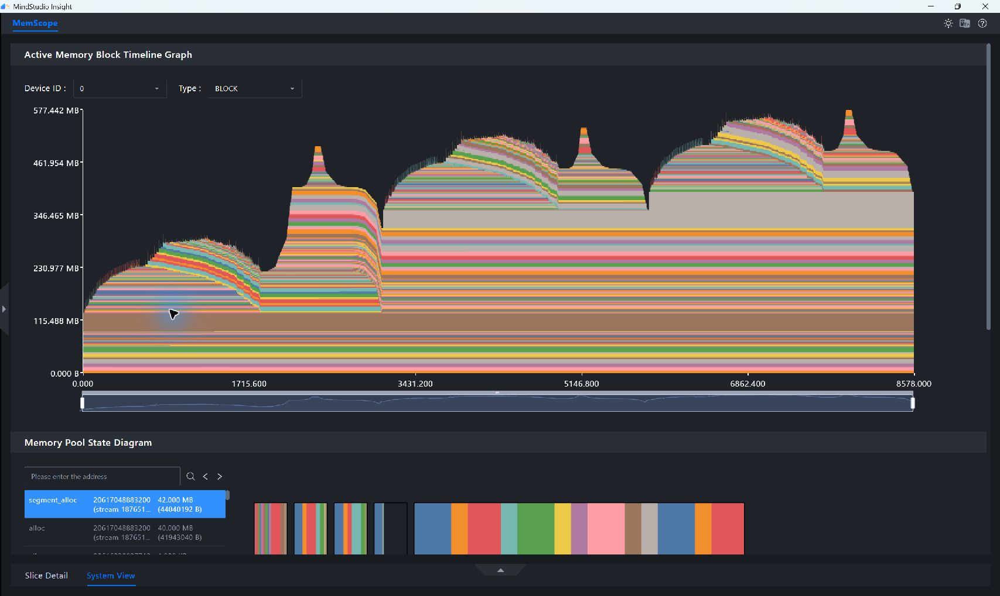
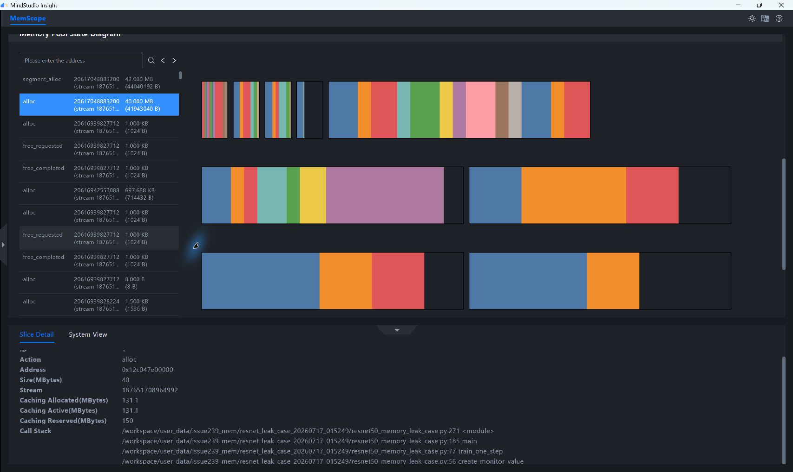
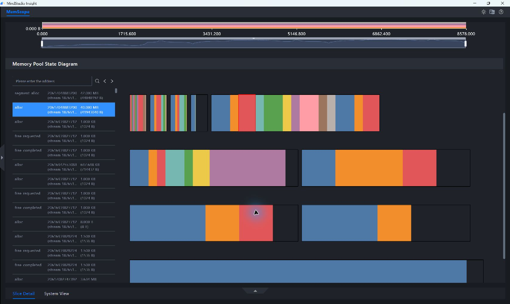
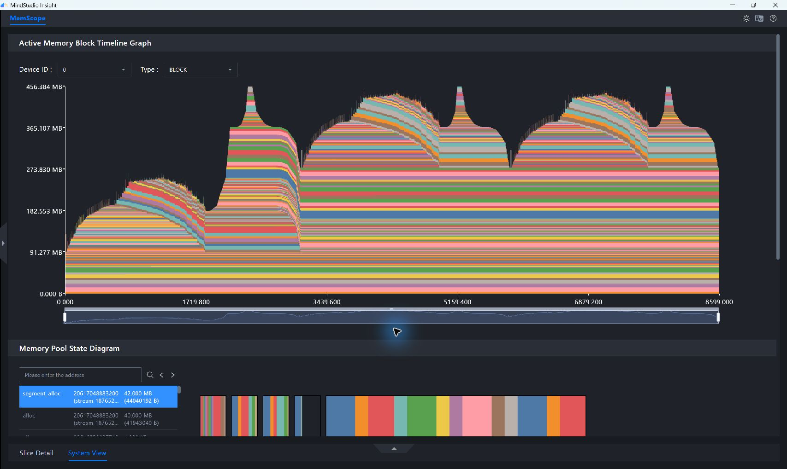
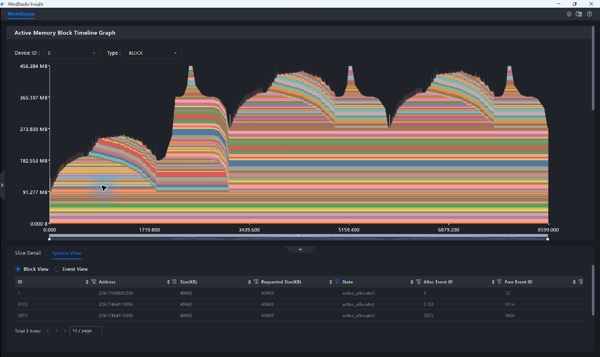
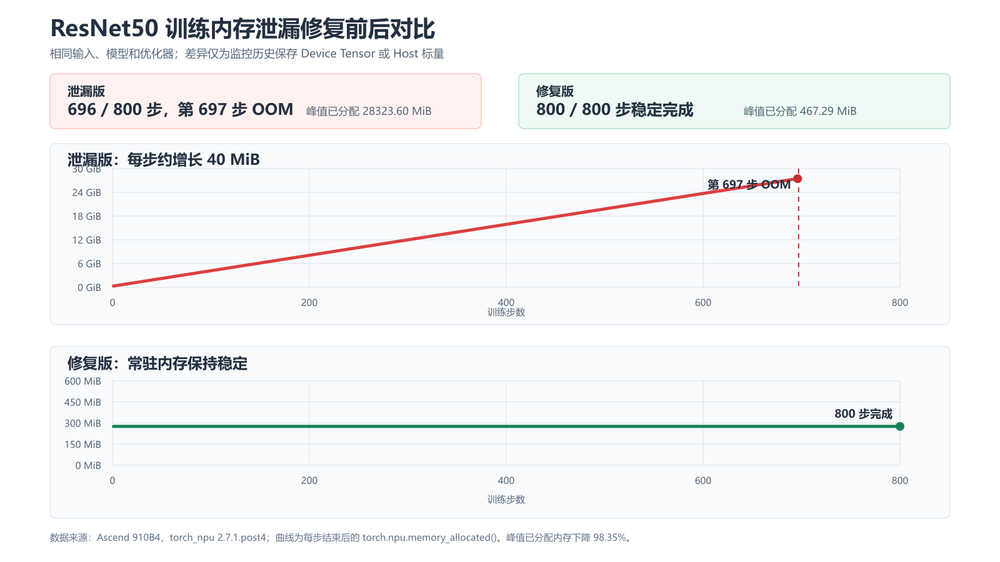

# 基于 PyTorch Snapshot 定位 ResNet50 训练内存泄漏

## 案例概述

训练脚本通常会记录 loss、梯度范数或其他监控指标。如果直接把 Device Tensor
保存到跨 Step 存活的列表中，Tensor 的 Python 引用会一直存在，对应的 Device
内存也无法释放。短时间运行可能只表现为内存缓慢增长，长时间运行后则可能触发
OOM。

本案例使用 ResNet50 和 Adam 优化器构造一个可重复的训练场景，并在每个 Step
生成一个约 40 MiB 的监控 Tensor：

- 泄漏版把 Device Tensor 直接加入历史列表。
- 修复版只把监控 Tensor 的 Host 标量值加入历史列表。

训练输入和标签由固定随机种子生成，不代表实际数据集；ResNet50 前向、反向和
Adam 参数更新均为真实 NPU 计算。每 Step 额外生成 40 MiB Tensor 属于受控故障
注入，用于在有限验证时间内放大并稳定复现问题。其引用模式与实际训练中保存 loss
Tensor、模型输出或中间特征到全局容器的情况相同。

本案例使用两组数据完成分析和验证：

1. 记录 3 个 Step 的 PyTorch Snapshot，用于在 MindStudio Insight 中定位未释放
   内存块和 Python 调用栈。
2. 不记录 Snapshot，连续训练 800 个 Step，用于验证泄漏版最终 OOM、修复版能够
   稳定完成。

> [!NOTE] 说明
>
> PyTorch Snapshot 记录 PyTorch 缓存分配器管理的内存。本案例分析的是 Python
> 引用导致的 Device Tensor 泄漏；如果需要分析框架外内存，请使用 msMemScope
> 数据源。

## 分析思路

按照“确认趋势、定位对象、回溯代码、验证根因、复测修复”的顺序分析：

1. 对比泄漏版和修复版的内存块生命周期图，判断内存是否跨 Step 累积。
2. 在 Block View 中按申请大小筛选 40 MiB 内存块，确认是否存在释放事件。
3. 在 Event View 中筛选 40 MiB 分配事件，再通过 Slice Detail 中的
   `Call Stack` 回溯申请位置。
4. 结合内存池状态和代码引用关系，区分内存泄漏与缓存或碎片问题。
5. 将历史记录改为 Host 标量，再用相同的 Snapshot 分析路径和 800 Step 长跑
   验证修复结果。

## 数据准备

### 验证环境

| 项目 | 验证环境 |
| --- | --- |
| NPU | Ascend 910B4，标称 HBM 32 GiB |
| npu-smi 版本 | 25.2.0 |
| Python | 3.12.13 |
| PyTorch | 2.7.1+cpu |
| torch_npu | 2.7.1.post4 |
| MindStudio Insight | 26.0.0 |

泄漏版 OOM 日志中，PyTorch 报告的可用总容量为 `29.49 GiB`。该值是本次进程可见
的框架容量，与硬件标称的 32 GiB HBM 口径不同。`torch.__version__` 在该环境中
显示为 `2.7.1+cpu`，NPU 能力由 `torch_npu` 提供。采集前可执行以下命令确认 NPU
可用，并确认目标 NPU 没有运行其他任务：

```bash
npu-smi info
python -c 'import torch, torch_npu; print(torch.npu.is_available(), torch.npu.get_device_name(0))'
```

预期输出包含 `True` 和当前 NPU 型号。

### 训练负载

| 参数 | 取值 |
| --- | --- |
| 模型 | ResNet50 |
| 优化器 | Adam |
| batch size | 1 |
| 输入形状 | `1 x 3 x 244 x 244` |
| 数据类型 | `float32` |
| 随机种子 | 42 |
| 监控 Tensor | 每 Step 约 40 MiB |
| Snapshot 分析窗口 | 3 Step |
| 长跑验证 | 800 Step |

训练输入和标签分别由 `torch.randn` 和 `torch.randint` 生成。核心计算链路如下：

```python
def train_one_step(model, optimizer, loss_fn, history, mode, device):
    create_monitor_value(mode, history, element_count, device)

    inputs = torch.randn(1, 3, 244, 244, device=device)
    labels = torch.randint(0, 10, (1,), device=device)

    predictions = model(inputs)
    loss = loss_fn(predictions, labels)
    loss.backward()
    optimizer.step()
    optimizer.zero_grad(set_to_none=True)
    torch.npu.synchronize()
```

以上代码省略了模型、优化器和参数解析等通用初始化，仅展示与本案例内存问题直接
相关的核心计算链路。复现时应按照训练负载表使用同一个完整训练脚本，并确保泄漏版
与修复版只有历史数据保存方式不同。

使用相同脚本和随机种子，分别按以下参数组合运行。3 Step 数据用于定位，800 Step
数据用于验证最终结果：

| 运行组 | 模式 | Step 数 | 记录 Snapshot | 预期用途 |
| --- | --- | ---: | --- | --- |
| 泄漏版短采集 | `leak` | 3 | 是 | 定位未释放 Block 和调用栈 |
| 修复版短采集 | `fixed` | 3 | 是 | 验证申请/释放事件闭环 |
| 泄漏版长跑 | `leak` | 800 | 否 | 验证持续增长最终触发 OOM |
| 修复版长跑 | `fixed` | 800 | 否 | 验证常驻内存稳定且训练完成 |

### 问题代码

监控函数先在 NPU 上生成 Tensor，再根据运行模式保存历史数据：

```python
def create_monitor_value(mode, history, element_count, device):
    monitor_tensor = torch.randn(
        element_count,
        dtype=torch.float32,
        device=device,
    )

    if mode == "leak":
        history.append(monitor_tensor)
    else:
        history.append(monitor_tensor.mean().item())

    del monitor_tensor
```

泄漏版虽然执行了 `del monitor_tensor`，但列表 `history` 仍然持有同一个
Tensor 的引用，因此对应内存不能释放。修复版通过 `mean().item()` 完成归约，
并将单个数值同步到 Host 侧保存，原 Device Tensor 在本 Step 结束后即可释放。

### 采集 Snapshot

在训练前开启内存历史记录，训练和 NPU 同步完成后导出 Snapshot：

```python
torch_npu.npu.memory._record_memory_history(
    stacks="python",
    max_entries=200000,
)

for step in range(3):
    train_one_step()

torch.npu.synchronize()
torch_npu.npu.memory._dump_snapshot(snapshot_path)
torch_npu.npu.memory._record_memory_history(enabled=None)
```

分别使用新的 Python 进程运行泄漏版和修复版，得到：

- `leak_3_steps_snapshot.pickle`
- `fixed_3_steps_snapshot.pickle`

3 Step 已足以观察同类内存块是否随 Step 累积，同时可以控制 Snapshot 文件大小和
事件数量。800 Step 长跑关闭内存历史记录，仅保留每 Step 的已分配内存和最终状态，
避免采集本身给长跑结果引入额外开销。

Snapshot 的通用采集方法可参见
[基于 PyTorch Snapshot 数据分析内存问题](./pytorch_snapshot_memory_analysis.md#snapshot-数据采集)。

> [!WARNING] 警告
>
> Snapshot 使用 `pickle` 格式。仅导入或反序列化来源可信的 Snapshot 文件。

## 导入数据并认识关键视图

### 导入泄漏版 Snapshot

1. 打开 MindStudio Insight，单击左上方“导入数据”。
2. 选择 `leak_3_steps_snapshot.pickle`，单击“确认”。
3. 在左侧数据列表中选择已导入的数据，进入“PyTorch Snapshot 数据内存详情
   （内存快照）”界面。
4. 在内存块生命周期图上方选择 `Device ID: 0` 和 `Type: BLOCK`。

详细导入操作可参见[导入数据](../user_guide/basic_operations.md#导入数据)。

### 关键视图及分析目标

| 视图 | 主要操作 | 关键字段或图形 | 本案例中的用途 |
| --- | --- | --- | --- |
| 内存块生命周期图 | 观察完整采集范围和跨 Step 色块 | 色块高度、出现次数、生命周期 | 判断常驻内存是否逐步抬升 |
| Block View | 按 `Requested Size(KB)` 筛选 | `State`、`Alloc Event ID`、`Free Event ID` | 确认 40 MiB 块是否释放 |
| Event View | 按 `Size(KB)` 筛选 | `Action`、累计内存、事件 ID | 确认分配是否重复出现及是否存在释放事件 |
| Slice Detail | 选择目标 `alloc` 事件 | `Size`、缓存分配器状态、`Call Stack` | 将目标分配回溯到 Python 代码 |
| 内存池状态图 | 选择 `alloc` 或 `segment_alloc` 事件 | Segment、active 和 inactive Block | 判断内存增长来自活跃对象还是碎片 |

MindStudio Insight 26.0.0 界面的容量字段以 `KB` 标示，本文按
`1024 KB = 1 MiB` 换算。`Allocated` 表示已分配给 Tensor 的 Block；
`Active` 除已分配 Block 外，还可能包含等待跨 Stream 释放的 Block；
`Reserved` 表示 PyTorch 缓存分配器从 Device 预留的 Segment 总量；
`Inactive = Reserved - Active`，表示当前未被活跃 Tensor 占用、可供分配器
复用的缓存空间。本案例采集终态没有等待释放的 Block，因此 `Active` 与
`Allocated` 数值相等。

## 分析泄漏版数据

### 确认内存跨 Step 累积

1. 保持 `Device ID: 0` 和 `Type: BLOCK`。
2. 将生命周期图下方缩放条的左右边界拖到两端。
3. 观察每个训练 Step 结束后仍然存活的色块和常驻内存基线。

**图 1**  泄漏版 3 Step 内存块生命周期图<a id="泄漏版3-step内存块生命周期图"></a>


图中每个 Step 都出现一个新的大块，后续 Step 结束后没有回落到相同基线。3 Step
运行的已分配内存从 `317.251 MiB` 增加到 `397.252 MiB`，两个 Step 间隔累计
增长约 `80 MiB`，符合每 Step 保留一个 40 MiB Tensor 的预期。

### 在 Block View 中确认未释放内存块

1. 单击生命周期图下方的向上箭头，展开系统视图（System View）。
2. 选择内存块视图（Block View）。
3. 单击 `Requested Size(KB)` 列的筛选按钮。
4. 将最小值和最大值都设置为 `40960`，单击“Search”。
5. 查看 `Alloc Event ID` 和 `Free Event ID`。

**图 2**  泄漏版 40 MiB 内存块均未释放<a id="泄漏版40-mib内存块均未释放"></a>


筛选结果包含 3 个申请大小为 `40960 KB` 的 Block，申请事件 ID 分别为
`1`、`3097` 和 `5842`。三个 Block 的状态均为 `active_allocated`，
`Free Event ID` 均为 `-1`，说明采集结束时仍由活跃 Tensor 占用，且本次
Snapshot 没有记录到对应释放事件。

界面显示的实际 Block 大小为 `40960.5 KB`，比申请大小多 `0.5 KB`，属于分配器
对齐开销，不影响对 40 MiB 监控 Tensor 的识别。

### 在 Event View 中回溯分配来源

1. 切换到内存事件视图（Event View）。
2. 单击 `Size(KB)` 列的筛选按钮。
3. 将最小值和最大值都设置为 `40960`，单击“Search”。
4. 选择任一 `alloc` 事件。
5. 单击页面底部的向上箭头展开详情区，并切换到 Slice Detail。
6. 查看 `Call Stack`；如果调用路径未完整显示，向下滚动详情区。

**图 3**  泄漏版重复出现 40 MiB 分配事件<a id="泄漏版重复出现40-mib分配事件"></a>


Event View 同样筛出事件 `1`、`3097` 和 `5842`。三个事件均为 `alloc`，
且事件发生后 `Allocated(KB)` 逐步增加。选择事件 `1` 后，在 Slice Detail
中查看完整调用栈：

**图 4**  40 MiB 分配事件的完整调用栈<a id="40-mib分配事件的完整调用栈"></a>


界面自上而下显示的调用路径如下：

```text
resnet50_memory_leak_case.py:271 <module>
resnet50_memory_leak_case.py:185 main
resnet50_memory_leak_case.py:77 train_one_step
resnet50_memory_leak_case.py:56 create_monitor_value
```

`Call Stack` 将重复的 40 MiB 分配定位到 `create_monitor_value` 中创建
`monitor_tensor` 的语句。继续检查业务逻辑后发现，泄漏版将该 Tensor 加入
跨 Step 存活的 `history` 列表。

### 排除内存碎片是主要原因

1. 在内存池状态图左侧事件列表中选择 40 MiB 的 `alloc` 事件。
2. 对照相邻的 `segment_alloc` 事件及右侧 Segment、Block 布局。
3. 比较泄漏版与修复版采集结束时的 active、inactive 和事件状态。

**图 5**  40 MiB 活跃 Block 及其所在内存池<a id="40-mib活跃-block及其所在内存池"></a>


图中选中的 40 MiB `alloc` 对应一个活跃 Block，缓存分配器为该申请扩展了约
42 MiB 的 Segment。图 5 展示的是第一次 `alloc` 事件刚发生后的内存池布局，
不是 Snapshot 的采集终态。结合两份 Snapshot 的终态 Segment、Block 状态和
完整事件记录，汇总数据如下：

| 指标 | 泄漏版 | 修复版 |
| --- | ---: | ---: |
| 40 MiB `alloc` 事件数 | 3 | 3 |
| 40 MiB `free_completed` 事件数 | 0 | 3 |
| 采集结束时仍活跃的 40 MiB Block 数 | 3 | 0 |
| Active 总量 | 397.252 MiB | 276.193 MiB |
| Inactive 总量 | 234.748 MiB | 279.807 MiB |
| Reserved 总量 | 632.000 MiB | 556.000 MiB |

表中的 `Reserved` 为终态各 Segment 总量之和，`Active` 为终态各 Segment
活跃空间之和，`Inactive` 按 `Reserved - Active` 计算；40 MiB 事件数和活跃
Block 数分别由 Event View 事件记录与终态 Block 状态统计得到。因此，表中终态
数值与图 5 所选事件时刻的缓存分配器数值不应直接对比。

泄漏版新增的三个目标 Block 均保持活跃；修复版虽然 Inactive 总量更高，但目标
Block 已全部释放，常驻已分配内存也不再增长。这说明问题由仍被引用的活跃 Tensor
引起，缓存保留或潜在碎片不是本次内存持续增长和最终 OOM 的主要原因。

因此，针对本次根因，调用 `empty_cache()` 或调整分配器碎片参数不能解决问题。
`empty_cache()` 只能释放未被活跃 Tensor 占用的缓存空间；只要 `history` 仍持有
Device Tensor 引用，即使局部变量已删除，Tensor 所占内存也不能归还给缓存分配器。

分析其他 Snapshot 时，可以按以下现象选择下一步：

| 主要现象 | 优先判断 | 下一步 |
| --- | --- | --- |
| Allocated 和 active Block 持续增加 | 活跃 Tensor 仍被引用 | 在 Block View、Event View 和 `Call Stack` 中定位对象及代码 |
| Reserved 增加但 Allocated 基本稳定，且存在较多不可复用的 inactive split Block | 缓存保留或潜在碎片 | 查看 Segment 布局、申请尺寸和分配器参数 |
| 进程 Device 内存增加，但 Snapshot 中 Allocated 和 Reserved 基本稳定 | PyTorch 缓存分配器外的内存 | 结合 msMemScope 等数据继续分析 |

## 根因与优化方案

根因是监控历史保存了 Device Tensor：

```python
history.append(monitor_tensor)
```

对于只需要记录一个统计值的场景，没有必要跨 Step 保存完整 Tensor。将保存内容
改为 Host 标量：

```python
history.append(monitor_tensor.mean().item())
```

该修改具有以下效果：

1. `mean()` 在 Device 上完成统计，减少传回 Host 的数据量。
2. `.item()` 只返回一个 Host 标量，`history` 不再持有 Device Tensor。
3. 原 Tensor 在本 Step 结束后失去最后一个 Python 引用，对应 Block 可以释放并
   在后续 Step 中复用。

> [!NOTE] 说明
>
> `.item()` 会等待 Device 计算完成并把标量传回 Host，频繁调用可能引入同步开销。
> 性能敏感场景可降低监控采样频率、在 Device 侧累计后批量取值，或使用异步落盘
> 方案。本案例只用于验证引用释放，不据此评估训练吞吐。

如果业务确实需要保存完整 Tensor，应根据用途选择保存到 CPU、定期落盘、限制历史
窗口长度或只保留必要切片，不能直接把每个 Step 的 Device Tensor 无限追加到列表。

## 验证优化结果

### 使用 Snapshot 验证释放关系

将 `fixed_3_steps_snapshot.pickle` 导入 MindStudio Insight，并重复泄漏版分析
步骤。

**图 6**  修复版 3 Step 内存块生命周期图<a id="修复版3-step内存块生命周期图"></a>


修复版每个 Step 的临时分配在使用后回落，常驻内存没有随 Step 抬升。3 Step 的
首尾已分配内存均为 `276.193 MiB`。

在 Block View 中按 `Requested Size(KB) = 40960` 筛选：

**图 7**  修复版 40 MiB 内存块均记录了释放事件<a id="修复版40-mib内存块均记录了释放事件"></a>


修复版包含三次 40 MiB 分配记录，申请事件 ID 为 `1`、`3103` 和 `5855`，对应的
`Free Event ID` 为 `12`、`3114` 和 `5866`。与泄漏版的 `-1` 相比，
修复版已经形成完整的申请和释放事件对。事件 `3103` 和 `5855` 的地址相同，
说明第二次释放后的 Block 在第三个 Step 中被分配器直接复用。

在本版本导入结果中，Block 表的 `State` 列仍保留该生命周期记录的
`active_allocated` 分配状态。判断是否完成释放应结合 `Free Event ID`：跳转到
事件 `12`、`3114` 和 `5866` 后，`Action` 均为 `free_completed`，因此与释放
结论不矛盾。

### 使用 800 Step 长跑验证最终结果

短 Snapshot 用于定位对象和调用栈，800 Step 长跑用于验证修复能否解决实际 OOM。
两次长跑使用相同输入、模型、优化器和随机种子，均不记录 Snapshot。

**图 8**  ResNet50 训练长跑结果对比<a id="resnet50训练长跑结果对比"></a>


| 指标 | 泄漏版 | 修复版 |
| --- | ---: | ---: |
| 请求训练步数 | 800 | 800 |
| 完成步数 | 696 | 800 |
| 最终状态 | 第 697 步 OOM | 正常完成 |
| 每 Step 常驻内存变化 | 约 +40 MiB | 约 0 MiB |
| 首个 Step 已分配内存 | 317.251 MiB | 276.193 MiB |
| 最后完成 Step 已分配内存 | 28117.590 MiB | 276.193 MiB |
| 峰值已分配内存 | 28323.605 MiB | 467.292 MiB |
| 峰值保留内存 | 29738.000 MiB | 556.000 MiB |
| 运行时间 | 156.993 s | 180.130 s |

泄漏版在第 697 步尝试继续申请内存时 OOM；修复版完成了更多 Step，且常驻已分配
内存始终保持在约 `276.193 MiB`。相对于泄漏版 OOM 前的峰值，修复版峰值已分配
内存下降约 `98.35%`，峰值保留内存下降约 `98.13%`。

两次运行完成的 Step 数不同，因此运行时间不能直接用于比较训练性能。本案例只用
长跑结果验证内存稳定性和 OOM 是否消失，不据此给出吞吐结论。

### 结果闭环

本案例形成了以下证据链：

1. 生命周期图显示泄漏版常驻内存跨 Step 逐步抬升。
2. Block View 显示三个 40 MiB Block 的 `Free Event ID` 均为 `-1`。
3. Event View 证明三个训练 Step 重复发生同尺寸分配。
4. Slice Detail 中的 `Call Stack` 将分配定位到
   `create_monitor_value` 第 56 行。
5. 内存池状态和终态对照表证明增长来自活跃 Block，缓存保留或潜在碎片不是
   持续增长的主要原因。
6. 代码检查确认 `history` 长期持有 Device Tensor。
7. 修复版 Snapshot 中三次 40 MiB 分配均具有释放事件，并出现地址复用。
8. 泄漏版在第 697 步 OOM，修复版稳定完成 800 步。

## 复现验收点

使用相同场景复现时，应满足以下条件：

1. 泄漏版和修复版 Snapshot 均能成功导入 MindStudio Insight。
2. 泄漏版生命周期图中的常驻内存随 Step 抬升。
3. 泄漏版能筛出每 Step 新增的 40 MiB Block，且没有对应释放事件。
4. Slice Detail 中的 `Call Stack` 能定位到 `create_monitor_value` 第 56 行。
5. 内存池状态显示泄漏版目标 Block 保持活跃，缓存保留或潜在碎片不是持续增长的
   主要原因。
6. 修复版三次相同大小的分配均具有释放事件，且出现地址复用，常驻内存不再随
   Step 增长。
7. 长跑中泄漏版最终触发 OOM，修复版完成全部预定 Step。

上述绝对数值用于核对本次验证结果。不同硬件、软件版本和模型参数下的绝对内存值
可能不同，应以“未释放 Block 是否持续累积”和“修复后是否形成申请/释放闭环”
作为主要判断依据。

## 参考信息

- [MindStudio Insight 内存调优](../user_guide/memory_tuning.md)
- [MindStudio Insight 导入数据](../user_guide/basic_operations.md#导入数据)
- [基于 PyTorch Snapshot 数据分析内存问题](./pytorch_snapshot_memory_analysis.md)
- [Ascend Extension for PyTorch 版本配套说明](https://gitcode.com/Ascend/pytorch/blob/v2.7.1/docs/zh/release_notes/release_notes.md)
