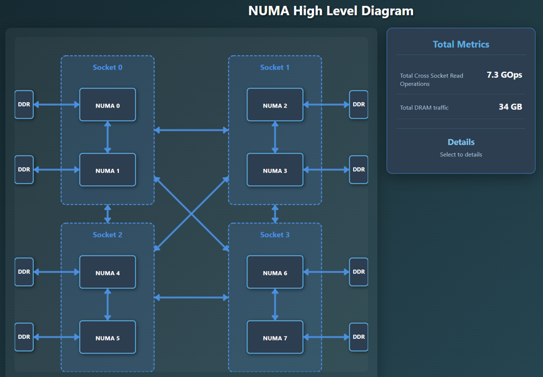
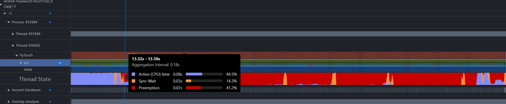
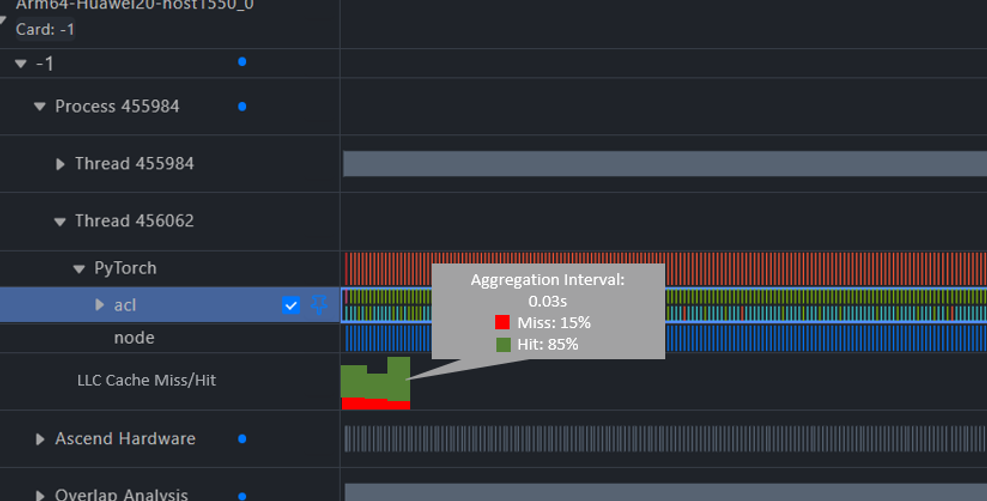

# MindStudio Insight 支持 NUMA分析特性设计说明书

**Copyright © 2026 Ascend Community**

## 改版记录

| 日期 | 修订版本 | 修订描述 | 作者 | 审核 |
| --- | --- | --- | --- | --- |
| 2026-08-01 | v1.0 | 初稿 | 杨雷 | 廖宴 |
|            |          |          | - | - |

## 缩略语清单

| 缩略语 | 英文全名 | 中文解释 |
| --- | --- | --- |
| msInsight | MindStudio Insight | MindStudio Insight 性能分析工具 |
| NUMA | Non-Uniform Memory Access | 非一致内存访问‌ |
|           |                           |                                 |

# 1. 特性概述

针对A+K场景（CPU采用鲲鹏），支持Uncore与NUMA指标的时序数据采集，提供平台级与Socket级性能指标，包括DDR读写监测、基于HHA数据的NUMA节点带宽监测、NUMA流量占比计算及时序数据追踪、CPU侧NUMA性能数据与MindStudio NPU数据关联分析，提升协同定位性能瓶颈的效率。


## 1.1 范围

本文覆盖 MindStudio Insight 中NUMA分析相关的开发设计说明，重点包括：

1. NUMA架构图：NUMA架构图展示，可展示节点、链路信息详情。
2. Platform Metric可视化：支持DRAM Write Bandwidth、Cross Socket Read Bandwidth、Cross SCCL、Total Read BandWidth、Total Read BandWidth、LLC BandWidth、Inner Read BandWidth、Total External Traffic Impact、External Traffic Impact(Socket level)、External Traffic Impact(Node level)指标呈现。
3. 线程分析：支持线程分析图展示，包括active、sync wait、preemption三种状态统计
4. 命中率分析：支持LLC缺失率/命中率（每线程）分析


## 1.2 特性需求列表

| 需求编号 | 需求名称 | 特性描述 | 可验证资料 |
| --- | --- | --- | --- |
| 1 | NUMA相关问题分析 | 支持 NUMA架构图展示、Platform Metric可视化、线程分析及命中率分析 |            |
|          |                  |                                                              |            |

# 2. 需求场景分析

## 2.1 特性需求来源与价值概述

当前缺少NUMA相关分析能力，问题分析效率较低。通过MindStudio Insight呈现NUMA架构图、Platform Metric变化趋势、线程及命中率变化趋势，可帮助开发者直观呈现NUMA采集数据，快速找到问题瓶颈点。


## 2.2 典型使用场景

### PyTorch Snapshot 场景

1. 通过msprof采集NUMA数据，采集数据合入db库中
4. 在 MindStudio Insight 中导入采集数据，参考NUMB架构及各指标变化情况分析问题瓶颈。


## 2.3 约束与限制


### 2.3.1 硬件限制

具体硬件支持范围以 MindStudio Insight 发布说明和对应数据采集工具说明为准。


### 2.3.2 系统限制

现有文档中记录的建议环境如下：

1. Windows 10+。
2. Linux 建议 `glibc > 2.30`。
3. macOS 13.0+。
4. 建议运行 MindStudio Insight 的设备内存超过 16GB。
5. 建议内存数据文件不超过 1GB。

如实际支持矩阵发生变化，以安装指南、发布说明和构建脚本为准。


### 2.3.3 安全与敏感信息

MindStudio Insight 是本地分析工具，但输入文件可能包含用户路径、函数名、调用栈、符号名、模型执行信息等内容。开发和文档示例应遵循以下原则：

- 示例路径使用脱敏路径，如 `/home/xxx/demo.py`。
- 不在文档中放置真实用户名、局点信息、密钥、口令或公网地址。
- 对用户导入的文件路径、文件类型和文件大小进行合法性校验。
- 若日志中需要输出异常信息，应避免打印敏感路径和完整调用栈，必要时进行脱敏。

# 3. 总体方案


## 3.1 数据来源

| 数据源 | 数据格式 | 主要展示内容 | 说明 |
| --- | --- | --- | --- |
| msProf | .db | NUMN架构图、Platform Metric的10个指标内容、线程分析数据、命中率分析数据 |  |
|        |          |                                                              |      |

## 3.2 处理流程

1. 用户采集NUMA数据，生成db格式数据。
2. 用户在 MindStudio Insight 中导入数据文件。
3. 后端解析数据并建立查询所需的数据结构或数据库连接。
4. 前端按页面交互发起查询请求。
5. 后端返回NUMA架构信息、指标变化信息查询结果。
6. 前端展示NUMA架构图、Timeline中分泳道呈现Platform Metric、线程、命中率等信息。


## 3.3 与其他文档的关系


# 4. Use Case 一：NUMA分析


## 4.1 设计目标

支持导入NUMA数据，展示NUMA架构图，点击NUAM元素、Socket元素及各链接可在扩展区域展示对应统计信息。



## 4.2 用户入口

用户通过 msProf采集数据，用户指南中的采集示例如下：

```python
待补充
```


## 4.3 页面能力

NUMA页面可展示：

- NUMA架构图展示
- 扩展统计信息展示
- TimeLine页面选择分析的时间区域，可跳转到NUMA页面，页面之统计分析时间区域内的数据。


## 4.4 待确认事项

以下内容需从设计评审中进一步确认后再补充：

- 后端数据库表结构或中间数据结构。

  

# 5. Use Case 二：Platform Metric可视化、线程分析、命中率分析

## 5.1 设计目标

支持导入 msMemScope 采集的 DB 结果文件，以图形化方式展示 Device 内存申请释放生命周期、调用栈和内存拆解信息。


## 5.1 设计目标

TimeLine中增加泳道支持Platform Metric、线程数据、命中率数据呈现。






## 5.2 数据准备

支持导入.db格式文件。用户指南中记录的展示能力包括：
- Platform Metric的10个指标数据。
- 线程分析数据。
- 命中率分析数据。


## 5.3 页面能力

TimeLine页面可展示：

- Platform Metric可视化：支持DRAM Write Bandwidth、Cross Socket Read Bandwidth、Cross SCCL、Total Read BandWidth、Total Read BandWidth、LLC BandWidth、Inner Read BandWidth、Total External Traffic Impact、External Traffic Impact(Socket level)、External Traffic Impact(Node level)指标呈现。
- 线程分析：支持线程分析图展示，包括active、sync wait、preemption三种状态统计
- 命中率分析：支持LLC缺失率/命中率（每线程）分析


## 5.4 待确认事项

以下内容需从设计评审中进一步确认后再补充：

- 后端数据库表结构或中间数据结构。

  

# 6. DFX 设计


## 6.1 性能设计

- 建议对大文件导入、长时间范围查询、缩放和平移操作进行性能验证。

- 建议对 1GB 以内内存数据文件进行导入与查询验证。

- 不在本文中承诺具体响应时间；具体指标需以性能测试结果为准。

  

## 6.2 异常处理设计

建议覆盖以下异常场景：

- 文件格式不匹配。

- 文件损坏或字段缺失。

- 文件过大导致解析失败或耗时过长。

- 查询时间范围为空。

- 调用栈或访问事件未采集。

- db中不包含numa相关数据

  

## 6.3 安全设计

- 不新增对外监听端口。

- 不新增认证方式。

- 文件导入路径和文件类型应做合法性校验。

- 示例和日志应避免暴露真实用户路径、口令、密钥或局点信息。

- 若新引入第三方组件，应按项目三方件引入流程完成 license 与漏洞检查。

  

## 6.4 可测试性设计

建议测试覆盖：

- numa数据正常导入，架构图正常展示，节点和链接点击时间想要正常，扩展统计数据正常。

- timeline可正常展示Platform Metric数据、线程分析数据、命中率分析数据。

- db文件中不包含numa及各指标相关数据。

- 大文件导入。

- 错误文件格式。

  

# 7. 验证方法


## 7.1 静态验证

- 检查文档中相对链接是否存在。
- 检查示例路径是否已脱敏。
- 检查是否仍存在模板占位、空图片或未闭合 Markdown 标记。


## 7.2 功能验证

- 使用db文件导入，验证NUMA架构图、timeline中各指标呈现、线程分析数据呈现、命中率数据呈现。
- 验证NUMA数据为空场景工具其他功能是否受影响。
