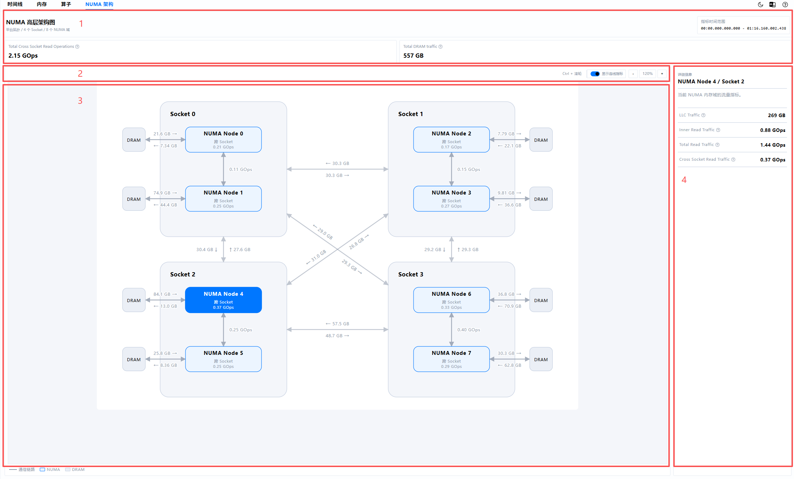
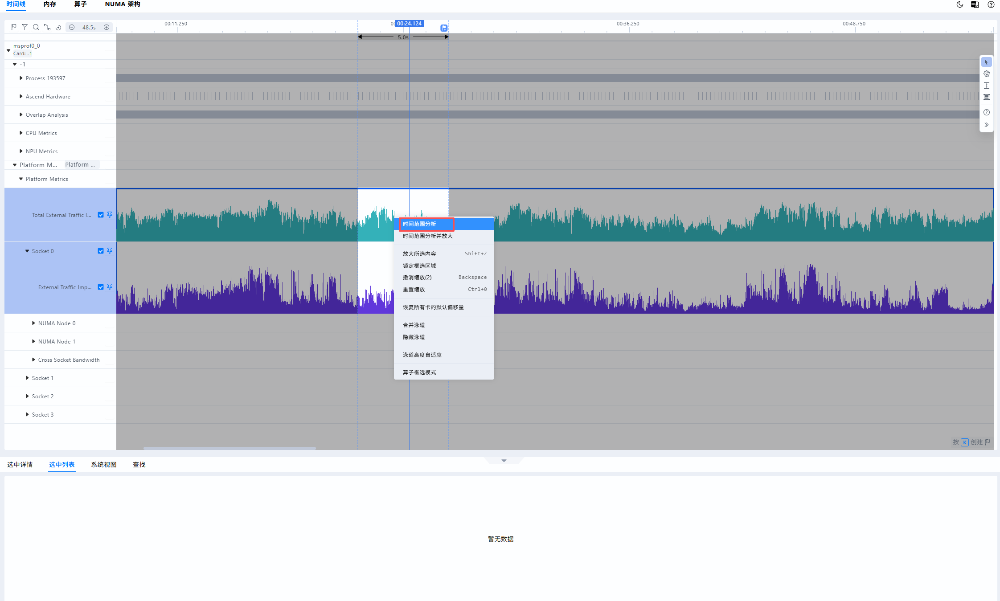
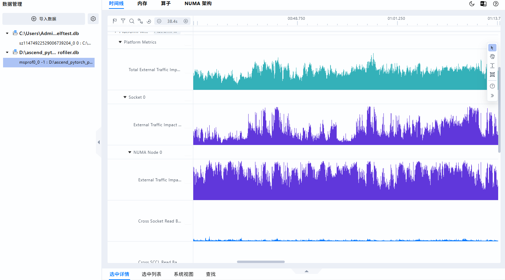
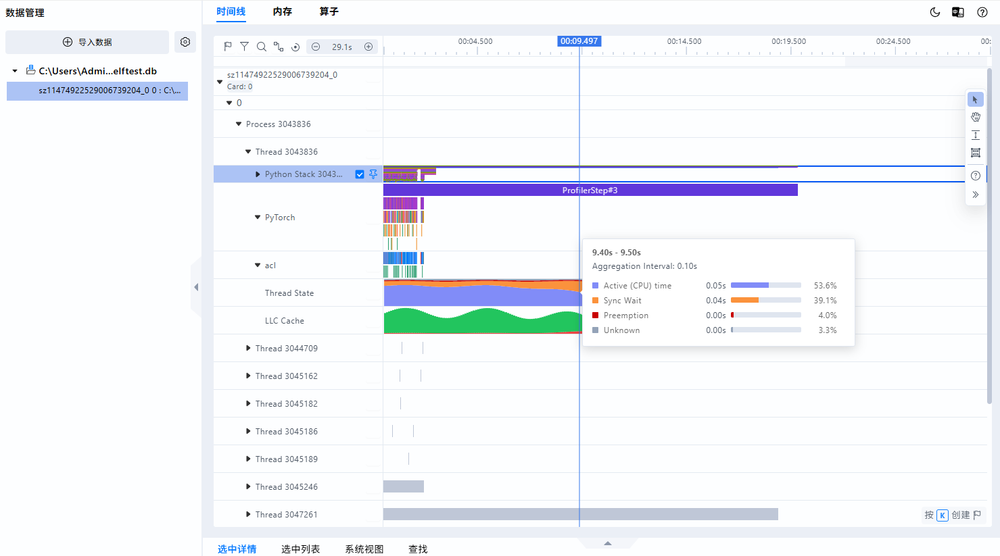

# **MindStudio Insight NUMA分析**

## 简介

NUMA（Non-Uniform Memory Access，非一致内存访问）分析用于展示CPU侧Socket、NUMA节点、DRAM以及节点间访问关系，帮助开发者定位内存访问不均衡、跨Socket访问过多、线程与内存亲和性不合理等Host侧性能问题。

导入包含NUMA指标的性能数据后，可在NUMA界面查看NUMA高层架构图、系统汇总指标、Socket/NUMA节点/DRAM/通信链路详情；也可在时间线（Timeline）中查看NUMA相关Platform Metric、Thread State、LLC Hit/Miss等泳道，将CPU侧内存访问问题、线程运行状态与NPU执行过程关联起来分析。

## 使用前准备

**环境准备**

请先安装MindStudio Insight工具，具体安装步骤请参见[MindStudio Insight安装指南](../install_guide/mindstudio_insight_install_guide.md)。

**数据准备**

请使用支持NUMA指标采集的性能分析工具采集数据，并将采集结果导入MindStudio Insight。数据导入操作请参见[导入数据](./basic_operations.md#导入数据)。

> [!NOTE] 说明
>
> - NUMA分析依赖主性能数据库中的NUMA指标数据，通常为采集结果目录下的 `ascend_pytorch_profiler.db`。
> - 当前不再支持单独导入独立NUMA数据库文件。请导入完整的Profiling结果目录，或导入包含NUMA指标的主数据库结果。
> - 如果采集数据中不包含NUMA相关表或指标，NUMA页签可能不展示，或页面提示无可用NUMA数据。

## 数据说明

NUMA分析主要依赖数据库中的NUMA拓扑与指标采样数据。不同采集工具和硬件平台支持的指标可能存在差异，最终展示内容以实际导入数据为准。

**表 1** NUMA数据依赖说明

| 数据来源                       | 关键数据                                                                             | 主要展示内容                                                                       | 说明                                                                                                                        |
| ------------------------------ | ------------------------------------------------------------------------------------ | ---------------------------------------------------------------------------------- | --------------------------------------------------------------------------------------------------------------------------- |
| `ascend_pytorch_profiler.db` | `NUMA_TITLES_NAMES`、`NUMA_LEVELS_HIERARCHY_NAMES`、`NUMA_METRICS`等NUMA相关表 | NUMA高层架构图、系统汇总指标、Socket指标、NUMA节点指标、DRAM读写指标、通信链路指标 | 数据库中需包含NUMA层级、指标名称和采样值。                                                                                  |
| Timeline解析结果               | Platform Metric、Thread State、LLC Hit/Miss等数据                                    | 时间线（Timeline）中的NUMA相关泳道                                                 | Thread State依赖线程维度的Active Time、Wait Time、Preemption Time和Unknown Time指标；仅在采集数据包含对应事件或指标时展示。 |

> [!NOTE] 说明
>
> - NUMA指标值按所选时间范围内的采样数据进行统计展示。对于带宽类指标，时间范围内需包含至少两个不同时间戳的采样点，才能计算流量总量；不足时对应指标显示为“未采集到数据”。
> - 页面中的带宽类指标在NUMA高层架构图中以所选时间范围内的流量总量展示，例如源数据单位为 `GB/s` 时，页面展示单位为 `GB`。
> - Socket间方向流量依赖数据库中明确记录的Outgoing/Incoming方向信息；若采集环境不支持Protocol Adapter，Socket连线指标可能显示为不可用。

## NUMA高层架构图

### 功能说明

NUMA高层架构图以拓扑方式展示当前数据中的Socket、NUMA节点、DRAM和通信链路。开发者可通过该图快速观察不同Socket和NUMA节点之间的访问关系，并结合指标总量判断是否存在跨Socket访问、跨SCCL访问、DRAM读写或LLC流量异常。

### 界面介绍

NUMA高层架构图界面主要包含系统指标、拓扑图操作区、NUMA拓扑图和详细信息面板，如图 1 所示。

**图 1** NUMA高层架构图



- 区域一：系统指标与指标时间范围。展示当前数据的Socket数量、NUMA域数量和统计时间范围，并汇总展示全局NUMA指标。
- 区域二：拓扑图操作区。支持放大、缩小、重置缩放，以及开启或关闭连线指标展示。
- 区域三：NUMA拓扑图。展示Socket、NUMA节点、DRAM和通信链路。不同节点或链路可单击选中。
- 区域四：详细信息面板。展示当前选中的Socket、NUMA节点、DRAM或通信链路的指标详情；未选中对象时展示系统汇总指标。

### 使用说明

1. 在MindStudio Insight中导入包含NUMA指标的Profiling结果目录或主数据库数据。
2. 导入成功后，打开“NUMA”页签，进入“NUMA高层架构图”界面。
3. 查看页面顶部的Socket数量、NUMA域数量和指标时间范围，确认当前统计范围。
4. 单击Socket、NUMA节点、DRAM或通信链路，在右侧“详细信息”面板查看对应指标。
5. 如需查看链路上的指标值，开启“显示连线指标”。
6. 如需调整拓扑图视图，可使用工具栏中的放大、缩小、重置缩放按钮；也可以按住 `Ctrl` 键并滚动鼠标滚轮进行缩放。

> [!NOTE] 说明
>
> 如果已在时间线（Timeline）中选择分析时间范围分析，NUMA高层架构图会优先展示该时间范围内的统计结果；如果未选择分析时间范围，则展示数据中的完整时间范围统计结果。



## 指标说明

NUMA高层架构图中的指标用于描述所选时间范围内不同层级的访问流量。指标值越大，表示该时间范围内对应访问路径或硬件层级承载的数据访问越多。具体含义如表 2 所示。

**表 2** NUMA指标说明

| 指标                            | 展示位置                                     | 单位     | 说明                                                                                        | 分析建议                                                                            |
| ------------------------------- | -------------------------------------------- | -------- | ------------------------------------------------------------------------------------------- | ----------------------------------------------------------------------------------- |
| Cross Socket Read Traffic       | NUMA节点                                     | GB或GOps | 所选时间范围内当前NUMA节点通过Socket间互连完成的跨Socket读取流量总量。                      | 数值较高时，建议检查线程绑核、内存分配位置和进程NUMA亲和性，减少远端Socket访问。    |
| Total Cross Socket Read Traffic | Socket、系统汇总                             | GB或GOps | 所选时间范围内当前Socket或系统范围内全部NUMA节点的跨Socket读取流量总量。                   | 可用于判断当前Socket或系统整体是否存在明显跨Socket访问压力。                        |
| Cross SCCL Read Traffic         | NUMA节点、NUMA节点间通信链路                 | GB或GOps | 所选时间范围内同一Socket中不同SCCL芯粒之间的读取流量总量。                                  | 数值较高时，建议结合线程分布和任务绑定关系分析同Socket内部访问是否均衡。            |
| Total Read Traffic              | NUMA节点                                     | GB或GOps | 所选时间范围内当前NUMA节点完成的全部读取流量，包括本地读取和远端读取。                      | 可与Inner Read Traffic、Cross Socket Read Traffic对比，分析本地访问与远端访问占比。 |
| Inner Read Traffic              | NUMA节点                                     | GB或GOps | 所选时间范围内CPU核与当前NUMA节点本地内存之间的读取流量总量。                               | 本地访问占比越高，通常说明线程与内存亲和性越好。                                    |
| DRAM Read Traffic               | NUMA节点、DRAM节点、DRAM链路                 | GB       | 所选时间范围内当前NUMA节点从直连DRAM读取的数据总量。                                        | 可用于分析读流量是否集中在某些NUMA节点或DRAM链路。                                  |
| DRAM Write Traffic              | NUMA节点、DRAM节点、DRAM链路                 | GB       | 所选时间范围内当前NUMA节点向直连DRAM写入的数据总量。                                        | 可用于分析写流量是否集中，辅助判断内存写入热点。                                    |
| LLC Traffic                     | NUMA节点                                     | GB       | 所选时间范围内当前NUMA节点实际记录的LLC流量总量。                                           | 可结合Timeline中的LLC Hit/Miss泳道，判断缓存访问效率。                              |
| Total DRAM Traffic              | 系统汇总                                     | GB       | 所选时间范围内全部NUMA节点读取和写入DRAM的数据总量。                                        | 可用于观察整机DRAM访问压力。                                                        |
| Source To Target Traffic        | Socket间通信链路                             | GB或GOps | 所选时间范围内数据库Outgoing/Incoming字段明确记录的从起点Socket到终点Socket的通信流量总量。 | 用于判断Socket间方向性流量是否不均衡。                                              |
| Target To Source Traffic        | Socket间通信链路                             | GB或GOps | 所选时间范围内数据库Outgoing/Incoming字段明确记录的从终点Socket到起点Socket的通信流量总量。 | 可与Source To Target Traffic对比，识别反向链路压力。                                |

> [!NOTE] 说明
>
> - 页面显示的指标名称为流量类名称，例如 `Cross Socket Read Traffic`。源数据库中的采样指标可能为带宽类名称，例如 `Cross Socket Read Bandwidth`。
> - 当指标显示为“未采集到数据”时，表示当前时间范围内没有可用于该指标统计的采样数据；对于带宽类指标，至少两个不同时间戳的采样点才可计算流量总量；采样点不足时也会显示该提示，并不表示指标值一定为0。

## 时间线（Timeline）中查看NUMA数据

时间线（Timeline）用于展示模型运行过程中的事件、算子、系统指标和硬件指标。导入的数据包含对应指标时，Timeline中可展示NUMA Platform Metric、Thread State和LLC Cache泳道，帮助开发者将NUMA访问异常、线程调度状态与模型执行阶段进行关联。Timeline的基础使用方式请参见[时间线（Timeline）](./system_tuning.md#timeline)。

### NUMA Platform Metric泳道

NUMA Platform Metric泳道按Platform Metrics、Socket和NUMA Node分层展示NUMA相关指标随时间的变化趋势，如图 2 所示。

**图 2** NUMA Platform Metric泳道



展开“Platform Metrics”节点，可查看系统级汇总指标；继续展开Socket和NUMA Node节点，可查看对应硬件层级的指标。各层级实际展示的泳道由采集数据决定。

**表 3** NUMA Platform Metric泳道说明

| 展示层级         | 主要指标                                                                                                        | 说明                                                           |
| ---------------- | --------------------------------------------------------------------------------------------------------------- | -------------------------------------------------------------- |
| Platform Metrics | 系统级汇总指标                                                                                                  | 用于观察整机NUMA指标随时间的变化趋势，快速定位异常时间段。     |
| Socket           | Socket级指标                                                                                                    | 用于比较不同Socket的访问情况，判断负载或跨Socket访问是否集中。 |
| NUMA Node        | External Traffic Impact、Cross Socket Read、Cross SCCL Read、DRAM Read/Write、Total Read、Inner Read、LLC等指标 | 用于分析单个NUMA节点的本地、跨节点、内存及缓存访问变化。       |

查看NUMA Platform Metric泳道时，可先从系统级指标定位波动明显的时间段，再展开对应的Socket和NUMA Node逐层下钻。将鼠标悬停在曲线上可查看当前时间点的指标值；如需分析该时间范围内的累计流量，可在Timeline中选中时间范围后切换到“NUMA”页签，查看NUMA高层架构图中的统计结果。

### Thread State泳道

**图 3** Thread State泳道



Thread State泳道按线程展示采集周期内不同运行状态所占的比例。每个数据点对应一个聚合时间段，堆叠图中四种状态的占比之和为100%。各状态说明如表 4 所示。

**表 4** Thread State状态说明

| 状态       | 数据库指标      | 说明                                                  | 分析建议                                                                                                       |
| ---------- | --------------- | ----------------------------------------------------- | -------------------------------------------------------------------------------------------------------------- |
| Active     | Active Time     | 线程在CPU上实际运行的时间。                           | 占比较高通常表示线程持续占用CPU。建议结合CPU利用率和NUMA本地访问指标，判断线程是否充分利用本地计算与内存资源。 |
| Sync Wait  | Wait Time       | 线程因锁、条件变量、同步点等同步机制产生的等待时间。  | 占比较高时，建议检查线程间依赖、锁竞争、同步频率和任务拆分是否合理。                                           |
| Preemption | Preemption Time | 线程被操作系统调度器抢占，暂时失去CPU执行资源的时间。 | 占比较高时，建议检查CPU负载、线程数量、绑核策略和CPU亲和性，减少线程间的调度竞争。                             |
| Unknown    | Unknown Time    | 无法归入以上三种状态的时间。                          | 占比较高时，建议先确认采集数据是否完整，再结合其他Timeline事件判断是否存在未识别的等待或调度阶段。             |

对于一个聚合时间段，Timeline分别汇总四类状态的持续时间，并按以下方式计算展示比例：

```text
状态占比 = 当前状态持续时间 / 四种状态持续时间之和 × 100%
状态持续时间（秒） = 数据库记录的状态时间（纳秒） / 1,000,000,000
```

例如，某个聚合时间段内Active、Sync Wait、Preemption和Unknown的持续时间分别为70 ms、20 ms、10 ms和0 ms，则对应占比分别为70%、20%、10%和0%。将鼠标悬停在该数据点上，可同时查看各状态的持续时间和占比。

> [!NOTE] 说明
>
> - Thread State数据按线程展示，不代表整个进程或系统的汇总状态。
> - 只有同一聚合时间段内同时包含Active Time、Wait Time、Preemption Time和Unknown Time四类有效数据，且各值非负、总时长大于0时，Timeline才会展示该数据点。
> - Thread State泳道是否展示取决于采集工具和数据内容，与NUMA高层架构图是否有可用指标相互独立。

### LLC Cache泳道

**图 4** LLC Cache泳道


LLC Cache泳道位于对应的Thread节点下，按线程展示采集周期内末级缓存（Last Level Cache，LLC）的命中与未命中次数。每根柱对应一个聚合时间段，柱形总高度表示命中次数与未命中次数之和，底部红色区域表示未命中，顶部绿色区域表示命中。各指标说明如表 5 所示。

**表 5** LLC Cache指标说明

| 指标       | 数据库指标 | 说明                                                  | 分析建议                                                               |
| ---------- | ---------- | ----------------------------------------------------- | ---------------------------------------------------------------------- |
| LLC Hits   | LLC Hits   | 当前聚合时间段内，采集数据记录的该线程LLC命中次数。   | 结合总访问次数和命中率，观察不同执行阶段的缓存访问效率。               |
| LLC Misses | LLC Misses | 当前聚合时间段内，采集数据记录的该线程LLC未命中次数。 | 未命中率升高时，建议结合线程调用事件、数据局部性和NUMA指标进一步排查。 |

对于一个聚合时间段，Timeline分别汇总命中和未命中次数，并按以下方式计算展示比例：

```text
总访问次数 = 命中次数 + 未命中次数
命中率 = 命中次数 / 总访问次数 × 100%
未命中率 = 未命中次数 / 总访问次数 × 100%
```

例如，某个聚合时间段内命中900次、未命中100次，则总访问次数为1000次，命中率为90.0%，未命中率为10.0%。将鼠标悬停在该柱形上，可查看聚合时间范围、聚合间隔、总访问次数，以及命中和未命中的次数与占比。

> [!NOTE] 说明
>
> - LLC Cache数据按线程展示，不代表整个进程或系统的汇总结果，也不同于NUMA高层架构图中以流量展示的LLC Traffic。
> - 柱高表示绝对计数，不是固定为100%的百分比。高度会随当前可见数据范围自动缩放，跨线程或缩放前后比较时，应以悬浮提示中的计数为准。
> - 当前解析将缺失一侧的计数按0处理，总访问次数为0的时间段不绘制柱形；数据不完整时，应结合采集情况解读百分比。
> - LLC Cache泳道仅在采集数据包含对应指标样本时展示，与Thread State泳道及NUMA高层架构图是否有可用指标相互独立。

## 常见问题

### NUMA页签不展示或页面提示无数据

可能原因如下：

- 导入的数据中不包含NUMA指标。
- 未导入完整Profiling结果目录，或主数据库文件缺失。
- 数据库中缺少NUMA层级、指标名称或指标采样数据。
- 当前选择的时间范围内没有NUMA采样点。

建议确认采集配置是否启用了NUMA相关指标，并重新导入包含 `ascend_pytorch_profiler.db` 的完整Profiling结果目录。

### 部分指标显示“未采集到数据”

该提示表示当前时间范围内没有对应指标的有效采样点；对于带宽类指标，至少两个不同时间戳的采样点才可计算流量总量；采样点不足时也会显示该提示。建议在Timeline中扩大分析时间范围，或确认采集工具和硬件平台是否支持该指标。

### Socket连线指标不可用

如果页面提示“Protocol Adapter 未启用或不受支持（A2）”，表示当前数据中缺少可用于计算Socket间方向流量的Outgoing/Incoming信息。此时NUMA节点、DRAM和其他已采集指标仍可继续查看。

### 指标值为什么不是瞬时带宽

NUMA高层架构图关注所选时间范围内的访问总量，因此带宽类采样数据会折算为该时间范围内的流量总量展示。若需要观察瞬时变化趋势，请在时间线（Timeline）中查看对应Platform Metric泳道。

## 使用约束

- 仅支持包含NUMA指标的Profiling数据库结果。
- 不支持单独导入独立NUMA数据库文件。
- NUMA指标、Thread State和LLC Hit/Miss展示能力依赖采集工具、硬件平台和数据库实际内容。
- 大规模Profiling数据可能增加导入、查询和页面渲染耗时，建议根据分析目标选择合适的时间范围。
- 文档截图应使用脱敏后的数据，避免暴露真实路径、用户名、业务名、模型名称、密钥或公网地址等敏感信息。
