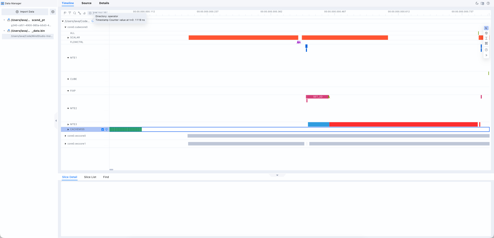
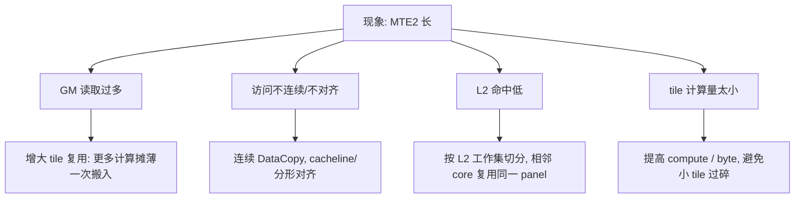
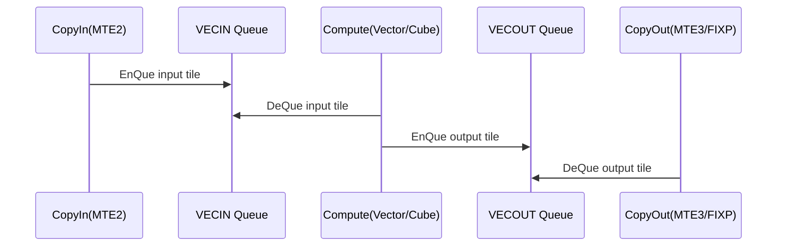

# 整体界面介绍



算子执行过程是一个多核并发的过程，所以在流水图中一级泳道按照AiCore进行分类，泳道名格式：core_id.coreTypeCoreId. coreType有两类：cube和vec。

## 泳道介绍

泳道可以分类3类：数据搬运类、控制流、计算流、统计事件

**数据搬运流**

计算时需要把数据搬入，计算完成后，再搬出，数据搬运流反映了数据搬入搬出的流水情况

MTE1泳道：L1 --> L0A/ L0B

MTE2泳道：GM --> L1、 GM--> L0A/L

MTE3泳道：UB--> GM

FixPipe泳道：L0->GM/L1

> 存储单元介绍可以参考：[存储单元-搬运单元介绍](https://gitcode.com/cann/asc-devkit/blob/master/docs/zh/guide/%E7%BC%96%E7%A8%8B%E6%8C%87%E5%8D%97/%E9%AB%98%E7%BA%A7%E7%BC%96%E7%A8%8B/%E7%A1%AC%E4%BB%B6%E5%AE%9E%E7%8E%B0/%E5%9F%BA%E6%9C%AC%E6%9E%B6%E6%9E%84.md#%E5%AD%98%E5%82%A8%E5%8D%95%E5%85%83%E5%92%8C%E6%90%AC%E8%BF%90%E5%8D%95%E5%85%83)

**控制流**

控制单元为整个计算过程提供了指令控制，负责整个Ai Core的运行控制，控制流泳道反映了计算过程中分支、循环等情况

FLOWCTRL泳道：控制流指令流水

**计算流**

SCALAR泳道：算子实现中scalar操作的流水情况

VECTOR泳道：vector核上执行的指令

CUBE泳道：cube核上执行的指令

**统计事件**

CACHE_MISS泳道：标志了cache_miss事件的发生

# 调优原则

AscendC是SPMD模型，即多个核心上运行同一份kernel，用block_idx处理不同的数据分片。因此流水掩盖在AscendC调优上非常重要。

流水图调优目标不是让某个流水最短，而是让计算流少等，搬运流少堵塞，多核负载均衡。理想状态是计算流和搬运流尽量充分掩盖。

# **瓶颈识别**

**负载不均衡**

多个核的pipe流水在时间长度上严重不同，说明各个核上的负载不均衡。

**MTE2瓶颈**：CopyIn瓶颈

MTE2主要负责将数据从GM、L2中将数据搬入L1、L0A/L0B，UB中， 如果流水图中MTE2长，计算流中空泡多，说明数据供给赶不上。



重点策略：

- `GM -> UB` 尽量大块连续搬运，避免很多小 DataCopy。
- `GM -> L1/L0A/B` 满足分形大小和 cacheline 对齐更优；官方存储文档明确提到 GM 到 L1/L0A/B 时满足 cacheline 对齐性能更好。
- Matmul 类算子优先让 A/B panel 在 L1/L2 中被多个 tile 复用。
- 如果 MTE2 无法被计算隐藏，增大 `baseM/baseN/baseK` 或增加每次 tile 的计算量。
- 如果 tile 已经很大但仍慢，检查是否把 L2/UB/L1 工作集撑爆，导致反复从 GM 读。

**MTE3或FIXP很长**：CopyOut瓶颈

MTE3 主要负责UB --> GM，FIXP负责L0C --> GM/L1 这些长说明输出写回，格式转换，量化后处理或小块写太重。

调优方向：

- 尽量 fuse 后处理：bias、scale、relu、cast、quant 不要多次落 GM。
- 输出写回保持连续和对齐，避免按列、小 stride、碎片化写。
- 减少中间结果写回 GM，能在 UB/L1/L0C 内完成就不要落外存。
- Matmul split-K 会增加 partial sum 写回和归约，只有 M/N 并行不足时再考虑。
- 如果 MTE3 长但 Vector/Cube 很短，说明算子 memory-bound，继续优化计算指令意义不大，应先减写流量。

**计算流很长且搬运流被完全掩盖**

Matmul/Conv 优先走 Cube，而不是用 Vector 模拟大规模乘加。

`baseM/baseN/baseK` 要匹配 Cube 指令粒度，避免尾块太多。

Vector 算子保证数据对齐、mask 合理、单次处理长度足够大。

对 compute-bound，不要盲目 double buffer 或继续减小 tile；更小 tile 可能只会增加调度和控制流开销。

检查是否存在大量 scalar 计算、地址计算、动态分支拖慢主循环。

**pip之间有较大的空洞：同步/队列/流水编排问题**



如果说MTE2搬完很久才开始计算或这计算结束后很久才开始搬运，常见原因有队列同步、buffer数量、stage排布或循环结构不合理

**. 串行 CopyIn / Compute / CopyOut**

问题代码：每个 tile 三段串行，MTE2 搬完后 Vector 才开始，Vector 算完后 MTE3 才写。

```c++
for (int i = 0; i < tileNum; ++i) {
    LocalTensor<half> x = inQueue.AllocTensor<half>();
    DataCopy(x, gmInput[i * tileLen], tileLen);   // MTE2
    inQueue.EnQue(x);

    LocalTensor<half> xLocal = inQueue.DeQue<half>();
    LocalTensor<half> y = outQueue.AllocTensor<half>();
    Adds(y, xLocal, half(1.0), tileLen);          // VECTOR
    inQueue.FreeTensor(xLocal);
    outQueue.EnQue(y);

    LocalTensor<half> yLocal = outQueue.DeQue<half>();
    DataCopy(gmOutput[i * tileLen], yLocal, tileLen); // MTE3
    outQueue.FreeTensor(yLocal);
}
```

优化后：拆成函数，并让当前 tile 计算时预取下一 tile。

```c++
pipe.InitBuffer(inQueue, 2, tileLen * sizeof(half));
pipe.InitBuffer(outQueue, 2, tileLen * sizeof(half));

CopyIn(0);

for (int i = 0; i < tileNum; ++i) {
    if (i + 1 < tileNum) {
        CopyIn(i + 1);      // MTE2 预取下一块
    }

    Compute(i);             // VECTOR 计算当前块
    CopyOut(i);             // MTE3 写回当前块
}
__aicore__ inline void CopyIn(int i) {
    LocalTensor<half> x = inQueue.AllocTensor<half>();
    DataCopy(x, gmInput[i * tileLen], tileLen);
    inQueue.EnQue(x);
}

__aicore__ inline void Compute(int i) {
    LocalTensor<half> x = inQueue.DeQue<half>();
    LocalTensor<half> y = outQueue.AllocTensor<half>();

    Adds(y, x, half(1.0), tileLen);

    inQueue.FreeTensor(x);
    outQueue.EnQue(y);
}

__aicore__ inline void CopyOut(int i) {
    LocalTensor<half> y = outQueue.DeQue<half>();
    DataCopy(gmOutput[i * tileLen], y, tileLen);
    outQueue.FreeTensor(y);
}
```

**2. buffer 数量不足**

问题代码：只有一个 input buffer，却试图预取下一块，`AllocTensor()` 可能等待前一块释放。

```c++
pipe.InitBuffer(inQueue, 1, tileLen * sizeof(half));
pipe.InitBuffer(outQueue, 1, tileLen * sizeof(half));

CopyIn(0);

for (int i = 0; i < tileNum; ++i) {
    if (i + 1 < tileNum) {
        CopyIn(i + 1);      // 可能卡在 AllocTensor
    }

    Compute(i);
    CopyOut(i);
}
```

优化后：输入/输出队列使用 double buffer。

```c++
pipe.InitBuffer(inQueue, 2, tileLen * sizeof(half));
pipe.InitBuffer(outQueue, 2, tileLen * sizeof(half));

CopyIn(0);

for (int i = 0; i < tileNum; ++i) {
    if (i + 1 < tileNum) {
        CopyIn(i + 1);
    }

    Compute(i);
    CopyOut(i);
}
```

如果 `CopyOut` 明显更慢，可以只给输出侧增加 buffer，但要检查 UB 是否足够：

```c++
pipe.InitBuffer(inQueue, 2, tileBytes);
pipe.InitBuffer(outQueue, 2, tileBytes);  // 常规先用 2
```

**3. EnQue / DeQue 顺序错误**

问题代码：`Compute()` 先 `DeQue()`，但 `CopyIn()` 还没发生，Vector 会等待输入队列。

```c++
for (int i = 0; i < tileNum; ++i) {
    Compute(i);     // DeQue 等待
    CopyIn(i);
    CopyOut(i);
}
```

优化后：保证 `Compute(i)` 之前 `CopyIn(i)` 已经入队。

```c++
CopyIn(0);

for (int i = 0; i < tileNum; ++i) {
    if (i + 1 < tileNum) {
        CopyIn(i + 1);
    }

    Compute(i);
    CopyOut(i);
}
```

更保守的单 buffer 版本至少应这样排：

```c++
for (int i = 0; i < tileNum; ++i) {
    CopyIn(i);
    Compute(i);
    CopyOut(i);
}
```

虽然不重叠，但不会出现 `DeQue` 等不到数据的错误依赖。

**4. FreeTensor 太晚**

问题代码：输入 tensor 用完后没有及时释放，后续 `CopyIn` 没有可用 buffer。

```c++
LocalTensor<half> saved[8];

for (int i = 0; i < tileNum; ++i) {
    CopyIn(i);

    LocalTensor<half> x = inQueue.DeQue<half>();
    LocalTensor<half> y = outQueue.AllocTensor<half>();

    Adds(y, x, half(1.0), tileLen);

    saved[i % 8] = x;       // 错误：占住 input buffer
    outQueue.EnQue(y);

    CopyOut(i);
}

for (int k = 0; k < 8; ++k) {
    inQueue.FreeTensor(saved[k]);
}
```

优化后：数据一旦不再参与计算，立即释放。

```c++
for (int i = 0; i < tileNum; ++i) {
    CopyIn(i);

    LocalTensor<half> x = inQueue.DeQue<half>();
    LocalTensor<half> y = outQueue.AllocTensor<half>();

    Adds(y, x, half(1.0), tileLen);

    inQueue.FreeTensor(x);  // 及时释放
    outQueue.EnQue(y);

    CopyOut(i);
}
```

放入 pipeline 版本：

```c++
CopyIn(0);

for (int i = 0; i < tileNum; ++i) {
    if (i + 1 < tileNum) {
        CopyIn(i + 1);
    }

    LocalTensor<half> x = inQueue.DeQue<half>();
    LocalTensor<half> y = outQueue.AllocTensor<half>();

    Adds(y, x, half(1.0), tileLen);

    inQueue.FreeTensor(x);
    outQueue.EnQue(y);

    CopyOut(i);
}
```

**5. CopyOut 被推迟到循环结束**

问题代码：Vector 算完很多 tile 后，MTE3 才集中写，导致 MTE3 拖尾。

```c++
for (int i = 0; i < tileNum; ++i) {
    CopyIn(i);
    Compute(i);     // 只 EnQue output
}

// MTE3 被推迟到最后
for (int i = 0; i < tileNum; ++i) {
    CopyOut(i);
}
```

优化后：每个 tile 算完后尽快写回。

```c++
CopyIn(0);

for (int i = 0; i < tileNum; ++i) {
    if (i + 1 < tileNum) {
        CopyIn(i + 1);
    }

    Compute(i);
    CopyOut(i);     // 尽快启动 MTE3
}
```

如果 `CopyOut` 特别长，可以考虑把下一轮 `CopyIn` 前置，至少让写回和后续搬入/计算交错：

```c++
CopyIn(0);

for (int i = 0; i < tileNum; ++i) {
    if (i + 1 < tileNum) {
        CopyIn(i + 1);
    }

    Compute(i);

    // 当前输出入队后立即写回，不累计到最后
    CopyOut(i);
}
```

**6. 先搬完所有输入，再全部计算，再全部写回**

问题代码：按 stage 批处理，UB 队列容量不够时会阻塞；即使容量够，也没有流水重叠。

```c++
for (int i = 0; i < tileNum; ++i) {
    CopyIn(i);
}

for (int i = 0; i < tileNum; ++i) {
    Compute(i);
}

for (int i = 0; i < tileNum; ++i) {
    CopyOut(i);
}
```

优化后：按 tile 推进流水。

```c++
pipe.InitBuffer(inQueue, 2, tileBytes);
pipe.InitBuffer(outQueue, 2, tileBytes);

CopyIn(0);

for (int i = 0; i < tileNum; ++i) {
    if (i + 1 < tileNum) {
        CopyIn(i + 1);
    }

    Compute(i);
    CopyOut(i);
}
```

更完整的三阶段 steady-state 写法：

```c++
// prologue
CopyIn(0);

for (int i = 0; i < tileNum; ++i) {
    // stage 1: prepare next
    if (i + 1 < tileNum) {
        CopyIn(i + 1);
    }

    // stage 2: consume current
    Compute(i);

    // stage 3: write current result
    CopyOut(i);
}
```

**7. 不必要的全 pipe barrier**

问题代码：每段之后都 `PIPE_ALL`，强行把可并行的 pipe 串起来。

```c++
for (int i = 0; i < tileNum; ++i) {
    CopyIn(i);
    AscendC::PipeBarrier<PIPE_ALL>();

    Compute(i);
    AscendC::PipeBarrier<PIPE_ALL>();

    CopyOut(i);
    AscendC::PipeBarrier<PIPE_ALL>();
}
```

优化后：减少重同步，优先依赖队列语义。只在确实存在跨 pipe 数据可见性要求时加最小范围 barrier。

```c++
CopyIn(0);

for (int i = 0; i < tileNum; ++i) {
    if (i + 1 < tileNum) {
        CopyIn(i + 1);
    }

    // DeQue 本身表达了对 CopyIn(i) 完成的依赖
    Compute(i);

    // DeQue output 本身表达了对 Compute(i) 产出完成的依赖
    CopyOut(i);
}
```

如果必须同步，缩小范围：

```c++
// 示例：仅在特定 pipe 间确实需要时使用更小范围同步
AscendC::PipeBarrier<PIPE_V>();
```

不要把 `PIPE_ALL` 当成默认安全垫放进热循环。

**8. tile 太小导致控制开销高**

问题代码：每次处理很少元素，`Alloc/EnQue/DeQue/Free` 和循环控制占比过高。

```c++
constexpr int tileLen = 64;  // 太小，示意

for (int i = 0; i < tileNum; ++i) {
    CopyIn(i);
    Compute(i);
    CopyOut(i);
}
```

优化后：增大 tile 或合并多个小 tile。

```c++
constexpr int tileLen = 1024;  // 按 UB 容量、对齐和算子特性选择

CopyIn(0);

for (int i = 0; i < tileNum; ++i) {
    if (i + 1 < tileNum) {
        CopyIn(i + 1);
    }

    Compute(i);
    CopyOut(i);
}
```

或者合并多个小任务：

```c++
constexpr int smallTilesPerGroup = 4;

for (int g = 0; g < groupNum; ++g) {
    CopyInGroup(g, smallTilesPerGroup);
    ComputeGroup(g, smallTilesPerGroup);
    CopyOutGroup(g, smallTilesPerGroup);
}
```

优化目标：

```text
减少循环次数
减少 EnQue/DeQue 次数
让单次 Vector/Cube 指令处理足够长
让 CopyIn/Compute/CopyOut 有重叠空间
```

**9. tail 分支在主循环里**

问题代码：每个 tile 都判断尾块，`FLOWCTRL/SCALAR` 插入热路径。

```c++
for (int i = 0; i < tileNum; ++i) {
    int len;
    if (i == tileNum - 1) {
        len = tailLen;
    } else {
        len = tileLen;
    }

    CopyIn(i, len);
    Compute(i, len);
    CopyOut(i, len);
}
```

优化后：完整 tile 主循环无分支，tail 单独处理。

```c++
for (int i = 0; i < fullTileNum; ++i) {
    CopyIn(i, tileLen);
    Compute(i, tileLen);
    CopyOut(i, tileLen);
}

if (tailLen > 0) {
    CopyInTail(fullTileNum, tailLen);
    ComputeTail(fullTileNum, tailLen);
    CopyOutTail(fullTileNum, tailLen);
}
```

如果要结合 double buffer：

```c++
if (fullTileNum > 0) {
    CopyIn(0, tileLen);

    for (int i = 0; i < fullTileNum; ++i) {
        if (i + 1 < fullTileNum) {
            CopyIn(i + 1, tileLen);
        }

        Compute(i, tileLen);
        CopyOut(i, tileLen);
    }
}

if (tailLen > 0) {
    CopyInTail(fullTileNum, tailLen);
    ComputeTail(fullTileNum, tailLen);
    CopyOutTail(fullTileNum, tailLen);
}
```

**10. 重复初始化对象或 tiling 参数**

问题代码：在 tile 内层循环中重复做对象注册、配置或复杂 tiling 分支，导致 `SCALAR/FLOWCTRL` 密集。

```c++
for (int i = 0; i < tileNum; ++i) {
    REGIST_MATMUL_OBJ(&pipe, workspace, matmulObj, &tiling);
    InitTilingParams(runtimeShape, tiling);

    CopyIn(i);
    MatmulCompute(i);
    CopyOut(i);
}
```

优化后：能外提的初始化外提，tile 内只保留稳定热路径。

```c++
REGIST_MATMUL_OBJ(&pipe, workspace, matmulObj, &tiling);
InitTilingParams(runtimeShape, tiling);

CopyIn(0);

for (int i = 0; i < tileNum; ++i) {
    if (i + 1 < tileNum) {
        CopyIn(i + 1);
    }

    MatmulCompute(i);
    CopyOut(i);
}
```

如果不同 shape/场景分支差异大，用 tiling key 或模板特化拆开：

```c++
if (tilingKey == SMALL_M) {
    RunSmallMKernel();
} else if (tilingKey == LARGE_K) {
    RunLargeKKernel();
} else {
    RunDefaultKernel();
}
```

每个 `RunXxxKernel()` 内部保持简单、稳定、少分支。

**推荐对比模板**

问题版：

```C++
for (int i = 0; i < tileNum; ++i) {
    if (IsTail(i)) {
        PrepareTail();
    }

    InitSomething();

    CopyIn(i);
    AscendC::PipeBarrier<PIPE_ALL>();

    Compute(i);
    AscendC::PipeBarrier<PIPE_ALL>();

    SaveForLater(i);
}

for (int i = 0; i < tileNum; ++i) {
    CopyOut(i);
}
```

优化版：

```c++
InitOnce();
PrepareMainLoopParams();

pipe.InitBuffer(inQueue, 2, tileBytes);
pipe.InitBuffer(outQueue, 2, tileBytes);

if (fullTileNum > 0) {
    CopyIn(0);

    for (int i = 0; i < fullTileNum; ++i) {
        if (i + 1 < fullTileNum) {
            CopyIn(i + 1);
        }

        Compute(i);
        CopyOut(i);
    }
}

if (tailLen > 0) {
    ProcessTail();
}
```

调优方向：

- 常规流水用 `TQue depth=1`，不要误把 queue depth 当成 double buffer。
- double buffer 是 `InitBuffer(..., num=2, ...)`，需要额外 UB/L1 空间。
- 循环次数太少时 double buffer 收益有限；官方文档也提醒小数据或计算显著长于搬运时，double buffer 可能收益很小甚至变差。
- 避免 `CopyIn(); Compute(); CopyOut();` 完全串行处理所有 tile，应按 tile 循环形成流水。
- 同步线过多时，检查是否用了不必要的 barrier、重复 EnQue/DeQue、跨 stage 临时 buffer 复用错误。

**控制流占比过多：SCALAR/FLOWCTRL 高**

典型原因：

```text
内层循环里频繁 if/else
每个 tile 都判断 tail
动态 shape 分支太多
地址计算复杂
tile 太小，控制开销占比变大
```

调优方向：

```text
主循环走无分支 fast path
tail 单独处理
host tiling 阶段提前决定分支
常量、stride、offset 预计算
必要时按 tiling key 拆 kernel 或拆函数
适度 unroll，但避免代码膨胀
```

**CACHEMISS：局部指令性差**

```text
热路径代码过大
模板展开或 unroll 过度
一个 kernel 内塞太多场景分支
不常用路径和主路径混在一起
```

调优方向：

```text
缩小主循环代码体积
拆冷路径
按 tiling key 或场景特化
降低过度 unroll
避免在一个 kernel 内处理过多完全不同模式
```

**慢核拖尾**

```text
block_idx 切分不均
tail 全落到某一个 core
小 shape 下 blockDim 过大或过小
某些 core 处理的数据访问更差
多核访问区域太分散，L2 复用差
```

调优方向：

```text
均匀切分任务
tail 分摊到多个 core
小任务合并，大任务拆分
二维切分 M/N，避免单维 tail 过重
相邻 core 处理相邻 tile，提高 L2 局部性
```
