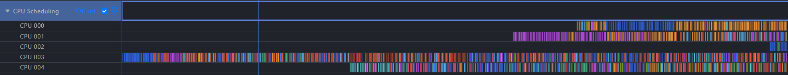

# Loading Linux Kernel ftrace Data into MindStudio Insight for Joint Host Bound Analysis

[Simplified Chinese](ReadMe.zh-CN.md) | English

## Release Notes (2026/6/29)

- Added `trace_analyze.py`, an automated analysis script that generates summary reports from ftrace DB files. You can also import the ftrace DB directly into MindStudio Insight and view the analysis results in the system views.
- Added support for the debugfs collection mode and compatibility checks for `trace-cmd`. If `trace-cmd` is not installed or the installed version does not meet the requirements, the script automatically falls back to tracefs/debugfs for ftrace data collection.
- Enhanced the MindStudio Insight import capability by removing ftrace data format restrictions. ftrace DB data can now be imported together with Profiling TEXT/DB data for joint analysis.
- Improved tool usability and fixed multiple issues, including safeguards for exceptional scenarios, warnings for ring buffer overwritten/lost events, and inaccurate interrupt event parsing caused by overwritten trace data.

## Background

In large model systems, the CPU is mainly responsible for dispatching tasks, while the NPU executes compute workloads. Host Bound issues are commonly observed in production for both training and inference. Diagnosing these issues usually requires Linux kernel ftrace data so that process scheduling behavior on CPUs can be analyzed.

There has been a lack of tooling that integrates Profiling data with Linux kernel ftrace data for joint analysis. MindStudio Insight provides a set of scripts in this repository to help developers combine the two types of data and improve the efficiency of Host Bound issue diagnosis.

## Host Bound Troubleshooting Approach

1. Apply general scheduling optimizations first, including the common first-line optimizations of CPU affinity, pipeline optimization, and memory allocator replacement. For PyTorch framework scheduling optimization, see [Scheduling Optimization - Ascend Extension for PyTorch](https://www.hiascend.com/document/detail/zh/Pytorch/720/ptmoddevg/trainingmigrguide/performance_tuning_0059.html).
2. If the general optimizations do not deliver the expected result, collect data for deeper analysis. It is recommended that ftrace data and Profiling data be collected together. For Profiling data collection, see the [MindStudio Profiler Tool Guide](https://mindstudio-profiler-docs.readthedocs.io/zh-cn/latest/msprof/).
3. Convert ftrace data into a format that can be recognized by MindStudio Insight.
4. Import ftrace data and Profiling data together, and analyze process scheduling behavior.

## 1. Tool Capability Overview

`ftrace_tools` is used to collect, convert, and analyze Linux kernel ftrace data. It helps diagnose scheduling latency, frequent context switches, IRQ/SoftIRQ interruptions, and related issues.

| Script | Purpose | Main Output |
| --- | --- | --- |
| `trace_record.py` | Collects ftrace events such as sched, irq, and softirq events | `trace.dat` or `trace.txt`, `pid_mapping.json` |
| `trace_convert.py` | Converts raw ftrace data into a format that can be imported into MindStudio Insight | `ftrace_data.db` or `.json` |
| `trace_analyze.py` | Performs statistical analysis on the DB generated by `trace_convert.py` and exports an Excel report | `<input>_report.xlsx` |

Typical workflow:

```text
trace_record.py (collect)
      |
      v
trace_convert.py (convert to DB/JSON and optionally align with the Profiling timeline)
      |
      v
MindStudio Insight (visual joint analysis) or trace_analyze.py (statistical analysis)
```

## 2. Prerequisites

- Python 3.10+
- Optional: `trace-cmd`. If it is not installed or unavailable, `trace_record.py --backend=auto` falls back to the tracefs/debugfs backend.
- `openpyxl` is required when using `trace_analyze.py` to generate Excel reports.

Installation examples:

```bash
# Ubuntu
sudo apt-get install trace-cmd

# CentOS
sudo yum install trace-cmd

# Dependency for trace_analyze.py
pip install openpyxl
```

### 2.1 trace-cmd and Linux Kernel Constraints

When `trace_record.py` starts, it automatically checks the command-line options required by the trace-cmd backend and the ftrace capabilities of the kernel. In most cases, you can use the default `--backend=auto`: if the trace-cmd backend is unavailable, the script attempts to fall back to the tracefs/debugfs backend.

If `--backend=trace-cmd` is explicitly specified but the current `trace-cmd` or kernel ftrace capabilities do not meet the requirements, the script reports an error and prints troubleshooting guidance.

For detailed requirements and manual troubleshooting, see [8.6 What are the trace-cmd and kernel requirements for the trace-cmd backend?](#trace-cmd-kernel-requirements).

## 3. Collecting ftrace Data

### 3.1 Command-Line Collection

```bash
sudo python trace_record.py --record_time=30 --cpu=0-15 --output=trace.dat
```

Common parameters:

| Parameter | Description | Default |
| --- | --- | --- |
| `--cpu` | CPU mask. Formats such as `0,1,4`, `0-3,8`, and `0-15` are supported | Collects all CPUs |
| `--output` | Output file path. If not specified, the default file name is determined by the backend | `trace.dat` for the trace-cmd backend; `trace.txt` for the debugfs backend |
| `--record_time` | Collection duration in seconds. `<=0` means continuous collection, which must be stopped with `Ctrl+C` | `30` |
| `--bf_size` | ftrace ring buffer size in KB. Increase this value when the data volume is large | `40960` |
| `--backend` | `auto`, `trace-cmd`, or `debugfs` | `auto` |
| `--sched` | Whether to collect scheduling events | `1` |
| `--irq` | Whether to collect IRQ/SoftIRQ events | `1` |
| `--NSpid` | Dumps the mapping between container PIDs and host PIDs in container scenarios | Disabled |

It is recommended that no more than 64 CPU cores be collected and that the collection duration be around 30 seconds. If the collection scope is too large, the event volume is too high, or the disk is slow, stopping collection and subsequent conversion may take a long time.

### 3.2 Backend Differences

| Backend | Typical Input/Output | Description |
| --- | --- | --- |
| `trace-cmd` | Outputs `trace.dat` | Recommended when available. Requires `trace-cmd` to be installed on the system |
| `debugfs` / `tracefs` | Outputs `trace.txt` | Does not depend on `trace-cmd`. When collection stops, a text snapshot needs to be copied from the tracing file system, which can take longer for large data volumes |

Example: force the debugfs backend.

```bash
sudo python trace_record.py --backend=debugfs --record_time=30 --cpu=0-15 --output=trace.txt --NSpid
```

If the collection log reports lost or overwritten events, the ring buffer experienced data loss or overwrite. Increase `--bf_size` first. You can also shorten the collection duration, reduce the event types, or narrow the CPU range before collecting again.

## 4. Converting ftrace Data

`trace_convert.py` converts `trace.dat` or `trace.txt` into a SQLite DB or Chrome Trace JSON file that can be imported into MindStudio Insight. It can also align the ftrace timeline with a Profiling directory.

```bash
python trace_convert.py \
  --input trace.dat \
  --output ftrace_data.db \
  --format db \
  --profiling_data /path/to/profiling/xxxx_ascend_pt \
  --pid_mapping pid_mapping.json
```

Parameters:

| Parameter | Description | Default |
| --- | --- | --- |
| `--input` | 输入的原始 ftrace 文件。trace-cmd 后端通常为 `.dat`，debugfs 后端通常为 `.txt` | `trace.dat` |
| `--output` | 输出文件路径。后缀必须与 `--format` 匹配 | `ftrace_data.db` |
| `--format` | 输出格式，支持 `db` 或 `json` | `db` |
| `--cpu` | 转换阶段的 CPU 过滤掩码，支持 `0`、`0,1,4`、`0-3,8`、`0-15` 等写法；未选中的 CPU 事件会在时间转换和 PID 映射前跳过 | 转换全部 CPU |
| `--profiling_data` | Profiling 数据目录，用于 ftrace 与 Profiling 时间轴对齐 | 不启用 |
| `--pid_mapping` | 容器 PID 映射文件，用于把宿主机 PID 转为容器内 PID | 不启用 |

### 4.1 Output Format and Suffix Requirements

`--format` must match the suffix of `--output`. If they do not match, the script exits with an error to prevent JSON content from being saved as `.db` or DB content from being saved as `.json`.

| `--format` | `--output` Requirement | Example |
| --- | --- | --- |
| `db` | Must end with `.db`, and the file name must contain `ftrace_data` (case-sensitive) | `--format=db --output=ftrace_data.db` |
| `json` | Must end with `.json` | `--format=json --output=ftrace_data.json` |

Common commands:

```bash
# trace-cmd output: trace.dat -> SQLite DB (default)
python trace_convert.py --input=trace.dat --output=ftrace_data.db --format=db

# debugfs output: trace.txt -> SQLite DB. Note that --input must be specified explicitly.
python trace_convert.py --input=trace.txt --output=ftrace_data.db --format=db

# Output Chrome Trace JSON
python trace_convert.py --input=trace.dat --output=ftrace_data.json --format=json

# 只转换指定 CPU，减少转换耗时和输出大小
python trace_convert.py --input=trace.dat --output=ftrace_cpu0_15.db --format=db --cpu=0-15
```

> The debugfs mode usually outputs `trace.txt`. If a stale default file named `trace.dat` still exists in the same directory and `--input=trace.txt` is not explicitly specified during conversion, the script reads the default `trace.dat` instead of the latest debugfs collection result.

### 4.2 Profiling Timeline Alignment

After `--profiling_data` is specified, `trace_convert.py` reads `start_info` and `end_info` in the Profiling directory and converts the ftrace timestamps to the Profiling timeline, making joint analysis in MindStudio Insight easier.

```bash
python trace_convert.py \
  --input=trace.dat \
  --output=ftrace_data.db \
  --format=db \
  --profiling_data=/path/to/profiling/xxxx_ascend_pt
```

In multi-card scenarios, `--profiling_data` can point to the parent directory that contains data for multiple cards, or to any single-card data directory.

### 4.3 Container PID Mapping

When a container is not started with `--pid=host`, Profiling sees container-internal PIDs, while ftrace collects host PIDs. In this case:

1. Enable `--NSpid` during collection to generate `pid_mapping.json`.
2. Specify `--pid_mapping=pid_mapping.json` during conversion.

```bash
sudo python trace_record.py --record_time=30 --cpu=0-15 --NSpid
python trace_convert.py --input=trace.dat --output=ftrace_data.db --format=db --pid_mapping=pid_mapping.json
```

## 5. Importing Data into MindStudio Insight

It is recommended that you use the SQLite DB generated by `trace_convert.py` by default:

```bash
python trace_convert.py --input=trace.dat --output=ftrace_data.db --format=db --profiling_data=/path/to/profiling
```

The current version supports importing ftrace DB data and Profiling TEXT/DB data into the same project. The general workflow is as follows:

1. Import Profiling data into MindStudio Insight first.
2. Continue importing `ftrace_data.db` into the same project.
3. Analyze Host Bound issues by using the CPU Scheduling, Process Scheduling, and Profiling views together.

JSON output is mainly intended for scenarios that require Chrome Trace JSON or where external tools support only JSON:

```bash
python trace_convert.py --input=trace.dat --output=ftrace_data.json --format=json
```

## 6. Statistical Analysis: trace_analyze.py

To perform offline summary statistics on an ftrace DB and generate an Excel report, run:

```bash
python trace_analyze.py --input ftrace_data.db --output ftrace_report.xlsx
```

For details about output sheets, metrics, and charts, see [trace_analyze_README.md](trace_analyze_README.md).

## 7. Complete Example

- For a complete vllm-ascend container example that collects ftrace on the host, collects Profiling data in the container, and imports both into MindStudio Insight for joint analysis, see [docs/vllm_ascend_example.md](docs/vllm_ascend_example.md).

## 8. FAQ

### 8.1 The converted `.db` file cannot be opened by SQLite

First, check whether `--format` and `--output` in the conversion command match:

- `--format=db` must output a `.db` file.
- `--format=json` must output a `.json` file.

The latest version of `trace_convert.py` enforces this rule. If you are using an earlier version of the script, JSON content may be saved into a `.db` file, causing SQLite tools to fail when opening it.

### 8.2 Why must `--input=trace.txt` be specified after collecting data with debugfs?

The debugfs backend generates `trace.txt` by default. However, to remain compatible with the trace-cmd workflow, the default input of `trace_convert.py` is still `trace.dat`.

Therefore, if an old `trace.dat` remains in the directory, the following command converts the old `trace.dat` instead of the `trace.txt` collected by the current debugfs run:

```bash
python trace_convert.py --output=ftrace_data.db --format=db
```

After collecting data with debugfs, specify the input explicitly:

```bash
python trace_convert.py --input=trace.txt --output=ftrace_data.db --format=db
```

### 8.3 Large blank areas appear on some CPU cores in ftrace data



Possible causes:

1. The ring buffer was overwritten or events were lost. If the collection log reports lost or overwritten events, increase `--bf_size`, shorten the collection duration, reduce events, or narrow the CPU range.
2. The CPU did not capture target events during the target time range, or it was not actually used by the workload.

### 8.4 trace-cmd record times out when stopping

When the collected data volume is large, cleanup after `trace-cmd record` can take a long time. You can narrow the collection scope, shorten the collection duration, or adjust the stop-wait parameter in the script based on your environment.

### 8.5 Can ftrace collection be used directly inside a container?

Yes, but the container must meet additional permission and mount requirements. ftrace depends on the host kernel tracing file system, and ordinary non-privileged containers usually cannot directly access or configure these kernel interfaces.

It is recommended that the container be started with the following conditions:

1. **Use a privileged container**: For example, add `--privileged` when starting the container with Docker to ensure that the container has the permissions required to configure the kernel tracing subsystem.
2. **Mount host tracing/debugfs directories**: At minimum, the container must be able to access the ftrace control files. Common mount directories include:
   - `/sys/kernel/tracing`
   - `/sys/kernel/debug`
3. **Confirm read/write permissions on ftrace control files in the container**: The collection script needs to write files such as `tracing_on`, `set_event`, `events/*/enable`, and `trace`.
4. **Pay attention to PID namespace differences**:
   - If the container is not started with `--pid=host`, the PID/TID values inside the container differ from the PID/TID values seen by the host kernel.
   - ftrace collects process and thread IDs from the host kernel perspective.
   - Without PID mapping, later joint analysis with in-container Profiling data may fail to accurately match application processes and threads inside the container.
   - It is recommended that you enable `--NSpid` during collection to generate `pid_mapping.json`, and then specify `--pid_mapping=pid_mapping.json` during conversion to complete PID mapping.

If these conditions cannot be met, collect ftrace data on the host and use `--NSpid` / `--pid_mapping` to handle container PID mapping.

### 8.6 What are the trace-cmd and kernel requirements for the trace-cmd backend? <a id="trace-cmd-kernel-requirements"></a>

The current trace-cmd backend has been validated with `trace-cmd 2.9.6` and Linux kernel `5.4`. In general, environments with versions no earlier than the validated versions are more likely to provide the required capabilities. However, different distributions may include backported patches, feature reductions, or kernel configuration differences. Therefore, the tool does not rely on a fixed version number as the only criterion. Instead, it checks the actual functional capabilities.

trace-cmd must support:

- `trace-cmd record -C <clock>`: The current script uses `-C mono_raw` for timeline alignment.
- `trace-cmd record -M <cpu_mask>`: Specifies the CPU collection range.
- `trace-cmd record -e <event>`: Enables sched / irq tracepoints.
- `trace-cmd report -i <trace.dat>`: Parses trace-cmd output when converting `.dat` files.

The Linux kernel must support:

- ftrace / tracefs or debugfs.
- The `mono_raw` trace clock. You can check it by running `cat /sys/kernel/tracing/trace_clock` or `cat /sys/kernel/debug/tracing/trace_clock`.
- The tracepoints required by the default collection configuration: `sched:*` and `irq:*`.

In container scenarios, if `trace_record.py --backend=trace-cmd` is executed inside the container, the script calls the `trace-cmd` executable available in the container. Therefore, support for command-line options such as `record -C`, `record -M`, and `report -i` depends on the trace-cmd version inside the container. However, the actual ftrace collection capability depends on the host kernel and on whether `/sys/kernel/tracing` or `/sys/kernel/debug/tracing` is mounted correctly into the container. The trace-cmd backend is available only when the trace-cmd version in the container, the host kernel tracing capabilities, and the container mount permissions all meet the requirements.
