# Using MindStudio Insight to Load Linux Kernel Data for Joint Analysis of Host Bound Problems

<!-- md-trans-meta sourceCommit=8ba87048c67a1e13d2b4097e6b7e7ed22a41559a translatedAt=2026-08-17T09:38:43.353Z pushedAt=2026-08-17T10:06:33.829Z -->

## Problem Background

In large models, the CPU is mainly responsible for task dispatch, while the NPU is responsible for executing compute tasks. In both training and inference, Host Bound is a frequently occurring issue in live networks. Analyzing Host Bound issues usually requires collecting Linux Kernel ftrace data to analyze process scheduling on the CPU.

Currently, there is a lack of a tool that can integrate profile data and Linux Kernel ftrace data for joint analysis. In this repository, MindStudio Insight provides some tool scripts to help developers perform joint analysis of the two types of data, improving the efficiency of locating Host Bound issues.

## Features

+ Support ftrace data collection in two modes: **command line** and **API**

+ Support converting ftrace format data to SQLite DB format (default) or Chrome Trace JSON format, and **importing it together with profile data** into MindStudio Insight for visual display

+ Support running models **inside containers** while collecting Linux Kernel ftrace data on the host, with seamless PID mapping

## Host Bound Problem Locating Approach

1. Try common scheduling optimization methods, including the three common approaches of CPU core binding, pipeline optimization, and memory allocation library replacement. For scheduling optimization of the Ascend for PyTorch framework, refer to [Scheduling Optimization](https://www.hiascend.com/document/detail/en/Pytorch/latest/ptmoddevg/trainingmigrguide/FrameworkPTAdapter/26.0.0/en/pytorch_model_migration_fine_tuning/pipeline_opt.md).

2. If the common optimization methods do not achieve the expected results, collect data for further in-depth analysis. It is recommended to collect ftrace and profile data simultaneously. For details about the profiling collection method, see: [MindStudio Profiler Tool Guide](https://gitcode.com/Ascend/msprof/blob/master/README.md).

3. Convert the ftrace data into a data format recognizable by MindStudio Insight.

4. Import the ftrace data and profile data simultaneously to analyze process scheduling.

## Model Profiling

Refer to the Ascend community documentation on profiling collection: [Introduction](https://www.hiascend.com/document/detail/en/CANNCommunityEdition/910/devaids/Profiling/atlasprofiling_16_0001.html)

> Note the profiling configuration. Currently only supports joint import of ftrace and text-type profile data, and does not currently support joint import with DB-type profile data.

## Linux Kernel ftrace Data Collection

### 1. Introduction

The Linux kernel provides a variety of built-in trace tools. Among them, ftrace, a tracing framework introduced into the mainstream kernel starting from version 2.6.27, can be used to monitor and debug various events occurring in the kernel, helping developers deeply analyze the internal behavior of the system at runtime. ftrace supports multiple tracers, such as function call tracing, context switch tracing, and interrupt latency analysis, which can effectively assist in locating kernel-mode performance issues and scheduling anomalies.
In this repository, collection capabilities are provided for CPU process scheduling-related events (sched) and interrupt/softirq-related events (irq).

trace-cmd is a command-line tool that encapsulates the trace collection process and provides a simpler command interface.

### 2. Data Collection Prerequisites

+ Install the trace-cmd command.

  Ubuntu: `sudo apt-get install trace-cmd`

  CentOs: `sudo yum install trace-cmd`

+ Obtain the collection and conversion scripts `trace_record.py` and `trace_convert.py` provided in the repository. Synchronous collection of profiling and ftrace data is recommended.

> If the target environment does not support installing trace-cmd, you can use the built-in tracefs/debugfs collection mode of the script. This mode configures ftrace directly through the kernel tracing file system and outputs a trace file in text format. For usage differences, see [tracefs/debugfs mode support](#tracefsdebugfs-mode-support) below.

### 3. ftrace Data Collection

Both **command-line** and **API interface** methods are supported for ftrace data collection.

#### Method 1: Command-line Collection

This method does not require modifying existing code. It uses the `trace_record.py` script as a whole, making it easy to get started, but the degree of customization is relatively limited.

**Option Description**

| Option | Description | Example | Default Value |
|-----|-----|-----|-----|
| `--cpu` | cpu_mask list, specifying the CPU cores to collect. Supports a single number, comma-separated values, and hyphen ranges. | `--cpu=0,1,4 (specified cores)`<br>`--cpu=0-3,8 (mixed notation)`<br>`--cpu=0-15 (range notation)` | None, collects **all** CPU cores |
| `--output` | Output file path and file name. | `--output=my_trace_data.dat` | `trace.dat` |
| `--record_time` | Collection duration (unit: seconds).<br>• Positive value: automatically stops after collecting for the specified number of seconds;<br>• ≤ 0: collects continuously and requires `Ctrl+C` to terminate manually. Note the disk space usage during long-term collection. | `--record_time=30` | 30 |
| `--bf_size` | The **ring buffer size (unit: KB)** used by the script, which caches ftrace events on the kernel side.<br>When the amount of collected data is large, you can increase this value appropriately to avoid **trace event loss** caused by ring buffer data overwriting. If overwriting occurs, a warning is printed in the echo when collection ends. For the tracefs/debugfs mode, a value greater than 40960 KB is recommended. | `--bf_size=40960` | `40960` |
| `--backend` | ftrace collection backend.<br>• `auto` default mode, which prioritizes trace-cmd and automatically falls back to tracefs/debugfs when trace-cmd is unavailable;<br>• `trace-cmd` forces the use of trace-cmd;<br>• `debugfs` forces the use of the tracefs/debugfs mode. | `--backend=debugfs` | `auto` |
| `--sched` | Whether to collect **CPU scheduling-related events**, including task switching, wakeup, and new task startup (such as `sched_switch`, `sched_wakeup`, `sched_wakeup_new`).<br>Mainly used to analyze **scheduling latency, task switching frequency, and thread wakeup relationships**.<br>• `1`: enabled<br>• `0`: disabled | `--sched=1`<br>`--sched=0` | `1` (enabled) |
| `--irq` | Whether to collect **interrupt/softirq-related events**, including the entry, exit, and triggering behavior of hard interrupts and softirqs.<br>Mainly used to analyze **interrupt load, softirq jitter, and situations where the CPU is interrupted**.<br>• `1`: enabled<br>• `0`: disabled | `--irq=1`<br>`--irq=0` | `1` (enabled) |
| `--NSpid` | Enables this switch in container scenarios to obtain the PID mapping relationship between the container and the host. For details, see [Collection in the PID Namespace Isolation Scenario Inside and Outside Containers](#5-collection-in-the-pid-namespace-isolation-scenario-inside-and-outside-containers). | `--NSpid` | Disabled |

**Usage Example:**

Scenario: Collect 30 seconds of training data from CPU cores `0-4`

**1. Start data collection (root permission required):**

```bash
sudo python trace_record.py --record_time=30 --cpu=0,1,2,3,4
```

**Note:** The `--cpu=0,1,2,3,4` here is only an example. In actual usage, it is recommended to select a certain number of CPU cores for collection based on the core binding policy (**it is recommended that the number of CPU cores collected does not exceed 64 and the collection duration is about 30s; otherwise, the amount of collected data may be too large, and parsing and writing to disk may take a long time, so wait patiently**).

**2. Run the training task (in a new terminal):**

```bash
python train.py
```

**3. Collection result:**

The script stops automatically after running for 30 seconds and generates a `trace.dat` file by default (or you can specify the file name through the `--output` option).

> **tracefs/debugfs mode:** When `--backend=debugfs` is used (or the default `--backend=auto` is used and trace-cmd is not available in the environment), the script output is automatically adjusted to a text-format trace file, generating a `trace.txt` file by default (or a file name specified by the --output parameter).

#### Method 2: API Collection

`trace_record.py` provides two interfaces that control the start and stop of ftrace collection respectively, allowing developers to finely embed the data collection logic into the application. This method is suitable for scenarios that require dynamic control of the collection timing, condition-triggered collection, or deep integration with business logic.

**1. Collection start interface**

```python
ftrace_record_start(cpu_mask=None, output="trace.dat", bf_size=DEFAULT_TRACE_BUFFER_SIZE, event_cfg: TraceEventConfig = None, args=None, backend="auto")
```

**Parameter Description**

| Name | Description | Default Value |
|-----|-----|-----|
| `cpu_mask` | cpu_mask list, specifying the CPU cores to collect. Supports `List[int]` or a string (such as `"0-3,8"`) | None, collects **all** CPU cores |
| `bf_size` | The **ring buffer size (unit: KB)** used by the script to cache ftrace events on the kernel side.<br>When the amount of collected data is large, increase this value appropriately to avoid **trace event loss** caused by ring buffer data overwriting | `--bf_size=40960` |
| `backend` | ftrace collection backend, options: `auto`, `trace-cmd`, `debugfs`. `debugfs` indicates using the tracefs/debugfs mode. | `auto` |
| `output` | Output file path and file name. | `trace.dat` |
|`event_cfg`| Event collection configuration (`TraceEventConfig`), used to control the collected event types: `sched` (scheduling), `irq` (interrupt). `1` indicates enabled, `0` indicates disabled.|`TraceEventConfig(sched=1, irq=1)`|

**Note: It is recommended that the number of collected CPU cores does not exceed 64 and the collection duration is about 30s. Otherwise, the amount of collected data may be too large, and parsing and writing to disk may take a long time. Please wait patiently.**

**2. Collection stop and data save interface**

```python
def ftrace_record_stop(output=None)
```

**Parameter Description**

| Parameter | Description | Default Value |
|-----|-----|-----|
| `output` | Path and name of the output file | `trace.dat` |

**Usage Example**:

```python
import trace_record

def train():
    # Method 1: Pass a string range (can be mixed).
    trace_record.ftrace_record_start(cpu_mask="0-4,7,10")

    # Method 2: Pass a list.
    trace_record.ftrace_record_start(cpu_mask=[0,1,2,3,4])

    profiling_start()

    # Model running...

    profiling_stop()
    trace_record.ftrace_record_stop(output="trace.dat")
```

### 4. Post-processing After Data Collection

The `trace_convert.py` script is used to convert raw ftrace data into SQLite DB format (default) or Chrome Trace JSON format, and align it with the timeline of the collected profile data for import into the MindStudio Insight visualization tool for joint display and analysis.
> Note the profiling configuration. Currently only supports joint display of ftrace with Text-type profiling, and does not currently support joint display with DB-type profile data. When ftrace is exported in DB format, if joint analysis with text-type profiling is required, use `--format=json` to fall back to JSON format.

**Usage**

```bash
python trace_convert.py [-h] [--input INPUT] [--output OUTPUT] [--format FORMAT] [--profiling_data PROFILING_DATA] [--pid_mapping PID_MAPPING]
```

**Option Description**

| Option | Description | Example Value | Default Value |
|------|------|--------|--------|
| `--input` | Path to the input raw trace file, generated by `trace_record.py` | `/path/to/trace_data.dat` | `trace.dat` |
| `--output` | Path to the output file | `trace.db` or `trace.json` | `ftrace_data.db` |
| `--format` | Output data format. `db` or `json` is supported. | `json` | `db` |
| `--profiling_data` | Path to the profile data file collected synchronously, used for timeline axis alignment for import into MindStudio Insight for joint analysis | `/profiling/xxxx_ascend_pt` | - |
| `--pid_mapping` | In container scenarios, you can pass the path of the PID mapping file to convert PIDs between the container and the host. For details, see [Collection in the PID Namespace Isolation Scenario Inside and Outside Containers](#5-collection-in-the-pid-namespace-isolation-scenario-inside-and-outside-containers) | `pid_mapping.json`| - |

**Usage Examples**

Assume that the profile data collected in the first step is in the `result_dir/xxxx_ascend_pt` directory.

Run the following command:

```bash
# --input defaults to trace.dat
python trace_convert.py --profiling_data=result_dir/xxxx_ascend_pt
```

> In tracefs/debugfs mode, when a `.txt` file is used as input, **the input file must be explicitly specified**, for example, `--input=trace.txt`.

In a multi-rank scenario, `--profiling_data` can be specified as the parent directory containing multiple cards, or any single-rank data directory.

### 5. Collection in the PID Namespace Isolation Scenario Inside and Outside Containers

By default (that is, when `--pid=host` is not set at container startup), a Docker container has its own independent PID namespace. When a model runs in a container, the process ID collected by profiling is the process ID inside the container. However, ftrace collects Linux Kernel data, **which is namespace-isolated from the process ID inside the container and cannot be directly aligned**.

To address this issue, the `trace_record.py` script provides an interface for obtaining the mapping relationship between the PID inside the container and the PID on the host (based on traversing the `/proc/$PID/status` file).

#### Method 1: Command-line collection

1. When using the `trace_record.py` script to collect ftrace data, enable the `--NSpid` switch to obtain the `pid_mapping.json` deliverable, which records the PID mapping relationship.

2. When using the `trace_convert.py` script for data post-processing, pass the `pid_mapping.json` path through the `--pid_mapping` parameter. During script execution, the collected process IDs are automatically converted to process IDs inside the container, so that they correspond to the process IDs collected by profiling.

#### Method 2: API collection

You can use the `ContainerPidMapper` class in the `trace_record.py` script independently. It provides the following external interfaces:

**1. Class constructor**

```python
def __init__(self, output_file: str = "pid_mapping.json")
```

**2. PID mapping relationship dump function**

```python
# Enable the interface
def start(self, duration=None)
# Stop the interface
def stop(self)
```

**Note:** The parameter `duration` indicates the enabling period for dumping the mapping relationship. When `None` is passed, the mapping relationship is dumped only once, and there is no need to call the stop interface. When another valid value is passed, the mapping relationship is dumped once every `duration` seconds and stopped by calling the stop interface.

## Collection Example: Joint Analysis of ftrace Data and Profile Data in a vllm-ascend Scenario

This example provides a simple usage example to help you get started quickly: perform **offline inference** service based on vllm-ascend (v0.11.0) inside a **Docker container**, synchronously collect profile data, collect ftrace data on the **host** through command-line collection, and **import the collection results into MindStudio Insight for joint analysis**.

### 1. Prerequisites

vllm-Ascend image download address: <https://quay.io/repository/ascend/vllm-ascend?tab=tags>

vllm-Ascend documentation: <https://docs.vllm.ai/projects/ascend/en/v0.11.0/quick_start.html>

Follow the documentation to obtain the image and start the container.

**Install trace-cmd**:

+ Ubuntu: sudo apt-get install trace-cmd

+ CentOS: sudo yum install trace-cmd

**Obtaining the ftrace collection and conversion scripts**

Download the ftrace collection and conversion scripts provided in this repository to the local environment.

```bash
├── ftrace_tools
│   ├── trace_convert.py
│   └── trace_record.py
```

**Environment variable configuration**:

```bash
#  Load model from ModelScope to speed up download
export VLLM_USE_MODELSCOPE=True
# Set `max_split_size_mb` to reduce memory fragmentation and avoid out of memory
export PYTORCH_NPU_ALLOC_CONF=max_split_size_mb:256

# Enable vllm profiling collection (specify the profiling output path as required)
export VLLM_TORCH_PROFILER_DIR="/path/to/profiling/data"

# Enable core binding to bind NPU 0 to CPU cores 0-15
export CPU_AFFINITY_CONF=2,npu0:0-15
```

The core binding here is only an example. Determine the CPU core binding range based on actual service requirements. It is recommended to use NPU-CPU affinity core binding. For details, see [Core Binding Optimization](https://www.hiascend.com/document/detail/en/Pytorch/2610/devguide/fwfeatures/docs/zh/framework_feature_guide_pytorch/automatic_core_binding.md)

### 2. Enter the container, run the vllm-ascend offline inference task, and synchronously collect ftrace and profile data

You can refer to the following inference script `Qwen3_8B.py` to run the vllm-ascend offline inference task. The script will synchronously collect profile data:

```python
import os
from vllm import LLM, SamplingParams

prompts = [
    "Hello, my name is",
    "The future of AI is",
]
sampling_params = SamplingParams(temperature=0.8, top_p=0.95)
llm = LLM(
        model="Qwen/Qwen3-8B",
        max_model_len=26240
)
# // Start profiling collection.
llm.start_profile()
outputs = llm.generate(prompts, sampling_params)
# // Stop profiling collection.
llm.stop_profile()
for output in outputs:
    prompt = output.prompt
    generated_text = output.outputs[0].text
    print(f"Prompt: {prompt!r}, Generated text: {generated_text!r}")
```

> Note the profiling configuration. Currently only supports joint display of ftrace and text-type profiling, and does not currently support joint display with DB-type profile data.

Start ftrace collection on the **host**:

```bash
# Enter the directory where the script is located.
cd /home/xxx/msinsight/scripts/ftrace_tools

# A record_time of -1 indicates continuous collection, which must be terminated manually with Ctrl+C.
# Collect for CPU cores 0-15 and enable PID mapping inside and outside containers.
python trace_record.py --record_time=-1 --cpu=0-15 --NSpid
```

During ftrace collection, run the inference script synchronously **in the container**:

```bash
python Qwen3_8B.py
```

**Note: `--record_time` is -1, indicating continuous collection mode. After ftrace collection is complete, press `Ctrl+C` in time to terminate the collection process.**

**Collection result**
The vllm-ascend offline inference task runs, and profiling is collected successfully. The on-screen echo is as follows:

```bash
......

[INFO] [1070251] profiler.py: Start parsing profile data: /home/tangke/result_dir/profiling0113/ubuntu122_1069691_20260113031336165_ascend_pt
[INFO] [1070260] profiler.py: CANN profile data parsed in a total time of 0:00:06.039457
[INFO] [1070251] profiler.py: All profile data parsed in a total time of 0:00:34.928982
Prompt: 'Hello, my name is', Generated text: ' Lucy and I am an 8 year old who loves to draw and write stories'
Prompt: 'The future of AI is', Generated text: ' a topic that has been widely discussed, with many people expressing both excitement and concern'
```

The profiling collection deliverable is obtained in the following form:

```bash
.
└── profiling
    └── ubuntu122_1069691_20260113031336165_ascend_pt
        ├── ASCEND_PROFILER_OUTPUT
        ├── FRAMEWORK
        ├── logs
        ├── PROF_000001_20260113031336168_JJIHFMPCABFRIEEB
        ├── profiler_info_0.json
        └── profiler_metadata.json
```

The on-screen echo of successful ftrace collection is as follows:

trace-cmd mode:

```bash
......
[2026-02-11 08:16:24,486] [INFO]:Ending record, cleaning up...
[2026-02-11 08:16:24,487] [INFO]:Stopping trace-cmd record process
[2026-02-11 08:16:28,488] [INFO]:trace-cmd record process stopped
[2026-02-11 08:16:28,488] [INFO]:Run command/usr/bin/trace-cmd clear
[2026-02-11 08:16:28,573] [INFO]:Run command/usr/bin/trace-cmd reset
[2026-02-11 08:16:30,912] [INFO]:Cleanup finished
```

tracefs/debugfs mode:

```bash
......
[2026-05-15 06:26:38,839] [INFO]:Ending record, cleaning up...
[2026-05-15 06:26:38,840] [INFO]:debugfs tracing disabled in 0.000s
[2026-05-15 06:27:22,020] [INFO]:debugfs trace snapshot copy finished: output=debugfs_5cpu_snapshot.txt, bytes=183936388, duration=43.180s
[2026-05-15 06:27:23,180] [INFO]:Trace data saved to debugfs_5cpu_snapshot.txt
[2026-05-15 06:27:23,180] [INFO]:Cleanup finished
```

The ftrace collection result is obtained in the following form (saved in the same directory as the ftrace script by default):

```bash
.
├── ftrace_tools
│   ├── trace.dat # trace-cmd record collection result
│   ├── trace.txt # tracefs/debugfs mode collection result, choose either this or trace.dat
│   ├── pid_mapping.json #PID mapping information inside and outside containers
│   ├── trace_convert.py
│   └── trace_record.py
```

### 3. Data Post-processing

> This step converts the raw ftrace data into Chrome Trace JSON format and aligns it with the timeline of the collected profile data for import into the MindStudio Insight visualization tool for joint display and analysis.

Assume that the collected profile data is in the directory `/path/to/profiling/xxxx_ascend_pt`. The trace-cmd collection result `trace.dat` and the PID mapping information inside and outside containers `pid_mapping.json` are in the same directory as `trace_convert.py`.

Run the command:

```bash
# Enter the directory where the script is located
cd /home/xxx/msinsight/scripts/ftrace_tools
# --input defaults to trace.dat.to trace.dat
python trace_convert.py --profiling_data=/path/to/profiling/xxxx_ascend_pt --pid_mapping=pid_mapping.json
```

> In a multi-card scenario, `--profiling_data` can be specified as the parent directory containing multiple cards, or any single-card data directory.

The conversion result `ftrace_data.db` is saved in the current directory by default. You can import it into MindStudio Insight for visual analysis.

```bash
.
├── ftrace_tools
│   ├── trace.dat
│   ├── trace.txt
│   ├── ftrace_data.db # ftrace conversion result
│   ├── pid_mapping.json
│   ├── trace_convert.py
│   └── trace_record.py
```

### 4. Import into MindStudio Insight for Joint Analysis

>**NOTE**  
>Text type data and DB type data are not currently supported for mixed display. If Profiling is a mixed Text and DB scenario, delete the DB deliverables `analysis.db` and `ascend_pytorch_profiler_x.db` in advance.
>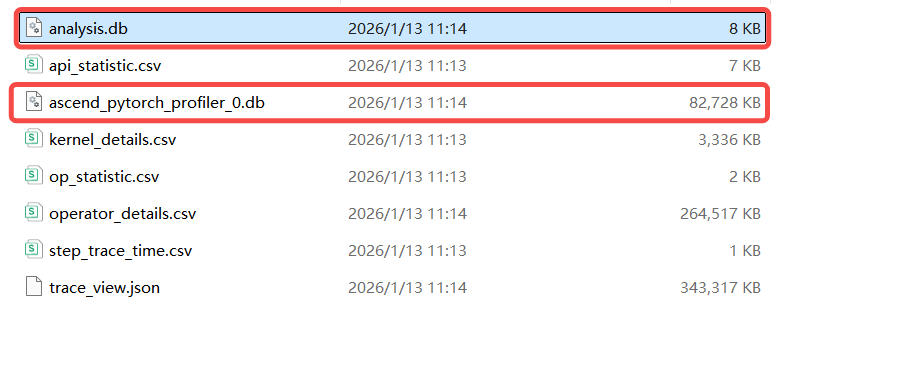

Open the MindStudio Insight visualization software and first import the profile data:

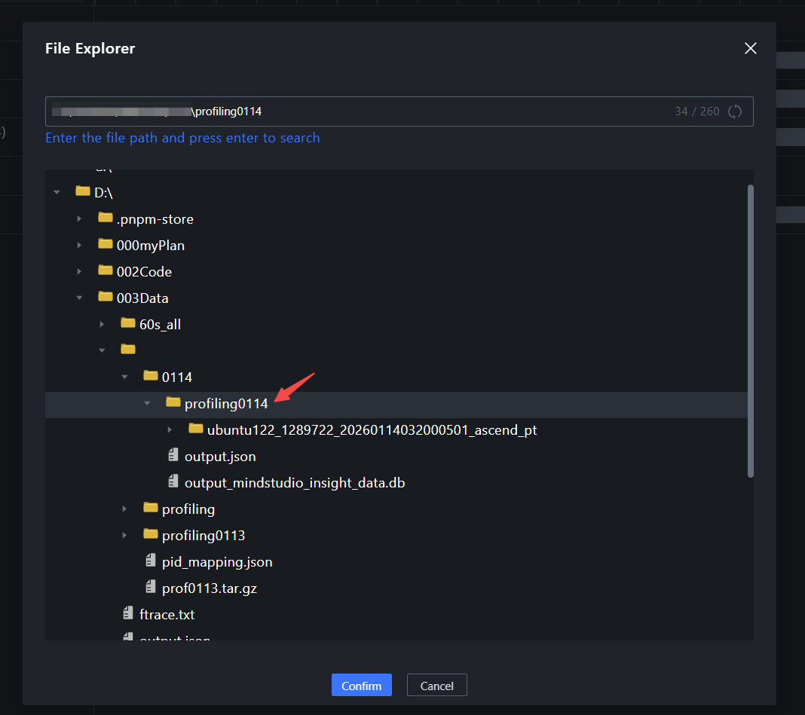

Then, import the ftrace data in the same project:

<div style="display:flex; align-items:flex-start;">
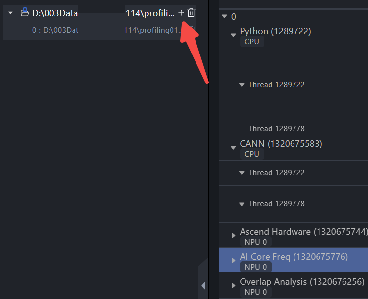
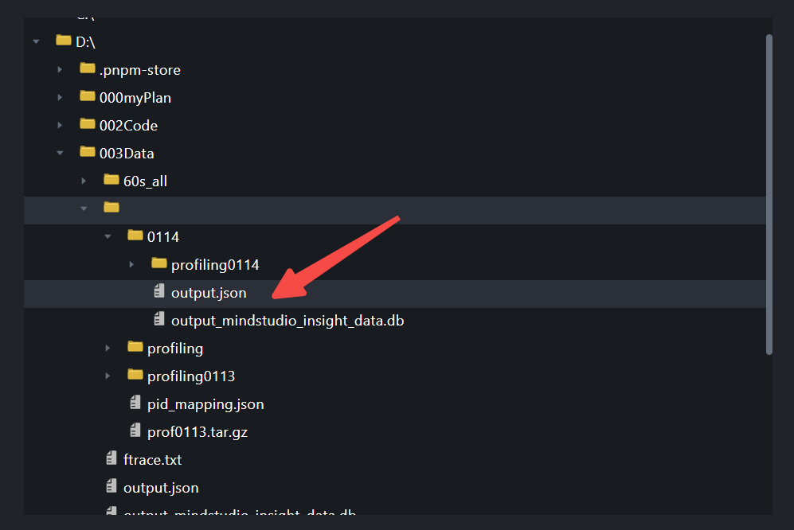
</div>

You can then perform joint analysis of profile data and ftrace data:

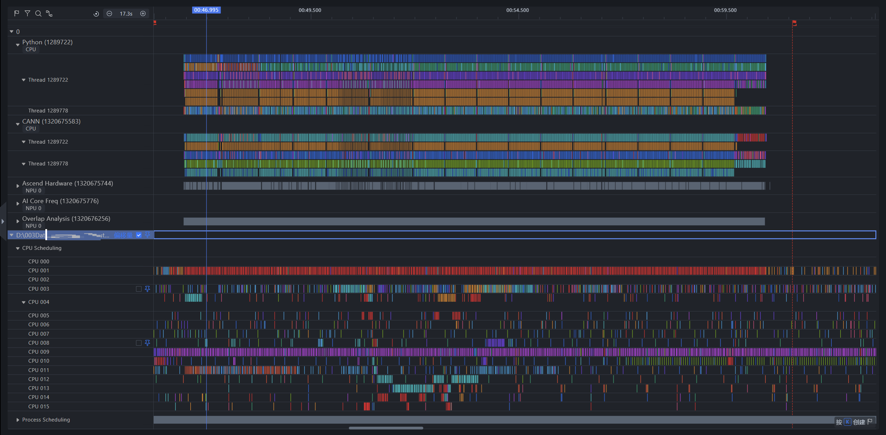

The CPU Scheduling unit allows you to view process scheduling from the CPU perspective.
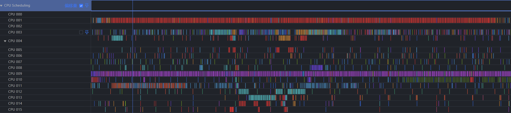

The Process Scheduling unit allows you to view the scheduling status of a specific process.
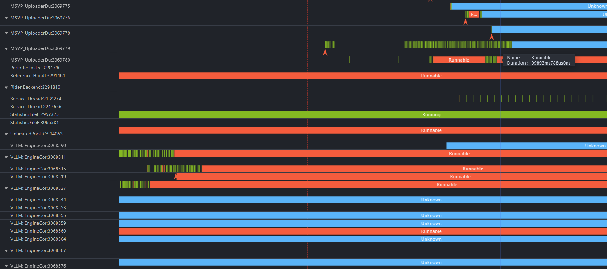

Using the unit pinning feature of MindStudio Insight, you can place the units of interest together for joint analysis.
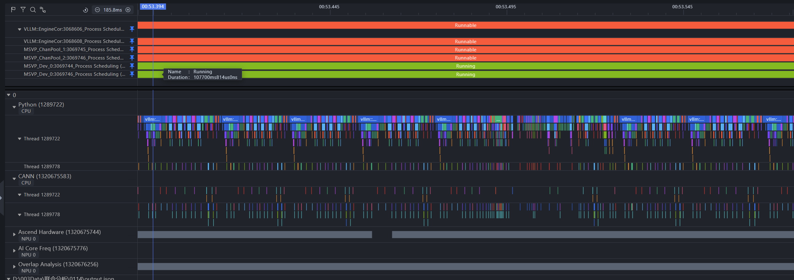

**Joint analysis approach**

Generally, if a dispatch bottleneck is observed in profiling, you can first use the CPU Scheduling unit to observe, at a high level, the hot threads in the dispatch pipeline during that time period, such as the PyTorch main thread, forward operator dispatch, backward operator dispatch, and PTA second-level pipeline dispatch (aclThread), to check whether process preemption or soft interrupts occur. Then, observe the Process Scheduling unit of a specific process to further understand the process state. Finally, based on the analysis results, perform targeted optimization, such as improving the core binding scheme, core isolation, and pipeline optimization.

## tracefs/debugfs Mode Support

Some users' target environments cannot install or use trace-cmd. To cover such scenarios, `trace_record.py` provides a tracefs/debugfs backend that configures ftrace directly through the kernel tracing file system and saves the collection result as a text-format trace file.

### 1. Differences in Starting Collection Commands

trace-cmd mode:

```bash
# // --backend defaults to auto, which automatically prioritizes trace-cmd.
python trace_record.py --record_time=30 --cpu=0-15 --output=trace.dat --NSpid
```

tracefs/debugfs mode:

```bash
# If trace-cmd is not installed, auto automatically falls back to tracefs/debugfs. To force this mode, explicitly specify --backend=debugfs.
python trace_record.py --backend=debugfs --record_time=30 --cpu=0-15 --output=trace.txt --NSpid
```

### 2. Conversion Command Differences

trace-cmd mode:

```bash
python trace_convert.py --input=trace.dat --profiling_data=/path/to/profiling/xxxx_ascend_pt --pid_mapping=pid_mapping.json
```

tracefs/debugfs mode:

```bash
# Explicitly specify --input
python trace_convert.py --input=trace.txt --profiling_data=/path/to/profiling/xxxx_ascend_pt --pid_mapping=pid_mapping.json
```

> The output file of the tracefs/debugfs mode is usually `trace.txt`. If the default file name `trace.dat` still exists in the same directory and `--input=trace.txt` is not explicitly specified during conversion, `trace_convert.py` may read `trace.dat` as the default input, causing the conversion to not target the current tracefs/debugfs collection result.
> `trace_convert.py` exports the DB format by default, and the default output file is `ftrace_data.db`. To export the JSON format, specify `--format=json` and set `--output` to a JSON file path at the same time to avoid inconsistency between the output format and the file extension.

### 3. Performance Efficiency Differences

The tracefs/debugfs backend outputs trace files in text format. The time required to flush data to disk after collection stops and the subsequent parsing time of `trace_convert.py` are affected by the CPU collection scope, event volume, service load, and disk performance. When the collection scope is large or the event volume is high, the time required may increase significantly.

### 4. Collection Result Comparison

Apart from differences in output format and usage, the event scope collected in tracefs/debugfs mode remains consistent with that of trace-cmd mode, and the converted visualization results are generally similar.

#### CPU Scheduling unit comparison

trace-cmd mode:
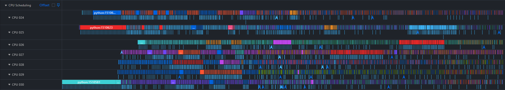

debugfs mode:
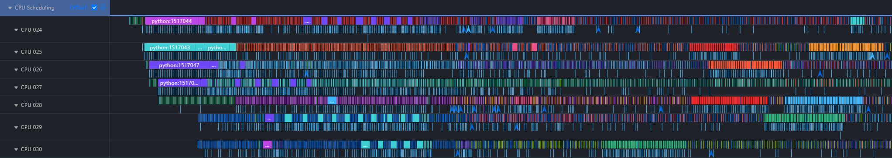

#### Process Scheduling unit comparison

trace-cmd mode:
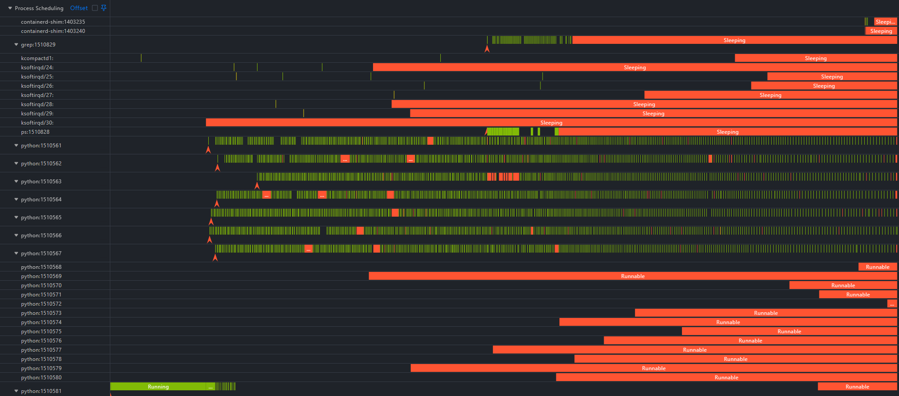

debugfs mode:
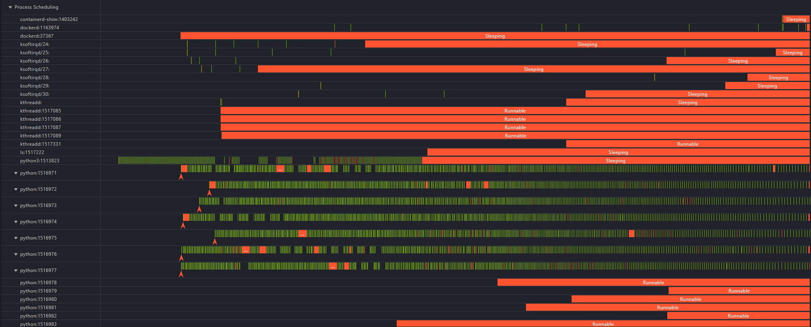

## FAQs

### 1. Joint Import of Profile Data and Ftrace Data Fails with the Error `File Conflict`

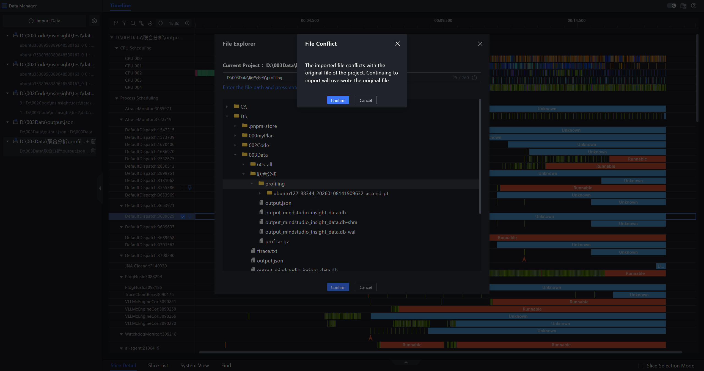

**Answer:**
Mixed display of text-type data and DB-type data is not currently supported. Since ftrace data is exported in DB format by default, if the profile data you import at this time is only of text type, a format conflict will occur.

**Solution**: If profiling is a mixed text and DB scenario, delete the DB deliverables `analysis.db` and `ascend_pytorch_profiler_x.db` in profiling in advance, and use `--format=json` to fall back to JSON format when converting ftrace data.


### 2. Large Blank Areas on Some CPU Cores in ftrace Data After Collection

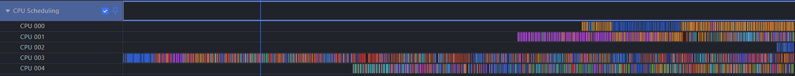

**Possibility 1**: ftrace uses a ring buffer, which means that when the buffer is full, new data overwrites old data. You can adjust the buffer size `buffer_size` in the script `trace_record.py`, for example, adjust it to `--bf_size=4096`. For tracefs/debugfs mode, it is recommended to adjust it to greater than `40960` KB.

In addition, the current script reads the tracefs per-CPU stats when collection stops. If the following warning appears in the log, it indicates that ring buffer overwriting or event loss has been detected during this collection. It is recommended to increase `--bf_size` (preferred), shorten the collection duration, reduce the collected events, or narrow the CPU collection scope, and then collect again.

```bash
tracefs stats report lost/overwritten events before reset: total_loss_counters=123. Consider increasing --bf-size
```

**Possibility 2**: The core has no target events during this period, or it is not actually used by the service (less likely).

### 3. trace-cmd record Stop Timeout

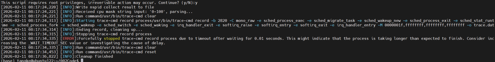
When the amount of collected data is large, the trace-cmd record process takes a long time to clean up, exceeding the preset value range. Appropriately increase the `_INT_INTERVAL_SEC` and `_WAIT_TIMEOUT_SEC` parameters in the `trace_record.py` script.
