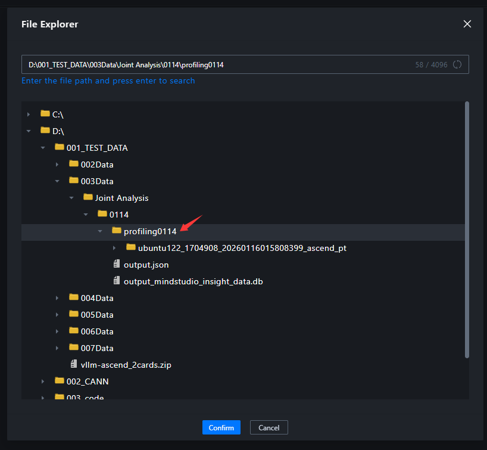
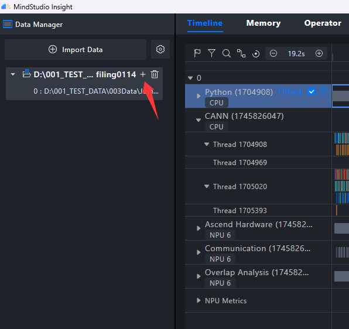
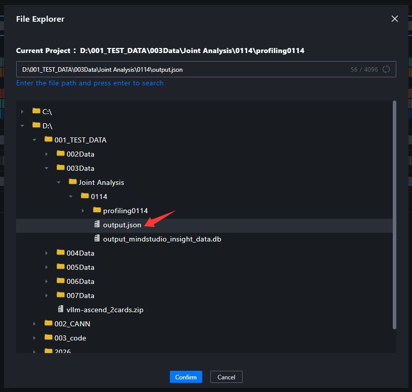
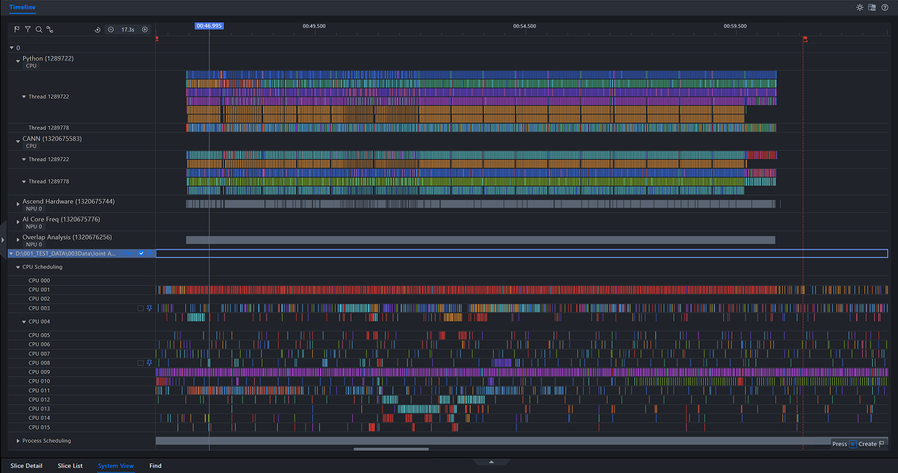
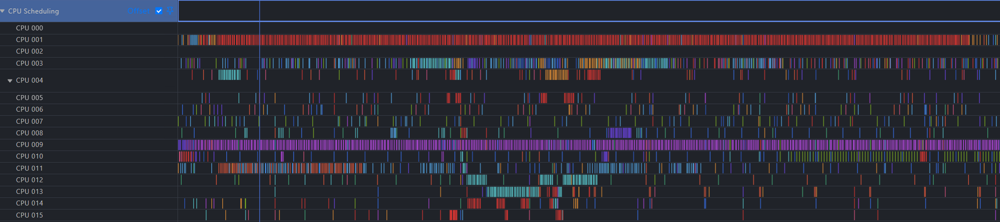
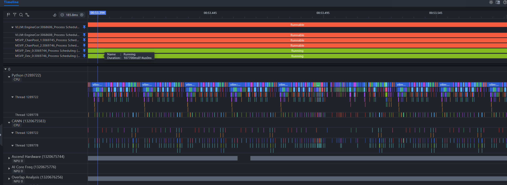

# Joint ftrace and Profiling Analysis Example for vllm-ascend

[Simplified Chinese](vllm_ascend_example.zh-CN.md) | English

This document uses a vllm-ascend offline inference workload running in a Docker container as an example. It shows how to collect ftrace data on the host, import the data into MindStudio Insight together with Profiling data, and perform joint analysis for Host Bound issues.

## 1. Prerequisites

Refer to the official vllm-ascend documentation to obtain the image and start the container:

- vllm-ascend image: <https://quay.io/repository/ascend/vllm-ascend?tab=tags>
- vllm-ascend documentation: <https://docs.vllm.ai/projects/ascend/en/latest/quick_start.html>

Prepare the ftrace tool scripts on the host:

```text
ftrace_tools/
|-- trace_record.py
|-- trace_convert.py
`-- exporters.py
```

If you use the trace-cmd backend, install trace-cmd on the host:

```bash
# Ubuntu
sudo apt-get install trace-cmd

# CentOS
sudo yum install trace-cmd
```

## 2. Configure Profiling and Runtime Environment in the Container

The following environment variables are examples. Adjust them based on your workload.

```bash
# Accelerate model download through ModelScope
export VLLM_USE_MODELSCOPE=True

# Reduce the risk of device memory fragmentation
export PYTORCH_NPU_ALLOC_CONF=max_split_size_mb:256

# Enable vLLM profiling collection
export VLLM_TORCH_PROFILER_DIR="/path/to/profiling/data"

# Example: bind NPU 0 to CPUs 0-15
export CPU_AFFINITY_CONF=2,npu0:0-15
```

Configure CPU affinity based on your workload, NUMA topology, and NPU/CPU affinity relationship.

## 3. Prepare the Inference Script

Example `Qwen3_8B.py`:

```python
from vllm import LLM, SamplingParams

prompts = [
    "Hello, my name is",
    "The future of AI is",
]
sampling_params = SamplingParams(temperature=0.8, top_p=0.95)
llm = LLM(model="Qwen/Qwen3-8B", max_model_len=26240)

llm.start_profile()
outputs = llm.generate(prompts, sampling_params)
llm.stop_profile()

for output in outputs:
    print(f"Prompt: {output.prompt!r}, Generated text: {output.outputs[0].text!r}")
```

## 4. Start ftrace Collection on the Host

If the container is not started with `--pid=host`, enable `--NSpid` to generate the mapping between container PIDs and host PIDs.

```bash
cd /home/xxx/msinsight/scripts/ftrace_tools

# record_time=-1 means continuous collection. Stop it manually with Ctrl+C after the workload finishes.
sudo python trace_record.py --record_time=-1 --cpu=0-15 --NSpid
```

If trace-cmd is unavailable in the target environment, force the debugfs backend:

```bash
sudo python trace_record.py --backend=debugfs --record_time=-1 --cpu=0-15 --output=trace.txt --NSpid
```

## 5. Run the Workload in the Container

Run the inference script in the container while ftrace collection is in progress:

```bash
python Qwen3_8B.py
```

After the workload and Profiling collection are complete, return to the host and stop the ftrace collection process.

After collection, the following files are typically generated:

```text
ftrace_tools/
|-- trace.dat          # Output of the trace-cmd backend. The debugfs backend usually outputs trace.txt.
|-- trace.txt          # Output of the debugfs backend. Use either trace.dat or trace.txt.
|-- pid_mapping.json   # Generated after --NSpid is enabled.
|-- trace_convert.py
`-- trace_record.py
```

The Profiling directory usually looks similar to the following:

```text
profiling/
`-- xxx_ascend_pt/
    |-- ASCEND_PROFILER_OUTPUT
    |-- FRAMEWORK
    |-- logs
    |-- PROF_000001_...
    |-- profiler_info_0.json
    `-- profiler_metadata.json
```

## 6. Convert ftrace Data

It is recommended that you convert the data into a SQLite DB and specify the Profiling directory for timeline alignment:

```bash
cd /home/xxx/msinsight/scripts/ftrace_tools

python trace_convert.py \
  --input=trace.dat \
  --output=ftrace_data.db \
  --format=db \
  --profiling_data=/path/to/profiling/xxx_ascend_pt \
  --pid_mapping=pid_mapping.json
```

If the data was collected with the debugfs backend, explicitly specify `trace.txt`:

```bash
python trace_convert.py \
  --input=trace.txt \
  --output=ftrace_data.db \
  --format=db \
  --profiling_data=/path/to/profiling/xxx_ascend_pt \
  --pid_mapping=pid_mapping.json
```

Note: `--format` must match the suffix of `--output`.

- `--format=db` must output a file ending with `.db`.
- `--format=json` must output a file ending with `.json`.

## 7. Import Data into MindStudio Insight for Joint Analysis

The current version supports importing ftrace DB data and Profiling TEXT/DB data into the same project. The recommended workflow is as follows:

1. Open MindStudio Insight and import the Profiling data directory first.

   

2. Continue importing `ftrace_data.db` into the same project.

   <div style="display:flex; align-items:flex-start;">
   
   
   </div>

3. Analyze the data together with the CPU Scheduling, Process Scheduling, and Profiling timelines.

   

The CPU Scheduling lane shows process scheduling behavior from the CPU perspective.



The Process Scheduling lane shows the scheduling states of specific processes.


Use the lane pinning feature in MindStudio Insight to place lanes of interest together for joint analysis.



Analysis approach:

- First locate the Host Bound or task dispatch bottleneck period in Profiling data.
- Use the CPU Scheduling lane to review hot threads, preemption, and IRQ/SoftIRQ activity in the corresponding time range.
- Use the Process Scheduling lane to inspect Running, Runnable, and Sleeping state changes of key processes.
- Use the findings to adjust CPU affinity, CPU isolation, pipeline concurrency, or memory allocation strategies.

## 8. Notes

- It is recommended that no more than 64 CPU cores be collected and that the collection duration be around 30 seconds. Long collection periods or large CPU ranges may produce large files and slow conversion.
- If the collection log reports lost or overwritten events, the ring buffer was overwritten or events were lost. Increase `--bf_size` or narrow the collection scope.
- In container scenarios, enable `--NSpid`. Otherwise, host PIDs in ftrace may not align with container PIDs in Profiling data.
- The debugfs backend usually outputs `trace.txt`. Do not forget to specify `--input=trace.txt` during conversion.
